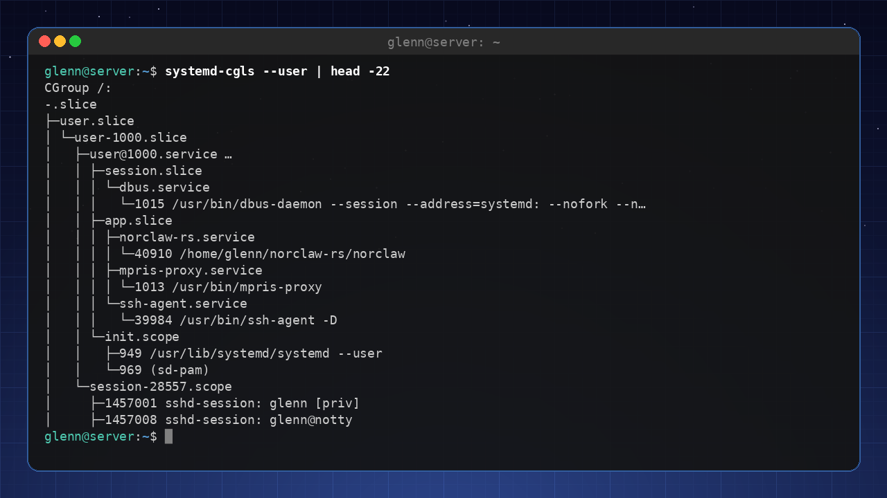
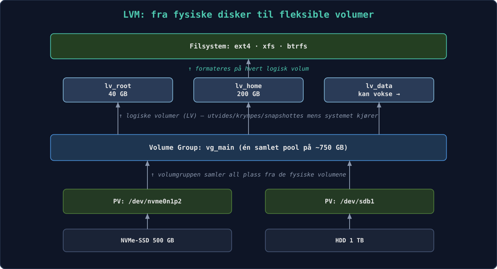
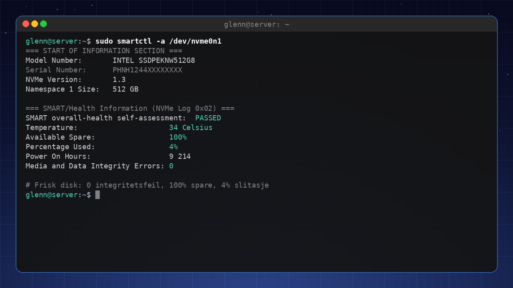
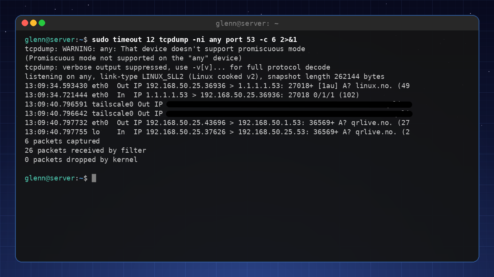
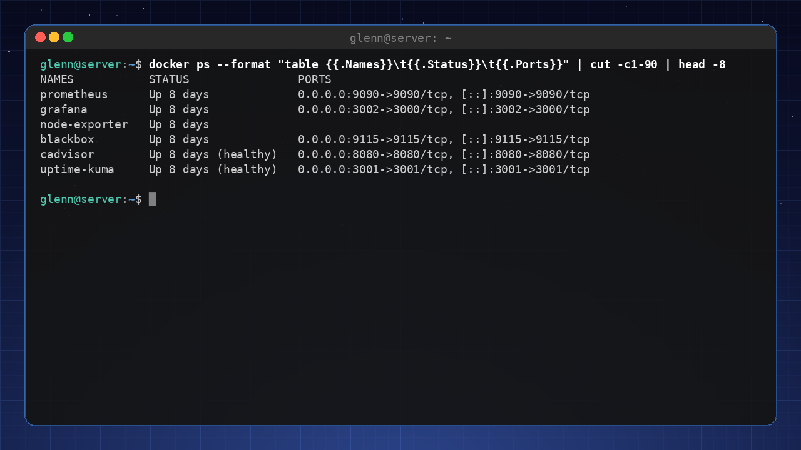
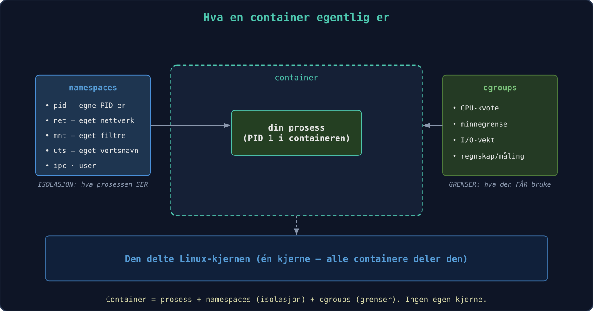
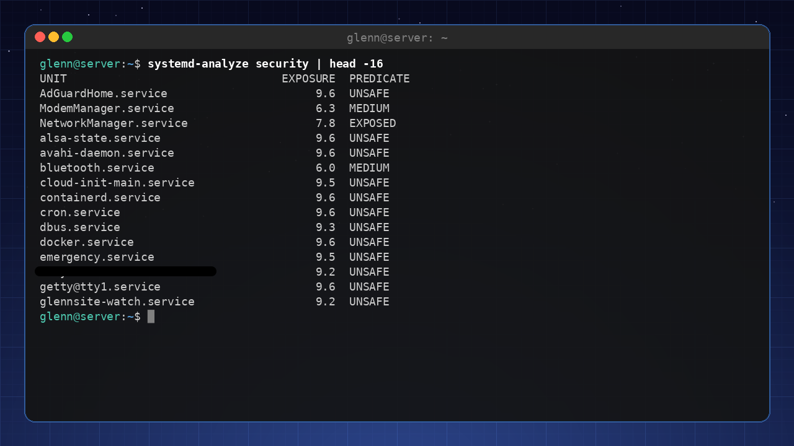

# Linux for Eksperter 2027

**Tredje bok i serien – for deg som vil mestre systemet på kildenivå og drifte egen infrastruktur som en proff.**

*Samlet utgave – alle kapitler i én fil. Generert 2026-08-02.*

## Innhold

- Forord
- 1. Kjernen
- 2. Prosesser, signaler og cgroups
- 3. Minne og ytelse
- 4. Røntgensyn: strace, lsof og perf
- 5. Lagring på alvor
- 6. Python for systemadministratorer
- 7. Ansible
- 8. Egen Git-server og CI/CD hjemme
- 9. 🟡 NixOS
- 10. Nettverk på ekspertnivå
- 11. Reverse proxy og TLS overalt
- 12. Overvåking og varsling
- 13. Containere på dypet
- 14. Virtualisering og hjemmelab-arkitektur
- 15. Sikkerhet på alvor
- 16. Feilsøking uten sikkerhetsnett
- 17. Den dagen skrivebordet ikke starter
- 18. Pakk og del programvaren din
- 19. 🔴 Linux From Scratch
- 20. Gi tilbake
- 21. Å fortsette reisen
- Bonus: FAQ for eksperter
- Vedlegg A: Utvidet hurtigreferanse
- Vedlegg B: Ordliste for eksperter
- Vedlegg C: Referansearkitektur for hjemmelabben
- Vedlegg D: Mesterprøven


---

# Forord

**Tredje bok i serien – for deg som forstår systemet ditt og nå vil mestre det på kildenivå, og drifte egen infrastruktur som en proff.**

Du har fullført *Linux for Viderekommende* (eller tilsvarende): du er hjemme i terminalen, skripter med god samvittighet, kjører tjenester på en hjemmeserver og bruker Git daglig. Denne boken tar det siste steget – fra «forstår Linux» til «kan forklare, feilsøke og bygge alt».

**Hva denne boken IKKE er:** sertifiseringspensum (LPIC/RHCSA), enterprise-drift for store organisasjoner, eller programmeringskurs. Bevisst utelatt er også SELinux i dybden, rått WireGuard-oppsett (dekket i bok 2), Kubernetes i produksjonsdrift og immutable distroer – avgrensning, ikke forglemmelse. Det er fortsatt en bok for entusiasten – men nå med hele maskineriet åpent.

**Den røde tråden:** Gjennom boken bygger du ut **hjemmelabben** din til et komplett, overvåket, automatisert og herdet miljø – beskrevet som kode, slik at hele oppsettet kan gjenskapes med én kommando.

Velkommen til den tredje boken. Du har allerede oppdaget at Linux ikke er et operativsystem du «kan», men et verksted du blir stadig bedre kjent med. Nå skal vi åpne alle dørene.

«Ekspert» betyr her ikke at du husker alle flagg til `tar` eller kan sitere `man`-sider utenat. Det betyr at du har utviklet en intuisjon for hvordan systemet henger sammen, og at du kan *resonnere* deg frem til løsninger på problemer du aldri har sett før. Du skal lære å stille de riktige spørsmålene til maskinen – og å forstå svarene.

Boken er bygget rundt **hjemmelabben** din. Den starter som et par maskiner og noen containere, og vokser gjennom kapitlene til et fullverdig, overvåket og selvhelbredende miljø. Det viktigste er likevel ikke sluttresultatet, men alle beslutningene og forståelsen du tilegner deg underveis. Fra kapittel 7 og utover blir alt du gjør versjonshåndtert og automatisert – målet er at du på siste side kan gjenskape hele labben med én enkelt kommando.

Vi holder oss til den samme vennlige tonen som i de tidligere bøkene. Du vil finne «Prøv selv»-oppgaver, og utfordrende partier er merket 🟡 (anbefalt smak) eller 🔴 (valgfri finale). Kapitlene følger en fast mal, men prinsippene går foran installasjonsmanualer. Verktøy endrer seg, forståelse består. Det gjelder også versjonsnumrene i boken – kjerner, image-tags, distroversjoner – som er slik de var da boken ble skrevet; prinsippene står seg selv om tallene rykker frem.

Tre nye grep skiller denne boken fra de forrige:

**«Mål først».** Fra nå av gjelder én regel for all tuning: *aldri juster noe du ikke har målt*. Entusiasten setter `vm.swappiness=10` fordi en bloggpost sa det; eksperten måler før og etter. Verktøyene får du underveis: `fio` for disk, `iperf3` for nettverk, `hyperfine` for kommandoer.

**«Anatomi av en hendelse».** Hver del avsluttes med en ekte feilsøkingshistorie, fortalt slik den utspiller seg: symptom → hypoteser → kommandoer → funn → lærdom. Verktøy kan slås opp – det er resonneringen som gjør deg til ekspert.

**Mesterprøven.** Bakerst i boken (vedlegg D) venter ti oppgaver der noe *er* galt i labben din – plantet med vilje av en sabotasje-playbook. Ingen fasit før du har prøvd.

## Hva du trenger

| Nivå | Utstyr | Holder til |
|------|--------|-----------|
| **Minimum** | Én maskin med 16 GB RAM og VM-er | Alt i boken – hele labben kan være virtuell |
| **Anbefalt** | PC + én labbmaskin (gammel PC eller Pi) | Mer realistisk nettverk og drift |
| **Luksus** | Egen hypervisor-vert + Pi + NAS | Referansearkitekturen i vedlegg C |

Du klarer deg altså med maskinen du har. Tidsmessig: Del 1 og 2 er kveldsstoff (2–4 timer per kapittel), Del 3 er helgeprosjekter, og Del 4 tar du når krisene (eller nysgjerrigheten) melder seg. Labbens byggetrinn kapittel for kapittel finner du i vedlegg C.

**Testet på:** Kommandoer og pakkenavn i boken er verifisert mot Debian 13 og Ubuntu 24.04-baserte systemer (inkludert Linux Mint 22). Der distroene skiller lag, sier teksten fra. (Eksempelutskrifter – kjerneversjoner, pakkeversjoner og lignende – varierer med distro og tidspunkt, så ikke bli urolig om dine tall avviker fra bokens.) Bruker du noe annet, er avvikene små – og nå har du verktøyene til å finne dem. Vi skriver `apt` hele veien; på Fedora heter det `dnf`, på Arch `pacman` – på ditt nivå er den oversettelsen triviell (distro-safarien i bok 2 ga deg kartet).

Nå er det på tide å se hva som virkelig foregår under panseret.

---

# 1. Kjernen – motoren du aldri ser

*Del 1: Systemet på dypet*

**I dette kapittelet lærer du:**

- Kjernemoduler: laste, fjerne og svarteliste – og hvorfor `modprobe` nesten alltid slår `insmod`.
- Modulparametere: justere en driver med `modinfo -p` og `options`-linjer, uten å kompilere noe.
- Initramfs: mini-systemet som booter maskinen din – hva som må ligge der, og hvordan du unngår å ødelegge det.
- Kjerneparametere i sanntid med `sysctl` – og kjernens kommandolinje i GRUB, systematisk.
- Forskjellen på en oops og en panikk, kdump i korte trekk, og Magic SysRq som siste utvei.
- Hva Secure Boot betyr for tredjepartsmoduler – kunnskapen bak mang en svart skjerm.
- 🔴 Valgfritt: kompilere din egen kjerne – med realistiske advarsler og sikkerhetsnett.

---

Linux-kjernen er den første koden som kjører etter bootloaderen, og den siste som gir slipp når maskinen slås av. For de fleste er den et usynlig lag – du merker den bare når noe går galt. I dette kapittelet gjør vi kjernen synlig. Underveis møter du et prinsipp som følger deg gjennom hele boken: **alt er en fil**. Kjernens innstillinger, modulenes parametere, til og med nødbremsen som kan restarte en frossen maskin – alt ligger som lesbare og skrivbare filer under `/proc` og `/sys`.

## 1.1 Kjernemoduler

Kjernen er modulær. Drivere og filsystemstøtte lastes ved behov. Med `lsmod` ser du hvilke moduler som er aktive, og med `modprobe` kan du laste eller fjerne dem manuelt. Moduler ligger under `/lib/modules/$(uname -r)/`. Når du kobler til en USB-disk, laster udev automatisk `usb-storage` og `ext4` (eller hva disken er formatert med).

Start med å finne ut hvilken modul som driver din egen maskinvare:

```bash
lspci -k | grep -A3 -i network   # «Kernel driver in use:» er svaret
lsmod | grep <driver>            # og der er den, med hvem som bruker den
```

Du kan svarteliste moduler du ikke vil ha – for eksempel en problematisk Wi-Fi-driver – med en fil i `/etc/modprobe.d/`:

```bash
# /etc/modprobe.d/blacklist-pcspkr.conf
blacklist pcspkr
```

Merk nyansen: `blacklist` hindrer bare *automatisk* lasting via maskinvare-alias. Vil du forby modulen helt, også når noe ber om den ved navn, bruker du den harde varianten `install pcspkr /bin/false` – da «lykkes» lasting uten at noe skjer.

Og prøver du å fjerne en modul som er i bruk (`sudo modprobe -r snd_hda_intel`), får du sannsynligvis «Module is in use» – PipeWire holder den. Den feilmeldingen er i seg selv lærerik: kjernen nekter å fjerne moduler noen er avhengige av.

## 1.2 Modulparametere – juster driveren uten å kompilere

De fleste moduler har justerbare parametere – brytere og verdier utvikleren har eksponert. `modinfo -p` lister dem med forklaring:

```bash
modinfo -p snd_hda_intel | head -5
```

```
power_save:Automatic power-saving timeout (in second, 0 = disable). (int)
power_save_controller:Reset controller in power save mode. (bool)
enable_msi:Enable Message Signaled Interrupt (MSI) (bint)
...
```

Gjeldende verdier ligger – selvsagt – som filer, under `/sys/module/<modul>/parameters/`:

```bash
cat /sys/module/snd_hda_intel/parameters/power_save
```

Noen av disse filene er skrivbare og kan endres i sanntid; andre leses bare ved modul-lasting. Den permanente veien er en `options`-linje i `/etc/modprobe.d/`:

```bash
# /etc/modprobe.d/audio.conf
options snd_hda_intel power_save=1
```

Neste gang modulen lastes (i praksis: neste oppstart), gjelder parameteren. Dette er verktøyet når internett sier «sett `options iwlwifi 11n_disable=8` for å fikse den ustabile Wi-Fi-en» – nå vet du *hva* du faktisk gjør, og kan sjekke med `modinfo -p iwlwifi` hva bryteren betyr. For moduler som er kompilert *inn* i kjernen (ikke lastbare), settes det samme som `modul.parameter=verdi` på kjernens kommandolinje – den kommer vi til i 1.6.

## 1.3 modprobe vs. insmod – avhengigheter løses ikke av seg selv

Moduler avhenger av hverandre: `ext4` trenger `mbcache` og `jbd2`, mange nettverksdrivere trenger felles hjelpebiblioteker. Kartet over avhengighetene ligger i `/lib/modules/$(uname -r)/modules.dep` og bygges av `depmod`:

```bash
modprobe --show-depends ext4     # hva ville modprobe lastet, i rekkefølge?
```

```
insmod /lib/modules/6.8.0-134-generic/kernel/lib/crc16.ko
insmod /lib/modules/6.8.0-134-generic/kernel/fs/mbcache.ko
insmod /lib/modules/6.8.0-134-generic/kernel/fs/jbd2/jbd2.ko
insmod /lib/modules/6.8.0-134-generic/kernel/fs/ext4/ext4.ko
```

Der ser du hele arbeidsdelingen: `insmod` er lavnivåverktøyet som laster *én* .ko-fil, uten å vite noe om avhengigheter eller `/etc/modprobe.d/`. `modprobe` er sjefen som slår opp i `modules.dep`, laster alt i riktig rekkefølge og respekterer svartelister og `options`-linjer. Derfor er `insmod` nesten aldri riktig valg – kjører du den på en modul med udekkede avhengigheter, får du kryptiske «Unknown symbol»-feil i `dmesg`. Det ene stedet `insmod` hører hjemme: når du utvikler en modul selv og vil laste den ferske .ko-filen din direkte fra byggekatalogen.

Har du kopiert en modulfil inn under `/lib/modules/` manuelt (det skjer, f.eks. med en driver fra en leverandør), må du oppdatere kartet før `modprobe` finner den:

```bash
sudo depmod -a
```

Pakker og DKMS gjør dette for deg – det er derfor du sjelden tenker på det.

## 1.4 Initramfs – mini-systemet før systemet

Her er et høna-og-egget-problem: kjernen trenger disk-driveren og filsystemmodulen for å montere rotfilsystemet – men modulene ligger *på* rotfilsystemet. Løsningen er **initramfs**: et lite, komprimert arkiv med akkurat de modulene og verktøyene som trengs for å komme seg til rot. Bootloaderen laster både kjernen og initramfs inn i minnet; kjernen pakker ut arkivet som et midlertidig rotfilsystem i RAM, kjører et lite skript som laster moduler, finner rotdisken (låser eventuelt opp kryptering, aktiverer LVM/RAID) – og bytter så til det ekte rotfilsystemet.

Hva *må* ligge der? Alt som står mellom kjernen og rotfilsystemet:

- Driveren for diskkontrolleren (`nvme`, `ahci`, `virtio_blk` i VM-er).
- Filsystemmodulen for rot (`ext4`, `btrfs` …).
- `dm-crypt`-moduler og verktøy hvis rot er kryptert – pluss tastaturdriver, ellers får du ikke skrevet passordfrasen!
- LVM- eller mdadm-støtte hvis rot ligger der (kapittel 5).

Se selv hva som ligger i din:

```bash
lsinitramfs /boot/initrd.img-$(uname -r) | grep -E 'nvme|ext4|dm-crypt'
```

Initramfs bygges av `update-initramfs` og må bygges på nytt når forutsetningene endres – ny disk-kontroller, endret `/etc/crypttab`, eller en `options`-/`blacklist`-linje i `/etc/modprobe.d/` som skal gjelde allerede under boot:

```bash
sudo update-initramfs -u          # oppdater for kjørende kjerne
sudo update-initramfs -u -k all   # for alle installerte kjerner
```

**Hvis du bruker Fedora/Arch:** samme jobb gjøres av `dracut` (Fedora) og `mkinitcpio` (Arch, konfigurert via `HOOKS=(...)` i `/etc/mkinitcpio.conf`). Prinsippet – og feilmodusene – er identiske.

**Og når det går galt?** Mangler en nødvendig modul, finner ikke kjernen rotfilsystemet. Etter et tidsavbrudd lander du i initramfs-ets nødskall – en spartansk BusyBox-prompt:

```
Gave up waiting for root file system device.
(initramfs) _
```

Det ser ut som verdens ende, men er faktisk et *verktøy*: du kan liste enheter med `ls /dev`, laste moduler manuelt med `modprobe` og montere rot for hånd. Hele redningsprosedyren – inkludert chroot fra live-USB for å kjøre `update-initramfs` på nytt – er tema i kapittel 16.

⚠️ **En ødelagt initramfs = en maskin som ikke booter.** Derfor: ikke slett gamle kjerner i det øyeblikket en ny er installert. GRUB beholder forrige kjerne (med sin egen, fungerende initramfs) under «Advanced options» – det er sikkerhetsnettet ditt. Test alltid at ny kjerne booter *før* du rydder bort den gamle.

## 1.5 Kjerneparametere og sysctl

Kjernens oppførsel kan justeres i sanntid via `/proc/sys/`. Verktøyet `sysctl` gir deg en ryddig vei til disse. Skriv `sysctl -a` og la deg fascinere – her finner du alt fra nettverksinnstillinger (`net.core.somaxconn`) til minnehåndtering (`vm.swappiness`). Punktumene i navnet er bokstavelig talt katalogskiller: `vm.swappiness` *er* filen `/proc/sys/vm/swappiness`, og `cat` og `echo` fungerer like godt som `sysctl`. Ved å legge linjer i `/etc/sysctl.d/` gjør du endringer permanente (`sudo sysctl --system` laster dem på nytt uten omstart).

Typiske parametere du vil justere på en server:
- `vm.swappiness=10` – gjør at systemet holder seg unna swap så lenge som mulig (hele historien om swap og minne kommer i kapittel 3).
- `net.ipv4.ip_forward=1` – slår på ruting (du trenger den i kapittel 10).
- `kernel.sysrq=1` – aktiverer Magic SysRq for nødgjenoppretting (se 1.7).


## 1.6 Kjernens kommandolinje – GRUB, e-tasten og /proc/cmdline

Bootloaderen (GRUB) sender kommandolinjeargumenter til kjernen. Du har kanskje brukt `nomodeset` for å få grafikk til å fungere. De permanente parameterne ligger i `/etc/default/grub` under `GRUB_CMDLINE_LINUX_DEFAULT`; etter endring kjører du `sudo update-grub`. Med `quiet` og `splash` fjerner du mesteparten av oppstartsmeldingene – men som ekspert lar du dem gjerne være av, for å fange opp feil mens de skjer.

Fasiten – hva kjernen *faktisk* fikk ved denne oppstarten – står alltid i:

```bash
cat /proc/cmdline
```

```
BOOT_IMAGE=/boot/vmlinuz-6.8.0-134-generic root=UUID=3f1c... ro quiet splash
```

Sjekk den før du feilsøker «hvorfor virker ikke parameteren min?» – ofte er svaret at den aldri kom med (glemt `update-grub`, eller feil variabel i `/etc/default/grub`).

> **Ikke alle booter med GRUB: systemd-boot og UKI.** En økende andel systemer – Pop!_OS, enkelte Fedora-varianter, mange Arch-oppsett – bruker **systemd-boot** i stedet. Den leser oppføringene sine rett fra ESP-partisjonen; `bootctl list` viser dem, og `bootctl status` viser hvilken bootloader du faktisk har. Her finnes ingen `update-grub` å glemme: kjernepakker legger inn oppføringer via `kernel-install`, og kommandolinjen ligger som klartekst i oppføringsfilene på ESP-en. Neste steg i samme utvikling er **Unified Kernel Images (UKI)**: kjerne, initramfs og kommandolinje pakket i *én* EFI-binær som kan signeres under ett – noe som spiller svært godt sammen med Secure Boot (1.8). Redningsteknikkene i kapittel 16 gjelder uansett; det er bare bootloader-reparasjonen som er annerledes (`bootctl install` i stedet for `grub-install`). Og `/proc/cmdline` er fasiten uansett bootloader.

**Midlertidig redigering – ekspertens favorittknep:** I GRUB-menyen (hold Shift eller trykk Esc under oppstart hvis menyen er skjult) trykker du `e` på en oppføring, redigerer linjen som starter med `linux`, og booter med Ctrl+X. Endringen gjelder *kun denne ene oppstarten* – perfekt for eksperimenter, og helt ufarlig: neste boot er alt som før.

Parametere som er verdt å kunne utenat:

| Parameter | Gjør | Når |
|-----------|------|-----|
| `nomodeset` | Skrur av kjernens grafikkoppsett | Svart skjerm under boot (kapittel 17) |
| `systemd.unit=rescue.target` | Boot til enbruker-modus med rot-skall | Feilsøking av tjenester som henger boot |
| `systemd.unit=emergency.target` | Enda mer minimalt – knapt noe montert | Ødelagt `/etc/fstab` |
| `init=/bin/bash` | Hopp over systemd helt – rett i et skall | Glemt root-passord, totalhavarert init |
| `console=ttyS0,115200` | Konsoll på seriellport | Hodeløse labbservere og VM-er (`virsh console`!) |
| `mitigations=off` | Skrur av CPU-sårbarhetstiltak | ⚠️ Se under |

`init=/bin/bash` fortjener en fotnote: du lander i et skall der rot er montert *skrivebeskyttet* og ingenting annet kjører – husk `mount -o remount,rw /` før du endrer noe, og `sync` før du tvinger omstart. Kapittel 16 bruker dette som ett av redningsverktøyene.

⚠️ `mitigations=off` gir målbart mer ytelse på eldre CPU-er ved å skru av beskyttelsen mot Spectre/Meltdown-klassens sårbarheter. På en isolert labbmaskin kan det være et bevisst valg – på alt som kjører fremmed kode (nettleser! containere med andres images!) er det en dårlig idé. Trusselmodell-tenkningen som avgjør slikt kommer i kapittel 15.

## 1.7 Oops, panikk og Magic SysRq

To ord blandes ofte, og forskjellen er viktig:

En **oops** er kjernens «unntak»: den traff en bug (typisk null-peker i en driver), skriver en feilrapport til loggen, dreper prosessen som var involvert – og *fortsetter å kjøre*. Du finner den i `sudo dmesg` eller `journalctl -k`, gjenkjennelig på «Oops:» eller «BUG:» fulgt av en «Call Trace». Etter en oops er kjernen merket **tainted** og i ukjent forfatning: lagre loggene, planlegg en omstart – men du rekker å avslutte pent.

En **kjernepanikk** er når kjernen ikke kan fortsette uten å risikere datakorrupsjon – ofte en oops på et sted der det ikke finnes noen prosess å ofre (avbruddskontekst), eller at rotfilsystemet aldri lot seg montere. Da fryser alt, med en dump på skjermen. Slik leser du den viktigste linjen:

```
RIP: 0010:usb_submit_urb+0x1f/0x5a0 [usbcore]
```

`RIP` er instruksjonspekeren: krasjet skjedde i funksjonen `usb_submit_urb`, 0x1f byte inn i den, og modulnavnet i klammer – `[usbcore]` – er hovedmistenkt. Funksjonsnavnene slås opp automatisk mot kjernens symboltabell (`/proc/kallsyms` på et kjørende system, filen `System.map-$(uname -r)` i `/boot`). Står det en tredjepartsmodul i klammene (`[nvidia]`, `[zfs]`), har du nesten alltid synderen. Ingen klammer betyr kjernens egen kode – da er defekt maskinvare (RAM!) statistisk sett vanligste årsak, ikke en kjernebug.

**kdump – obduksjon i stedet for gjetning:** Panikkskjermen rekker du sjelden å lese, og den overlever ikke omstart. `kdump` løser det med `kexec`: en reserve-kjerne ligger klar i et avsatt minneområde (parameteren `crashkernel=` på kommandolinjen – på Debian/Ubuntu setter `kdump-tools` den automatisk for deg), og ved panikk starter *den* – uten omstart av maskinvaren – og skriver et minnebilde til `/var/crash/`:

```bash
sudo apt install kdump-tools     # svar ja til å aktivere
kdump-config show                # «ready to kdump» er målet
```

For hjemmelabben er selve dump-analysen (verktøyet `crash`) sjelden verdt bryet – men *at* dumpen finnes, med loggen fra panikkøyeblikket i `dmesg`-filen ved siden av, gjør «maskinen restartet i natt» til et løsbart mysterium i stedet for et frustrerende ett.

**Magic SysRq – nødbremsen:** Når maskinen virker frossen, lytter kjernen ofte fortsatt på ett nivå under alt annet: tastekombinasjonen Alt+SysRq (SysRq deler som regel tast med PrtSc) pluss en kommandobokstav. Hva som er lov styres av `kernel.sysrq` – en bitmaske der `1` betyr «alt» og f.eks. `176` (vanlig standard) bare tillater sync, remount og reboot. Sett `kernel.sysrq=1` i `/etc/sysctl.d/` på labbmaskiner.

Klassikeren er sekvensen **REISUB** (hold Alt+SysRq, trykk bokstavene med et par sekunders mellomrom): **R**aw (ta tastaturet tilbake fra grafikkmiljøet), t**E**rm (SIGTERM til alle – kapittel 2 forklarer hvorfor TERM før KILL), k**I**ll (SIGKILL til resten), **S**ync (skriv buffere til disk), **U**mount (remonter alt skrivebeskyttet), re**B**oot. Det er en *kontrollert* nødlanding – i motsetning til strømknappen, som er å hoppe uten fallskjerm for filsystemene.

Og fordi alt er en fil: samme kommandoer kan sendes via `/proc/sysrq-trigger` – uvurderlig når du er inne via SSH på en maskin der lokalkonsollen er død:

```bash
echo s | sudo tee /proc/sysrq-trigger   # sync
echo b | sudo tee /proc/sysrq-trigger   # umiddelbar reboot – INGEN sync først, gjør s og u selv!
```

## 1.8 Secure Boot og signerte moduler

Én mekanisme forklarer forbausende mange «driveren installerte fint, men virker ikke»-mysterier: **UEFI Secure Boot**. Med Secure Boot på starter fastvaren bare bootloadere som er kryptografisk signert; distroens shim og kjerne er signert, og kjernen går i *lockdown*-modus – den nekter å laste **usignerte moduler**. Sjekk din egen status:

```bash
mokutil --sb-state                          # SecureBoot enabled/disabled
sudo dmesg | grep -i 'secure boot\|lockdown'
```

For alt som kommer fra distroens pakkelager er dette usynlig – modulene er signert med distroens nøkkel. Problemet er **tredjepartsmoduler bygget lokalt via DKMS**: NVIDIA-driveren, VirtualBox, ZFS. De bygges på din maskin og kan umulig være forhåndssignert. Løsningen er **MOK** (Machine Owner Key): en nøkkel *du* eier, som du melder inn i fastvaren med `mokutil`, og som DKMS deretter signerer modulene med. Debian/Ubuntu/Mint setter opp dette halvautomatisk: under installasjonen av en DKMS-pakke blir du bedt om et engangspassord, og ved neste oppstart dukker en blå «MOK Manager»-skjerm opp – **ikke hopp over den**; velg «Enroll MOK» og oppgi passordet. Hopper du over, er symptomet klassisk:

```bash
sudo modprobe nvidia
# modprobe: ERROR: could not insert 'nvidia': Key was rejected by service
```

Modulen er perfekt bygget – kjernen nekter bare å stole på den. Alternativene er å melde inn nøkkelen i etterkant (`mokutil --import /var/lib/dkms/mok.pub` eller distroens variant – stien varierer, så finn din med `sudo find /var/lib -name 'mok*' 2>/dev/null` – deretter omstart og MOK Manager) eller å skru av Secure Boot i fastvaren – et helt legitimt valg på en labbmaskin, men en avveining du bør ta bevisst (kapittel 15). Hele dramaet «NVIDIA-driver + Secure Boot = svart skjerm» får sin praktiske behandling i kapittel 17 – nå vet du allerede *hvorfor* det skjer.

## 1.9 🔴 Valgfri finale: Kompiler din egen kjerne

Dette er mer dannelsesreise enn nødvendighet. Når du starter opp med en kjerne du selv har satt sammen, forsvinner mye av mystikken – og du får en uvurderlig forståelse av hvilke komponenter som faktisk utgjør en kjerne. Men la oss være ærlige om hva du gir avkall på først:

- **Distro-patchene:** Distroens kjerne er ikke vaniljekjernen fra kernel.org – den har hundrevis av patcher (maskinvarefikser, AppArmor-oppsett, tilbakeporterte sikkerhetsfikser). Din egen bygde kjerne har dem ikke.
- **Sikkerhetsoppdateringer:** Distroens kjerne oppdateres av `apt`; din vedlikeholder du selv – eller lar den råtne.
- **Secure Boot:** Din egenbygde kjerne er usignert. Med Secure Boot på booter den rett og slett ikke – du må enten signere den med din MOK-nøkkel (se 1.8) eller skru av Secure Boot mens du eksperimenterer.

Derfor: gjør dette i en VM, eller på labbmaskinen der forrige kjerne uansett står klar i GRUB.

Selve konfigurasjonen er halve læringen, og her finnes tre veier:

- `make menuconfig` – det interaktive menysystemet. Fascinerende å *utforske*, men å svare fornuftig på 12 000 valg fra bunnen av er urealistisk.
- `make oldconfig` – start fra en eksisterende konfig (kopier distroens: `cp /boot/config-$(uname -r) .config`) og bli bare spurt om *nye* valg. Den fornuftige standardveien.
- `make localmodconfig` – som oldconfig, men skrur av alle moduler som ikke er *lastet akkurat nå*. Byggetiden stuper (minutter i stedet for timer) – men plugg inn USB-tingene dine først, ellers bygger du en kjerne uten støtte for dem.

```bash
sudo apt build-dep linux                       # byggeverktøyene
tar xf linux-6.x.tar.xz && cd linux-6.x        # nyeste stabile fra kernel.org
cp /boot/config-$(uname -r) .config            # start fra distroens konfig
make olddefconfig                              # som oldconfig, men tar standardsvar på alt nytt
make -j$(nproc)                                # kaffe. mye kaffe. (localmodconfig: én kopp)
sudo make modules_install install              # legger kjerne+initramfs i /boot og kjører update-grub
```

(`linux-6.x` er en plassholder – hent nyeste stabile fra kernel.org, 6.x-serien, og velg gjerne siste LTS hvis du vil slippe å oppgradere ofte.)

Det siste steget er viktigere enn det ser ut: `make install` *legger til* den nye kjernen i GRUB – den erstatter ingenting. Distrokjernen din ligger fortsatt under «Advanced options» som fallback, med sin egen initramfs. Booter den nye kjernen ikke (og det gjør den gjerne ikke på første forsøk – det er halve poenget), velger du bare den gamle og prøver igjen. Samme sikkerhetsnett som i 1.4: **slett aldri en fungerende kjerne før etterfølgeren har bevist seg.**

---

**Prøv selv:**

1. Finn driveren til nettverkskortet ditt med `lspci -k`, og se den i `lsmod`. Last og fjern deretter en *ufarlig* modul: `sudo modprobe pcspkr && sudo modprobe -r pcspkr`, og se hendelsene med `sudo dmesg | tail`.
2. Velg en modul du faktisk bruker (f.eks. `snd_hda_intel` eller Wi-Fi-driveren din), kjør `modinfo -p` på den, og les gjeldende verdier i `/sys/module/<modul>/parameters/`. Kjenner du igjen noen av bryterne fra forum-tråder du har fulgt?
3. Kjør `modprobe --show-depends ext4` og sammenlign med `grep ext4 /lib/modules/$(uname -r)/modules.dep` – du ser det samme kartet fra to vinkler.
4. Se inn i din egen initramfs: `lsinitramfs /boot/initrd.img-$(uname -r) | grep -E 'nvme|ahci|ext4|btrfs'`. Finner du driveren for *din* diskkontroller og *ditt* rotfilsystem?
5. Sammenlign `cat /proc/cmdline` med `GRUB_CMDLINE_LINUX_DEFAULT` i `/etc/default/grub`. Sjekk også `mokutil --sb-state` – er Secure Boot på hos deg?
6. 🟡 Boot én gang til redningsmodus: trykk `e` i GRUB-menyen, legg `systemd.unit=rescue.target` til på `linux`-linjen, og boot med Ctrl+X. Se deg rundt, og `reboot` – neste oppstart er helt normal. (Gjør det gjerne i en VM første gang.)
7. 🟡 Aktiver full SysRq (`sudo sysctl kernel.sysrq=1`) og test den ufarligste kommandoen: `echo s | sudo tee /proc/sysrq-trigger`, og se «Emergency Sync complete» i `sudo dmesg | tail`. Nå vet du at nødbremsen virker – *før* du trenger den.
8. 🔴 I en VM: installer `kdump-tools`, verifiser med `kdump-config show`, og utløs en kontrollert panikk med `echo c | sudo tee /proc/sysrq-trigger`. Se VM-en kexec-boote, og finn obduksjonsrapporten under `/var/crash/`. Les `dmesg`-filen der og identifiser RIP-linjen.
9. 🔴 Bygg din egen kjerne i en VM etter oppskriften i 1.9 – med `localmodconfig` for å holde byggetiden nede. Boot den, kjør `uname -r` og nyt synet. Boot så *tilbake* til distrokjernen via «Advanced options», så du har øvd på sikkerhetsnettet også.

---

**Det viktigste fra dette kapittelet**

- `modprobe` løser avhengigheter via `modules.dep` (bygget av `depmod`) og leser `/etc/modprobe.d/`; `insmod` gjør ingen av delene – bruk den bare på moduler du selv har bygget.
- Modulparametere: `modinfo -p` viser dem, `/sys/module/<m>/parameters/` viser gjeldende verdier, `options`-linjer i `/etc/modprobe.d/` gjør dem permanente.
- Initramfs inneholder alt mellom kjernen og rotfilsystemet; `update-initramfs -u` bygger den, `lsinitramfs` viser innholdet, og mangler noe, lander du i `(initramfs)`-skallet (kapittel 16). Forrige kjerne i GRUB er sikkerhetsnettet – slett den aldri for tidlig.
- `sysctl` justerer kjernen i sanntid via `/proc/sys/`; `/etc/sysctl.d/` gjør det permanent.
- Kommandolinjen: `e` i GRUB endrer én oppstart, `/etc/default/grub` + `update-grub` endrer alle, og `/proc/cmdline` er fasiten. Booter systemet med systemd-boot/UKI i stedet for GRUB, er verktøyene `bootctl` og `kernel-install` – ingen `update-grub`. `systemd.unit=rescue.target` og `init=/bin/bash` er redningsverktøy; `mitigations=off` er en avveining, ikke en gratis lunsj.
- Oops = kjernen halter videre (les `journalctl -k`, planlegg omstart); panikk = full stopp. RIP-linjen med modulnavn i klammer peker på synderen; kdump gir deg obduksjonen, Magic SysRq (REISUB) gir deg den kontrollerte nødlandingen.
- Secure Boot krever signerte moduler: DKMS-moduler signeres med din MOK-nøkkel via `mokutil` – «Key was rejected by service» betyr manglende innmelding, ikke ødelagt driver (kapittel 17).
- Egen kjerne koster deg distro-patcher, automatiske oppdateringer og Secure Boot-signatur – bygg med `oldconfig`/`localmodconfig` fra distroens `.config`, og behold alltid en fungerende kjerne i GRUB.

---

# 2. Prosesser, signaler og cgroups

*Del 1: Systemet på dypet*

**I dette kapittelet lærer du:**

- Hva en prosess *egentlig* er – og hvordan du leser alt om den i `/proc`.
- Signaler: språket du snakker til prosesser med, og hvorfor SIGKILL bør være siste utvei.
- Prosesstreet og tilstandene – sannheten om zombier og de udrepelige.
- Prioriteter med `nice` og `ionice` – og hvorfor de bare er ønsker.
- Cgroups: hvordan systemd (og containere) setter grenser prosesser ikke kan rømme fra.
- Slicer, scoper og tjenester: systemds kart over cgroup-treet – og hvordan du velger hvem OOM-killeren tar først.
- Capabilities: root delt opp i biter – broen til herding (kapittel 15) og containere (kapittel 13).
- To systemd-triks du bruker resten av boken: drop-ins og template-units.

---

En prosess er et program i utførelse – så langt nybegynnerdefinisjonen. Eksperten trenger mer: hvordan prosesser blir til, hvordan de dør, hvordan du snakker til dem mens de lever, og hvordan du setter grenser de ikke kan rømme fra. Det siste er grunnmuren under containerne i kapittel 13 – og under hendelsen som avslutter del 1, da OOM-killeren valgte feil offer.

## 2.1 Hva en prosess egentlig er

Hver prosess har en **PID** og en forelder (**PPID**) – alle er etterkommere av PID 1 (systemd). Men det virkelig nyttige er at hele prosessens indre liv ligger åpent i `/proc/<PID>/` – «alt er en fil»-prinsippet fra kapittel 1 i praksis:

```bash
ls /proc/$$/            # $$ = PID-en til skallet du sitter i
cat /proc/$$/cmdline    # kommandolinjen den ble startet med
ls -l /proc/$$/cwd      # symlenke til arbeidskatalogen – akkurat nå
ls -l /proc/$$/fd       # alle åpne filer, sockets og pipes
grep -E 'State|VmRSS' /proc/$$/status   # tilstand og faktisk minnebruk
```

`/proc/<PID>/fd` er undervurdert i feilsøking: «hvilken fil skriver denne prosessen egentlig til?» besvares med én `ls -l`. (Verktøyet `lsof` fra kapittel 4 er i praksis en pen frontend til akkurat dette.)

Resten av katalogen er en svarbok – hver fil besvarer sitt feilsøkingsspørsmål:

```bash
tr '\0' '\n' < /proc/$$/environ   # miljøet den STARTET med (null-separert, derav tr)
cat /proc/$$/limits               # ulimits som faktisk gjelder – «too many open files»?
cat /proc/$$/io                   # bytes lest og skrevet – hvem sliter på disken?
cat /proc/$$/sched                # fått CPU eller bare ventet? (kjøretid, kontekstbytter)
cat /proc/$$/smaps_rollup         # minnet, ærlig fordelt
```

To av dem fortjener utdyping. `environ` er svaret når en tjeneste «ikke ser» variabelen du satte – du satte den i skallet ditt, ikke i tjenestens miljø, og her ser du fasit. Og `smaps_rollup` retter en løgn i `ps`: RSS teller delte biblioteker fullt ut i *hver* prosess som bruker dem. Feltet `Pss` fordeler delt minne rettferdig mellom brukerne, og `Private_Dirty` er det bare denne prosessen holder på – tallet som faktisk frigjøres om den dør. Ti nginx-workers som «bruker 50 MB hver» i `ps`, deler i virkeligheten det meste. Verktøyene `smem` og `ps_mem` gjør denne regningen for alle prosesser samtidig og sorterer etter Pss – kjekt når du vil finne den *faktiske* minnesynderen. (Vil du se det per minneområde i stedet for som sum: `smaps`, samme katalog.)

Og når `ps aux` viser for mye: bygg din egen visning med `-o`:

```bash
ps -o pid,ppid,stat,ni,rss,cmd -p $$      # nøyaktig kolonnene du bryr deg om
ps -eo pid,ppid,stat,cmd --forest | less  # hele treet, med innrykk
```

## 2.2 Signaler – språket til prosesser

`kill` sender signaler, ikke nødvendigvis død. De du faktisk møter:

| Signal | Nr | Betydning | Kan fanges? |
|--------|----|-----------|-------------|
| SIGTERM | 15 | «Vennligst avslutt» – prosessen får rydde opp | Ja |
| SIGKILL | 9 | «Dø nå» – kjernen fjerner prosessen direkte | **Nei** |
| SIGHUP | 1 | «Linjen røk» – tjenester bruker den ofte til å laste konfig på nytt | Ja |
| SIGINT | 2 | Ctrl+C i terminalen | Ja |
| SIGSTOP / SIGCONT | 19/18 | Frys / tin (SIGSTOP kan heller ikke fanges) | Nei / Ja |
| SIGUSR1/2 | 10/12 | «Til fri bruk» – ber f.eks. `dd` om statusrapport | Ja |

(`kill -l` lister alle; `man 7 signal` forklarer dem.)

**Hvorfor rekkefølgen TERM → KILL betyr noe:** SIGTERM kan prosessen *fange* (med `trap`, som i skriptene dine fra bok 2) og bruke til å lukke filer, tømme buffere og logge ut av databasen. SIGKILL leveres aldri til prosessen – kjernen bare fjerner den: ingen opprydding, halvskrevne filer, etterlatte låsefiler. Derfor: `kill PID`, vent noen sekunder, *så* eventuelt `kill -9`. (systemd gjør nettopp dette ved `systemctl stop`: TERM, frist, så KILL.)

I praksis treffer du prosesser på navn, ikke nummer:

```bash
pgrep -a jellyfin                  # finn og vis – alltid pgrep FØR pkill
pkill -HUP nginx                   # be alle nginx-prosessene lese konfig på nytt
sudo systemctl kill -s HUP nginx   # samme, men presist avgrenset til tjenestens cgroup
```

Den siste er ekspertens variant: `systemctl kill` treffer *nøyaktig* prosessene som tilhører tjenesten – aldri en tilfeldig prosess som deler navn. (Og unngå å venne deg til `killall`: på enkelte andre Unix-systemer betyr den bokstavelig talt «drep alt».)

## 2.3 Prosesstreet, zombier og de udrepelige

`pstree -p` viser slektskapet. To skjebner er verdt å forstå:

**Foreldreløse** («orphans»): dør forelderen først, adopteres barnet av PID 1 (eller en *subreaper*, som en terminalmultiplekser). Helt udramatisk – det er slik nohup-jobber og tmux-økter overlever.

**Zombier** (`Z` i STAT-kolonnen): prosessen er *ferdig*, men forelderen har ikke hentet ut exit-koden ennå. En zombie bruker ingen CPU og intet minne – bare en rad i prosesstabellen. Den kan ikke drepes, for den er allerede død; det som hjelper, er at *forelderen* rydder opp (eller selv dør, så PID 1 overtar). Se en bli født og dø:

```bash
python3 -c 'import os,time
if os.fork() == 0: exit()      # barnet avslutter straks
time.sleep(15)'                # forelderen venter uten å hente exit-koden
# i en annen terminal, innen 15 sekunder:
ps -eo pid,stat,cmd | grep -w Z    # <defunct> – der er zombien
```

Etter 15 sekunder dør forelderen, og zombien forsvinner med den. Mange zombier fra samme program er en bug i programmet – ikke i Linux.

**De virkelig udrepelige** er ikke zombiene, men `D`-tilstanden: *uavbrytelig søvn*, nesten alltid venting på I/O (døende disk, hengt NFS-montering). En D-prosess ignorerer selv SIGKILL – den kan ikke avbrytes midt i et kjernekall. Ser du prosesser låst i D: slutt å skyte på prosessen og finn I/O-problemet (`iotop`, `dmesg` – kapittel 4 tar jakten videre).

Tilstandene du leser i `ps`: `R` kjører, `S` sover (normalt), `D` venter på I/O, `T` stoppet, `Z` zombie.

## 2.4 Nice og ionice – prioritet uten garantier

Før de harde grensene: de myke. `nice` senker CPU-prioriteten (0 er standard, 19 er «bakerst i køen»), `renice` endrer en kjørende prosess, og `ionice` gjør det samme for disk:

```bash
nice -n 19 tar czf backup.tar.gz ~/data   # start snilt
sudo renice 19 -p 4242                    # gjør en kjørende snill
ionice -c 3 -p 4242                       # I/O-klasse idle: disk kun når ingen andre vil ha den
```

Merk begrensningen: nice hjelper bare når det er *kamp* om ressursene, og garanterer ingenting. Til batchjobber er det ofte alt du trenger – hendelse #3 senere i boken løses med `IOSchedulingClass=idle`, som er systemds måte å si `ionice -c 3` på. Trenger du garantier, går du til cgroups.

Og helt i den andre enden av skalaen: **sanntid**. `chrt` setter POSIX-sanntidsklassene (SCHED_FIFO/RR), som går foran *alt* ordinært – nice-verdier inkludert:

```bash
chrt -p 4242                       # vis klasse og prioritet for en kjørende prosess
sudo chrt -f 50 lydprosessering    # SCHED_FIFO, prioritet 50 – foran alt vanlig
```

🔴 Behandle `chrt` som en ladd pistol: en sanntidsprosess i evig løkke gir aldri frivillig fra seg CPU-en, og kan i praksis fryse maskinen – ikke engang SSH-økten du skulle redde deg med, får kjøretid. Bruk det kun til korte, velprøvde lyd- og målejobber, og nekt tjenester som ikke trenger det, hele muligheten med `RestrictRealtime=yes` (kapittel 15).

## 2.5 Cgroups – harde grenser, målt forbruk

Control groups (cgroups v2) er kjernens mekanisme for å **begrense, måle og isolere** ressursbruk for *grupper* av prosesser. Systemd organiserer hele maskinen i et cgroup-tre – se det selv med `systemd-cgls`:


*Figuren viser: direktiver som `MemoryMax=` og `CPUQuota=` settes på grener og arves nedover i hierarkiet – nginx kan ikke rømme fra kvoten ved å starte flere workers.*



Grensene settes i unit-filer (eller drop-ins, se 2.9):

```ini
[Service]
MemoryHigh=400M     # myk grense: over denne bremses prosessen og minne gjenvinnes aggressivt
MemoryMax=500M      # hard grense: over denne → OOM-drap, men KUN innenfor denne cgroupen
CPUQuota=50%        # hard CPU-grense: maks en halv kjerne, uansett hvor ledig maskinen er
CPUWeight=50        # myk: halv vekt NÅR det er kamp om CPU (standard er 100)
```

Skillet myk/hard er ekspertkunnskapen her: `MemoryHigh` gir tjenesten en sjanse til å oppføre seg (og deg et utslag i metrikker), `MemoryMax` er giljotinen – men en *lokal* giljotin som beskytter resten av maskinen. Det er nøyaktig medisinen fra hendelse #1: fotoindekseringen fikk `MemoryHigh`, og databasen slapp å dø for dens synder.

Minne og CPU er bare to av kontrollerne. Her er de fire du faktisk kommer til å bruke – hver grense finnes både som fil i cgroupen og som systemd-direktiv:

| Ressurs | Fil i cgroupen | systemd-direktiv | Typisk bruk |
|---------|----------------|------------------|-------------|
| CPU | `cpu.max` | `CPUQuota=` | tøyle en CPU-glupsk jobb |
| Minne | `memory.high` / `memory.max` / `memory.swap.max` | `MemoryHigh=` / `MemoryMax=` / `MemorySwapMax=` | brems / giljotin / swap-tak |
| I/O | `io.max` / `io.latency` | `IOReadBandwidthMax=` m.fl. / `IODeviceLatencyTargetSec=` | båndbreddetak / latensmål |
| Prosessantall | `pids.max` | `TasksMax=` | fork-bombe-vern |

To av dem fortjener en fotnote. `io.latency` er ikke et tak, men et *mål*: du sier «denne gruppen skal ha maks 10 ms I/O-latens», og kjernen struper de *andre* gruppene når målet ryker – riktig verktøy når databasen skal ha førsterett til disken. Og `pids.max` er det undervurderte fork-bombe-vernet: en tjeneste som forviller seg inn i evig forking, stanger i taket i sin egen cgroup i stedet for å fylle hele prosesstabellen. (systemd setter allerede `DefaultTasksMax=` på alle tjenester – det er derfor en klassisk fork-bombe i en tjeneste ikke lenger feller hele maskinen.)

Filene kan leses – og skrives – direkte:

```bash
cat /sys/fs/cgroup/system.slice/ssh.service/pids.max
echo 200 | sudo tee /sys/fs/cgroup/system.slice/ssh.service/pids.max   # gjelder til restart
```

Men sett heller grensen i unit-filen (`TasksMax=200`): sysfs-endringer forsvinner ved neste omstart – samme lekse som med `sysctl` i kapittel 1.

Og alt kan *måles* mens det kjører – cgroups fører regnskapet uansett om du har satt grenser:

```bash
cat /sys/fs/cgroup/system.slice/ssh.service/memory.current   # faktisk bruk, akkurat nå
systemd-cgtop                                                # «top», men per cgroup
```

Engangsjobber trenger ikke unit-fil – `systemd-run` lager en midlertidig:

```bash
systemd-run --user -p CPUQuota=10% dd if=/dev/zero of=/dev/null
```

Dette er grunnfjellet containerne i kapittel 13 står på: en container er i bunn og grunn prosesser i en cgroup pluss namespaces. Forstår du treet over, har du allerede forstått halve containerteknologien.

## 2.6 Slicer, scoper og tjenester – systemds kart over treet

Du har sett `systemd-cgls` – nå skal du lese utskriften som en innfødt. systemd bygger treet av tre unit-typer:

- **`.slice`** er *grenene* – ren gruppering, ingen egne prosesser. Grenser satt på en slice gjelder summen av alt under den.
- **`.service`** er *løvene* systemd selv starter – hver tjeneste i sin egen cgroup, derfor treffer `systemctl kill` så presist.
- **`.scope`** er prosesser som oppsto et annet sted, men skal bokføres i treet: SSH-økter, terminalvinduer, `systemd-run --scope`-jobber, VM-er.

Toppen av treet er alltid den samme: `system.slice` (alle systemtjenester), `user.slice` (én `user-<UID>.slice` per innlogget bruker) og `machine.slice` (VM-er og containere, kapittel 13–14). Det gir umiddelbart nyttige håndtak – vil du at alle brukerøkter *til sammen* aldri skal kvele tjenestene, setter du grensen på `user.slice`, ett sted:

```bash
systemd-cgls /system.slice        # én gren av gangen
systemd-cgtop -m                  # «top» per cgroup, sortert på minne (-c CPU, -i I/O)
systemctl status 4242             # ekspert-trikset: hvilken unit EIER denne PID-en?
sudo systemctl set-property user.slice MemoryHigh=4G   # grense på en hel gren, live
```

Egne grener lager du med `Slice=`: definer `batch.slice` med `CPUWeight=20`, sett `Slice=batch.slice` i alle batchjobbene dine – én grense, mange tjenester.

## 2.7 Hvem skal dø? `OOMScoreAdjust=` mot `MemoryMax=`

Går *hele maskinen* tom for minne, våkner kjernens OOM-killer og velger offer etter poengsum – hele regnestykket tar kapittel 3. Men kortene kan du se allerede nå:

```bash
cat /proc/$$/oom_score       # kjernens terningkast: høyere tall dør først
cat /proc/$$/oom_score_adj   # din tommel på vektskålen: −1000 til +1000
```

`OOMScoreAdjust=` i en unit-fil setter det siste tallet: `-500` sier «ta noen andre først», `+500` sier «ta gjerne meg». (`-1000` betyr «aldri» – reservert for ting som sshd; bruk det med respekt, for en udrepelig minnelekkasje er et mareritt.)

Dermed har du to verktøy som ofte forveksles, med hver sin jobb:

- **`MemoryMax=`** er en *lokal* hard grense: den beskytter resten av maskinen mot denne tjenesten. Sett den på de *mistenkte* – tjenester som kan finne på å ese.
- **`OOMScoreAdjust=`** påvirker det *globale* valget: den beskytter denne tjenesten mot resten av maskinen. Sett den (negativt) på *ofrene* som må overleve – databasen, SSH.

Hendelse #1 i etterpåklokskapens lys: fotoindekseringen skulle hatt `MemoryHigh=`/`MemoryMax=` (mistenkt), databasen `OOMScoreAdjust=-500` (offer). Belte og bukseseler.

## 2.8 Capabilities – root delt opp i biter

Til slutt en dimensjon ved prosesser du trenger for både sikkerhet og containere: **capabilities**. Klassisk Unix er binært – root får alt, alle andre resten. Moderne Linux deler roots superkrefter i rundt 40 biter: `CAP_NET_BIND_SERVICE` (binde porter under 1024), `CAP_NET_RAW` (rå nettverkspakker – derfor kan `ping` kjøre uten root), `CAP_SYS_ADMIN` («den nye root» – så bred at den er nesten like farlig som alt). Hver prosess bærer sine egne sett, og du leser dem rett ut av `/proc`:

```bash
grep Cap /proc/$$/status            # fem bitmasker – CapEff er «det som gjelder nå»
capsh --decode=000001ffffffffff     # oversett masken til navn (pakken libcap2-bin)
getpcaps 4242                       # samme svar, ferdig oversatt per PID
capsh --print                       # dine egne, akkurat nå
```

(Systemkallet bak justeringene heter `prctl` – du kommer til å se det i `strace`-utskrifter i kapittel 4, typisk når en prosess dropper capabilities den er ferdig med.)

Ekspertbruken er systemd-direktivene – slik kjører en tjeneste som ufarlig bruker, men får binde port 80:

```ini
[Service]
User=web
AmbientCapabilities=CAP_NET_BIND_SERVICE     # får akkurat denne biten
CapabilityBoundingSet=CAP_NET_BIND_SERVICE   # ...og kan ALDRI skaffe seg flere
```

Dette er broen videre: herding i kapittel 15 handler mye om å krympe `CapabilityBoundingSet=` (og `systemd-analyze security` gir deg karakter på det), og containerne i kapittel 13 er i stor grad definert av hvilke capabilities de *ikke* har – container-runtimes dropper de fleste som standard.

## 2.9 To systemd-triks eksperter bruker daglig

**Overstyr uten å røre pakkens filer:** `sudo systemctl edit tjeneste` åpner en tom «drop-in»-fil i `/etc/systemd/system/tjeneste.service.d/`. Alt du skriver der overstyrer pakkens unit-fil – og overlever oppgraderinger. Det er slik du legger `MemoryMax=` på en tjeneste du ikke eier. `systemctl cat tjeneste` viser resultatet med alle drop-ins.

**Template-units:** En fil som heter `backup@.service` kan startes som `backup@dokumenter.service` og `backup@bilder.service` – `%i` i filen erstattes med det som står etter krøllalfaen. Én definisjon, mange instanser. Du møter mønsteret overalt: `getty@tty1`, `wg-quick@wg0`.

---

**Prøv selv:**

1. Utforsk ditt eget skall: `ls -l /proc/$$/fd` og `grep State /proc/$$/status`. Åpne en fil med `less` i et annet vindu og se den dukke opp under `fd`.
2. Kjør zombie-demoen fra 2.3 og se `<defunct>` komme og gå i `ps`.
3. Start `systemd-run --user -p CPUQuota=10% dd if=/dev/zero of=/dev/null`, se at `top` viser ~10 %, finn den i `systemd-cgls --user`, og les `memory.current` for den under `/sys/fs/cgroup/user.slice/`. Stopp med `systemctl --user stop <navnet du fikk>`.
4. 🟡 Test giljotinen trygt: `systemd-run --user --scope -p MemoryMax=100M stress --vm 1 --vm-bytes 200M` – jobben OOM-drepes *inne i sin egen cgroup* uten at maskinen merker noe. Se beviset med `journalctl --user -e`.
5. Send `SIGUSR1` til en kjørende `dd` (`pkill -USR1 dd`) og se den rapportere fremdrift – signaler er mer enn drap.
6. Les mer av journalen til skallet ditt: `tr '\0' '\n' < /proc/$$/environ`, `cat /proc/$$/limits` og `cat /proc/$$/oom_score`. Stemmer «Max open files» med `ulimit -n`?
7. Dekod superkreftene til PID 1: ta `CapEff`-masken fra `grep Cap /proc/1/status` og kjør `capsh --decode=<masken>`. Sammenlign med ditt eget skall (`capsh --print`).
8. 🔴 Detoner en fork-bombe i bur: `systemd-run --user --scope -p TasksMax=30 -p CPUQuota=20% bash -c ':(){ :|:& };:'`. **Skriv kommandoen NØYAKTIG som den står** – glemmer du `-p TasksMax=30`, finnes det ikke noe bur, og bomben feller faktisk maskinen. Suksess ser slik ut: `pids.current` i scopens cgroup-katalog ligger og stanger mot 30, terminalen spys full av «Retry: Resource temporarily unavailable» – og resten av maskinen er fortsatt responsiv. Finn scopen med `systemd-cgls --user`, og rydd opp med `systemctl --user stop <scope-navnet>`.

---

**Det viktigste fra dette kapittelet**

- `/proc/<PID>/` er prosessens åpne journal – `fd`, `status`, `limits`, `environ`, `io` og `smaps_rollup` svarer på det meste. `Pss` er det ærlige minnetallet; RSS lyver om delt minne.
- TERM før KILL, alltid: SIGKILL gir null opprydding. `systemctl kill` treffer presist.
- Zombier er ufarlige rader i en tabell; `D`-tilstand betyr «finn I/O-problemet, ikke skyt prosessen».
- nice/ionice er ønsker, `chrt` er ordre (og farlig i løkke – `RestrictRealtime=` finnes av en grunn); cgroups er garantier. `MemoryHigh` bremser, `MemoryMax` halshugger – lokalt.
- Grenser settes på grener i cgroup-treet og arves nedover – det er dette containere er laget av. `TasksMax=` er fork-bombe-vernet.
- Slicer er grener, tjenester er løv, scoper er adoptivbarn. `systemd-cgtop` viser regnskapet; `systemctl status <PID>` viser eieren.
- `MemoryMax=` beskytter maskinen mot tjenesten; `OOMScoreAdjust=` beskytter tjenesten mot maskinen. Regnestykket bak tar kapittel 3.
- Capabilities er root delt i biter: `AmbientCapabilities=` gir en ufarlig bruker akkurat nok – grunnmuren under kapittel 13 og 15.
- `systemctl edit` (drop-ins) og `navn@.service` (templates) er verktøy du bruker resten av boken.

---

# 3. Minne og ytelse – sannheten om «full RAM»

*Del 1: Systemet på dypet*

**I dette kapittelet lærer du:**

- Hvorfor «ledig» minne nesten alltid er i bruk – med vilje – og forskjellen på page cache og buffers.
- Å lese `/proc/meminfo`, `vmstat` og `sar -r` uten å misforstå dem: Active/Inactive, Dirty, Writeback, anonymt vs. filbakket minne.
- Hva `drop_caches` faktisk gjør – og hvorfor benchmarking er den eneste gode grunnen til å bruke den.
- Swap, swappiness – og zram vs. zswap: hva som er hva, og når komprimert minne lønner seg.
- OOM-killeren: hvordan den velger offer, og hvordan du påvirker valget.
- Transparent Huge Pages (THP): gratis ytelse for noen, latens-spøkelse for andre.
- PSI – kjernens egne trykkmålere, det moderne supplementet til load average.
- NUMA-grunnlaget som forklarer rariteter på brukte servere.

---

«Linux spiser opp alt minnet!» hører du nybegynnere si. Nybegynnersvaret er «nei, det er bare cache». Ekspertsvaret er lengre – og mer nyttig: minnehåndteringen i Linux er et system av lister, terskler og avveininger som du kan *lese* direkte ut av `/proc`, akkurat som du leste prosessene i kapittel 2. Kan du lese det, kan du skille «maskinen har det travelt» fra «maskinen er i ferd med å drukne» – lenge før OOM-killeren må velge et offer.

## 3.1 Page cache og buffers – gratis ytelse, presist forklart

Linux bruker ledig RAM som disk-cache. Når du leser en fil, kopieres innholdet til minnet. Leser du den igjen, går det lynraskt. Skriver du, går data først til cache og skylles til disk senere (write-back). `free` viser «available»-minne, som er den reelle mengden ledig for nye prosesser – cache telles som tilgjengelig fordi kjernen kan kaste den umiddelbart.

`free` viser to kolonner folk blander sammen:

- **buff (Buffers):** cache for *blokk-enheter* – filsystemmetadata og rå blokk-I/O. Vanligvis noen titalls MB.
- **cache (Cached):** **page cachen** – selve *innholdet* i filer du har lest eller skrevet. Det er her de store gigabytene bor.

Og én felle til: `Cached` inkluderer **Shmem** – tmpfs og delt minne. En 4 GB fil i `/tmp` (hvis det er tmpfs) ser ut som «cache», men kan *ikke* kastes – den finnes ingen andre steder. Det er den vanligste grunnen til at «available» er lavere enn `free + buff/cache` skulle tilsi.

Tommelfingeren: se på **available**, ignorer **free**. En maskin med 200 MB «free» og 12 GB «available» har det helt utmerket.

## 3.2 Å lese /proc/meminfo som en ekspert

`free` er sammendraget; `/proc/meminfo` er hele regnskapet. Feltene som faktisk betyr noe:

```bash
grep -E '^(MemFree|MemAvailable|Buffers|Cached|Shmem|Active|Inactive|Dirty|Writeback|AnonPages|SReclaimable):' /proc/meminfo
```

| Felt | Betyr | Vanlig mislesning |
|------|-------|-------------------|
| `MemFree` | RAM ingen bruker til noe | «Lite MemFree = problem». Nei – ubrukt RAM er bortkastet RAM. |
| `MemAvailable` | Kjernens estimat på hva nye prosesser kan få | Tallet du faktisk skal se på. |
| `Active` / `Inactive` | Kjernens to LRU-lister: nylig brukte sider vs. kandidater for gjenvinning | «Inactive = sløsing». Nei – det er *påfyllingslageret* kjernen henter fra først når noen trenger minne. |
| `Active(anon)` / `Inactive(anon)` | Anonymt minne (heap, stack – ingen fil bak) | Kan bare gjenvinnes via **swap**. Uten swap er dette minnet låst. |
| `Active(file)` / `Inactive(file)` | Filbakket minne (page cachen) | Kan kastes (rent) eller skrives tilbake (skittent) – derfor er filcache «billig» og anonymt minne «dyrt». |
| `Dirty` | Skrevne sider som ennå ikke er på disk | Stort tall *under* en stor kopiering er normalt – det er write-back som virker. |
| `Writeback` | Sider som skrives til disk *akkurat nå* | Vedvarende høyt = disken klarer ikke unna. Lagringsjakten fortsetter i kapittel 5. |
| `Shmem` | tmpfs og delt minne | Ser ut som cache, kan ikke kastes. |
| `SReclaimable` | Gjenvinnbar slab (dentry/inode-cacher) | Også en del av «available» – kjernens egne metadatacacher. |

Skillet **anonymt vs. filbakket** er nøkkelen til hele kapittelet: filsider har en kopi på disk og kan slippes gratis; anonyme sider har ingen fil bak seg og *må* til swap for å kunne gjenvinnes. Det er derfor et system uten swap under minnepress ender med å kaste hele page cachen (og bli tregt som sirup av all re-lesingen) før OOM-killeren til slutt griper inn.

## 3.3 vmstat og sar -r – riktig lest

`vmstat 1` gir deg ett øyeblikksbilde per sekund. Kolonnene som faktisk avslører minnepress:

```bash
vmstat 1 5
```

```
procs -----------memory---------- ---swap-- -----io---- -system-- -------cpu-------
 r  b   swpd   free   buff  cache   si   so    bi    bo   in   cs us sy id wa st
 1  0 204800 312456  48220 6892344   0    0     4    12  310  620  3  1 95  1  0
```

- **si / so** (swap in/out, KB/s): *dette* er nødsignalet – ikke `swpd`. At swap *er i bruk* (`swpd` > 0) betyr bare at kjernen på et tidspunkt fant kaldt minne den heller ville bruke til cache. Vedvarende **so** betyr at den skyver ut sider *nå*; **si** samtidig betyr at den henter dem tilbake igjen – det er *thrashing*, og maskinen kjennes død.
- **b:** prosesser i uavbrytelig venting – `D`-tilstanden fra kapittel 2.3, nesten alltid I/O.
- **wa:** CPU-tid brukt på å vente på I/O. Høy `wa` + høy `b` = disken er flaskehalsen, ikke CPU-en.

Den vanligste mislesningen i én setning: **«swap er brukt, altså har vi et problem» er feil – vedvarende si/so er problemet.**

`sar -r` (fra `sysstat`-pakken) gir samme bilde over tid – og har sin egen felle: `%memused` inkluderer cache og ligger derfor gjerne på 90-tallet på en frisk maskin. Se heller på `kbavail` og – for kapasitetsplanlegging – `%commit`: hvor mye minne prosessene *totalt har fått lovnad om*, som kan overstige 100 % (overcommit er normalt; det blir først farlig når løftene innfris samtidig). Kapittel 12 setter dette i system med kontinuerlig innsamling.

## 3.4 drop_caches – hva den gjør, og når den er meningsløs

`/proc/sys/vm/drop_caches` tar tre verdier: `1` kaster page cachen, `2` kaster slab-cachene (dentries/inoder), `3` begge. Bare *rene* sider kastes – derfor `sync` først, så skitne sider er skrevet til disk og blitt rene:

```bash
sync
echo 3 | sudo tee /proc/sys/vm/drop_caches
```

**⚠️ Dette «frigjør» ikke minne du trenger.** Kjernen gjenvinner cache automatisk – i riktig rekkefølge, styrt av LRU-listene fra 3.2 – i samme øyeblikk noen faktisk trenger minnet. Å droppe cachene manuelt gjør bare maskinen *tregere*, fordi alt må leses fra disk på nytt, og `free` ser «penere» ut i noen minutter. Skript i produksjon som kjører drop_caches i cron er et sikkert tegn på at noen har mislest `free`.

Den *ene* gode grunnen: **benchmarking**. Skal du måle kald ytelse (første lesing etter oppstart), må cachen bort – ellers måler du RAM-hastighet og tror det er disken. Slik ser «mål først»-prinsippet ut i praksis:

```bash
# Lag en testfil på 1 GB
dd if=/dev/urandom of=~/testfil bs=1M count=1024

# Kald lesing: disken må levere
sync; echo 3 | sudo tee /proc/sys/vm/drop_caches
time cat ~/testfil > /dev/null

# Varm lesing: page cachen leverer
time cat ~/testfil > /dev/null
```

Typisk resultat på en SATA-SSD: **~2,0 s kaldt, ~0,15 s varmt** – en faktor 10–15. På roterende disk gjerne faktor 50. Det er hele page cache-kapittelet i to tall. Med `hyperfine` (fra bok 2s «mål først»-verktøykasse) blir det reproduserbart:

```bash
hyperfine --prepare 'sync; echo 3 | sudo tee /proc/sys/vm/drop_caches' 'cat ~/testfil > /dev/null'
```

`--prepare` kjøres før *hver* runde, så alle målingene er kalde – nettopp derfor finnes flagget.

## 3.5 Swap og swappiness

Swap er ikke «nød-RAM» – det er kjernens mulighet til å gjenvinne *anonymt* minne (jf. 3.2). Uten swap kan bare filcachen ofres; med swap kan kjernen i tillegg parkere kalde heap-sider fra prosesser som aldri rører dem, og bruke plassen til cache som faktisk gjør nytte.

`vm.swappiness` (0–200, standard 60) styrer balansen mellom å swappe anonymt minne og å kaste filcache. Lav verdi (10) betyr «kast cache først, hold prosessminne i RAM lengst mulig» – fornuftig på desktop, der en applikasjon som swappes inn igjen kjennes som hakking. På servere med god SSD er standardverdien sjelden verdt å røre – og har du zram (neste seksjon), er *høyere* swappiness ofte riktig, siden «swap» da er komprimert RAM og nesten gratis.

## 3.6 zram og zswap – komprimert minne i praksis

De to blandes stadig sammen, men er forskjellige mekanismer:

- **zram** er en komprimert ramdisk brukt som swap-enhet. Sider som «swappes ut», komprimeres og blir liggende i RAM – disken røres ikke i det hele tatt. Typisk komprimering 2–3:1: 2 GB zram-swap koster kanskje 800 MB fysisk RAM.
- **zswap** er en komprimert *buffer foran* en eksisterende disk-swap. Sider komprimeres først til et RAM-basseng; først når bassenget er fullt, skrives de eldste til disken bak. Slås på med kjerneparameteren `zswap.enabled=1` (kapittel 1) – men merk at zswap allerede er *på* som standard i mange nyere kjerner og distroer; sjekk med `cat /sys/module/zswap/parameters/enabled`. Setter du opp zram-swap på et slikt system, bør du ta et bevisst valg om kombinasjonen – å la zswap komprimere sider på vei inn i en allerede komprimert zram-enhet er bare sløsing med CPU.

Tommelfingerregelen: **zram når du ikke vil ha disk-swap i det hele tatt** (lite RAM, Raspberry Pi med slitasjeutsatt SD-kort, laptop med liten SSD), **zswap når du allerede har disk-swap** og vil gjøre den mindre smertefull – blant annet fordi dvale (hibernate) krever ekte disk-swap, som zram ikke kan tilby. Har du rikelig med RAM og nesten aldri swap-trafikk, gir ingen av dem målbar gevinst – komprimering av sider som aldri swappes er bare CPU-sykluser i garderoben.

Praktisk oppsett med `systemd-zram-generator` (pakken heter det samme i Debian/Mint; alternativet `zram-tools` med `/etc/default/zramswap` fungerer også):

```bash
sudo apt install systemd-zram-generator
```

```ini
# /etc/systemd/zram-generator.conf
[zram0]
zram-size = ram / 2
compression-algorithm = zstd
```

```bash
sudo systemctl daemon-reload
sudo systemctl start systemd-zram-setup@zram0.service
zramctl                 # viser enhet, algoritme, og faktisk komprimering
swapon --show           # zram0 skal stå øverst, med høyere prioritet enn disk-swap
```

`zramctl`-kolonnene DATA (ukomprimert) mot COMPR (faktisk RAM-bruk) viser deg komprimeringsraten svart på hvitt – mål, ikke anta.

**Hvis du bruker Fedora/Arch:** Fedora har hatt swap-på-zram som standard siden Fedora 33 – kommer du derfra, er alt dette allerede på plass, og `zramctl` viser det. På Arch er `zram-generator` samme pakke og samme konfigurasjonsfil.

## 3.7 OOM-killeren

Når minnet er fullt og kjernen ikke kan gjenvinne mer, må den velge et offer. Out-of-Memory-killeren (OOM) gir hver prosess en «badness-score» som i hovedsak følger minnebruken (root-prosesser får en liten rabatt). Du kan justere sårbarheten via `/proc/<PID>/oom_score_adj`: skalaen går fra `-1000` (full immunitet – sshd bruker den, så du ikke låses ute av en minnelekk server) til `+1000` (frivillig førsteoffer). En verdi som `-500` *reduserer* bare sannsynligheten – den gir ikke immunitet. Se gjeldende score med `cat /proc/<PID>/oom_score`. Historikken finnes i `dmesg`.


Merk logikken i bildeteksten: OOM-killeren straffer den *største*, ikke den *skyldige*. Databasen som har bygget opp lovlig minnebruk gjennom uker, scorer høyere enn indekseringsjobben som utløste krisen. Det er nøyaktig derfor kapittel 2.5 satte `MemoryHigh`/`MemoryMax` på synderen: med cgroup-grenser blir OOM-drapet *lokalt* – giljotinen faller inne i jobbens egen cgroup, og databasen består. I systemd-verdenen finnes også `systemd-oomd`, som griper inn *før* kjernens OOM-killer – den lytter på trykkmålerne du møter i 3.9.

## 3.8 Transparent Huge Pages – gratis for noen, spøkelse for andre

Standard sidestørrelse på x86-64 er 4 KiB. For en prosess med 8 GB minne blir det to millioner sider – og TLB-en (CPU-ens cache for adresseoversetting) rommer bare noen tusen. **Transparent Huge Pages** lar kjernen i det stille bruke 2 MiB-sider for store, sammenhengende områder: 512 ganger færre TLB-oppslag, målbar gevinst for minneintensive arbeidslaster.

Så hvorfor ikke alltid? Fordi «transparent» har en pris: kjernen (khugepaged) må *finne og sette sammen* 2 MiB sammenhengende fysisk minne, som på et fragmentert system betyr komprimeringsarbeid – og det kan dukke opp som uforklarlige latens-topper midt i andres kritiske sti. I tillegg sløser 2 MiB-sider minne når programmet bare rører noen få KiB av dem. Derfor advarer Redis og MongoDB uttrykkelig mot `always`.

```bash
cat /sys/kernel/mm/transparent_hugepage/enabled
# always [madvise] never
```

- `always`: kjernen bruker store sider overalt den kan.
- `madvise`: bare der programmet *ber om det* med `madvise(MADV_HUGEPAGE)` – fornuftig standard, og det de fleste distribusjoner nå skipper.
- `never`: aldri.

Og – «mål først»: før du rører noe, se om THP i det hele tatt er i spill hos deg:

```bash
grep AnonHugePages /proc/meminfo            # hvor mye anonymt minne er på store sider nå
grep thp_fault_alloc /proc/vmstat           # hvor ofte kjernen faktisk tildeler dem
```

Er `AnonHugePages` en stor andel av `AnonPages`, betyr innstillingen noe for deg; er den nær null, er hele diskusjonen akademisk på din maskin. **⚠️ Endring i `/sys` gjelder bare til omstart** – og gjør du den permanent (kjerneparameteren `transparent_hugepage=madvise`, jf. kapittel 1), så mål arbeidslasten din før og etter, med `hyperfine` eller `perf stat` fra kapittel 4 (`dTLB-load-misses` er telleren som avslører om store sider hjalp). En innstilling du ikke har målt effekten av, er en overtro.

## 3.9 PSI – kjernens egne trykkmålere

Load average er én sekk med både «vil ha CPU» og «venter på disk» – tallet sier at *noe* er trangt, aldri *hva*. Siden kjerne 4.20 finnes noe bedre: **Pressure Stall Information**, tre filer som måler nøyaktig hvor stor andel av tiden oppgaver står og *stanger* mot en ressurs:

```bash
cat /proc/pressure/memory
```

```
some avg10=2.04 avg60=0.75 avg300=0.40 total=12876411
full avg10=0.32 avg60=0.11 avg300=0.05 total=4563122
```

- **some:** andel av tiden (i prosent) der *minst én* oppgave sto fast og ventet på ressursen. Noen har det trangt.
- **full:** andel av tiden der *alle* ikke-inaktive oppgaver sto fast samtidig – hele maskinen fikk ikke gjort nyttig arbeid. Dette er tallet som gjør vondt.
- **avg10 / avg60 / avg300:** glidende snitt over 10, 60 og 300 sekunder – akutt, nylig, vedvarende. `total` er akkumulert ventetid i mikrosekunder, fint for å regne rater.

Samme format finnes for `cpu` og `io` (CPU har ikke meningsfull `full` på systemnivå – alle kan per definisjon ikke vente på CPU samtidig uten at noen har den). Tolkningsnøkkel: `memory full avg10` over noen få prosent betyr at maskinen bruker merkbar tid på gjenvinning og swapping *akkurat nå* – det er thrashing tallfestet, og signalet `systemd-oomd` bruker til å gripe inn før kjernens OOM-killer. PSI finnes også per cgroup (`/sys/fs/cgroup/.../memory.pressure`), så du kan se *hvilken tjeneste* som lider – broen mellom kapittel 2 og containerne i kapittel 13. Og i kapittel 12 lar du node-exporter skrape PSI kontinuerlig, slik at Grafana viser trykket over tid og Alertmanager sier fra før du selv merker det.

## 3.10 NUMA – når minne har geografi

På maskiner med flere CPU-sokler har hver sokkel *sitt eget* minne: lokalt minne er raskt, naboens minne går over en interconnect og er målbart tregere. Det heter **NUMA** – Non-Uniform Memory Access. Kjernen prøver å holde prosesser og minnet deres på samme node, men lykkes ikke alltid.

```bash
numactl --hardware
```

En vanlig hjemmelab-maskin viser én node – da er hele temaet irrelevant for deg, og det er hovedpoenget: **på single-node-maskiner finnes ikke NUMA-problemer.** Men kjøper du en brukt tosokkels rack-server (fristende billig på finn.no), forklarer NUMA rariteter som at en VM med halvparten av maskinens RAM yter ujevnt: minnet er spredt over to noder, og halvparten av aksessene tar omveien. `numastat` viser treff og bom per node, og `numactl --cpunodebind=0 --membind=0 kommando` låser en jobb til én node. Mer trenger du sjelden – men nå vet du hvor du skal lete når den brukte serveren oppfører seg «rart». Virtualiseringskapittelet (14) kommer tilbake til hvordan du dimensjonerer VM-er med dette i bakhodet.

## 3.11 Verktøykassa

- `free -h` – sammendraget; les **available**, ignorer free.
- `cat /proc/meminfo` – hele regnskapet (lesenøkkel i 3.2).
- `vmstat 1` – kontinuerlig: si/so er nødsignalet, b og wa peker på I/O.
- `sar -r` (sysstat) – samme over tid; husk at `%memused` inkluderer cache.
- `smem` – faktisk minnebruk per prosess, med delte biblioteker rettferdig fordelt (PSS).
- `cat /proc/pressure/{cpu,memory,io}` – trykkmålerne fra 3.9.
- `zramctl` / `swapon --show` – komprimert swap, svart på hvitt.
- `numactl --hardware` / `numastat` – minnets geografi.

---

**Prøv selv:**

1. Kjør `free -h` og noter «available». Start en minnekrevende jobb, f.eks. `stress --vm 1 --vm-bytes 2G` (`sudo apt install stress`). Se «available» synke og `buff/cache` kanskje minke. Avbryt med Ctrl+C og se minnet komme tilbake.
2. Kjør `vmstat 1` i ett vindu mens stress-jobben fra øvelse 1 går i et annet – har du swap, se etter utslag i `si`/`so`; se `free` og `cache` bevege seg uansett.
3. Åpne to vinduer: `watch -n1 'grep -E "^(Dirty|Writeback):" /proc/meminfo'` i det ene, `dd if=/dev/zero of=~/stor.tmp bs=1M count=2048` i det andre. Se Dirty bygge seg opp og Writeback tømme – write-back-mekanismen fra 3.1 direkte. Rydd opp med `rm ~/stor.tmp`.
4. 🟡 Kald/varm-målingen fra 3.4: lag testfilen, drop cachene (krever sudo), og mål `time cat` kald mot varm. Noter faktoren – det er din disks ærligste attest, og et forvarsel om kapittel 5.
5. Les `cat /proc/pressure/memory` i ro, og igjen mens stress-jobben kjører. Klarer du å få `some avg10` over null? Over 1 %?
6. Sjekk `cat /sys/kernel/mm/transparent_hugepage/enabled` og `grep AnonHugePages /proc/meminfo` – er THP i spill på din maskin, eller er det akademisk hos deg?
7. 🟡 Sett opp zram på labbmaskinen etter oppskriften i 3.6. Kjør stress-jobben igjen og les `zramctl`: hvilken komprimeringsrate får *du* på DATA mot COMPR?
8. 🔴 Kombiner med kapittel 2: kjør `systemd-run --user --scope -p MemoryMax=200M stress --vm 1 --vm-bytes 400M`, og les `memory.pressure` for scopen under `/sys/fs/cgroup/user.slice/` mens den pines. Du ser nå minnetrykk *per tjeneste* – nøyaktig det overvåkingen i kapittel 12 skal fange automatisk.

---

**Det viktigste fra dette kapittelet**

- Les **available**, ikke free: cache er tilgjengelig minne i arbeid. Buffers er blokk-metadata, Cached er filinnhold – og inkluderer tmpfs, som *ikke* kan kastes.
- Anonymt minne må swappes for å gjenvinnes; filsider kan bare slippes. Derfor gjør swap systemet *smartere*, ikke tregere – det er vedvarende `si`/`so` i vmstat som er nødsignalet, ikke at swap er i bruk.
- Dirty/Writeback er write-back i arbeid: høyt under skriving er normalt, vedvarende høyt betyr at disken ikke klarer unna (kapittel 5).
- `drop_caches` har nøyaktig én god bruk: kalde benchmarks. Den frigjør ikke minne du trenger – det gjør kjernen selv, bedre.
- zram = komprimert swap i RAM (lite RAM, SD/SSD-slitasje – Fedora-standard); zswap = komprimert buffer foran disk-swap. Mål raten med `zramctl`.
- OOM-killeren straffer den største, ikke den skyldige – cgroup-grenser fra kapittel 2 gjør drapet lokalt, og systemd-oomd griper inn tidligere via PSI.
- THP: `madvise` er fornuftig standard; `always` kan gi latens-topper. Mål (`AnonHugePages`, `perf stat` i kapittel 4) før du endrer.
- PSI (`/proc/pressure/`) tallfester det load average bare hinter om: `some` = noen venter, `full` = alle venter. Skrapes i kapittel 12.
- NUMA angår ikke single-node-maskiner – men forklarer ujevn ytelse på brukte flersokkels servere. `numactl --hardware` gir svaret på ett sekund.

---

# 4. Røntgensyn: strace, lsof og perf

*Del 1: Systemet på dypet*

**I dette kapittelet lærer du:**

- `strace`: se hvert systemkall et program gjør – og flaggene som gjør det brukbart: `-f`, `-p`, `-e trace=`, `-T` og statistikeren `-c`.
- Fallgruvene: hvorfor strace koster ytelse, hva yama/ptrace-begrensninger er, og setuid-fellen.
- «Hvem holder denne filen/porten?»-oppskrifter med `lsof`, `/proc/<PID>/fd` og `ss` – inkludert slettede-men-åpne filer.
- `perf` fra `perf top` til flame graphs – og de to feilene alle møter først: paranoid-sysctl og manglende symboler.
- eBPF-verktøykassen: flere bpftrace-énlinjere og bpfcc-klassikerne `opensnoop`, `execsnoop`, `biolatency` og `tcplife`.
- «Mål først»-refleksen: tall før og etter fiksen, ikke magefølelse – og `trace-cmd` som neste steg når selv perf ikke ser nok.

---

Når et program oppfører seg merkelig, vil du se hva det egentlig gjør – ikke gjette. Disse verktøyene gir deg røntgensyn, hvert med sitt fokus: `strace` ser *én prosess* i mikroskopisk detalj, `lsof` ser *hva som er åpent* akkurat nå, `perf` ser *hvor tiden går*, og eBPF ser *hele systemet samtidig*. PSI-tallene fra kapittel 3 forteller deg *at* maskinen lider; verktøyene her forteller deg *hvem* som plager den og *hvorfor*. Det er kapittelet som gjør «det bare feiler» til «jeg ser hvorfor det feiler».

## 4.1 strace – systemkall i sanntid

`strace` fanger opp alle systemkall et program gjør – hele samtalen mellom programmet og kjernen. Du kan starte et program under strace, eller feste deg til en kjørende prosess med `-p`. Typisk scenario: en prosess henger. `sudo strace -p $(pgrep -o nginx)` avslører kanskje at den venter i en `connect()` mot en DNS-server som ikke svarer. Eller at `openat()` feiler med `ENOENT` fordi en konfigurasjonsfil mangler:

```bash
strace ls -l /ingen/ting
# ...
# openat(AT_FDCWD, "/ingen/ting", O_RDONLY|...) = -1 ENOENT (No such file or directory)
```

Feilkoden står rett i outputen – ingen tolkning nødvendig. (`man 3 errno` lister alle kodene.)

Rå strace-output er en brannslange. Tre flagg gjør den drikkbar:

**`-f` – følg barneprosesser.** Nesten alltid nødvendig. Moderne programvare forker: nginx har workers, skript starter underkommandoer, `sudo` blir til noe annet. Uten `-f` ser du bare forelderen – og lurer på hvorfor «ingenting skjer». Venn deg til å skrive `strace -f` som standard.

**`-e trace=` – filtrer på kategori eller kall.** Kategoriene er ekspertens snarveier:

```bash
strace -f -e trace=network curl -s http://example.com   # bare sokkelkall – DNS og TCP synlig
strace -f -e trace=%file ls /etc                        # bare filrelaterte kall
strace -f -e trace=openat,stat cat /etc/hostname        # nøyaktig kallene du bryr deg om
```

`%file`, `%network`, `%process` og `%signal` dekker de vanligste jaktene. Svaret på «hvilke konfigfiler leser dette programmet *egentlig*?» er alltid `-e trace=%file` – du vil bli overrasket over hvor mange steder ting leter.

**`-T` og `-r` – tid.** `-T` viser hvor lenge hvert kall tok (i `<0.000042>`-parenteser bakerst), `-r` viser tid siden forrige kall. Når noe «henger litt», er `-T` fasiten: ett `connect()` på `<5.00231>` er en DNS-timeout, tusen raske `stat()` er noe helt annet.

## 4.2 strace som statistiker – og «mål først» i praksis

`-c` snur strace fra logg til regnskap: ingen linje per kall, men en tabell til slutt – antall kall, tid og feil per systemkall. Det er førstevalget når spørsmålet er «hvorfor er dette *tregt*?» heller enn «hvorfor *feiler* dette?».

Her er mål først-prinsippet i miniatyr – en før/etter-måling du kan gjøre nå. Et skript som roper på `/bin/echo` tusen ganger:

```bash
strace -cf bash -c 'for i in $(seq 1000); do /bin/echo hei; done' >/dev/null
# % time     seconds  usecs/call     calls    errors syscall
# ------ ----------- ----------- --------- --------- ----------------
#  28.4     0.211    211            1000              clone
#  24.1     0.179    179            1001              execve
#  ...                              ~13000 totalt
```

Tusen `clone` + tusen `execve` – én prosess *per linje ut*. Fiksen er å bruke skallets innebygde `echo`:

```bash
strace -cf bash -c 'for i in $(seq 1000); do echo hei; done' >/dev/null
# ~40 kall totalt. Ingen clone, ingen execve.
```

Fra ~13 000 systemkall til ~40 – og kjøretiden faller tilsvarende. Poenget er ikke echo; poenget er *arbeidsmåten*: mål, endre, mål igjen. Tallene før og etter er beviset på at fiksen virket – magefølelse er ikke. (Samme refleks med `hyperfine` for veggklokketid og `perf` senere i kapittelet for CPU-tid.)

Se også på **errors-kolonnen** i `-c`-tabellen: tusenvis av `ENOENT` fra `openat` betyr ofte at et program leter gjennom lange søkestier for hver eneste fil – et klassisk og lett fikset ytelsesproblem.

## 4.3 🔴 Feilinjeksjon – og fallgruvene du må kjenne

strace kan mer enn å *se* systemkall – den kan **sabotere dem kontrollert**. `-e inject=` lar deg tvinge frem feil som er vanskelige å fremprovosere ekte: full disk, avslått nettverk, manglende rettigheter.

```bash
strace -e trace=openat -e inject=openat:error=ENOSPC ./mitt_program
# hvert openat() returnerer nå -1 ENOSPC – programmet TROR disken er full
```

Slik tester du feilhåndtering *før* virkeligheten gjør det: håndterer backup-skriptet ditt full disk, eller etterlater det en halv fil og exit 0? Du kan også treffe bare hvert n-te kall (`:when=3+`) eller legge inn forsinkelse (`:delay_enter=`) for å simulere treg disk.

> **🔴 Advarsel:** Feilinjeksjon endrer virkeligheten for prosessen. Kjør det aldri mot en produksjonsprosess eller noe du ikke tåler at krasjer – programmet får ekte feil og kan svare med ekte ødeleggelse (avbrutte skriv, korrupt tilstand). Test på kopier, i en VM, eller mot et program startet kun for formålet.

Og tre fallgruver som gjelder all bruk av strace:

**Ytelse.** strace bruker kjernens `ptrace`-mekanisme: prosessen *stoppes* ved inngang og utgang av hvert eneste systemkall mens strace noterer. Et syscall-tungt program kan bli 10–100× tregere. Å feste strace til en travel produksjonstjeneste er derfor et inngrep, ikke en observasjon – bruk `-e trace=` for å begrense, gjør det kort, eller bruk eBPF-verktøyene i 4.7 som ser uten å stoppe.

**ptrace-begrensninger (yama).** På Ubuntu/Mint og de fleste moderne distroer nekter kjernen vanlige brukere å feste seg til prosesser som ikke er deres egne *barn* – selv dine egne prosesser. Det er sikkerhetsmodulen yama (`sysctl kernel.yama.ptrace_scope`, standard `1` – en sysctl, som i kapittel 1). Får du `Operation not permitted` på `strace -p`: bruk `sudo`, ikke skru av beskyttelsen.

**setuid-fellen.** Kjører du `strace sudo whoami`, feiler sudo mystisk. Under ptrace nekter kjernen setuid-programmer å heve rettighetene sine (ellers kunne hvem som helst avlytte dem – og verre). Løsningen er å snu rekkefølgen: `sudo strace whoami`, eller feste deg til prosessen etter at den har hevet seg.

## 4.4 lsof, /proc og ss – hvem holder denne filen? Denne porten?

I Unix er alt filer – og `lsof` (**l**i**s**t **o**pen **f**iles) viser alle som er åpne: regulære filer, sockets, pipes, enheter. Du så i kapittel 2 at `/proc/<PID>/fd` er fasiten for *én* prosess; `lsof` er i praksis en pen, søkbar frontend til akkurat det – for *alle* prosesser. Oppskriftene du kommer til å bruke:

**«Hvem holder denne porten?»**

```bash
sudo lsof -i :8096                 # hvilken prosess lytter/snakker på port 8096
sudo ss -ltnp 'sport = :8096'      # samme svar fra sockets-siden – raskere på travle maskiner
```

`ss -tp` (uten `-l`) viser også *etablerte* forbindelser med prosessnavn – «hva er det som snakker med 185.x.x.x?» besvares der. `ss` leser kjernens socket-tabeller direkte og er verktøyet du bygger videre på i kapittel 10.

**«Hvem holder denne filen?»**

```bash
sudo lsof /var/log/syslog          # alle som har filen åpen, med PID og modus
ls -l /proc/<PID>/fd | grep syslog # kryssjekk rett i /proc – ingen verktøy nødvendig
sudo lsof -p <PID>                 # motsatt vei: ALT én prosess har åpent
```

**«Disken er full, men `du` finner ikke plassen.»** `rm` sletter bare *navnet* på en fil – blokkene frigjøres først når siste åpne filhåndtak lukkes (hele inode-mekanikken bak dette kommer i kapittel 5). En loggfil som slettes mens tjenesten fortsatt skriver, vokser derfor videre *usynlig*. Oppskriften, i kortform:

```bash
sudo lsof +L1                        # «link count under 1» – slettede-men-åpne filer
# COMMAND   PID USER  FD  TYPE  SIZE/OFF NLINK    NODE NAME
# jellyfin 1234 jelly  4w  REG  8589934592    0  262147 /var/log/jellyfin.log (deleted)
sudo truncate -s 0 /proc/1234/fd/4   # nødsfall: tøm gjennom filhåndtaket, uten omstart
```

Hvorfor dette virker, hvordan `df`/`du`-avviket avslører situasjonen, og de ordentlige kurene – det eier seksjon 5.1. Her holder det å vite hvilke to kommandoer som svarer på spørsmålet.

## 4.5 perf – finn ut hvor tiden går

`perf` er kjernens egen profiler: den tar statistiske stikkprøver («hvilken funksjon kjørte akkurat nå?») tusenvis av ganger i sekundet, med nesten null kostnad – trygt også på systemer i drift, i motsetning til strace. Pakken heter `linux-tools-common` (+ `linux-tools-$(uname -r)`) på Ubuntu/Mint.

Tre arbeidsmåter, i økende grundighet:

```bash
sudo perf top                              # «top for funksjoner» – hele maskinen, live
perf record -g ./mitt_program              # profiler én kjøring, med kallstakker (-g)
sudo perf record -g -p <PID> -- sleep 30   # eller 30 sekunder av en kjørende prosess
perf report                                # interaktiv rapport av opptaket (perf.data)
```

`perf top` er førstevalget når «maskinen er treg» og du ikke vet hvem som har skylden – funksjonen på toppen *er* svaret, enten den ligger i et program eller i kjernen. `perf record`/`report` er neste steg: `-g` tar med kallstakken, så rapporten viser ikke bare *at* `memcpy` dominerer, men *hvem som kalte den*. Naviger med piltaster og Enter for å folde ut stakker.

Og der `perf record` lager en *profil* (hvor tiden gikk), er **`perf stat`** *telleren*: den kjører en kommando og legger frem regnskapet fra CPU-ens maskinvaretellere – instruksjoner, cache-misser, kontekstsvitsjer og mer:

```bash
perf stat -e instructions,cache-misses,context-switches gzip -c stor.fil >/dev/null
#     4 812 334 190      instructions
#        52 118 402      cache-misses
#               113      context-switches
```

To tall før og etter en endring er ofte alt du trenger – det var nettopp `perf stat` kapittel 3 brukte til THP-målingen, med `dTLB-load-misses` som teller. Tommelregel: `perf stat` svarer på «*hvor mye*?», `perf record` på «*hvor*?».

To feil møter alle først:

**`perf_event_paranoid`.** Som vanlig bruker nektes du målinger av andres prosesser og kjernen. Det styres av en sysctl (kapittel 1-kunnskapen igjen):

```bash
sudo sysctl kernel.perf_event_paranoid=1   # midlertidig: tillat mer for ikke-root
```

Eller enklere: kjør perf med `sudo` og la standarden stå.

**Manglende symboler.** Viser rapporten bare heksadresser (`0x00007f3a...`) i stedet for funksjonsnavn, mangler debug-symboler for programmet eller bibliotekene. På Ubuntu/Mint heter pakkene `<pakke>-dbgsym` (krever ddebs-arkivet). Og er programmet kompilert uten frame pointers – som mye distro-programvare er – blir kallstakkene i tillegg *korte og gale*; be perf nøste stakken via DWARF-debuginfo i stedet:

```bash
perf record --call-graph dwarf ./mitt_program
```

**Hvis du bruker Fedora/Arch:** pakken heter kort og godt `perf`, og debug-symboler hentes automatisk ved behov via `debuginfod` – ofte fungerer symboler der uten at du løfter en finger.

## 4.6 Flame graphs – hele profilen i ett bilde

`perf report` er presis, men en **flame graph** viser hele profilen som ett interaktivt SVG-bilde: bredden på hver boks er andel av tiden, høyden er kallstakken. Brendan Greggs FlameGraph-skript (samme Gregg som du møter igjen i kapittel 21) omdanner et perf-opptak i to trinn:

```bash
git clone https://github.com/brendangregg/FlameGraph
sudo perf record -F 99 -g -p <PID> -- sleep 30      # 99 stikkprøver/sek i 30 s
sudo perf script | FlameGraph/stackcollapse-perf.pl \
                 | FlameGraph/flamegraph.pl > flamme.svg
# åpne flamme.svg i nettleseren – klikk for å zoome, Ctrl+F for å søke
```

`perf script` skriver ut råstakkene, `stackcollapse` teller dem, `flamegraph.pl` tegner. Lesetreningen: se etter *brede platåer* – en bred boks høyt oppe er en funksjon som selv brenner CPU; et bredt tårn er en kallsti verdt å forstå. Ett blikk erstatter ofte en halvtimes graving i `perf report` – og SVG-en kan legges ved feilrapporten eller arkiveres som «før»-bildet til neste optimalisering.

## 4.7 🟡 bpftrace – røntgensyn på hele systemet samtidig

`strace` ser én prosess – og bremser den kraftig, fordi den stopper prosessen ved hvert systemkall. **eBPF** løser samme problem fra motsatt kant: i stedet for å stanse programmet og titte inn, laster du et bittelite program *inn i kjernen selv*, festet til et målepunkt (et systemkall, en kjernefunksjon, en nettverkshendelse). Kjernen kjører det hver gang punktet passeres og leverer tallene til deg – uten å stoppe noen. Før programmet slippes inn, bevises det matematisk av kjernens *verifier* at det ikke kan krasje eller henge; derfor er dette trygt selv i produksjon. Resultatet: du ser *hele* systemet samtidig, nesten gratis.

Verktøyet `bpftrace` gjør dette til én-linjere:

```bash
sudo apt install bpftrace
# Hvem åpner hvilke filer, akkurat nå, på hele maskinen?
sudo bpftrace -e 'tracepoint:syscalls:sys_enter_openat { printf("%s → %s\n", comm, str(args->filename)); }'
```

Mønsteret er alltid det samme – `målepunkt { handling }` – så én lært linje blir fort til fire:

```bash
# Hvilke programmer STARTES, systemvidt? (exec-sporing)
sudo bpftrace -e 'tracepoint:syscalls:sys_enter_execve { printf("%s → %s\n", comm, str(args->filename)); }'

# Hvem lager flest systemkall? Telles i kjernen, skrives ut ved Ctrl+C:
sudo bpftrace -e 'tracepoint:raw_syscalls:sys_enter { @[comm] = count(); }'

# Størrelseshistogram over blokk-I/O – hvem skriver stort og hvem smått:
sudo bpftrace -e 'tracepoint:block:block_rq_issue { @bytes = hist(args->bytes); }'
```

Legg merke til `@[comm] = count()`: aggregeringen skjer *i kjernen*, og du får bare den ferdige tabellen. Det er derfor eBPF er nesten gratis der strace er en håndbrekk.

## 4.8 bpfcc-tools – klassikerne som svarer på hvert sitt spørsmål

Pakken `bpfcc-tools` gir deg ferdigskrevne eBPF-verktøy (på Ubuntu/Mint med suffikset `-bpfcc`). Fire av dem dekker forbausende mye av feilsøkingshverdagen – lær hvilket *spørsmål* hvert av dem besvarer:

| Verktøy | Spørsmålet det besvarer |
|---------|------------------------|
| `opensnoop-bpfcc` | «Hvilke filer åpnes, av hvem – og hvilke åpninger *feiler*?» (konfigfil-jakt uten strace) |
| `execsnoop-bpfcc` | «Hvilke prosesser startes?» – avslører hva et «magisk» skript egentlig kjører |
| `biolatency-bpfcc` | «Hvor lang tid tar disk-I/O?» – latenshistogram; fasiten når prosesser står i `D` (kapittel 2) og SMART-tallene fra kapittel 5 skal tolkes |
| `tcplife-bpfcc` | «Hvilke TCP-forbindelser opprettes, hvor lenge lever de, hvor mange bytes?» – forbindelses*regnskap* der tcpdump (kapittel 10) viser pakke*innhold* |

Dette er stikkprøve-verktøyene du griper når dashbordene fra kapittel 12 viser *at* noe er galt: Prometheus sier «disk-latensen steg 14:32», `biolatency-bpfcc` sier *hvor mye* og `opensnoop-bpfcc` sier *hvem*. Kontinuerlig overvåking og røntgensyn på forespørsel – det er paret som gjør deg treffsikker.

**Hvis du bruker Fedora/Arch:** pakken heter `bcc-tools`, og verktøyene mangler suffikset – de heter `opensnoop`, `execsnoop` osv. (på Fedora ligger de i `/usr/share/bcc/tools/`).

**Prøv selv:** Kjør `sudo execsnoop-bpfcc` i én terminal og `git status` i en annen. Se hvor mange prosesser én «enkel» kommando faktisk starter.


## 4.9 Videre ned: ftrace og trace-cmd

Ett verktøy til hører med i kartet, selv om du sjeldnere trenger det: **ftrace**, kjernens innebygde funksjonssporer. Der perf tar *stikkprøver*, kan ftrace logge *hver eneste* kjernefunksjon som kalles, med tidsstempler – hele maskineriet under et systemkall, i rekkefølge. Rågrensesnittet ligger i `/sys/kernel/tracing/`, men frontenden `trace-cmd` er veien inn:

```bash
sudo apt install trace-cmd
sudo trace-cmd record -p function_graph -P <PID>   # spor én prosess' ferd gjennom kjernen
sudo trace-cmd report | less                       # kall-tre med tid per funksjon
```

Bruksregelen er enkel: start med perf eller bpftrace; grip til ftrace når du vet *hvilket* kjernekall som er tregt og trenger å se *hva som skjer inni det*. Det er verktøyet for spørsmål som «hvorfor tar akkurat denne `fsync()` 400 ms?» – og en naturlig fortsettelse hvis kapittel 1 ga deg smaken på kjernens indre.

---

**Prøv selv:**

1. Kjør `strace ls -l /ingen/ting` og finn `openat`-kallet som returnerer `-1 ENOENT`. Kjør så `strace -e trace=%file ls /etc` og se hvor mange filer én «enkel» kommando rører.
2. Følg et nettverksprogram: `strace -f -e trace=network -T curl -s http://example.com >/dev/null`. Finn `connect()`-kallene og les tidene i `<...>`-parentesene – hvor lang tid tok DNS?
3. Mål før/etter fra 4.2 selv: `strace -cf bash -c 'for i in $(seq 1000); do /bin/echo hei; done' >/dev/null`, deretter samme med innebygd `echo`. Sammenlign totalt antall kall.
4. Gjenskap «slettet-men-åpen»-situasjonen: kjør `exec 3<> /tmp/stor.fil` og `rm /tmp/stor.fil` i ett skall, finn filen igjen med `sudo lsof +L1` og under `/proc/$$/fd`, og lukk med `exec 3>&-`.
5. 🟡 Profiler noe ekte: `sudo perf top` mens du kjører `sha256sum` på en stor fil – hvilken funksjon topper? Lag deretter en flame graph av det samme med oppskriften i 4.6.
6. 🟡 Kjør syscall-telleren fra 4.7 (`raw_syscalls:sys_enter`) i 30 sekunder på skrivebordsmaskinen din. Hvem på maskinen din er mest snakkesalig mot kjernen – og hadde du gjettet det?
7. 🔴 Feilinjeksjon – kun mot et harmløst offer: `strace -e trace=openat -e inject=openat:error=ENOENT cat /etc/hostname`. Se `cat` feile på en fil som finnes. Reflekter over hva samme triks ville gjort med backup-skriptet ditt – og test det, på en kopi.

---

**Det viktigste fra dette kapittelet**

- `strace -f` er standarden (barna er halve historien); `-e trace=` filtrerer, `-T` finner kallet som henger, `-c` finner de tusen kallene som summerer seg til tregheten.
- strace *stopper* prosessen ved hvert kall – dyrt i produksjon. `sudo` løser yama-nekt; `strace sudo` er en felle, `sudo strace` er riktig.
- 🔴 `-e inject=` tester feilhåndtering ved å servere ekte feil – uvurderlig på testkopier, farlig mot alt annet.
- «Hvem holder porten/filen?»: `lsof -i :port` og `ss -tp` for porter, `lsof <fil>` og `/proc/<PID>/fd` for filer, `lsof +L1` for slettede filer som spiser disk i det skjulte.
- perf tar billige stikkprøver: `perf top` for «hvem?», `perf record -g` + `perf report` for «hvorfor?», `perf stat` for de rene tellerne («hvor mye?»), flame graph for hele bildet. Paranoid-sysctl og manglende symboler (`--call-graph dwarf`, dbgsym-pakker) er de to første hindrene.
- eBPF ser hele systemet uten å stoppe noen: bpftrace for skreddersydde spørsmål, bpfcc-klassikerne for de fire vanligste – og ftrace/`trace-cmd` når du må se *inni* et tregt kjernekall.
- Mål først, mål etter: tallene fra `strace -c`, perf eller hyperfine er beviset på at fiksen virket.

---

# 5. Lagring på alvor – RAID, LVM, btrfs og ZFS

*Del 1: Systemet på dypet*

**I dette kapittelet lærer du:**

- Hvorfor `rm` av en loggfil ikke frigjør plass – og hvordan `lsof +L1` finner synderen.
- Programvare-RAID med mdadm: bygging, brannøvelse – og overvåking som faktisk vekker deg.
- LVM i dybden: snapshots med rollback, thin provisioning (og faren ved overcommit), SSD-cache.
- btrfs på seriøst minimum: subvolumes, `send/receive`, `scrub` og `balance` – og RAID5/6-advarselen.
- ZFS: hvorfor lisensfloken finnes, og din første pool på ti minutter.
- SMART og TRIM: de få attributtene som faktisk predikerer diskdød, `smartd`-varsling – og å la SSD-en rydde etter seg.
- LUKS som låser opp seg selv: `systemd-cryptenroll` mot TPM2 eller FIDO2 – og hvorfor passordfrase-sloten er hellig.
- fio med realistiske profiler: kødybde, blokkstørrelse og latens-persentiler – mål først, mén etterpå.

---

Filsystemer og volumer er mer enn bare plass til filer. Lagring er stedet der feil er *dyrest*: en glemt tjeneste som holder en slettet fil åpen, et RAID som har vært degradert i tre måneder uten at noen sa fra, en thin pool som gikk full en natt i februar. Dette kapittelet lærer deg å bygge fleksibel, selvhelbredende lagring – og, minst like viktig, å *vite* når den ikke lenger er frisk.

## 5.1 Inoder, lenker og hvorfor `rm` ikke frigjør plass

Hver fil har en inode – metadata (eier, rettigheter, tidsstempler) og pekere til datablokker. Et filnavn er bare en lenke til en inode. `ln` lager en ny lenke (hard link) – så lenge minst én lenke finnes, beholdes dataene. `rm` sletter kun lenken; inoden og blokkene fjernes først når siste lenke er borte *og* ingen prosess har filen åpen. Det er derfor du kan slette en loggfil mens en tjeneste fortsatt skriver til den – plassen frigjøres når tjenesten lukker filen.

```
 rapport.txt ──────┐
                   ├──► inode 5324 ──► [datablokker på disken]
 hardlenke.txt ────┘      │
                          └── eier, rettigheter, tidsstempler
 snarvei.txt ··· (symlenke: peker på NAVNET «rapport.txt», ikke inoden)

 rm rapport.txt  → inoden lever (hardlenke.txt holder den)
 rm hardlenke.txt → inoden frigjøres … når siste åpne filhåndtak lukkes
```

*Figuren viser: filnavn er bare lenker til en inode – dataene lever så lenge minst én lenke eller ett åpent filhåndtak finnes.*

Dette er ikke akademisk. Klassikeren ser slik ut: disken er full, du finner en loggfil på 12 GB, sletter den med `rm` – og `df -h` viser *fortsatt* full disk. Tjenesten som skrev loggen har nemlig filen åpen, og kjernen holder blokkene i live til filhåndtaket lukkes. Du har slettet navnet, ikke dataene.

Symptomet kjenner du igjen på at `df` og `du` er uenige: `du` går gjennom katalogtreet og teller filer *med navn*; `df` spør filsystemet om faktisk blokkbruk. En slettet-men-åpen fil er usynlig for `du`, men opptar plass hos `df`. Avviket *er* diagnosen. Synderen finner du med `lsof` (kapittel 4) og det lille flagget `+L1` – «vis åpne filer med færre enn én lenke», altså filer som er slettet, men fortsatt åpne:

```bash
sudo lsof +L1
# COMMAND    PID USER  FD   TYPE ... NLINK    SIZE NAME
# rsyslogd   812 root   7w  REG  ...     0 12884901888 /var/log/stor.log (deleted)
```

`NLINK 0` og `(deleted)` – der er de 12 gigabytene dine. To løsninger, i foretrukket rekkefølge:

```bash
# 1. Tøm filen i stedet for å slette den – neste gang:
sudo truncate -s 0 /var/log/stor.log     # eller: sudo sh -c '> /var/log/stor.log'

# 2. Er filen alt slettet: restart tjenesten (lukker håndtaket), eller
#    ekspertutgaven – tøm den via prosessens eget filhåndtak fra lsof-utskriften:
sudo truncate -s 0 /proc/812/fd/7
```

Regelen å ta med seg: **loggfiler tømmes, de slettes ikke** – det er derfor `logrotate` finnes, og derfor den sender SIGHUP (kapittel 2) til tjenester etter rotering.

## 5.2 Programvare-RAID med mdadm

Én av diskene dine kommer til å dø – det er ikke pessimisme, det er statistikk. Spørsmålet er om det skjer som en hendelse du håndterer i ro og mak, eller et havari du oppdager for sent. Programvare-RAID med `mdadm` er Linux-svaret: helt vanlige disker, ingen proprietær RAID-kontroller (som selv er et single point of failure – dør *den*, må du finne en identisk), og hele tilstanden lesbar i `/proc/mdstat`. RAID 1 speiler alt til to disker og tåler at én dør. RAID 5/6 striper med paritet og gir mer plass per krone – men med en skarp kant: gjenoppbyggingen etter et diskbytte leser *hele* de gjenlevende diskene og tar timevis, og dør disk nummer to underveis (ikke usannsynlig når diskene er jevngamle og like slitne), er alt borte. Målepunktet ditt er `/proc/mdstat`: `[UU]` er et friskt speil, `[_U]` betyr at du kjører på siste disk. Slik lager du et speil:

```bash
sudo mdadm --create /dev/md0 --level=1 --raid-devices=2 /dev/sdb1 /dev/sdc1
```

> **⚠️ RAID er ikke backup.** RAID beskytter mot *diskhavari* – ingenting annet. Sletter du en fil, speiles slettingen i sanntid til alle diskene. Ransomware krypterer alle kopiene samtidig. RAID gir oppetid; backup (bok 2) gir angrefrist. Du trenger begge, og de løser hver sin jobb.

**Brannøvelse uten ekstra maskinvare:** Med loop-enheter kan du øve på diskhavari helt trygt:

```bash
# Lag to «disker» av filer, bygg et speil av dem
for i in 1 2; do truncate -s 500M disk$i.img; done
sudo losetup /dev/loop101 disk1.img && sudo losetup /dev/loop102 disk2.img
sudo mdadm --create /dev/md9 --level=1 --raid-devices=2 /dev/loop101 /dev/loop102

sudo mdadm --fail /dev/md9 /dev/loop101     # «disken» dør!
cat /proc/mdstat                            # [_U] – degradert, men dataene lever
sudo mdadm --remove /dev/md9 /dev/loop101   # ta ut den døde
sudo mdadm --add /dev/md9 /dev/loop101      # sett inn «ny» disk
watch cat /proc/mdstat                      # se gjenoppbyggingen live
```

Den dagen en ekte disk dør, har fingrene dine gjort dette før. Det er hele forskjellen på panikk og rutine.

![Brannøvelsen live: /proc/mdstat under gjenoppbygging – merk degradert [_U] og fremdriftslinjen](bilder/05-mdstat.png)

## 5.3 RAID uten varsling er falsk trygghet

Her kommer poenget mange hopper over: et degradert RAID som ingen vet om, er *verre* enn ingen RAID – du tror du er beskyttet mens du kjører på siste disk. RAID 1 tåler at én disk dør. Den tåler ikke at én disk dør *i mars* og den andre *i august*, hvis ingen byttet den første.

Motgiften heter `mdadm --monitor`. De fleste distroer starter den automatisk som `mdmonitor.service` – men den er stum til du forteller hvor varslene skal:

```bash
# /etc/mdadm/mdadm.conf  (Debian/Mint; /etc/mdadm.conf på enkelte andre)
MAILADDR glenn@example.com                 # krever fungerende lokal e-post
PROGRAM /usr/local/bin/md-varsle           # ELLER: kjør dette ved hver hendelse
```

E-post fra en hjemmeserver er skjørt – bruk heller ntfy, som resten av labben (bok 2). `PROGRAM`-skriptet får hendelsen og enheten som argumenter:

```bash
#!/bin/sh
# /usr/local/bin/md-varsle – to linjer er hele varslingssystemet
curl -s -d "mdadm: $1 på ${2:-ukjent enhet}" https://ntfy.sh/din-hemmelige-kanal
```

Og – som med backup – et varslingssystem du aldri har sett fyre av, finnes ikke. Test det:

```bash
sudo mdadm --monitor --scan --test --oneshot   # sender TestMessage for hvert array – NÅ
```

Kom meldingen på telefonen, er du i drift. Det tredje beinet er metrikker: `node_exporter` (kapittel 12) leser `/proc/mdstat` av seg selv og eksponerer `node_md_disks{state="failed"}` – så når Prometheus-labben står, legger du inn en alarmregel på nøyaktig den, og har belte *og* bukseseler.

## 5.4 LVM – fleksible volumer

Partisjoner er beslutninger du tar på installasjonsdagen og lever med i årevis – og «hvor stor skal rot være?» er et spørsmål ingen svarer riktig på tre år i forveien. LVM (Logical Volume Manager) fjerner problemet ved å legge et lag mellom diskene og filsystemene: fysiske volumer (PV) meldes inn i en felles pott (VG, volume group), og fra potten skjærer du logiske volumer (LV) i den størrelsen du trenger *akkurat nå* – de kan vokse, snapshottes og flyttes mens systemet kjører. Den skarpe kanten sitter i retningen: å *utvide* er trygt og gjøres i drift; å *krympe* krever avmontering og er stedet folk mister filsystemer (krymp aldri LV-et før filsystemet – eller la `-r` ta begge i riktig rekkefølge). Målepunktene dine er `sudo vgs` (kolonnen `VFree` – hvor mye potten har igjen å dele ut) og `sudo lvs` (volumene og tilstanden deres); de to kommandoene er blikket ditt inn i hele stacken, og du kommer til å kjøre dem ofte utover i kapittelet.



Grunnflyten er tre kommandoer og et filsystem – og den viktigste hverdagsgevinsten er at volumer kan vokse *mens de er i bruk*:

```bash
sudo pvcreate /dev/md0                       # RAID-et fra 5.2 som fundament
sudo vgcreate vg-data /dev/md0
sudo lvcreate -L 50G -n media vg-data
sudo mkfs.ext4 /dev/vg-data/media

# Et halvt år senere, uten avmontering, uten nedetid:
sudo lvextend -r -L +20G /dev/vg-data/media  # -r utvider filsystemet i samme slengen
```

Merk `-r` (`--resizefs`): den sparer deg for det klassiske «utvidet LV-et, glemte filsystemet»-øyeblikket.

## 5.5 LVM-snapshots i praksis – angrefrist på kommando

Et snapshot er et frossent øyeblikksbilde av et volum, laget på et sekund. LVM bruker copy-on-write: snapshotet starter tomt og fylles bare med *endringene* som skjer etterpå – derfor trenger det ikke være like stort som originalen, bare stort nok til endringene i snapshotets levetid:

```bash
sudo lvcreate -s -L 5G -n rot-foer-oppgradering /dev/vg-system/rot
```

Nå kan du kjøre den skumle oppgraderingen med ro i sjela. Etterpå har du to utganger:

```bash
# Alt gikk bra – kast angrefristen (snapshots koster ytelse mens de lever):
sudo lvremove /dev/vg-system/rot-foer-oppgradering

# Alt gikk GALT – rull tilbake:
sudo lvconvert --merge /dev/vg-system/rot-foer-oppgradering
# Er volumet i bruk (f.eks. rotfilsystemet), skjer selve tilbakerullingen
# ved neste aktivering – i praksis: ved neste omstart. Snapshotet forsvinner i merget.
```

> **⚠️ Et fullt snapshot dør.** Når endringene overstiger snapshotets størrelse, blir snapshotet ugyldig og forkastes – originalvolumet ditt er trygt, men angrefristen er borte. Følg med i `sudo lvs` (kolonnen `Data%`) på langlivede snapshots.

`lvconvert` er for øvrig LVMs sveitserkniv: det samme verktøyet konverterer mellom volumtyper – snapshot-merge som over, lineært volum til speilet (`--type raid1`), og vanlig LV til cache- eller thin-oppsett som i neste seksjon.

## 5.6 Thin provisioning og SSD-cache – kraftig, med skarpe kanter

Vanlige LV-er reserverer all plassen med en gang. **Thin provisioning** snur det: du lager en pool av ekte plass, og volumer som bare *later som* – blokker tildeles først når noe faktisk skrives:

```bash
sudo lvcreate --type thin-pool -L 100G -n pool vg-data
sudo lvcreate -V 80G --thin -n vm-web vg-data/pool     # -V: virtuell størrelse
sudo lvcreate -V 80G --thin -n vm-db  vg-data/pool     # 160G «lovet» av 100G ekte
```

Gevinstene er reelle: plassen deles smart, og snapshots av thin-volumer er nesten gratis (ingen egen størrelse å gjette på, langt lavere ytelseskostnad enn klassiske snapshots). Det er derfor Proxmox bruker LVM-thin som standard lagring for VM-er (kapittel 14).

> **⚠️ Overcommit er et lån du kan misligholde.** I eksempelet over er 160 GB lovet, 100 GB finnes. Går poolen *helt full*, får alle thin-volumene I/O-feil samtidig – filsystemer remonteres skrivebeskyttet eller korrumperes, og opprydding i en full pool er ubehagelig ekspertkirurgi. En full disk er en dårlig dag; en full thin pool er en dårlig uke. Overvåk `sudo lvs` (`Data%` på poolen), sett en Prometheus-alarm (kapittel 12), og la LVM hjelpe deg: `thin_pool_autoextend_threshold = 80` i `/etc/lvm/lvm.conf` utvider poolen automatisk – *hvis* VG-en har ledig plass å ta av.

**SSD-cache i én kommando:** har du et stort HDD-volum og en liten SSD til overs, kan `lvconvert` legge SSD-en som cache foran – de varmeste blokkene serveres fra SSD, resten fra HDD:

```bash
sudo lvcreate -L 50G -n fast vg-data /dev/nvme0n1p3    # cache-volum PÅ SSD-en
sudo lvconvert --type cache --cachevol fast vg-data/media
sudo lvconvert --splitcache vg-data/media              # angre: koble fra cachen trygt
```

Mer trenger du sjelden å kunne om det – men vit at det finnes før du kjøper en diger SSD «for sikkerhets skyld».

## 5.7 btrfs – snapshots som førsteklasses borger

btrfs og ZFS er neste generasjon: innebygde snapshots, komprimering, sjekksummer på *alt* og selvhelbredelse ved bitrot. btrfs er innebygd i Linux-kjernen og lett å ta i bruk – og fire begreper tar deg fra «har hørt om det» til «bruker det»:

**Subvolumes** er filsystemets egne, snapshotbare grener – tenk «kataloger med superkrefter». Konvensjonen fra Ubuntu/Mint er `@` for rota og `@home` for hjemmekatalogene, montert hver for seg. Poenget: da kan du rulle tilbake systemet uten å rulle tilbake dokumentene dine.

```bash
sudo btrfs subvolume list /                # se grenene dine
sudo btrfs subvolume snapshot -r / /.snapshots/rot-2027-01-15   # -r: skrivebeskyttet
```

**Hvis du bruker Fedora/Arch:** Fedora installerer med btrfs som standard, men kaller subvolumene `root` og `home` i stedet for `@` og `@home` – samme idé, andre navn. På Arch velger du selv layout; `@`-konvensjonen er lurt hvis du vil bruke verktøy som Timeshift.

**send/receive** gjør skrivebeskyttede snapshots til backup-motor: `btrfs send` serialiserer et snapshot (eller bare *differansen* fra forrige), `receive` pakker ut på en annen disk eller maskin:

```bash
sudo btrfs send /.snapshots/rot-2027-01-15 | sudo btrfs receive /mnt/backupdisk/
# neste gang, kun endringene siden sist – inkrementell backup på ordentlig:
sudo btrfs send -p /.snapshots/rot-2027-01-15 /.snapshots/rot-2027-02-15 \
  | sudo btrfs receive /mnt/backupdisk/
```

**scrub** leser alle blokker og verifiserer sjekksummene – det er slik selvhelbredelsen faktisk *utløses* (med redundans repareres feil automatisk; uten får du i det minste vite *hvilken* fil som er råtten). Kjør den månedlig med en systemd-timer (kapittel 2 ga deg template-units – `btrfs-scrub@-.timer` fra pakken `btrfs-progs` er nettopp en sånn):

```bash
sudo btrfs scrub start /
sudo btrfs scrub status /        # kjører i bakgrunnen; 0 csum-feil er målet
sudo systemctl enable --now btrfs-scrub@-.timer   # «-» = kodet sti for «/»
```

**balance** omfordeler blokkgrupper – trengs når `btrfs filesystem usage /` viser mye allokert-men-tomt, eller etter at du la til en disk. Kjør den *med filter*, ellers flytter du alt og det tar timevis:

```bash
sudo btrfs balance start -dusage=50 /    # bare datablokker under 50 % fylte
```

> **⚠️ btrfs RAID5/6: fortsatt nei.** btrfs har innebygd RAID, og speiling (`raid1`) er solid og anbefalt. Men RAID5/6-modusene har kjente hull (blant annet «write hole» ved strømbrudd) og regnes fortsatt ikke som trygge av utviklerne selv. Vil du ha paritets-RAID: mdadm under (5.2) eller ZFS raidz (5.8) – ikke btrfs raid5/6.

## 5.8 ZFS – lisensfloken, og din første pool

ZFS kommer via OpenZFS og er elsket for sin stabilitet og funksjonsrikdom. Hvorfor er det ikke i kjernen når alle elsker det? Lisensen: ZFS er CDDL, kjernen er GPL, og de fleste – men ikke alle – jurister mener de ikke kan blandes i samme kildetre. Ubuntus advokater er uenige og skipper ferdigbygde moduler; Debian holder seg på den sikre siden og bygger dem lokalt med DKMS hos deg; kjerneutviklerne vil ikke ta sjansen, spesielt ikke med Oracle som rettighetshaver. Ingen har fasit – det er derfor installasjonen føles ulik fra distro til distro. (**Hvis du bruker Fedora/Arch:** Fedora pakker ikke ZFS i det hele tatt – der er btrfs førstevalget; på Arch finnes det via DKMS/`archzfs`, med kjerneoppgraderinger som av og til må vente på modulen.)

Når modulen først er på plass, er ZFS forbløffende lite å lære for mye igjen. Hele grunnflyten – pool, dataset, snapshot, scrub – er fire kommandoer:

```bash
sudo zpool create -o ashift=12 tank mirror /dev/sdb /dev/sdc   # speilet pool, 4k-justert
sudo zfs create -o compression=lz4 tank/backup                 # dataset ≈ subvolume
sudo zfs snapshot tank/backup@2027-01-15                       # øyeblikkelig, gratis
sudo zpool scrub tank && zpool status                          # helsesjekk + rapport
```

Legg merke til modellen: du lager ikke partisjoner og filsystemer – du lager **datasets** som deler poolens plass fritt, hver med egne innstillinger (komprimering, kvoter, snapshots). Rulle tilbake er `zfs rollback tank/backup@2027-01-15`; sende backup til annen maskin er `zfs send | ssh ... zfs receive`, helt parallelt med btrfs. Mer enn dette trenger ikke boken å være ZFS-bok for – vit at raidz1/2 er den solide paritets-RAID-en btrfs mangler, at `zpool scrub` hører hjemme i en månedlig timer akkurat som btrfs-scrub, og at Proxmox (kapittel 14) støtter ZFS rett ut av esken hvis labben din skal dit.

## 5.9 SMART – disker snakker

Alle moderne disker fører regnskap over egen helse – SMART (Self-Monitoring, Analysis and Reporting Technology). `sudo smartctl -a /dev/sda` (pakken `smartmontools`) viser alt sammen, og «alt» er problemet: utskriften er full av tall som ser alarmerende ut og ikke betyr noe. Kunsten er å vite hvilke få attributter som faktisk *predikerer* diskdød. Backblaze, som publiserer feilstatistikk fra hundretusenvis av disker, har vist at en håndfull gjør nettopp det – og at omtrent hver fjerde disk likevel dør uten SMART-forvarsel. Les det slik: SMART-varsel betyr «bytt disk», men stillhet betyr ikke «frisk».

For SATA-disker er det tre du følger med på i `sudo smartctl -A /dev/sda` (les `RAW_VALUE`-kolonnen):

- **`Reallocated_Sector_Ct`** – sektorer disken har gitt opp og flyttet til reserveområdet. Null er normalen; et lite, *stabilt* tall kan leves med; et tall som klatrer fra uke til uke betyr at disken er i ferd med å dø – bestill erstatningen nå.
- **`Current_Pending_Sector`** – sektorer som ikke lot seg lese og venter på reallokering. Det er ustabile data *akkurat nå*: ta backup først, feilsøk etterpå.
- **`UDMA_CRC_Error_Count`** – overføringsfeil mellom disk og kontroller. Her er twisten: dette er nesten alltid **kabelen**, ikke disken. Reseat eller bytt SATA-kabelen før du kaster en frisk disk. (Telleren nullstilles aldri – det som teller, er om den *øker*.)

NVMe har sin egen, ryddigere helselogg (`sudo smartctl -A /dev/nvme0`): **`Media and Data Integrity Errors`** skal være 0 – alt annet er dårlig nytt – og **`Percentage Used`** er slitasjeestimatet mot spesifisert skrivemengde: 4 % etter to år er utmerket, og over 100 % betyr «utenfor spesifikasjon», ikke umiddelbar død. Faller derimot `Available Spare` under terskelen sin, er det akutt.



Men du skal ikke sitte og lese disse tallene manuelt – det er jobben til `smartd`, som følger med i samme pakke. Én linje i `/etc/smartd.conf` (erstatt gjerne hele standardinnholdet) og et varslingsskript etter samme oppskrift som `md-varsle` i 5.3:

```bash
# /etc/smartd.conf
DEVICESCAN -a -o on -S on -n standby,q -m <nomailer> -M exec /usr/local/bin/smart-varsle
```

`-a` overvåker alt som betyr noe (attributtene over inkludert), `-o on`/`-S on` slår på diskens egne offline-tester og attributt-lagring, `-n standby,q` lar sovende disker sove i stedet for å vekke dem hver halvtime, og `-m <nomailer> -M exec` sier «ikke prøv e-post – kjør skriptet mitt»:

```bash
#!/bin/sh
# /usr/local/bin/smart-varsle – smartd setter SMARTD_*-variablene for oss
curl -s -d "smartd: $SMARTD_FAILTYPE på $SMARTD_DEVICE – $SMARTD_MESSAGE" \
  https://ntfy.sh/din-hemmelige-kanal
```

Og – samme regel som i 5.3 – et varsel du aldri har sett fyre av, finnes ikke. Legg til `-M test` i `DEVICESCAN`-linjen, kjør `sudo systemctl restart smartd`, og et testvarsel skal treffe telefonen umiddelbart. Fjern flagget når du har sett det virke.

Og den dagen SMART-tallene alt er stygge og disken hakker: da er det ikke lenger overvåking du trenger, men berging – `ddrescue`-drillen i kapittel 16 er skrevet for akkurat det øyeblikket.

## 5.10 TRIM – la SSD-en rydde etter seg

En SSD kan ikke overskrive en blokk direkte – den må slette først, og sletting er dyrt. Derfor må filsystemet *fortelle* SSD-en hvilke blokker som er ledige (discard/TRIM), ellers tror kontrolleren at alt du noensinne har skrevet fortsatt er i bruk, og ytelsen synker med årene. To måter å si det på:

- **`discard`-mountflagget:** TRIM sendes synkront ved hver sletting. Høres riktig ut, men koster latens på hver eneste `rm` – og har historisk trigget firmware-bugs på enkelte disker.
- **`fstrim.timer`:** én samlet opprydding i uken, utenom arbeidstid. Dette er anbefalingen – og de fleste distroer (Mint/Ubuntu/Debian, Fedora, Arch) aktiverer den allerede:

```bash
systemctl status fstrim.timer      # enabled? Da er du ferdig.
sudo fstrim -av                    # kjør manuelt og se hva som trimmes:
# /            : 41.3 GiB (44342394880 bytes) trimmed on /dev/mapper/vg-rot
```

Fallgruven er *lagene imellom*: TRIM må reise hele veien fra filsystem, gjennom LVM og kryptering, ned til disken – og **LUKS blokkerer den som standard** (av et subtilt personvernhensyn: TRIM avslører hvilke deler av den krypterte disken som er tomme). Får `fstrim` «the discard operation is not supported», sjekk kjeden:

```bash
lsblk --discard        # DISC-GRAN/DISC-MAX ulik 0 på hvert lag = TRIM slipper gjennom
```

Er kolonnene 0 på LUKS-laget: legg til `discard` i `/etc/crypttab`-linjen (eller `luksOpen --allow-discards`), oppdater initramfs, reboot – og sjekk `lsblk --discard` igjen. LVM slipper discard gjennom av seg selv på moderne systemer; for thin pools (5.6) er TRIM ekstra viktig, siden det er slik frigjort plass *kommer tilbake til poolen*.

## 5.11 LUKS som låser opp seg selv – systemd-cryptenroll og TPM2

Kryptert disk er blitt standardvalget – men LUKS-passordfrasen ved oppstart er grunnen til at mange lar hjemmeserveren stå ukryptert: ingen gidder å løpe til kjelleren med tastatur etter hvert strømbrudd. `systemd-cryptenroll` løser det ved å legge en *ekstra nøkkel* i en ledig LUKS-slot og forsegle den i maskinens TPM2-brikke:

```bash
sudo systemd-cryptenroll --tpm2-device=auto /dev/sda3   # LUKS-partisjonen, ikke mapper-enheten
```

Som standard bindes nøkkelen til PCR 7 – TPM-ens mål av Secure Boot-tilstanden – slik at en angriper ikke kan starte et annet OS og be TPM-en pent om nøkkelen. Med `--tpm2-pcrs=0+7` binder du også til firmware-målingen: strammere, men da låser disken seg etter BIOS-oppdateringer, og du må taste passordfrasen og enrolle på nytt. Har du ingen TPM – eller ikke tillit til den – er en FIDO2-nøkkel alternativet: `--fido2-device=auto`, og oppstartsritualet blir «sett i nøkkelen og trykk på den» i stedet for en frase.

Så forteller du systemet at TPM-en skal prøves først, i `/etc/crypttab`:

```
# /etc/crypttab – tpm2-device=auto prøver TPM-en, faller tilbake til passordfrase
data  UUID=...  none  tpm2-device=auto,discard
```

(`discard` er TRIM-gjennomslippet fra 5.10 – de hører sammen på SSD.) For volumer som låses opp *etter* boot – datadisker, backup-volumer – virker dette rett ut av boksen: det er systemd som leser crypttab i det kjørende systemet, og den forstår `tpm2-device=auto`. Reboot (eller `sudo systemctl restart systemd-cryptsetup@data`), og volumet låser seg opp selv.

> **⚠️ Rot-filsystemet er unntaket på Debian/Ubuntu/Mint.** Rotdisken låses opp i *initramfs* – og der bruker disse distroene ikke systemd, men initramfs-tools' klassiske `cryptroot`-skript, som per Debian 13/Ubuntu 24.04 ikke kan bruke LUKS2-tokens: TPM-pluginen (`libcryptsetup-token-systemd-tpm2.so`) kopieres aldri inn i initramfs, `tpm2-device=auto` ignoreres, og du får passordprompten som før. Sjekk selv med verktøyet fra kapittel 1: `lsinitramfs /boot/initrd.img-$(uname -r) | grep -i tpm2` – tomt svar betyr ingen støtte. Vil du ha TPM-opplåst *rot*, er veiene: bytt til dracut (som bygger initramfs med systemd og forstår crypttab-opsjonen – standard på Fedora, `sudo apt install dracut` finnes på Debian, men det er et reelt inngrep i boot-kjeden: test i VM først), eller – enklest og ofte godt nok på en hjemmeserver – la rotdisken beholde passordfrasen og bruk TPM2 på datavolumene.

> **⚠️ Slett aldri passordfrase-sloten.** TPM-nøkkelen er bundet til *denne* maskinen i *denne* tilstanden: flytter du disken til en annen maskin, bytter hovedkort eller endrer Secure Boot-oppsettet, står du der med en disk bare passordfrasen kan åpne. `sudo cryptsetup luksDump /dev/sda3` viser slotene (og `Tokens:`-seksjonen viser TPM2/FIDO2-registreringene) – det skal alltid finnes minst én frase-slot i tillegg. Angrer du, fjerner `systemd-cryptenroll --wipe-slot=tpm2 /dev/sda3` TPM-registreringen igjen.

Og vær ærlig om trusselmodellen: TPM-opplåsing beskytter mot at *disken* stjeles, selges eller kastes uslettet – den beskytter ikke mot at hele maskinen bæres ut, for den låser jo opp seg selv ved oppstart (da er det påloggingen og låseskjermen som er forsvaret). Kapittel 15 tar hele det regnestykket.

## 5.12 Mål først: fio med realistiske profiler

Skal du velge mellom RAID-nivåer, filsystemer eller «er SSD-en min egentlig treg?» – mål med `fio`. Kjør samme test før og etter endringen – tallene avgjør, ikke magefølelsen.

> **⚠️ fio mot en blokkenhet SLETTER DATA.** `--filename=/dev/sdb` med en skrivetest overskriver disken uten å spørre – filsystem, partisjonstabell, alt. Bruk alltid en *fil* på et montert filsystem, som i eksemplene her, med mindre du tester en disk som skal gjenbrukes uansett.

```bash
sudo apt install fio
cd /sti/til/disken/du/vil/teste     # fio tester der testfilen ligger!

# Profil 1 – sekvensiell lesing, store blokker: «hvor fort kopierer jeg store filer?»
fio --name=seq-les --filename=fio.test --size=2G --rw=read --bs=1M \
    --iodepth=8 --ioengine=libaio --direct=1 --runtime=30 --time_based

# Profil 2 – tilfeldig lesing, 4k, kødybde 1: «hvor kjapp FØLES systemdisken?»
fio --name=rand-qd1 --filename=fio.test --size=2G --rw=randread --bs=4k \
    --iodepth=1 --ioengine=libaio --direct=1 --runtime=30 --time_based

# Profil 3 – samme, kødybde 32: «hva tåler disken når mange spør samtidig?»
fio --name=rand-qd32 --filename=fio.test --size=2G --rw=randread --bs=4k \
    --iodepth=32 --ioengine=libaio --direct=1 --runtime=30 --time_based
rm fio.test
```

Tre valg avgjør hva du faktisk måler:

- **Blokkstørrelse (`--bs`):** store blokker (1M) måler *gjennomstrømning* (MB/s) – filkopiering, backup, media. Små blokker (4k) måler *IOPS* – databaser, systemdisk, «hvorfor hakker alt?». Én disk kan være rå på det ene og elendig på det andre.
- **Kødybde (`--iodepth`):** QD1 er «ett spørsmål om gangen» – slik et interaktivt system ofte opplever disken, og der latens er alt. QD32 er «alle spør samtidig» – der NVMe-disker briljerer med parallellitet. Databladtallene («1 million IOPS!») er alltid målt på høy QD; hverdagsfølelsen din bor på QD1.
- **`--direct=1`:** går utenom page cachen (kapittel 3). Glemmer du den på en lesetest, måler du RAM-hastighet og tror SSD-en gjør 6 GB/s. Det er den vanligste feilmålingen som finnes – og grunnen til at `--end_fsync=1` hører med på skrivetester.

Og i utskriften: hopp over gjennomsnittet, les **latens-persentilene**:

```
clat percentiles (usec):
 |  50.00th=[  110],  99.00th=[  190],  99.90th=[  334],  99.99th=[ 9110]
```

p50 er den typiske opplevelsen; p99/p99.9 er hikkene brukerne banner over. En disk med fint snitt og stygg hale *føles* treg. Størrelsesordenene å kalibrere magefølelsen mot: en HDD gjør grovt **100–200 IOPS** på 4k randread med ~5–10 ms latens (lesehodet flytter seg fysisk!); en SATA-SSD titusener av IOPS på ~100 µs; en NVMe hundretusener på titalls µs. Kjør profil 2 på en gammel HDD og en SSD etter tur, og du ser med egne øyne hvorfor «bytt til SSD» var tiårets beste ytelsesråd.

---

**Prøv selv:**

1. **Slettet-men-åpen:** Kjør `tail -f /tmp/demo.log` i én terminal (lag filen først, gjerne med litt innhold fra `dd if=/dev/urandom of=/tmp/demo.log bs=1M count=100`). Slett filen i en annen terminal, se at `df` ikke endrer seg, finn den med `sudo lsof +L1`, og tøm den via `/proc/<PID>/fd/<FD>` som i 5.1.
2. Hvis du har en ekstra disk (eller USB-stick), opprett et LVM-volum: `pvcreate`, `vgcreate`, `lvcreate`, formater med `mkfs.ext4`, monter og utvid det med `lvextend -r`. Ta et snapshot med `lvcreate -s`, endre noen filer, og rull tilbake med `lvconvert --merge`.
3. Kjør RAID-brannøvelsen fra 5.2 med loop-enheter – helt til `[UU]` er tilbake.
4. 🟡 Sett `PROGRAM`-linjen i `mdadm.conf` mot en ntfy-kanal (5.3) og utløs testvarsel med `sudo mdadm --monitor --scan --test --oneshot`. Ingen melding = finn ut hvorfor *nå*, ikke den dagen disken dør.
5. 🟡 **Thin-overcommit på lek:** Lag en thin pool på en loop-enhet (5.6), opprett to volumer som til sammen lover mer enn poolen har, og fyll dem med `dd` mens du følger `watch sudo lvs`. Se `Data%` klatre – og stopp *før* 100 %, nå som du vet hva som skjer der.
6. 🟡 Lag et btrfs-filsystem på en loop-fil, opprett et subvolume, ta et skrivebeskyttet snapshot, og send det til et *annet* loop-montert btrfs med `btrfs send | btrfs receive`. Kjør `btrfs scrub start` og les statusen.
7. Kjør fio-profil 2 og 3 fra 5.12 på maskinen din og sammenlign IOPS og p99-latens. Kjør deretter profil 2 én gang til *uten* `--direct=1` – og forklar med kapittel 3 i hånden hvorfor tallet plutselig ble absurd høyt.
8. Sjekk TRIM-kjeden din: `systemctl status fstrim.timer`, `lsblk --discard`, og `sudo fstrim -av`. Bruker du LUKS: er discard sluppet gjennom?
9. Les SMART-tallene på diskene dine med `sudo smartctl -A` og finn attributtene fra 5.9 – hva er `RAW_VALUE` på `Reallocated_Sector_Ct` (SATA) eller `Percentage Used` (NVMe)? Sett opp `smartd` med `-M exec`-skriptet og bekreft testvarselet med `-M test`.
10. 🟡 **TPM2-enroll i trygg sandkasse:** Lag en VM med emulert TPM (virt-manager: «Add Hardware» → TPM; krever pakken `swtpm`), installer med LUKS, og kjør `systemd-cryptenroll --tpm2-device=auto` mot LUKS-partisjonen. Sett `tpm2-device=auto` i `/etc/crypttab` og reboot – og legg merke til forskjellen fra advarselen i 5.11: et *datavolum* låser seg opp selv, mens *rot-partisjonen* på en Debian/Mint-VM fortsatt ber om frase (initramfs-tools mangler token-støtte – bekreft med `lsinitramfs | grep -i tpm2`). Verifiser til slutt med `cryptsetup luksDump` at frase-sloten fortsatt finnes.

---

**Det viktigste fra dette kapittelet**

- Filnavn er lenker; data lever til siste lenke *og* siste åpne filhåndtak er borte. `df`/`du`-avvik + `lsof +L1` = slettet-men-åpen fil. Tøm loggfiler (`truncate`), ikke slett dem.
- RAID gir oppetid, ikke angrefrist – og et RAID uten testet varsling (`mdadm --monitor`, ntfy, node_exporter) er falsk trygghet.
- LVM: `lvextend -r` vokser i drift; snapshots gir rollback med `lvconvert --merge`; thin provisioning er kraftig, men en full pool er en katastrofe – overvåk `Data%`.
- btrfs: subvolumes (`@`/`@home`) + `send/receive` + månedlig `scrub` er hele kjernebruken. RAID1 ja, RAID5/6 nei.
- ZFS er ute av kjernen på grunn av CDDL/GPL – men pool, dataset, snapshot og scrub lærer du på ti minutter.
- SMART: på SATA er det `Reallocated_Sector_Ct`, `Current_Pending_Sector` og `UDMA_CRC_Error_Count` (oftest kabelen!) som teller; på NVMe `Media and Data Integrity Errors` og `Percentage Used`. La `smartd` følge med – og test varselet.
- SSD-er trenger TRIM: `fstrim.timer` fremfor `discard`-flagget, og sjekk at den slipper gjennom LUKS med `lsblk --discard`.
- `systemd-cryptenroll` låser opp LUKS via TPM2 eller FIDO2 – men TPM-bindingen gjelder bare denne maskinen i denne tilstanden. Behold alltid en passordfrase-slot – og husk at det på Debian/Ubuntu gjelder *datavolumer*, ikke rot (initramfs-tools mangler token-støtte, se 5.11).
- fio: velg blokkstørrelse og kødybde etter spørsmålet du stiller, bruk `--direct=1`, les persentilene – og test *aldri* mot en rådisk med data på.

---

## Anatomi av en hendelse #1: Databasen døde kl. 03:12

*En sann historie fra en hjemmelab nær deg. Les den som en kriminalgåte – og legg merke til rekkefølgen på spørsmålene.*

**Symptomet:** Du våkner til at Nextcloud viser «Internal Server Error». Alt annet på serveren svarer.

**Hypotesene:** Full disk? Krasjet database? Nettverk? Du sjekker det billigste først:

```bash
df -h                        # disk: 62 % – ikke det
systemctl status mariadb     # «inactive (dead)» – DER
```

**Sporet:** Hvorfor døde den? Tjenestens egen logg slutter brått:

```bash
journalctl -u mariadb -b | tail -3
# ...
# mariadb.service: Main process exited, code=killed, status=9/KILL
```

`status=9/KILL` – noen sendte SIGKILL. Men ingen mennesker var våkne kl. 03:12. Når en prosess drepes med ni uten avsender i egen logg, er hovedmistenkt alltid den samme: kjernen. Du sjekker kjerneloggen:

```bash
journalctl -k -b | grep -i oom
# Out of memory: Killed process 1247 (mariadbd) total-vm:2847216kB ...
```

**Funnet:** OOM-killeren. Men hvorfor gikk maskinen tom kl. 03? `systemctl list-timers` avslører at fotoindekseringsjobben (ny i forrige uke) starter 03:00 – og den leser hele bildebiblioteket inn i minnet, på en VM med 2 GB RAM der databasen alt bruker halvparten. Indekseringen presset minnet, og OOM-killeren valgte det *største* offeret: databasen. Den skyldige overlevde; den uskyldige døde. Slik er badness-score.

**Fiksen:** `systemctl start mariadb` nå. Deretter den ordentlige: `sudo systemctl edit foto-indeksering` → `MemoryHigh=512M` (triks fra kapittel 2.5), og `OOMScoreAdjust=-800` i mariadb sin drop-in, så databasen aldri er førstevalg igjen.

**Lærdommen:** SIGKILL uten forklaring i tjenestens logg → se i *kjernens* logg. OOM velger den største, ikke den skyldige. Og ressursgrenser (kapittel 2) er billigere enn nattevåk.

---

# 6. Python for systemadministratorer

*Del 2: Infrastruktur som kode*

**I dette kapittelet lærer du:**

- Å bygge CLI-verktøy med `argparse` – flagg, hjelpetekst og validering gratis.
- `pathlib` som standard for filstier – slutt på strengklipping med `os.path`.
- `subprocess` brukt riktig: hvorfor `shell=True` med brukerinput er en gave til angripere, og hva `check`, `capture_output` og `timeout` gjør for deg.
- Strukturert logging som spiller på lag med journald – og hvorfor «logg til stdout» ofte er hele svaret under systemd.
- Signalhåndtering og `Type=notify`: verktøy som avslutter pent og sier fra når de er klare – kapittel 2 møter systemd.
- Testing med pytest – fordi admin-skript også fortjener tester *før* de får cron-jobb.
- Packaging med `pyproject.toml` og `pipx` – broen til kapittel 18.

---

Når bash-skriptet ditt runder 50 linjer, er det på tide å vurdere Python. Ikke fordi bash er dårlig – men fordi du nå trenger datastrukturer, feilhåndtering, tester og logging, og i bash blir alt dette kamp mot verktøyet. Dette kapittelet handler ikke om Python som språk (det kan du nok av fra før), men om *forskjellen på et skript og et verktøy*: et skript kjører; et verktøy kan avbrytes trygt, forklarer seg i loggen, tåler rar input, har tester og lar seg installere. Det er den forskjellen som avgjør om du tør å gi det en systemd-timer.

## 6.1 argparse – profesjonelle CLI-verktøy

Med `argparse` gir du brukeren flagg, hjelpetekst og validering gratis:

```python
import argparse
parser = argparse.ArgumentParser(description='Sikkerhetskopiering')
parser.add_argument('kilde', help='Sti til kildedata')
parser.add_argument('--dest', default='/backup', help='Destinasjonskatalog')
args = parser.parse_args()
```

Du slipper å parse `$@` manuelt, og verktøyet ditt oppfører seg som alle andre *nix-kommandoer: `-h` virker, ukjente flagg gir feilmelding med returkode ≠ 0, og hjelpeteksten skriver seg selv. Det siste er undervurdert – om et halvt år er `--help` den eneste dokumentasjonen du gidder å lese.

## 6.2 pathlib – stier som objekter, ikke strenger

Gammel vane er å lime sammen stier med strenger og `os.path.join`, og klippe dem fra hverandre med `split` og regex. Slutt med det – `pathlib.Path` er standarden nå:

```python
from pathlib import Path

konfig = Path.home() / '.config' / 'backup' / 'config.toml'   # / skjøter stier
if konfig.exists():
    innhold = konfig.read_text()

for logg in Path('/var/log').glob('*.log'):
    print(logg.name, logg.suffix, logg.parent)   # basename/splitext/dirname – gratis

Path('/var/lib/mittverktoy').mkdir(parents=True, exist_ok=True)  # mkdir -p
```

Gevinsten er ikke bare penere kode: `Path`-objekter *vet* at de er stier. `.name`, `.suffix`, `.parent`, `.stat()`, `.read_text()` og `.write_text()` erstatter et halvt dusin `os`- og `os.path`-funksjoner, og glob-mønstre er innebygd. Alle standardbibliotekets funksjoner (og `subprocess`) tar imot `Path`-objekter direkte. I resten av boken er `pathlib` husregelen – du ser den i sving i 6.5.

## 6.3 subprocess – å kjøre eksterne programmer riktig

Pythons styrke som admin-språk er at det ikke later som resten av systemet ikke finnes: `subprocess.run()` kjører en kommando og returnerer en `CompletedProcess` med returkode og output. Men her ligger også kapittelets viktigste sikkerhetsregel.

**Aldri `shell=True` med brukerinput.** Se hvorfor:

```python
# SÅRBART – ikke gjør dette:
subprocess.run(f'rsync -av {args.kilde} /backup', shell=True)

# Hvis noen kjører verktøyet ditt med kilde = 'bilder; rm -rf ~'
# blir kommandolinjen:  rsync -av bilder; rm -rf ~
# ...og skallet gjør lydig begge deler.
```

Dette er nøyaktig samme feilklasse som SQL-injeksjon: data blir tolket som kode. Løsningen er å aldri la et skall tolke strengen – gi argumentene som *liste*, så går de rett til programmet uten skall imellom:

```python
import subprocess

try:
    result = subprocess.run(
        ['rsync', '-av', args.kilde, args.dest],
        check=True,            # returkode ≠ 0 → CalledProcessError, ingen stille feil
        capture_output=True,   # stdout/stderr havner i result, ikke i terminalen
        text=True,             # str i stedet for bytes
        timeout=3600,          # heng aldri for alltid
    )
except subprocess.CalledProcessError as e:
    print(f'rsync feilet ({e.returncode}): {e.stderr}')
    raise SystemExit(1)
except subprocess.TimeoutExpired:
    print('rsync brukte over en time – avbrutt')
    raise SystemExit(1)
```

De fire flaggene er «best practice»-kvartetten:

- `check=True` gjør feil *høylytte*. Uten den fortsetter skriptet blidt videre etter en feilet backup – bokens dyreste type stillhet.
- `capture_output=True` gir deg `result.stdout`/`result.stderr` å parse og logge.
- `timeout=` er forsikringen mot hengte prosesser (en NFS-montering i `D`-tilstand, jf. kapittel 2.3). Ved utløp kaster `run()` `TimeoutExpired` – men først etter å ha *drept barneprosessen*, så du sitter ikke igjen med en foreldreløs rsync.
- Liste, ikke streng – injeksjonsvaksinen over.

Trenger du faktisk skallfunksjoner (pipes, glob), bygg dem heller i Python (`glob` via `pathlib`, pipes via to `run()`-kall) – eller vurdér om jobben egentlig hører hjemme i bash likevel.

## 6.4 Strukturert logging – snakk journald sitt språk

Et verktøy som skal kjøre uovervåket, kommuniserer gjennom loggen sin. `print()` holder ikke: du får ikke nivåer, ikke filtrering, og ingen måte å skru opp detaljene på når noe er galt. Grunnoppsettet med `logging`-modulen er fire linjer:

```python
import logging

logging.basicConfig(
    level=logging.INFO,
    format='%(levelname)s %(name)s: %(message)s',   # merk: ingen tidsstempel
)
log = logging.getLogger('backup')

log.info('starter backup av %s', args.kilde)
log.warning('hopper over %s: ingen lesetilgang', sti)
log.error('rsync feilet: %s', e.stderr)
```

Hvorfor ikke tidsstempel i formatet? Fordi verktøyet skal kjøre under systemd – og da går stdout/stderr **automatisk til journalen**, som selv stempler hver linje med tid, unit, PID og maskin. Å logge til stdout er derfor ikke en snarvei, det er *riktig*: journald er den sentrale loggmottakeren din (og i kapittel 12 skipes den videre til Loki, slik at Python-verktøyene dine dukker opp i Grafana uten én linje ekstra kode). Filer i `/var/log/mittverktoy.log` med egen rotering er å gjenoppfinne et hjul journald allerede triller.

Gi verktøyet et gjenfinnbart navn i unit-filen:

```ini
[Service]
ExecStart=/usr/local/bin/backup-verktoy /home/glenn/data
SyslogIdentifier=backup
```

```bash
journalctl -t backup -e          # bare ditt verktøys linjer
journalctl -t backup -p warning  # ...og bare det som er verdt å se på
```

Vil du lenger – egne *felter* du kan filtrere på, ikke bare tekst – finnes `JournalHandler` i pakken `python3-systemd`:

```python
from systemd.journal import JournalHandler
log.addHandler(JournalHandler(SYSLOG_IDENTIFIER='backup'))
```

Da mappes `log.error` til journald-prioritet `err` (så `journalctl -p err` fanger den), og du kan sende med strukturerte felter. Men start enkelt: `basicConfig` mot stdout + `SyslogIdentifier=` dekker de fleste admin-verktøy fullt ut.

## 6.5 API-kall og Prometheus-metrikker

Ofte vil verktøyet ditt snakke med et web-API, for eksempel Prometheus. Bruk `requests` og parse JSON – og husk `timeout=` her også (samme prinsipp som i 6.3: heng aldri for alltid).

**Eksempel som knytter sammen kapitlene:** node_exporter (kapittel 12) har en *textfile collector* – den leser `.prom`-filer fra en mappe og eksponerer innholdet som metrikker. Dermed kan et lite Python-skript gjøre hva som helst målbart:

```python
#!/usr/bin/env python3
# backup_metrikk.py – hvor gammel er siste backup? (kjøres av en systemd-timer)
import time
from pathlib import Path

nyeste = max(Path('/backup').glob('*.tar.gz'), key=lambda p: p.stat().st_mtime)
alder_timer = (time.time() - nyeste.stat().st_mtime) / 3600

Path('/var/lib/node_exporter/textfile/backup.prom').write_text(
    f'backup_alder_timer {alder_timer:.1f}\n'
)
```

I kapittel 12 setter du opp varselregelen `backup_alder_timer > 26` – og fra da av *vet* du at backupen går, i stedet for å tro det. Ti linjer Python, og «mål først» gjelder plutselig backupen din også.

## 6.6 Signaler og systemd-integrasjon – verktøy som oppfører seg

I kapittel 2 lærte du hva `systemctl stop` gjør: SIGTERM, frist, så SIGKILL. Nå bytter du perspektiv – du er *mottakeren*. Et Python-program som får SIGTERM, dør som standard på flekken: ingen `finally`-blokker, ingen opprydding, halvskrevne filer. Med `signal`-modulen fanger du det i stedet, akkurat som `trap` i bash:

```python
import signal

stopp = False
def paa_sigterm(signum, frame):
    global stopp
    stopp = True                      # be hovedløkken avslutte – ikke avslutt her

signal.signal(signal.SIGTERM, paa_sigterm)

for fil in filer:
    if stopp:
        log.info('fikk SIGTERM – avslutter pent etter %s', forrige)
        break
    kopier(fil)
```

Merk mønsteret: signalhandleren gjør *minst mulig* (setter et flagg), og hovedløkken bestemmer selv et trygt punkt å stoppe på – midt mellom to filer, aldri midt i én. Det er dette som gjør at `systemctl stop` på verktøyet ditt aldri etterlater seg rot.

**Type=notify – si fra når du faktisk er klar.** For langlivede tjenester kan du gå et hakk lenger. Med `Type=notify` venter systemd med å melde tjenesten som startet til programmet selv sier `READY=1` – og med `WatchdogSec=` krever systemd i tillegg jevnlige livstegn:

```ini
[Service]
Type=notify
WatchdogSec=30
ExecStart=/usr/local/bin/min-daemon
```

Protokollen er festlig enkel: et datagram på en Unix-socket som systemd oppgir i miljøvariabelen `NOTIFY_SOCKET`. Pakkene `sdnotify` og `pystemd` gjør det for deg, men den er liten nok til å skrive selv:

```python
import os, socket

def sd_notify(melding: bytes):
    sti = os.environ.get('NOTIFY_SOCKET')
    if not sti:
        return                               # kjører ikke under systemd – helt ok
    if sti.startswith('@'):                  # abstrakt socket-navnerom
        sti = '\0' + sti[1:]
    with socket.socket(socket.AF_UNIX, socket.SOCK_DGRAM) as s:
        s.connect(sti)
        s.sendall(melding)

sd_notify(b'READY=1')                        # etter init: «nå kan avhengige units starte»
# ...og i hovedløkken, oftere enn WatchdogSec/2:
sd_notify(b'WATCHDOG=1')
```

Gevinsten: `After=min-daemon.service` i andre units betyr nå «etter at den *virker*», ikke «etter at prosessen startet» – og henger hovedløkken seg (deadlock, evig venting), uteblir `WATCHDOG=1`, og systemd dreper og restarter tjenesten automatisk. Selvhelbredelse i fire linjer.

## 6.7 Testing – admin-skript fortjener også tester

«Det er jo bare et skript» – helt til det kjører som root fra en timer klokken 03:00. Regelen i denne boken: *får det en cron-jobb eller timer, får det tester først.* Og hemmeligheten som gjør admin-kode testbar, er å skille **parsing og logikk** fra **kommandokjøring**:

```python
# diskbruk.py
import subprocess

def parse_df(tekst: str) -> dict[str, int]:
    """{monteringspunkt: brukt_prosent} fra `df -P`-output."""
    bruk = {}
    for linje in tekst.splitlines()[1:]:          # hopp over overskriften
        felter = linje.split()
        bruk[felter[5]] = int(felter[4].rstrip('%'))
    return bruk

def hent_diskbruk() -> dict[str, int]:
    ut = subprocess.run(['df', '-P'], check=True, capture_output=True, text=True)
    return parse_df(ut.stdout)
```

`parse_df` tar en streng og returnerer data – den kan testes uten root, uten disker, uten flaks. Og selve subprocess-kallet mocker du:

```python
# test_diskbruk.py
import subprocess
from unittest.mock import patch
from diskbruk import parse_df, hent_diskbruk

DF_EKSEMPEL = """\
Filesystem 1024-blocks Used Available Capacity Mounted on
/dev/sda2 122880000 98304000 24576000 80% /
/dev/sdb1 976754640 87907918 888846722 9% /backup
"""

def test_parse_df():
    bruk = parse_df(DF_EKSEMPEL)
    assert bruk['/'] == 80
    assert bruk['/backup'] == 9

def test_hent_diskbruk_uten_ekte_df():
    juks = subprocess.CompletedProcess(['df', '-P'], 0, stdout=DF_EKSEMPEL)
    with patch('diskbruk.subprocess.run', return_value=juks):
        assert hent_diskbruk()['/'] == 80
```

```bash
sudo apt install python3-pytest
pytest test_diskbruk.py     # 2 passed – på millisekunder, uten å røre systemet
```

To tester, og du har allerede fanget klassikerne før de fanger deg: overskriftslinjen, `%`-tegnet, monteringspunkt med mellomrom (aha – *den* knekker `split()`! Skriv testen som avslører det, og fiks parseren). Dette er samme disiplin som ShellCheck ga bash-skriptene dine – og i kapittel 8 legger du `pytest` inn i CI-pipelinen, slik at ingen commit når lab-repoet uten grønne tester.

## 6.8 Packaging – fra skript i ~/bin til installerbart verktøy

Et verktøy andre (inkludert fremtids-deg) skal bruke, fortjener bedre enn `cp` til `/usr/local/bin`. Minimumet er én fil, `pyproject.toml`, ved siden av koden:

```toml
[project]
name = "backup-verktoy"
version = "0.1.0"
requires-python = ">=3.11"
dependencies = ["requests"]

[project.scripts]
backup-verktoy = "backup_verktoy.cli:main"     # entry point: kommando → funksjon

[build-system]
requires = ["hatchling"]
build-backend = "hatchling.build"
```

Linjen under `[project.scripts]` er nøkkelen: den sier «kommandoen `backup-verktoy` skal kjøre funksjonen `main()` i modulen `backup_verktoy.cli`». Ved installasjon genereres en liten wrapper på PATH – ingen `#!`-linjer, ingen `chmod +x`, ingen symlinker.

Og installasjonen? `pipx`, som du kjenner fra bok 2, virker like godt på dine egne verktøy som på andres:

```bash
cd backup-verktoy/
pipx install .                 # eget venv, kommandoen på PATH – ferdig
backup-verktoy --help
pipx install --editable .      # under utvikling: endringer i koden virker straks
```

Avhengighetene (som `requests`) havner i verktøyets eget virtuelle miljø – system-Python forblir urørt, og «det virker på min maskin» blir til «det installeres likt overalt». I nyere guider møter du gjerne `uv` – en lynrask erstatning for pip, pipx og venv skrevet i Rust – men prinsippene er de samme: `pyproject.toml` og entry points fungerer identisk, så alt du lærer her overlever verktøybyttet. Dette er broen til kapittel 18: der pakker du det samme prosjektet som en ordentlig `.deb` for hele labben, og i kapittel 7 lar du Ansible rulle det ut. Strukturen du la nå – pakke, entry point, tester – er nøyaktig det de kapitlene bygger videre på.

## 6.9 Eksempel: et lite backup-verktøy

Vi skriver et backup-verktøy som samler hele kapittelet: `argparse` for flagg, `pathlib` for stiene, `subprocess.run` med liste/`check`/`timeout` rundt rsync, `logging` mot journalen, SIGTERM-håndtering for trygg avbrytelse, `parse_`-funksjoner med pytest-tester – og en `pyproject.toml` så det installeres med `pipx`. Det melder fra til et API når det er ferdig og kjører som systemd-tjeneste med `SyslogIdentifier=backup`. Skjelettet – slik bitene faktisk henger sammen – ser slik ut:

```python
def main() -> int:
    args = lag_parser().parse_args()          # 6.1: argparse i egen funksjon → testbar
    logging.basicConfig(level=logging.INFO,   # 6.4: stdout, ingen tidsstempel –
                        format='%(levelname)s %(name)s: %(message)s')  # journald stempler
    signal.signal(signal.SIGTERM, paa_sigterm)  # 6.6: handler setter bare stopp-flagget

    try:                                      # 6.3: kvartetten rundt rsync
        subprocess.run(['rsync', '-a', str(args.kilde), str(args.dest)],
                       check=True, capture_output=True, text=True, timeout=3600)
    except subprocess.CalledProcessError as e:
        log.error('rsync feilet (%d): %s', e.returncode, e.stderr)
        return 1

    tmp = metrikkfil.with_suffix('.tmp')      # 6.5: skriv metrikk atomisk –
    tmp.write_text(f'backup_alder_timer 0.0\n')  # aldri halvskrevet .prom-fil
    tmp.rename(metrikkfil)                    # rename på samme filsystem er atomisk
    return 0

if __name__ == '__main__':
    raise SystemExit(main())                  # 6.8: samme main() er entry point for pipx
```

Full implementasjon – med API-varsling, `parse_`-funksjonene, testene og unit-filen – finner du i lab-repoet.

## 6.10 Mål først: hyperfine

Er Python-versjonen din raskere enn bash-skriptet den erstattet? Ikke synes – mål. `hyperfine` kjører kommandoene mange ganger og gir deg statistikk med varmkjøring og standardavvik:

```bash
sudo apt install hyperfine
hyperfine './gammel.sh' './ny.py'
# Summary: './ny.py' ran 3.42 ± 0.18 times faster than './gammel.sh'
```

Dette er bokens «mål først»-prinsipp i miniatyr: ett verktøy, og diskusjonen om «hva som er raskest» er over på ti sekunder.

---

**Prøv selv:**

1. Skriv et Python-skript som tar en URL som argument (argparse!), sjekker HTTP-statuskoden, og skriver ut OK eller FEIL med passende returkode. Gjør det kjørbart, test det – og sammenlign det med `curl -o /dev/null -w '%{http_code}'` i hyperfine.
2. Se injeksjonen med egne øyne – i en tom katalog: kjør `subprocess.run(f'ls {navn}', shell=True)` med `navn = 'x; touch HACKET'`, og se filen `HACKET` oppstå. Kjør så liste-varianten `subprocess.run(['ls', navn])` og se at angrepet blir en harmløs feilmelding.
3. Ta et gammelt skript som bruker `os.path` og strengklipping, og skriv sti-håndteringen om til `pathlib`. Tell linjene før og etter.
4. Legg `logging` inn i `backup_metrikk.py` fra 6.5, kjør det med `systemd-run --user -p SyslogIdentifier=backup-test ...`, og finn linjene igjen med `journalctl --user -t backup-test`.
5. 🟡 Skriv en løkke som behandler «filer» (f.eks. `time.sleep(2)` × 10) med SIGTERM-handleren fra 6.6. Start den med `systemd-run --user`, kjør `systemctl --user stop` på den, og verifiser i journalen at den avsluttet pent mellom to «filer» – ikke midt i én.
6. 🟡 Skriv `parse_df` og de to testene fra 6.7, kjør `pytest` – og legg så til en test med et monteringspunkt som inneholder mellomrom (`/mnt/mine ting`). Fiks parseren til testen blir grønn.
7. 🔴 Lag en minimal `Type=notify`-tjeneste med `sd_notify`-funksjonen fra 6.6 og `WatchdogSec=10`. La den sende `WATCHDOG=1` hvert 3. sekund – og slutt så å sende (kommenter ut linjen). Se i journalen hvordan systemd oppdager det og tar affære.
8. 🔴 Legg `pyproject.toml` med entry point på URL-sjekkeren fra øvelse 1, installer med `pipx install .`, og kjør den fra hvor som helst på PATH. Du har nettopp publisert ditt første verktøy – til din egen maskin, så langt.

---

**Det viktigste fra dette kapittelet**

- Forskjellen på skript og verktøy: verktøy kan avbrytes trygt, forklarer seg i loggen, tåler rar input, har tester og lar seg installere.
- `pathlib` er standard for stier; `argparse` er standard for kommandolinjen.
- `subprocess.run` med **liste** (aldri `shell=True` med brukerinput), `check=True`, `capture_output=True` og `timeout=` – injeksjonsvaksine og støyende feil fremfor stille katastrofer.
- Logg til stdout med `logging`-modulen; under systemd *er* det journald-integrasjon. `SyslogIdentifier=` gjør verktøyet gjenfinnbart, og kapittel 12 sender det videre til Loki.
- Fang SIGTERM med `signal` (flagg i handler, stopp på trygt punkt); `Type=notify` + `sd_notify` gir ekte «klar»-signal og watchdog-selvhelbredelse.
- Skill parsing fra kommandokjøring, test parsingen med pytest og mock subprocess – *før* verktøyet får timer. I kapittel 8 kjører pipelinen testene for deg.
- `pyproject.toml` + entry point + `pipx install .` gjør skriptet installerbart – broen til .deb-pakking i kapittel 18.

---

# 7. Ansible – beskriv tilstanden, ikke kommandoene

*Del 2: Infrastruktur som kode*

**I dette kapittelet lærer du:**

- Playbooks og idempotens: hvorfor «kjør to ganger, samme resultat» er selve poenget.
- Inventar i dybden: grupper, `group_vars`/`host_vars` – og `ansible-inventory --graph` for å se hva Ansible faktisk ser.
- Handlers og `notify`: restart bare når noe *endret seg*.
- Bokens viktigste Ansible-sikkerhetsnett: `validate:` – konfigfeilen stoppes *før* filen legges på plass.
- Tørrkjøring som fast vane (`--check --diff`) og rullerende utrulling (`serial:`).
- Hemmeligheter: når du velger `ansible-vault`, og når sops + age er bedre.
- Idempotens-fellene: `command` uten `creates=`, tidsstempler i templates – og «grønt men ødelagt».

---

Med Ansible blir hele hjemmelabben reproduserbar. Du skriver *hva* du vil ha, ikke *hvordan* du oppnår det. Dette er idempotens i praksis: å kjøre playbooken to ganger gir det samme sluttresultatet.

**Hvorfor Ansible og ikke Puppet, Chef eller Salt?** Tre grunner som teller for en labb: Ansible er *agentløst* – det trenger bare SSH, som du allerede har på alle maskinene (bok 2!), mens de andre krever egen programvare (og ofte en master-server) på hver node. Playbooks er YAML du kan lese om et år. Og fellesskapet er størst, så oppskriften du trenger finnes som regel. I store bedrifter kan de andre vinne – i en hjemmelab er Ansible det åpenbare valget.

## 7.1 Første playbook

```yaml
- name: Konfigurer webserver
  hosts: web
  become: yes
  tasks:
    - name: Installer nginx
      apt:
        name: nginx
        state: present
    - name: Start tjenesten
      systemd:
        name: nginx
        state: started
        enabled: yes
```

Kjør med `ansible-playbook playbook.yml -i inventory.ini`. Hvis nginx allerede er installert, skjer ingenting – Ansible rapporterer `ok` i stedet for `changed`. Lær deg å *lese* den forskjellen: `changed` betyr «jeg gjorde noe», `ok` betyr «tilstanden stemte allerede». En moden playbook gir `changed=0` på andre kjøring. Gjør den ikke det, har du en idempotens-felle (7.8).

## 7.2 Inventaret i dybden – grupper, group_vars og host_vars

Inventaret definerer maskinene dine. Minimumsvarianten er én fil:

```ini
[web]
labserver ansible_host=192.168.1.10

[pi]
pi4 ansible_host=192.168.1.11

[servere:children]
web
pi
```

Men variabler *inn i inventarfilen* skalerer dårlig. Konvensjonen som holder når labben vokser, er kataloger ved siden av: `group_vars/<gruppenavn>.yml` gjelder alle i gruppen, `host_vars/<vertsnavn>.yml` gjelder én maskin – og Ansible plukker dem opp automatisk:

```
inventory/
├── hosts.ini
├── group_vars/
│   ├── all.yml          # gjelder alle: tidssone, NTP, din SSH-nøkkel
│   ├── servere.yml      # felles for gruppen: nfs_server, dns-oppsett
│   └── pi.yml           # ARM-særegenheter
└── host_vars/
    └── labserver.yml    # bare denne: diskoppsett, hvilke tjenester
```

Presedensen er intuitiv: mest spesifikk vinner. `host_vars` slår `group_vars/<gruppe>`, som slår `group_vars/all`. Så legg standardverdier i `all.yml` og overstyr nedover – samme tankegang som systemd-drop-ins fra kapittel 2.6.

Og når du lurer på hva Ansible *faktisk* ser – hvilke maskiner som havner i hvilke grupper, og hvilke variabler en vert ender opp med – spør inventaret selv:

```bash
ansible-inventory -i inventory --graph          # gruppetreet, med alle medlemmer
ansible-inventory -i inventory --host labserver # alle variabler verten ender opp med
```

`--graph` er førstelinjeforsvaret mot «hvorfor kjørte ikke playbooken mot pi-en?» – som regel står maskinen rett og slett ikke i gruppen du trodde.

🟡 **Dynamisk inventar:** Når labben får VM-er som kommer og går (kapittel 14), blir det slitsomt å vedlikeholde `hosts.ini` for hånd. Da bytter du filen mot en *inventory-plugin* som spør hypervisoren: `community.general.proxmox` henter maskinlisten direkte fra Proxmox-API-et, komplett med tags som blir til grupper. Samme kommandoer (`--graph` inkludert) – men listen skriver seg selv. Ikke noe du trenger fra dag én; bare vit at overgangen finnes, og at den ikke krever at playbookene endres.

## 7.3 Roller og hemmeligheter: vault eller sops + age?

Når labben vokser, organiserer du med roller: en rolle for `docker`, en for `overvåking`, osv. – gjenbrukbare byggeklosser som `site.yml` setter sammen per maskin.

Hemmeligheter (API-nøkler, passord) skal inn i Git *kryptert*, aldri i klartekst. Boken har nevnt begge verktøyene – her er selve *valget*:

**`ansible-vault` er det enkle svaret.** Innebygd, null ekstra verktøy, ett passord:

```bash
ansible-vault create group_vars/all/vault.yml   # åpner editor, lagrer kryptert
ansible-playbook site.yml --ask-vault-pass      # dekrypterer under kjøring
```

Prisen: filen er alt-eller-ingenting. `git diff` viser bare at *en klump chiffertekst* byttet innhold – ikke hvilken nøkkel som endret seg. Med én bruker og en håndfull hemmeligheter er det helt greit.

🟡 **sops + age er det diffbare svaret.** [sops](https://github.com/getsops/sops) krypterer *per verdi*, ikke per fil – nøkkelnavnene står i klartekst, bare verdiene er chiffertekst. Minimalt oppsett:

```bash
age-keygen -o ~/.config/sops/age/keys.txt       # lager nøkkelpar; public key skrives ut
# .sops.yaml i repo-roten:
#   creation_rules:
#     - age: age1qxk...din-public-key
sops secrets/prod.yml                            # åpner editor; lagres feltvis kryptert
```

Resultatet i Git ser slik ut – og nå forteller `git diff` *hvilken* nøkkel som ble rotert, uten å avsløre verdien:

```yaml
db_password: ENC[AES256_GCM,data:Xk2v...,type:str]
api_token: ENC[AES256_GCM,data:9fQz...,type:str]
```

Og hvordan får CI-runneren dekryptert? Runnerens private age-nøkkel legges som secret i Forgejo (kapittel 8) og skrives til miljøvariabelen `SOPS_AGE_KEY` i workflow-steget rett før `ansible-playbook` kjøres. Dermed kan pipelinen dekryptere hemmelighetene – uten at nøkkelen noen gang ligger i repoet.

**Tommelfingerregelen:** vault når du er alene og hemmelighetene er få; sops + age når hemmelighetene skal leve i Git over tid, flere maskiner (eller CI-runneren i kapittel 8) skal kunne dekryptere med hver sin age-nøkkel, og du vil at historikken skal være lesbar. Kapittel 15 tar hemmelighetshåndtering videre som del av trusselmodellen.

## 7.4 Handlers og notify – restart bare når noe endret seg

Nybegynnerversjonen restarter tjenesten i hver kjøring, «for sikkerhets skyld». Det bryter med idempotensen: en kjøring uten endringer skal ikke røre noe. Mønsteret som fikser det, heter **handlers** – oppgaver som bare kjører når en task faktisk rapporterte `changed`, og som utsettes til slutten av play-en:

```yaml
tasks:
  - name: Legg på nginx-konfig
    template:
      src: labserver.conf.j2
      dest: /etc/nginx/sites-available/labserver.conf
    notify: reload nginx

handlers:
  - name: reload nginx
    systemd:
      name: nginx
      state: reloaded
```

Tre egenskaper gjør dette til *det* idempotente mønsteret: handleren kjører **bare ved endring** (uendret konfig → ingen restart → ingen avbrudd), den kjører **én gang** selv om ti tasks varsler den, og den kjører **til slutt** – så alle konfigbitene er på plass før tjenesten lastes på nytt. (Trenger du den *midt* i en play – f.eks. før en task som avhenger av den nye konfigen – finnes `meta: flush_handlers`.)

Legg også merke til `reloaded` fremfor `restarted` der tjenesten støtter det: nginx leser konfig på nytt uten å miste en eneste forbindelse. Det er SIGHUP-trikset fra kapittel 2.2, pakket inn i systemd.

## 7.5 validate: – konfigfeilen som aldri når disken

Nå til kapittelets viktigste sikkerhetsnett. Tenk gjennom hva som skjer når du ruller ut en ødelagt `sshd_config`: `template`-tasken lykkes (filen ble jo skrevet!), handleren restarter sshd, sshd nekter å starte – og *neste* SSH-forbindelse til maskinen er umulig. Verktøyet du styrer maskinen med, sagde av grenen det sitter på.

`validate:` snur rekkefølgen. Ansible skriver den nye filen til en *midlertidig* sti, setter den inn i kommandoen der `%s` står, og legger filen på plass **bare hvis kommandoen lykkes**:

```yaml
- name: Herdet sshd-konfig (kapittel 15 skrur til innholdet)
  template:
    src: sshd_config.j2
    dest: /etc/ssh/sshd_config
    validate: /usr/sbin/sshd -t -f %s
  notify: restart ssh          # tjenesten heter «ssh» på Debian/Ubuntu

- name: Sudoers-drop-in for backupbrukeren
  template:
    src: backup-sudo.j2
    dest: /etc/sudoers.d/backup
    mode: "0440"
    validate: visudo -cf %s
```

Skriver templaten tull, feiler kjøringen med sshd-ens egen feilmelding – og den *gamle, fungerende* filen står urørt på disken. Handleren varsles aldri. Du er fortsatt innlogget. Dette er forskjellen på «Ansible sa fra» og «du står med tastatur foran maskinen i boden».

De tre du alltid skal validere – fordi feil i akkurat disse låser deg ute eller tar ned alt:

| Fil | validate-kommando |
|-----|-------------------|
| `sshd_config` | `/usr/sbin/sshd -t -f %s` |
| sudoers-filer | `visudo -cf %s` |
| Caddyfile | `caddy validate --config %s --adapter caddyfile` |

Én ærlig nyanse: `validate` tester filen *alene*, på den midlertidige stien. For konfigfragmenter som bare gir mening som del av en helhet – en fil i `sites-available/` refererer gjerne til resten av nginx-oppsettet – kan ikke fragmentet valideres isolert. Da flytter du sikkerhetsnettet ett hakk: legg `nginx -t` som egen task *etter* utrullingen, før handleren får lov å laste på nytt. Poenget står uansett: **ingen reload før noe har sagt at konfigen er gyldig.** Samme mønster bruker du i kapittel 10 for brannmuren – `nft -c -f %s` sjekker et nftables-regelsett uten å aktivere det.

## 7.6 Tørrkjøring først: --check --diff

Gjør dette til en ryggmargsrefleks, på linje med `pgrep` før `pkill` fra kapittel 2:

```bash
ansible-playbook site.yml --check --diff   # VIS hva som ville skjedd
ansible-playbook site.yml --diff           # gjør det – og vis diffene underveis
```

`--check` kjører hele playbooken uten å endre noe; `--diff` viser linje for linje hva som ville blitt skrevet i filer og templates. Sammen er de Ansibles svar på `git diff` før `git commit`: du får se at endringen i `group_vars` faktisk treffer maskinene du trodde – og *bare* dem.

Vær klar over grensene: `command`/`shell`-tasks hoppes over i check-modus (Ansible kan ikke vite hva de ville gjort), og tasks som avhenger av resultater fra dem kan da feile. Det er ikke en grunn til å droppe vanen – det er enda en grunn til å foretrekke ekte moduler fremfor `shell` (7.8).

I kapittel 8 automatiserer du refleksen: CI-pipelinen i Forgejo kjører `ansible-lint` og `ansible-playbook --check` på hver push, så en tastefeil i YAML aldri når `main` – langt mindre labserveren.

## 7.7 Rullerende utrulling: serial og max_fail_percentage

Som standard kjører Ansible hver task på *alle* verter i parallell. Praktisk – helt til tasken er «restart DNS-serveren» og du har to av dem nettopp *for at* én alltid skal svare. Da restartet du begge samtidig, og hele labben mistet navneoppslag.

`serial:` deler play-en i puljer som kjøres helt ferdig én av gangen, og `max_fail_percentage:` trekker i nødbremsen:

```yaml
- name: Oppgrader og restart tjenestenoder
  hosts: servere
  serial: 1                # én vert av gangen; [1, "50%"] = forsiktig start, så fortere
  max_fail_percentage: 0   # feiler én vert i en pulje, stopper resten – ingen dominoeffekt
  tasks:
    # ...
```

Med `serial: 1` er den første verten en *kanarifugl*: går noe galt der, står de andre urørt med den gamle, fungerende tilstanden. I en hjemmelab med tre noder høres det overdrevent ut – helt til dagen playbooken har en feil som først viser seg ved restart. Da er forskjellen «én tjeneste nede» kontra «alt nede, og maskinen du feilsøker fra er en av dem».

## 7.8 Idempotens-feller – grønt betyr ikke friskt

Idempotens er ikke noe Ansible *gir* deg – det er noe modulene tilbyr og du kan ødelegge. De tre klassiske fellene:

**1. `command`/`shell` uten sikring.** Disse modulene aner ikke hva kommandoen gjør, så de rapporterer `changed` hver gang – og *kjører* hver gang. Fiksene:

```yaml
- name: Initialiser databasen (kun første gang)
  command: /usr/local/bin/init-db.sh
  args:
    creates: /var/lib/app/.initialized   # finnes filen, hoppes tasken over

- name: Les ut nåværende versjon (endrer ingenting)
  command: app --version
  register: app_versjon
  changed_when: false                    # ærlig rapportering: dette er en lesing
```

Ser du `changed` på samme task i hver eneste kjøring, lyver playbooken om tilstanden – og du har mistet det viktigste signalet Ansible gir deg.

**2. Tidsstempler i templates.** En template med `{{ ansible_date_time.iso8601 }}` i toppkommentaren er *aldri* uendret: hver kjøring skriver ny fil, rapporterer `changed` – og drar med seg handleren, så tjenesten restartes hver natt uten grunn. Vil du spore opphav, bruk noe stabilt: rolle-navn og `{{ ansible_managed }}` – ikke klokka.

**3. «Grønt men ødelagt».** `PLAY RECAP ... failed=0` betyr at *taskene* lyktes – ikke at tjenesten virker. Ansible skrev konfigen, startet enheten, og systemd sa ja; at prosessen døde to sekunder senere, eller at porten aldri åpnet, er utenfor regnskapet. Avslutt derfor kritiske plays med en *verifikasjon*, så løgnen avsløres mens du fortsatt ser på:

```yaml
- name: Vent på at tjenesten faktisk svarer
  wait_for:
    port: 8096
    timeout: 30

- name: Og at den svarer fornuftig
  uri:
    url: http://localhost:8096/health
    status_code: 200
```

(Kapittel 12 gjør denne sjekken permanent – Prometheus spør hvert kvarter, ikke bare ved utrulling.)

## Anatomi av en hendelse (miniatyr): Grønn playbook, stengt dør

*En kortversjon i samme sjanger som bokens fire store hendelser – denne skjer i nesten alle hjemmelaber én gang. Målet er at din skjer i en VM.*

**Tidslinje:**

- **21:04** – Du herder SSH (foregriper kapittel 15) og redigerer `sshd_config.j2`. Inn går blant annet `PasswordAuthentification no` – med en skrivefeil du ikke ser.
- **21:06** – `ansible-playbook site.yml`. Template-tasken: `changed`. Handleren restarter ssh. `PLAY RECAP: ok=14 changed=2 failed=0`. Grønt. Du lukker lokket og går for kvelden.
- **21:06:30** – Det du ikke så: sshd nektet å starte på den ukjente nøkkelordet. Ansible brydde seg ikke – *restart-tasken* sendte bare kommandoen, og din eksisterende SSH-økt levde videre (den er en egen prosess, uavhengig av lytteren – kapittel 2.3).
- **07:40** – Ny arbeidsdag: `ssh labserver` → `Connection refused`. Ingen lytter på port 22. Maskinen står i boden; du står med tastatur og skjerm under armen og skriver `journalctl -u ssh` på konsollet: `Bad configuration option: PasswordAuthentification`.

**Fiksen der og da:** rett skrivefeilen på konsollet, `systemctl start ssh`. **Den ordentlige fiksen:** tre linjer i playbooken – `validate: /usr/sbin/sshd -t -f %s` på template-tasken. Kjør på nytt med feilen fortsatt inne, og se forskjellen: tasken *feiler* med sshd-ens egen feilmelding, den gamle konfigen står urørt, handleren kjører aldri, og du er fortsatt innlogget.

**Lærdommen:** «grønn playbook» beviser bare at Ansible gjorde det du ba om – ikke at det du ba om var lurt. Sikkerhetsnettene som ville fanget dette, er alle fra dette kapittelet: `validate:` (7.5), `--check --diff` før kjøring (7.6), en verifikasjonstask som prøver en *ny* SSH-forbindelse til slutt (7.8) – og den analoge regelen som ikke kan automatiseres: **behold den gamle økten åpen til du har testet en ny.**

## 7.9 Fra null til ferdig

Målet er at en ny Debian-installasjon skal bli en fullverdig node i labben med én kommando:

```bash
ansible-playbook -i inventory site.yml --ask-become-pass
```

Etter dette har du NFS-monteringer, Docker, overvåking og alle dine tjenester. Dette er essensen av Infrastructure as Code (IaC) – og fra nå av er repoet dette bor i, bokens røde tråd: kapittel 8 gir det CI, kapittel 10 og 15 fyller det med brannmur og herding, og vedlegg C viser hele arkitekturen det ender opp med å beskrive.

---

**Prøv selv:**

1. Skriv en playbook som oppretter en bruker med SSH-nøkkel, installerer `htop` og setter tidssone. Kjør den mot en VM – og kjør den *to ganger*: andre kjøring skal gi `changed=0`.
2. Bygg inventaret fra 7.2 med `group_vars/` og `host_vars/`, og verifiser med `ansible-inventory --graph` og `ansible-inventory --host <vert>`. Flytt en variabel fra inventarfilen til `group_vars` og bekreft at `--host` viser samme sluttresultat.
3. Legg en `command`-task i en playbook og se den rapportere `changed` i hver kjøring. Fiks den med `creates:` eller `changed_when:` til playbooken igjen er ærlig.
4. Lag en template med `notify` og en handler. Kjør, endre templaten, kjør igjen – og se at handleren bare fyrer når filen faktisk endret seg.
5. 🟡 Sikkerhetsnett-øvelsen (i en VM!): lag en `sshd_config`-template med `validate: /usr/sbin/sshd -t -f %s`, legg inn en bevisst skrivefeil, og se kjøringen feile *uten* at filen på disken røres – sshd kjører fortsatt, og du er fortsatt innlogget. Fjern så `validate:`, gjenta i samme VM, og opplev hendelsen over på trygg grunn. (Snapshot først – kapittel 14.)
6. 🟡 Gjør `--check --diff` til vane: kjør den før *hver* ekte kjøring i én uke, og noter hvor mange ganger diffen viste noe du ikke hadde forutsett.
7. 🔴 Rullerende utrulling: klon labb-VM-en så du har to verter i samme gruppe, sett `serial: 1` og `max_fail_percentage: 0` på en play som restarter en tjeneste, og kjør mens du pinger tjenesten – én vert skal alltid svare. Legg så inn en feil som utløser nødbremsen, og se at vert nummer to aldri ble rørt.

---

**Det viktigste fra dette kapittelet**

- Idempotens er kontrakten: `changed=0` på andre kjøring. `command` uten `creates=`/`changed_when` og tidsstempler i templates bryter den.
- Variabler bor i `group_vars`/`host_vars`, mest spesifikk vinner – og `ansible-inventory --graph` viser fasiten.
- Handlers + `notify` = restart bare ved reell endring, én gang, til slutt. Foretrekk `reloaded` der det finnes.
- `validate:` er sikkerhetsnettet: `sshd -t -f %s`, `visudo -cf %s`, `caddy validate` – den ødelagte filen når aldri disken. Fragmenter valideres som helhet før reload.
- Tørrkjør alltid: `--check --diff` før hver kjøring – og la CI-en i kapittel 8 gjøre det på hver push.
- `serial: 1` gjør første vert til kanarifugl; `max_fail_percentage: 0` stopper dominoen.
- Vault når du er alene og hemmelighetene få; sops + age når diffbar historikk og flere nøkler (CI!) teller.
- Grønn kjøring beviser ikke frisk tjeneste – verifiser med `wait_for`/`uri`, og behold den gamle SSH-økten til den nye virker.

---

# 8. Egen Git-server og CI/CD hjemme

*Del 2: Infrastruktur som kode*

**I dette kapittelet lærer du:**

- Å kjøre din egen Git-tjeneste med Forgejo – og hvorfor labben fortjener det.
- Forgejo Actions i praksis: runner-oppsett, labels, secrets og workflows som faktisk tester noe.
- Matrix-bygg: samme test mot flere Python-versjoner eller distroer i én workflow.
- `pre-commit`: fang feilene *før* de når serveren – CI blir dobbeltsjekk, ikke førstelinjeforsvar.
- Automatisk deploy: push til `main` → Ansible ruller ut. Hjemlig GitOps.
- Runbooks i repoet: dokumentasjonen som redder deg klokka tre om natten.
- `git bisect run` mot lab-repoet: finn *nøyaktig* commiten som knakk labben – automatisk.

---

Når du administrerer infrastruktur som kode, vil du ha kontroll over koden din. Forgejo (en lettvekts Git-tjeneste) kjører glimrende på en Raspberry Pi. (Har du hørt om Gitea? Forgejo er en fellesskapsstyrt avgrening av nettopp Gitea, opprettet i 2022 da Gitea fikk kommersiell eier – de er fortsatt svært like, men Forgejo forvaltes av ideelle Codeberg og driver Codeberg.org. Derfor velger boken den.)

Og med egen Git-server følger egen **programvarefabrikk**: hver push utløser tester, lint og – når alt er grønt – utrulling. Det er samme flyt som store åpen kildekode-prosjekter bruker, bare i miniatyr. Den dagen du sender din første patch oppstrøms (kapittel 20), kjenner du igjen hele maskineriet.

## 8.1 Sett opp Forgejo

Forgejo er i praksis én binærfil og én datakatalog – og gir deg likevel alt du forventer av en Git-tjeneste: webgrensesnitt, pull requests, issues og, som resten av kapittelet handler om, innebygd CI/CD. Du kan installere binæren rett på verten, men container-varianten er raskest i gang og enklest å oppgradere kontrollert. Sett tjenesten bak den omvendte proxyen fra kapittel 11, og opprett et repo for Ansible-koden din og et for applikasjonene dine. En `compose.yaml` i labb-stil:

```yaml
services:
  forgejo:
    # Major-tallet har rykket frem når du leser dette – poenget står: pin bevisst,
    # og oppgrader bevisst (podman pull + les release notes), aldri :latest i blinde.
    image: codeberg.org/forgejo/forgejo:11
    restart: unless-stopped
    environment:
      - USER_UID=1000
      - USER_GID=1000
    volumes:
      - ./data:/data
    ports:
      - "3000:3000"    # web-UI (bak proxyen fra kapittel 11)
      - "2222:22"      # SSH for git push/pull
```

Første innlogging gjør deg til administrator. Aktiver Actions under *Site administration → Actions* (i nyere versjoner er det på som standard), og push lab-repoet ditt fra kapittel 7 dit. Fra nå av bor labben *hjemme* – ikke hos en tredjepart.

## 8.2 Forgejo Actions – runneren gjør jobben

Forgejo har innebygd CI/CD, kompatibelt med GitHub Actions-formatet. Men serveren *kjører* ingenting selv – den deler bare ut jobber. Arbeidshesten er **forgejo-runner**, en egen binær du kjører der du vil ha jobbene utført: på samme maskin, på en annen boks i labben, eller i en VM (kapittel 14) hvis du vil ha jobbene i bur.

Tre steg fra null til fungerende runner:

**1. Hent registreringstoken** i Forgejo: *Site administration → Actions → Runners → Create new runner* (eller per organisasjon/repo under *Settings → Actions → Runners* hvis runneren bare skal jobbe for dem).

**2. Registrer runneren** – dette er der du bestemmer **labels**, navnene workflows bruker i `runs-on:` for å be om akkurat denne runneren:

```bash
forgejo-runner register --no-interactive \
  --instance https://git.hjemme.no \
  --token <token-fra-webgrensesnittet> \
  --name labb-runner \
  --labels docker:docker://node:20-bookworm,ubuntu-latest:docker://ghcr.io/catthehacker/ubuntu:act-22.04
```

Les label-syntaksen nøye, for her snubler alle første gang: `navn:docker://image` betyr «en jobb som ber om `runs-on: navn` kjøres i en container fra dette imaget». Labelen `ubuntu-latest` mot et act-image gjør at workflows kopiert fra GitHub virker uendret. Det finnes også `navn:host` – jobben kjører da rett på runner-maskinen uten container: raskere, men null isolasjon, så bruk det bare til runnere du har i eget bur.

Og vær ærlig om trusselmodellen: `docker://`-labels som bruker vertens Docker-socket gir i praksis jobbene rotmakt over runner-maskinen – CI kjører tross alt kode fra alle som kan pushe. Kjør derfor runneren rootless med Podman, eller i en dedikert VM (kapittel 14) hvis flere enn du selv har push-tilgang.

**3. Kjør daemonen** – som en systemd-tjeneste, selvsagt (kapittel 2 ga deg verktøyene):

```bash
forgejo-runner daemon    # test først i forgrunnen; deretter en unit-fil med
                         # User=runner, WorkingDirectory=/var/lib/forgejo-runner
```

Runneren dukker opp med grønn prikk under *Runners* i webgrensesnittet. Nå har fabrikken en arbeider.

## 8.3 Workflows i praksis: lint, test, secrets og matrix

Workflows er YAML-filer i `.forgejo/workflows/` i repoet (katalogen `.github/workflows/` leses også – praktisk for speilede repo). Grunneksempelet – ShellCheck på hver push:

```yaml
# .forgejo/workflows/lint.yaml
name: lint
on: [push]
jobs:
  shellcheck:
    runs-on: docker
    steps:
      - uses: actions/checkout@v4
      - run: |
          apt-get update && apt-get install -y shellcheck
          shellcheck skript/*.sh
```

Når du pusher en ny commit, får du umiddelbart tilbakemelding om du har innført en feil. Utvid med jobbene som passer labben: `ansible-lint` og `ansible-playbook --check` for rollene fra kapittel 7, `pytest` for Python-verktøyene fra kapittel 6 – nøyaktig testene du allerede kan kjøre for hånd, bare automatisk og hver gang.

**Secrets** er svaret på «men deploy-nøkkelen kan da ikke ligge i repoet?». Riktig – den ligger i Forgejo: *Settings → Actions → Secrets*, på repo-nivå eller organisasjonsnivå (organisasjons-secrets arves av alle repoene – legg SSH-nøkkelen der én gang i stedet for i ti repo). I workflowen henter du den med `${{ secrets.NAVN }}`; Forgejo maskerer verdien i loggene. Samme disiplin som ansible-vault fra kapittel 7: hemmeligheter versjoneres aldri i klartekst.

**Matrix** er fabrikkens multiplikator: én jobbdefinisjon, flere varianter. Test Python-verktøyet ditt mot tre Python-versjoner samtidig:

```yaml
name: test
on: [push]
jobs:
  pytest:
    runs-on: docker
    strategy:
      matrix:
        python: ["3.11", "3.12", "3.13"]
    container:
      image: python:${{ matrix.python }}-slim
    steps:
      - uses: actions/checkout@v4
      - run: pip install pytest && pytest -q
```

Tre jobber kjøres, én per versjon, og hver rapporterer separat – du ser med ett blikk at verktøyet virker på 3.11 men knekker på 3.13. Samme grep tester et skript mot flere *distroer* (`image: ${{ matrix.distro }}` med `debian:12`, `ubuntu:24.04`, `fedora:41` i matrisen) – nyttig før du deler verktøyet med verden i kapittel 18.

## 8.4 Automatisk deploy – hjemlig GitOps

Siste steg i pipelinen kan være å trigge Ansible-playbooken mot labben. Da blir kodeendringer automatisk rullet ut i infrastrukturen – push til `main` er alt som skal til:

```yaml
  deploy:
    needs: [shellcheck, pytest]          # kjøres bare når testene er grønne
    if: github.ref == 'refs/heads/main'  # …og bare på main
    runs-on: docker
    steps:
      - uses: actions/checkout@v4
      - name: Rull ut med Ansible
        run: |
          apt-get update && apt-get install -y ansible openssh-client
          install -m 600 /dev/null ~/deploy_key
          echo "${{ secrets.DEPLOY_SSH_KEY }}" > ~/deploy_key
          ansible-playbook -i inventar/ site.yml --private-key ~/deploy_key
```

Legg merke til rekkefølgen: `needs:` gjør at deploy aldri skjer på rød pipeline, og `if:` gjør at eksperimentgrener ikke rører produksjons-labben. Dette er GitOps-kjernen i én setning: **repoet er fasit, og maskinene innhenter fasiten** – ikke omvendt.

## 8.5 Pre-commit – CI før serveren

En pipeline som fanger feilen din etter push er bra. En krok som fanger den *før commiten i det hele tatt blir til*, er bedre – kortere vei fra feil til beskjed er alltid gevinst. Rammeverket `pre-commit` (installer med `pipx install pre-commit`) kobler lintere inn i Gits commit-krok, styrt av én fil i repoet:

```yaml
# .pre-commit-config.yaml
repos:
  - repo: https://github.com/shellcheck-py/shellcheck-py
    rev: v0.10.0.1
    hooks:
      - id: shellcheck
  - repo: https://github.com/astral-sh/ruff-pre-commit
    rev: v0.11.0
    hooks:
      - id: ruff          # Python-lint for verktøyene fra kapittel 6
  - repo: https://github.com/ansible/ansible-lint
    rev: v25.1.3
    hooks:
      - id: ansible-lint  # rollene fra kapittel 7
```

```bash
pre-commit install            # aktiver kroken i dette repoet
pre-commit run --all-files    # kjør alt på hele repoet – gjør dette først
```

Fra nå av kjøres relevante lintere automatisk på filene du prøver å committe; feiler én, stoppes commiten før den blir historie. Merk rollefordelingen dette gir: **pre-commit er førstelinjeforsvaret, CI er dobbeltsjekken** – den fanger kollegaen (eller fremtids-deg på en ny maskin) som glemte `pre-commit install`, og kjører de tunge testene som er for trege for en commit-krok. Begge leser samme konfigurasjon, så du kan til og med kjøre `pre-commit run --all-files` som et CI-steg og få garantert samsvar mellom lokalt og server.

(Har du det travelt en sjelden gang, finnes `git commit --no-verify`. Bruk den som du bruker `kill -9` fra kapittel 2: vitende, sjelden, og med litt dårlig samvittighet.)

## 8.6 Dokumentér for fremtids-deg

IaC-repoet forteller *hva* labben er; dokumentasjon forteller *hvorfor* – og *hva du gjør når det brenner*. Eksperter dokumenterer, og de gjør det i repoet, ikke i et løsrevet wiki-dokument ingen finner. Tre vaner:

- **README per rolle/tjeneste** – fem linjer holder: hva den gjør, hvorfor den finnes, hvilke porter, hva den avhenger av.
- **Runbooks for kjente feil** – «Jellyfin hakker → sjekk io-wait i Grafana → er det backupjobben? → …». Skriv den *mens* du feilsøker, ikke etterpå – hendelses-casene i denne boken er runbooks i fortellerform.
- **Driftsjournalen er `git log`** – hvis commit-meldingene sier *hvorfor* («Flyttet backup til 03:30 – mettet disken på dagtid»), har du en komplett, tidsstemplet journal gratis.

Runbooks fortjener struktur, ikke bare gode intensjoner. Gi dem en egen katalog i lab-repoet, én fil per prosedyre, med filnavn du finner igjen med `ls` når du er stresset:

```
runbooks/
├── jellyfin-hakker.md
├── disk-full-rotpartisjon.md
├── dns-svarer-ikke.md
└── forgejo-runner-doed.md
```

Og gi hver fil samme mal – fem faste overskrifter som tvinger frem det som faktisk trengs klokka tre om natten:

```markdown
# DNS svarer ikke i labben

**Symptom:** Navneoppslag feiler på alle maskiner; `dig @192.168.10.53 hjemme.no` gir timeout.
**Diagnose:** `systemctl status unbound` på dns-verten. Kjører den? Sjekk `journalctl -u unbound -e`
for konfigfeil etter siste deploy (`git log -1 -- roller/dns/`).
**Fiks:** Konfigfeil → `git revert` av siste dns-commit, kjør playbooken på nytt.
Tjenesten død uten grunn → `systemctl restart unbound`.
**Verifisering:** `dig @192.168.10.53 jellyfin.hjemme.no +short` gir svar; Grafana-panelet
«DNS-oppslag» er grønt igjen.
**Sist testet:** 2027-03-14 (øvelse – fungerte)
```

Feltet «Sist testet» er malens viktigste linje: en runbook ingen har kjørt på et år er en hypotese, ikke en prosedyre. Test dem i fredstid – samme filosofi som brannøvelsene i kapittel 16.

Hvorfor i *samme* repo som koden? Tre grunner. Runbooken og konfigurasjonen den redder endres *sammen* – bytter du DNS-løsning i én commit, oppdaterer du runbooken i samme commit, og `git log` viser at de hører sammen. Den er tilgjengelig med `less` over SSH når Grafana, wikien og halve labben ligger nede – tekstfiler i et Git-repo er det mest robuste lagringsformatet du har. Og den følger med i hver klone og hver backup, gratis.

Testen for alt du skriver: **«future me»-prinsippet**. Om seks måneder husker du ingenting av dette. Skriv til den personen – hen er den viktigste leseren din.

## 8.7 🟡 Git-verktøyene du oppdager som ekspert

Bok 2 ga deg arbeidsflyten; disse fire er verdt å *vite om* – man-sidene tar resten den dagen du trenger dem:

- **`git tag kapittel-12`** – merk milepæler. Lab-repoet bruker dette per kapittel; gjør det samme ved «alt virker»-øyeblikk.
- **`git stash`** – legg bort halvferdig arbeid på to sekunder når noe akutt dukker opp; `git stash pop` henter det tilbake.
- **`git bisect`** – binærsøk i historikken: merk en god og en dårlig commit, og Git halverer seg frem til synderen. Kombinert med IaC betyr det at du kan finne *nøyaktig hvilken endring* som knakk labben – seksjon 8.8 gjør det til en full øvelse.
- **`git worktree`** – flere grener utsjekket samtidig i hver sin mappe, uten kloning.

## 8.8 🟡 Øvelse: `git bisect run` – finn commiten som knakk labben

Scenarioet: DNS-oppslag i labben sluttet å virke, og du *vet* det var i orden for rundt 20 commits siden – men hvilken av de 20 var det? Å lese diffene én og én er amatørens metode. Ekspertens metode er binærsøk, og fordi labben er kode, kan til og med testingen automatiseres.

**Steg 1: Skriv et testskript.** Kontrakten er enkel: exit-kode 0 betyr «denne commiten er frisk», alt annet betyr «syk». Fordi labben er IaC, kan testen være «tørrkjør playbooken og sjekk tjenesten»:

```bash
#!/usr/bin/env bash
# test-labb.sh – exit 0 = frisk commit, exit 1 = syk
set -u
# Tåler denne versjonen av koden en tørrkjøring? (--check fra kapittel 7)
ansible-playbook -i inventar/ site.yml --check --diff -l dns-vert || exit 1
# Og svarer tjenesten faktisk? (juster til din egen labb)
dig @192.168.10.53 jellyfin.hjemme.no +short | grep -q . || exit 1
exit 0
```

**Steg 2: Legg skriptet utenfor repoet.** `git bisect` sjekker ut gamle commits – lå skriptet i repoet, ville det byttes ut under føttene på deg:

```bash
cp test-labb.sh /tmp/ && chmod +x /tmp/test-labb.sh
```

**Steg 3: Sett rammene og la Git jobbe:**

```bash
git bisect start
git bisect bad HEAD          # nå er det ødelagt
git bisect good HEAD~20      # for 20 commits siden virket det
git bisect run /tmp/test-labb.sh
```

Nå skjer magien: Git sjekker ut midtpunktet, kjører skriptet, merker commiten god eller dårlig ut fra exit-koden, og halverer videre. 20 commits krever bare **~4–5 kjøringer** (binærsøk: log₂ 20) – og du rører ikke tastaturet før dommen faller:

```
abc1234 is the first bad commit
    Strammet inn unbound-ACL til ett subnett
```

Der er synderen, med commit-melding og alt. Nå forstår du også *hvorfor* det knakk – ACL-en stengte ute VLAN-et fra kapittel 10.

**Steg 4: Rydd opp og fiks:**

```bash
git bisect reset             # tilbake til HEAD – alltid, også om du avbryter
git revert abc1234           # eller fiks fremover – og oppdater runbooks/dns-svarer-ikke.md
```

To ekspertdetaljer til slutt: exit-kode **125** fra skriptet betyr «denne commiten kan ikke testes, hopp over den» (praktisk når en mellomliggende commit ikke engang kjører), og `git bisect log` gir deg hele søket som journal – lim den inn i commit-meldingen til fiksen, så dokumenterer feilsøkingen seg selv.

---

**Prøv selv:**

1. Installer Forgejo i en container (compose-filen i 8.1), opprett et repo og push lab-koden din fra kapittel 7 dit.
2. Sett opp `forgejo-runner` på en maskin i labben: hent token, registrer med labels som i 8.2, og kjør en «hello world»-workflow (`run: echo "fabrikken lever"`). Se den grønne haken dukke opp.
3. Legg ShellCheck-workflowen fra 8.3 i lab-repoet, push en commit med en bevisst feil i et skript (`rm $mappe/*` uten anførselstegn er en klassiker) og se pipelinen slå rødt.
4. Installer `pre-commit` med konfigurasjonen fra 8.5, kjør `pre-commit run --all-files` – og prøv deretter å committe den samme skriptfeilen. Kjenn på forskjellen: beskjeden kommer før commiten finnes.
5. 🟡 Skriv en matrix-workflow som tester et av Python-verktøyene dine fra kapittel 6 mot tre Python-versjoner. Klarer du å finne (eller lage) en konstruksjon som virker i 3.12 men ikke 3.11?
6. 🟡 Skriv din første runbook etter malen i 8.6 – velg en feil du faktisk har hatt. Test den fra start til slutt, og sett dagens dato i «Sist testet».
7. 🔴 Bisect-brannøvelse: lag et øvingsrepo med et skript og 20 småcommits, der én commit midt i bunken saboterer skriptet subtilt. Skriv et testskript og finn synderen med `git bisect run` – uten å lese en eneste diff. Klokk hvor mange kjøringer Git trengte, og sammenlign med log₂ 20.

---

**Det viktigste fra dette kapittelet**

- Forgejo gir deg Git-tjenesten hjemme; **forgejo-runner** gjør den til en fabrikk – registrer med labels, og `runs-on:` velger runner.
- Workflows i `.forgejo/workflows/` kjører testene du allerede kan for hånd – ShellCheck, `ansible-lint`, `pytest` – automatisk på hver push; matrix multipliserer dem over versjoner og distroer.
- Hemmeligheter bor i Forgejo-secrets (repo- eller organisasjonsnivå), aldri i repoet – og `needs:` + `if:` sørger for at deploy bare skjer fra grønn `main`.
- `pre-commit` er førstelinjeforsvaret, CI er dobbeltsjekken – samme lintere, to lag.
- Runbooks bor i repoet, én fil per prosedyre, med fast mal: symptom, diagnose, fiks, verifisering, *sist testet*. En utestet runbook er en hypotese.
- `git bisect run` + IaC + et testskript = feilsøking som binærsøk: 20 commits, ~5 automatiske kjøringer, null diff-lesing.

---

# 9. 🟡 NixOS – deklarativt til fingerspissene

*Del 2: Infrastruktur som kode*

**I dette kapittelet lærer du:**

- Hvordan hele systemet – pakker, tjenester, brukere – beskrives i én deklarativ fil.
- Generasjoner: hvorfor hver rebuild er et komplett, bootbart system – og hvordan du ruller tilbake.
- `nixos-rebuild switch` vs. `boot` vs. `test` – og når du bruker hvilken.
- Garbage collection: hvorfor gamle generasjoner spiser disk, og hvordan du rydder uten å sage av rollback-grenen.
- Flakes: pinnede input og `flake.lock` som lockfile for hele systemet.
- Når NixOS faktisk lønner seg – og når Ansible på en vanlig distro er det klokere valget.

---

NixOS er en Linux-distribusjon der hele systemet – pakker, konfigurasjon, tjenester – beskrives i én deklarativ fil (`/etc/nixos/configuration.nix`). Oppgraderinger er atomiske: hvis noe feiler, booter du bare forrige generasjon. Dette kapittelet gir mer enn en smakebit: du setter opp NixOS i en VM, lærer generasjonsmekanikken som gjør «angre» til en førsteklasses funksjon, og tar den ærlige diskusjonen om når dette faktisk slår Ansible-oppsettet fra kapittel 7.

## 9.1 Hele systemet i én fil

Slik ser «en server» ut som kode:

```nix
{
  services.openssh.enable = true;
  services.nginx.enable = true;
  virtualisation.docker.enable = true;
  users.users.glenn = {
    isNormalUser = true;
    extraGroups = [ "wheel" "docker" ];
    openssh.authorizedKeys.keys = [ "ssh-ed25519 AAAA… glenn@laptop" ];
  };
}
```

`sudo nixos-rebuild switch` bygger og aktiverer – atomisk. Gikk noe galt? `sudo nixos-rebuild switch --rollback`, eller velg forrige *generasjon* i GRUB-menyen: hver rebuild er et komplett, bootbart system, og gamle generasjoner ligger igjen til du rydder. Det er Timeshift-ideen fra bok 1, innebygd i selve operativsystemet.

Merk hva som *ikke* skjer: du redigerer aldri `/etc/nginx/nginx.conf` direkte. Nix genererer den fra deklarasjonen din, legger den i `/nix/store/` og peker symlenker dit. Endrer du filen for hånd, blir den overskrevet ved neste rebuild – konfigdrift er umulig per definisjon. Det føles som en tvangstrøye de første ukene, og som en redningsvest resten av livet.

## 9.2 Generasjoner: switch, boot og test

`nixos-rebuild` har tre hovedmoduser, og forskjellen mellom dem er ekspertkunnskapen som redder deg den dagen en endring er risikabel:

| Kommando | Aktiveres nå? | Blir boot-standard? | Bruk når |
|----------|---------------|---------------------|----------|
| `nixos-rebuild switch` | Ja | Ja | Hverdagsendringer: en tjeneste til, en pakke til |
| `nixos-rebuild boot` | **Nei** – først ved neste oppstart | Ja | Kjerneoppgraderinger og risikable endringer |
| `nixos-rebuild test` | Ja | **Nei** | Eksperimenter: en reboot tar deg tilbake til sist kjente gode |

`boot` er den undervurderte: den bygger den nye generasjonen ferdig og legger den øverst i GRUB-menyen, men rører ikke det kjørende systemet. Ny kjerne, nye grafikkdrivere, endringer i disk-oppsettet? `boot`, så en planlagt omstart – og hvis maskinen ikke kommer opp, står *alle* de gamle generasjonene fortsatt i GRUB-menyen, klare til å bootes. `test` er speilbildet: perfekt for «jeg vil bare se om dette virker» – bootloaderen røres ikke, så selv en total katastrofe overlever ikke en omstart.

Se historikken din:

```bash
nixos-rebuild list-generations                # generasjoner med dato, kjerne og markering av aktiv
sudo nix-env --list-generations \
  --profile /nix/var/nix/profiles/system      # samme liste, den klassiske veien
```

Og angre – to veier:

```bash
sudo nixos-rebuild switch --rollback   # bytt til forrige generasjon, nå
# …eller ved boot-trøbbel: velg en eldre generasjon i GRUB-undermenyen
# «NixOS - All configurations» og boot rett inn i fortiden
```

Rollback fra GRUB er den egentlige superkraften: den krever ikke at systemet fungerer. En vanlig distro med ødelagt libc er en redningsoppgave for kapittel 16; en NixOS-maskin med ødelagt libc er ett menyvalg unna forrige tirsdag.

## 9.3 Garbage collection – hvorfor gamle generasjoner spiser disk

Prisen for tidsmaskinen: hver generasjon holder liv i *alle* sine avhengigheter i `/nix/store/` – gamle kjerner, gamle glibc-er, gamle alt. Etter noen måneder med jevnlige rebuilds kan store ta titalls gigabyte. Rydd med:

```bash
sudo nix-collect-garbage --delete-older-than 30d   # slett generasjoner eldre enn 30 dager…
sudo nix-collect-garbage -d                        # …eller ALT unntatt den aktive (mer brutalt)
du -sh /nix/store                                  # se effekten
```

To ting å vite: Du kan bare rulle tilbake til generasjoner som *finnes* – ikke kjør garbage collection rett etter en risikabel endring; la den nye generasjonen bevise seg først. Og GRUB-menyen ryddes ikke i samme øyeblikk – de slettede oppføringene forsvinner ved neste `nixos-rebuild boot`/`switch`. 30 dager er et fornuftig standardvindu for hjemmelabben: nok historikk til å angre, ikke nok til å fylle disken.

## 9.4 Flakes – lockfile for hele systemet

Klassisk `configuration.nix` har en skjult avhengighet: *kanalen* – hvilken versjon av pakkesamlingen `nixpkgs` maskinen abonnerer på. To maskiner med identisk konfigurasjonsfil kan bygge ulike systemer hvis kanalene deres ble oppdatert på ulike tidspunkt. **Flakes** fjerner den siste biten skjult tilstand: alle input pinnes eksplisitt, og en `flake.lock` låser dem til eksakte commits. En minimal flake for en NixOS-maskin:

```nix
{
  description = "Hjemmelab: tjener01";

  inputs.nixpkgs.url = "github:NixOS/nixpkgs/nixos-25.05";  # bytt til nyeste stabile utgivelse når du leser dette

  outputs = { self, nixpkgs }: {
    nixosConfigurations.tjener01 = nixpkgs.lib.nixosSystem {
      system = "x86_64-linux";
      modules = [ ./configuration.nix ];
    };
  };
}
```

```bash
sudo nixos-rebuild switch --flake .#tjener01   # bygg DENNE maskinen fra DETTE repoet
nix flake update                               # oppdater flake.lock til nyeste pinnede input
```

Tenk på `flake.lock` som `package-lock.json` – men for hele operativsystemet: commit `flake.nix` *og* `flake.lock` til Git (samme repo-disiplin som i kapittel 7), og en hvilken som helst maskin som bygger fra samme commit får bit-for-bit samme system. Oppgraderinger blir en diff i lockfilen du kan lese, teste og eventuelt reverte – som all annen kode.

Formelt er flakes fortsatt merket «eksperimentelt» og må slås på (`nix.settings.experimental-features = [ "nix-command" "flakes" ];`), men i praksis er de moderne standard: ny dokumentasjon, nye prosjekter og de fleste delte konfigurasjoner du finner, antar flakes. Lær dem fra start – det er dit alt peker.

## 9.5 NixOS eller Ansible? En ærlig avveining

Sammenlign med Ansible fra kapittel 7: playbooken *endrer* en maskin mot ønsket tilstand; Nix *bygger* tilstanden fra bunnen hver gang. Begge er infrastruktur som kode – men de er ulike filosofier, og valget fortjener mer enn entusiasme.

**Det NixOS gir deg:**

- **Atomiske endringer med innebygd angreknapp** – ingen halvferdige tilstander, rollback fra GRUB selv når systemet ikke booter.
- **Hele systemet i ett repo** – ikke bare tjenestene du husket å skrive playbooks for; *alt* er deklarert, ned til kjernevalg og bootloader.
- **Null konfigdrift** – Ansible garanterer bare tilstanden til det playbooken nevner; alt annet kan drifte. På NixOS finnes ikke «alt annet».

**Det NixOS koster deg:**

- **Bratt læringskurve** – Nix-språket, modulsystemet og en helt egen mental modell. Regn uker, ikke kvelder.
- **Alt utenfor Nix-modellen blir vondt** – en nedlastet binær som forventer `/lib/x86_64-linux-gnu/` finner den ikke; upstreams «kjør dette skriptet»-instruksjoner treffer sjelden. Løsninger finnes, men de er ekstraarbeid.
- **Feilsøkingen er annerledes** – standardrefleksen «rediger config-filen og restart» fungerer ikke; du må finne riktig modulopsjon i stedet. Kunnskapen fra resten av denne boken gjelder, men veien til den er ny.
- **Sprikende dokumentasjon** – offisiell manual, wiki, blogginnlegg og flake-æraen forteller ikke alltid samme historie. Du kommer til å lese kildekode (heldigvis lærer kapittel 20 deg å like det).

**Beslutningsregel for hjemmelabben:** NixOS på maskiner du reinstallerer ofte eller eksperimenterer hardt med – test-VM-er, en bastelaptop, en maskin der «riv ned og bygg opp igjen fra Git» er selve arbeidsflyten. Ansible på maskinene der du vil at standard Linux-kunnskap (og alle svarene på nettet) skal gjelde direkte – hovedserveren med tjenestene familien er avhengig av, og alt andre kan komme til å måtte drifte. Og husk at det ikke er enten–eller: mange kjører én NixOS-boks i labben som læringsarena, mens Ansible-repoet fra kapittel 7 styrer resten.

---

**Prøv selv:**

1. 🟡 Installer NixOS i en VM – det er den trygge veien, og hele poenget: en NixOS-VM koster ingenting å ødelegge og gjenskape. Følg den offisielle quickstarten, og ta gjerne et VM-snapshot etter installasjonen.
2. 🟡 Legg til `services.nginx.enable = true;` i `configuration.nix`, kjør `sudo nixos-rebuild switch`, og test med `curl localhost`. Fjern linjen, rebuild igjen – og se at nginx er *helt* borte, ikke bare stoppet.
3. 🟡 Øv på angreknappen: gjør en endring med `switch`, kjør `nixos-rebuild list-generations`, rull tilbake med `sudo nixos-rebuild switch --rollback` – og prøv deretter det samme via GRUB-undermenyen ved en omstart.
4. 🟡 Kjør noen rebuilds, sjekk `du -sh /nix/store`, rydd med `sudo nix-collect-garbage --delete-older-than 1d`, og mål igjen. Legg merke til at GRUB-menyen ryddes først ved neste rebuild.
5. 🔴 Konverter konfigurasjonen til en flake (mal i 9.4): legg `flake.nix` og `configuration.nix` i et Git-repo, bygg med `--flake`, kjør `nix flake update` og les diffen i `flake.lock` – der ser du nøyaktig hva en «systemoppgradering» faktisk er.

---

**Det viktigste fra dette kapittelet**

- Hele systemet i én deklarativ fil: Nix *bygger* tilstanden fra bunnen – konfigdrift er umulig per definisjon.
- `switch` for hverdagen, `boot` for kjerner og risiko (aktiveres først ved neste oppstart – GRUB har alltid de gamle generasjonene), `test` for eksperimenter som ikke skal overleve en reboot.
- Rollback er førsteklasses: `nixos-rebuild switch --rollback` eller et GRUB-menyvalg – selv når systemet ikke booter.
- Gamle generasjoner spiser disk; `nix-collect-garbage --delete-older-than 30d` rydder – men aldri rett etter en risikabel endring.
- Flakes pinner alle input; `flake.lock` er lockfilen for hele systemet. Formelt eksperimentelt, i praksis moderne standard.
- NixOS der du river og bygger ofte; Ansible (kapittel 7) der standardkunnskap skal gjelde. Én NixOS-VM i labben er den billige måten å lære begge verdener på.

---

## Anatomi av en hendelse #2: Playbooken som stengte alle dørene samtidig

**Symptomet:** Du ruller ut en «liten» SSH-innstramming med Ansible mot *alle* maskinene. Playbooken melder grønt. Tretti sekunder senere: `ssh: connect refused` – på samtlige maskiner. Også de du skal fikse de andre fra. Du kjenner igjen mønsteret fra miniatyren i kapittel 7 – her er det i full skala, og med flere lag av lærdom.

**Hva skjedde:** Template-filen for `sshd_config` brukte variabelen `ssh_allow_users` – som var definert i gruppevariablene for *én* maskingruppe, men ikke de andre. Der ble `AllowUsers` stående tom. Handleren restartet sshd overalt, sshd nektet å starte med ugyldig konfigurasjon – og siden playbooken kjørte mot alle verter parallelt, døde alle dørene i samme sekund. Idempotens hjelper ikke når *innholdet* er feil: playbooken gjorde nøyaktig det du ba om, overalt, effektivt.

**Redningen:** Én terminal hadde fortsatt en *åpen* SSH-økt fra før utrullingen (etablerte tilkoblinger overlever sshd-restart). Derfra: fiks variabelen, kjør playbooken på nytt. Uten den økten hadde det blitt tastatur og skjerm i boden.

**Lærdommene – tre linjer i playbooken hadde stoppet alt:**

```yaml
- name: Skriv sshd_config
  template:
    src: sshd_config.j2
    dest: /etc/ssh/sshd_config
    validate: 'sshd -t -f %s'     # 1: nekter å skrive config sshd selv avviser
```

Pluss `serial: 1` på play-nivå (2: rull ut én maskin av gangen – første feil stopper resten) og vanen `ansible-playbook --check --diff` før hver ekte kjøring (3: se diffen før den skjer). Og hold alltid én SSH-økt åpen når du endrer SSH.

---

# 10. Nettverk på ekspertnivå

*Del 3: Drift som proff*

**I dette kapittelet lærer du:**

- nftables for alvor: sets, maps, rate-limiting og logging – regelsett som *data*, ikke lange lister.
- Å laste regelsett atomisk med `nft -f`, gjøre det idempotent med Ansible – og vaktmønsteret som redder deg når du endrer brannmur over SSH.
- VLAN i praksis: IoT-dingsene i eget bur, med en forwarding-policy som slipper dem ut på internett men aldri inn i labben.
- Unbound i dybden: DNSSEC-validering du kan *bevise*, interne navn med local-zone, og din egen reverse-sone.
- CGNAT, IPv6 og de reelle veiene inn til labben for norske ISP-kunder.
- Feilsøking på pakkenivå: tcpdumps filtergrammatikk, og `ss`, `mtr` og `tracepath` som moderne triage-verktøy.

---

Nettverk er nervesystemet i labben. Her tar vi kontroll over alt fra brannmur til DNS.

## 10.1 nftables – moderne brannmur

`nftables` er kjernens eget brannmurspråk – det `iptables` i dag oversettes til, og det `ufw` skjuler bak forenklinger. Vi skriver det direkte. En minimal brannmur som tillater SSH og HTTPS:

```nftables
table inet filter {
    chain input {
        type filter hook input priority 0; policy drop;
        iif lo accept
        ct state established,related accept
        tcp dport {22, 443} accept
    }
}
```

Tre detaljer gjør dette til mer enn «iptables med ny stavemåte»:

- **`inet`-familien** dekker IPv4 *og* IPv6 i samme tabell – én regel, begge protokoller. (Husk det til 10.8: IPv6-brannmuren din er allerede halvveis skrevet.)
- **`hook input priority 0`** sier *hvor* i pakkens reise kjeden kobles på: `input` er trafikk til maskinen selv, `forward` (som vi trenger i 10.6) er trafikk *gjennom* den.
- **`policy drop`** er skjebnen til alt som ikke matcher en regel. Kombinert med `ct state established,related` øverst blir logikken: svar på samtaler *vi* startet slipper alltid inn; alt annet må eksplisitt inviteres.

`sudo nft list ruleset` viser hele det gjeldende regelsettet – kommandoen du kommer til å kjøre oftest.


## 10.2 Sets og maps – regelsett som data

Nybegynneren skriver én regel per IP-adresse. Eksperten skiller *logikk* fra *data*: reglene er få og stabile, dataene ligger i **sets** og **maps**.

Et **named set** er en navngitt mengde du kan endre uten å røre reglene – for eksempel en blokkliste:

```nftables
table inet filter {
    set blokkliste {
        type ipv4_addr
        flags interval
        elements = { 203.0.113.0/24, 198.51.100.7 }
    }
    chain input {
        type filter hook input priority 0; policy drop;
        ip saddr @blokkliste drop
        # ... resten av reglene fra 10.1
    }
}
```

`flags interval` gjør at settet kan inneholde hele nett, ikke bare enkeltadresser. Og her kommer poenget: settet kan endres *live*, uten å laste regelsettet på nytt:

```bash
sudo nft add element inet filter blokkliste { 192.0.2.99 }
sudo nft delete element inet filter blokkliste { 192.0.2.99 }
sudo nft list set inet filter blokkliste
```

Dette er byggeklossen bak verktøy som fail2ban – og bak ditt eget «blokkér denne skanneren nå»-skript (Python-verktøyene fra kapittel 6 kan fylle settet).

En **map** går ett steg lenger: den slår opp en nøkkel og gir tilbake en *verdi* – for eksempel et verdikt (accept/drop) per port:

```nftables
    chain input {
        # ...
        tcp dport vmap { 22 : accept, 443 : accept, 8096 : accept }
    }
```

Eller hele portvideresendingen din som én DNAT-regel med en map fra port til «adresse . port»:

```nftables
table ip nat {
    map portvideresending {
        type inet_service : ipv4_addr . inet_service
        elements = { 8096 : 192.168.20.25 . 8096,
                     2222 : 192.168.10.5  . 22 }
    }
    chain prerouting {
        type nat hook prerouting priority dstnat; policy accept;
        iifname "wan0" dnat ip addr . port to tcp dport map @portvideresending
    }
}
```

Ny tjeneste som skal eksponeres? Ett nytt element i mapen – ingen nye regler. Oppslag i sets og maps er dessuten hash-baserte: én regel med tusen elementer er *raskere* enn tusen regler.

## 10.3 Rate-limiting og logging – brems og bevis

**Brems SSH-brute-force** uten fail2ban: et *dynamisk* set med timeout, der brannmuren selv fører syndelisten:

```nftables
table inet filter {
    set ssh_syndere {
        type ipv4_addr
        flags dynamic, timeout
        timeout 10m
    }
    chain input {
        type filter hook input priority 0; policy drop;
        iif lo accept
        ct state established,related accept
        ip saddr @ssh_syndere drop
        tcp dport 22 ct state new add @ssh_syndere { ip saddr limit rate over 3/minute } drop
        tcp dport 22 accept
        tcp dport 443 accept
    }
}
```

Les den midterste regelen langsomt: en *ny* SSH-tilkobling teller mot en teller per kildeadresse; overstiger adressen **3 nye tilkoblinger i minuttet**, legges den i `ssh_syndere` i 10 minutter – og regelen over dropper alt fra den. Legitim bruk (deg, med nøkler og multiplexing fra bok 2) merker ingenting; et skript som hamrer, treffer veggen etter tre forsøk. (Eldre oppskrifter bruker `meter`-nøkkelordet for det samme – dynamiske sets er den moderne stavemåten, og lar deg i tillegg *se* listen: `sudo nft list set inet filter ssh_syndere`.)

**Mål først – bevis at bremsen virker.** Fra en annen maskin, før regelen:

```bash
for i in $(seq 10); do nc -zw1 192.168.10.5 22 && echo "$i: åpen"; done
# 1: åpen  2: åpen  ...  10: åpen        – alle ti slipper til
```

Etter regelen: de tre første svarer «åpen», så blir det stille – og kildeadressen din ligger i `ssh_syndere` med nedtellende timeout. Før/etter-målingen tar tretti sekunder og er forskjellen på «jeg tror bremsen virker» og «jeg vet».

**Logging:** legg `log prefix` på det du vil se – typisk som nest siste skjebne før drop:

```nftables
        limit rate 6/minute log prefix "input-avvist: "
        counter drop
```

Loggen havner i *kjernens* logg, ikke i en egen fil – du leser den med `journalctl -k -g input-avvist` (eller `dmesg`). `limit rate` foran hindrer at en portskann drukner journalen din, og `counter` gir deg en teller selv når loggen er stille (`nft list ruleset` viser den). I kapittel 12 sender Loki disse linjene videre til dashboardet, og «hvem banker på?» blir et panel.

## 10.4 Atomisk lasting, vaktmønsteret og Ansible

`nft add rule ...` på kommandolinjen er fint til eksperimenter – men *sannheten* skal bo i én fil: `/etc/nftables.conf`, som starter med `flush ruleset` og lastes med:

```bash
sudo nft -c -f /etc/nftables.conf   # -c: KUN syntakssjekk, endrer ingenting
sudo nft -f /etc/nftables.conf      # last – atomisk: alt eller ingenting
sudo systemctl enable nftables      # ...og ved boot
```

Atomisk betyr her: kjernen bytter til det nye regelsettet i én operasjon. Det finnes ikke noe farlig mellomøyeblikk der halve brannmuren er lastet – i motsetning til iptables-tiden, der et skript kunne feile på linje 14 og etterlate deg halvnaken. Live-endringer (som set-elementene i 10.2) er for driftsøyeblikk; filen er for tilstand. Endrer du noe live som skal overleve, skal det inn i filen.

🔴 **Advarsel: brannmurregler over SSH er sagen du sitter på grenen med.** Én glemt `ct state established,related` eller feil portnummer, og maskinen i boden er like fjern som en server i Oslo. Derfor **vaktmønsteret** – last det nye regelsettet og en tidsforsinket rollback *i samme kommando*:

```bash
sudo sh -c '(echo "flush ruleset"; nft list ruleset) > /root/nft-forrige.conf
            nft -f /etc/nftables.conf
            sleep 90
            nft -f /root/nft-forrige.conf'
```

Åpne en **ny** SSH-økt og verifiser at du kommer inn. Virker alt? `Ctrl+C` i vaktvinduet før 90 sekunder er gått. Er du utestengt, gjør du ingenting: vakten ruller tilbake av seg selv. (Hvorfor en *ny* økt? Den gamle overlever ofte på `ct state established` og gir falsk trygghet.) Alternativet er selvsagt å øve i en VM først – kapittel 14 gir deg snapshots nettopp til slikt.

> **Anatomi av en hendelse: låst ute av egen brannmur**
>
> **Symptom:** Nytt, elegant regelsett lastet over SSH klokken 23:40. Økten fryser midt i `nft list ruleset`. Ny tilkobling: *Connection timed out*. Serveren står hodeløs i boden.
>
> **Diagnose (neste morgen, med skjerm og tastatur på kne):** Regelsettet hadde `policy drop` – men `tcp dport 22 accept` var havnet i feil chain etter en klipp-og-lim. Alt var syntaktisk gyldig; `nft -c` var fornøyd. Semantikken var det ingen som sjekket.
>
> **Fiks:** `nft -f` av forrige versjon fra Git (kapittel 7-repoet!), deretter regelen inn i riktig chain.
>
> **Lærdom:** `-c` sjekker *grammatikk*, ikke *mening*. Vaktmønsteret over hadde gjort dette til 90 sekunder irritasjon i stedet for en morgen med tastatur i boden. Og: konsolltilgang (KVM/Proxmox-konsoll, kapittel 14) er brannmurens sikkerhetsnett.

**Idempotent med Ansible (kapittel 7):** regelsettet er en template i lab-repoet, valideres *før* det legges på plass, og lastes bare når det faktisk er endret:

```yaml
- name: nftables-regelsett på plass (valideres først)
  ansible.builtin.template:
    src: nftables.conf.j2
    dest: /etc/nftables.conf
    validate: nft -c -f %s
  notify: last nftables

# handlers:
- name: last nftables
  ansible.builtin.command: nft -f /etc/nftables.conf
```

`validate` kjører `nft -c -f` mot en midlertidig kopi – er syntaksen ugyldig, røres aldri den gamle filen. Fordi filen begynner med `flush ruleset`, er `nft -f` naturlig idempotent: tilstanden i kjernen *er* filen, uansett hvor mange ganger handleren kjører. Brannmuren din er nå kode, versjonert og gjenskapbar – bokens røde tråd.

## 10.5 VLAN – del opp nettverket

Med VLAN kan du isolere IoT-dingser, gjester og servere i hvert sitt segment. En trunk-port fra ruteren bærer taggede pakker. På Linux lager du VLAN-grensesnitt med `ip link add link eth0 name eth0.10 type vlan id 10`. Kombinert med broer og nftables får du et proft oppsett der en kompromittert IoT-bryter ikke får snoke på lab-trafikken.

```
 Internett ──── ruter ════ trunk (alle VLAN, tagget) ════ svitsj/server
                                                             │
                     ┌───────────────────┬───────────────────┤
                 VLAN 10             VLAN 20             VLAN 30
              administrasjon        tjenester              IoT
              (SSH, Proxmox)       (web, media)     (isolert – kun internett)
                     ▲                   ▲                   │
                     └── nftables styrer hva som får krysse ─┘
```

*Figuren viser: én fysisk trunk-lenke bærer alle VLAN-ene tagget; nftables avgjør hvilken trafikk som får bevege seg mellom segmentene.*

## 10.6 IoT-buret komplett: VLAN, bro og forwarding-policy

Diagrammet i 10.5 lover at «nftables styrer hva som får krysse». La oss innfri løftet: serveren skal rute mellom VLAN-ene, og IoT (VLAN 30) skal få internett – men aldri nå administrasjon (10) eller tjenester (20).

Først grensesnittene og ruting (her med `ip`-kommandoer for å se mekanikken – i labben persisterer du dette med systemd-networkd eller Ansible-rollen fra kapittel 7):

```bash
ip link add link eth0 name vlan30 type vlan id 30
ip addr add 192.168.30.1/24 dev vlan30
ip link set vlan30 up
sysctl -w net.ipv4.ip_forward=1        # serveren er nå ruter
```

Skal VM-ene fra kapittel 14 henge på tjeneste-VLAN-et, lager du en **bro** og setter VLAN-grensesnittet som port i den – da kobler VM-ene seg til `br20` som om det var en fysisk svitsj i VLAN 20:

```bash
ip link add br20 type bridge
ip link set eth0.20 master br20
ip link set br20 up
```

Så selve policyen – dette er `forward`-kjeden, trafikk *gjennom* serveren:

```nftables
table inet filter {
    chain forward {
        type filter hook forward priority 0; policy drop;
        ct state established,related accept
        ct state invalid drop

        # IoT får internett – og bare det
        iifname "vlan30" oifname "wan0" accept

        # administrasjon får styre alt (men ingen får styre administrasjon)
        iifname "vlan10" oifname { "vlan20", "vlan30" } accept
    }
    chain postrouting {
        type nat hook postrouting priority srcnat; policy accept;
        oifname "wan0" masquerade
    }
}
```

Legg merke til asymmetrien – den er hele poenget: det finnes ingen regel som slipper `vlan30` inn mot `vlan10` eller `vlan20`. Når *du* (fra VLAN 10) åpner appen til varmepumpen, initierer du samtalen, og svarene kommer tilbake via `established,related`. Varmepumpen selv kan aldri *starte* en samtale innover. En kompromittert IoT-dings ser internett – og en vegg. (I kapittel 12 setter du en alert på `counter`-e i denne kjeden: en IoT-dings som plutselig *prøver* å nå LAN-et, er verdt en varsling.)

## 10.7 Egen rekursiv DNS med Unbound

De fleste rutere bruker ISP-ens DNS. Med Unbound får du en lokal, **rekursiv** DNS-tjener som spør rot-serverne direkte – ingen tredjepart som logger dine oppslag. Konfigurer DHCP (f.eks. med `dnsmasq` eller `kea`) til å dele ut Unbounds adresse.

**Full rekursjon eller forwarding?** Rekursjon (standard) betyr at Unbound selv jakter fra rot-serverne og nedover: maksimal uavhengighet, men kald cache gir tregere førsteoppslag, og enkelte nettverk blokkerer vilkårlig utgående port 53. Alternativet er å *forwarde* til en oppstrøms resolver – gjerne kryptert med DNS-over-TLS:

```
forward-zone:
    name: "."
    forward-tls-upstream: yes
    forward-addr: 9.9.9.9@853#dns.quad9.net
```

Avveiningen er ærlig talt: rekursjon gir ingen tredjepart *samlet* logg, men rot- og TLD-servere ser oppslagene ukryptert; forwarding krypterer transporten, men flytter tilliten til én aktør. I hjemmelabben er full rekursjon det prinsipielt reneste valget – og det som lærer deg mest.

**DNSSEC-validering** er på som standard i distropakkene (via `auto-trust-anchor-file` som peker på rot-nøkkelen). Men «på» er en påstand – *bevis* det:

```bash
dig @192.168.10.53 +dnssec nrk.no
# se etter: flagget  ad  (authenticated data) i svaret, og RRSIG-poster
dig @192.168.10.53 dnssec-failed.org
# skal gi SERVFAIL – domenet er signert MED VILJE FEIL; avvisning = valideringen virker
delv @192.168.10.53 nrk.no
# delv validerer selv og sier det rett ut: "fully validated"
```

Får du svar fra `dnssec-failed.org`, validerer resolveren din *ikke* – da har du målt noe verdt å vite.

**Interne navn med local-zone:** Unbound svarer selv for labbens navn, før noe sendes ut i verden. Men først et veivalg som gjelder hele boken: *hvilket domene?* Interne navn legger vi under **`home.arpa`** – reservert for nettopp hjemmenett i RFC 8375 (ICANN har senere også reservert `.internal` til privat bruk). Ikke finn på et hjemmesnekret pseudo-TLD som `.lan`: det er ureservert og kan bli et ekte TLD i morgen – da kolliderer navnene dine med internett. Og `.local` er rett ut forbudt i vanlig DNS: det er reservert for mDNS (Avahi), og gjenbruk gir navn som virker og forsvinner om hverandre. Vil du derimot ha *offentlige* sertifikater på interne tjenester, trenger du et ekte domene du eier – i boken `hjemme.no` – og den DNS-utfordringen løser vi i kapittel 11:

```
server:
    interface: 192.168.10.53
    access-control: 192.168.0.0/16 allow

    local-zone: "home.arpa." static
    local-data: "proxmox.home.arpa.  IN A 192.168.10.5"
    local-data: "jellyfin.home.arpa. IN A 192.168.20.25"
```

`static` betyr: finnes ikke navnet her, finnes det ikke (NXDOMAIN) – ingen lekkasje av interne navn til internett. I kapittel 11 peker du i praksis *alle* tjenestenavnene på reverse proxyens adresse, og lar den rute videre på navn.

**Privat reverse-sone:** den glemte halvdelen. Når `tcpdump` eller loggene i kapittel 12 viser `192.168.20.25`, vil du ha *navn*:

```
    local-data-ptr: "192.168.10.5  proxmox.home.arpa"
    local-data-ptr: "192.168.20.25 jellyfin.home.arpa"
```

Unbound har allerede en innebygd, tom `168.192.in-addr.arpa`-sone (nettopp for at private adresser aldri skal lekke ut som oppslag mot rot-serverne – de har ingen svar der uansett); `local-data-ptr` fyller den med dine navn. Test: `dig @192.168.10.53 -x 192.168.20.25` skal svare `jellyfin.home.arpa.` – og plutselig er hver eneste feilsøkingsøkt litt mer lesbar. (Delegerer du i stedet hele sonen til en annen intern DNS, trenger du `local-zone: "168.192.in-addr.arpa." nodefault` for å skru av den innebygde.)

## 10.8 IPv6 uten frykt

Mange ISP-er deler ut en /56-prefiks – 256 subnett, ett per VLAN om du vil. I labben tildeler du stabile adresser, gjenbruker brannmurlogikken fra 10.1, og lar Unbound gjøre rekursive oppslag over IPv6 uten videre. Det som gjenstår, er å vite hva *din* ISP faktisk gir deg.

**Norsk virkelighet:** Praksis varierer mellom norske ISP-er – noen deler ut romslige prefikser, andre er gjerrigere, og enkelte (særlig mobil- og enkelte fiberleverandører) setter deg bak **CGNAT** på IPv4. Bak CGNAT har du ingen offentlig IPv4-adresse, og portvideresending er umulig – da er IPv6 eller VPN ut (kapittel 15) de reelle veiene inn til labben. Sjekk om du er bak CGNAT: er WAN-adressen på ruteren din i 100.64.0.0/10-området, er svaret ja. Og et pragmatisk alternativ mange glemmer: flere norske ISP-er selger **fast, offentlig IPv4-adresse** for en femtilapp i måneden – ofte den enkleste utveien hvis du vil eksponere tjenester uten å rote med IPv6 eller mesh-VPN.

**Mål det, ikke gjett:** ikke alle CGNAT-oppsett bruker 100.64-området på ruterens WAN. To sjekker som avgjør saken:

```bash
curl -4 https://ifconfig.me      # adressen verden ser deg som
# ulik ruterens WAN-adresse?  → det står en NAT til mellom deg og internett: CGNAT
mtr -4 -rc1 $(curl -s4 ifconfig.me) | head -5
# mer enn ett hopp hjem til "deg selv"? → samme konklusjon
ip -6 addr show scope global     # en 2xxx:-adresse her = du HAR fungerende IPv6
```

**Hva IPv6 gir deg gratis:** hver maskin i labben får en globalt rutbar adresse – portvideresending som konsept forsvinner. «Eksponere Jellyfin» er ikke lenger en NAT-øvelse, men en brannmurregel: åpne for inngående 8096 til akkurat den maskinen. Og fordi regelsettet ditt bruker `inet`-familien (10.1), gjelder policy drop og alle reglene dine allerede for IPv6 – du åpner bevisst, ikke ved uhell.

**Og er du bak CGNAT uten IPv6 hos mottakeren?** (Mobilnettet til gjestene dine er ofte nettopp det – omvendt problem.) Da er alternativene, i stigende rekkefølge av abstraksjon:

1. **Betal for fast IPv4** – nevnt over; kjedelig, forutsigbart, ofte best.
2. **Billig VPS med WireGuard-tunnel hjem:** VPS-en har offentlig adresse og DNAT-er (med en map som i 10.2!) innkommende trafikk gjennom tunnelen. Full kontroll, du eier hele kjeden.
3. **Tailscale Funnel eller Cloudflare Tunnel:** utgående tunnel fra labben, tjenesteleverandøren tar imot trafikken. Null åpne porter og null CGNAT-problem – mot at en tredjepart står i midten. Tailscale kommer i kapittel 15; Cloudflare Tunnel passer HTTP-tjenestene bak proxyen i kapittel 11.

## 10.9 tcpdump – se selve pakkene

Logger forteller hva programmene *mener* skjedde; `tcpdump` viser hva som faktisk gikk på ledningen:

```bash
sudo tcpdump -i eth0 port 53          # se DNS-oppslagene skje live
sudo tcpdump -i any host 192.168.1.50 # all trafikk til/fra én maskin
sudo tcpdump -i eth0 -w dump.pcap port 443   # lagre for analyse i Wireshark
```

Klassikeren: en tjeneste «svarer ikke». `tcpdump port 8096` viser SYN-pakker inn – men ingen SYN-ACK tilbake. Da vet du at pakkene *kommer frem*, men ingen lytter (eller brannmuren dropper): feilen er på serveren, ikke i nettet. Ett minutt med tcpdump erstatter en time med gjetting.

 For koseligere lesing av lagrede dumper: `termshark` (Wireshark i terminalen) eller Wireshark på skrivebordet.

**Filtergrammatikken** er liten og komponerbar – lær den én gang, bruk den i tiår (Wireshark-fangstfiltre er samme språk):

- Primitiver: `host 192.168.1.50`, `net 192.168.30.0/24`, `port 53`, `portrange 8000-9000`
- Retning: `src`/`dst` foran primitiven (`dst port 22` – kun *mot* SSH)
- Protokoll: `tcp`, `udp`, `icmp`, `arp`, `ether host <mac>`
- Kombinér med `and`, `or`, `not` – og parenteser. Sett **hele filteret i enkle anførselstegn**, ellers spiser skallet parentesene dine.

Flaggene du alltid vil ha: `-nn` (ingen navneoppslag – raskere, og du feilsøker ofte nettopp DNS…), `-i` (grensesnitt; `-i any` når du ikke vet), `-c 100` (stopp etter 100 pakker), `-w`/`-r` (skriv/les pcap).

**Oppskrifter** for labben fra dette kapittelet:

```bash
# Hvilke dingser snakker DNS UTENOM min Unbound? (IoT med hardkodet 8.8.8.8!)
sudo tcpdump -nn -i vlan30 'port 53 and not host 192.168.10.53'

# SYN uten ACK – tilkoblingsforsøk som aldri besvares (portskann, eller offer for policy drop)
sudo tcpdump -nn -i any 'tcp[tcpflags] & (tcp-syn|tcp-ack) == tcp-syn'

# All trafikk fra ÉN bestemt dings, uansett hvilken IP den har fått i dag
sudo tcpdump -nn -e -i eth0 ether host dc:a6:32:1b:22:11

# Hva gjør maskinen 192.168.30.40 – bortsett fra det jeg vet om?
sudo tcpdump -nn -i eth0 'host 192.168.30.40 and not (port 443 or port 123)'
```

Den første oppskriften er gullet: kjør den i fem minutter på IoT-VLAN-et etter at 10.6 er på plass, og du *ser* hvem som prøver å snike seg forbi resolveren din. (Neste trekk, for spesielt interesserte: en DNAT-regel som tvangsruter all port 53 fra vlan30 til Unbound.)

## 10.10 ss, mtr og tracepath – moderne triage

`netstat` er historie – den ligger i den umoderne `net-tools`-pakken og skraper `/proc` i sneglefart. Etterfølgeren `ss` snakker netlink direkte med kjernen og filtrerer *i* kjernen:

```bash
ss -tlnp                     # hvem LYTTER: TCP, numerisk, med prosessnavn
ss -tnp dst 192.168.20.25    # aktive samtaler mot én maskin
ss -tn state syn-sent        # tilkoblinger som aldri får svar – hei, policy drop
ss -s                        # totalsammendrag: hvor mange sockets, i hvilke tilstander
```

`ss -tlnp` er det nye refleks-svaret på «lytter tjenesten i det hele tatt?» – sjekk *den* før du starter tcpdump.

**`mtr`** er traceroute og ping smeltet sammen: kontinuerlig måling av tap og latens *per hopp*, live. Der traceroute gir deg ett øyeblicksbilde, viser mtr det intermitterende – som er det pakketap nesten alltid er:

```bash
mtr vg.no                    # interaktivt: se tap%-kolonnen per hopp
mtr -rwc 100 vg.no           # rapport med 100 målinger – limes rett inn i klagen til ISP-en
```

Mål først, også her: `mtr -rwc 100` **før og etter** du bytter WiFi-kanal, kabel eller svitsjeport. «2 % tap på hopp 1» før og «0.0 %» etter er en historie med tall i – og viser om problemet var *ditt* (hopp 1–2) eller ISP-ens (lenger ut). Tommelfingerregel: tap som oppstår på ett hopp men *forsvinner* på de neste, er bare en ruter som nedprioriterer ICMP mot seg selv – ekte tap følger med hele veien ut.

**`tracepath`** er den beskjedne slektningen: trenger ikke root, og oppdager **path MTU** underveis. Når WireGuard-tunnelen i kapittel 15 «virker, men store overføringer henger», er `tracepath` verktøyet som avslører at stien ikke tåler full pakkestørrelse – svaret er en MTU-justering, ikke en reinstallasjon.

## 10.11 Mål først: iperf3

Før du skylder på WiFi, kabler eller VLAN-oppsettet – mål:

```bash
iperf3 -s                     # på den ene maskinen (server)
iperf3 -c 192.168.1.10        # fra den andre: måler faktisk gjennomstrømning
```

Kjør før og etter nettverksendringer. «Det føles tregt» er en hypotese; 940 Mbit/s er et faktum. Og etter 10.6: mål gjerne *gjennom* serveren (klient i ett VLAN, server i et annet) – da måler du rutingen og forward-kjeden din, ikke bare kabelen.

---

**Prøv selv:**

1. Sett opp Unbound i en container eller på en VM. Konfigurer en klient til å bruke den og kjør `dig @<unbound-ip> +dnssec linux.no` – verifiser `ad`-flagget. Bevis så valideringen negativt: `dig @<unbound-ip> dnssec-failed.org` skal gi SERVFAIL, og `delv @<unbound-ip> linux.no` skal si «fully validated». Legg inn en `local-data-ptr` for en av maskinene dine og test med `dig -x`.
2. 🟡 Lag `blokkliste`-settet fra 10.2 og legg inn mobilens IP-adresse med `nft add element` – se mobilen miste kontakten med serveren, og fjern elementet igjen. Live-endring, ingen omlasting.
3. 🟡 Sett opp SSH-bremsen fra 10.3 på en VM og kjør før/etter-målingen med `nc`-løkken. Se deg selv havne i syndelisten: `sudo nft list set inet filter ssh_syndere` – og vent ut timeouten.
4. 🔴 Brannøvelse i VM (ta snapshot først!): lag et regelsett som *med vilje* mangler SSH-regelen, og last det med vaktmønsteret fra 10.4. Kjenn på de 90 sekundene der ny SSH-økt feiler – og se vakten rulle tilbake av seg selv. Nå stoler du på mønsteret før du trenger det i produksjon.
5. Kjør DNS-oppskriften fra 10.9 på (IoT-)nettet ditt i fem minutter: `tcpdump -nn 'port 53 and not host <din-resolver>'`. Hvor mange dingser fant du med hardkodet DNS?
6. Kjør `mtr -rwc 100` mot samme mål over WiFi og over kabel, og sammenlign tap og latens per hopp. Lagre rapportene – det er baseline neste gang «nettet er tregt».

---

**Det viktigste fra dette kapittelet**

- nftables: logikk i regler, data i **sets og maps** – blokklister og portvideresending endres live, uten omlasting. `inet`-familien dekker IPv4 og IPv6 i ett.
- `nft -f` laster atomisk; `nft -c -f` sjekker grammatikk men ikke mening. Over SSH: **alltid vaktmønsteret** – ny konfig og tidsforsinket rollback i samme kommando.
- Brannmuren er kode: template + `validate: nft -c -f %s` i Ansible gjør regelsettet idempotent og versjonert (kapittel 7).
- IoT-buret er en asymmetri: `established,related` slipper *svar* innover, men ingen regel lar VLAN 30 *starte* noe mot labben.
- Unbound: full rekursjon = ingen samlet tredjepartslogg; bevis DNSSEC med `ad`-flagget, SERVFAIL på dnssec-failed.org og `delv`. `local-zone` og `local-data-ptr` gir navn – begge veier.
- Bak CGNAT er portvideresending umulig: sjekk med `curl -4 ifconfig.me` mot ruterens WAN-adresse. IPv6 gjør eksponering til en brannmurregel; ellers: fast IPv4, VPS + WireGuard, eller Tailscale/Cloudflare-tunnel (kapittel 11 og 15).
- Triage-rekkefølgen: `ss -tlnp` (lytter den?), `tcpdump` med filtergrammatikken (kommer pakkene?), `mtr` (hvor på veien ryker det?) – og mål alltid før/etter med iperf3 og mtr.

---

# 11. Reverse proxy og TLS overalt

*Del 3: Drift som proff*

**I dette kapittelet lærer du:**

- Hvorfor HTTPS hører hjemme også på hjemmenettet – og hva en reverse proxy egentlig løser.
- Caddy med automatisk Let's Encrypt – og DNS-utfordring i praksis, uten en eneste åpen port.
- Hemmeligheter *utenfor* Caddyfilen: `EnvironmentFile=` og systemd-drop-ins.
- Egen intern CA med step-ca og mkcert – og det alle guider hopper over: å få klientene til å *stole* på den.
- Sikkerhetshoder (HSTS, nosniff, Referrer-Policy, CSP) med én gjenbrukbar Caddy-snutt.
- Certificate transparency: hvorfor alle sertifikatene dine er offentlige – og hva det betyr for subdomenene dine.
- Når Traefik eller nginx faktisk er bedre valg enn Caddy.

---

«Hvorfor må jeg huske portnumre?» Med en reverse proxy får du vanlige URL-er og automatisk HTTPS – selv på hjemmenettet. `jellyfin.hjemme.no` i stedet for `192.168.20.25:8096`, ett sertifikat, én åpen port (`hjemme.no` er bokens gjennomgående eksempeldomene – bytt inn ditt eget der du følger oppskriftene). Og fordi den ene porten står foran *alt*, er dette også stedet der du håndhever kryptering og sikkerhetshoder for hele labben på én gang.

## 11.1 Hvorfor HTTPS hjemme?

Kryptering hindrer snoking på Wi-Fi, og mange moderne apper (Jellyfin, Home Assistant) krever HTTPS for å fungere fullt ut. I tillegg lærer du hvordan PKI fungerer, en ferdighet som er gull verdt. Og med IoT-dingsene i eget VLAN (kapittel 10) er «internt nett» uansett ikke ett tillitsnivå lenger – kryptér som om noen lytter, så slipper du å lure.

## 11.2 Caddy – omvendt proxy med automatisk TLS

Caddy får Let's Encrypt-sertifikater automatisk og fornyer dem selv. En enkel Caddyfile:
```
jellyfin.hjemme.no {
    reverse_proxy 192.168.20.25:8096
}
```

```
                         ┌──► jellyfin   :8096
 nettleser ──HTTPS:443──► Caddy ──HTTP──►├──► nextcloud  :8080
 jellyfin.hjemme.no       │              └──► grafana    :3000
                          └─ ett sertifikat, én port åpen,
                             ruting på domenenavn
```

*Figuren viser: all trafikk går kryptert til Caddy på port 443, som ruter videre til riktig tjeneste basert på domenenavnet.*

At navnene bare finnes internt, ordner unbound-serveren din fra kapittel 10: pek `*.hjemme.no` (eller hva du velger) på Caddy-maskinens IP i lokale soner, så løses navnene hjemme uansett hva verden mener.

## 11.3 DNS-utfordring i praksis – sertifikater uten åpne porter

For interne domener uten offentlig nåbarhet bruker du DNS-utfordring: Let's Encrypt ber deg bevise eierskap ved å legge en TXT-post i DNS-sonen din, i stedet for å nå serveren din på port 80/443. Resultat: ekte, gyldige sertifikater for tjenester ingen utenfra kan nå. **Merk:** DNS-moduler følger ikke med standard-Caddy; du bygger en utgave med din DNS-leverandørs modul via `xcaddy`, eller laster ned en ferdigbygget variant fra caddyserver.com/download med modulen huket av.

Konkret, med Cloudflare som eksempel. Først et API-token med *minst mulig* rettigheter – aldri den globale API-nøkkelen: i Cloudflare-dashbordet, **My Profile → API Tokens → Create Token**, mal «Edit zone DNS», rettighet **Zone / DNS / Edit**, avgrenset til den ene sonen din. Så bygget:

```bash
xcaddy build --with github.com/caddy-dns/cloudflare   # bygg Caddy med DNS-modul
```

To forbehold: `xcaddy` krever en installert Go-verktøykjede, og binæren du bygger må *erstatte* distropakkens `/usr/bin/caddy` – ellers legger neste `apt`-oppgradering standardbinæren tilbake, og DNS-modulen din er stille borte. Bruk `dpkg-divert` eller Caddys dokumenterte utskiftningsmetode («Build from source» → «Package support files» i dokumentasjonen), så overlever den egenbygde binæren pakkeoppdateringer.

```
*.hjemme.no {
    tls {
        dns cloudflare {env.CF_API_TOKEN}    # bevis eierskap via DNS – ingen åpne porter
    }
    reverse_proxy 192.168.20.25:8096
}
```

Legg merke til `{env.CF_API_TOKEN}`: tokenet står **ikke** i Caddyfilen. Caddyfilen din havner i Git (kapittel 7–8) – hemmeligheter gjør ikke det. Legg tokenet i en miljøfil som bare root kan lese, og pek tjenesten på den med en drop-in (`systemctl edit`, triks fra 2.6):

```bash
sudo install -m 600 /dev/null /etc/caddy/secrets.env
echo 'CF_API_TOKEN=ditt-token-her' | sudo tee /etc/caddy/secrets.env >/dev/null
sudo systemctl edit caddy
```

```ini
[Service]
EnvironmentFile=/etc/caddy/secrets.env
```

Dette er mønsteret for *all* hemmelighetshåndtering i tjenester – kapittel 15 bygger videre på det (og viser alternativene `LoadCredential=` og Ansible vault).

Bruker du en norsk leverandør: **Domeneshop** har eget Caddy-plugin (`github.com/caddy-dns/domeneshop` – API-nøkkel lager du i kontrollpanelet), og sjekk modullisten på caddyserver.com for andre. Mangler leverandøren din API helt, finnes en elegant generell løsning: **acme-dns** – en bitteliten DNS-server du drifter selv kun for ACME-utfordringer, som du delegerer `_acme-challenge`-navnet til med én CNAME-post hos leverandøren. Én manuell post, så er resten automatisk for alltid.

Uansett metode: sertifikater som fornyes automatisk, er sertifikater som en dag *slutter* å fornyes automatisk uten at du merker det. I kapittel 12 setter du opp varsling på utløpsdato med blackbox-exporter – gjør det, før kalenderen gjør jobben for deg på verst tenkelige dag.

## 11.4 Interne sertifikater – mkcert og step-ca

Noen ganger vil du ha sertifikater for `*.home.arpa` uten noe offentlig domene i det hele tatt. Da oppretter du en egen CA (Certificate Authority).

**mkcert** (ligger i pakkebrønnene) er perfekt til utvikling og labb: null konfigurasjon, ferdig på ti sekunder:

```bash
mkcert -install                  # lag lokal CA og installer den i maskinens tillitslager
mkcert home.arpa "*.home.arpa"       # utsted sertifikat + nøkkel som to filer
```

Filene peker du Caddy på med `tls home.arpa+1.pem home.arpa+1-key.pem` i stedet for automatisk ACME. Begrensningen er ærlig innrømmet i navnet: mkcert er laget for *din* utviklermaskin, ikke for å forsyne en hel labb.

**step-ca** er den voksne varianten: en kjørende CA-tjeneste med ACME-støtte, så Caddy (og alt annet som snakker ACME) kan hente og fornye interne sertifikater helt automatisk – Let's Encrypt-opplevelsen, men innendørs. Den ligger **ikke** i apt: installeres fra Smallsteps eget repo eller som binærfil, se [smallstep.com/docs/step-ca/installation](https://smallstep.com/docs/step-ca/installation). Oppsettet er to kommandoer og en veiviser:

```bash
step ca init --acme        # veiviser: navn på CA, DNS-navn, passord for CA-nøkkelen
step-ca $(step path)/config/ca.json    # start CA-en (i drift: som systemd-tjeneste)
```

Og i Caddy, globalt øverst i Caddyfilen:

```
{
    acme_ca https://ca.home.arpa:8443/acme/acme/directory
    acme_ca_root /etc/ssl/certs/lab-rot-ca.pem
}
```

Dermed får hver tjeneste i labben ekte, kortlevde, automatisk fornyede sertifikater – uten avhengighet til noe utenfor huset.

> **step-ca kan mer: SSH-sertifikater.** Den samme CA-en kan utstede SSH-sertifikater. I stedet for å kopiere `authorized_keys` til hver eneste maskin, peker du sshd på CA-ens offentlige nøkkel med `TrustedUserCAKeys` – så stoler hver server på alle brukere CA-en går god for. Brukerne henter kortlevde sertifikater med `step ssh certificate`, og når sertifikatet utløper, dør tilgangen av seg selv – ingen opprydding i nøkkelfiler på tjue maskiner. Dette er neste trappetrinn etter `AllowGroups`-herdingen i kapittel 15.

## 11.5 Å få klientene til å stole på CA-en din

Her stopper de fleste guidene – og her stopper også den grønne hengelåsen, hvis du hopper over det. Et sertifikat fra din egen CA er verdiløst til klientene har fått CA-ens *rotsertifikat* i tillitslageret sitt.

På Linux-maskiner (Debian/Ubuntu/Mint) er det systemet `ca-certificates` som eier tilliten:

```bash
sudo cp lab-rot-ca.pem /usr/local/share/ca-certificates/lab-rot-ca.crt   # MÅ hete .crt
sudo update-ca-certificates                                              # → «1 added»
curl https://jellyfin.home.arpa/    # ingen -k, ingen klager – tilliten er på plass
```

Dette er en perfekt Ansible-oppgave (kapittel 7): én rolle som legger ut rotsertifikatet og kjører `update-ca-certificates` på alle maskiner, så er hele labben enig om hvem den stoler på. To fotnoter: Firefox har historisk sitt eget tillitslager (nyere versjoner kan bruke systemets; sjekk `security.enterprise_roots.enabled`), og mobiler er sin egen lidelse – iOS krever både profilinstallasjon *og* et eget «Certificate Trust Settings»-klikk, mens Android-apper som hovedregel ignorerer brukerinstallerte CA-er fullstendig (bare nettleseren stoler på dem). Er mobilene viktige klienter hos deg, er det ofte mindre friksjon å bruke et ekte domene med DNS-utfordring fra 11.3 – da er tilliten gratis.

**Og så advarselen, i fet skrift fordi den fortjener det:** en CA som klientene dine stoler på, kan utstede sertifikater for **hvilket som helst** domene – `dinbank.no` inkludert – og klientene vil godta dem uten et pip. Lekker CA-nøkkelen, kan angriperen dekryptere og forfalske all TLS-trafikk for hver maskin som stoler på den. Derfor: passordbeskytt CA-nøkkelen (step-ca gjør det for deg), hold CA-maskinen minimal og nedlåst (kapittel 15), og installer aldri labb-CA-en din på jobbmaskiner eller andres enheter. En intern CA er et skarpt verktøy – behandle nøkkelen som det farligste ene punktet i hele labben, for det er den.

## 11.6 Sikkerhetshoder – herding på ett sted

Når all trafikk går gjennom Caddy, kan du håndheve sikkerhetshoder for alle tjenester i én gjenbrukbar snippet:

```
(sikkerhetshoder) {
    header {
        Strict-Transport-Security "max-age=31536000"        # HSTS: nettleseren nekter HTTP i et år
        X-Content-Type-Options "nosniff"                    # ikke gjett innholdstype
        Referrer-Policy "strict-origin-when-cross-origin"   # ikke lekk interne URL-er utover
        -Server                                             # og fjern skrytehodet
    }
}

jellyfin.hjemme.no {
    import sikkerhetshoder
    reverse_proxy 192.168.20.25:8096
}
```

Kort om hver: **HSTS** ber nettleseren *huske* at domenet skal ha HTTPS – etterpå nekter den å prøve HTTP, selv om du taster det. Kraftig, men klebrig: begynner du med `max-age=31536000` og sertifikatoppsettet ditt ryker, er domenet utilgjengelig i nettleseren til du fikser TLS – det finnes ingen «fortsett likevel»-knapp forbi HSTS. Start gjerne med en lav verdi (`max-age=3600`) til oppsettet har bevist seg, og hold deg unna `preload`-flagget hjemme: det melder domenet inn i en liste som bakes inn i selve nettleserne, og veien ut derfra måles i måneder. **nosniff** hindrer nettleseren i å «gjette» at en fil egentlig er kjørbar HTML. **Referrer-Policy** hindrer at interne URL-er (med tjenestenavn og stier) lekker til eksterne sider du klikker deg videre til. **Content-Security-Policy** er det kraftigste hodet – en hvitliste over hvor siden får laste skript og ressurser fra – men også det eneste du *ikke* bør sette globalt: en streng CSP knekker gjerne appen bak proxyen (Jellyfin og Grafana setter dessuten fornuftige egne). Sett den per tjeneste, når du har lest hva appen trenger.

## 11.7 OCSP-stapling og certificate transparency – de offentlige sporene

To ting skjer med sertifikatene dine som er verdt å vite om, selv om du ikke må gjøre noe:

**OCSP-stapling:** i stedet for at hver klient spør sertifikatutstederen «er dette sertifikatet fortsatt gyldig?» (tregt, og en personvernlekkasje – utstederen ser hvem som besøker deg), henter serveren et ferskt signert gyldighetsbevis og «stifter» det til TLS-håndtrykket. Caddy gjør dette automatisk, inkludert fornying av beviset. I nginx er det noen konfiglinjer; i Caddy er det et avsnitt du nettopp leste ferdig.

**Certificate transparency** er mer overraskende: hvert offentlig sertifikat som utstedes – inkludert alle dine fra Let's Encrypt – logges i offentlige, søkbare logger. Gå til [crt.sh](https://crt.sh), søk på domenet ditt, og se selv: hvert sertifikat du noensinne har fått, med utstedelsestidspunkt. Det betyr også at **hvert subdomene du får sertifikat for, blir offentlig kjent** – `sarkiv.hjemme.no`, `okonomi.hjemme.no`, alt ligger der for enhver som orker å slå opp (og angripere orker). Det er et solid argument for wildcard-sertifikatet fra 11.3: `*.hjemme.no` avslører nøyaktig null om hva som finnes bak. CT er ellers et gode – det er slik feilutstedte sertifikater blir oppdaget – men det er et gode med innsyn, og innsynet går begge veier.

## 11.8 Caddy, Traefik eller nginx – ærlig avveining

Boken bruker Caddy fordi den gir minst friksjon: automatisk TLS, OCSP-stapling og fornuftige standarder ut av boksen, og en Caddyfile du faktisk kan lese. Men «minst friksjon» er ikke alltid riktig svar:

- **Traefik** skinner i containertunge miljøer: den leser docker-labels og oppdager tjenester *selv* – starter du en ny container med tre labels, finnes ruten og sertifikatet sekunder senere, uten at du rører en konfigfil. Kjører labben din som Compose-stakker med hyppige endringer (kapittel 13), er det en reell gevinst. Prisen er en brattere konfigurasjonsmodell og flere bevegelige deler.
- **nginx** gir maksimal kontroll og ytelse, og har et hav av dokumentasjon – nesten hver selvdriftet app har en ferdigskrevet nginx-oppskrift. Du betaler med manuell sertifikathåndtering (certbot + reload-hooks) og mer konfigurasjon per tjeneste. Velg den når du trenger finkornet kontroll (rate-limiting, avansert caching, eksotiske omskrivinger), eller når du vil lære verktøyet du møter overalt i arbeidslivet.
- **Caddy** for alt annet – som i praksis er det meste hjemme.

Beslutningsregelen for hjemmelabben: *alt i containere med hyppige endringer → Traefik; behov for finkornet kontroll eller nginx-spesifikke oppskrifter → nginx; ellers → Caddy.* Og viktigst: arkitekturen fra figuren i 11.2 er identisk uansett – bytter du proxy senere, bytter du én komponent, ikke en tankegang.

---

**Prøv selv:**

1. Sett opp Caddy for en enkel web-app som kjører på en høy port. Gi den et lokalt domene i `/etc/hosts` og se at du får grønn hengelås.
2. Gå til [crt.sh](https://crt.sh) og søk på et domene du eier (eller arbeidsgiverens). Se hvert sertifikat som noensinne er utstedt – og hvilke subdomener som dermed er offentlig kjent. Overbevis deg selv om wildcard-argumentet fra 11.7.
3. 🟡 mkcert-øvelse: `mkcert -install`, utsted et sertifikat for `test.home.arpa`, pek Caddy på filene med `tls`-direktivet, og verifiser med `curl -v https://test.home.arpa/` at kjeden godtas uten `-k`. Se etterpå hvor rotsertifikatet havnet (`mkcert -CAROOT`).
4. 🟡 Legg `(sikkerhetshoder)`-snippeten fra 11.6 på en tjeneste og verifiser med `curl -sI https://tjenesten/ | grep -iE 'strict|nosniff|referrer'`. Sett HSTS med `max-age=60` først – og opplev selv at nettleseren nekter HTTP det neste minuttet.
5. 🔴 Hele DNS-løypa: API-token med minimale rettigheter, `xcaddy`-bygg med DNS-modulen, token i `/etc/caddy/secrets.env` via `EnvironmentFile=`, og et wildcard-sertifikat for `*.hjemme.no` – uten én åpen port. Sjekk til slutt på crt.sh at kun wildcard-navnet ble offentlig.
6. 🔴 Sett opp step-ca med `step ca init --acme`, pek Caddy på den med `acme_ca`, og distribuer rotsertifikatet til en annen labbmaskin med `update-ca-certificates`. Full intern PKI – ingen internettavhengighet.

---

**Det viktigste fra dette kapittelet**

- Én proxy, én port, ett sted for TLS og sikkerhetshoder – ruting skjer på domenenavn, og unbound (kapittel 10) peker navnene dit.
- DNS-utfordring gir ekte sertifikater uten åpne porter; API-token med minimale rettigheter, og hemmeligheten i `EnvironmentFile=` – aldri i Caddyfilen (mer i kapittel 15).
- mkcert til labb og utvikling, step-ca når du vil ha automatisk intern ACME – men tilliten må *distribueres* (`update-ca-certificates`), og CA-nøkkelen er labbens farligste enkeltpunkt.
- HSTS er kraftig og klebrig: lav `max-age` først, aldri `preload` hjemme. nosniff og Referrer-Policy koster ingenting; CSP settes per app.
- Alle offentlige sertifikater er søkbare på crt.sh – subdomenene dine er offentlige. Wildcard skjuler dem.
- Traefik for containertunge miljøer, nginx for maksimal kontroll, Caddy for minst friksjon – og overvåk utløpsdatoene uansett (kapittel 12).

---

# 12. Overvåking og varsling – Prometheus og Grafana

*Del 3: Drift som proff*

**I dette kapittelet lærer du:**

- Overvåkingstrappen: fra «er den oppe?» til full observabilitet – og når hvert trinn er *nok*.
- Prometheus og node_exporter: metrikker fra alle maskiner, samlet ett sted.
- Textfile collector som mønster: gjør *hva som helst* målbart med en `.prom`-fil – skrevet atomisk.
- Recording- og alerting-regler: `predict_linear` som ser krisen før den skjer, og `for:` som hindrer flapping.
- Alertmanager med grouping og inhibition: ett problem skal gi *én* melding, ikke tjue.
- Logger: når journald er nok, og når Loki + promtail faktisk betaler seg.

---

Du skal gå fra «jeg tror alt kjører» til «jeg vet». Det er «mål først»-prinsippet fra forordet, opphøyd til infrastruktur: i stedet for å måle når noe er galt, måler du *hele tiden* – og lar systemet si fra når tallene peker feil vei.



## 12.1 Start enkelt: uptime-kuma og ntfy

Før vi bygger katedralen, sett opp kapellet – på fem minutter:

- **uptime-kuma** (én container): en statusside som pinger tjenestene dine og HTTP-sjekker web-grensesnittene. Grønt/rødt, responstider, historikk. For en labb med en håndfull tjenester er dette ofte *nok*.
- **ntfy**: push-varsler til mobilen uten app-butikk-kontoer: `curl -d "Disken på nas er 91 % full" ntfy.sh/min-hemmelige-kanal` – og telefonen plinger. Merk: på offentlige ntfy.sh er kanalnavnet hele «passordet» – alle som gjetter det kan både lese og sende. Bruk en lang, tilfeldig streng (`openssl rand -hex 16`), eller selvhost tjenesten.

Disse to gir deg 80 % av tryggheten for 5 % av innsatsen. Resten av kapittelet bygger de siste 20 – metrikker over tid, logger og intelligent varsling. Og i 12.8 kommer vi tilbake til nøyaktig *når* kapellet er nok, og når du trenger katedralen.

## 12.2 Prometheus og node_exporter

Node_exporter samler CPU, minne, disk, nettverk fra hver maskin. Prometheus scraper dette og lagrer tidsserier. Med `ansible` (kapittel 7) ruller du ut node_exporter på alle noder og legger dem til i prometheus.yml:

```yaml
# prometheus.yml – kjernen i konfigurasjonen
global:
  scrape_interval: 15s

rule_files:
  - regler.yml            # recording- og alerting-reglene fra 12.5

scrape_configs:
  - job_name: node
    static_configs:
      - targets:
          - nas.home.arpa:9100
          - pi.home.arpa:9100
          - vm-host.home.arpa:9100
```

Legg merke til hva node_exporter *allerede* gir deg gratis: trykkmetrikkene (PSI) fra kapittel 3 ligger der som `node_pressure_*` – «hvor mye venter prosessene på CPU/minne/I/O» – og mdadm-status fra kapittel 5 som `node_md_disks`. Mye av det du lærte å lese manuelt i del 1, blir nå tidsserier du kan se trender i.

Prometheus-modellen er verdt å forstå, for den forklarer resten av kapittelet: alt er **tidsserier med labels**. `node_filesystem_avail_bytes{instance="nas.home.arpa:9100", mountpoint="/data"}` er én serie; spørrespråket PromQL regner på dem. Og metrikken `up` er innebygd: den er 1 når en target svarte på siste scrape, 0 når den ikke gjorde det – din enkleste «er maskinen oppe»-indikator.

## 12.3 Grafana – dashboards som viser alt

Grafana henter data fra Prometheus og viser grafer. Importer ferdige dashboards (f.eks. ID 1860 for node-eksport) og få umiddelbar oversikt. Du kan lage egne paneler, for eksempel «ledig diskplass på /data», og sette fargeterskler.

Men ikke la oppsettet leve som klikk i web-grensesnittet – Grafana kan **provisjoneres**, og da er dashboards kode. Datakilden er noen linjer YAML:

```yaml
# /etc/grafana/provisioning/datasources/prometheus.yaml
apiVersion: 1
datasources:
  - name: Prometheus
    type: prometheus
    url: http://localhost:9090
    isDefault: true
```

Dashboards legges som JSON-filer i `/var/lib/grafana/dashboards` (eksportér fra web-grensesnittet, eller last ned 1860 som JSON), og en liten provisioning-fil peker dit:

```yaml
# /etc/grafana/provisioning/dashboards/labb.yaml
apiVersion: 1
providers:
  - name: labb
    type: file
    options:
      path: /var/lib/grafana/dashboards
```

Dermed er FAQ-ens råd «ikke ta backup av Grafana – provisjonér» innfridd i praksis: hele Grafana-oppsettet er noen tekstfiler som hører hjemme i lab-repoet, og kapittel 7 legger dem ut. Dør containeren, står et identisk Grafana oppe igjen på minutter – uten ett eneste klikk å rekonstruere.

Et råd fra erfaring: dashboards er for *mennesker som ser på dem*, og du kommer ikke til å se på dem hver dag. Det er greit. Dashboardets jobb er å svare når du *spør* («hva skjedde i natt?»); varslingens jobb (12.5–12.6) er å si fra når du ikke spør. Bygg begge, men stol på varslene.

## 12.4 Egne metrikker: textfile collector som mønster

Node_exporter måler maskinen – men de viktigste spørsmålene handler ofte om *dine* ting: går backupen? Er sertifikatet i ferd med å utløpe? I kapittel 6 skrev du ti linjer Python som la `backup_alder_timer` i en `.prom`-fil. Det var ikke et engangstriks – det var et **mønster**, og det fortjener å bli generalisert.

**Textfile collector** er node_exporters bakdør for egne metrikker: start den med `--collector.textfile.directory=/var/lib/node_exporter/textfile`, og alle `.prom`-filer i mappen eksponeres som metrikker – side om side med CPU og disk, med samme labels, samme Grafana, samme varslingsvei. Ingen ny tjeneste, ingen ny port.

Én regel er hellig: **skriv filen atomisk**. Prometheus kan scrape når som helst – skriver du rett til `.prom`-filen, kan den lese en halvskrevet fil. Løsningen er gammel Unix-visdom: skriv til en midlertidig fil i *samme* mappe, og `mv` på plass (rename er atomisk på samme filsystem):

```bash
#!/bin/bash
# egne-metrikker.sh – kjøres av en systemd-timer, f.eks. hvert 5. minutt
set -euo pipefail
UT=/var/lib/node_exporter/textfile
TMP=$(mktemp "$UT/.metrikker.XXXXXX")

{
  echo '# HELP apt_ventende_oppdateringer Pakker som kan oppgraderes'
  echo '# TYPE apt_ventende_oppdateringer gauge'
  echo "apt_ventende_oppdateringer $(apt-get -s upgrade | grep -c '^Inst ')"

  # SMART: reallokerte sektorer – tallet fra kapittel 5 som varsler diskdød
  # (SATA-attributt; for NVMe: bruk feltene Media Errors / Percentage Used fra `smartctl -A`)
  echo '# TYPE smart_reallokerte_sektorer gauge'
  echo "smart_reallokerte_sektorer{disk=\"sda\"} $(smartctl -A /dev/sda \
    | awk '/Reallocated_Sector_Ct/ {print $10}')"

  # Dager igjen av det interne sertifikatet fra kapittel 11
  utlop=$(date -d "$(openssl x509 -enddate -noout \
    -in /etc/ssl/lab/nas.crt | cut -d= -f2)" +%s)
  echo '# TYPE sertifikat_dager_igjen gauge'
  echo "sertifikat_dager_igjen $(( (utlop - $(date +%s)) / 86400 ))"
} > "$TMP"

mv "$TMP" "$UT/egne.prom"   # atomisk – Prometheus ser aldri en halv fil
```

Kjør den med en systemd-timer (template-units fra kapittel 2.6 om du vil ha én per disk), og legg begge filene i Ansible-repoet. Typiske kandidater for egne metrikker: backup-alder (kapittel 6), ventende oppdateringer, SMART-attributter (kapittel 5), sertifikatdager igjen (kapittel 11), antall filer i en kø-mappe, temperatur fra en sensor. Tommelfingerregelen: **kan du skrive et tall til stdout, kan du overvåke det.**

## 12.5 Recording- og alerting-regler – se krisen før den skjer

Terskelvarsler («disk over 90 %») er greit – men eksperten varsler på *trenden*. PromQL-funksjonen `predict_linear` ser på de siste timenes utvikling og ekstrapolerer: «med denne skrivetakten, hvor mye er ledig om 24 timer?» Slike uttrykk blir fort lange, så Prometheus lar deg forhåndsberegne dem med **recording rules** – og varsle på dem med **alerting rules**:

```yaml
# regler.yml
groups:
  - name: disk
    rules:
      # Recording rule: predikert ledig plass om 24 t, basert på 6 t trend.
      # Konvensjonen nivå:metrikk:operasjon gjør navnet selvforklarende.
      - record: instance:disk_ledig_om_24t:predikert
        expr: >
          predict_linear(node_filesystem_avail_bytes{fstype!~"tmpfs|overlay"}[6h],
                         24 * 3600)

      - alert: DiskFullInnenEttDogn
        expr: >
          instance:disk_ledig_om_24t:predikert < 0
          and node_filesystem_avail_bytes / node_filesystem_size_bytes < 0.30
        for: 30m
        labels:
          severity: warning
        annotations:
          summary: "{{ $labels.instance }}: {{ $labels.mountpoint }} blir full innen ett døgn"
          description: >-
            Med skrivetakten fra de siste 6 timene er {{ $labels.mountpoint }}
            full innen 24 timer. Rydd, eller utvid LVM-volumet (kapittel 5).

  - name: backup
    rules:
      - alert: BackupHengerEtter
        expr: backup_alder_timer > 26      # metrikken fra kapittel 6!
        for: 1h
        labels:
          severity: warning
        annotations:
          summary: "Backup på {{ $labels.instance }} er over et døgn gammel"
          description: "Siste backup er {{ $value | humanize }} timer gammel. Sjekk timeren: journalctl -u backup.timer"

  - name: maskiner
    rules:
      - alert: MaskinNede
        expr: up{job="node"} == 0
        for: 3m
        labels:
          severity: critical
        annotations:
          summary: "{{ $labels.instance }} svarer ikke på scraping"
```

Tre detaljer skiller gode regler fra støyende:

- **`for:`-varigheten** er anti-flapping: uttrykket må være sant *sammenhengende* så lenge før varselet fyres. Uten den plinger telefonen for hver 30-sekunders CPU-topp. Tommelfinger: `for:` minst dobbelt så lang som scrape-intervallet, og lenger jo tregere problemet utvikler seg.
- **`and`-betingelsen** i diskregelen demper falske spådommer: en nesten tom disk som får en stor fil, «trender» mot full – men med 70 % ledig haster det ikke. Kombiner trend med nivå.
- **Annotations er for mennesker.** «`node_filesystem_avail_bytes < 0`» hjelper ingen kl. 23. «/data på nas blir full innen ett døgn – rydd eller utvid LVM» kan handles på fra sofaen. Skriv meldingen til den du er når den kommer: trøtt.

> **Liten hendelses-anatomi: varselet som kom seks timer før krisen.** Torsdag 17:40 plinger telefonen: «nas: /data blir full innen ett døgn.» Rart – `df -h` viser 71 %. Men grafen i Grafana viser en rett strek oppover siden 14:00: kameraopptakeren, omkonfigurert samme ettermiddag, skriver kontinuerlig i stedet for ved bevegelse. Fem minutters fiks, mens middagen fortsatt er varm. Uten `predict_linear` hadde varselet vært «disk 95 %» – klokken 03:40. Terskler måler *nivået*; trender måler *retningen*. Det er retningen som gir deg tid.

## 12.6 Alertmanager – fra alarmer til beskjeder

Prometheus *fyrer* varsler; **Alertmanager** bestemmer hva som skjer med dem: hvor de sendes (e-post, Matrix, ntfy), hvordan de buntes, og hvilke som skal tie. De to siste er forskjellen på et varslingssystem og en støymaskin:

```yaml
# alertmanager.yml
route:
  receiver: ntfy
  group_by: [alertname, instance]   # samme problem på samme maskin → ÉN melding
  group_wait: 30s                   # vent litt: samle varsler som hører sammen
  group_interval: 5m
  repeat_interval: 4h               # ikke mas oftere enn hver 4. time

receivers:
  - name: ntfy
    webhook_configs:
      - url: https://ntfy.home.arpa/varsler   # via ntfy-alertmanager-bro eller webhook

inhibit_rules:
  # Er maskinen nede, VET vi at tjenestene på den ikke svarer.
  # Demp alt annet fra samme instance – ett rotproblem, ett varsel.
  - source_matchers: ['alertname = MaskinNede']
    target_matchers: ['severity = warning']
    equal: [instance]
```

- **Grouping** (`group_by`) bunter varsler som deler labels: dør en disk og åtte filsystem-varsler fyrer samtidig, får du én melding med åtte rader – ikke åtte plinger.
- **Inhibition** er den logiske slektningen: når `MaskinNede` er aktiv for en `instance`, holdes alle mildere varsler for samme maskin tilbake. Du trenger ikke tjue meldinger om at tjenestene på en død maskin ikke svarer – du trenger én som sier at maskinen er død.

Test alltid kjeden ende-til-ende: `amtool alert add test-varsel severity=warning` (eller en vilkårlig regel med `expr: vector(1)`) og se at telefonen faktisk plinger. Et varslingssystem du aldri har sett fyre, er et håp – ikke et system.

## 12.7 Logger: journald er allerede halve jobben – når trenger du Loki?

Her skal du få en ærlig avveining i stedet for et reflekssvar. **journald er allerede en strukturert, indeksert loggdatabase** – per maskin. `journalctl -u nginx --since -1h -p err` er et presist søk, uten at du har installert noe som helst. Med to–tre maskiner er `ssh nas journalctl ...` en helt respektabel arbeidsflyt, og vil du ha loggene fysisk samlet uten ny stack, finnes `systemd-journal-remote` (mottak) og `systemd-journal-gatewayd` (HTTP-eksponering) i systemd selv.

Men journald fortjener bare den tilliten hvis journalen faktisk overlever en omstart – og det er ikke gitt: finnes ikke `/var/log/journal`, holder journald loggene i `/run/log/journal` på tmpfs, som tømmes ved boot. Fiks det én gang for alle med en drop-in (ikke rediger `/etc/systemd/journald.conf` direkte – drop-ins overlever pakkeoppdateringer):

```ini
# /etc/systemd/journald.conf.d/persistent.conf
[Journal]
Storage=persistent
```

```bash
sudo systemctl restart systemd-journald
```

Alternativet uten drop-in er å opprette katalogen selv – finnes den, bruker journald den automatisk: `sudo mkdir -p /var/log/journal && sudo systemd-tmpfiles --create --prefix /var/log/journal`. Hvorfor dette er obligatorisk: uten persistent journal er `journalctl -b -1` – loggen fra *forrige* boot – tom, og det er nøyaktig den du trenger i del 4 når maskinen har krasjet og du skal finne ut hvorfor.

**Loki** betaler seg når du vil ha to ting journald ikke gir deg: søk *på tvers av* maskiner i én spørring («vis alle feilmeldinger i hele labben siste time»), og kobling til Grafana – grafen for feilrate og loggene bak den, i samme tidsvindu, på samme skjerm. Feilsøkingsflyten blir: se utslaget i metrikken → zoom inn tidsrommet → les loggene som forklarer det. Det er den koblingen som er verdt en ekstra tjeneste.

Agenten som sender logger til Loki heter **promtail** (etterfølgeren Grafana Alloy gjør det samme; konfigurasjonsideen er lik). Den beste kilden er ikke loggfiler, men journald selv – da får du systemd-metadataene med som labels:

```yaml
# promtail-config.yml – minimal: journald → Loki
server:
  http_listen_port: 9080

positions:
  filename: /var/lib/promtail/positions.yaml   # husker hvor den slapp

clients:
  - url: http://loki.home.arpa:3100/loki/api/v1/push

scrape_configs:
  - job_name: journal
    journal:
      max_age: 12h
      labels:
        job: systemd-journal
    relabel_configs:
      - source_labels: ['__journal__systemd_unit']
        target_label: unit               # søk per tjeneste i Grafana
      - source_labels: ['__journal__hostname']
        target_label: host               # ...og per maskin
```

Merk sparsommeligheten: bare `unit` og `host` blir labels. Loki indekserer *labels*, ikke innhold – mange labels med mange verdier (f.eks. PID!) gjør den treg og sulten. Selve loggteksten søkes med LogQL ved behov: `{host="nas"} |= "error"`.

**Beslutningen i kortform:** 1–3 maskiner og du feilsøker sjelden på tvers → journald (eventuelt journal-remote) er nok. Flere maskiner, eller du har alt Grafana oppe og vil ha metrikker og logger i samme rute → Loki + promtail.

## 12.8 «Er den oppe?» – uptime-kuma eller blackbox exporter

Tilbake til spørsmålet fra 12.1 – for nå kan du plassere verktøyene i en beslutningsramme i stedet for å velge på magefølelse:

- **uptime-kuma** når spørsmålet er «er tjenesten oppe, og vil jeg ha beskjed hvis ikke». Ferdig statusside, innebygde varsler (ntfy!), null avhengighet til resten av stacken. At den står *utenfor* Prometheus er også en styrke: den kan fortelle deg at selve overvåkingsmaskinen er nede.
- **blackbox exporter** når du *allerede* kjører Prometheus og vil ha målingene inn i samme system: samme regler, samme Alertmanager (med grouping og inhibition fra 12.6), samme Grafana. Den prober HTTP/TCP/ICMP/DNS utenfra – slik brukerne dine opplever tjenesten – og gir deg `probe_success`, `probe_duration_seconds` og gullkornet `probe_ssl_earliest_cert_expiry`.

```yaml
# prometheus.yml – prob alle tjenestene bak proxyen fra kapittel 11
  - job_name: blackbox
    metrics_path: /probe
    params:
      module: [http_2xx]
    static_configs:
      - targets:
          - https://jellyfin.hjemme.no
          - https://sky.hjemme.no
    relabel_configs:
      - source_labels: [__address__]
        target_label: __param_target       # målet blir ?target=... i proben
      - source_labels: [__param_target]
        target_label: instance             # ...og pen label i varslene
      - target_label: __address__
        replacement: blackbox.home.arpa:9115 # selve exporteren scrapes
```

Og med sertifikatutløpet som tidsserie skriver varselregelen seg selv – samme idé som `sertifikat_dager_igjen` i 12.4, men målt utenfra, slik nettleseren ser det:

```yaml
      - alert: SertifikatUtloperSnart
        expr: (probe_ssl_earliest_cert_expiry - time()) / 86400 < 14
        for: 6h
        labels:
          severity: warning
        annotations:
          summary: "Sertifikatet for {{ $labels.instance }} utløper om under 14 dager"
          description: "Caddy skulle fornyet dette automatisk (kapittel 11) – noe er galt med fornyingen. Sjekk: journalctl -u caddy"
```

Legg merke til hva regelen egentlig overvåker: ikke sertifikatet, men *automatikken som skulle fornye det*. Det er moden overvåking – du varsler ikke på jobben, men på at sikkerhetsnettet under den holder.

---

**Prøv selv:**

1. Sett opp uptime-kuma og ntfy, og la kuma varsle via ntfy når du stopper en tjeneste med `systemctl stop`. Kapellet først.
2. Installer Prometheus og Grafana på labmaskinen, rull ut node_exporter på minst én node til, og importer dashboard 1860. Finn PSI-metrikkene (`node_pressure_*`) og kjenn igjen tallene fra kapittel 3.
3. Skriv din egen `.prom`-fil etter mønsteret i 12.4 (temp-fil + `mv`!), med minst én metrikk – f.eks. antall filer i nedlastingsmappen. Verifiser med `curl -s localhost:9100/metrics | grep <navnet>`.
4. 🟡 Lag `BackupHengerEtter`-regelen fra 12.5, og *test* den: `touch -d '2 days ago'` på nyeste backup-fil, kjør metrikk-skriptet, og se varselet gå fra `pending` (der `for:` teller) til `firing` i Prometheus-grensesnittet – og lande på telefonen.
5. 🟡 Sett opp blackbox exporter mot proxyen fra kapittel 11 og graf `probe_ssl_earliest_cert_expiry` – se datoen Caddy kommer til å fornye på.
6. 🔴 Fremkall en alarmstorm – og temm den: stopp en hel VM mens både `MaskinNede` og tjenestevarsler er aktive. Kjør først *uten* `inhibit_rules` og tell meldingene; legg så inn inhibition-regelen fra 12.6 og gjenta. Forskjellen er hele poenget.

---

**Det viktigste fra dette kapittelet**

- Bygg trappen i riktig rekkefølge: uptime-kuma + ntfy gir 80 % av tryggheten på fem minutter; Prometheus-stacken bygger de siste 20.
- Textfile collector er mønsteret for egne metrikker: et tall til en `.prom`-fil – alltid via temp-fil + `mv`, alltid fra en timer. Kan du skrive et tall, kan du overvåke det.
- Varsle på trender, ikke bare terskler: `predict_linear` kjøper deg timer. `for:` hindrer flapping; annotations skrives for et trøtt menneske.
- Grouping og inhibition i Alertmanager gjør ett rotproblem til én melding – «maskinen er nede» skal dempe alt den forklarer.
- journald er allerede en loggdatabase per maskin; Loki betaler seg først når du søker på tvers av maskiner og vil koble logger til metrikker i Grafana. Hold Loki-labels få.
- Blackbox exporter måler utenfra – `probe_success` og sertifikatutløp inn i samme regelverk. Overvåk automatikken, ikke bare tjenesten.

---

# 13. Containere på dypet

*Del 3: Drift som proff*

**I dette kapittelet lærer du:**

- Hva en container *egentlig* er: namespaces pluss cgroups – og hvordan du bygger én for hånd med `unshare`.
- `lsns`, `/proc/<pid>/ns/` og `nsenter` – feilsøkingsgullet som lar deg hoppe inn i en kjørende container.
- Rootless Podman: de reelle begrensningene (porter, eierskap, nettverk) – og hvorfor det likevel er riktig standardvalg hjemme.
- Sikkerhetslagene rundt en container: seccomp, capabilities og AppArmor/SELinux-labels.
- Lagring uten overraskelser: volumes vs. bind-mounts, tmpfs for hemmeligheter, og hva overlayfs faktisk gjør.
- Quadlet: containere som ekte systemd-tjenester – og når docker-compose fortsatt er greit.
- System-containere (LXC/nspawn) og en ærlig vurdering av k3s.

---

Du kjører allerede containere. Nå skal du forstå dem uten magi. Nøkkelen har du faktisk allerede: i kapittel 2 så du at cgroups setter grenser prosesser ikke kan rømme fra. Containere er den andre halvdelen av samme historie – **cgroups begrenser hva en prosess får *bruke*, namespaces begrenser hva den får *se***. Ingen hypervisor, ingen gjeste-kjerne (det er forskjellen fra virtuelle maskiner, som kapittel 14 tar for seg): en container er vanlige prosesser på din kjerne, pakket inn så de tror de er alene.

## 13.1 Bygg dine egne images

Med en Containerfile (Dockerfile) bygger du et image lagvis. Hver `RUN`-kommando blir et nytt lag – minimer dem for å spare plass. Multi-stage builds gir deg et slankt produksjonsimage uten byggeverktøy:

```bash
# Containerfile
FROM docker.io/library/python:3.12-slim AS bygg
WORKDIR /app
COPY requirements.txt .
RUN pip install --no-cache-dir --target=/app/deps -r requirements.txt

FROM docker.io/library/python:3.12-slim
WORKDIR /app
COPY --from=bygg /app/deps /app/deps
COPY app.py .
ENV PYTHONPATH=/app/deps
USER 1000
CMD ["python3", "app.py"]
```

```bash
podman build -t min-app .
podman image tree min-app       # se lagene du nettopp laget
```

To vaner som skiller proffe images fra tilfeldige: **`USER`-direktivet** (ikke kjør som root inne i containeren når du slipper – mer om hvorfor i 13.4), og **pinnede base-images** (`python:3.12-slim`, ikke `python:latest` – `latest` er et bevegelig mål som ødelegger reproduserbarhet, stikk i strid med «alt som kode»-prinsippet fra del 2).

## 13.2 Hva en container egentlig er

En container er en prosess med egne **namespaces** og en egen **cgroup**. Cgroups kjenner du fra kapittel 2 – de setter grensene. Namespaces gir prosessen en privat utgave av noe hele maskinen ellers deler. Det finnes sju av dem:

| Namespace | Isolerer | Flagg til `unshare` |
|-----------|----------|---------------------|
| **mnt** | Monteringspunkter – eget filsystemtre | `--mount` |
| **pid** | Prosess-ID-er – egen PID 1 | `--pid` |
| **net** | Nettverksstack – egne grensesnitt, porter, ruter | `--net` |
| **uts** | Hostname og domenenavn | `--uts` |
| **ipc** | System V IPC og POSIX-meldingskøer | `--ipc` |
| **user** | UID/GID-mapping – «root» inne ≠ root ute | `--user` |
| **cgroup** | Synet på cgroup-treet | `--cgroup` |

(Nyere kjerner har også et åttende, *time*, for egen klokke – mest brukt ved migrering av containere.)

Se dem på din egen maskin – hver rad i `lsns` er ett namespace, og kolonnen NPROCS viser hvor mange prosesser som deler det:

```bash
lsns                        # alle namespaces du kan se
lsns -t net                 # bare nettverks-namespaces
ls -l /proc/$$/ns/          # skallet ditt sitt medlemskap – symlenker med inode-numre
```

Den siste er verdt å stirre litt på: to prosesser er i samme namespace hvis og bare hvis symlenkene i `/proc/<pid>/ns/` peker på samme inode. Det er *hele* medlemskapsmodellen.

**Lag en container for hånd.** Ingen Docker, ingen Podman – bare kjernen:

```bash
sudo unshare --pid --mount --net --uts --fork --mount-proc bash
# Du er nå "inne". Se deg rundt:
hostname minicontainer && hostname   # eget UTS-namespace – verten merker ingenting
ps aux                               # bare bash og ps – og bash er PID 1!
ip link                              # bare lo, og den er nede: eget, tomt nettverk
exit
```

`--fork` trengs fordi et nytt PID-namespace først gjelder *barna* til den som kaller `unshare`; `--mount-proc` monterer et ferskt `/proc` så `ps` viser sannheten i det nye namespacet. Legg til `chroot /mitt/rootfs` (et Debian-tre fra `debootstrap`, for eksempel), og du har i praksis bygget kjernen i Docker selv – resten er lagshåndtering, nettverksoppsett og et hyggelig API. Alle fancy funksjoner er bare Linux-kjernefunksjonalitet pakket pent inn.



**Feilsøkingsgull: `nsenter`.** Det som kan «unshares» ut, kan også entres. `nsenter` hopper inn i en kjørende prosess sine namespaces – uvurderlig når en container er bygget så slank at den mangler feilsøkingsverktøy:

```bash
podman inspect --format '{{.State.Pid}}' min-app   # finn containerens PID på verten
sudo nsenter -t <pid> -n ss -tlpn                  # kjør VERTENS ss i CONTAINERENS nettverk
sudo nsenter -t <pid> -n -p -m                     # full innhopp: nett + pid + mount
```

Les den midterste linjen én gang til, for den er poenget: containeren har ikke `ss` installert – men det trenger den ikke. `-n` bytter bare nettverks-namespace, så du bruker vertens binærfiler med containerens syn på verden. «Hvilke porter lytter den *egentlig* på?» besvares på sekunder, uansett hvor avkledd imaget er.

## 13.3 Rootless – og de reelle begrensningene

Podman kjører containere som din vanlige bruker, uten daemon og uten root. Trikset er **user namespaces**: root inne i containeren mappes til din UID utenfor, og containerens øvrige brukere til et reservert område definert i `/etc/subuid` og `/etc/subgid`:

```bash
grep glenn /etc/subuid          # f.eks. glenn:100000:65536
podman top min-app huser user   # brukere inne vs. ute
```

Bryter en prosess seg ut av en rootless container, lander den som *deg* – en upriviligert bruker – ikke som root. Det er hele salgsargumentet, og grunnen til at rootless Podman er riktig standardvalg hjemme. (Docker har også en rootless-modus, men den er ettermontert; hos Podman er det normaltilstanden.) Men vær ærlig om kostnadene:

**Porter under 1024** er reservert for root. `podman run -p 80:80` feiler rootless. Tre utveier: publiser på høy port (`-p 8080:80`), senk grensen med `sudo sysctl net.ipv4.ip_unprivileged_port_start=80` – eller, det du uansett ender med i kapittel 11: la reverse proxyen ta port 80/443 og la containerne bo på høye porter bak den.

**Eierskap på volumer** ser rart ut. En fil eid av UID 999 *inne* i containeren eies av 100998 (eller lignende) *utenfor* – subuid-mappingen i praksis. Skal du fikse rettigheter på et bind-mount, gjør det fra innsiden av mappingen:

```bash
podman unshare ls -l ~/volumer/db      # se filene slik containeren ser dem
podman unshare chown -R 999:999 ~/volumer/db
```

**Nettverksytelsen** er lavere. Uten root kan ikke Podman lage ekte veth-par fritt, så trafikken går gjennom en bruker-space-oversetter: historisk `slirp4netns`, nå **pasta** (raskere, standard i nyere Podman). For en hjemmeserver merker du det sjelden – for høytrafikk-tjenester er det målbart. Mål før du bekymrer deg (`iperf3` gjennom containeren – «mål først»-prinsippet fra kapittel 4).

Ingen av delene er showstoppere hjemme; alle tre har enkle omveier. Standardvalget står seg: **rootless til alt, root kun når du har et konkret behov du kan navngi.**

## 13.4 Sikkerhet i container-kontekst

«Containere er isolert» er sant nok til hverdags og usant nok til å fortjene et eget avsnitt. De deler kjerne med verten – isolasjonen er så god som lagene du lar stå på. Tre lag gjør jobben (trusselmodellen som avgjør hvor langt du går, kommer i kapittel 15):

**Seccomp** filtrerer systemkall. Default-profilen til Podman/Docker blokkerer rundt 40 av kjernens ~450 syscalls – eksotiske ting som `kexec_load` og `open_by_handle_at`, som ingen vanlig applikasjon trenger, men som har vært brukt i utbrudd. Du har den gratis; ikke skru den av:

```bash
podman run --security-opt seccomp=unconfined ...   # ⚠️ ikke gjør dette for å "fikse" en feil
```

Får du en mystisk «Operation not permitted» inne i en container, er seccomp eller capabilities mistenkt nummer én – riktig respons er å finne *hvilket* kall (med `strace` fra kapittel 4) og åpne akkurat det, ikke å fjerne hele profilen.

**Capabilities** er root-privilegiet delt i ~40 biter (nettverk, montering, modullasting …). Containere får et knippe som standard – de fleste tjenester trenger nesten ingen. Ekspertmønsteret er nullstill-og-legg-tilbake:

```bash
podman run --cap-drop=ALL --cap-add=NET_BIND_SERVICE -p 80:80 nginx
podman inspect --format '{{.EffectiveCaps}}' <container>   # fasiten
```

Start med `--cap-drop=ALL`, se hva som knekker, legg tilbake én og én. En webapp som klarer seg med null capabilities (de fleste!) har fint lite å bryte ut med.

**MAC-labels** (AppArmor på Debian/Ubuntu/Mint, SELinux på Fedora/RHEL) er ytterste gjerde. Under SELinux kjører containerprosesser som `container_t` – en type som knapt får røre noe på verten. Det møter du først når et bind-mount gir «Permission denied» selv om filrettighetene er riktige: volumet mangler container-label. Løsningen er `:z`/`:Z`-flaggene:

```bash
podman run -v ~/data:/data:Z ...   # :Z = privat label, kun for denne containeren
podman run -v ~/felles:/data:z ... # :z = delt label, flere containere kan lese
```

> ⚠️ `:Z` *omlabler* katalogen på verten. Bruk den aldri på systemkataloger eller hjemmemappen din – `-v /home/glenn:/data:Z` gjør hele hjemmeområdet ditt utilgjengelig for alt annet enn containeren. Pek alltid på en dedikert datamappe.

Kapittel 15 tar samme trio – seccomp, capabilities, MAC – i systemd-sandboxing av vanlige tjenester. Mekanismene er identiske; containere har bare skrudd dem på for deg.

## 13.5 Lagring: volumes, bind-mounts, tmpfs – og overlayfs

Alt du skriver i en containers eget filsystem forsvinner med containeren. Tre måter å persistere – og en tommelfingerregel for når du bruker hva:

| | Named volume | Bind-mount | tmpfs |
|---|---|---|---|
| Syntaks | `-v pgdata:/var/lib/postgresql` | `-v ~/konfig/app:/etc/app:ro` | `--tmpfs /run` |
| Bor | Der Podman vil (`podman volume inspect`) | Nøyaktig der du sa | Kun i RAM |
| Egner seg til | Data du ikke trenger å *se*: databaser, indekser | Konfig du redigerer, media du eier | Hemmeligheter, tempfiler |
| Overlever reboot | Ja | Ja | **Nei – og det er poenget** |

Regelen: **named volumes for data applikasjonen eier, bind-mounts for filer *du* eier.** En Postgres-datakatalog skal du aldri pirke i med en editor – la Podman forvalte den som volume (da slipper du også eierskaps- og label-trøbbelet fra 13.3/13.4; Podman ordner begge deler automatisk for volumes). En Caddyfile eller `config.yml` redigerer du ukentlig – bind-mount den, gjerne `:ro`. Og tmpfs for alt som ikke *skal* overleve: et API-nøkkel-filsystem i RAM havner aldri på disk, aldri i en backup, aldri i et image.

**Overlayfs** er grunnen til at images er billige. Et image er en stabel skrivebeskyttede lag; containeren får ett tynt, skrivbart lag på toppen, og overlayfs viser deg summen. Skriver containeren til en fil fra et lag under, kopieres hele filen først opp til topplaget – **copy-up**. Det gir to praktiske innsikter:

```bash
podman diff <container>    # A/C/D-liste: nøyaktig hva containeren har endret siden imaget
```

`podman diff` leser rett fra topplaget – derfor kan den svare eksakt, og derfor er den gull når du lurer på «hva har denne containeren egentlig rotet til?». Og copy-up-kostnaden forklarer et klassisk ytelsesmysterium: første skriving til en stor fil fra et image-lag (en 2 GB databasefil, for eksempel) utløser kopiering av *hele* filen. Enda en grunn til regelen over – databaser hører hjemme på volumes, som ligger *utenfor* overlay-stabelen.

## 13.6 Compose vs. Quadlet – containere som tjenester

Docker-compose er hyggelig, men det er sitt eget lille univers: egen restart-logikk, egne logger, eget livssyklus-verktøy. Du *har* allerede et system for «start dette ved boot, restart ved krasj, vis meg loggene» – det heter systemd, og du kan det fra kapittel 2. **Quadlet** er broen: legg en `.container`-fil i `/etc/containers/systemd/` (eller `~/.config/containers/systemd/` for rootless), og Podman genererer en fullverdig systemd-tjeneste av den:

```ini
# /etc/containers/systemd/jellyfin.container
[Unit]
Description=Jellyfin mediaserver

[Container]
Image=docker.io/jellyfin/jellyfin:10.9.11
Volume=jellyfin-config:/config
Volume=/srv/media:/media:ro,z
PublishPort=8096:8096
AutoUpdate=registry

[Service]
Restart=always

[Install]
WantedBy=multi-user.target
```

```bash
sudo systemctl daemon-reload         # genererer jellyfin.service fra .container-filen
sudo systemctl start jellyfin
systemctl status jellyfin            # vanlig tjeneste: journalctl, enable, alt virker
```

`AutoUpdate=registry`-linjen gjør ingenting alene – motoren er `podman-auto-update.timer`: aktiver den (`systemctl enable --now podman-auto-update.timer`), så sjekkes registryet daglig, og containere med direktivet trekkes ned på nytt og restartes – med automatisk tilbakerulling (`podman auto-update --rollback`, på som standard) hvis den nye containeren ikke kommer seg opp.

Kjenner du igjen formatet? Det er en unit-fil med en ekstra `[Container]`-seksjon – alt fra kapittel 2 gjelder. `MemoryMax=500M` i `[Service]`-seksjonen? Virker. En drop-in med `systemctl edit`? Virker. Avhengigheter (`After=postgres.service`), template-units (`app@.container`)? Virker. Containeren er blitt en førsteklasses innbygger i systemet i stedet for et fremmedlegeme ved siden av det. Og fordi det bare er tekstfiler i `/etc`, er det perfekt Ansible-føde: en rolle i kapittel 7 som legger ut `.container`-filer og kjører `daemon-reload`, og hele container-flåten din er beskrevet som kode.

Når er compose fortsatt greit? To ærlige svar: **under utvikling**, der `docker compose up`/`down` sin hurtighet slår alt, og **når prosjekter leverer compose-filer** – de fleste selvhostede prosjekter gjør det, og en fungerende compose-fil i dag slår en perfekt Quadlet-fil i morgen. Fornuftig flyt: prototyp med compose, migrér til Quadlet når tjenesten har gjort seg fortjent til fast plass i labben. (`podlet` kan til og med generere `.container`-filer fra compose-filer og `podman run`-kommandoer.)

## 13.7 🟡 Slektningene: system-containere

Docker og Podman kjører *applikasjons*containere – idealet er én prosess per container. **LXC** og **systemd-nspawn** kjører *system*containere: en hel distro med egen init, brukere og tjenester – som en VM, men uten hypervisor-kostnaden. Proxmox (kapittel 14) bruker LXC til akkurat dette, og nspawn følger med systemd du allerede har: `sudo systemd-nspawn -D /mitt/rootfs -b` booter et helt Debian i en mappe. Du trenger ikke engang bygge rootfs-et selv: `machinectl pull-tar <url>` (eller `import-tar` for et lokalt arkiv – nyere systemd bruker `importctl` til dette) legger ferdige images i `/var/lib/machines`, og `machinectl start <navn>` booter dem som administrerte maskiner. Samme kjernemekanismer som i 13.2 – bare et annet bruksmønster: velg applikasjonscontainer for én tjeneste, systemcontainer når du trenger «en hel maskin» billig.

## 13.8 🟡 k3s – Kubernetes i lite format

k3s er en lettvekts Kubernetes-distribusjon perfekt for hjemmebruk. Du kan deklarativt kjøre pods med YAML – og en testklynge er faktisk bare tre steg unna. Hele installasjonen er ett kall:

```bash
curl -sfL https://get.k3s.io | sh -    # installerer og starter k3s som systemd-tjeneste
sudo k3s kubectl get nodes             # én node med status Ready – det ER klyngen din
```

Så en minimal deployment, deklarert i YAML slik Kubernetes vil ha det:

```yaml
# web.yaml
apiVersion: apps/v1
kind: Deployment
metadata:
  name: web
spec:
  replicas: 1
  selector:
    matchLabels:
      app: web
  template:
    metadata:
      labels:
        app: web
    spec:
      containers:
        - name: nginx
          image: docker.io/library/nginx:1.27
```

```bash
sudo k3s kubectl apply -f web.yaml     # ønsket tilstand inn …
sudo k3s kubectl get pods              # … kjørende pod ut
```

Der har du testklyngen – og nå den ærlige konklusjonen: *når* er dette overkill? Som oftest. Kubernetes betaler seg først når du har mange tjenester og faktisk trenger horisontal skalering, automatisk failover og GitOps. For én maskin i kjellerboden er klyngen over mest et lærerikt helgeeksperiment (`sudo k3s-uninstall.sh` rydder opp etter deg) – for de fleste holder Docker Compose, eller Quadlet, som nå bør friste mer, i lang tid.

---

**Prøv selv:**

1. Bygg et image for en enkel Python-app med multi-stage-Containerfilen fra 13.1. Kjør det rootless med Podman, og se namespacene det fikk med `lsns` og `ls -l /proc/<pid>/ns/`.
2. 🟡 Lag en container for hånd: `sudo unshare --pid --mount --net --uts --fork --mount-proc bash`. Sjekk at `ps aux` viser deg som PID 1, sett eget hostname, og bekreft fra en annen terminal at verten er uberørt. Bonus: sett en cgroup-grense på den med `systemd-run` fra kapittel 2 – da har du bygget begge halvdelene selv.
3. Start en container (`podman run -d --name web -p 8080:80 nginx`), finn PID-en med `podman inspect --format '{{.State.Pid}}' web`, og kjør `sudo nsenter -t <pid> -n ss -tlpn`. Du feilsøker nå nettverket til en container med verktøy containeren ikke har.
4. 🟡 Kjør samme nginx med `--cap-drop=ALL` og se den feile i loggen (`podman logs`). Legg tilbake capabilities én om gangen til den starter – hvor få klarte du deg med?
5. Kjør `podman diff` på en container som har kjørt en stund, og forklar tre av linjene du ser. Rydd så opp: burde noe av dette vært et volume eller en tmpfs?
6. 🟡 Skriv en `.container`-fil for Python-appen fra øvelse 1, legg den i `~/.config/containers/systemd/`, og start den med `systemctl --user daemon-reload && systemctl --user start <navn>`. Legg så på `MemoryMax=200M` med `systemctl --user edit` – kapittel 2-kunnskapen din virker rett på containere.
7. 🔴 Hele veien ned: lag et rootfs med `sudo debootstrap stable /mitt/rootfs`, start det med `unshare`-kommandoen fra 13.2 pluss `chroot /mitt/rootfs /bin/bash` – og sammenlign følelsen med `podman run -it debian bash`. Det er samme maskin(eri).

---

**Det viktigste fra dette kapittelet**

- En container er prosesser i namespaces (hva de *ser*) pluss en cgroup (hva de får *bruke*) – kapittel 2 var halve pensumet.
- `lsns` viser namespaces, `/proc/<pid>/ns/` viser medlemskap, og `nsenter -t <pid> -n` lar deg feilsøke med vertens verktøy inne i containerens nettverk.
- Rootless Podman er standardvalget: begrensningene (porter <1024, subuid-eierskap, pasta-nettverk) har enkle omveier – et utbrudd som lander som upriviligert bruker, har ikke det.
- Sikkerhet i lag: behold seccomp-defaultprofilen, kjør `--cap-drop=ALL` og legg tilbake det som trengs, og husk `:z`/`:Z` på volumer under SELinux (men aldri på kataloger du deler med annet).
- Volumes for data applikasjonen eier, bind-mounts for filer du redigerer, tmpfs for det som ikke skal overleve. Databaser hører hjemme utenfor overlay-stabelen – copy-up er dyrt for store filer.
- Quadlet gjør containere til ekte systemd-tjenester: `.container`-filer i `/etc/containers/systemd/`, alt fra kapittel 2 virker, og Ansible (kapittel 7) kan legge dem ut. Compose beholder du til utvikling og til prosjekter som leverer compose-filer.

---

# 14. Virtualisering og hjemmelab-arkitektur

*Del 3: Drift som proff*

**I dette kapittelet lærer du:**

- Når du trenger en hel virtuell maskin – og når en container (kapittel 13) er nok.
- KVM/libvirt fra kommandolinjen: `virt-install`, `virsh` og snapshots uten GUI.
- Libvirt-nettverk på ordentlig: NAT-nettet bak `virbr0`, bridge som gjør VM-er til førsteklasses naboer på LAN-et – og hvorfor det ikke virker over Wi-Fi.
- Cloud-init: en ny, ferdig konfigurert VM på sekunder – som Ansible (kapittel 7) så tar over.
- Proxmox: beslutningsreglene LXC vs. KVM, storage-valg og backup med vzdump.
- Wake-on-LAN i praksis: den kraftige noden sover til du trenger den – og strømbudsjettet (vedlegg C) takker deg.

---

Noen ganger trenger du et helt operativsystem, ikke bare en container. En container (kapittel 13) deler kjernen med verten – lettvekt, men også begrensningen: skal du teste en annen kjerne, kjøre et annet OS, eksperimentere med nftables-regler som kan låse deg ute, eller gi noe *full* isolasjon, trenger du en virtuell maskin. KVM er kjernens innebygde hypervisor (`kvm`-modulen fra kapittel 1), og libvirt er administrasjonslaget over. Ytelsen er nær native – dette er samme teknologi skyleverandørene bygger på, bare uten regningen.

## 14.1 KVM og libvirt fra kommandolinjen

Alt du trenger på en Debian-vert:

```bash
sudo apt install qemu-kvm libvirt-daemon-system virtinst libvirt-clients
sudo adduser $USER libvirt        # slipp sudo for virsh (logg inn på nytt)
virt-host-validate                 # sjekk at VT-x/AMD-V er på – ellers: BIOS
```

`virsh` er ditt daglige verktøy – tenk på det som `systemctl` for VM-er:

```bash
virsh list --all                   # alle VM-er, også de avslåtte
virsh start lab-vm1
virsh shutdown lab-vm1             # sender ACPI-«trykk på strømknappen» – pent
virsh destroy lab-vm1              # river ut kontakten – SIGKILL-varianten
virsh console lab-vm1              # seriekonsoll (avslutt med Ctrl+])
virsh dominfo lab-vm1              # CPU, minne, tilstand
virsh edit lab-vm1                 # VM-ens XML-definisjon, rett i $EDITOR
```

Legg merke til parallellen fra kapittel 2: `shutdown` er SIGTERM (gjesten får rydde opp), `destroy` er SIGKILL. Samme regel gjelder: pent først.

**Snapshots** er superkraften som gjør VM-er til perfekte labbrotter – med qcow2-disker er de innebygd:

```bash
virsh snapshot-create-as lab-vm1 foer-oppgradering "Rett før dist-upgrade"
virsh snapshot-list lab-vm1
virsh snapshot-revert lab-vm1 foer-oppgradering   # angreknappen
```

Ta snapshot, sabotér i vei, spol tilbake. Det er slik du øver på kapittel 16 uten svette hender. (Merk: snapshots er *ikke* backup – de bor på samme disk som VM-en. Mer i 14.4.)

## 14.2 Libvirt-nettverk – NAT, bridge og isolerte labber

Nettverket er der de fleste VM-oppsett enten «bare virker» eller «virker nesten». Forstå de tre variantene, så velger du riktig med vilje.

**Default-nettet (NAT):** Ut av boksen lager libvirt nettet `default`: en virtuell svitsj `virbr0` på verten (typisk 192.168.122.0/24), NAT ut mot verden, og en dedikert `dnsmasq`-prosess som deler ut DHCP-adresser og svarer på DNS for VM-ene. Se selv:

```bash
virsh net-list --all               # default: aktiv, autostart
virsh net-dumpxml default          # hele definisjonen som XML
virsh net-dhcp-leases default      # hvem har fått hvilken IP – gull ved feilsøking
ip addr show virbr0                # svitsjen sett fra verten
ps aux | grep dnsmasq              # der er DHCP/DNS-tjeneren libvirt startet for deg
```

NAT betyr: VM-ene når ut (og verten når dem), men resten av LAN-et ser dem ikke. Perfekt for engangs-VM-er og testing – ubrukelig for en Jellyfin-VM som hele huset skal nå.

**Bridge – VM-en som førsteklasses nabo:** Med en bro (`br0`) på vertens fysiske nett henger VM-en *direkte* på hjemmenettet: den får IP fra ruterens DHCP, ser ut som enhver annen maskin, og kan få DNS-navn og brannmurregler som en (kapittel 10 og 11). Broen lager du med vertens nettverksverktøy – med systemd-networkd ser det slik ut:

```ini
# /etc/systemd/network/10-br0.netdev
[NetDev]
Name=br0
Kind=bridge

# /etc/systemd/network/11-br0-bind.network
[Match]
Name=eno1
[Network]
Bridge=br0

# /etc/systemd/network/12-br0.network
[Match]
Name=br0
[Network]
DHCP=yes
```

Deretter er det bare å peke VM-en på broen: `--network bridge=br0` i `virt-install`.

**Den klassiske fellen: bridge over Wi-Fi virker ikke.** 802.11-standarden tillater i praksis bare rammer med det trådløse kortets egen MAC-adresse – aksesspunktet dropper rammer fra «fremmede» MAC-er, som nettopp er det en bro sender på vegne av VM-ene. Har verten bare Wi-Fi, er alternativene NAT (som virker fint), eller ruting/`macvtap` med sine egne rariteter. Regelen er enkel: **VM-vert på kabel.** Enda en grunn til at labbmaskinen står ved svitsjen, ikke på kjøkkenbenken.

**Isolerte nett – labben som ikke skal ut:** Skal du øve på noe som ikke har noe på Internett å gjøre (DHCP-eksperimenter, sårbarhetstesting, en klynge som skal snakke internt), definerer du et nett *uten* `<forward>`-element – da finnes det ingen vei ut:

```xml
<!-- isolert.xml -->
<network>
  <name>isolert</name>
  <bridge name='virbr9' stp='on'/>
  <ip address='10.99.0.1' netmask='255.255.255.0'>
    <dhcp>
      <range start='10.99.0.10' end='10.99.0.99'/>
    </dhcp>
  </ip>
</network>
```

```bash
virsh net-define isolert.xml
virsh net-start isolert
virsh net-autostart isolert
```

VM-er på `network=isolert` ser hverandre og verten – og ingenting annet. Det er VLAN-tankegangen fra kapittel 10, i miniatyr og uten ekstra maskinvare.

## 14.3 Cloud-init – maskiner som konfigurerer seg selv

Å klikke seg gjennom en Debian-installer i 2027 er noe du gjør én gang – for å vite hvordan det føles. Deretter: **cloud-images**. Distroene publiserer ferdiginstallerte qcow2-avbildninger som ved første boot leser konfigurasjon fra en datakilde – og den enkleste datakilden er en liten ISO du lager selv. Tre små filer styrer alt:

**`user-data`** – brukere, nøkler, pakker og kommandoer:

```yaml
#cloud-config
hostname: lab-vm1
users:
  - name: glenn
    groups: sudo
    shell: /bin/bash
    sudo: ALL=(ALL) NOPASSWD:ALL
    ssh_authorized_keys:
      - ssh-ed25519 AAAAC3Nza... glenn@arbeidsstasjon
package_update: true
packages:
  - qemu-guest-agent
  - python3            # alt Ansible trenger for å ta over (kapittel 7)
runcmd:
  - systemctl enable --now qemu-guest-agent
```

**`meta-data`** – identiteten (viktig detalj: endrer du `instance-id`, kjører cloud-init på nytt ved neste boot):

```yaml
instance-id: lab-vm1
local-hostname: lab-vm1
```

**`network-config`** – valgfri; uten den brukes DHCP. Vil du ha fast IP fra første sekund:

```yaml
version: 2
ethernets:
  enp1s0:
    dhcp4: false
    addresses: [192.168.122.50/24]
    routes:
      - to: default
        via: 192.168.122.1
    nameservers:
      addresses: [192.168.122.1]
```

Så hele flyten – fra null til SSH på under et minutt:

```bash
sudo apt install cloud-image-utils                  # gir deg cloud-localds
wget https://cloud.debian.org/images/cloud/trixie/latest/debian-13-genericcloud-amd64.qcow2

# egen disk med cloud-imaget som skrivebeskyttet bakplate (copy-on-write, kapittel 5-tankegang)
qemu-img create -f qcow2 -F qcow2 \
  -b debian-13-genericcloud-amd64.qcow2 lab-vm1.qcow2 20G

cloud-localds --network-config network-config seed.iso user-data meta-data

virt-install --name lab-vm1 --memory 2048 --vcpus 2 \
  --disk path=lab-vm1.qcow2,format=qcow2 \
  --disk path=seed.iso,device=cdrom \
  --os-variant debian13 --import \
  --network network=default --noautoconsole

ssh glenn@192.168.122.50    # ferdig. Ingen installer, ingen klikking.
```

Og her kommer arbeidsdelingen som gjør labben din reproduserbar: **cloud-init gjør maskinen *nåbar* – Ansible gjør den *ferdig*.** Hold `user-data` minimal (bruker, nøkkel, python3), og la playbookene fra kapittel 7 eie resten. Da bor hele sannheten i Git-repoet ditt, og «ny VM» er to kommandoer: én `virt-install`, én `ansible-playbook`.

## 14.4 Proxmox – hypervisorplattform

Proxmox VE pakker KVM og LXC i et web-grensesnitt med klyngestøtte, snapshots og live-migrering – Debian under panseret, så alt du kan fra denne boken gjelder fortsatt i skallet. For en énmaskins-lab er ren libvirt helt fint; Proxmox begynner å betale seg når du har flere noder, vil ha backup og snapshots på ett brett, eller deler labben med noen som foretrekker knapper.

> **⚠️ To noder er ingen klynge.** Proxmox-klynger krever quorum – flertall blant nodene – og i en 2-node-klynge betyr én død node at den gjenlevende mister flertallet og nekter å starte VM-er. Løsningen er en **QDevice** som tredje stemme (en Raspberry Pi med `corosync-qnetd` holder i massevis), eller i nøden `pvecm expected 1` på den gjenlevende noden – en manuell nødbrems, ikke et driftsmønster. Den egentlige løsningen heter tre noder.

**LXC eller KVM? Beslutningsreglene:**

- **LXC** (system-containere, kjent fra 13.7): deler vertens kjerne → nesten gratis i minne og CPU, starter på sekunder. Førstevalget for vanlige Linux-tjenester: DNS, reverse proxy, Forgejo, overvåking.
- **KVM** (full VM): egen kjerne, full isolasjon. Kreves for andre OS (*BSD, Home Assistant OS), for alt som laster kjernemoduler eller roter med kjerneparametere – og for det du vil kunne live-migrere uten forbehold.
- **Fallgruvene:** Docker *inne i* LXC er en klassiker som «nesten virker» – overlay-filsystemer og nesting mot vertskjernen gir periodiske, rare feil. Kjør Docker/Podman i en VM. Samme historie med NFS/SMB-*montering* i uprivilegerte LXC-containere: kjernen nekter. Tommelfingerregel: **trenger tjenesten kjernen til noe utover å kjøre prosesser, gi den en VM.**

**Storage – valget som avgjør hva du kan senere:**

- **local-lvm** (LVM-thin, standard): blokklagring med raske snapshots og thin provisioning. Solid førstevalg på én node.
- **ZFS**: snapshots, kompresjon, selvhelbredelse (kapittel 5) – og nøkkelen til **replikering** mellom noder uten delt lagring. Husk minnehungeren fra kapittel 5-diskusjonen.
- **Directory** (qcow2-filer i en katalog): enkelt og fleksibelt, men snapshot-støtten avhenger av filformatet, og ytelsen er dårligst. Greit for ISO-er og maler.

Kort sagt: snapshots og replikering er ikke funksjoner du «skrur på» – de følger av lagringsvalget du tok da du installerte. Velg med kapittel 5 friskt i minne.

**Backup:** `vzdump` er Proxmox' innebygde backupverktøy – kjør det planlagt fra GUI-et eller for hånd:

```bash
vzdump 101 --mode snapshot --storage backup-nas --compress zstd
```

`--mode snapshot` tar sikkerhetskopien mens gjesten kjører. Har du mer enn en håndfull gjester, er **Proxmox Backup Server** verdt en egen (virtuell!) maskin: inkrementell, deduplisert, med verifisering og enkel filgjenoppretting. Men ingen teknologi opphever **3-2-1-regelen**: tre kopier, to medier, én utenfor huset. En backup på samme ZFS-pool som VM-en er et snapshot med selvtillit.

Arkitekturspørsmålet – hva kjører hvor – samler vi i vedlegg C: typisk mønster er LXC for de lette alltid-på-tjenestene, VM-er for Docker-verten og alt eksperimentelt, og virtuelle nett som speiler VLAN-segmenteringen fra kapittel 10.

## 14.5 Labben og strømregningen 🇳🇴

En hjemmelab går døgnet rundt – og i Norge er strøm en reell driftskostnad. Regnestykket er enkelt: **watt × 8,76 = kWh per år**. En Raspberry Pi 5 (~7 W) koster deg rundt 61 kWh/år; en gammel stasjonær som «bare står der» (~80 W) drar ~700 kWh/år – en tier mot en hundrelapp i måneden, avhengig av spotpris. Mål det faktiske forbruket med en smartplugg med effektmåling før du bestemmer arkitektur: ofte er konklusjonen «Pi + gammel PC som bare vekkes ved behov» (Wake-on-LAN!) i stedet for alt-på-hele-tiden. Typiske tall (mål selv – varierer med last og alder):

| Enhet | Typisk effekt | kWh/år | Kostnad/år v/1,5 kr/kWh |
|-------|--------------|--------|--------------------------|
| Raspberry Pi 5 | ~7 W | ~61 | **~90 kr** |
| Mini-PC/NUC | ~12 W | ~105 | **~160 kr** |
| 2-skuffs NAS | ~25 W | ~219 | **~330 kr** |
| Gammel stasjonær | ~80 W | ~700 | **~1050 kr** |

Tre praktiske grep: **Wake-on-LAN** (neste seksjon viser oppsettet), **smartplugg med effektmåling** (gir deg både tallene og muligheten til å fjernstyre strømmen), og for de ivrigste: **spotpris-styring** – kjør de tunge, uviktige jobbene (transkoding, LFS-bygg!) i timene strømmen er billigst.

Og selvsagt regner en ekspert selv, med én linje:

```bash
watt=25; pris=1.50; awk "BEGIN{printf \"%.0f kr/år\n\", $watt*8.76*$pris}"
```

Effektbudsjettet hører hjemme i vedlegg C sammen med resten av arkitekturen.

## 14.6 Wake-on-LAN i praksis – noder som sover

Arkitekturen fra vedlegg C har et bevisst skille: Pi-en/NUC-en er *alltid på* og drar nesten ingenting; den kraftige VM-verten er *vanligvis av* – men aldri lenger unna enn ett nettverkspakke. Wake-on-LAN (WoL) er magien: nettverkskortet lytter etter en «magic packet» selv når maskinen er avslått, og trykker på strømknappen for deg. Oppsettet har tre trinn:

**1. BIOS/UEFI:** Slå på det som gjerne heter «Wake on LAN», «Power On by PCI-E» eller «Resume by LAN» under strømstyring. Uten dette hjelper ingenting annet.

**2. Nettverkskortet på VM-verten:** Sjekk og aktiver med `ethtool`:

```bash
sudo ethtool eno1 | grep Wake-on
#   Supports Wake-on: pumbg      ← g-en betyr «magic packet» støttes
#   Wake-on: d                   ← d = deaktivert. Slå på:
sudo ethtool -s eno1 wol g
```

Men `ethtool -s` glemmes ved reboot – og noen drivere skrur det av igjen. Gjør det persistent med en `.link`-fil, som systemd-udevd anvender hver gang kortet dukker opp, uansett hvilken nettverkshåndterer du bruker:

```ini
# /etc/systemd/network/50-wol.link
[Match]
MACAddress=aa:bb:cc:dd:ee:ff

[Link]
WakeOnLan=magic
```

(Finn MAC-adressen med `ip link show eno1` – og noter den, det er den du vekker med.)

**3. Vekk den fra en annen maskin** – typisk fra Pi-en som alltid er på:

```bash
sudo apt install wakeonlan
wakeonlan aa:bb:cc:dd:ee:ff
```

Sekunder senere svarer verten på SSH. Herfra skriver ideene seg selv, og alt kan kodes: et Ansible-playbook (kapittel 7) som vekker verten, kjører ukesbackupen og legger den i dvale igjen med `systemctl suspend`; et lite Python-verktøy (kapittel 6) – `labb vekk stormaskin` – med MAC-adressene i en konfigfil; en cron-jobb som vekker byggmaskinen i de billige nattetimene fra spotpris-avsnittet. Kravene: kablet nett (WoL over Wi-Fi er like håpløst som bridging over Wi-Fi), og vekkeren må stå på samme L2-nett – eller du må rute magic packets over VLAN-grensene fra kapittel 10.

---

**Prøv selv:**

1. Installer libvirt (14.1), lag `user-data`/`meta-data` med din egen SSH-nøkkel, og boot en Debian cloud-image med `cloud-localds` + `virt-install` som i 14.3. Ta tiden fra kommando til vellykket `ssh` – og sammenlign med sist du klikket deg gjennom en installer.
2. Utforsk default-nettet: `virsh net-dumpxml default`, finn dnsmasq-prosessen med `pgrep -a dnsmasq`, og slå opp VM-ens IP med `virsh net-dhcp-leases default`.
3. 🟡 Ta et snapshot av VM-en, gjør noe dumt med vilje (`sudo rm /etc/fstab` er en klassiker), og spol tilbake med `virsh snapshot-revert`. Dette er øvingsformen for hele kapittel 16.
4. 🟡 Definér det isolerte nettet fra 14.2, koble to VM-er til det, og verifiser at de når hverandre men ikke Internett. Gratis nettverkslabb.
5. 🟡 Sett opp Wake-on-LAN på en kablet maskin etter 14.6: `ethtool`, `.link`-fil, reboot, sjekk at `Wake-on: g` overlevde – og vekk den fra en annen maskin med `wakeonlan`. Mål med smartpluggen hva maskinen trekker avslått (WoL koster typisk 1–3 W).
6. 🔴 Lag en bro `br0` på en kablet vert (14.2), start en VM med `--network bridge=br0`, og se den få IP fra hjemmeruterens DHCP – en førsteklasses nabo på LAN-et. Gi den et navn i din lokale DNS fra kapittel 10.

---

**Det viktigste fra dette kapittelet**

- Container når kjernen kan deles, VM når den ikke kan: andre OS, egne kjerner, full isolasjon – og Docker-verten.
- `virsh` er `systemctl` for VM-er: `shutdown` er TERM, `destroy` er KILL. Snapshots gjør VM-er til trygge labbrotter – men er ikke backup.
- Libvirt-nettverk med vilje: NAT (`virbr0` + dnsmasq) for testing, bridge for tjenester hele nettet skal nå (kun på kabel!), isolerte nett for labber uten utgang.
- Cloud-init gjør maskinen nåbar, Ansible gjør den ferdig: minimal `user-data` (bruker, nøkkel, python3), resten i playbooks – hele labben i Git.
- Proxmox: LXC for lette Linux-tjenester, KVM for alt som trenger kjernen selv. Storage-valget (LVM-thin/ZFS/directory) avgjør snapshots og replikering; vzdump + 3-2-1 for backup.
- Wake-on-LAN = BIOS + `ethtool -s ... wol g` + `.link`-fil + `wakeonlan` fra en annen maskin: den dyre noden sover, strømbudsjettet i vedlegg C holder.

---

# 15. Sikkerhet på alvor

*Del 3: Drift som proff*

**I dette kapittelet lærer du:**

- Trusselmodellen som filter: hvorfor «hva er verdt bryet?» er det første sikkerhetsspørsmålet, ikke det siste.
- AppArmor i praksis: lage en profil med `aa-genprof`, justere den med `aa-logprof`, og lese DENIED-linjer i journalen.
- `systemd-analyze security` som arbeidsflyt – mål, stram til, mål igjen. Bokens «mål først»-prinsipp anvendt på herding.
- SSH-herding uten å låse deg ute – og hvordan Ansible `validate:` gjør det trygt å automatisere.
- auditd-regler som svarer på spørsmål («hvem rørte /etc/shadow?») i stedet for å drukne deg i støy.
- Mesh-VPN med Tailscale/headscale – og ACL-tenkning: default deny mellom dine egne maskiner.

---

Sikkerhet handler om trusselmodellen din. Hva vil du beskytte mot? For en hjemmelab er svaret sjelden «statlige aktører» – det er automatiserte skann mot åpne porter, en kompromittert IoT-dings på innsiden, og en sårbarhet i en av tjenestene du selv har eksponert. Alt i dette kapittelet er *defensivt* og retter seg mot nettopp de truslene. Vi tar grep uten panikk – og vi måler effekten av hvert grep, akkurat som ellers i boken.

## 15.1 AppArmor og SELinux

Mandatory Access Control (MAC) begrenser hva en prosess kan gjøre, *selv om den kjører som root*. Vanlige filrettigheter (DAC) spør «hvem er du?»; MAC spør i tillegg «hvilket program er du?» – og en kompromittert nginx med en AppArmor-profil kan fortsatt ikke lese `/etc/shadow`, uansett hvilke rettigheter angriperen klarer å skaffe seg inne i prosessen. Det er samme filosofi som cgroups i kapittel 2: grenser prosessen ikke kan rømme fra.

AppArmor (Debian/Ubuntu/Mint) bruker profiler per program, identifisert ved binærens sti. SELinux (RHEL-familien) er mer granulært – etiketter på hver fil og prosess – men har et velfortjent rykte for bratt læringskurve. På bokens distroer er AppArmor det som faktisk kjører, så det er der vi blir praktiske.

**Status og landskapet:**

```bash
sudo aa-status                 # hvor mange profiler, og i hvilken modus
ls /etc/apparmor.d/            # profilene bor her – navnet er binærens sti med / byttet til .
sudo aa-status | grep -A5 complain   # hvem som bare observerer
```

Profilnavnet `usr.sbin.nginx` betyr altså «profilen for `/usr/sbin/nginx`». To moduser er nøkkelen til å jobbe trygt:

- **complain**: brudd *logges*, men tillates. Treningsmodus – ingenting knekker.
- **enforce**: brudd *blokkeres*. Skarp modus.

**Lag en profil – arbeidsflyten:** Verktøyene ligger i pakken `apparmor-utils`. `aa-genprof` observerer programmet mens du bruker det, og foreslår regler:

```bash
sudo apt install apparmor-utils
sudo aa-genprof /usr/local/bin/min-tjeneste
# I en ANNEN terminal: kjør tjenesten gjennom all normal bruk
#   (start, les konfig, skriv logg, håndter en forespørsel …)
# Tilbake i aa-genprof: trykk S (Scan) og svar på forslagene:
#   Allow / Deny / Glob (generaliser stien) – så F (Finish)
```

Resultatet havner i `/etc/apparmor.d/usr.local.bin.min-tjeneste`. Ikke sett den rett i enforce – la den gå i complain noen dager først, så fanger du bruksmønstrene du glemte under treningen (logrotering, den ukentlige jobben …):

```bash
sudo aa-complain /etc/apparmor.d/usr.local.bin.min-tjeneste   # observer
# … noen dager senere:
sudo aa-logprof            # fold loggede brudd inn i profilen, interaktivt
sudo aa-enforce /etc/apparmor.d/usr.local.bin.min-tjeneste    # skarp
```

**Å lese en DENIED-linje** er halve ferdigheten. Bruddene lander i kjerneloggen:

```bash
journalctl -k -g DENIED
```

```
audit: type=1400 apparmor="DENIED" operation="open"
  profile="/usr/local/bin/min-tjeneste" name="/etc/shadow"
  pid=4242 comm="min-tjeneste" requested_mask="r" denied_mask="r"
```

Les den slik: *hvilken profil* (`profile=`), *hva den prøvde på* (`operation="open"`, `requested_mask="r"` = lese) og *mot hvilken sti* (`name="/etc/shadow"`). Er det legitim oppførsel, kjører du `aa-logprof` og godkjenner. Er det ikke det – da har profilen nettopp gjort jobben sin, og du vet nøyaktig hva som skjedde.

## 15.2 Systemd-sandboxing – mål, stram til, mål igjen

Systemd kan isolere tjenester uten ekstra verktøy. Direktiver som `ProtectSystem=strict`, `PrivateTmp=true`, `NoNewPrivileges=yes` og `ReadOnlyPaths=` gjør at tjenesten ikke kan skrive til systemet. Dette er enkelt og effektivt – gjør det til en vane.

Og her kommer bokens «mål først»-prinsipp til sikkerheten: **`systemd-analyze security <tjeneste>`** gir tjenesten en eksponerings-score fra 0 (innelåst) til 10 (vidåpen) og lister *nøyaktig* hvilke direktiver som mangler. Kjør den før og etter herding – tallet som synker er fremgangen din:

```bash
systemd-analyze security            # scoretabell for ALLE tjenester
systemd-analyze security nginx      # detaljert sjekkliste for én
```

Få verktøy gir så mye herding per minutt – og nesten ingen kjenner det.



Gjør det til en fast arbeidsflyt, ikke et engangsstunt:

1. **Mål:** `systemd-analyze security min-tjeneste` – noter scoren.
2. **Les listen:** hver linje merket ✗ er et direktiv du kan legge til, med forklaring.
3. **Drop-in:** `sudo systemctl edit min-tjeneste` (drop-ins fra kapittel 2 – pakkens filer røres aldri).
4. **Aktiver:** `sudo systemctl restart min-tjeneste`.
5. **Test at tjenesten fortsatt virker.** En herdet tjeneste som ikke virker, er ikke herdet – den er ødelagt.
6. **Mål igjen** – og stram til neste hakk når du har tid.

**Konkret før/etter:** En typisk egenlaget tjeneste starter på **9.6** («UNSAFE»). Denne drop-in-filen tar den ned i **4-tallet** på ett minutt:

```ini
[Service]
NoNewPrivileges=yes
ProtectSystem=strict
ProtectHome=yes
PrivateTmp=yes
PrivateDevices=yes
RestrictAddressFamilies=AF_INET AF_INET6 AF_UNIX
CapabilityBoundingSet=
```

Kjapp ordbok: `ProtectSystem=strict` gjør hele filsystemet skrivebeskyttet for tjenesten, `ProtectHome=yes` gjemmer alle hjemmekataloger, `PrivateTmp` gir den sitt eget tomme `/tmp`, `RestrictAddressFamilies` begrenser hvilke socket-typer den kan åpne, og tom `CapabilityBoundingSet=` fjerner alle root-superkrefter (capabilities – slektning av cgroup-grensene fra kapittel 2: kjernen håndhever, prosessen kan ikke forhandle).

Restart, mål igjen: **4.5** («OK»). Test at tjenesten virker – trenger den å skrive et sted, åpner du akkurat den stien med `ReadWritePaths=/var/lib/min-tjeneste`.

Neste hakk er systemkall-filteret:

```ini
SystemCallFilter=@system-service
SystemCallErrorNumber=EPERM
ProtectKernelTunables=yes
ProtectControlGroups=yes
RestrictNamespaces=yes
LockPersonality=yes
```

`@system-service` er en kuratert gruppe av systemkallene en vanlig tjeneste trenger – alt utenfor (som `ptrace`, `mount`, `reboot`) blokkeres. Ny måling: **1.8** («OK»). Fra 9.6 til 1.8 med én drop-in-fil – det er før/etter-bildet som gjør herding avhengighetsskapende.

⚠️ **`SystemCallFilter` kan knekke tjenester subtilt.** Symptomene er krasj med SIGSYS eller mystiske «Operation not permitted» i loggen (`journalctl -u min-tjeneste -e`). Test grundig – og stram til gradvis: scoren viser veien, men *tjenesten som fortsatt virker* er fasiten. (For containere gjelder samme tenkning – kapittel 13 viser hvordan rootless-drift og seccomp-profiler er containerverdenens svar på akkurat disse direktivene.)

## 15.3 SSH-herding – uten å låse deg ute

SSH er hjemmelabbens hovedinngang, og herdingen er noen få linjer. Legg dem i en egen fil under `/etc/ssh/sshd_config.d/` (samme drop-in-tankegang som systemd – hovedfilen røres ikke):

```bash
sudo nano /etc/ssh/sshd_config.d/10-herding.conf
```

```ini
PermitRootLogin no                 # root logger aldri inn direkte – bruk sudo
PasswordAuthentication no          # kun nøkler
KbdInteractiveAuthentication no    # lukker også «interaktiv» passord-bakvei
AllowGroups ssh-brukere            # kun medlemmer av denne gruppen slipper inn
MaxAuthTries 3                     # tre forsøk, så kuttes forbindelsen
LoginGraceTime 20                  # 20 sekunder på å autentisere, ikke 2 minutter
```

`AllowGroups` (eller `AllowUsers glenn` for enkeltbrukere) er undervurdert: en glemt testkonto med svakt passord er verdiløs for en angriper når den ikke står på listen. Opprett gruppen og meld deg inn *før* du aktiverer:

```bash
sudo groupadd ssh-brukere && sudo usermod -aG ssh-brukere glenn
```

Neste trappetrinn etter `AllowGroups` er SSH-sertifikater utstedt av step-ca – da slipper du å vedlikeholde nøkkellister per maskin; se faktaboksen i kapittel 11.

**Nøkler:** bruk ed25519 – moderne, raske, og med korte nøkler som er trivielle å kopiere:

```bash
ssh-keygen -t ed25519 -C "glenn@arbeidsstasjon"
ssh-copy-id -i ~/.ssh/id_ed25519.pub server1
```

(RSA-nøkler fra gamle dager virker fortsatt, men lag ikke nye; DSA er død.)

**Valider før du aktiverer** – `sshd -t` leser konfigurasjonen og sier fra om syntaksfeil *uten* å røre den kjørende tjenesten:

```bash
sudo sshd -t && sudo systemctl reload ssh
```

⚠️ **Test i en egen økt FØR du logger ut.** En kjørende SSH-økt overlever `reload` – så behold den åpne, åpne en *ny* terminal og logg inn på nytt. Virker det ikke, har du fortsatt den gamle økten til å rette feilen. Regelen gjelder hver eneste gang du rører sshd-konfig, uansett hvor triviell endringen ser ut.

Og når labben er kode (kapittel 7): Ansible har `validate:` for nøyaktig dette – filen tas i bruk *kun* hvis `sshd -t` godkjenner den:

```yaml
- name: Herdet sshd-konfig
  ansible.builtin.template:
    src: 10-herding.conf.j2
    dest: /etc/ssh/sshd_config.d/10-herding.conf
    validate: /usr/sbin/sshd -t -f %s
  notify: reload ssh
```

En feilskrevet mal ruller aldri ut til noen maskin. Det er idempotens-tankegangen fra kapittel 7 anvendt på det ene stedet du absolutt ikke vil eksperimentere i produksjon.

## 15.4 Auditd – hvem gjorde hva?

Auditd logger sikkerhetshendelser: filtilganger, systemkall, pålogginger. Med `ausearch` kan du spore nøyaktig hvilken bruker som endret en sensitiv fil. En uvurderlig ressurs ved hendelsesrespons.

Men auditd er også verktøyet det er lettest å drukne i. Internett er fullt av CIS-regelsett på flere hundre linjer som logger *alt* – og logger ingen leser, beskytter ingen. Start i motsatt ende: hvilke spørsmål vil du kunne svare på? For en hjemmelab er de viktigste: «endret noen identitetsfilene?» og «hvilke kommandoer ble kjørt som root?». Det er fem regler:

```bash
sudo apt install auditd
sudo nano /etc/audit/rules.d/herding.rules
```

```ini
# Endringer i identitets- og rettighetsfiler
-w /etc/passwd -p wa -k identitet
-w /etc/shadow -p wa -k identitet
-w /etc/sudoers -p wa -k sudoers
-w /etc/sudoers.d/ -p wa -k sudoers

# Kommandoer kjørt som root av ekte, innloggede brukere (typisk via sudo)
-a always,exit -F arch=b64 -S execve -F euid=0 -F auid>=1000 -F auid!=unset -k root-kommandoer
```

`-w` er en filvakt (`w` = skriving, `a` = attributtendring), `-k` er nøkkelen du søker på etterpå. Den siste regelen leser du slik: logg hvert programkall (`execve`) der effektiv bruker er root (`euid=0`), men den *opprinnelige* innloggede brukeren (`auid` – som overlever `sudo`) er en vanlig konto. Aktiver med `sudo augenrules --load`, verifiser med `sudo auditctl -l`.

**Lese resultatet:**

```bash
sudo ausearch -k identitet -i --start today   # hvem rørte passwd/shadow i dag? (-i = lesbare navn)
sudo ausearch -k root-kommandoer -i | grep proctitle   # hva ble faktisk kjørt som root?
sudo aureport -x --summary                    # topplisten: mest kjørte programmer
sudo aureport -au                             # autentiseringsforsøk, vellykkede og ei
```

I `ausearch`-utskriften er `auid` svaret på «hvem»: den peker på kontoen som logget inn, uansett hvor mange `sudo` og `su` som kom etterpå.

⚠️ **Hold regelsettet lite.** Hver regel koster loggvolum og litt ytelse, og et regelsett du ikke forstår, er verre enn ingen – det gir falsk trygghet og ekte støy. Legg til én regel når du har et nytt spørsmål du vil kunne svare på, ikke før. (Og la Loki fra kapittel 12 samle auditloggene sammen med resten – da har du dem selv om maskinen kompromitteres.)

## 15.5 Herding og trusselmodell

I stedet for CIS-sjekklister på 400 punkter: fire tiltak i riktig rekkefølge. Men alt starter med spørsmålet: «Hva er verdt bryet?» For en hjemmelab er ofte isolerte segmenter og gode brannmurregler det viktigste.

En pragmatisk rekkefølge, dyrest trussel først:

1. **Mål angrepsflaten:** `ss -tlnp` – hver lyttende port er en dør. Tjenester som bare trengs lokalt, bindes til `127.0.0.1`; resten står bak nftables med default drop (kapittel 10).
2. **Segmentér:** IoT-dingsene i eget VLAN (kapittel 10) er mer verdt enn all herding av selve dingsene – de *er* ikke til å stole på, så bygg buret deretter.
3. **SSH etter 15.3, oppdateringer automatisk:** `unattended-upgrades` for sikkerhetsfikser – en upatchet kjent sårbarhet er hjemmelabbens mest realistiske inngangsdør.
4. **Sandboks det du eksponerer:** hver tjeneste som tar imot trafikk utenfra, fortjener 15.2-behandlingen – og containere (kapittel 13) kjøres rootless.

`unattended-upgrades` er to kommandoer å sette opp:

```bash
sudo apt install unattended-upgrades
sudo dpkg-reconfigure -plow unattended-upgrades
```

Deretter installeres sikkerhetsoppdateringer automatisk i bakgrunnen; hva som oppdateres, styres i `/etc/apt/apt.conf.d/50unattended-upgrades`.

`fail2ban` er fin støydemping mot passordgjetting – men merk at med `PasswordAuthentication no` er gjetting allerede dødfødt; da er fail2ban mest kosmetikk for loggen. Trusselmodellen avgjør, som alltid.

## 15.6 🟡 Mesh-VPN: Tailscale og headscale

Ren WireGuard (bok 2) er stjerneformet: alt går via hjemmeserveren. **Tailscale** bygger et *mesh* på WireGuard: alle enhetene dine når hverandre direkte, med automatisk nøkkelhåndtering, NAT-traversering (fungerer bak CGNAT!) og tilgangsregler. Avveiningen er en skybasert koordineringsserver – vil du eie den selv, kjører du **headscale**, den åpne selvhostede utgaven. Ærlig vurdering: Tailscale er den beste «det bare virker»-opplevelsen i denne boken; headscale er riktig når prinsippet om selvhosting veier tyngst.

**Kom i gang** er tre kommandoer per maskin:

```bash
sudo apt install tailscale     # via Tailscales apt-repo
sudo tailscale up              # åpner en innloggingslenke – godkjenn i nettleseren
tailscale status               # alle nodene dine, med 100.x.y.z-adresser
```

Slå på **MagicDNS** i admin-panelet, og maskinene når hverandre på navn: `ssh server1` virker fra hytta, bak CGNAT, uten én åpnet port hjemme. (Grafana-dashbordene fra kapittel 12 blir plutselig tilgjengelige overalt – trygt.)

**ACL-tenkning – default deny også her:** Standardpolicyen i Tailscale tillater alt mellom alle nodene dine. Det er samme feil som en brannmur med default accept – og medisinen er den samme som i kapittel 10: nekt alt, åpne kun det som trengs. I det øyeblikket du erstatter standardregelen, er alt som ikke er eksplisitt tillatt, blokkert:

```json
{
  "tagOwners": {
    "tag:server": ["autogroup:admin"]
  },
  "acls": [
    // Admin-maskinene dine når serverne på SSH og HTTPS – og bare det
    {"action": "accept", "src": ["autogroup:admin"], "dst": ["tag:server:22,443"]},
    // Overvåkingsserveren får skrape node_exporter på de andre (kapittel 12)
    {"action": "accept", "src": ["tag:server"], "dst": ["tag:server:9100"]}
  ]
}
```

Merk hva som *ikke* står der: telefonen din når ikke serverne i det heletatt, serverne når ikke arbeidsstasjonen din, og en kompromittert node kan ikke bevege seg fritt i meshet. Forskjellen fra nftables er *hvem* reglene handler om: identiteter og roller (tags) i stedet for IP-adresser – reglene overlever at maskiner bytter nett.

**headscale** for selvhosting-puristen: koordineringsserveren er én binær bak reverse-proxyen fra kapittel 11, og klientene er de samme – du peker dem bare hjem:

```bash
sudo tailscale up --login-server https://headscale.hjemme.no
```

Du bytter bort MagicDNS-komfort og ferdig admin-panel mot full kontroll over metadataene dine. Begge valgene er riktige – for hver sin trusselmodell.

---

**Prøv selv:**

1. Kjør `systemd-analyze security` og sortér mentalt: hvilken av *dine egne* tjenester har verst score? Herd den med drop-in-flyten fra 15.2, mål før og etter, og noter begge tallene i lab-repoets README.
2. Herd SSH etter 15.3: drop-in-fil, `sshd -t`, `reload` – og test innlogging i en **ny** terminal mens den gamle økten står åpen. Lås deg ikke ute for å spare tretti sekunder.
3. 🟡 Lag en AppArmor-profil for et lite skript eller en egen tjeneste med `aa-genprof`. Sett den i enforce og prøv å lese `/etc/shadow` fra tjenesten – finn DENIED-linjen med `journalctl -k -g DENIED` og pek på `profile=`, `name=` og `requested_mask=`.
4. 🟡 Installer auditd med de fem reglene fra 15.4. Kjør `sudo touch /etc/passwd` (ufarlig – oppdaterer bare tidsstempelet) og finn hendelsen igjen med `ausearch -k identitet -i`. Hvem peker `auid` på?
5. 🟡 Sett opp Tailscale på to enheter, slå på MagicDNS, og erstatt standard-ACL-en med en default deny-policy som kun åpner SSH fra din maskin. Verifiser at telefonen *ikke* når serveren lenger.
6. 🔴 Legg `SystemCallFilter=@system-service` på en ekte tjeneste i labben. Overvåk `journalctl -u tjenesten` i noen dager – ingen SIGSYS og ingen «Operation not permitted»? Da får den bli. Får du problemer: fjern linjen, og du har lært nøyaktig hvor grensen går for den tjenesten.

---

**Det viktigste fra dette kapittelet**

- Trusselmodellen først: for hjemmelabben betyr det segmentering, default deny og patching – ikke paranoia.
- AppArmor-flyten er *complain → bruk → aa-logprof → enforce*. DENIED-linjer i journalen forteller nøyaktig hvem som prøvde hva mot hvilken sti.
- `systemd-analyze security` gjør herding målbar: **9.6 → 1.8** med én drop-in. Mål, stram til, test at tjenesten virker, mål igjen.
- SSH: kun nøkler (ed25519), `AllowGroups`, `PermitRootLogin no` – og aldri `reload` uten `sshd -t` og en åpen reserveøkt. Ansible `validate:` gir samme sikkerhetsnett som kode.
- auditd: få regler som svarer på ekte spørsmål slår hundre linjer kopiert sjekkliste. `ausearch -k` og `aureport` er lesebrillene; `auid` er «hvem».
- Tailscale/headscale gir mesh-VPN med identitetsbaserte ACL-er – samme default deny-tenkning som nftables, men per rolle i stedet for per IP.

---

## Anatomi av en hendelse #3: Alt er tregt – men bare på onsdager

**Symptomet:** Familien klager: Jellyfin hakker. Men bare av og til, og aldri når du sjekker. «Det føles tregt» er alt du har.

**Fra anekdote til data:** Uten overvåking hadde dette vært uløselig. Med Grafana (kapittel 12) åpner du node_exporter-dashbordet og ser to uker bakover. Der: CPU-en er frisk, minnet er frisk – men **io-wait** (`wa` fra kapittel 3-verktøyene) spiker hver onsdag 14:00–15:30. Nøyaktig når filmkveldene hakker.

**Sporet:** Hva skjer onsdager kl. 14? `systemctl list-timers` – og der står den: `restic-backup.timer`, flyttet til onsdag ettermiddag «midlertidig» for tre måneder siden. Du bekrefter live neste onsdag: `sudo iotop -o` viser restic som metter disken, og `biolatency` (kapittel 4) viser disk-latens som tidobles.

**Fiksen – tre lag:**

```bash
sudo systemctl edit restic-backup.service
```

```ini
[Service]
IOSchedulingClass=idle      # backup får disk KUN når ingen andre vil ha den
Nice=19
```

Pluss timeren tilbake til `OnCalendar=*-*-* 03:30` – og en Grafana-graf uken etter som *beviser* at io-wait-spikene er borte. Mål først, mål etterpå.

**Lærdommen:** Periodiske problemer krever historiske data – overvåkingen du satte opp i fredstid er den eneste veien fra «det føles tregt» til «det ER backupjobben, onsdager kl. 14». Og `IOSchedulingClass=idle` burde vært standard på enhver batchjobb fra dag én.

---

# 16. Feilsøking uten sikkerhetsnett

*Del 4: Mesterbrevet*

**I dette kapittelet lærer du:**

- Hvorfor du havner i initramfs-skallet – og den systematiske veien ut: `blkid` → manuell montering → `exit`.
- `break=mount` som diagnoseverktøy: stopp booten *med vilje* akkurat der det pleier å gå galt.
- Den fullstendige chroot-oppskriften fra live-USB – med bind-monteringene som skiller suksess fra kryptiske feilmeldinger.
- GRUB-reparasjon og kjernepanikk-analyse uten panikk i deg selv.
- Døende disker: hvorfor `ddrescue` alltid kommer *først*, og hva `testdisk`/`photorec` realistisk kan gi deg tilbake.
- Brannøvelser i fredstid: et konkret kvartalsprogram som gjør katastrofer til rutine.

---

Når maskinen ikke booter, disken klikker, eller alt ser mørkt ut – da trer du inn. Alt du har lært i denne boken kulminerer her: `/proc`-forståelsen fra kapittel 2, lagringslagene fra kapittel 5, journalen fra kapittel 12. Det som skiller eksperten fra den panikkslagne, er ikke at eksperten aldri ser `(initramfs)`-prompten – det er at hun vet nøyaktig hva den betyr, og har stått der før. Frivillig.

## 16.1 Boot-problemer: hvorfor du havner i initramfs-skallet

Husk rekkefølgen fra kapittel 1.4: bootloaderen laster kjernen og initramfs, initramfs' oppgave er å *finne og montere rotfilsystemet* – og så gi stafettpinnen videre til systemd. Klarer den ikke det, venter den en stund og gir opp:

```
Gave up waiting for root file system device.
(initramfs) _
```

De tre klassiske årsakene, i synkende hyppighet:

1. **UUID-en stemmer ikke lenger.** Du klonet disken, gjenskapte filsystemet eller endret partisjoner – og `root=UUID=...` i GRUB peker på et filsystem som ikke finnes.
2. **En modul mangler i initramfs.** Ny diskkontroller, flyttet disk fra SATA til NVMe, eller en VM som byttet fra `virtio` til noe annet – kjernen *ser* rett og slett ikke disken. (Kapittel 1.4 viste hvordan du inspiserer innholdet med `lsinitramfs`.)
3. **Ødelagt `/etc/fstab`.** En skrivefeil i rotlinjen, eller en montering med `defaults` i stedet for `nofail` på en disk som ikke lenger er koblet til – da stopper booten enten i initramfs eller i systemds nødskall rett etterpå.

**Hva du faktisk har i prompten:** et BusyBox-skall. Det betyr en spartansk, men fullt brukbar verktøykasse – `ls`, `cat`, `mount`, `blkid`, `modprobe`, `dmesg`. Ingen tab-fullføring å skryte av, ingen `less` (bruk `more`), men alt du trenger for diagnosen.

Den systematiske redningen, trinn for trinn:

```bash
(initramfs) dmesg | more            # så kjernen disken i det hele tatt? (se etter sd*/nvme*/vd*)
(initramfs) ls /dev/sd* /dev/nvme* /dev/vd*   # hvilke blokk-enheter finnes?
(initramfs) blkid                   # UUID-er og filsystemtyper – fasiten
(initramfs) mount /dev/vda2 /root   # monter rot manuelt der init forventer den
(initramfs) exit                    # booten fortsetter fra /root – ofte er det alt!
```

Hvis `mount`-en lykkes og `exit` booter maskinen, *vet* du at problemet er pekeren, ikke disken: fiks `root=UUID=` (kapittel 1.6) eller `/etc/fstab`, og kjør `update-grub`/`update-initramfs -u`. Hvis `blkid` derimot ikke viser disken i det hele tatt, mangler driveren – prøv `modprobe nvme` (eller det kontrolleren din heter) og se om enheten dukker opp. Gjør den det, er den permanente fiksen å bygge initramfs på nytt fra chroot (16.2).

**Diagnose uten å vente på havariet:** kjerneparameteren `break=mount` (skriv den inn med `e`-tasten i GRUB, kapittel 1.6) stopper booten *med vilje* rett før rotmontering og gir deg det samme skallet – med hele diagnoseapparatet, men uten stresset. Det er den kirurgiske måten å inspisere hva initramfs faktisk ser, når du mistenker at neste omstart vil feile. (`break=top` stopper enda tidligere, før moduler lastes.)


## 16.2 Chroot fra live-USB – den fullstendige oppskriften

Noen reparasjoner kan ikke gjøres fra initramfs-skallet – det mangler `update-initramfs`, `grub-install` og pakkesystemet. Da booter du en live-USB og bruker `chroot`: du monterer det syke systemet og *trer inn i det*, slik at verktøyene kjører som om maskinen hadde bootet normalt.

Her gjør mange en halvhjertet jobb – monterer rot, chroot-er rett inn, og lurer på hvorfor alt feiler. Poenget er at verktøyene inne i chrooten trenger de *virtuelle* filsystemene fra det kjørende live-systemet: `/dev` for å se diskene, `/proc` og `/sys` for kjerneinformasjon, `/run` for blant annet LVM og `resolv.conf`. Den fullstendige oppskriften:

```bash
# 1. Finn og monter rotfilsystemet (bruk lsblk/blkid for å identifisere det)
sudo mount /dev/sda2 /mnt

# 2. UEFI-system og GRUB skal repareres? Monter EFI-partisjonen også:
sudo mount /dev/sda1 /mnt/boot/efi

# 3. Bind-monter de virtuelle filsystemene fra live-systemet:
for d in dev proc sys run; do
    sudo mount --rbind /$d /mnt/$d
    sudo mount --make-rslave /mnt/$d
done

# 4. Tre inn:
sudo chroot /mnt /bin/bash
```

`--rbind` (rekursiv bind) i stedet for `--bind` tar med undermonteringer – viktigst `/dev/pts` (uten den feiler enkelte verktøy som vil åpne terminaler) og `/sys/firmware/efi/efivars` (uten den kan ikke `efibootmgr` skrive boot-oppføringer). `--make-rslave` sørger for at demonteringer inne i chrooten ikke forplanter seg ut og river ned live-systemets egne monteringer.

Inne i chrooten er du «hjemme» – nå virker de vanlige verktøyene:

```bash
update-initramfs -u          # bygg initramfs på nytt (manglende modul, endret crypttab)
grub-install /dev/sda        # reinstaller bootloaderen (BIOS; på UEFI holder grub-install uten argument)
update-grub                  # regenerer menyen (fanger opp nye UUID-er)
nano /etc/fstab              # eller fiks det som faktisk var galt
```

På maskiner med systemd-boot erstattes `grub-install`-steget av `bootctl install` – se faktaboksen om systemd-boot/UKI i kapittel 1.

Og like viktig – ryddig retrett:

```bash
exit                         # ut av chrooten
sudo umount -R /mnt          # -R demonterer rekursivt, i riktig rekkefølge
```

En vanlig `umount /mnt` vil bare feile med «target is busy» så lenge bind-monteringene lever – `-R` tar hele treet.

**De vanlige feilene** – lær dem, så kjenner du dem igjen på symptomet:

| Glemt | Symptom |
|-------|---------|
| `/dev` | `grub-install` feiler: «cannot find a device for /» – den ser bokstavelig talt ingen disker |
| `/sys` (med efivars) | `grub-install`/`efibootmgr` på UEFI: «EFI variables are not supported on this system» |
| `/proc` | `update-grub` finner ikke monterte filsystemer; mange verktøy oppfører seg uforklarlig |
| `/run` | LVM-verktøy klager, og DNS er dødt inne i chrooten (`resolv.conf` er ofte symlenke til `/run/...`) |
| EFI-partisjonen | `grub-install` «lykkes», men skriver til feil sted – maskinen booter fortsatt ikke |

⚠️ Ett arkitektur-sjekkpunkt før du starter: **live-USB-en må matche systemets bitbredde og boot-modus.** Booter du live-systemet i BIOS-modus på en UEFI-installasjon, finnes ikke `efivars`, og ingen bind-montering i verden kan hjelpe deg. Sjekk med `ls /sys/firmware/efi` i live-systemet – finnes katalogen, er du i UEFI-modus.

## 16.3 GRUB-reparasjon og kjernepanikk

`grub-install` og `update-grub` fra chrooten i 16.2 redder bootloaderen. Trenger du bare å *komme deg forbi* et ødelagt GRUB-oppsett én gang, kan du ofte boote manuelt fra GRUB-kommandolinjen (`c`-tasten): `linux`- og `initrd`-kommandoene peker på filene, `boot` starter – og fra det kjørende systemet reparerer du permanent.

Ved kjernepanikk er første spørsmål alltid: *engangstilfelle eller mønster?* `journalctl -k -b -1` viser kjerneloggen fra forrige boot, inkludert selve panikken (forutsatt persistent journal – kapittel 12). Ved gjentatte panikker på ulike steder i koden er hovedmistenkte maskinvare: kjør `memtest86+` en hel natt, sjekk `dmesg` for MCE-meldinger («Machine Check Exception»), og se etter BIOS-oppdateringer. Panikk på *samme* sted hver gang peker mot en driver eller modul – da er `journalctl -k` og oppslagene fra kapittel 1.7 veien videre.

## 16.4 Disken døde: ddrescue først – alltid

En døende disk har et begrenset antall lesninger igjen i seg. Hver gang du kjører `fsck`, `testdisk` eller til og med bare monterer den, bruker du av det budsjettet – og en disk med voksende feil blir *verre* av aktivitet. Derfor er regelen absolutt: **jobb aldri mot originalen.** Første og eneste jobb mot den syke disken er å lage et komplett avtrykk med `ddrescue`:

```bash
sudo apt install gddrescue                  # pakken heter gddrescue, kommandoen ddrescue
sudo ddrescue -d /dev/sdb disk.img disk.map # første pass: kopier alt som lar seg lese raskt
sudo ddrescue -d -r3 /dev/sdb disk.img disk.map  # pass to: 3 nye forsøk KUN på de dårlige områdene
```

Det tredje argumentet – **mapfilen** – er hemmeligheten. `ddrescue` fører løpende regnskap der over hva som er lest, hva som feilet og hva som gjenstår. Det betyr at du kan avbryte når som helst (strømbrudd, disk som trenger en pause i kjøleskapstemperatur, hva som helst) og *gjenoppta nøyaktig der du slapp* med samme kommando. Det er også derfor pass to bare rører de dårlige områdene: alt friskt er allerede i havn. Uten mapfil starter hvert forsøk fra null – og hvert bortkastede forsøk koster lesninger disken ikke har råd til.

Strategien i `ddrescue` er å hente det friske *først* og krangle med de dårlige sektorene *sist* – motsatt av naiv `dd`, som gjerne står og hamrer på første dårlige sektor mens resten av disken dør i bakgrunnen.

Når avtrykket er sikret, legger du originalen i skuffen og jobber videre **mot en kopi av kopien**:

```bash
cp disk.img arbeidskopi.img                 # img-filen fra ddrescue er nå «originalen» – vern den også
sudo losetup -fP --show arbeidskopi.img     # -P leser partisjonstabellen → /dev/loop0p1, loop0p2 ...
sudo fsck /dev/loop0p2                      # nå kan fsck få herje fritt – det er bare en fil
sudo mount /dev/loop0p2 /mnt                # i beste fall: alt er her. Kopier ut og pust ut.
```

Hjelper ikke `fsck`, eskalerer du – fortsatt mot kopien:

- **`testdisk`** rekonstruerer ødelagte partisjonstabeller og kan hente ut filer fra partisjoner som «ikke finnes» lenger. Kjør `sudo testdisk arbeidskopi.img` og følg den (overraskende gode) tekstmenyen.
- **`photorec`** er siste skanse: den ignorerer filsystemet fullstendig og leter etter kjente filsignaturer (JPEG, PDF, ODF …) rått i datastrømmen.

**Forventningsstyring for photorec:** det du får tilbake, er tusenvis av filer med navn som `f0128394.jpg` – *uten* opprinnelige filnavn, *uten* katalogstruktur, *uten* tidsstempler. Metadataene bodde i filsystemet, og det er nettopp filsystemet som er borte. For feriebildene er det en akseptabel pris; for et prosjektarkiv med tusen småfiler er det et puslespill uten bilde på esken. Konklusjonen har du hørt før, men her er den bokstavelig: regelmessig backup (bok 2, og restic-øvelsen i 16.5) gjør hele denne seksjonen til en treningsøvelse i stedet for en katastrofe.

## 16.5 Brannøvelsen – øv mens det ikke haster

Brannvesenet øver ikke under brann. Alt i dette kapittelet er ferskvare – chroot-oppskriften du leste i dag, husker du ikke under stress om to år. Løsningen er **planlagte katastrofer**: sett av en time i kvartalet, i en VM, og ødelegg noe med vilje.

To ufravikelige regler: **alltid i VM, aldri på ekte maskiner** – og **ta snapshot først**, så koster en mislykket øvelse deg ett `virsh`-kall i stedet for en reinstallasjon:

```bash
virsh snapshot-create-as labb-vm foer-ovelse    # sikkerhetsnettet (kapittel 14)
# ... øvelsen ...
virsh snapshot-revert labb-vm foer-ovelse       # nullstill og prøv igjen
```

Et konkret årsprogram – juster fritt, men *skriv det inn i kalenderen*:

| Kvartal | Øvelse | Tid | Kobling |
|---------|--------|-----|---------|
| Q1 | Slett GRUB i VM-en (`dd if=/dev/zero of=/dev/vda bs=446 count=1` tar boot-koden; eller slett `/boot/grub`). Reparer fra live-ISO med hele chroot-oppskriften i 16.2 | 45–60 min | 16.2, 16.3 |
| Q2 | «Mist» en RAID-disk: koble ut ett loop-device og gjenoppbygg arrayet | 30–45 min | Kapittel 5.2 |
| Q3 | Gjenopprett backup til en *tom* VM – fra null til fungerende tjeneste, med klokke på | 60–90 min | Bok 2 / restic |
| Q4 | Boot til initramfs med vilje: sett feil UUID i `root=`, eller saboter en fstab-linje. Redd deg ut med 16.1 – og prøv `break=mount` mens du er i gang | 30–45 min | 16.1, kapittel 1.6 |

Og de klassiske tilleggsøvelsene når programmet sitter:

1. **Gjenopprett noe fra backup** – én fil og én hel mappe, med klokke på. (Er restic-passordet ditt egentlig tilgjengelig når disken med passordbehandleren er den som døde?)
2. **Strømbrudd:** hard-stopp en VM midt i skriving (`virsh destroy`) og verifiser at journalført filsystem + tjenester kommer pent opp igjen.

Før hver øvelse: skriv ned hva du *tror* vil skje. Etterpå: hva som faktisk skjedde. Gapet mellom de to er pensumlisten din. Loggfør også tiden – den skal krympe fra kvartal til kvartal, og runbook-vanen fra kapittel 8.6 er stedet notatene hører hjemme.

Den ultimate versjonen venter i **vedlegg D: Mesterprøven** – der planter `sabotasje.yml` fra lab-repoet en *tilfeldig* feil, og du vet ikke engang hva som er ødelagt. Kvartalsprogrammet her er treningen; Mesterprøven er eksamen.

---

**Prøv selv:**

1. 🟡 Kjør chroot-oppskriften fra 16.2 mot en *frisk* VM fra live-ISO – hele veien, inkludert `umount -R`. Første gang skal skje når ingenting står på spill.
2. 🟡 Boot labb-VM-en med `break=mount` (rediger kjernelinjen med `e` i GRUB) og utforsk initramfs-skallet i fred: `blkid`, `ls /dev`, `cat /proc/modules`. Avslutt med `exit` og se booten fortsette.
3. 🟡 Simuler en bootfeil: endre `root=`-parameteren til en ugyldig UUID fra GRUB-menyen (én boot, ingen varig skade) – og redd deg ut fra initramfs-skallet med oppskriften i 16.1.
4. 🟡 Lag en «døende disk» ufarlig: en diskfil i VM-en, skriv noen filer, kjør `ddrescue` av den til image med mapfil, avbryt underveis med Ctrl+C og se den gjenoppta. Slett så partisjonstabellen på *kopien* og hent den tilbake med `testdisk`.
5. 🔴 Kjør `photorec` mot samme kopi og se med egne øyne hva «filer uten navn og struktur» faktisk betyr – *før* du en dag må forklare det til noen som nettopp mistet bildene sine.
6. 🔴 Ta snapshot av labb-VM-en, slett GRUB som i Q1-øvelsen, og reparer – med klokke på. Noter tiden; gjenta neste kvartal og slå den.

---

**Det viktigste fra dette kapittelet**

- `(initramfs)`-prompten er et verktøy, ikke verdens ende: `dmesg` → `blkid` → manuell `mount` → `exit` løser de fleste tilfellene, og `break=mount` gir deg samme skall på forespørsel.
- Chroot uten bind-monteringer er en felle: `/dev`, `/proc`, `/sys`, `/run` (rbind + rslave) – pluss EFI-partisjonen når GRUB skal reinstalleres. Ut igjen med `umount -R`.
- Symptomene avslører den glemte monteringen: ingen disker = glemt `/dev`; «EFI variables not supported» = glemt efivars.
- Døende disk: **aldri** verktøy mot originalen. `ddrescue` med mapfil først (avbrytbart, gjenopptagbart), deretter `fsck`/`testdisk`/`photorec` mot en kopi av kopien.
- `photorec` redder innhold, ikke navn eller struktur – backup er fortsatt den eneste gjenopprettingen som gir deg alt tilbake.
- Brannøvelser kvartalsvis, i VM, med snapshot først – og Mesterprøven i vedlegg D som eksamen når programmet sitter.

---

# 17. Den dagen skrivebordet ikke starter

*Del 4: Mesterbrevet*

*En Linux-ekspert er ikke den som kan flest kommandoer. Det er den som fortsatt får jobben gjort når det grafiske grensesnittet er borte.*

**I dette kapittelet lærer du:**

- Veiene inn når grafikken er borte: tekstkonsoll og SSH – og roen som følger med å kjenne dem.
- Standard-triagen: fire steg i fast rekkefølge som forteller *hvilket lag* som feiler.
- Å skille Wayland fra X11: hvordan du vet hva du kjører, hvor loggene bor for hver av dem, og sesjonsbyttet på innloggingsskjermen som diagnoseverktøy.
- NVIDIA/DKMS-klassikeren fra innsiden: hvorfor en kjerneoppgradering gir svart skjerm, hvordan du ser det – og Secure Boot-vrien fra kapittel 1 i praksis.
- Lagvis reparasjon: display manager, driver, maskinvare – i riktig rekkefølge.
- Tekstlivet som beredskap: verktøyene du bør kunne *før* du trenger dem.

**Scenen:** Lørdag kveld. Du skal bare se en film. Du vekker maskinen, skjermen lyser – og så blir den svart. Ingen innloggingsboks. Ingen musepeker. Du hamrer på taster i panikk, og ingenting ser ut til å skje. Pulsen stiger. Så husker du: *dette har jeg trent på* – feilsøkingsmetoden fra bok 2, brannøvelsene fra kapittel 16, boot-feilen vi plantet i Mesterprøven. Du prøver `Ctrl+Alt+F3`, venter et sekund – og der: `login:`. Det finnes en vei inn. Pusten senker seg.

Dette kapittelet handler ikke om nye kommandoer. Det handler om å beholde hodet kaldt når skrivebordet er borte, og bruke hele verktøykassen fra de foregående kapitlene til å finne ut *hva* som er galt – og fikse det.

## 17.1 Første steg: kom til et skall

Du har to hovedveier inn når grafikken er borte:

**Fysisk tekstkonsoll:** `Ctrl+Alt+F3` (F1–F6 fungerer på de fleste systemer) gir deg et rent tekstskall. Det er nesten alltid tilgjengelig selv om display manageren har krasjet – gi det et par sekunder, og ikke bli forvirret av at skjermen er svart *før* du trykker. Logg inn med brukernavn og passord, og du er hjemme.

**SSH fra en annen maskin:** Står maskinen fortsatt på nettverket, er `ssh bruker@maskin-ip` ofte den *komfortable* veien inn – full terminal, fra sofaen, med kopier/lim. På en labbmaskin kjører sshd uansett.

Har du verken tekstkonsoll eller SSH, er det GRUB recovery mode og kapittel 16 som gjelder – men prøv alltid de to første.

Vel inne: `journalctl -b -f` i ett vindu (tmux!). Du skal snart se hva som klager.

## 17.2 Standard-triagen: fire steg, alltid i samme rekkefølge

Motstå fristelsen til å gjette («det er sikkert NVIDIA igjen …») og reinstallere i blinde. Kjør i stedet den samme korte sekvensen hver gang – den koster ett minutt og forteller deg hvilket lag som feiler:

1. **Kom deg til et skall** – tekstkonsoll eller SSH (17.1). Uten skall, ingen diagnose.
2. **Bare feilene fra denne booten:**

   ```bash
   journalctl -b -p err
   ```

   `-b` avgrenser til inneværende boot, `-p err` siler bort alt under feilnivå (prioritetsnivåene kjenner du fra bok 2). Ofte står synderen her i klartekst.
3. **Kjernens egne klager om grafikk:**

   ```bash
   sudo dmesg | grep -iE 'nvidia|drm|fail'
   ```

   DRM (Direct Rendering Manager) er kjernens grafikklag – meldinger herfra betyr at problemet sitter *under* display manageren.
4. **Hvilken driver er faktisk i bruk?**

   ```bash
   lspci -k | grep -A3 VGA
   ```

   Linjen `Kernel driver in use:` er dommen. Står det `nvidia`, `amdgpu` eller `i915`, er driveren lastet – let videre oppover i stakken (17.3–17.4). Er linjen tom, eller står det reservedriveren `nouveau` der du forventet `nvidia`, bor feilen i modullaget (17.5 og kapittel 1).

Poenget med rekkefølgen: steg 2–3 sier *at* og *hvor* noe feiler, steg 4 avgjør *retningen* – opp mot display manager og økt, eller ned mot driver og maskinvare. Resten av kapittelet er de to retningene.

## 17.3 Diagnostikk: hva sier loggene?

Grafikk-stakken involverer display manager (gdm/lightdm/sddm), kompositor/X-server og skjermkortdriver. Sil ut det relevante fra denne booten:

```bash
journalctl -b | grep -iE "gdm|lightdm|sddm|xorg|wayland|drm|nvidia|amdgpu|error|fail"
```

**Vanlige syndere og sporene deres:**

- **Display manager krasjer:** loggen stopper brått etter `Started GNOME Display Manager`. Prøv å starte den manuelt og se på klagene i sanntid: `sudo systemctl restart gdm` + `journalctl -u gdm -f`. Meldinger som «cannot open display» eller «no screens found» peker videre.
- **Driver ikke lastet:** `lspci -k | grep -iA3 vga` – står det `Kernel driver in use:` med tomt eller feil navn, er skjermkortmodulen problemet (kapittel 1). Klassikeren er NVIDIA-modulen som røk i en kjerneoppgradering – hele obduksjonen kommer i 17.5.
- **X11-detaljene:** `grep EE /var/log/Xorg.0.log` viser X-serverens egne feil (der den fortsatt brukes).
- **Maskinvarespor:** `sudo dmesg | grep -iE "error|fail"` avslører disk- og GPU-problemer under alt det andre.

Legg merke til at listen peker to veier: mot *økten* (display manager, kompositor) og mot *driveren*. For å velge riktig vei må du vite hva slags økt du i det hele tatt kjører – neste seksjon.

## 17.4 Wayland eller X11? Vit hva du feilsøker

Grafikk-feilsøking på måfå ender ofte i å lete i logger som ikke finnes: `Xorg.0.log` på en maskin som aldri starter X, eller `xrandr`-triks i en Wayland-økt. Første spørsmål er derfor alltid: *hva kjører jeg egentlig?*

```bash
echo $XDG_SESSION_TYPE                # «wayland» eller «x11» – i en fungerende økt
loginctl                              # list sesjonene på maskinen
loginctl show-session 3 -p Type       # samme svar utenfra – perfekt over SSH
```

Den siste er SSH-varianten: du sitter i din egen SSH-økt (som er `tty`), men spør om *skjerm*-sesjonens type. Svaret bestemmer hvor loggene bor:

- **X11:** X-serveren skriver sin egen logg – `/var/log/Xorg.0.log`, eller `~/.local/share/xorg/Xorg.0.log` når X kjører uten root (stadig vanligere). Feillinjene er merket `(EE)`:

  ```bash
  grep '(EE)' /var/log/Xorg.0.log ~/.local/share/xorg/Xorg.0.log 2>/dev/null
  ```

- **Wayland:** det finnes ingen «Wayland-logg» – kompositoren (gnome-shell, kwin_wayland, sway) er en vanlig prosess som logger til journalen:

  ```bash
  journalctl -b _COMM=gnome-shell -p warning   # bytt til kwin_wayland/sway etter miljø
  journalctl --user -b -p err                  # øktens egne tjenester
  ```

Symptomene fordeler seg også langs samme skille, og det sparer deg for feilspor:

- **Typisk Wayland:** skjermdeling/skjermopptak som feiler (går via `xdg-desktop-portal` og PipeWire, ikke rett på skjermen), enkelte eldre apper som oppfører seg rart via XWayland-broen (uskarp skalering, globale hurtigtaster, verktøy som vil styre mus og tastatur i andre vinduer). Økten *starter* – det er enkeltfunksjoner som svikter.
- **Typisk X11:** «no screens found» og «cannot open display» i loggen, gammel `xorg.conf` som peker på maskinvare du ikke lenger har, tearing. Her er det oftere hele økten som nekter.

**Sesjonsbyttet som diagnoseverktøy:** På innloggingsskjermen lar tannhjulet (gdm/sddm) deg velge sesjonstype – «GNOME» (Wayland) eller «GNOME on Xorg», og tilsvarende for KDE. Det er mer enn en preferanse; det er et eksperiment: starter Xorg-økten, men ikke Wayland-økten, bor feilen i kompositoren/økten – ikke i driveren. Starter *ingen* av dem, ligger feilen dypere: driver eller maskinvare. (Det gamle `startx`-trikset finnes fortsatt, men krever `xinit`-pakken og en full X11-stack – sesjonsbyttet gir samme svar uten installasjon.)

## 17.5 NVIDIA/DKMS-klassikeren – og Secure Boot-vrien

Den vanligste enkeltårsaken til «svart skjerm etter oppdatering» fortjener sin egen obduksjon. Hendelsesforløpet:

1. `apt upgrade` installerer en ny kjerne.
2. NVIDIAs driver er en *tredjeparts* kjernemodul og må kompileres på nytt for hver kjerne – det er DKMS' jobb (kapittel 1).
3. Byggingen feiler i det stille: kjerne-headers mangler, eller driverversjonen er for gammel for den nye kjernen.
4. Maskinen booter den nye kjernen – uten grafikkmodul. Svart skjerm. (Reservedriveren `nouveau` er gjerne svartelistet av NVIDIA-pakkene, så det finnes ingen plan B.)

Diagnosen er tre kommandoer og en sammenligning:

```bash
dkms status                    # «installed» for kjørende kjerne? Eller bygg-feil?
uname -r                       # kjernen du faktisk kjører
modinfo -F vermagic nvidia     # kjernen modulen er bygget for
journalctl -b | grep -iE 'dkms|nvidia'
```

Sier `modinfo` en annen kjerneversjon enn `uname -r` – eller «Module nvidia not found» – har du funnet feilen: modulen finnes ikke for kjernen du booter. Fiksen, i to trinn:

```bash
# 1. Angreknappen: boot forrige kjerne fra GRUB («Advanced options» i menyen)
#    – der finnes modulen fortsatt, og du får et fungerende skrivebord å jobbe fra.
# 2. Bygg på nytt, med headers på plass:
sudo apt install linux-headers-$(uname -r)
sudo apt install --reinstall nvidia-dkms-*       # jokertegnet treffer distroens versjonsnummer
sudo dkms autoinstall                            # bygg for alle installerte kjerner
```

Feiler byggingen fortsatt, ligger fasiten i byggloggen DKMS peker på (`/var/lib/dkms/nvidia/.../make.log`) – oftest en driver som er for gammel for kjernen, og da er løsningen nyere driverpakke, ikke flere reinstalleringer.

**Secure Boot-vrien:** Så finnes varianten der `dkms status` sier «installed», bygget er perfekt – og skjermen fortsatt er svart. Med Secure Boot aktivert nekter kjernen å laste *usignerte* moduler, og journalen røper det:

```bash
mokutil --sb-state                     # er Secure Boot på?
sudo dmesg | grep -i 'key was rejected\|module verification'
```

`Key was rejected by service` betyr ikke ødelagt driver – det betyr at DKMS' signeringsnøkkel ikke er meldt inn i fastvaren. Kapittel 1 tok teorien; kuren i praksis er å registrere MOK-nøkkelen og fullføre i MOK Manager ved neste omstart:

```bash
sudo mokutil --import /var/lib/dkms/mok.pub    # eller distroens variant – så omstart
```

(Alternativet – å skru av Secure Boot i fastvaren – er et legitimt labbvalg, men ta det bevisst, jf. kapittel 15.)

## 17.6 Når maskinvaren er synderen

Alt fra kapittel 5 og 16 gjelder her:

- **Disk:** `sudo smartctl -a /dev/nvme0 | grep -iE "error|media"` – stigende feiltall betyr at grafikk-krasjet bare var symptomet (jf. hendelse #4).
- **Minne:** memtest86+ kjøres *ikke* fra et skall – den er sitt eget lille operativsystem. Installer pakken `memtest86+`, så dukker den opp som valg i GRUB-menyen; boot den derfra (eller fra live-USB) og la den kjøre en full runde.
- **Varme/strøm:** fryser maskinen uten spor i loggene, sjekk temperaturene – `sensors` (pakken `lm-sensors`), eller les dem rett fra `/sys/class/thermal` slik du lærte i kapittel 1. CPU/GPU som pendler rundt 90–100 °C før krasj er svaret sitt eget.

## 17.7 Reparasjon – trinn for trinn

| Problem | Løsning |
|---------|---------|
| Display manager krasjer | `sudo apt install --reinstall gdm3`, eller bytt midlertidig: `sudo apt install lightdm` |
| Ødelagt X-konfigurasjon | Flytt bort `/etc/X11/xorg.conf` (om den finnes) – X klarer seg uten |
| Driver mangler etter kjerneoppgradering | Boot forrige kjerne fra GRUB; `sudo apt install --reinstall nvidia-dkms-*` (hele diagnosen i 17.5) |
| Modul bygget, men nektes lastet (Secure Boot) | `mokutil --sb-state`; meld inn MOK-nøkkelen (17.5, kapittel 1) |
| Brukerens egen konfig | `mv ~/.xinitrc ~/.xinitrc.bak` – og sjekk `~/.config` for ferske endringer |
| Disk full (GUI-er tåler det dårlig!) | `df -h`, rydd med `ncdu`, `apt autoremove`, `docker system prune` |
| Halvferdig oppgradering | `sudo dpkg --configure -a && sudo apt install -f` |

Og systemd-verktøyet folk glemmer: `sudo systemctl default` prøver å ta systemet til normal (grafisk) tilstand igjen – mens `sudo systemctl isolate multi-user.target` bevisst parkerer det i tekstmodus mens du reparerer.

## 17.8 Tekstlivet – å leve uten mus

Selv med grafikken tilbake er dette verktøy verdt å kjenne – for servere, SSH-økter og neste krise:

- `mc` (Midnight Commander) – filbehandler i terminalen
- `nmtui` – NetworkManager med menyer (redningen når WiFi-oppsett må endres uten GUI)
- `links` – nettleser i terminalen; god nok til å søke opp en feilmelding
- `btop`, `ncdu`, `tmux` – de gamle kjente, som nå virkelig får skinne

**Prøv selv:** Installer `mc` og `links` nå (mens alt virker), og bruk ti minutter i hver. Den dagen du trenger dem, er ikke dagen for å lære dem.

## 17.9 Den store utfordringen – en dag uten GUI

Sett av én dag der du gjør *alt* i terminalen: e-post (`mutt`), filer (`mc`), nettsøk (`links`), musikk (`mpd` + `ncmpcpp`), notater (vim), systemarbeid (alt du alt kan). Noter det du savner – halvparten viser seg å ha en terminalløsning du ikke kjente, og resten er en ærlig liste over hva GUI-en faktisk gir deg.

Dette er ikke asketisme for moro skyld: det er trening i å være *hjemme* i tekstmiljøet – ikke bare på gjennomreise.

## 17.10 Øv på det – i labben

Brannøvelser (VM med snapshot, som alltid – og de tre siste på din vanlige maskin, mens alt virker):

1. `sudo systemctl stop gdm` + omstart → inn via tekstkonsoll, finn og start tjenesten.
2. Legg en ugyldig linje i en X-konfigurasjonsfil → reparer fra konsollen med loggene som kart.
3. Fyll rotdisken nesten helt: sjekk ledig plass med `df -h /`, og lag en fil som spiser det meste av den, f.eks. `sudo fallocate -l 40G /var/fyll` (juster tallet – og merk: *ikke* bruk `/tmp`, den er ofte tmpfs og fyller minnet i stedet!) → se hvordan GUI-en oppfører seg, logg inn i konsollen, finn synderen med `ncdu` og rydd.
4. Kjør standard-triagen (17.2) på en frisk maskin og noter normalbildet: hvilken driver `lspci -k` viser, og hva `journalctl -b -p err` inneholder når alt er vel. Avvik fra dette bildet er det du leter etter i krisen.
5. Finn sesjonstypen din med `echo $XDG_SESSION_TYPE`, logg ut (lagre arbeid først!) og velg den andre typen fra tannhjulet på innloggingsskjermen – verifiser med samme kommando. Nå har du gjort «diagnose-byttet» fra 17.4 én gang i fredstid.
6. 🟡 Har du NVIDIA-kort: ta helsesjekken fra 17.5 nå – `dkms status`, `mokutil --sb-state`, og sammenlign `modinfo -F vermagic nvidia` med `uname -r`. Stemmer alt i dag, vet du hvordan «friskt» ser ut – og du oppdager en feilet DKMS-bygging *før* neste omstart, ikke etter.

---

**Det viktigste fra dette kapittelet**

- Veien inn: `Ctrl+Alt+F3` eller SSH – én av dem er nesten alltid åpen.
- Triagen går alltid i samme rekkefølge: skall → `journalctl -b -p err` → `dmesg` → `lspci -k` – den siste avgjør om du skal lete opp mot økten eller ned mot driveren.
- Vit hva du kjører før du leter: `echo $XDG_SESSION_TYPE` (eller `loginctl show-session`). X11 logger i `Xorg.0.log`, Wayland i journalen – og sesjonsbyttet på innloggingsskjermen skiller økt-feil fra driverfeil.
- Kjerneoppgradering + NVIDIA er klassikeren: `dkms status` og `modinfo -F vermagic nvidia` mot `uname -r` stiller diagnosen, forrige kjerne i GRUB er angreknappen. Og med Secure Boot: «Key was rejected» betyr MOK-innmelding (kapittel 1), ikke ødelagt driver.
- Terminalkompetanse er ikke nostalgi; det er beredskap. Øv i fredstid.

---

# 18. Pakk og del programvaren din

*Del 4: Mesterbrevet*

**I dette kapittelet lærer du:**

- Hva en .deb-pakke *egentlig* er – og hvordan du bygger én for hånd med `dpkg-deb`.
- Den ordentlige veien: `debian/`-katalogen, `dpkg-buildpackage` og debhelper – og når den enkle veien faktisk holder.
- Kvalitetssjekk med `lintian` – lokalt og i CI-pipelinen fra kapittel 8.
- Eget apt-repo med `reprepro`: fra `includedeb` til `apt install` på alle labmaskinene, servert av Caddy fra kapittel 11.
- Signering og tillit: hvorfor `signed-by=` med eksplisitt nøkkelfil er dagens standard, hva signaturen faktisk beviser – og hva den ikke beviser.
- Flatpak: et minimalt, komplett manifest med `flatpak-builder` – og når Flatpak er riktig verktøy (GUI) og når .deb er det (CLI og system).

---

Du har laget nyttige verktøy. I kapittel 6 fikk backup-verktøyet ditt `pyproject.toml`, entry point og `pipx install .` – det installeres pent, men bare på maskinen du står på. Nå tar du det siste steget: gjør det installérbart *overalt*. Målet er at en ny labmaskin får verktøyene dine med `apt install backup-verktoy`, at oppdateringer ruller ut med `apt upgrade`, og at Ansible-rollen fra kapittel 7 krymper til én `apt:`-oppgave. Fra «et skript på en maskin» til «installerbart overalt» – og underveis lærer du formatet halve Linux-verdenen distribueres i.

## 18.1 Anatomi av en .deb – bygg én for hånd

En .deb-fil er ikke magi: det er et `ar`-arkiv med to tarballer – én med filene som skal legges ut på filsystemet, og én med metadata. Den beste måten å forstå det på er å bygge én helt uten hjelpemidler. Alt `dpkg-deb` trenger, er en katalog som *ser ut som* rotfilsystemet, pluss en `DEBIAN/`-katalog med metadata:

```bash
mkdir -p pakkerot/DEBIAN pakkerot/usr/bin
cp backup-verktoy pakkerot/usr/bin/          # skriptet fra kapittel 6
chmod 755 pakkerot/usr/bin/backup-verktoy
```

Selve sjelen i pakken er `pakkerot/DEBIAN/control`:

```ini
Package: backup-verktoy
Version: 0.1.0-1
Section: admin
Priority: optional
Architecture: all
Depends: python3 (>= 3.11), python3-requests, rsync
Maintainer: Glenn <glenn@hjemme.no>
Description: Backup-verktøy for hjemmelabben
 Kjører rsync-baserte sikkerhetskopier med logging til journald,
 tåler SIGTERM og melder backup-alder til Prometheus.
```

To detaljer som skiller den erfarne fra nybegynneren: `Architecture: all` betyr «arkitekturuavhengig» (skript, konfig, dokumentasjon) – kompilert kode ville hett `amd64` eller `arm64`. Og fortsettelseslinjene i `Description` *må* starte med ett mellomrom – det er slik formatet skiller lang beskrivelse fra neste felt.

Legg merke til `Depends:`-linjen. I kapittel 6 lå `requests` i pipx-ens virtuelle miljø; i deb-verdenen er avhengigheter *distribusjonens pakker* (`python3-requests`), og apt sørger for at de er på plass før ditt verktøy installeres. To verdener, samme behov – ulike løsninger.

Så bygger du:

```bash
dpkg-deb --build --root-owner-group pakkerot backup-verktoy_0.1.0-1_all.deb
dpkg-deb -I backup-verktoy_0.1.0-1_all.deb   # metadata – control-feltene tilbake
dpkg-deb -c backup-verktoy_0.1.0-1_all.deb   # innhold – som tar -t
```

`--root-owner-group` er ikke pynt: uten den eies filene i pakken av *deg*, og etter installasjon ligger det plutselig filer i `/usr/bin` med eier `glenn`. Installer med apt, ikke dpkg – da løses `Depends:` automatisk:

```bash
sudo apt install ./backup-verktoy_0.1.0-1_all.deb
dpkg -L backup-verktoy      # hvilke filer la pakken ut?
dpkg -S /usr/bin/backup-verktoy   # motsatt vei: hvilken pakke eier denne filen?
```

Trenger pakken å *gjøre* noe ved installasjon, legger du skript i `DEBIAN/` – for eksempel `postinst` (kjøres etter utpakking) og `prerm` (før fjerning). Klassikeren for en tjeneste er `systemctl daemon-reload` og aktivering av en timer i `postinst`. Skriptene må være kjørbare (755) og bør tåle å kjøres flere ganger – idempotens igjen, samme tankesett som i kapittel 7.

Denne rå metoden er helt legitim for det den er: arkitekturuavhengige skript- og konfigpakker til eget bruk i labben. Men den har hull du ikke ser før de svir – ingen `md5sums`-fil (så `debsums` kan ikke verifisere), ingen automatikk for systemd-units eller konfigfiler, ingen hjelp med avhengigheter for kompilert kode. Derfor finnes den ordentlige veien.

## 18.2 Den ordentlige veien: debian/-katalogen og dpkg-buildpackage

All programvare i Debian-arkivet bygges fra en `debian/`-katalog i kildetreet. Lærer du deg den, leser du plutselig *alle* Debians pakker som åpne bøker – og det er nøyaktig ferdigheten pakkevedlikehold i kapittel 20 bygger på. Minimum er fire filer:

```
backup-verktoy/
├── backup-verktoy              # selve verktøyet
└── debian/
    ├── control                 # metadata – nå med kilde- OG binærpakke
    ├── changelog               # versjonshistorikk – versjonsnummeret bor HER
    ├── rules                   # byggeoppskriften (en Makefile)
    └── install                 # hvilke filer skal hvor
```

`debian/control` har nå to avsnitt – ett for kildepakken (hvordan bygge) og ett per binærpakke (hva som produseres):

```ini
Source: backup-verktoy
Section: admin
Priority: optional
Maintainer: Glenn <glenn@hjemme.no>
Build-Depends: debhelper-compat (= 13)
Standards-Version: 4.7.0

Package: backup-verktoy
Architecture: all
Depends: ${misc:Depends}, python3 (>= 3.11), python3-requests, rsync
Description: Backup-verktøy for hjemmelabben
 Kjører rsync-baserte sikkerhetskopier med logging til journald,
 tåler SIGTERM og melder backup-alder til Prometheus.
```

`${misc:Depends}` er en plassholder debhelper fyller ut under bygget – første smakebit på at maskineriet nå jobber *for* deg. `debian/rules` er formelt en Makefile, men i praksis tre linjer som delegerer alt til debhelper:

```makefile
#!/usr/bin/make -f
%:
	dh $@
```

(Linjen under `%:` innledes med tabulator – det er en Makefile – og filen må være kjørbar.) `dh` kjører en sekvens av hjelpere som gjør alt du gjorde manuelt i 18.1, pluss det du ikke visste at du burde gjort: genererer `md5sums`, setter riktige rettigheter og eierskap, komprimerer man-sider, og – gullkornet – finner filer på magiske navn. Legger du en unit-fil som `debian/backup-verktoy.service`, installerer `dh_installsystemd` den *og* genererer `postinst`/`prerm` som aktiverer, starter og stopper tjenesten korrekt ved installasjon, oppgradering og fjerning. Håndskrevne maintainer-skript blir unntaket, ikke regelen.

`debian/install` sier hvor filene skal:

```ini
backup-verktoy usr/bin
```

Og `debian/changelog` er mer enn historikk – **versjonsnummeret leses herfra**, ikke fra control. Lag den med `dch` fra pakken `devscripts`:

```bash
sudo apt install build-essential debhelper devscripts
dch --create --package backup-verktoy -v 0.1.0-1 "Første pakkeversjon."
```

```ini
backup-verktoy (0.1.0-1) unstable; urgency=medium

  * Første pakkeversjon.

 -- Glenn <glenn@hjemme.no>  Fri, 31 Jul 2026 12:00:00 +0200
```

Formatet er strengt (engelsk datoformat, to mellomrom før navnet) – derfor bruker du `dch` i stedet for å skrive den for hånd. Legg til slutt filen `debian/source/format` med innholdet `3.0 (native)` – «native» betyr at pakken ikke har noen separat oppstrøms-tarball, riktig for verktøy som *er* Debian-pakker fra fødselen. (Pakker du andres programvare, brukes `3.0 (quilt)` med en `orig.tar`-fil ved siden av – det møter du i kapittel 20.)

Bygg:

```bash
dpkg-buildpackage -us -uc -b    # -us -uc: ingen signering ennå; -b: kun binærpakke
ls ..                           # backup-verktoy_0.1.0-1_all.deb + .buildinfo + .changes
```

Resultatet havner i *foreldrekatalogen*, sammen med en `.changes`-fil som beskriver hele bygget. (Neste steg på denne veien er `debuild` og `sbuild`, som bygger i et rent, minimalt miljø for reproduserbare resultater – men merk at CI-workflowen i 18.3 i praksis løser samme problem ved å bygge i en ren container.) Når holder så den enkle veien fra 18.1, og når trenger du denne? Tommelfingerregel: `dpkg-deb` for engangs- og internpakker uten tjenester og uten kompilert kode; `debian/`-katalogen straks pakken har en systemd-unit, konfigfiler som skal overleve oppgraderinger, kompilerte avhengigheter – eller så snart noen andre enn deg skal bruke den. Kostnaden er fire småfiler; gevinsten er at hundrevis av kjente feller allerede er unngått for deg.

## 18.3 Lintian – fagfellevurdering på pakkenivå

Debian har kodifisert tiår med pakkeerfaring i `lintian` – en linter som sjekker pakken mot Debian Policy og kjente feilmønstre. Kjør den på alt du bygger:

```bash
sudo apt install lintian
lintian backup-verktoy_0.1.0-1_all.deb
lintian -i ../backup-verktoy_0.1.0-1_amd64.changes   # -i: forklar hvert funn
```

Typiske funn på førstepakken: `no-manual-page` (skriv en!), `extended-description-is-empty`, feil i changelog-formatet. Alt har en forklaring med `-i`, og de fleste er verdt å fikse – dette er samme disiplin som ShellCheck ga bash-skriptene og `pytest` ga Python-koden: en nådeløs, tålmodig kollega som leser alt.

Og som all lint hører den hjemme i CI (kapittel 8), så ingen pakke når repoet uten sjekk:

```yaml
# .forgejo/workflows/pakke.yaml
on: [push]
jobs:
  bygg-deb:
    runs-on: docker
    container:
      image: debian:13
    steps:
      - uses: actions/checkout@v4
      - run: apt-get update && apt-get install -y build-essential debhelper devscripts lintian
      - run: dpkg-buildpackage -us -uc -b
      - run: lintian ../*.deb
```

Grønn pipeline betyr nå: testene passerer (kapittel 6), *og* pakken er byggbar og policy-ren. Neste steg i samme workflow er naturlig nok å legge pakken inn i repoet – som du nå skal bygge.

## 18.4 Eget apt-repo med reprepro

Et apt-repo er i bunn bare en katalogstruktur med indeksfiler over HTTPS – og `reprepro` er det enkleste verktøyet som vedlikeholder strukturen for deg. (Alternativet `aptly` kan mer – snapshots av repoet, flere versjoner av samme pakke, speiling – men for en hjemmelab er reprepro riktig størrelse. Kjenn til begrensningen: reprepro holder kun *én* versjon per pakke per distribusjon.)

Først trenger repoet en GPG-nøkkel å signere med – *hvorfor* kommer i 18.5, her er *hvordan*:

```bash
gpg --quick-generate-key "Hjemmelab apt-repo <apt@hjemme.no>" ed25519 sign 5y
gpg --list-keys --keyid-format long apt@hjemme.no   # noter nøkkel-ID-en
gpg --export apt@hjemme.no > hjemmelab-archive.gpg  # offentlig del, til klientene
```

Så repoet selv. All konfigurasjon er én fil, `conf/distributions`:

```bash
sudo mkdir -p /srv/apt-repo/conf
```

```ini
# /srv/apt-repo/conf/distributions
Origin: hjemmelab
Label: Hjemmelab
Codename: stabil
Architectures: amd64 arm64
Components: main
Description: Egne pakker for hjemmelabben
SignWith: DIN_NØKKEL_ID
```

`Codename` er navnet klientene refererer til – du kan kalle den `trixie` for å speile Debian, men et eget navn som `stabil` gjør det tydelig hvem som eier hva. `Architectures` lister de ekte arkitekturene i labben; `Architecture: all`-pakker legges automatisk inn for alle. Legg inn pakken:

```bash
sudo apt install reprepro
sudo reprepro -b /srv/apt-repo includedeb stabil backup-verktoy_0.1.0-1_all.deb
sudo reprepro -b /srv/apt-repo list stabil        # se innholdet
sudo reprepro -b /srv/apt-repo remove stabil backup-verktoy   # og slik fjernes den
```

`includedeb` gjør alt på én gang: kopierer pakken inn i `pool/`, regenererer indeksene i `dists/` og signerer `Release`-filen med nøkkelen fra `SignWith`. Ny versjon av verktøyet? Bump `debian/changelog` med `dch -v 0.1.1-1`, bygg, `includedeb` igjen – reprepro bytter ut den gamle.

Serveringen er et perfekt tilfelle for Caddy fra kapittel 11 – statiske filer over HTTPS:

```ini
# Caddyfile
apt.hjemme.no {
    root * /srv/apt-repo
    file_server
    @internt path /conf/* /db/*
    respond @internt 403
}
```

De to siste linjene er detaljene som viser håndverk: klientene trenger bare `dists/` og `pool/` – `conf/` (med konfigurasjonen din) og `db/` (reprepros interne database) har ingenting på nettet å gjøre.

Så klientsiden. Kopier den *offentlige* nøkkelen til hver labmaskin (Ansible!), og pek apt på repoet med en deb822-fil – dagens format i `/etc/apt/sources.list.d/`:

```bash
sudo install -m 0644 hjemmelab-archive.gpg /usr/share/keyrings/
```

```ini
# /etc/apt/sources.list.d/hjemmelab.sources
Types: deb
URIs: https://apt.hjemme.no
Suites: stabil
Components: main
Signed-By: /usr/share/keyrings/hjemmelab-archive.gpg
```

(Den klassiske énlinjeren `deb [signed-by=/usr/share/keyrings/hjemmelab-archive.gpg] https://apt.hjemme.no stabil main` gjør det samme – men deb822-formatet er standarden fremover og langt mer lesbart.)

```bash
sudo apt update
sudo apt install backup-verktoy
apt policy backup-verktoy     # origin: apt.hjemme.no – ditt repo, svart på hvitt
```

Kjenn på øyeblikket: verktøyet ditt installeres nå med samme kommando, samme signaturkontroll og samme oppgraderingsflyt som resten av systemet. Ansible-rollen fra kapittel 7 trenger ikke lenger kopiere filer – den sier `apt: name=backup-verktoy state=latest`, og `apt upgrade` på alle maskiner ruller ut nye versjoner. Sirkelen fra kapittel 6 er sluttet.

## 18.5 Signering og tillit – hva signaturen faktisk betyr

Hva var det egentlig `SignWith` og `Signed-By` gjorde? Følg kjeden: reprepro signerer `InRelease`-filen (og `Release` + `Release.gpg`). Den inneholder kryptografiske sjekksummer av `Packages`-indeksene, som igjen inneholder sjekksummer av hver eneste .deb. **Én signatur forankrer altså hele repoet** – apt verifiserer signaturen, så hashkjeden, og nekter å installere noe som ikke stemmer. Se det selv:

```bash
curl -s https://apt.hjemme.no/dists/stabil/InRelease | head -20   # clearsigned tekst
gpg --verify InRelease         # samme sjekk som apt gjør – med din nøkkel i nøkkelringen
```

Dette beskytter mot manipulasjon underveis og på speilet – men merk hva det *ikke* beviser: at innholdet er trygt. Signaturen sier «dette kommer uendret fra den som har privatnøkkelen» – hverken mer eller mindre. Tilliten din til et repo er tillit til *nøkkelholderen*: for `apt.hjemme.no` er det deg; for `deb.debian.org` er det Debian-prosjektets utgivelsesprosess. Derfor er hvert tredjeparts-repo du legger til, en aktør du gir installasjonsrett på maskinen din – velg dem som du velger SSH-nøkler du stoler på.

Og derfor er det gamle `apt-key` ikke bare avviklet, men fjernet: det la nøkler i én *global* nøkkelring, der **enhver** nøkkel kunne signere **ethvert** repo. Et kompromittert lite tredjeparts-repo kunne dermed servere deg en «oppdatert» libc som utga seg for å være fra Debian. `Signed-By=` binder nøkkelen til nøyaktig ett repo – nøkkelen din kan bare gå god for `apt.hjemme.no`, aldri for noe annet. Eksplisitt tillit, minst mulig rekkevidde: samme prinsipp som capabilities i kapittel 2 og sandboxing i kapittel 15.

To driftsvaner til slutt: privatnøkkelen bor kun på byggmaskinen (og i backup – testet slik du lærte i kapittel 5), og nøkkelen fikk utløpsdato (`5y`) med vilje. Forleng med `gpg --quick-set-expire` før den løper ut; en glemt, evigvarende nøkkel på avveie er verre enn en utgått.

## 18.6 Flatpak – når verktøyet har et ansikt

Alt hittil har handlet om CLI- og systemverktøy – der er .deb riktig: full systemintegrasjon, systemd-units, avhengigheter fra distribusjonen. Men skriver du et *GUI*-verktøy, snur regnestykket. En .deb bygget mot Mint 22 sine biblioteker er ikke garantert å virke på Fedora eller neste Ubuntu; Flatpak løser det ved å pakke applikasjonen med et versjonert *runtime* av biblioteker og kjøre den i sandkasse – samme pakke på alle distroer.

Et minimalt, komplett manifest – for et tenkt GUI over `diskbruk`-verktøyet fra kapittel 6:

```yaml
# no.hjemme.Diskbruk.yaml
app-id: no.hjemme.Diskbruk
runtime: org.gnome.Platform
runtime-version: '48'
sdk: org.gnome.Sdk
command: diskbruk-gui
finish-args:
  - --socket=wayland
  - --socket=fallback-x11
  - --device=dri
modules:
  - name: diskbruk
    buildsystem: simple
    build-commands:
      - install -Dm755 diskbruk-gui /app/bin/diskbruk-gui
    sources:
      - type: dir
        path: .
```

Les det ovenfra: appen identifiseres med omvendt domenenavn, bygges mot GNOME-SDK-en og kjører på GNOME-runtimen (KDE-apper bruker `org.kde.Platform`). (Versjonstall som `'48'` her og `Standards-Version: 4.7.0` i 18.2 er per skrivetidspunkt – bruk nyeste når du leser dette.) `finish-args` er hullene du *aktivt* stikker i sandkassen – uten dem har appen hverken skjermtilgang eller filsystem. Det er systemd-sandboxing fra kapittel 15 med motsatt fortegn: der låste du ned en tjeneste som hadde alt; her åpner du opp en app som har ingenting. Bygg og kjør:

```bash
flatpak install flathub org.flatpak.Builder org.gnome.Platform//48 org.gnome.Sdk//48
flatpak run org.flatpak.Builder --user --install --force-clean bygg/ no.hjemme.Diskbruk.yaml
flatpak run no.hjemme.Diskbruk
flatpak info --show-permissions no.hjemme.Diskbruk   # sandkassen, svart på hvitt
```

Valget mellom formatene er sjelden vanskelig: **CLI-verktøy, daemoner og alt med systemintegrasjon → .deb** (og apt-repoet ditt). **GUI-apper som skal nå brukere på tvers av distroer → Flatpak** (og i sin ytterste konsekvens: publisering på Flathub – enda en vei inn i «gi tilbake»-landskapet fra kapittel 20). Grensen går ved systemtilgang: en backup-daemon i Flatpak-sandkasse er like feil som et GTK-program i en .deb bygget for én distro.

---

**Prøv selv:**

1. Bygg backup-verktøyet fra kapittel 6 som rå .deb med `dpkg-deb --build --root-owner-group`. Inspiser med `dpkg-deb -I` og `-c`, installer med `apt install ./…`, og se filene med `dpkg -L`.
2. Gjør om til ordentlig `debian/`-katalog (control, rules, changelog med `dch`, install) og bygg med `dpkg-buildpackage -us -uc -b`. Kjør `lintian -i` på resultatet og fiks minst ett funn – for eksempel den manglende man-siden.
3. 🟡 Sett opp reprepro med egen GPG-nøkkel, server repoet med Caddy (husk 403 på `/conf` og `/db`), og konfigurer en annen VM som klient med `.sources`-fil og `Signed-By`. Verifiser med `apt policy` at pakken kommer fra ditt repo.
4. 🟡 Slipp en oppdatering: `dch -v 0.1.1-1`, bygg, `includedeb` – og kjør `apt update && apt upgrade` på klienten. Se din egen pakke i oppgraderingslisten mellom distroens.
5. 🟡 Legg pakkebygg + lintian inn som Forgejo-workflow (kapittel 8), og la et rødt lintian-funn stoppe pipelinen.
6. 🔴 Skriv Flatpak-manifestet over ferdig for et lite GUI-verktøy (eller en «hello world» i GTK), bygg med flatpak-builder, og undersøk sandkassen med `flatpak info --show-permissions`. Fjern `--socket=wayland`-linjene og se hva som skjer.

---

**Det viktigste fra dette kapittelet**

- En .deb er filer + metadata: `dpkg-deb --build` med `DEBIAN/control` holder til interne skriptpakker – og lærer deg formatet.
- `debian/`-katalogen + `dpkg-buildpackage` er den ordentlige veien: debhelper håndterer systemd-units, md5sums og hundre feller for deg. Versjonsnummeret bor i `debian/changelog`.
- `lintian` er pakkeverdenens ShellCheck – kjør den lokalt og i CI (kapittel 8).
- reprepro + Caddy (kapittel 11) gir deg eget apt-repo: `includedeb` inn, `apt install` ut – og Ansible-utrulling blir én `apt:`-linje.
- Signaturen på `InRelease` forankrer hele repoet, men beviser opphav – ikke uskyld. `Signed-By=` med egen nøkkelfil binder tilliten til ett repo; det er derfor `apt-key` er borte.
- .deb for CLI og system, Flatpak for GUI på tvers av distroer – og `finish-args` er sandkassehullene du selv velger å stikke.
- Strukturen du lærte her er Debians egen – veien til pakkevedlikehold oppstrøms (kapittel 20) er kortere enn du tror.

---

# 19. 🔴 Linux From Scratch – dannelsesreisen

*Del 4: Mesterbrevet*

**I dette kapittelet lærer du:**

- Hva Linux From Scratch faktisk er – og hva du realistisk sitter igjen med etterpå.
- Hvorfor verktøykjeden bygges i flere runder – kryssforurensning fra vertssystemet er hovedfienden.
- Hvilke deler av LFS-boken som gir mest innsikt per time – og hvilke som er ren tålmodighetsprøve.
- De fire klassiske fallgruvene: chroot-miljøet, passordet du glemte, kjernekonfigurasjonen og bootloaderen.
- Reisereglene: VM med snapshots, eksakte versjoner, og hvorfor du aldri hopper over en sanity check.

---

Vi bygger et komplett Linux-system fra kildekode, trinn for trinn. Dette er den ultimate avmystifiseringen – og bokens mest valgfrie kapittel. Selve oppskriften står i den offisielle LFS-boken; vår rolle er å være kartleser ved siden av den: fortelle deg hvor de bratte partiene er, hvor utsikten er best, og hvor folk pleier å gå seg vill.

> **Realistisk forventning:** Du får dyp forståelse av hvordan en Linux-distribusjon henger sammen – forståelse ingen annen øvelse gir. Du får *ikke* en produksjonsklar server: ingen pakkebehandler, ingen sikkerhetsoppdateringer, ingenting du bør kjøre ekte tjenester på. Regn med **2–5 fulle dager** for en førstegangsbygger – mesteparten er venting på kompilering, ikke aktiv jobbing. Gjør det i en VM med snapshots, sett av en helg eller tre, og behandle det som en intellektuell øvelse – ikke som en ny distro du skal bruke daglig. Følg den offisielle boken på [linuxfromscratch.org](https://www.linuxfromscratch.org) – den er gratis, grundig og oppdateres jevnlig.

## 19.1 Hva du bygger – og hva du sitter igjen med

La oss være helt ærlige om regnestykket først, for det er her de fleste kalibrerer feil.

**Tidsbruken:** LFS-boken måler byggetider i **SBU** – *Standard Build Units*, der 1 SBU er tiden din maskin bruker på å bygge binutils første gang. Hele systemet er mange titalls SBU-er, og de store postene (GCC med testsuite, glibc) er timevis av `make` der din eneste oppgave er å *ikke* røre noe. En moderne maskin med mange kjerner hjelper mye; en gammel labb-PC gjør helgen til en uke. Aktiv skjermtid er kanskje 10–15 timer – resten er kompilatorvifter.

**Resultatet:** Et system som booter til et root-prompt. Ingen pakkebehandler, så hver oppdatering betyr «kompiler på nytt, selv». Ingen sikkerhetsoppdateringer kommer av seg selv. Realistisk sett kommer du til å boote det noen ganger, kjenne på triumfen – og så la VM-en støve ned. Det er *normalt*, og det er helt greit.

**Hvorfor det likevel er verdt det:** Fordi du etterpå har sett *hver eneste komponent bli til*. Du vet hvorfor `/usr/bin` ser ut som den gjør, hva glibc faktisk er, hva som skjer mellom bootloader og login-prompt – ikke fordi du har lest det, men fordi du har *skrevet kommandoene som la det der*. Alt fra kapittel 1 (kjernen), 5 (filsystemer) og 16 (boot-kjeden) går fra «forstått» til «opplevd». Det er forskjellen på å ha lest om Galdhøpiggen og å ha gått dit.

## 19.2 Ruten – tre etapper

Ruten går slik: **(1)** bygg en midlertidig *verktøykjede* (binutils → GCC → glibc – kompilatoren som skal bygge alt annet), **(2)** bygg kjerneverktøyene i et chroot-miljø (bash, coreutils, alt du tar for gitt), **(3)** kompiler kjernen og sett opp bootloaderen. Når du taster `exec /bin/bash` og ser prompten i et system du selv har snekret, forstår du virkelig hva en distribusjon er.

Legg merke til hvor mye av dette du allerede kan fra boken her: chroot-teknikken i etappe 2 er *nøyaktig* den samme som redningsoppskriften i kapittel 16.1, og kjernekompileringen i etappe 3 er kapittel 1.9 med høyere innsats. LFS er på mange måter eksamen i del 1 og del 4 – bare med mer venting.

## 19.3 Kapitlene som gir mest «aha»

Ikke alle deler av LFS-boken er like lærerike per time. Her er kartleserens prioritering:

**Verktøykjede-bootstrappingen (LFS del III) er filosofisk gull.** Spørsmålet den besvarer: hvordan bygger du en kompilator for et system som ikke finnes ennå – *uten* at vertssystemet ditt smitter over? Svaret er å bygge GCC og binutils i **flere runder**: første runde bygges med vertens verktøy og er derfor «uren» – den kan lenke mot vertens glibc og headere. Så bygges den nye glibc-en med denne, og *deretter* bygges verktøykjeden på nytt, lenket mot den nye glibc-en i stedet for vertens. Til slutt bygges alt en siste gang inne i chroot, der verten ikke engang er synlig. Hver runde vasker bort litt mer av verten – det er **kryssforurensning** som er fienden, og hele dansen er et svar på et hønen-og-egget-problem du aldri glemmer når du har gjennomført den.

**Kapitlene der basissystemet tar form** er der magien er mest synlig: glibc (plutselig forstår du hva «alt lenker mot libc» betyr), coreutils (`ls`, `cp`, `cat` – du bygger dem, og de er bare programmer), bash, og alle småbibliotekene du aldri har tenkt på. Det er her «systemet» slutter å være et mystisk hele og blir en haug med enkeltdeler du kjenner navnet på.

**Boot-oppsettet til slutt** – kjernekonfigurasjon, GRUB og init – knytter sløyfen tilbake til kapittel 1 og 16: nå er det *du* som er distributøren, og alle valgene distroen tok for deg, må du ta selv.

**Og ren tålmodighetsprøve:** GCC-byggene med testsuiter (flere timer hver), glibc-testene, og den lange rekken av mellomstore pakker i midten der du taster `./configure && make && make install` på autopilot. Det er greit å innrømme at læringsutbyttet per time er lavt her – det er transportetappe, ikke utsiktspunkt. Bruk ventetiden på å *lese* neste kapittel i LFS-boken i stedet for å doomscrolle.

## 19.4 Fallgruvene – der førstegangsbyggere kjører seg fast

Årtier med LFS-byggere har tråkket opp de samme fire hullene i stien. Kjenn dem igjen på forhånd:

**1. Miljøvariabler i chroot.** LFS-boken bruker `env -i` når den entrer chroot – et *tomt* miljø der bare de variablene boken eksplisitt setter, finnes. Hopper du inn med `sudo chroot /mnt/lfs` uten dette, lekker vertens `PATH` og miljø inn, og plutselig bygger du med feil verktøy uten å merke det – kryssforurensningen fra 19.3 inn bakveien. Dette er samme teknikk (og samme felle) som chroot-redningen i kapittel 16.1: miljøet du tar med deg inn, *er* en del av chrooten.

**2. Passordet du aldri satte.** Systemet booter, login-promptet lyser mot deg – og du kommer ikke inn. Klassikeren er å glemme `passwd root` inne i chrooten før omstart, eller å rote til `/etc/passwd`/`/etc/shadow` slik at hashen ikke stemmer. Redningen er, ironisk nok, nok en chroot fra live-ISO (kapittel 16 igjen). Sett root-passordet som en del av sluttsjekklisten, ikke som en ettertanke.

**3. Kjernekonfigurasjonen.** LFS bruker som standard *ingen* initramfs – kjernen må derfor ha driveren for diskkontrolleren (i en VM: virtio) og rotfilsystemet (f.eks. ext4) kompilert **inn**, ikke som moduler. Glemmer du det, får du bokens mest klassiske feilmelding: `VFS: Unable to mount root fs` – kjernepanikk før systemet i det hele tatt finnes. Dette er nøyaktig initramfs-lærdommen fra kapittel 1.4 speilvendt: distroen din løser dette med initramfs; i LFS må du løse det med kjernekonfig. Feilsøkingen er kapittel 16 i praksis.

**4. Bootloaderen.** `grub-install` mot feil disk, `root=` som peker på feil partisjon, eller (hvis du valgte moduler likevel) en initramfs som aldri ble laget. Symptomet er GRUB-prompt eller panikk; medisinen er kapittel 16.2. Dobbeltsjekk med `blkid` at UUID-en i konfigurasjonen faktisk er rotpartisjonen din *før* du rebooter.

Fellesnevneren: tre av fire fallgruver lander deg i redningsoppskriftene fra kapittel 16. Har du gjort brannøvelsene der, er ingen av dem skumle – bare irriterende.

## 19.5 Reisereglene

Tre regler skiller den vellykkede turen fra den frustrerende:

**Bygg i en VM med snapshots.** KVM/libvirt fra kapittel 14 er perfekt: ta snapshot etter hver fullført etappe (verktøykjede ferdig, chroot ferdig, før kjernebygg). Én skrivefeil med `make install` som root kan ellers koste deg en dags bygging – med snapshot koster den ett `virsh snapshot-revert`.

**Følg bokens versjon eksakt.** LFS-boken er testet som en *helhet*: de oppgitte versjonene av binutils, GCC og glibc er verifisert mot hverandre. «Jeg tar nyeste GCC i stedet» er den vanligste måten å påføre seg selv udokumenterte byggfeil på. Bland aldri versjoner, og bland aldri instruksjoner fra to utgaver av boken.

**Hopp aldri over sanity checks.** Boken stopper flere steder og ber deg verifisere verktøykjeden, typisk i denne stilen:

```bash
echo 'int main(){}' | gcc -xc -
readelf -l a.out | grep ld-linux
# Riktig svar peker på DIN nye dynamiske lenker, f.eks.:
# [Requesting program interpreter: /lib64/ld-linux-x86-64.so.2]
```

Peker interpreteren på vertens lenker i stedet, er verktøykjeden forurenset – og *alt* du bygger videre, arver feilen. Fem sekunder med `readelf` nå sparer deg for å oppdage det åtte timers kompilering senere. Sjekkpunktene står i boken fordi noen har blødd for dem.

Og frister det med en runde to, finnes **ALFS/jhalfs** – LFS-prosjektets eget verktøy som gjør bokens instruksjoner om til et automatisert bygg, helt i bokens «alt som kode»-ånd: første gjennomkjøring for hånd for læringens skyld, den andre med jhalfs for reproduserbarhetens.

---

**Prøv selv – reiseplanen:** 🔴

1. **Forberedelse (en kveld):** Opprett en VM med kapittel 14-verktøyene – 4+ kjerner, 8 GB RAM, 40 GB disk – og installer en minimal distro som vert. Ta snapshot: `utgangspunkt`.
2. **Les før du bygger:** Skumles LFS-bokens forord og verktøykjede-kapittel *før* du taster noe. Forstår du hvorfor rundene er der, er resten av turen nedoverbakke.
3. **Første etappe:** Bygg de første tre pakkene (binutils, GCC, glibc) og føl triumfen. Kjør sanity checken – og se med egne øyne at interpreteren peker riktig. Snapshot: `verktøykjede`.
4. **Resten av ruten:** Én etappe per økt, snapshot etter hver. Loggfør avvik fra boken (det skal ideelt ikke finnes noen).
5. **Toppturen:** Kjernekonfig, GRUB, `passwd root` – og reboot inn i ditt eget system. Logg inn, kjør `uname -a`, og ta skjermbilde. Det har du fortjent.
6. **Retretten er også pensum:** Går noe galt ved boot – ikke start på nytt. Chroot inn fra live-ISO og reparer (kapittel 16). Det er halve dannelsen.

---

**Det viktigste fra dette kapittelet**

- LFS gir deg ikke et brukbart system – det gir deg noe bedre: du har sett **hver komponent bli til**. Regn med 2–5 fulle dager, mest venting på `make`.
- Verktøykjeden bygges i flere runder for å vaske bort **kryssforurensning** fra vertssystemet – det er bokens dypeste lærdom.
- Mest innsikt per time: toolchain-bootstrappingen, glibc/coreutils og boot-oppsettet. Resten er transportetappe – les i ventetiden.
- Fallgruvene er kjente: chroot-miljøet (`env -i`!), glemt root-passord, kjerne uten rotdisk-driver, GRUB mot feil partisjon. Tre av fire løses med kapittel 16-teknikkene.
- Reisereglene: VM med snapshots (kapittel 14), bokens versjoner **eksakt**, og aldri – aldri – hopp over en sanity check.

---

# 20. Gi tilbake – på ekspertnivå

*Del 4: Mesterbrevet*

**I dette kapittelet lærer du:**

- Å lese kildekode som feilsøkingsverktøy – når dokumentasjonen slutter, begynner kilden.
- Git som forskningsverktøy: `git log --follow`, `git blame -w -C` og pickaxe-søket `-S` – historikken forteller *hvorfor* koden er som den er.
- lore.kernel.org i praksis: fra `Link:`-taggen i en kjerne-commit til hele review-tråden bak den – og hva du lærer av bare å *lese*.
- Veien fra feilrapport til akseptert patch – med en konkret førstereise du kan kopiere.
- Pakkevedlikehold og kunnskapsdeling: de andre måtene å gi tilbake på.

---

Sirkelen sluttes. Nå er du klar til å bidra. Men det gode bidraget starter ikke med å skrive – det starter med å *lese*: kilden, historikken og diskusjonene. De tre første seksjonene handler om nettopp det.

## 20.1 Les kilden – ferdigheten over alle

Bok 2 lærte deg man-sider; eksperten går ett steg til: når dokumentasjonen slutter, **les koden**. Det er mindre skummelt enn det høres ut – du skal ikke forstå alt, bare finne svaret ditt:

```bash
apt source pakkenavn          # hent kildekoden til det du kjører (krever deb-src-linjer)
rg "kryptisk-innstilling" .   # finn hvor konfigflagget faktisk parses
```

Tre situasjoner der kilden slår alt annet: en konfigurasjonsopsjon er udokumentert (les parseren – da ser du også standardverdien), en feilmelding gir null treff på nett (søk *ordrett* i prosjektets GitHub – i både issues og kode), og «hva gjør egentlig denne pakken ved installasjon?» (`less /var/lib/dpkg/info/pakke.postinst`). Å lese andres kode er dessuten den beste forberedelsen til å bidra med egen.

## 20.2 Les historikken – `git log` og `git blame` som forskningsverktøy

Koden forteller *hva* programmet gjør; historikken forteller *hvorfor*. Det er forskjellen på turisten og den innfødte: eksperten leser historikken *før* hen foreslår endringer. Den rare `if`-setningen du vil «rydde bort», er ofte en tre år gammel bugfiks – og commiten som la den inn, forteller nøyaktig hvilken bug. I kapittel 8.8 brukte du `git bisect` til å finne *hvilken* commit som brakk noe; her bruker du samme historikk til å forstå hvorfor koden ble som den ble.

Verktøykassen, i den rekkefølgen du typisk bruker den:

```bash
git log --oneline -- src/parser.c        # oversikt: alle commits som rørte filen
git log --follow -p -- src/parser.c      # hele historien til ÉN fil, diff for diff – følger navnebytter
git blame -w -C src/parser.c             # hvem endret hver linje sist? -w ignorerer whitespace,
                                         # -C følger kode som er FLYTTET fra andre filer
git log -S 'max_retries' --oneline       # «pickaxe»: commits der teksten ble lagt til eller fjernet
git show a1b2c3d                         # hele commiten: melding, forfatter, diff – og hvorfor
```

To av dem fortjener utdyping. Uten `-w -C` lyver `git blame` ofte: en ren omformatering eller en fil-splitt «tar eierskap» til linjer noen andre skrev, og du ender med å spørre feil person – eller lese feil commit-melding. Og `-S` (pickaxe-søket) besvarer spørsmålet grep ikke kan: «når ble denne funksjonen *introdusert* – og når *forsvant* den?» Søker du etter noe som ikke lenger finnes i koden, finner pickaxe commiten som fjernet det, med begrunnelsen i meldingen. (Trenger du regex i stedet for ordrett tekst: `-G`. Og `git log -L :funksjonsnavn:fil.c` følger én funksjons utvikling gjennom historien.)

Sluttpunktet er alltid det samme: en commit-melding. I veldrevne prosjekter er den et lite essay – hva som var galt, hvorfor akkurat denne løsningen, hvilke alternativer som ble forkastet – pluss lenker til feilrapporten eller diskusjonen bak. Dét er svaret på «kan jeg trygt endre dette?». Finner du *ingen* forklaring, har du lært noe likevel: nå vet du at du må spørre, ikke anta. Chestertons gjerde i git-utgave: du river ikke gjerdet før du vet hvorfor det ble satt opp – og `git log` er stedet gjerdebyggeren la igjen beskjeden.

## 20.3 lore.kernel.org – les diskusjonen bak commiten

Kjernen tar dette ett nivå videre: *hver eneste* patch diskuteres på åpne e-postlister, og alt arkiveres søkbart på **lore.kernel.org** (som kapittel 21 anbefaler som lærested – her er bruksanvisningen). Nøkkelen er `Link:`-taggen som de fleste kjerne-commits bærer i meldingen:

```bash
git clone --depth 50 https://git.kernel.org/pub/scm/linux/kernel/git/torvalds/linux.git
cd linux
git log --oneline -5 -- fs/btrfs/     # nylige commits i et subsystem du bryr deg om
git show <hash> | grep -A2 'Link:'    # → https://lore.kernel.org/r/<message-id>
```

Lim lenken inn i nettleseren, og du står midt i tråden der patchen ble sendt inn, kritisert, forsvart og til slutt akseptert. Derfra kan du navigere hele serien: en patch-serie sendes som `[PATCH 0/5]` (følgebrevet som forklarer helheten) pluss én e-post per delpatch, og revideres offentlig – `[PATCH v2 0/5]`, v3, v4 … Hver ny versjon har en endringslogg («v2: renamed per Christophs review») som viser nøyaktig hva kritikken førte til. Søk direkte på `https://lore.kernel.org/all/?q=` – søkesyntaksen støtter felt som `f:` (fra), `s:` (emne) og `dfn:` (filnavn i diffen).

Vil du jobbe med trådene lokalt, er **b4** kjernefolkets eget verktøy (pakken `b4` i apt):

```bash
b4 mbox <message-id>       # hent HELE tråden som mbox – les den i mutt eller din favorittklient
b4 am <message-id>         # hent nyeste versjon av patch-serien, klar for git am
```

`b4 am` gjør research-jobben for deg: finner siste revisjon av serien, samler opp `Reviewed-by`/`Acked-by`-taggene fra tråden, og legger alt klart til å appliseres.

Og her er det underkommuniserte poenget: du trenger ikke sende én eneste patch for å ha utbytte av dette. **Bare det å lese en review-tråd er et kurs i seg selv.** Du ser tonen (direkte, men saklig – kritikken gjelder koden, aldri personen), kravene (hver patch skal gjøre *én* ting, commit-meldingen skal begrunne den, serien skal bygge i hvert steg) og tålmodigheten (fem revisjoner over tre uker er helt normalt – ingen tar det personlig). Den dagen du selv sender noe oppstrøms, vet du nøyaktig hva som venter – og skriver v1 slik andres v4 ser ut.

## 20.4 Fra feilrapport til patch

Finn et prosjekt du bruker. Les `CONTRIBUTING.md`. Test og reproduser en bug. Skriv en ryddig rapport, eller enda bedre: en pull request med løsning.

**En konkret førstereise – slik kan den se ut:** Du bruker `tldr` daglig (kapittel 7) og oppdager at `tldr rsync` mangler norsk oversettelse. Perfekt førstebidrag: (1) Fork `tldr-pages/tldr` på GitHub. (2) `git clone` din fork, opprett gren: `git switch -c norsk-rsync`. (3) Kopier den engelske siden til `pages.no/` og oversett – følg formatet til de eksisterende norske sidene. (4) Commit, push, og åpne pull request – malen forteller deg hva du skal fylle ut. (5) En vedlikeholder kommenterer kanskje «bruk anførselstegn her» – du retter, pusher igjen, og PR-en oppdateres automatisk. Noen dager senere: *merged*. Navnet ditt står i historikken til et verktøy med millioner av brukere, og hele reisen brukte bare ferdigheter fra kapittel 21 og 22 i bok 2. Etikettene «good first issue» / «help wanted» på GitHub er laget for akkurat dette.

## 20.5 Pakkevedlikehold

Mange distribusjoner søker pakkevedlikeholdere. Du kan adoptere en foreldreløs pakke og vedlikeholde den: oppdatere versjoner, fikse avhengigheter, kommunisere med upstream. Dette er en uvurderlig gave til fellesskapet – og kapittel 18 lovet at veien hit er kortere enn du tror. Det stemmer: du kan allerede bygge pakker med `dpkg-buildpackage` og kvalitetssjekke dem med `lintian`. Det som mangler, er bare en pakke å bry seg om.

Hvor finner du den? Debians **WNPP**-liste («Work-Needing and Prospective Packages») er den offisielle oppslagstavlen: pakker merket **O** (Orphaned – vedlikeholderen har gitt slipp), **RFA** (Request for Adoption – vedlikeholderen ber om avløsning) og **ITA** (Intent to Adopt – noen har alt meldt seg). Enda bedre er verktøyet **`how-can-i-help`** (ligger i apt): det ser på pakkene *du* faktisk har installert, og lister bidragsmulighetene blant nettopp dem – foreldreløse pakker, RFA-er, bugs merket for nykommere. Du hjelper best der du selv er bruker, og verktøyet gjør koblingen for deg – kjør det etter en `apt upgrade`, så minner det deg på hvor du trengs.

Selve adopsjonen er mindre høytidelig enn den høres ut. Hver O/RFA-oppføring er en vanlig bugrapport, og du svarer i den: presenter deg, meld interesse, og spør gjerne om medvedlikehold først. Ingen forventer at du overtar alt alene fra dag én – å fikse et par bugs og bygge en oppdatert versjon sammen med en erfaren sponsor er den normale veien inn.

## 20.6 Del kunnskapen

Skriv en bloggpost, hold et lynkurs på jobben, eller lag en video. Å forklare hva du har lært befester din egen forståelse og hjelper neste generasjon entusiaster.

---

**Prøv selv:**

1. Hent kilden til et verktøy du bruker daglig (`apt source pakkenavn`), og finn med `rg` hvor en konfigurasjonsopsjon du kjenner, faktisk parses. Hva er standardverdien?
2. Velg en fil i et prosjekt du bryr deg om, og les historien dens: `git log --follow -p -- filen`. Finn den eldste linjen som fortsatt lever, med `git blame -w -C`, og les commit-meldingen bak den med `git show`. Ble du overrasket over *hvorfor* den finnes?
3. Bruk pickaxe på noe som er borte: finn en opsjon eller funksjon som er fjernet fra et prosjekt (endringsloggen tipser), og grav frem commiten som fjernet den med `git log -S 'navnet' --oneline`. Hva var begrunnelsen?
4. 🟡 Klon kjernen grunt (`git clone --depth 50 …` som i 20.3), finn en nylig commit i et subsystem du bryr deg om (`git log --oneline -5 -- drivers/…` eller `fs/…`), følg `Link:`-lenken til lore.kernel.org – og les *hele* tråden, fra `[PATCH 0/N]` til siste revisjon. Noter deg tre konkrete krav reviewerne stilte.
5. 🟡 Installer `b4` og hent samme tråd lokalt med `b4 mbox <message-id>`. Sammenlign v1 og siste versjon av serien – hva endret reviewen?
6. Finn en «good first issue» i et verktøy du bruker, og send inn en pull request – selv om det bare er en dokumentasjonsforbedring. Følg reisen fra 20.4.
7. 🔴 Ta steget forbi GitHub: finn en foreldreløs Debian-pakke (søk «orphaned packages» / `wnpp`), og undersøk hva adopsjon faktisk innebærer – uten å forplikte deg. Å *vite* hva som kreves, er første halvdel av å kunne si ja en dag.

---

**Det viktigste fra dette kapittelet**

- Når dokumentasjonen slutter: `apt source` + `rg`. Parseren viser deg både opsjonen og standardverdien.
- Les historikken før du foreslår endringer: `git log --follow -p` for filens liv, `git blame -w -C` for ærlige svar om hvem og hvorfor, `git log -S` for det som er borte. Commit-meldingen er stedet gjerdebyggeren la igjen beskjeden.
- Kjernens `Link:`-tagg fører til hele diskusjonen på lore.kernel.org; `b4` henter tråder og patch-serier lokalt. Å lese en review-tråd er gratis mesterklasse i tone, krav og tålmodighet.
- Førstebidraget trenger bare ferdigheter du allerede har: fork, gren, commit, PR – og viljen til å rette etter review.
- Å gi tilbake har mange former: patcher, pakkevedlikehold, oversettelser, bloggposter. Alle teller.

---

# 21. Å fortsette reisen

*Del 4: Mesterbrevet*

**I dette kapittelet lærer du:**

- Hvor eksperter faktisk henter nyheter: LWN, release notes, FOSDEM – uten støy.
- Kildene nær kjernen: docs.kernel.org, man-pages og lore.kernel.org.
- Referanseverkene du slår opp i resten av livet – fra Arch Wiki til Debian Policy.
- Menneskene og prosjektene verdt å følge, med Brendan Gregg i spissen.
- Moderne alternativer til de klassiske verktøyene (`rg`, `fd`, `bat`, `eza` …) – og den viktige balansen: hvorfor de er verktøy for *din* maskin, ikke erstatninger for grunnkunnskapen.
- Praksisen som binder alt sammen: les kilden, finn commiten, se beslutningen bli tatt.

---

Denne boken slutter her. Det gjør ikke du. «Ekspert» er ikke en tilstand du når, men en retning du holder – og det som skiller de som fortsetter å vokse, er ikke talent, men *kildene de drikker fra*. Her er de.

## 21.1 Nyhetsstrømmen – hold deg oppdatert uten støy

- **[LWN.net](https://lwn.net)** – ukens viktigste Linux-journalistikk, skrevet av folk som leser kildekoden. Kjernenyheter, dype tekniske artikler, ingen clickbait. Verdt abonnementet – dette er *avisen* for folk som deg nå.
- **Release notes** – les dem faktisk, før du oppgraderer. Distroens og kjernens utgivelsesnotater er der endringene som treffer deg står.
- **[FOSDEM-opptak](https://video.fosdem.org)** – Europas største frie programvarekonferanse legger alt ut gratis. Én talk til kaffen er en ukesdose læring.

## 21.2 Kildene nær kjernen

- **[docs.kernel.org](https://docs.kernel.org)** – kjernens eget `Documentation/`-tre, pent formatert. Start med *admin-guide* – den er skrevet for driftere, ikke kjerneutviklere, og forklarer alt fra sysctl-parametere til OOM-oppførsel fra hestens egen munn.
- **[man-pages-prosjektet](https://www.kernel.org/doc/man-pages/)** – seksjon 2 og 3 (systemkall og C-bibliotek) er dypere enn du tror du trenger – helt til strace-utskriften din (kapittel 4) plutselig gir mening på et nytt nivå.
- **[lore.kernel.org](https://lore.kernel.org)** – hele LKML-arkivet, søkbart. Du skal ikke *abonnere* på LKML (ingen gjør egentlig det lenger) – men å lese diskusjonen bak en beslutning du lurer på, er å se hvordan verdens største programvareprosjekt tenker høyt.

## 21.3 Referanseverkene

- **[Arch Wiki](https://wiki.archlinux.org)** – fortsatt best, uansett distro (det visste du fra bok 2).
- **[systemd.io](https://systemd.io)** og `man systemd.directives` – *alle* direktivene, indeksert. Svaret på «finnes det en innstilling for …» er som regel ja.
- **[GNU-manualene](https://www.gnu.org/manual/)** (`info` eller web) – når `--help` og man-siden ikke strekker til for bash, coreutils eller make.
- **[Debian Policy](https://www.debian.org/doc/debian-policy/)** – lavmælt dokument, stor effekt: den forklarer *hvorfor* et Debian-system er skrudd sammen som det er. Å lese den er å forstå tankegangen bak halve Linux-verdenen.
- **[OpenZFS-dokumentasjonen](https://openzfs.github.io/openzfs-docs/)** – valgte du ZFS i kapittel 5, er dette hjemmet ditt.

## 21.4 Menneskene

- **[Brendan Gregg](https://www.brendangregg.com)** – ytelsesanalysens far i moderne tid. Nettsiden hans og bøkene *Systems Performance* og *BPF Performance Tools* er den naturlige fortsettelsen av kapittel 3, 4 og 12. Når denne boken sa «mål først» – han skrev metodene.
- **Vedlikeholderne av verktøyene dine** – følg bugtrackerne og utgivelsesnotatene til de fem verktøyene du er mest avhengig av. Det er mer verdt enn hundre generelle nyhetsbrev.

## 21.5 Moderne verktøy verdt å kjenne

Gjennom hele boken har du brukt de klassiske verktøyene: `grep`, `find`, `cat`, `ls`, `df`, `ps`, `top`. Det var ikke nostalgi – det var pedagogikk. De klassiske verktøyene finnes **alltid**: på den fremmede serveren du SSH-er inn på klokken tre om natten, i initramfs-skallet fra kapittel 16, i den minimale containeren, på ruteren med BusyBox. Muskelminnet ditt for `grep -r` virker *overalt*. Det gjør ikke muskelminnet for verktøy som må installeres først.

Men på *din* arbeidsstasjon – maskinen du sitter ved åtte timer om dagen – fortjener du bedre ergonomi. Det siste tiåret har det vokst frem en generasjon moderne kommandolinjeverktøy (mange skrevet i Rust) som gjør de samme jobbene raskere og hyggeligere. De er ikke erstatninger for grunnkunnskapen; de er kvalitetsverktøy oppå den. Tenk på det som håndverkeren som *kan* bruke enhver hammer, men har en favoritt i eget belte.

| Klassisk | Moderne | Hva den gir deg |
|----------|---------|-----------------|
| `grep -r` | `ripgrep` (`rg`) | Rekursivt som standard, hopper over `.git/` og respekterer `.gitignore`, ofte 5–10× raskere på kildekode |
| `find` | `fd` | Menneskelig syntaks (`fd mønster` i stedet for `find . -name '*mønster*'`), ignorerer skjulte filer og `.gitignore` som standard |
| `cat` | `bat` | Syntaksfarging, linjenummer, git-endringer i margen – og oppfører seg som `cat` i pipes |
| `ls` | `eza` | Farger med mening, `--tree`, git-status per fil, bedre standardvalg |
| `df` | `duf` | Lesbar tabell, skiller lokale/nettverks/spesial-filsystemer, fargekodet fyllgrad |
| `ps` | `procs` | Lesbare kolonner med farger, søk på navn uten `grep`, viser porter og docker-tilhørighet |
| `top`/`htop` | `btop` | Full oversikt over CPU/minne/disk/nett i ett bilde – en gammel kjent fra bok 2, som fikk skinne i kapittel 17 |
| `cd` + hukommelse | `zoxide` | `z prosj` hopper til katalogen du *mener* – lærer av hvor du faktisk går |
| Ctrl+R | `fzf` | Uskarpt søk i historikk, filnavn og alt annet som kan listes – limet i mange oppsett |
| `time` (løst) | `hyperfine` | Statistisk benchmarking med varmkjøring – denne har du alt brukt siden kapittel 3 og 6 («mål først») |

Alle sammen ligger i apt på Debian og Mint/Ubuntu – med to navnefeller: pakken `fd-find` installerer binæren som `fdfind`, og `bat` kan hete `batcat` (navnekollisjoner med eldre pakker; et alias i `.bashrc` løser det).

```bash
sudo apt install ripgrep fd-find bat eza duf procs btop zoxide fzf
```

Gevinsten er lettest å vise, ikke fortelle. Søk etter en funksjon i et kildetre:

```bash
# Klassisk: du må selv huske rekursjon, binærfiler og at .git/ skal utelates
grep -rn --include='*.py' 'def backup_alder' . --exclude-dir=.git

# Moderne: rekursivt, .gitignore-klar og filtypefiltrert – og merkbart raskere
rg -tpy 'def backup_alder'
```

Og finn alle YAML-filer endret sist uke:

```bash
# Klassisk – kraftig, men du skriver et lite program hver gang
find . -name '*.yml' -mtime -7 -not -path './.git/*'

# Moderne – sier det du mener
fd -e yml --changed-within 1week
```

Kjør gjerne `hyperfine "grep -rn TODO ." "rg TODO"` i et stort kildetre (for eksempel kjernekilden fra kapittel 20) og se forskjellen svart på hvitt – helt i bokens ånd: mål, ikke synes.

To forbehold, så er balansen komplett. For det første: i *skript* skriver du fortsatt `grep`, `find` og `ls` – skript skal kjøre på maskiner du ikke kontrollerer, og POSIX-verktøyene er kontrakten (ShellCheck fra kapittel 8 er enig). For det andre: lær det klassiske verktøyet *først*, alltid. Den som bare kan `rg`, står hjelpeløs i initramfs; den som kan `grep`, plukker opp `rg` på ti minutter. Boken lærte deg det første med vilje – det andre er belønningen.

Hvordan følger du med på nye verktøy av denne typen? Du har allerede kanalene fra 21.1: distroens release notes nevner nye pakker, og LWN omtaler de betydelige. Utover det er «awesome»-listene på GitHub (søk «awesome cli tools», «modern unix») kuraterte kataloger verdt en årlig gjennomlesning – men husk vedlikeholder-rådet fra 21.4: fem verktøy du følger ordentlig, slår hundre du har stjernemerket.

## 21.6 Praksisen som binder det sammen

Når du lurer på «hvorfor er det slik?» – ikke nøy deg med et forumsvar. Finn commiten (`git log`, `git blame` i kildekoden – kapittel 20.1), les diskusjonen (lore.kernel.org, prosjektets PR-er), og se beslutningen bli tatt. Det tar ti minutter og gir en forståelse ingen oppsummering kan.

Og til slutt, sirkelen fra kapittel 20: den dagen du *svarer* på et spørsmål på et forum, retter en man-side eller sender en patch – da er du ikke lenger bare nedstrøms for kunnskapen. Da er du en av kildene.

---

**Prøv selv:**

1. Les én LWN-artikkel om et emne fra denne boken.
2. Finn dokumentasjonen for en sysctl-parameter du har endret, i kjernens admin-guide.
3. Slå opp `man 2 openat` og gjenkjenn den fra strace-utskriften i kapittel 4. Kjennes det som å møte en gammel bekjent? Da har boken gjort jobben sin.
4. Installer `ripgrep` og `fd` (`sudo apt install ripgrep fd-find`) og gjenta et søk du nylig gjorde med `grep -r` eller `find`. Mål forskjellen med `hyperfine` i et stort kildetre – og legg merke til hvor mye kortere kommandoen ble.
5. Prøv `zoxide` i en uke: `sudo apt install zoxide`, legg `eval "$(zoxide init bash)"` i `.bashrc`, og se om `z`-refleksen setter seg. (Gjør den ikke det – avinstaller med god samvittighet. Verktøy skal fortjene plassen sin.)
6. Åpne et skript du skrev i kapittel 6 eller 8 og sjekk: bruker det bare klassiske verktøy? Bra – det skal det. Moderne verktøy hører til i hendene dine, ikke i skriptene dine.

---

**Det viktigste fra dette kapittelet**

- LWN er avisen, docs.kernel.org er kjernens egen stemme, man-pages seksjon 2 og 3 er dybden bak strace – og lore.kernel.org viser hvordan beslutningene ble tatt.
- Referanseverkene (Arch Wiki, systemd.io, Debian Policy, GNU-manualene) svarer på «finnes det en innstilling for …» – som regel med ja.
- Følg mennesker og vedlikeholdere, ikke bare nyhetsstrømmer: Brendan Gregg for ytelse, og bugtrackerne til de fem verktøyene du er mest avhengig av.
- Moderne verktøy (`rg`, `fd`, `bat`, `eza`, `duf`, `procs`, `btop`, `zoxide`, `fzf`) er kvalitetsverktøy for *din* arbeidsstasjon – de klassiske er kontrakten som alltid finnes på fremmede servere, i initramfs og i skript. Lær det klassiske først; nyt det moderne etterpå.
- Når du lurer på «hvorfor er det slik?»: finn commiten, les diskusjonen, se beslutningen bli tatt. Ti minutter, varig forståelse.
- Sirkelen sluttes den dagen du selv svarer, retter og sender patcher – da er du en av kildene.

---

## Anatomi av en hendelse #4: Maskinen som ikke ville opp etter strømbruddet

**Symptomet:** Etter et strømbrudd booter ikke labserveren. Skjermen viser `(initramfs)` og en BusyBox-prompt. Pulsen stiger – men dette promptet er et verktøy, ikke en dødsdom.

**Første spørsmål: hvorfor stoppet den her?** Bla opp i meldingene (eller `dmesg | tail`): `ALERT! UUID=… does not exist. Dropping to a shell!` Kjernen fant ikke rotfilsystemet. To hovedhypoteser: disken er død, eller filsystemet er skittent etter strømkuttet.

**Sporet:** `blkid` fra initramfs-skallet viser disken – den *finnes*, med riktig UUID. Ikke død, altså. Da er hypotese to styrket: journalen på filsystemet trenger opprydding før den lar seg montere:

```bash
fsck -y /dev/nvme0n1p2      # -y: svar ja til reparasjonene
# ... journal recovered, clean ...
exit                         # initramfs fortsetter booten – og maskinen er oppe!
```

**Men én gang til:** Uken etter skjer det igjen – uten strømbrudd. Gjentakende «tilfeldige» filsystemfeil på samme disk er et rødt flagg. `sudo smartctl -a /dev/nvme0` (kapittel 5.9): `Media and Data Integrity Errors: 214` og stigende. Disken er døende; strømbruddet var bare budbringeren. `ddrescue` til ny disk *nå*, mens den fortsatt leser (kapittel 16.4) – og backupen fra i natt gjør hele operasjonen udramatisk.

**Lærdommen:** initramfs-promptet gir deg verktøyene akkurat der du trenger dem (`blkid`, `fsck`). Fiks symptomet, men *jag årsaken*: én filsystemfeil er uflaks, to er en mistenkt. Og SMART-tallene visste det hele tiden – hadde `smartd`-varsling vært på plass (kapittel 5.9 + 12), hadde du byttet disken før strømbruddet i det hele tatt.

---

# Bonus: FAQ for eksperter

**Bør jeg bruke AI-assistenter i terminalen?**
Ja – de er blitt gode til å forklare, utforske og utkast-skrive. Men ekspertens regler er de samme som for curl-skript i bok 2: forstå kommandoen *før* du kjører den, verifiser mot man-siden når det gjelder (AI-er dikter opp flagg i ny og ne), og pipe aldri generert tekst rett i `sudo`. Bruk dem som en kunnskapsrik kollega du dobbeltsjekker – ikke som autopilot med root-tilgang.

**Bør jeg lære C eller Rust?**
For å bidra til kjernen eller skrive systemnære verktøy er Rust i vinden, men C er fortsatt fundamentet. Rust er nå offisielt i kjernen, og for nye drivere er det en reell vei inn – men for å *lese* kjernen (og det meste av eksisterende systemkode) trenger du fortsatt C. Start med C for å forstå pekere og minnehåndtering; Rust kan komme senere.

**Er Kubernetes hjemme galskap?**
Som regel ja. Med mindre du eksplisitt ønsker å lære Kubernetes, gir Quadlet (kapittel 13) eller Compose det meste du trenger med langt mindre kompleksitet. k3s er en fin mellomting, men vent til du faktisk savner en funksjon.

**Trenger jeg sertifiseringer?**
De kan åpne dører hos arbeidsgivere, men de måler ikke ekte ekspertise. Er du ute etter kunnskap, er denne boken og din egen lab langt mer verdifull. En sertifisering tvinger deg gjennom emner du kanskje ville hoppet over – vurder det som strukturert læring, ikke et mål i seg selv.

**Hvordan tar jeg backup av selve labben?**
Skill mellom *konfigurasjon* og *data*. Konfigurasjonen ER Git-repoet ditt (kapittel 7–8) – maskinene kan gjenskapes derfra, så VM-er trenger sjelden image-backup. Dataene (bilder, dokumenter, databaser) følger 3-2-1-regelen fra bok 2 med restic. Konkret per tjeneste: **Forgejo** har `forgejo dump` – ett arkiv med repoer, database og config. **Docker-volumer**: bind-mount dataene til en sti restic allerede tar (enklest), eller stopp containeren og ta volumstien under `/var/lib/docker/volumes/`. **Grafana**: ikke ta backup – *provisjoner* dashboards og datakilder som kode i Git, så er de gjenskapbare per definisjon. **Prometheus**: tidsseriene er forbruksvare (historikk er kjekt, ikke kritisk) – config og varselregler bor i Git. Ser du mønsteret? I en kodifisert labb er den beste backupen den du ikke trenger å ta.

Testen som avgjør om du har lykkes: kan du gjenskape hele labben fra Git-repoet + siste restic-snapshot? Mesterprøve-verdig øvelse.

**Må labben stå på hele døgnet?**
Nei. Del tjenestene i to: det *nettverket* trenger (DNS/Pi-hole, VPN – legg dem på en Pi til 7 W) og det *du* trenger av og til (mediaserver, byggemaskiner – Wake-on-LAN og la dem sove). En labb som bruker 100 W døgnkontinuerlig fordi «det er enklest», er en umålt labb – og du vet hva boken mener om umålte ting.

---

# Vedlegg A: Utvidet hurtigreferanse

## Kjernen og moduler (kap. 1)
- `lspci -k | grep -A3 -i network` – hvilken driver kjører maskinvaren?
- `modinfo -p <modul>` – list modulens justerbare parametere
- `modprobe --show-depends ext4` – vis avhengighetskjeden (derfor ikke `insmod`)
- `lsinitramfs /boot/initrd.img-$(uname -r) | grep <modul>` – er modulen med i initramfs?
- `sudo update-initramfs -u` – bygg initramfs på nytt (Fedora: `dracut -f`, Arch: `mkinitcpio -P`)
- `cat /proc/cmdline` – kjernens faktiske kommandolinje denne oppstarten
- `mokutil --sb-state` – er Secure Boot på? (usignerte moduler nektes lastet)

## Prosesser og cgroups (kap. 2)
- `cat /proc/<pid>/environ | tr '\0' '\n'` – miljøvariablene prosessen faktisk ser
- `grep -E 'State|VmRSS' /proc/<pid>/status` – tilstand og reelt minnebruk
- `sudo systemctl kill -s HUP <tjeneste>` – signal presist avgrenset til tjenestens cgroup
- `systemd-cgls` / `systemd-cgtop` – cgroup-treet og «top per cgroup»
- `systemd-run --user -p CPUQuota=10% <kommando>` – engangsjobb med hard grense
- `capsh --decode $(grep CapEff /proc/<pid>/status | awk '{print $2}')` – dekod capabilities
- `cat /proc/<pid>/oom_score` – hvor utsatt er prosessen for OOM-killeren?

## Minne og ytelse (kap. 3)
- `grep -E 'Dirty|Writeback|Active|Inactive' /proc/meminfo` – hva venter på disk, hva er i bruk
- `vmstat 1` – si/so ≠ 0 over tid er nødsignalet, ikke swpd
- `cat /proc/pressure/memory` – PSI: hvor mange % av tiden ventet noen på minne
- `zramctl` – komprimert swap i RAM: størrelse og faktisk komprimering
- `cat /sys/kernel/mm/transparent_hugepage/enabled` – THP-modus (always/madvise/never)

## strace (kap. 4)
- `strace -f -p <pid>` – følg kjørende prosess og alle barna (nesten alltid `-f`)
- `strace -e trace=%file -o logg kommando` – bare filrelaterte kall
- `strace -c kommando` – systemkallstatistikk (se errors-kolonnen!)
- `strace -T kommando` – tid brukt per kall («hvorfor henger den? – DNS!»)

## lsof og sockets (kap. 4)
- `sudo lsof -i :8096` – hvem holder porten? (`ss -tlpn` viser det samme)
- `sudo lsof +L1` – slettede-men-åpne filer (df/du-avvik, loggfilen som ikke frigjør plass)
- `ls -l /proc/<pid>/fd` – alle åpne filer, rett fra kilden

## perf og eBPF (kap. 4)
- `perf top` – hvor brenner CPU-en akkurat nå?
- `perf record -g kommando` + `perf report` – samle og vis profil
- `perf script | stackcollapse-perf.pl | flamegraph.pl > flame.svg` – flame graph
- `sudo execsnoop-bpfcc` / `opensnoop-bpfcc` – alle prosessstarter/filåpninger (eBPF)
- `sudo biolatency-bpfcc` – disk-latens som histogram; `tcplife-bpfcc` – TCP-forbindelsers liv

## Lagring (kap. 5)
- `mdadm --create /dev/md0 --level=1 --raid-devices=2 /dev/sdb1 /dev/sdc1` – lag RAID 1
- `mdadm --detail /dev/md0` / `cat /proc/mdstat` – status
- `sudo mdadm --monitor --test --oneshot /dev/md0` – test at varsling faktisk virker
- `lvcreate -s -L 5G -n rot_snap /dev/vg0/rot` – LVM-snapshot; `lvconvert --merge` ruller tilbake
- `lvs` – se `Data%` på thin pools FØR de blir fulle
- `btrfs subvolume list /` · `btrfs scrub start /` · `btrfs send/receive` – btrfs-trioen
- `zpool status` / `zfs snapshot pool/data@navn` – ZFS helse og snapshot
- `sudo fstrim -av` – TRIM nå; `systemctl enable fstrim.timer` – ukentlig
- `fio --name=test --rw=randread --bs=4k --size=1G --runtime=30` – mål disk-IOPS (mot FIL, aldri rå disk!)

## Ansible (kap. 7)
- `ansible all -m ping` – test forbindelse
- `ansible-playbook playbook.yml --check --diff` – tørrkjøring med diff, alltid først
- `ansible-inventory --graph` – se hvordan inventaret faktisk tolkes
- `validate: sshd -t -f %s` – i template-tasken: stopp konfigfeil FØR filen legges på plass
- `ansible-vault edit hemmelig.yml` – rediger kryptert fil

## Git og CI (kap. 8)
- `git bisect start; git bisect bad; git bisect good v1.0; git bisect run ./test.sh` – finn synderen automatisk
- `git log -S 'tekst'` – når ble dette introdusert/fjernet? (pickaxe)
- `git blame -w -C fil` – hvem skrev linjen – uten å lures av flytting/whitespace
- `pre-commit run --all-files` – lokal CI før push

## nftables (kap. 10)
- `nft list ruleset` – hele regelverket slik kjernen ser det
- `nft -c -f regler.nft` – syntakssjekk uten å laste (validate-kandidat!)
- `sudo nft -f regler.nft` – atomisk lasting av hele regelsettet
- `nft add element inet filter blokkliste { 203.0.113.7 }` – legg til i named set live
- `journalctl -k | grep <prefix>` – finn `log prefix`-treffene

## DNS og nett (kap. 10)
- `dig +dnssec eksempel.no @192.168.1.2` – ad-flagget beviser DNSSEC-validering
- `ss -tlpn` – lyttende porter med prosess (netstat er historie)
- `mtr -rw <vert>` – traceroute + pakketap i én rapport
- `sudo tcpdump -nn -i eth0 'port 53 and not host 192.168.1.2'` – DNS utenom resolveren din
- `sudo tcpdump -i eth0 -w fil.pcap` – fang til fil, analyser i Wireshark

## TLS og sertifikater (kap. 11)
- `caddy validate --config /etc/caddy/Caddyfile` – sjekk før omstart
- `crt.sh` (nettside) – alle sertifikater loggen har sett for domenet ditt – subdomener er offentlige
- `mkcert eksempel.test` – lokalt utviklingssertifikat med lokal CA

## Containere (kap. 13)
- `lsns` – alle namespaces på maskinen
- `sudo nsenter -t <pid> -n ss -tlpn` – se nettverket fra innsiden av containeren
- `podman run --cap-drop=ALL --cap-add=NET_BIND_SERVICE ...` – minst mulig privilegier
- `podman diff <container>` – hva er endret i topplaget?
- `.container`-fil i `/etc/containers/systemd/` – Quadlet: container som systemd-tjeneste

## Virtualisering (kap. 14)
- `virsh snapshot-create-as <vm> foer-eksperiment` – snapshot FØR du eksperimenterer
- `virsh net-dhcp-leases default` – hvilke IP-er fikk VM-ene?
- `cloud-localds seed.img user-data meta-data` – cloud-init-frø til lokal VM
- `sudo ethtool -s eno1 wol g` + `wakeonlan <MAC>` – Wake-on-LAN på og vekk maskinen

## Sikkerhet (kap. 15)
- `systemd-analyze security <tjeneste>` – eksponerings-score og herdingssjekkliste
- `sudo aa-status` – AppArmor-profiler og modus; `aa-logprof` – juster etter DENIED-linjer
- `sudo sshd -t` – valider SSH-konfig FØR du logger ut
- `sudo ausearch -k identitet -i` – les auditd-treff per nøkkel (nøklene fra 15.4)
- `tailscale status` – hvem er i nettet, og når var de sist sett?

## Feilsøking (kap. 16)
- `blkid` – UUID-ene slik de faktisk er (mot fstab/GRUB)
- `for d in dev proc sys run; do mount --rbind /$d /mnt/$d; done; chroot /mnt` – chroot-oppskriften
- `ddrescue -d /dev/sdX kopi.img kopi.map` – redd disken til image FØRST (aldri jobb mot originalen)
- `echo 1 | sudo tee /proc/sys/kernel/sysrq` + REISUB – kontrollert nødomstart

## Observasjon og måling («mål først»)
- `iperf3 -s` / `iperf3 -c <vert>` – mål nettverksgjennomstrømning
- `hyperfine 'kommando1' 'kommando2'` – benchmark kommandoer statistisk
- `sar -r 1 5` – minnebruk over tid; `cat /proc/pressure/{cpu,io,memory}` – press, ikke gjetting

## Moderne verktøy (kap. 21 – kvalitetsverktøy for din maskin, ikke erstatninger)
- `rg mønster` (ripgrep) – `grep -r`, men raskere og med fornuftige standardvalg
- `fd -e yml` – `find`, men lesbar (Debian/Ubuntu: kommandoen heter `fdfind`)
- `bat fil` – `cat` med syntaksfarger (Debian/Ubuntu: `batcat`); `duf` – `df` for mennesker

---

# Vedlegg B: Ordliste for eksperter

- **ACME:** Protokollen bak Let's Encrypt: klienten beviser kontroll over et domene (HTTP-01 eller DNS-01) og får sertifikatet automatisk. DNS-01-utfordringen er nøkkelen til gyldige sertifikater på tjenester som aldri er nåbare fra internett (kapittel 11).
- **Auid:** Audit user ID – den *opprinnelig* innloggede brukeren, satt ved innlogging og uendret gjennom `sudo` og `su`. Feltet som svarer på «hvem var det egentlig?» i auditd-loggene (kapittel 15).
- **Capabilities:** Root-privilegiet delt opp i biter (`CAP_NET_BIND_SERVICE`, `CAP_SYS_ADMIN`, …), slik at en prosess kan få akkurat det den trenger i stedet for alt. Grunnlaget for systemd-herding og rootless containere (kapittel 2 og 15).
- **CGNAT:** Carrier-Grade NAT – ISP-en plasserer deg bak en delt offentlig adresse, og innkommende tilkoblinger (og dermed portforwarding) blir umulig. Omgås med en VPS eller tunnel som offentlig møtepunkt (kapittel 10).
- **Cgroup v2:** Kjernens mekanisme for å begrense, regnskapsføre og isolere ressursbruk (CPU, minne, I/O) i ett enhetlig hierarki – i praksis administrert av systemd gjennom slicer, scoper og tjenester. I motsetning til nice er grensene noe prosesser ikke kan rømme fra (kapittel 2).
- **Chroot:** Bytter en prosess' rotkatalog – redningsteknikken når du booter fra USB og reparerer et system «innenfra», og byggeteknikken i LFS. Ingen sikkerhetsgrense: root bryter ut av en chroot (kapittel 16 og 19).
- **D-tilstand:** Uavbrytelig søvn – prosessen venter på I/O midt i et kjernekall og ignorerer selv SIGKILL. Prosesser låst i D er et I/O-problem (døende disk, hengt NFS-montering), ikke et prosessproblem (kapittel 2).
- **DKMS:** Dynamic Kernel Module Support – bygger tredjeparts kjernemoduler (NVIDIA, ZFS, VirtualBox) automatisk på nytt ved hver kjerneoppdatering. Under Secure Boot må modulene i tillegg signeres med en MOK (kapittel 1).
- **DNSSEC:** Kryptografiske signaturer på DNS-svar, slik at forfalskede svar kan avsløres. Valideringen skjer i resolveren – i labben Unbound – ikke i klienten (kapittel 10).
- **Drop-in (systemd):** En liten `.conf`-fil i `enhet.service.d/` som overstyrer utvalgte direktiver uten å røre pakkens unit-fil. `systemctl edit` lager den for deg, og oppgraderinger lar den stå i fred (kapittel 2).
- **eBPF:** Programmer som kjører trygt inne i kjernen og observerer den fra innsiden – motoren bak sporingsverktøy som `bpftrace` og BCC, med en brøkdel av kostnaden til `strace` (kapittel 4).
- **home.arpa:** Domenet reservert i RFC 8375 for hjemmenett. Bruk det til interne navn i stedet for hjemmesnekrede pseudo-TLD-er som `.lan` (ureservert, kan bli ekte TLD) eller `.local` (reservert for mDNS) (kapittel 10).
- **Idempotens:** En operasjon kan gjentas uten å endre resultatet etter første gang. Bærebjelken i Ansible og all deklarativ konfigurasjon: du beskriver ønsket tilstand, og en ny kjøring som ikke finner avvik, endrer ingenting (kapittel 7).
- **Initramfs:** Det lille midlertidige rotfilsystemet kjernen starter i, med akkurat nok moduler og verktøy til å finne og montere det ekte rotfilsystemet – inkludert å låse opp LUKS. Genereres per kjerne; glemmer du å regenerere den etter endringer, booter ikke maskinen (kapittel 1).
- **Inode:** Datastrukturen som *er* filen – metadata, eierskap og pekere til datablokkene; filnavnet er bare en katalogoppføring som peker på den. Forklarer både hardlinker og hvorfor en slettet fil lever videre så lenge en prosess holder den åpen (kapittel 5).
- **LUKS:** Linux Unified Key Setup – standarden for full diskkryptering, med flere nøkkelspor slik at passordfrase, gjenopprettingsnøkkel og TPM kan låse opp samme volum (kapittel 5).
- **MOK:** Machine Owner Key – din egen signeringsnøkkel, registrert i shim med `mokutil`, slik at egenbygde kjernemoduler (typisk fra DKMS) godtas under Secure Boot (kapittel 1).
- **Namespace:** Kjernefunksjon som gir prosesser hvert sitt syn på en systemressurs – PID-er, nettverk, monteringer, brukere. Containere er i bunn og grunn namespaces pluss cgroups pluss overlayfs (kapittel 2 og 13).
- **OOM-killer:** Kjernens nødbrems når minnet er tomt: den dreper prosessen med høyest score – ofte den største, ikke den skyldige. Cgroup-grenser gjør drapet lokalt, og `systemd-oomd` griper inn tidligere basert på PSI (kapittel 2 og 3).
- **Overlayfs:** Filsystemet bak container-images: en stabel skrivebeskyttede lag pluss ett tynt skrivbart lag på toppen. Første skriving til en fil fra et underliggende lag kopierer hele filen opp – **copy-up** – og derfor hører databaser hjemme på volumes utenfor stabelen (kapittel 13).
- **Page cache:** Kjernens buffer for diskinnhold i RAM – grunnen til at «ledig» minne ser lavt ut og til at andre gangs lesing går fort. Slippes ved behov; `available` i `free`, ikke `free`, er tallet som teller (kapittel 3).
- **PSI:** Pressure Stall Information (`/proc/pressure/`) – kjernens egne trykkmålere for CPU, minne og I/O: `some` = noen venter, `full` = alle venter. Tallfester det load average bare hinter om, finnes per cgroup, og er signalet `systemd-oomd` handler på (kapittel 3 og 12).
- **Pss:** Proportional Set Size – minnemål der delte biblioteker fordeles rettferdig mellom prosessene som bruker dem, i motsetning til RSS, som teller dem fullt ut hos alle. Leses fra `smaps_rollup`, eller samlet med `smem` (kapittel 2).
- **Quadlet:** Podmans bro til systemd: en `.container`-fil i `/etc/containers/systemd/` genererer en fullverdig systemd-tjeneste, så containere får boot-start, restart-logikk og journal som alt annet på maskinen (kapittel 13).
- **RAID:** Speiling eller striping over flere disker – redundans mot diskhavari, aldri backup: sletting og ransomware speiles like lojalt. Ekspertfellen er arrayet som har vært stille degradert i månedsvis; overvåk `/proc/mdstat` (kapittel 5).
- **Reverse proxy:** Én tjeneste (i boken Caddy) som tar imot all innkommende HTTP(S) og ruter videre til interne tjenester – og dermed samler TLS, sertifikater og tilgangskontroll på ett sted (kapittel 11).
- **Runbook:** Skriftlig, testet oppskrift for en kjent feilsituasjon: symptomer, diagnose, tiltak, verifikasjon. Skrives i fredstid, brukes klokken tre om natten (kapittel 16).
- **SBU:** Standard Build Unit – LFS-bokens tidsenhet: 1 SBU er tiden din maskin bruker på å bygge binutils første gang, og alle senere byggetider oppgis som multipler av den (kapittel 19).
- **Seccomp:** Filter som begrenser hvilke systemkall en prosess får gjøre. Container-runtimenes standardprofil blokkerer de farligste; systemd tilbyr det samme for tjenester via `SystemCallFilter=` (kapittel 13 og 15).
- **Secure Boot:** UEFI verifiserer signaturen på hvert ledd i oppstartskjeden før det får kjøre. Egenbygde kjerner og moduler krever da din egen nøkkel – se MOK (kapittel 1).
- **Signal:** Asynkron melding til en prosess. Alt unntatt SIGKILL og SIGSTOP kan fanges – derav rekkefølgen TERM (prosessen får rydde opp) før KILL (kjernen fjerner den uten opprydding) (kapittel 2).
- **SPOF:** Single Point of Failure – komponenten som tar alt annet med seg i fallet; i hjemmelabben typisk DNS-resolveren eller proxyen. Referansearkitekturen handler mye om å vite hvilke SPOF-er du har *valgt* å leve med (kapittel 25).
- **Subuid/subgid:** UID- og GID-områdene i `/etc/subuid` og `/etc/subgid` som en rootless container mapper sine interne brukere til – root i containeren er en ekte, uprivilegert bruker på verten (kapittel 13).
- **Swap:** Ikke «utvidelse av RAM», men plassen kjernen kan flytte *anonyme* minnesider til, slik at kaldt minne viker for page cache. Litt swap-bruk er sunt; vedvarende trykk (se PSI) er problemet (kapittel 3).
- **Template-unit:** En unit-fil med `@` i navnet (`backup@.service`) som instansieres per argument – `%i` erstattes med det som står etter krøllalfaen. Én definisjon, mange instanser: `getty@tty1`, `wg-quick@wg0` (kapittel 2).
- **Thin provisioning:** LVM-volumer som bare later som de har plassen: blokker tildeles først ved skriving, så du kan love mer enn poolen eier. Kraftig for snapshots og VM-er – og farlig uten overvåking, for en full thin pool stopper alt som skriver (kapittel 5).
- **TPM:** Trusted Platform Module – kryptobrikke som kan holde LUKS-nøkkelen og bare gi den fra seg når oppstartskjeden er umanipulert. Gir kryptering uten passordfrase ved boot – mot en annen trusselmodell enn frasen (kapittel 5).
- **TRIM/discard:** Beskjed til SSD-en om hvilke blokker filsystemet ikke lenger bruker, så kontrolleren kan viske dem ut i forkant og holde skriveytelsen oppe. Kjøres periodisk via `fstrim.timer` – og må slippes gjennom hvert mellomlag (LUKS, LVM) for å nå disken (kapittel 5).
- **Trunk:** Nettverkslenke som bærer tagget trafikk for flere VLAN over én fysisk kabel; på Linux terminert som ett grensesnitt per VLAN-id (`eth0.10`) (kapittel 10).
- **UKI:** Unified Kernel Image – kjerne, initramfs og kommandolinje pakket i én EFI-binær som kan signeres under ett. Spiller svært godt sammen med Secure Boot og systemd-boot (kapittel 1).
- **WNPP/RFA:** Debians oppslagstavle over pakker som trenger folk («Work-Needing and Prospective Packages»); RFA – Request for Adoption – betyr at vedlikeholderen ber om avløsning. `how-can-i-help` viser mulighetene blant pakkene du selv bruker (kapittel 20).
- **Zombie:** Prosess som er ferdig, men hvis exit-kode forelderen ennå ikke har hentet – bruker verken CPU eller minne, og kan ikke drepes, for den er allerede død. Forsvinner når forelderen rydder opp eller selv dør; mange zombier fra samme program er en bug i programmet (kapittel 2).

---

# Vedlegg C: Referansearkitektur for hjemmelabben

Hele bokens prosjekt ender opp i et definert oppsett som kan gjenskapes med én kommando. Men viktigere enn *hva* arkitekturen er, er *hvordan man resonnerer seg til den* – rekkefølgen er selve poenget:

1. **DNS først** – alt annet refererer til navn. Uten egen DNS blir hver tjeneste en huskelapp med IP-adresser.
2. **Overvåking tidlig, ikke til slutt** – du kan ikke forbedre (eller feilsøke) det du ikke måler, og overvåking satt opp i fredstid er den som redder deg i krig (se hendelse #3).
3. **Backup før tjenestene får data** – dag én. En tjeneste uten backup-plan er ikke «nesten ferdig», den er ikke påbegynt.
4. **Tilgang via VPN før noe eksponeres** – porten du aldri åpnet, er porten du aldri må forsvare.
5. **Ett ansvar per vert der det går** – compute-nodene kan dø uten at DNS eller overvåking dør med dem.

Og en ærlig innrømmelse: gateway er et bevisst *single point of failure*. Hjemme aksepterer vi det (redundant gateway koster mer enn nedetiden den sparer); i produksjon hadde svaret vært et annet. Å *vite* hvor SPOF-ene dine er, er halvparten av designarbeidet – SPOF-kartet lenger ned tar hele gjennomgangen.

Her er arkitekturen som diagram og det tilhørende Ansible-repoet.

**Maskiner:**
- **gateway:** Proxmox-vert med KVM, kjører Caddy, Unbound, nftables, VLAN-ruter.
- **nas:** Debian med btrfs/ZFS, NFS-server, SMART-overvåking.
- **compute1, compute2:** VMer/containere for applikasjoner (Jellyfin, Home Assistant, Git).
- **monitor:** VM med Prometheus, Grafana, Loki.


*Figuren viser: gateway er eneste vei inn (kun via VPN), tjenester og overvåking bor i adskilte soner, og alle noder rapporterer metrikker til monitor.*

**Nett:**
- VLAN 10: Forvaltning (SSH, Proxmox GUI)
- VLAN 20: Tjenester (web, media)
- VLAN 30: IoT (isolert, begrenset til internett via proxy)
- Reverse proxy ruter `*.hjemme.no` til riktig tjeneste uavhengig av VLAN.

**Adresseplanen – bokens kanoniske:**

| VLAN | Subnett | Navn (home.arpa) | Fast adresse | Rolle |
|------|---------|------------------|--------------|-------|
| 10 (forvaltning) | 192.168.10.0/24 | `gateway.home.arpa` | 192.168.10.1 | Ruting, nftables, Caddy |
| 10 (forvaltning) | 192.168.10.0/24 | `proxmox.home.arpa` | 192.168.10.5 | Proxmox-vert |
| 10 (forvaltning) | 192.168.10.0/24 | `dns.home.arpa` | 192.168.10.53 | Unbound-DNS |
| 20 (tjenester) | 192.168.20.0/24 | `nas.home.arpa` | 192.168.20.10 | NFS, backupmål |
| 20 (tjenester) | 192.168.20.0/24 | `monitor.home.arpa` | 192.168.20.20 | Prometheus, Grafana, Loki |
| 20 (tjenester) | 192.168.20.0/24 | `jellyfin.home.arpa` | 192.168.20.25 | Jellyfin (compute1) |
| 30 (IoT) | 192.168.30.0/24 | – | 192.168.30.1 (gateway) | Ingen faste tjenester |

Interne navn ligger under `home.arpa` (RFC 8375, jf. kapittel 10); offentlige navn under et eget, ekte domene – det er `hjemme.no`-eksemplene. Kapittel 8, 10, 11 og 12 siterer denne planen: endrer du den, endre den *her* først – planen er kode og bor i inventaret i lab-repoet.

**SPOF-kartet – hva ryker når noe dør?**

Innrømmelsen over fortjener å bli metode. Gå gjennom arkitekturen komponent for komponent og still tre spørsmål: hva slutter å virke når *denne* dør, hva er det **billigste** tiltaket som gjør bortfallet levelig, og hva koster det? Merk premisset: full redundans er feil bruk av penger hjemme. Målet er ikke at ingenting kan dø – det er at du vet *på forhånd* hva som dør sammen med det, og har en plan du har øvd på (brannøvelsene i kapittel 16). Redundans kjøper vi bare der den er nesten gratis; ellers er planen selve tiltaket.

| Komponent | Konsekvens ved bortfall | Billigste avbøtende tiltak | Hva det koster |
|-----------|------------------------|----------------------------|----------------|
| gateway | Alt: ingen ruting, DNS, VPN eller vei inn | Config i Git + Proxmox-backup av VM-ene; gammel hjemmeruter i skuffen som nød-internett | **0 kr** (gjenbruk) |
| DNS (unbound) | «Alt er nede» sett fra sofaen: ingen navneoppslag, selv friske tjenester fremstår døde | Sekundær resolver på en boks som likevel står på; DHCP deler ut begge (kapittel 10) | **0 kr** |
| Reverse proxy (Caddy) | Tjenester borte på navn og TLS – men direkte `IP:port` virker | Caddyfile i Git → restore på minutter; `IP:port`-liste i repoets README | **0 kr** |
| nas | Filer, media og backupmål borte; NFS-klienter henger i D-tilstand (kapittel 2) | RAID-speil + SMART-varsling mot diskdød (kapittel 5); ekstern backup mot boksdød | én ekstra disk, **~1000 kr+** |
| monitor | Du er blind – men alt kjører videre | uptime-kuma eller annen ekstern vaktbikkje som overvåker overvåkeren (kapittel 12) | **0 kr** |
| compute1/2 | Enkelttjenester nede | `ansible-playbook` mot den andre noden – dette er hele poenget med kapittel 7 | **0 kr** |
| Strømmen | Alt nede, pluss fare for skitne filsystemer (hendelse #4, kapittel 21) | Liten UPS til gateway + nas, med NUT/apcupsd for kontrollert nedstenging | **~1000–1500 kr** |

To av radene fortjener utdyping.

**DNS er den billigste forsikringen i hele tabellen.** Komponentene på gateway dør ikke nødvendigvis samlet: unbound-VM-en kan være nede mens rutingen lever i beste velgående – og da «er alt nede» for alle i huset, selv om alt egentlig kjører. En sekundær resolver på en maskin som uansett står på (en Pi, eller monitor-VM-en – helst annen fysisk boks enn gateway) koster null kroner og ti minutter med Ansible-rollen du allerede har. La DHCP dele ut begge. Klienter bytter riktignok tregt og motvillig til sekundæren, men det er forskjellen på «litt tregt en stund» og «familien mener labben er nede». Kapittel 10 har oppsettet.

**Strøm tar alt – men problemet er ikke oppetiden.** En UPS hjemme kjøpes ikke for å holde Jellyfin oppe gjennom strømbruddet; den kjøpes for at nas og gateway skal få *stenge pent* når batteriet nærmer seg tomt (NUT sender shutdown-signalet). Hendelse #4 i kapittel 21 viser hva et hardt kutt kan koste et filsystem – og brannøvelse 4 i kapittel 16 lar deg øve på akkurat dette i fredstid.

Legg ellers merke til mønsteret i kostnadskolonnen: nesten alt er null kroner, fordi tiltaket nesten aldri er mer maskinvare – det er *konfigurasjon i Git, backup og en øvd plan*. Du betaler bare der data (ekstra disk) eller filsystemintegritet (UPS) står på spill. Det er ærlig prioritering for hjemmelab: vit hva som ryker, ha en plan – og la produksjonsmiljøene på jobb betale for resten av redundansen.

**Strømbudsjettet som beslutningsverktøy**

Strømtabellen og kalkulator-énlinjeren står i kapittel 14.4 – her er de i arbeid. Referansearkitekturen over er nemlig ikke bare tegnet etter sikkerhetssoner, men også etter watt: det som må stå på døgnet rundt, bor på de gjerrigste boksene; det tunge bor på maskiner som får sove.

Et regneeksempel, med **1,50 kr/kWh inkludert nettleie** som rundt tall (det varierer med spotpris og hvor du bor – regn med ditt eget):

- **Alternativ A:** «gratis» utrangert Xeon-server fra jobben som alt-i-ett-lab, 24/7. ~90 W i tomgang → 788 kWh/år → **~1180 kr/år**.
- **Alternativ B:** NUC (~12 W) døgnet rundt for alt som *må* være oppe, pluss Xeon-en som WoL-node (kapittel 14) for tunge jobber, vekket ~10 timer i uka: NUC-delen ~160 kr/år, Xeon-delen 90 W × 520 t ≈ 47 kWh ≈ 70 kr/år → **~230 kr/år**.

Differansen på ~950 kr/år nedbetaler en brukt NUC på et par år – og gratis-serveren var altså ikke gratis, den kostet en hundrelapp i måneden bare for å eksistere. (Regnestykket er til og med snilt: under last drar Xeon-en langt mer enn tomgangstallet.)

Av dette følger en enkel beslutningsregel: **en tjeneste fortjener 24/7 bare hvis noe annet er avhengig av den kontinuerlig.** DNS, DHCP, VPN-endepunktet, overvåkingen (som skal varsle mens du sover) og hjemmeautomasjonen består testen – de bor på gateway, monitor og andre lavwatt-bokser. Byggemaskiner, transkoding, eksperiment-VM-er og LFS-bygget (kapittel 19) består den ikke: de vekkes ved behov med Wake-on-LAN, eller startes som VM på Proxmox når du faktisk trenger dem (kapittel 14).

Og «mål først»-prinsippet gjelder watt som alt annet: tallene i 14.4 er typiske, dine er dine. Billigste målemetode er en smartplugg med effektmåling – med Tasmota eller Zigbee inn i Home Assistant får du forbruket *logget over tid*, og da ser du døgnprofilen i stedet for et øyeblikksbilde (tomgang og last er to helt forskjellige tall). Har du ingen smartplugg med logging: les av pluggens teller manuelt morgen og kveld gjennom noen døgn. Og eksporterer du målingene til Prometheus (kapittel 12), får labben et strømdashboard ved siden av resten – med en Alertmanager-regel som sier fra når noen har glemt å legge byggemaskinen tilbake i dvale.

**Ansible-repo struktur:**
```
ansible-lab/
├── inventory/
│   ├── production/
│   │   ├── hosts.yml
│   │   └── group_vars/
├── playbooks/
│   ├── site.yml
│   ├── gateway.yml
│   ├── nas.yml
│   └── common.yml
├── roles/
│   ├── base/
│   ├── docker/
│   ├── monitoring/
│   └── caddy/
└── vault/  (ansible-vault krypterte filer)
```

Vault duger her; bruker du sops+age fra kapittel 7 (anbefalingen ved flere maskiner og CI), ligger de krypterte filene rett i rollene, og `vault/`-katalogen bortfaller.

Med `ansible-playbook -i inventory/production/hosts.yml playbooks/site.yml` blir en ny maskin en del av arkitekturen. Hele oppsettet er dokumentert i repoets README.

**Labbens byggetrinn – kapittel for kapittel:**

| Etter kapittel | Labben består av |
|----------------|------------------|
| 1–5 | Én maskin (gjerne VM) du kjenner ut og inn: kjerne, prosesser, lagring |
| 6 | + dine første Python-verktøy |
| 7 | + `ansible-lab`-repoet er født – alt herfra er kode |
| 8 | + egen Git-server med CI som tester koden din |
| 10–11 | + segmentert nett, egen DNS, reverse proxy med TLS |
| 12 | + overvåking og varsling på alle noder |
| 13–14 | + containere og VM-er provisjonert automatisk |
| 15 | + herdet, målt med `systemd-analyze security` |
| 16–19 | Du øver, pakker, deler og bidrar – labben er komplett |

**Repoet følger boken:** `ansible-lab`-repoet publiseres sammen med boken, med én commit (eller tag) per kapittel – leseren kan sjekke ut `kapittel-12` og se nøyaktig hvordan labben så ut der, eller diffe seg fremover. «Alt som kode»-prinsippet, beviselig. Repoet inneholder også `sabotasje/`-mappen med Mesterprøvens playbook – og en egen `README.md` der med regler og kjøringsinstrukser, siden erfaringsmessig hopper halvparten av leserne rett dit.

---

# Vedlegg D: Mesterprøven – ti feil å finne og fikse

Teori er lett med fasit ved siden av. Mesterprøven fjerner fasiten: en Ansible-playbook planter én tilfeldig valgt feil i en labb-VM. Din jobb: finn den, forstå den, fiks den. **Ta VM-snapshot først. Aldri kjør den mot ekte maskiner.**

Playbooken er ikke et vedheng du laster ned separat – den er en del av lab-repoet ditt og ligger som `sabotasje/sabotasje.yml` i samme Git-repo som resten av labben. Det er bokens røde tråd helt til siste side: alt er kode, også sabotasjen (kapittel 7). Ved siden av ligger en kort `sabotasje/README.md` med kjørereglene og de nøyaktige kommandoene.

```yaml
# sabotasje.yml (konsept – full versjon i lab-repoet)
- hosts: all        # inventaret – og bare det – peker ut offeret (se «Slik kjører du prøven trygt»)
  become: yes
  vars:
    # -e oppgave=N velger oppgave; uten den trekkes en tilfeldig
    feil: "{{ oppgave | default(range(1, 11) | random) }}"
  tasks:
    - name: Utfør sabotasje nr. {{ feil }}
      include_tasks: "sabotasje/{{ feil }}.yml"
```

Reglene og kjøringsinstruksene ligger i `sabotasje/README.md` i lab-repoet – les den før første forsøk.

## Slik kjører du prøven trygt

En playbook som med vilje ødelegger ting, fortjener samme respekt som en ladd pistol – og samme rutine hver gang. Slik ser en runde ut:

**1. Aldri mot en maskin du bryr deg om.** Prøven kjøres mot en dedikert øvings-VM – en klone av en labbmaskin eller en fersk cloud-init-VM (kapittel 14). Ikke produksjonslabben, ikke hjemmeserveren, ikke «bare denne ene gangen».

**2. Ta snapshot først.** Det er dette som gjør sabotasje til en brannøvelse i fredstid (kapittel 16) i stedet for en ekte brann:

```bash
# KVM/libvirt (kapittel 14):
virsh snapshot-create-as ovelse-vm for-sabotasje \
  --description "Ren tilstand før mesterprøven"

# Proxmox (105 = VM-ens ID):
qm snapshot 105 for-sabotasje --description "Ren tilstand før mesterprøven"
```

**3. Kjør playbooken med eksplisitt inventar.** Ikke bruk labbens vanlige inventarfil fra kapittel 7 – gi Ansible øvings-VM-en direkte på kommandolinjen:

```bash
cd lab-repo/sabotasje
ansible-playbook -i 'ovelse-vm,' sabotasje.yml            # tilfeldig oppgave
ansible-playbook -i 'ovelse-vm,' sabotasje.yml -e oppgave=3   # en bestemt oppgave
```

Kommaet i `-i 'ovelse-vm,'` er ikke en skrivefeil: det får Ansible til å tolke argumentet som en liste med én vert i stedet for et filnavn. Dét er sikkerhetsnettet – øvings-VM-en er den eneste maskinen Ansible i det hele tatt vet om, så labbinventaret ditt er ikke engang i rommet, og en fingerfeil kan ikke sabotere feil maskin. Derfor står det også `hosts: all` i playbooken: inventaret alene peker ut offeret. (`ovelse-vm` må være et navn SSH kjenner – legg det i `~/.ssh/config`, eller bruk IP-adressen direkte: `-i '192.168.122.50,'`.)

**4. Sett klokka før du logger inn.** 30–60 minutter per oppgave (se reglene nedenfor) – en ramme gjør øvelsen ærlig og hindrer at én gjenstridig feil spiser hele kvelden.

**5. Fasiten sjekkes først etter et ærlig forsøk.** Den ligger i lab-repoet og frister, men verdien i prøven er tiden du er *uten* sikkerhetsnett. Gikk tiden ut, er det lov å titte – men les da fasitens *fremgangsmåte*, ikke bare svaret, og spør deg hvor din vei skilte lag med den korteste.

**6. Rull tilbake og ta neste.** Ikke fiks videre på en halvreparert VM – start hver oppgave fra ren tilstand:

```bash
virsh snapshot-revert ovelse-vm for-sabotasje    # KVM/libvirt
qm rollback 105 for-sabotasje                    # Proxmox
```

> **Kjøreregler for sabotasje**
>
> - **Aldri mot produksjonslabben.** Kun mot øvings-VM-en – ingen unntak.
> - **Alltid snapshot** før hver kjøring, tilbakerulling etter hver oppgave.
> - **Alltid eksplisitt inventar** (`-i 'ovelse-vm,'`) – aldri labbens inventarfil.
> - **Loggfør hva du gjorde** – kommandoer, hypoteser, blindveier. Runbook-vanen fra kapittel 8 gjelder også når pasienten er din egen øvings-VM; loggen er det du lærer mest av etterpå.

**De ti oppgavene** (stigende vanskelighetsgrad – fasit med fremgangsmåte står til slutt i lab-repoet, ikke her):

1. En tjeneste familien bruker er stoppet – og starter ikke ved omstart.
2. Disken fylles med 1 GB søppel i minuttet. Finn kilden og stopp den.
3. DNS-oppslag feiler på hele maskinen, men `ping 1.1.1.1` fungerer.
4. En fstab-linje er ødelagt – maskinen booter til nødskall ved neste omstart.
5. SSH godtar plutselig passordinnlogging igjen, og en ukjent nøkkel ligger i `authorized_keys`. (Dette er en simulert funn-og-opprydding: ekte hendelsesrespons – bevissikring, tidslinje, en vert som må antas kompromittert – er utenfor bokens scope.)
6. En cron-jobb kjører hvert minutt og spiser CPU – men `crontab -l` er tom. (Hint: cron har flere hjem.)
7. Webtjenesten svarer lokalt på serveren, men ikke fra nettverket.
8. `apt upgrade` feiler med en holdt, ødelagt pakke.
9. Loggene viser OOM-drap hver natt kl. 02. Finn synderen og sett grenser.
10. Maskinen er «treg»: én prosess med uskyldig navn bruker all I/O. Avslør og uskadeliggjør.

**Reglene:** Sett klokke (30 min per oppgave er ambisiøst, 60 er ærlig). Skriv feilsøkingslogg underveis – kommandoer og hypoteser. Sammenlign etterpå med fasitens fremgangsmåte: målet er ikke bare riktig svar, men *kortest mulig vei* dit. Klarer du 7 av 10 uten fasit, har du bestått. Klarer du å skrive din egen ellevte sabotasje – da er du ferdig med denne boken.

---

---

**Du har nå verktøyene, forståelsen og selvtilliten. Gå videre og bygg noe fantastisk. Og husk: gi tilbake til fellesskapet som har gitt deg alt dette.**
