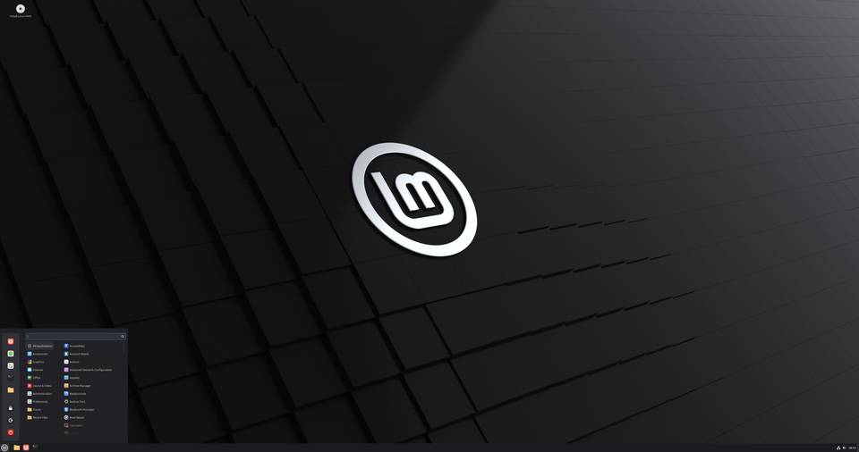
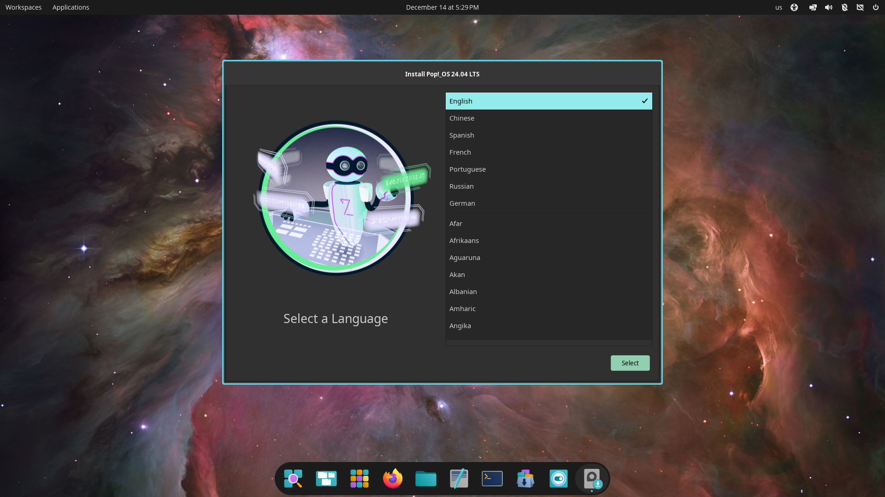
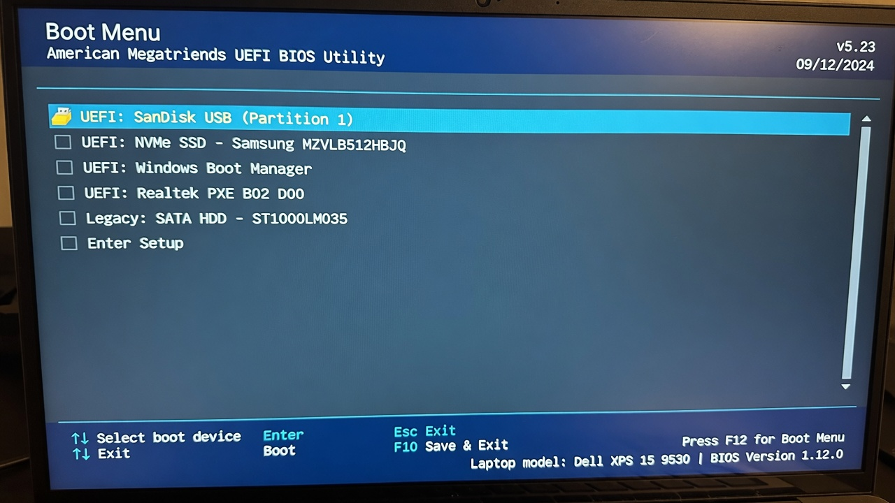
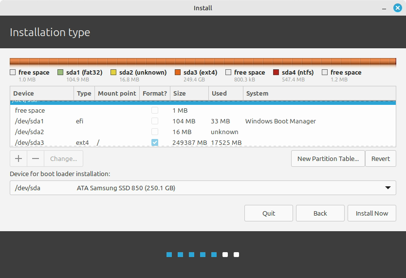
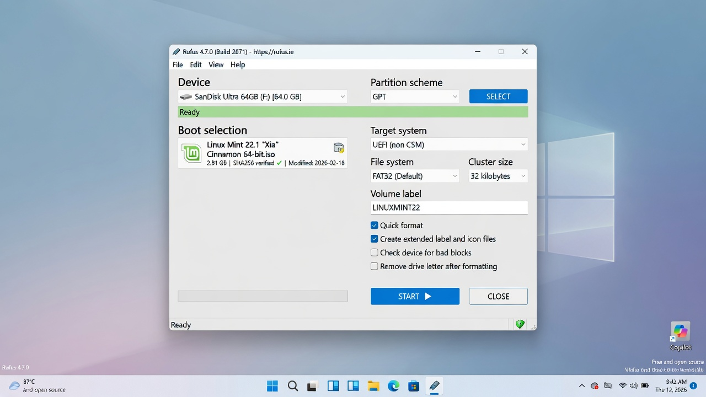
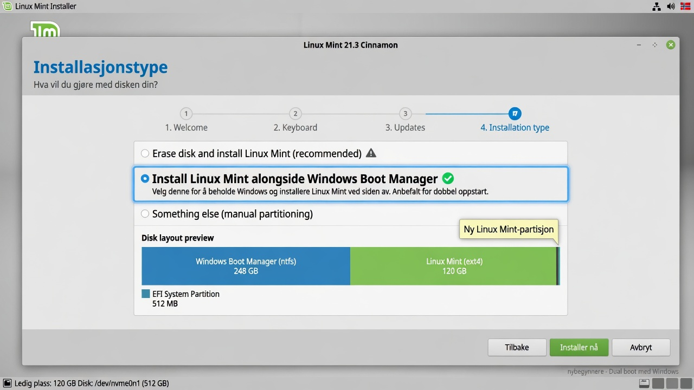
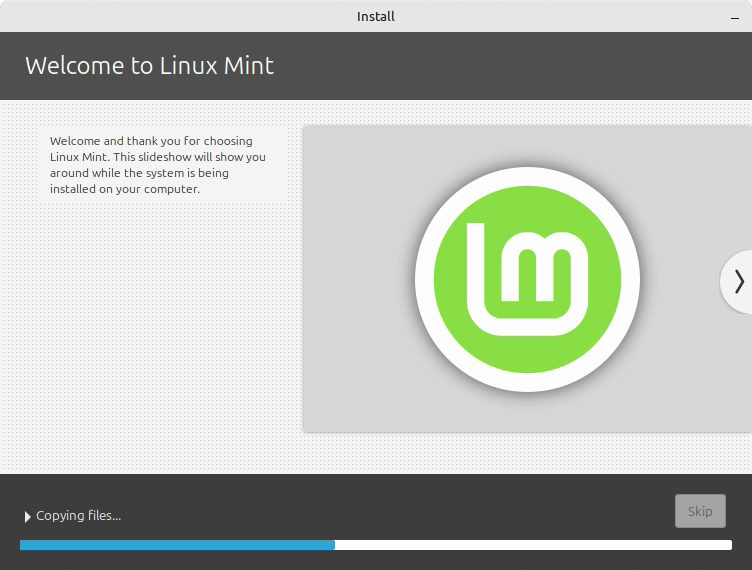
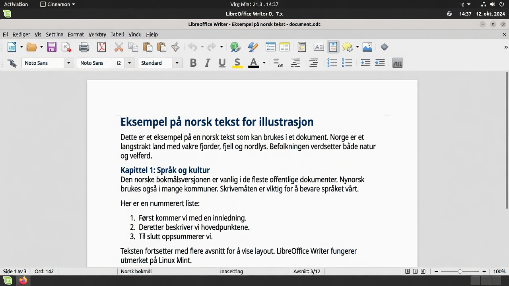
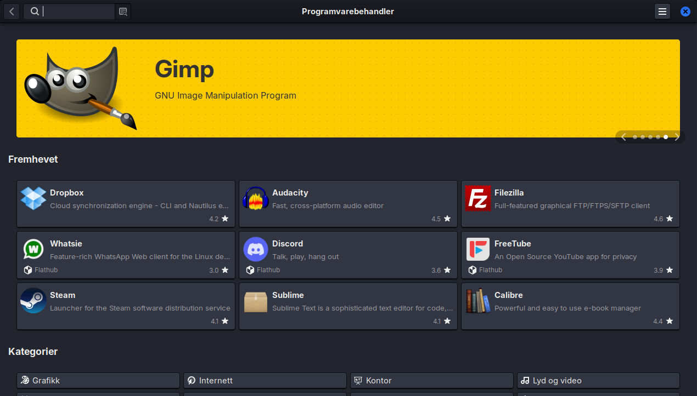

# Linux for Beginners 2026

**A practical, friendly guide for anyone switching from Windows to Linux.**

*Collected edition – all chapters in one file. Generated 2026-08-02.*

## Contents

- Preface
- 1. Introduction
- 2. What is Linux, really?
- 3. Which Linux should I choose?
- 4. Preparation and Installation
- 5. The First Time You Start Linux
- 6. Daily Use
- 7. The Terminal
- 8. Common Problems in the First Weeks
- 9. Customization and Polish
- 10. Security, backups, and good habits
- 11. What now? Next steps and resources
- Bonus: Frequently asked questions and myths about Linux
- Quick reference
- Glossary


---

# Preface

Welcome to *Linux for Beginners 2026*.

This book is written for you — someone who has considered switching from Windows to Linux, but has been a little unsure. Maybe you've heard that Linux is "difficult", "only for programmers", or that "nothing works". Maybe you've watched a friend use it and wondered whether it might suit you too.

I wrote this book because I believe 2026 is one of the best times ever to switch to Linux. Hardware support is better than it has ever been, games run surprisingly well, and the most beginner-friendly distributions have never been more polished.

## Who is this book for?

This book is for:

- You, if you're tired of ads, tracking, and unnecessary "features" in Windows
- You, if you want a faster and more stable system on an older machine
- You, if you're curious and like to understand the things you use
- You, if you want an operating system that respects you as a user

It is **not** written for people who are already experienced Linux users, or for those who want the most technical and advanced guide out there. There are plenty of other books and resources for them.

## How to use this book

You can read it cover to cover, but you don't have to. Most chapters can be read independently once you've installed the system.

I do recommend reading the first four chapters in order:

1. Introduction (why you might want to switch)
2. What Linux actually is
3. Which distribution you should choose
4. Installation

After that, you can jump to whichever chapters are most relevant to you right now.

## What to expect

You'll learn enough to:

- Install Linux safely (either as a dual boot or on its own)
- Use your computer for everyday things
- Install and use the programs you need
- Solve most common problems yourself
- Customize the system until it feels like your own

You will *not* learn everything. That's not the goal, either. Linux is big, and it's perfectly fine to learn things as you need them.

## A small piece of encouragement

The best advice I can give you is this:

**Be patient with yourself for the first few weeks.**

Everything will feel a little different. Some things will be better. Some things will be worse. That's completely normal. Most people who have switched to Linux say it took between two and four weeks before it felt entirely natural.

If something doesn't work, take a deep breath. Almost every problem has a solution, and there's a very helpful community out there.

## Thank you

Thank you for choosing to give Linux a chance. I hope this book makes the transition a little easier and a lot more pleasant.

Good luck!

— The Author

---

**Next:** [Introduction – Why switch to Linux at all?](01-innledning.md)

---

# 1. Introduction – Why switch to Linux at all?

*Last updated: 2026-07-11*

**In this chapter you'll learn:**

- The most common reasons to switch to Linux in 2026
- Why this book is written for completely ordinary people
- How the book is structured and how to get the most out of it

---

### Introduction

Welcome! You've probably heard of Linux before. Maybe a friend mentioned it, or you saw it come up in a YouTube video. Maybe you're tired of Windows feeling slow, or of getting more and more ads inside your operating system. Whatever brought you here — you're in the right place.

This book is written for you as a beginner. You don't need to be technical. You don't need to know how to code. All you need is curiosity and a little patience.

## Why switch at all?

Most people who switch to Linux don't do it because they "have to". They do it because they discover there's a better alternative for them.

Here are some of the most common reasons in 2026:

### 1. Privacy – you own your machine

Windows collects a lot of data about you. Microsoft knows what you search for, which apps you use, how long you use them, and much more. Recent versions of Windows have added an increasing number of features like "Recall" (which takes screenshots of everything you do) and Copilot integration that analyzes your activity.

Linux, on the other hand, is built on a completely different philosophy: **You own your machine**. No big corporation tracks you by default. No hidden telemetry services phoning home to a company without your knowledge.

### 2. No ads in the operating system

Have you noticed that Windows 11 keeps adding more suggestions, widgets, "recommended" apps, and ads in the Start menu? Many users feel their operating system has started to resemble an advertising platform.

Linux doesn't have that. Your desktop is yours. Period. No "Get Microsoft 365" popping up every time you open a document. No "Try Edge" messages.

### 3. It's free – and always will be

You pay nothing for Linux. Not for the system itself, not for updates, and not for most of the programs you'll need. There's no "Pro" version that suddenly appears after a few months, and no subscription to renew.

The same goes for most of the software: LibreOffice, VLC, GIMP, Firefox — all free, with no limitations.

### 4. You learn how your computer actually works

With Windows, you're often treated as a passive user. You're supposed to just click on things and hope they work. With Linux, you're invited behind the scenes. You learn how things fit together. It feels both liberating and useful — especially when something goes wrong and you actually understand why.

Many people who have used Linux for a while say they feel more "in control" of their machine.

### 5. Pushing back against Big Tech

Many people are tired of being locked into ecosystems. You shouldn't need a Microsoft account to use your own PC. You shouldn't be pushed into using OneDrive or Edge. Linux gives you back control.

You decide which services you want to use — and which ones you don't.

### 6. It's surprisingly stable and lightweight

Many first-time Linux users are surprised by how fast and stable it feels — even on older machines.

No forced restarts in the middle of your work. No "Update in progress, please don't turn off your computer" when you're up against a deadline. Many people find that older laptops that had grown sluggish on Windows suddenly feel fast again.

### 7. Everyday services work just fine

In 2026, the services most Americans rely on every day work great on Linux:

- Online banking in the browser (Chase, Bank of America, Wells Fargo, your local credit union)
- Government websites (IRS, Social Security, your state's DMV)
- Streaming: Netflix, YouTube, Hulu, Disney+, Spotify
- Shopping and shipping: Amazon, USPS and UPS tracking, and the rest
- Email, calendars, video calls (Gmail, Outlook.com, Zoom, Google Meet)

Phone-only payment apps like Venmo, Zelle, and Cash App live on your phone anyway — exactly as they would if you were using a Windows PC.

Most of the things that matter in day-to-day life work without a hitch.

## "But isn't Linux just for nerds?"

This is the biggest myth of all. Fifteen or twenty years ago it may have been partly true. In 2026, it isn't.

Today there are Linux distributions made specifically for people coming from Windows. They look and feel almost identical to what you're used to. You can use your mouse exactly like before. You can have multiple windows open. You can install apps with a few clicks.

You don't need to use the terminal if you don't want to (although it's fun to pick up a little of it over time).

## Is Linux right for you? (an honest checklist)

Before you dive in, be honest with yourself:

**Linux is an especially good fit if you:**

- Have an older PC that's no longer supported by Windows 11 (Windows 10 lost support in 2025)
- Are tired of ads and tracking in your operating system
- Want a stable, fast system with no forced updates in the middle of your work
- Mostly use a browser, office apps, music/video, and everyday services like online banking and streaming

**Consider waiting if you:**

- Depend entirely on the Adobe suite (Photoshop, Premiere) for work
- Only play recent multiplayer games with strict anti-cheat
- Have a brand-new ARM laptop (e.g., the latest Snapdragon or Apple Silicon) and don't want to risk any problems

If you're in doubt: start by trying Linux from a USB stick without installing anything. That way you lose nothing.

## Personal reasons – what are yours?

Before you continue, take a moment and think:

- What annoys you most about Windows right now?
- What are you hoping to get out of trying Linux?
- Is it privacy? Speed? Cost? Curiosity? Fewer ads?

Consider writing it down. It will help you stay motivated when things feel a little unfamiliar during the first few days.

Here are some examples of what others have said:

> "I was tired of Windows 11 feeling like an advertising platform."
> "My machine from 2018 got so slow I almost bought a new one. After Linux Mint, it feels fast again."
> "I don't want Microsoft to know everything I do on my computer."

**A real-world example:** Karen (62) had an 8-year-old laptop that had grown sluggish on Windows 10. She installed Linux Mint with a little help from her grandson. Now she uses it for email, the news, online banking, and Netflix. "It feels new again, and I'm free of all those annoying pop-ups," she says.

## What to expect from this book

This book is not a thick textbook full of commands. It's a practical companion that walks you through the whole journey — from choosing a distribution to daily use — just as the preface describes. And most importantly: you'll learn that it's completely fine not to know everything right away.

## Why so many people wish they'd switched sooner

After a few weeks or months on Linux, you often hear things like:

- "Why did this feel so scary before?"
- "My machine has never been this fast"
- "I barely notice I'm using a different operating system anymore"
- "I don't miss anything from Windows except a couple of programs I've replaced"

The transition is usually far less dramatic than people fear.

## A small warning

There will be days when things don't work as expected. That's part of the process. The difference from Windows is that once you've learned how to fix things, you feel far more capable of handling future problems yourself.

## Ready to start?

Then let's get going.

The next chapter covers the most fundamental question of all: **What is Linux, really?** — explained in a way anyone can understand.

---

**Key takeaways from this chapter**

- Linux gives you more control, better privacy, and fewer ads than Windows.
- You can't make a wrong choice — every recommended distribution is good for beginners.
- This book is designed to be reassuring and practical — go at your own pace.

---

**Next chapter:** [02 – What is Linux, really?](02-hva-er-linux.md)

---

# 2. What is Linux, really? (explained simply, no technical mumbo jumbo)

**In this chapter you'll learn:**

- The difference between the Linux kernel, distributions, and desktop environments
- Why there are so many different Linux variants
- A simple metaphor for understanding how Linux fits together

---

### Introduction

Let's start with the most important point: Linux is not a single program. It's not "an alternative to Windows" in the way one app is an alternative to another app.

Linux is a whole family of operating systems.

## The simplest explanation

Think of it this way:

- **Windows** is a finished product made by Microsoft. You buy (or receive) the whole package.
- **Linux** is like an engine that many different manufacturers use to build their own cars.

The engine (the kernel) is called the **Linux kernel**. But what you actually use — what you see on the screen — is built by many different people and organizations around the world.

When people say "I use Linux", they almost always mean a complete package called a **distribution** (or "distro" for short).

## What is a distribution?

A distribution is a complete package that includes:

- The Linux kernel (the engine)
- A desktop environment (what you see and click on)
- Programs and tools
- An installer
- An update system
- Look-and-feel and default settings

Examples of popular distributions in 2026:

- Linux Mint
- Ubuntu
- Pop!_OS
- Zorin OS
- Fedora
- Debian

They all use the same Linux kernel, but they're assembled in different ways — just like different car brands can use the same engine but have different bodywork, interiors, and driving feel.

## Why are there so many?

Because people have different needs and preferences:

- Some want something that looks as much like Windows as possible
- Some want something very modern and minimalist
- Some want maximum stability
- Some want the newest of the new

The nice part is that you can try several without breaking anything. Most distributions can run directly from a USB stick before you install them.

## Open source – what does it actually mean?

Linux is **open source**. That means anyone can see how it's made, change it, and share their changes.

Why does this matter to you as a beginner?

- Thousands of people work on improving it all the time
- There's no hidden agenda and no advertising
- If something is wrong, anyone can fix it (and many do)
- It's extremely hard to sneak malicious software into the system without someone noticing

Open source does not mean unstable or "amateurish". Quite the opposite: much of the internet, supercomputers, phones (Android), and even many cars run on Linux.

## Desktop environments – what you see and click on

When you install Linux, you often also choose a **desktop environment**. This is the visual layer — how windows look, how the taskbar works, how you switch between apps.

Some popular ones:

- **Cinnamon** – Classic and Windows-like (used in Linux Mint)
- **GNOME** – Modern and tidy (used in Ubuntu)
- **COSMIC** – New and fast, made by System76 (used in Pop!_OS)
- **KDE Plasma** – Extremely customizable, can look like almost anything
- **XFCE** – Light and fast, great on older machines

Here's how two of them can look — same Linux, completely different interior:


You can switch desktop environments later if you want — it's one of the coolest things about Linux.

## In short

- Linux = the kernel (the engine)
- Distribution = the whole car (what you install and use)
- Desktop environment = the interior and the dashboard

You don't need to memorize all of this right now. The most important thing to take away is:

**Linux is not one thing. It's many different ways to run your computer — and you can choose the one that suits you best.**

## Try it yourself

Next time you see Linux mentioned online or on YouTube, try to figure out which distribution and which desktop environment it's about. You can now tell the engine (the kernel), the car (the distribution), and the interior (the desktop environment) apart — and that's more than most people can do.

## What's next?

In the next chapter, we'll look at the best distributions for beginners in 2026 and help you choose the right one.

---

**Key takeaways from this chapter**

- Linux is not a single program, but a whole family of operating systems (distributions).
- You choose a distribution and a desktop environment — just like choosing a car brand and an interior.
- You don't need to remember all the technical details — what matters is picking something that feels familiar.

---

**Next chapter:** [03 – Which Linux should I choose?](03-hvilken-linux.md)

---

# 3. Which Linux should I choose?

*Last updated: 2026-07-11*

**In this chapter you'll learn:**

- The four best distributions for beginners in 2026
- The pros and cons of each of them
- A clear recommendation based on your situation

---

This is one of the most common questions — and understandably so. There are hundreds of distributions, and it can feel overwhelming.

The good news: for most beginners in 2026, there are really only a handful of good options worth considering.

Here are my clear recommendations, ranked by who they suit best.

## 1. Linux Mint – The safest choice for most people

**Best for:** Most people coming straight from Windows who want as little of a shock as possible.

Linux Mint is known for being the most "Windows-like" option. It uses the Cinnamon desktop, which has a classic taskbar at the bottom, a Start menu, and support for folders on the desktop.



**Pros:**

- Looks and feels familiar
- Very stable
- Includes most of what you need out of the box
- Excellent documentation and community
- Easy to install drivers and multimedia codecs
- Updates are conservative and safe

**Cons:**

- Looks a bit "traditional" (some find it boring)
- Not always the very latest software

**Recommended if:** You want something that "just works" and reminds you as much as possible of Windows 10/11.

Most first-time switchers start with Linux Mint Cinnamon.

## 2. Zorin OS – When you want the most Windows-like experience of all

**Best for:** Those who are wary of change and want something that resembles Windows 11 as closely as possible.

Zorin OS is built on Ubuntu but is designed to feel familiar to Windows users. It has several different "looks" you can switch between — including one that closely resembles Windows 11.

**Pros:**

- Can look like Windows 11, Windows 10, or macOS
- Very beginner-friendly
- Good support for Windows programs via Wine/Bottles

**Cons:**

- A bit more "pre-packaged" than the others
- The community is smaller than Mint's and Ubuntu's

**Recommended if:** You want as little visual "newness" to deal with as possible.

## 3. Pop!_OS – Excellent for newer machines and gaming

**Best for:** You, if you have a relatively new PC, perhaps with an NVIDIA graphics card, or you're interested in gaming.

Pop!_OS is made by System76 (a company that sells Linux PCs). It's based on Ubuntu but adds many improvements — especially around graphics, drivers, and productivity.

Since version 24.04, Pop!_OS has its own desktop environment, **COSMIC**, which System76 built entirely from scratch in the Rust programming language — making it fast and modern. COSMIC shipped as stable in late 2025 and is safe for daily use, but it's still a young project under active development. What sets it apart from GNOME and Cinnamon is built-in **window tiling** (automatic window organization) and a flexible panel system — one of the reasons many people pick Pop in the first place.



**Pros:**

- Outstanding support for NVIDIA and new hardware
- Fantastic guides and videos
- Built-in Flatpak support
- Very good for gaming (Steam + Proton)
- Clean, modern look

**Cons:**

- The COSMIC desktop is new and can feel a bit different from Windows
- A bit more "modern" than Mint

**Recommended if:** You have a new machine, you game, or you like a clean and modern look.

## 4. Ubuntu – The most widely used option

**Best for:** You, if you want the biggest community and the most documentation.

Ubuntu is the best-known and most widely used Linux distribution in the world. Almost every guide you find on the internet works on Ubuntu.

**Pros:**

- Biggest community
- Most support from software developers
- Huge number of guides and videos
- Long-term support (LTS releases)

**Cons:**

- Has become a bit more "modern" in recent years
- Some feel Canonical adds too many "things of its own"

**Recommended if:** You want the "safest" choice in the sense of "everyone else uses this too".

## Quick comparison (2026)

| Distribution   | Windows-like | New machine/gaming | Biggest community | Easy to get started | Recommended for               |
|----------------|--------------|--------------------|-------------------|---------------------|-------------------------------|
| Linux Mint     | ★★★★★       | ★★★               | ★★★★             | ★★★★★              | Most people                   |
| Zorin OS       | ★★★★★       | ★★★               | ★★★              | ★★★★★              | Those wary of change          |
| Pop!_OS        | ★★★         | ★★★★★             | ★★★★             | ★★★★               | New machine + gaming          |
| Ubuntu         | ★★★         | ★★★★              | ★★★★★            | ★★★★               | Those who want the most support |

## My advice to you

- **Never used Linux before?** → Start with **Linux Mint** or **Zorin OS**.
- **Have a newer PC, or you game?** → Go for **Pop!_OS**.
- **Want the most popular option?** → Choose **Ubuntu**.

You can't make a wrong choice here. All four of these are excellent for beginners.

## How to test before you decide

Most distributions have a "Try" or "Live" mode:

1. Download the .iso file from the official website (and if you pick Pop!_OS, don't go looking for an LTS button — Pop!_OS only has one current release, take that one)
2. Create a bootable USB (we'll walk through this in the next chapter)
3. Boot your PC from the USB
4. Try the system without installing it

You can browse the web, open files, test software — all without changing anything on your hard drive.

This is the best way to find out whether a distribution feels right for you.

## Other distributions (only if you get curious later)

- **Fedora** – Modern and "clean", good for developers
- **Debian** – Extremely stable, but a bit more conservative
- **Manjaro** or **EndeavourOS** – Based on Arch (more advanced)
- **Bazzite** or **Nobara** – Built specifically for gaming; worth a look if gaming is your top priority

For beginners, I recommend sticking to the four I listed at the top.

## Next step

Now that you have an idea of which distribution you want to try, we'll go through how to prepare for installation safely.

---

**Key takeaways from this chapter**

- Most people should start with Linux Mint or Zorin OS.
- Have a new machine, or do you game? Choose Pop!_OS.
- You can't make a wrong choice — all the recommended options are safe.

---

**Next chapter:** [04 – Preparation and installation](04-forberedelse-og-installasjon.md)

---

# 4. Preparation and Installation

*Last updated: 2026-07-11*

**In this chapter you'll learn:**

- How to make a safe backup before installing
- How to create a bootable USB with Rufus
- The difference between dual boot and a full replacement
- Step-by-step installation with the common pitfalls

---

This is the chapter most people are a little nervous about. That's completely normal.

The good news is that installing Linux today is much easier than most people think — especially if you follow the steps carefully. We'll take it slow and safe.

## What you should have ready before you begin

- An external hard drive or a large USB stick for backup
- A note listing the programs you use most today
- Your passwords (or an exported password manager vault)
- Some time (set aside 1–2 hours the first time)
- A cup of coffee or tea

## First: Make a backup! (Most important of all)

This cannot be said often enough:

**Back up your important files before you begin.**

Even if you're only going to try Linux from a USB stick at first, it's smart to have a copy of:

- Documents and projects
- Photos and videos
- Passwords (use a password manager like Bitwarden or KeePassXC!)
- Email settings and important emails
- Downloads you want to keep
- Any important programs you've paid for (license keys)

The easiest way is to copy everything important to an external hard drive or a large USB stick. You can also use OneDrive, Google Drive, Proton Drive, or iCloud as temporary backup.

**Pro tips:**

- Back up folders like "Documents", "Pictures", "Downloads", and "Desktop".
- Export your passwords from the browser to a file (you can import them again later).
- Write down which programs you use most, so you know what to install on Linux.

### How to move your files from Windows (step by step)

Once Linux is installed:

1. Connect the external hard drive or USB stick you used for backup.
2. Open the file manager (Nemo in Mint).
3. Find the external drive in the left sidebar (often under "Other Locations").
4. Copy your folders into "Documents", "Pictures", and so on in Linux.
5. Open Firefox → Settings → Privacy & Security → Bookmarks → Import bookmarks and passwords.

This is often the first task people do after installation. Take your time here.

## Choose a distribution and download it

Go to the official website of the distribution you've chosen:

- **Linux Mint**: [https://linuxmint.com](https://linuxmint.com) (direct download: [https://linuxmint.com/download.php](https://linuxmint.com/download.php))
- **Zorin OS**: [https://zorin.com/os](https://zorin.com/os) (download: [https://zorin.com/os/download/](https://zorin.com/os/download/))
- **Pop!_OS**: [https://system76.com/pop](https://system76.com/pop)
- **Ubuntu**: [https://ubuntu.com/download/desktop](https://ubuntu.com/download/desktop)

Download the latest **LTS** version (Long Term Support). That's the most stable release, and it gets updates for many years (usually 5).

The file you download is usually named something like `linuxmint-22-cinnamon-64bit.iso` or similar. This is called an **ISO file**.

**Important:** Always download from the official website. Avoid random download sites.

🟡 Optional: Verify the download with a checksum (recommended if you're extra careful). On the Linux Mint site you'll find the SHA256 value. After downloading:

```bash
sha256sum linuxmint-*.iso
```

Compare the number with the one on the website. If it matches, the file is genuine and unmodified.

## Create a bootable USB stick

This is the most important step for installing Linux.

You need:

- A USB stick of at least 8 GB (preferably 16 GB or more). Everything on it will be erased.
- A program that can create a "bootable" USB.

### Recommended programs (2026)

**If you're still on Windows:**

- **Rufus** (free, popular, and simple) – [https://rufus.ie](https://rufus.ie)
- **balenaEtcher** – [https://www.balena.io/etcher](https://www.balena.io/etcher) (very user-friendly)
- **Ventoy** (advanced, but very practical – can hold several ISO files on the same stick)

**If you're already on Linux:**

- Use the `dd` command or tools like `gnome-disks` / balenaEtcher.

### How to create a bootable USB with Rufus (easiest for most people):

1. Download and open Rufus (no installation needed).
2. Insert the USB stick.
3. In Rufus:
   - Select the USB stick under "Device"
   - Click the arrow next to "Boot selection" and choose the ISO file you downloaded
   - Leave the rest at the default settings. Rufus usually suggests the right options for your machine (GPT + UEFI on modern PCs).
4. Click **Start**.



Wait for the process to finish. It can take 5–15 minutes depending on your USB stick.

> **Important:** Everything on the USB stick will be erased. Back it up if there's anything on it already.

Once the USB is done, you can leave it in the machine.

## Extra tips for a successful installation

### Choose the right USB stick
Use USB 3.0 or newer if possible. Older USB 2.0 sticks are slower, but they still work.

### Save the download link
It's smart to note down where you downloaded the ISO file from, so you can grab a fresh copy later if you need one.

### Make more than one USB stick
Many people make an extra "rescue USB" with the same distribution. That way you always have a way to start the machine if something goes wrong.

### Give "Try before install" a proper test
Spend at least 15–30 minutes in Live mode before installing. Test:
- WiFi
- Sound (play a YouTube video)
- Screen resolution
- Touchscreen if you have one
- An external monitor if you use one

### Partitioning for advanced users (optional) 🔴 Advanced – feel free to skip
If you choose "Something else" during installation, you can create partitions manually. A common setup is:
- `/` (root) – 30–50 GB
- `/home` – the rest of the space (your personal files)
- swap – 4–8 GB (depending on how much RAM you have)



For beginners, letting the installer handle partitioning is recommended.

## Dual boot or replace Windows entirely?

Now comes an important choice.

### Dual boot (recommended for most beginners)

You keep Windows, and you can choose which operating system to start when you turn on the PC.

**Advantages:**

- You can go back to Windows at any time
- Safe to experiment
- Perfect if you're unsure or need Windows for something specific (certain programs or games, for example)

**Disadvantages:**

- Takes up space on the hard drive (you have to split the disk)
- Slightly more complicated to set up
- Occasionally, Windows updates can mess up the bootloader (but this is rare in 2026)

### Replace Windows entirely

You erase Windows and have only Linux.

**Advantages:**

- Clean and tidy installation
- The whole disk is available to Linux
- No conflicts with Windows

**Disadvantages:**

- You lose Windows (you'd have to reinstall it later if you change your mind)
- Riskier if you're not sure

**My advice:** Start with **dual boot**. You can always delete Windows later, once you're comfortable with Linux.

## Step-by-step installation (Linux Mint as the example)

Every distribution has a slightly different installer, but the principle is the same. Here we use Linux Mint as the example — the process is very similar in Zorin OS, Pop!_OS, and Ubuntu.

### 1. Boot from the USB

- Insert the USB stick
- Restart the PC
- Repeatedly press a key to reach the boot menu. Common keys:
  - **F12** (Dell, many others)
  - **F10** or **Esc** (HP)
  - **F2** or **Del** (some other brands)
  - Try **Esc** first – many machines show a menu there

- Select the USB stick from the list (it often says "UEFI: USB" or just the name of the USB stick)



**Tips if it doesn't work:**

- Enter the BIOS/UEFI (usually Del, F2, or F10 while the machine is starting)
- Enable "Boot from USB" if it's off
- Try temporarily disabling "Secure Boot" (see the separate explanation below)
- Try a different USB port (preferably a USB 2.0 port if you have one)

### Secure Boot – what is it, and how do you handle it?

**What is Secure Boot?**
Secure Boot is a security feature in most PCs from 2012 onward. It checks that the operating system being started is "signed" with an approved key. This prevents malware from starting before the operating system does.

**Why might I need to turn it off to install Linux?**
Some Linux distributions don't have signed drivers for all hardware (especially NVIDIA graphics and certain WiFi cards). The PC may therefore refuse to boot from the USB stick unless Secure Boot is off.

**How to turn Secure Boot off (and back on):**

1. Start the PC and press **F2**, **Del**, **F10**, or **Esc** (depending on the brand) to enter the BIOS/UEFI.
2. Find the **Security** or **Boot** tab.
3. Find **Secure Boot** and set it to **Disabled**.
4. Save and exit (usually **F10**).

**After installation:**
Most modern distributions (Ubuntu, Linux Mint, Pop!_OS, and recent versions of Zorin OS) **support Secure Boot** with signed kernels. So you can turn Secure Boot back on after installation: go back into the BIOS/UEFI and set Secure Boot to **Enabled**. If the machine won't start then, just turn it off again — nothing gets broken.

> **Note:** If you use NVIDIA's proprietary drivers, Secure Boot can cause trouble. In that case you either keep Secure Boot off, or sign the drivers yourself (🔴 advanced – not recommended for beginners).

### 2. Choose "Start Linux Mint" (Live mode)

You'll enter a live system. Nothing is installed yet. You can test everything.


Use this opportunity to:
- Check that WiFi works
- Test the sound
- See how the mouse and keyboard behave
- Open the browser and surf a bit

If everything feels fine, double-click "Install Linux Mint" on the desktop.

### 3. Follow the installation wizard

1. **Language** — Choose **English** (or whichever language you prefer).
2. **Keyboard** — Choose the US keyboard layout (or whatever matches your physical keyboard).
3. **Connection** — Connect to WiFi. This matters for downloading updates during the installation.
4. **Multimedia codecs** — Check "Install multimedia codecs" when the installer asks. Then video and music play right out of the box.
5. **Installation type** (the most important step!):

   Choose carefully here:

   - **"Install Linux Mint alongside Windows"** or similar → Dual boot (recommended)
   - **"Erase disk and install Linux Mint"** → Replace everything

   Look closely at the overview. It shows your hard drives. Make sure you don't pick the wrong disk if you have several.

   

6. **Time zone** — Choose your city (New York, Chicago, Denver, Los Angeles, or whichever is closest).
7. **User account**
   - Enter your full name
   - Choose a username (usually lowercase letters, no spaces)
   - Create a strong password
   - Choose whether to log in automatically or require a password (I recommend a password)

8. **Start the installation**
   - Click "Install". This can take 10–40 minutes depending on the machine.



9. **Done**
   - When the installation is finished, you'll be asked to restart.
   - **Remove the USB stick** before restarting.

## Frequently asked questions during installation

**"What does 'Erase disk and install' mean?"**
It means the entire hard drive is erased and only Linux is installed.

**"Can I install onto an external hard drive?"**
Yes, but it's not recommended for daily use. It will be slower.

**"What if I have several hard drives?"**
Be extremely careful. Choose the right disk in the installer. Look at the size and the name.

**"Do I have to turn Secure Boot off permanently?"**
Often not. Try turning it back on after installation. Most modern distributions support Secure Boot.

## Common mistakes to avoid during installation

1. **Don't continue if you're unsure which disk is being used.** Go back and double-check.
2. **Don't remove the USB stick too early.** Wait until the installer says it's safe.
3. **Don't skip the updates after installation.** The first updates are often important.
4. **Don't install too many things in the first few days.** Let the system settle first.

## The first restart – the GRUB menu

When the PC restarts, you'll see a menu called **GRUB**. Here you can choose:

- Linux (usually at the top, or "Linux Mint")
- Windows Boot Manager

Use the arrow keys and Enter to choose.

Linux sits at the top and starts automatically after a few seconds if you don't choose anything. The default can be changed later in the settings.

## Common problems during installation

- **Can't boot from USB**: See the tips above about BIOS/UEFI and Secure Boot.
- **Black screen after selecting the USB**: Try a different USB port, or add `nomodeset` to the boot parameters (advanced).
- **No WiFi in live mode**: Sometimes you need to install drivers after installation (see chapter 8).
- **Error message about partitioning**: Don't panic. You can go back and choose again. Never continue if you're unsure which disk is being erased.

## After the installation – first things to do

1. Let the system download all updates.
2. Restart.
3. Set up Flatpak (if it isn't already in place):

```bash
sudo apt install flatpak
flatpak remote-add --if-not-exists flathub https://flathub.org/repo/flathub.flatpakrepo
```

(On Ubuntu, Flatpak apps don't show up in the software center without the package `gnome-software-plugin-flatpak` – install it with `sudo apt install gnome-software-plugin-flatpak`.)

4. Install **Timeshift** (system snapshots):

```bash
sudo apt install timeshift
```

5. Take your first system snapshot (strongly recommended!).

## After the installation – the first 48 hours

1. Install all updates and restart
2. Install Timeshift and take your first snapshot
3. Install the 5–6 programs you use most
4. Test that everything you need day to day works (especially the everyday services you rely on — banking, streaming, and so on)
5. Take a fresh backup of important files to an external drive

If all of this works, you're off to a great start.

## Congratulations!

You have now installed Linux. The next chapter is about what you see when you log in for the first time.

**Key takeaways from this chapter**

- Always back up before you begin.
- Try Linux from USB first (Live mode) – it's safe.
- Choose dual boot if you're unsure.
- Install Timeshift and take your first snapshot immediately after installation.
- Keep your phone handy as backup support during the installation.

---

**Next chapter:** [05 – The First Time You Start Linux](05-forste-gang-du-starter-linux.md)

---

# 5. The First Time You Start Linux

**In this chapter you'll learn:**

- What the desktop looks like and how it works
- How to find and install programs
- Basic navigation and updates

---

Congratulations! You have now started Linux for the first time. Let's look at how things work.

## The desktop – first impressions

When you log in, you'll see something that looks like a normal desktop, with a few differences depending on which distribution you chose.

### Typical elements:

**Taskbar / Panel**

- Usually at the bottom (Linux Mint Cinnamon) or at the top (Ubuntu GNOME, Pop!_OS)
- Shows open windows
- Has a "Start menu" or "Activities" / "Overview"

**The desktop**

- May have icons (depending on the distribution)
- Right-click for options (wallpaper, settings, etc.)

**System status**

- Clock
- WiFi, sound, battery, updates
- User menu (log out, shut down, settings)


## Important differences from Windows

- The **Super key** (the Windows key) often opens the overview or the start menu.
- Right-clicking is still your best friend.
- There's no "Control Panel" by that name – everything lives in **Settings**.
- The close, minimize, and maximize buttons are usually in the top right (some distributions put them on the left).
- You can have multiple workspaces (virtual desktops) – very useful!

### Windows → Linux: what are things called?

| Windows | Linux |
|---------|-------|
| Programs and Features | Software Manager / Software Center |
| Control Panel | Settings |
| Task Manager | System Monitor (or `htop` in the terminal) |
| File Explorer | File manager (Nemo, Nautilus, Dolphin) |
| C:\ | `/` (the root of the file system) |
| C:\Users\username | `/home/username` |
| .exe files | .deb, Flatpak, or AppImage |
| MS Office | LibreOffice |
| Paint | Pinta |
| Notepad | Text editor (Gedit, Kate, Xed) |

## How to find and install programs

This is one of the biggest differences from Windows – and one of the best.

Instead of going to websites and downloading .exe files, Linux has a built-in **package repository**.

### Two main ways to install programs:

1. **Software Manager / Software Center / Discover**
2. **Flatpak** (the modern and recommended method in 2026)

### The software center

It has different names depending on the distribution:

- **Linux Mint**: "Software Manager"
- **Pop!_OS / Ubuntu**: "Ubuntu Software" or "App Center"
- **Zorin OS**: "Software"

Here's how it usually works:

1. Open the software center from the start menu or the taskbar.
2. Search for the program you want (e.g. "VLC", "GIMP", "Firefox").
3. Click **Install**.

The program is installed automatically, including all dependencies.


### Flatpak – the modern way

Flatpak is a newer technology that lets programs run the same way on every Linux distribution. The advantages:

- Always the latest version
- Better security (programs are sandboxed)
- Works across distributions

Many distributions come with Flatpak support built in.

### All the methods in one overview 🟡 Optional

You're going to run into several terms for installing programs. Here's the full picture, so you'll recognize the names:

| Method | What it is | Advantages | Disadvantages |
|--------|-------------|----------|---------|
| **Software center** | Graphical "app store" | Simple, safe, requires no knowledge | May have older versions |
| **apt** | Command-line tool (the Debian/Ubuntu family) | Fast, official packages | Requires the terminal |
| **Flatpak** | Modern, sandboxed apps from Flathub | Always the latest version, safe, works on all distros | Uses more disk space |
| **Snap** | Canonical's (Ubuntu's) alternative to Flatpak | Simple, well integrated in Ubuntu | Controversial – closed backend, slower startup |
| **AppImage** | A single file – download and run | No installation, portable | No automatic updates |

**Recommendation for beginners:**

- Use the **software center** for most apps.
- Choose the **Flatpak** version when possible (often labeled "Flathub" in the software center).
- You'll mostly encounter **Snap** on Ubuntu – it's the default there, and the software center will often give you the Snap version anyway. It works perfectly fine, and you can happily use Flatpak alongside it. Outside Ubuntu, Flatpak is the usual choice.
- **AppImage** is fine for individual programs you just want to try out.

## Important programs you should install right away

Here are some recommendations for beginners:

| Category          | Recommended program           | Note                                 |
|-------------------|-------------------------------|--------------------------------------|
| Browser           | Firefox or Chromium           | Often preinstalled                   |
| Office            | LibreOffice                   | Free and very good                   |
| Photos            | GIMP or Shotwell              | GIMP for advanced work               |
| Video             | VLC                           | Plays almost everything              |
| Music             | Spotify or Lollypop           | -                                    |
| Email             | Thunderbird                   | Excellent                            |
| Passwords         | KeePassXC or Bitwarden        | Strongly recommended                 |
| Screenshots       | Flameshot                     | Much better than the default         |
| System backup     | Timeshift                     | Important! Install early             |

## Updates

Linux updates itself much more smoothly than Windows.

You'll see an update icon in the taskbar. Click it and install updates regularly.

In the beginning there may be a lot of updates – that's completely normal.

**Recommended routine:**

1. Open the software center or use the terminal
2. Install all updates
3. Restart if asked to

Chapter 10 collects the entire recommended maintenance routine (updates, Timeshift, and backup) in one place.

## Workspaces (virtual desktops)

One of the coolest features in Linux:

- You can have several "desktops" at the same time
- Switch with Super + Page Up/Down or Super + a number
- Move windows between workspaces
- Perfect for separating work and personal life, or different projects

## Shutting down and restarting

- Click the power icon or the user menu
- Choose "Shut Down", "Restart", or "Log Out"

Most distributions don't ask "Why are you shutting down?" the way Windows does.

## Tips for the first hours

- Click around. It's hard to break anything just by clicking.
- Right-click everywhere – you'll be surprised how many options pop up.
- Don't be afraid to close windows or move things around.
- Anything you install can be uninstalled just as easily.
- Try creating a new workspace and moving a few windows there.

## Next steps

Now that you're in and have found your bearings, we'll go through what you actually use day to day: browsing, office work, photos, music, and file management.

---

**Key takeaways from this chapter**

- Right-clicking is your best friend.
- Use the software center for most apps, and Flatpak for newer versions.
- Install Timeshift early.
- Try multiple workspaces (virtual desktops) – it saves a lot of clutter.

**Try it yourself:** Open the terminal with Ctrl+Alt+T, type `ls`, press Enter, and close the window. That's it.

---

**Next chapter:** [06 – Daily Use](06-daglig-bruk.md)

---

# 6. Daily Use – What You Actually Need

**In this chapter you'll learn:**

- How to use a browser, email, and streaming
- LibreOffice and other everyday programs
- File management and everyday services (banking, government, payment apps)

---

Now comes the most important chapter for most people: How do you use Linux for the things you do every day?

The short version: You can do almost everything the same way as on Windows – just in slightly different ways. And in 2026, nearly all the everyday services you rely on work great.

## Browsing the web

### Browsers

Most distributions come with **Firefox** or **Chromium** preinstalled. Both work excellently.

- YouTube works perfectly
- Netflix, Hulu, Max, Disney+, and Prime Video work well in both Firefox and Chrome (Widevine DRM support is built in)
- Live TV and network sites (PBS, ESPN, YouTube TV) work great too

If you miss Chrome: You can install Google Chrome or Microsoft Edge from their official websites, or use Chromium (the open-source version).

**Tip:** Use Firefox if you care about privacy. It's the default in most distributions and works very well.

If you want to install Firefox via Flatpak (often a newer version):
```bash
flatpak install flathub org.mozilla.firefox
```

**Sites that work well:**

- npr.org, nytimes.com, wikipedia.org
- eBay and Craigslist
- Amazon, Etsy, and other shopping sites
- all the major banks

## Email

You have several good options:

1. **Use the browser** (Gmail, Outlook, Proton Mail, etc.)
2. **Thunderbird** – An excellent, free, open-source email program that comes preinstalled in many distributions. Supports IMAP, calendar, and contacts.
3. **Evolution** – An alternative that resembles Outlook a bit.

Most people recommend starting with Thunderbird.

## Everyday services

This matters to a lot of people who are considering Linux.

Most of the things that matter in everyday life work without any problems. Here's an honest overview in three categories:

### Works great in the browser

| Service               | Tips |
|-----------------------|------|
| Online banking        | Chase, Bank of America, Wells Fargo, and virtually every credit union work fully in the browser. |
| IRS (irs.gov)         | Filing, payments, and transcripts – full support in modern browsers. |
| Social Security (ssa.gov) | Excellent experience. |
| DMV websites          | Registration renewals, appointments, and license services work fine. |
| Health portals (MyChart etc.) | Appointments, test results, and messages without problems. |
| USPS / UPS / FedEx    | Tracking and shipping without problems. |
| Utilities and insurance | Paying bills and managing accounts generally works great. |

### Works, but with limitations

**Venmo** – Venmo's website ([venmo.com](https://venmo.com)) works in Firefox and Chrome, but is **limited to certain features**: logging in, viewing your transaction history, and managing your account. To **send money, pay in a store, or use Venmo as a payment method online** you still need the phone app. This is not a Linux limitation – Venmo's web version is deliberately limited by Venmo itself, and it's exactly the same on a Windows PC.

### Requires the phone app

Services like Zelle (which lives inside your bank's mobile app), Cash App payments in stores, and tap-to-pay wallets (Apple Pay, Google Wallet) live on your phone regardless of which operating system your PC runs. Your phone and your Linux PC work fine together – see the section on KDE Connect further down.

If something doesn't work perfectly, it's almost always solvable with a different browser or a small settings change.

## YouTube, Netflix, and streaming

All of this works directly in the browser.

If you want an even better experience:

- **FreeTube** (YouTube without ads and tracking)
- **Jellyfin** or **Plex** clients if you have your own media server

## Office work – LibreOffice

**LibreOffice** is the program you'll use for documents, spreadsheets, and presentations.

It's free, open source, and very powerful.



### What corresponds to what?

| Windows program     | Linux alternative      | Note                                 |
|---------------------|------------------------|--------------------------------------|
| Microsoft Word      | LibreOffice Writer     | Very similar, supports .docx         |
| Microsoft Excel     | LibreOffice Calc       | Good support for most spreadsheets   |
| Microsoft PowerPoint| LibreOffice Impress    | Works well for most presentations    |
| OneNote             | Joplin, Logseq, or Notes | Joplin is excellent for notes      |

**Important:** LibreOffice can open and save files in Microsoft Office formats (.docx, .xlsx, .pptx). Sometimes the formatting can look a little different, but this has gotten much better in recent years.

**Tip:** If you collaborate a lot with people who use Microsoft 365, you can still use the web apps in the browser (Word Online, Excel Online) in parallel.

## Photos

- **Simple viewing and organizing:** Shotwell (often preinstalled) or GNOME Photos
- **Editing:** **GIMP** (free and very powerful)
- **Simpler editing:** Pinta or Krita

Most people who just want to crop photos, adjust lighting, and add text will do fine with GIMP or web apps like Photopea (in the browser).

## Music and video

### Music

- **Local music:** Lollypop, Rhythmbox, or Strawberry
- **Streaming:** Spotify (official client via Flatpak: `flatpak install flathub com.spotify.Client`), Tidal, or Deezer via the browser

### Video

- **VLC Media Player** – still the king. Plays almost anything you throw at it.
- **MPV** – a light and modern alternative

**Video editing:** **Kdenlive** (free, available in the software center) handles everyday editing like vacation videos and small projects just fine. For the ambitious, there's also **DaVinci Resolve** for Linux – the FAQ has more to say about it.

## File management and organization

This is one of the areas where Linux often feels better than Windows.

### File managers (depending on the distribution)

- **Linux Mint (Cinnamon):** Nemo – very similar to Windows File Explorer
- **Ubuntu / Pop!_OS:** Nautilus (Files)
- **KDE:** Dolphin – extremely powerful


### Useful things you can do:

- **Tabs** in the file manager (open several folders in the same window)
- **Search** directly in the folder (often just start typing)
- **Right-click → Properties** for detailed info
- **Copy path** (very useful)
- **Multiple views:** Icons, list, details

### Recommended folder structure

Most distributions come with these standard folders:

- Documents
- Downloads
- Pictures
- Music
- Videos
- Desktop

You can create your own folders under "Home" (your personal area).

**Tip:** Avoid saving things directly on the desktop if you want to keep it tidy. Use folders instead.

## Printing and scanning

Most printers work with no extra effort in 2026.

- Go to **Settings → Printers**
- Printers are often recognized automatically
- For older printers, you may need to install drivers via the software center (search for the brand + model)

Can't get the printer working? Chapter 8 has a thorough step-by-step guide for printers.

## Your phone and your files

- Connect your phone with USB – it usually shows up as an external device
- For Android: Many people use **KDE Connect** or **GSConnect** to send files, see notifications, and control music wirelessly. It's one of the most popular tools among Linux users.

## Common daily shortcuts

- **Super (Windows key) + a number** – switch to program no. X in the taskbar
- **Super + D** – show the desktop
- **Alt + Tab** – switch between windows
- **Super + Tab** or **Super + `** – switch between windows of the same program

## You're already up and running

If you can do all of this, you're already using Linux for most of what you need in everyday life – including nearly all your everyday services.

## Extra tips for daily use

### Organizing files
Create folders like "Archive", "Active projects", and "Done" under Documents. Use dates in filenames when it's useful (e.g. `2026-07-11-meeting-notes.txt`).

### Multiple monitors
Most distributions handle multiple monitors very well. Go to Settings → Display to arrange them.

### Night mode / dark mode
Most desktop environments have dark mode built in. It's gentle on the eyes in the evening.

### Automatic app updates
Many Flatpak apps update themselves. You can also set up automatic system updates if you want.

### Syncing between devices
Tools like Syncthing let you sync files between Linux, Windows, Mac, and your phone without using cloud services.

## Common everyday tasks that work well

- Writing your résumé and cover letters in LibreOffice
- Editing photos for social media in GIMP or Pinta
- Watching Netflix, Hulu, Max, and YouTube
- Checking your Venmo history in the browser (the payments themselves happen on your phone)
- Keeping a household budget in LibreOffice Calc
- Joining video meetings via Zoom, Teams (web), or Jitsi
- Making presentations

## How to handle files from Windows

Most file types work without any problems:
- Images (jpg, png, etc.)
- Documents (docx, pdf, odt)
- Music and video (mp3, mp4, etc.)
- Excel files (xlsx)

Sometimes formatting in Office files can look a little different. Save as .odt if you want the best compatibility between LibreOffice users.

## Tips for feeling at home faster

- Change the wallpaper to something you like on day one
- Install the 3 programs you use most right away
- Learn 2–3 shortcuts you'll use daily
- Try not to compare with Windows too much during the first weeks

In the next chapter we'll look at the terminal – not because you have to, but because it's surprisingly useful once you learn the most important commands.

---

**Key takeaways from this chapter**

- Most everyday services – banking, government, streaming – work great in the browser.
- LibreOffice is a solid, free alternative to Microsoft Office.
- Use tabs in the file manager – it's much better than in Windows File Explorer.

**Try it yourself:** Connect an external USB stick or hard drive and copy a folder over to "Documents". Open it in the file manager.

---

**Next chapter:** [07 – The Terminal](07-terminalen.md)

---

# 7. The Terminal – Don't Be Afraid of It

**In this chapter you'll learn:**

- Why the terminal is useful (even though you don't have to use it)
- The 10–15 most important commands
- How to install apps from the terminal safely

---

Many people coming from Windows get chills when they hear the words "terminal" or "command line". That's completely understandable.

The good news: You don't need the terminal to use Linux. Many people use Linux for years without opening it a single time.

But... once you learn the most important commands, the terminal becomes one of the most useful tools you have.

## Why is the terminal useful?

- It's faster than clicking through menus for many things
- It works the same on almost all Linux systems (and Mac)
- It can do things that are nearly impossible with mouse and keyboard alone
- It helps you understand what's really going on
- It's worth its weight in gold when something goes wrong and you find a solution on the internet

Think of it as a remote control for your computer. You can do a lot without it, but sometimes it's simply the easiest way.

## The most important commands most beginners need

Here are the essentials. You don't need to learn them all at once.

### Navigation

| Command      | What it does                              | Example                   |
|--------------|-------------------------------------------|---------------------------|
| `pwd`        | Shows where you are right now             | `pwd`                     |
| `ls`         | Lists files and folders                   | `ls`                      |
| `ls -la`     | Lists everything, including hidden files  | `ls -la`                  |
| `cd`         | Change folder                             | `cd Documents`            |
| `cd ..`      | Go up one level                           | `cd ..`                   |
| `cd ~`       | Go to your home folder                    | `cd ~`                    |

### Files and folders

| Command      | What it does                                      | Example                            |
|--------------|---------------------------------------------------|------------------------------------|
| `mkdir`      | Create a new folder                               | `mkdir pictures/vacation`          |
| `cp`         | Copy a file or folder                             | `cp photo.jpg pictures/`           |
| `mv`         | Move or rename                                    | `mv old.txt new.txt`               |
| `rm`         | Delete a file (careful!)                          | `rm file.txt`                      |
| `rm -r`      | Delete a folder and everything inside (very careful!) | `rm -r old-folder`             |

**Important warning about `rm`:** 🟡 Optional to learn early, but important. There is no "Trash" in the terminal. Once something is deleted, it's gone forever. Use with care.

### Viewing file contents

- `cat filename` — Shows the entire contents of a file
- `less filename` — Shows the contents page by page (press Q to quit)

### Updates (very useful)

**Debian-based systems (Linux Mint, Ubuntu, Pop!_OS, Zorin OS):**

```bash
sudo apt update
sudo apt upgrade
```

**Flatpak updates (recommended to run regularly):**

```bash
flatpak update
```

`sudo` means "run this as administrator". You'll be asked for your password. You won't see asterisks as you type – that's completely normal.

### Other useful commands

- `clear` — clears the terminal window
- `history` — shows commands you've used before
- `exit` or `Ctrl + D` — closes the terminal

## Practical examples

### Update the whole system quickly

```bash
sudo apt update && sudo apt upgrade -y && flatpak update -y
```

### Create a folder and move a file into it

```bash
mkdir Projects
mv important-document.pdf Projects/
```

### Find out where you are and what's there

```bash
pwd
ls -la
```

## How to open the terminal

- **Linux Mint / Cinnamon:** Right-click on the desktop → "Open in Terminal", or search for "Terminal"
- **Most others:** Press `Ctrl + Alt + T` or search for "Terminal" / "Konsole"

## A practical example: Installing something via the terminal

Let's say you want to install VLC via Flatpak:

```bash
flatpak install flathub org.videolan.VLC
```

Or update everything at once:

```bash
sudo apt update && sudo apt upgrade -y
flatpak update -y
```

You can copy and paste commands from guides on the internet – that's completely normal and safe as long as you trust the source. (More on that in The Terminal Rule toward the end of the chapter.)

## Common installation commands (Debian-based distros)

Here are the most useful commands you'll use in the beginning:

### First: Make sure Flatpak is set up (important!)

Many distributions have it already, but to be sure:

```bash
sudo apt update
sudo apt install flatpak
flatpak remote-add --if-not-exists flathub https://flathub.org/repo/flathub.flatpakrepo
```

### Install programs via apt (fast and official)

```bash
# System tools
sudo apt install timeshift          # System backup (highly recommended)
sudo apt install tlp tlp-rdw        # Better battery life on laptops
sudo apt install ufw                # Firewall (optional)

# Common programs
sudo apt install vlc                # Best video player
sudo apt install gimp               # Image editing
sudo apt install thunderbird        # Email
sudo apt install keepassxc          # Password manager
sudo apt install flameshot          # Better screenshots
sudo apt install neofetch           # Show system info (cool)
```

(In newer distro versions the successor is called `fastfetch` – feel free to try `sudo apt install fastfetch` first if you're on something newer than Mint 22 / Ubuntu 24.04.)

### Install via Flatpak (recommended for many modern apps)

```bash
# Popular apps
flatpak install flathub org.videolan.VLC
flatpak install flathub com.spotify.Client
flatpak install flathub com.discordapp.Discord
flatpak install flathub com.valvesoftware.Steam
flatpak install flathub org.gimp.GIMP
flatpak install flathub org.keepassxc.KeePassXC
flatpak install flathub org.mozilla.firefox
flatpak install flathub com.github.tchx84.Flatseal   # Control Flatpak permissions
```

**Tip:** You can install several at once:
```bash
flatpak install flathub org.videolan.VLC com.spotify.Client
```

**How do you find the right Flatpak ID?**  
Go to [https://flathub.org](https://flathub.org), search for the app, and copy the installation command shown there. That's the most reliable way.

## How to uninstall things

```bash
# Via apt
sudo apt remove vlc

# Via Flatpak
flatpak uninstall org.videolan.VLC
```

## How to search for a program

```bash
# Via apt
apt search gimp

# Via Flatpak
flatpak search discord
```

## You set the pace

Some people learn these commands in the first few weeks. Others wait for months. Both are perfectly fine.

My advice:

1. Open the terminal once in a while
2. Try `ls` and `cd` just to see how it feels
3. When you find a guide that says "run this command", copy it in and see what happens

## One last important thing

The terminal is powerful. That also means you can make mistakes that have consequences.

But: Most mistakes are easy to fix. And you quickly learn what not to do.

The worst mistake most beginners make is copying a command from the internet without understanding what it does. So here's one rule to take with you – it's so important that it deserves its own name:

> **The Terminal Rule:** read the command before you press Enter – and only run what you get from sources you trust.

Remember it by name. It comes up again later, and it's all you need to use the terminal safely.

If you're unsure, ask on Reddit (r/linux4noobs) or your distribution's forum.

---

**Key takeaways from this chapter**

- You don't need the terminal for daily use, but it makes many things faster.
- Remember The Terminal Rule: read the command before you press Enter – and only run what you trust.
- Run `sudo apt update && sudo apt upgrade` and `flatpak update` regularly.

**Try it yourself:** 

1. Open a terminal.
2. Type `pwd` and press Enter.
3. Type `ls` and press Enter.
4. Type `cd Documents` and press Enter.
5. Type `ls` again.
6. Type `cd ~` to go back.

**Using a non-US keyboard layout?** Some symbols the terminal uses a lot – like `~ | \` – may hide behind the AltGr key (the right Alt) on your layout. On a US layout they're directly on the keyboard. Check your layout in Settings → Keyboard if a symbol doesn't behave as expected.

---

**Next chapter:** [08 – Common Problems in the First Weeks](08-vanlige-problemer.md)

---

# 8. Common Problems in the First Weeks (this chapter will be worth its weight in gold)

*Last updated: 2026-07-11*

**In this chapter you'll learn:**

- The most common hardware problems and how to fix them
- What to do about Windows programs and games
- A "first aid" page for when something goes wrong

---

**Something went wrong – start here (panic page)**

1. Breathe. Most problems are easy to fix.
2. Restart the PC.
3. Plug in power and internet.
4. Check whether Timeshift has a snapshot you can roll back to.
5. Phrase the question well when asking for help: "I'm on Linux Mint 22, I tried to [do this], and got this error message: [paste]."

This chapter may be the most important one in the book.

In your first 1–3 weeks with Linux, you'll probably run into a few things that don't work quite as expected. That's completely normal.

The nice part is that almost all of these problems have simple solutions – and most people have run into the same thing before you.

## Hardware problems

### WiFi doesn't work

This is the most common problem after installation.

**What to try first:**

1. Restart (sometimes it just fixes itself)
2. Check that airplane mode isn't on
3. Go to Settings → WiFi and see if the adapter is detected

**If it still doesn't work:**

Most WiFi problems are solved by installing extra drivers.

For Ubuntu-based systems:

```bash
sudo apt update
sudo apt install linux-firmware
```

You'll often find more driver info on your distribution's forum or by searching for your exact WiFi model.

Restart afterwards.

If you have a newer machine with Intel AX, MediaTek, or Broadcom WiFi, search for "your distro + WiFi model + driver".

### No WiFi and no drivers – the "chicken and egg" problem

How do you download WiFi drivers when you have no internet? Here's the rescue plan:

1. **Connect with a network cable** (Ethernet) if the machine has a port – the simplest solution.
2. **USB tethering from your phone:**
   - Connect the phone to the PC with a USB cable.
   - **Android:** Settings → Network → Hotspot & tethering → USB tethering.
   - **iPhone:** Settings → Personal Hotspot (turn it on, and accept on the PC).
   - The PC then gets internet through the phone – no setup needed on the Linux side.
3. **Install the drivers** while you're online:

```bash
sudo apt update
sudo apt install linux-firmware
```

4. **Restart** – WiFi should now work.

### Sound doesn't work or is quiet

For most people, sound works right away in 2026. If not, take it step by step:

**What is PipeWire?** PipeWire is the sound server most modern distributions use (it replaced PulseAudio). It handles audio and video in the background – you normally never need to think about it.

1. **Check that the right device is selected** in Settings → Sound (speakers vs. headphones vs. HDMI).
2. **Check that the sound isn't muted** – click the speaker icon in the taskbar.
3. **Restart the sound system:**

```bash
systemctl --user restart pipewire pipewire-pulse
```

4. **Install `pavucontrol`** for more detailed control (also works with PipeWire):

```bash
sudo apt install pavucontrol
```

   Open pavucontrol and check that the right device is selected and that the levels aren't at 0.

5. **Check that the sound card is detected:**

```bash
lspci | grep -i audio
```

6. **If all else fails:** Restart the machine – it solves a surprising amount.

### Screen resolution and external monitors

- Go to **Settings → Display**
- Most modern monitors and graphics cards work without issues

**If the external monitor doesn't show up or has the wrong resolution:**

1. Go to **Settings → Display** and check that the monitor is enabled (not turned off).
2. Try a different cable or port – HDMI cables are a classic culprit.
3. Check what the system sees (🔴 advanced, applies to X11 – on Wayland just use Settings → Display):

```bash
xrandr
```

   This lists all connected monitors. If it doesn't appear here, the problem is the cable or the driver.

4. Force resolution and refresh rate manually (🔴 advanced, X11):

```bash
xrandr --output HDMI-1 --mode 1920x1080 --rate 144
```

5. If you experience "tearing" (the image rips) with monitors running at different speeds (60 Hz + 144 Hz), the solution depends on which desktop environment you're using:
   - **Ubuntu/GNOME, KDE Plasma, and Pop!_OS/COSMIC** run Wayland by default – tearing is rarely a problem there to begin with.
   - **Linux Mint Cinnamon** still uses X11 by default (Cinnamon's Wayland session is experimental for now). Don't go looking for a Wayland switch – instead, set all monitors to the same refresh rate in Settings → Display, and enable VSYNC in the Cinnamon settings if needed. That solves the vast majority of cases.

### NVIDIA drivers – how to install them

If you have an NVIDIA graphics card and choppy graphics or the wrong resolution, it's almost always the driver:

**Linux Mint:**

1. Open **Driver Manager** (search in the start menu)
2. Select the recommended NVIDIA driver
3. Restart

**Ubuntu:**

```bash
sudo ubuntu-drivers autoinstall
sudo reboot
```

**Pop!_OS:** Choose the NVIDIA edition of the ISO when you download, and the drivers are in place from the start.

**Other Debian-based distros:**

```bash
ubuntu-drivers list                  # find the latest recommended version
sudo apt install nvidia-driver-550   # or the latest available version
sudo reboot
```

### Hybrid graphics – switching between GPUs on a laptop 🟡 Optional

Many laptops have both Intel graphics (power-efficient) and NVIDIA (powerful). Here's how to switch:

**Ubuntu / Linux Mint:**

```bash
sudo prime-select on-demand   # Default and best compromise: NVIDIA is used only when an app asks for it
sudo prime-select nvidia      # Use NVIDIA all the time (performance)
sudo prime-select intel       # Use Intel all the time (battery life)
```

`on-demand` is the default and the best compromise for most people – you get battery life in daily use and performance when you need it. Restart after switching.

**Pop!_OS:** Has built-in switching – click the battery/power menu in the top right and choose a graphics mode.

**Check which GPU is in use:**

```bash
glxinfo | grep "OpenGL renderer"
```

### Battery life on laptops

Linux has traditionally had worse battery life on some machines, but it has gotten much better.

**Tips for better battery life:**

- Install `tlp`:

```bash
sudo apt install tlp tlp-rdw
sudo systemctl enable tlp
sudo systemctl start tlp
```

You can check the status with `tlp-stat`.

- Use "Power saving" or "Balanced" mode in the power settings
- Lower the screen brightness
- Close the lid when you're not using the machine

### Printers – step by step

Most modern printers work plug-and-play, but here's the full ladder if yours doesn't:

**Step 1: Automatic discovery**
Most modern printers (especially network printers) are detected automatically. Go to **Settings → Printers**, click "Add" and see if the printer shows up.

**Step 2: Manual installation**
If the printer isn't detected:

- Search for the printer brand in the Software Center (e.g., "Brother" or "Epson")
- Many manufacturers offer Linux drivers on their websites

**Step 3: HP printers**
For HP printers (including older ones), **HPLIP** almost always works:

```bash
sudo apt install hplip
hp-setup
```

**Step 4: Other older printers**
Many older printers are supported by the **Gutenprint** drivers:

```bash
sudo apt install printer-driver-gutenprint
```

> **Tip:** If you have a printer that's more than 10 years old, search for "model name + linux" – there's almost always a solution. And if you're buying new: Brother and HP have the best Linux reputation.

## "Where are my programs from Windows?"

This is one of the biggest questions.

### 1. Find a Linux alternative (recommended)

Most common programs have good alternatives:

| Windows program     | Linux alternative             | Note |
|---------------------|-------------------------------|-------|
| Photoshop           | GIMP, Photopea (web)          | GIMP is powerful |
| Office              | LibreOffice                   | Very good |
| OneNote             | Joplin, Logseq                | Joplin is popular |
| Spotify             | Spotify (Flatpak)             | Official client |
| Zoom                | Zoom (official)               | Works well |
| Notepad++           | Kate, VS Code, Gedit          | - |

### 2. Run the Windows program directly

- **Bottles** or **Wine** – lets you run many Windows programs
- **CrossOver** (paid, but good support)

### 3. Use the web app

Many programs are now available as web apps.

### 4. Run Windows in a virtual machine

- **GNOME Boxes**
- **VirtualBox**
- **VMware**

This lets you run all of Windows inside Linux. Perfect for programs you absolutely must have.

## Gaming on Linux in 2026

This has gotten surprisingly good.

### Steam + Proton

If you install **Steam**:

- Most games on Steam now work via **Proton**
- Check the rating at [https://www.protondb.com](https://www.protondb.com) before you buy

**Before buying a game on Steam – make this a habit:**

1. Go to [protondb.com](https://www.protondb.com)
2. Search for the game
3. Check the rating:
   - **Platinum** – Works perfectly
   - **Gold** – Works well with minor tweaks
   - **Silver** – Works, but with some issues
   - **Bronze** – Works poorly
   - **Borked** – Doesn't work

This takes 30 seconds and saves you a lot of frustration.


Here's how to set it up:

1. Install Steam
2. Go to Steam → Settings → Steam Play
3. Check "Enable Steam Play for all other titles"
4. Select Proton Experimental

### Other gaming platforms

- **Heroic Games Launcher** – Epic Games Store and GOG
- **Lutris** – almost everything else
- **Bottles** – standalone Windows games

### What doesn't work?

Some games with strict anti-cheat systems (especially certain online multiplayer games). Always check ProtonDB.

## Other common things

### "Everything looks too big / too small"

- Settings → Display → Scaling (try 125% or 150%)

### Updates that break things

It rarely happens, but it can.

**Solution:**

- Always have backups
- Install **Timeshift** and take snapshots before big changes

### "I miss the Windows keyboard shortcuts"

Most shortcuts are the same. Some useful ones:

- `Ctrl + Alt + T` → Terminal
- `Super + L` → Lock the screen

You can change all shortcuts in Settings.

## When you can't find the solution yourself

1. Write down exactly what happens (error messages help a lot)
2. Search on Google: `your problem + your distro + 2026`
3. Good places:
   - Reddit: r/linux4noobs, r/linuxquestions, r/linuxmint, r/pop_os
   - Your distro's official forum
   - AskUbuntu

Most problems have already been solved by someone else.

## Specific common problems and solutions

### "The touchpad doesn't work well"
- Search for "libinput" or "synaptics" drivers
- Many people solve it with the settings under "Mouse and Touchpad"

### "The screen flickers" or "tears"
- Try changing the refresh rate in Settings → Display
- Install proprietary drivers if you have NVIDIA. If you have AMD, support is built into the system (Mesa) – there is no proprietary desktop driver to install. Just make sure the system is up to date.

### "The program I want isn't in the Software Center"
- Check whether it exists as a Flatpak
- Search the web for "program name flatpak" or "program name linux"
- Many programs have official installation instructions on their websites

### "I can't log in after an update"
- Restart the machine and choose an older kernel from the GRUB menu (advanced). If the menu doesn't appear: hold Shift, or press Esc, during boot – then choose Advanced options.
- Restore from Timeshift

---

**Key takeaways from this chapter**

- Most problems are solved with a restart + update or Timeshift.
- Search for "your problem + your distro".
- Reddit's r/linux4noobs is gold for beginners.

---

**Next chapter:** [09 – Customization and Polish](09-tilpasning-og-finpuss.md)

---

# 9. Customization and Polish

**In this chapter you'll learn:**

- How to change the look and themes
- Which apps you might want to add
- A "golden path" for customizing without overdoing it

---

One of the greatest joys of Linux is how easy it is to make it **your** system.

You can change almost everything: colors, icons, fonts, how windows look, where the taskbar sits, and much more.

## Changing the look

### Linux Mint (Cinnamon)

Cinnamon is very easy to customize:

1. Right-click on the desktop → **Settings**
2. Go to **Themes**
3. Choose:
   - **Desktop** (appearance)
   - **Icons**
   - **Controls** (buttons and windows)
   - **Mouse pointer**

You can download more themes from the web and install them by extracting them into `~/.themes` and `~/.icons`.

### GNOME (Ubuntu and many others)

GNOME is more minimalist, but can be customized with **extensions**.

- Install the **Extensions** app or "GNOME Tweaks"
- Go to [https://extensions.gnome.org](https://extensions.gnome.org) in Firefox
- Enable extensions like "Dash to Dock", "User Themes", "Blur my Shell", etc.

**Warning for beginners:** Don't install too many extensions at once. They can cause instability.

### COSMIC (Pop!_OS)

Pop!_OS uses its own desktop environment, **COSMIC** – not GNOME. That means GNOME Tweaks and GNOME extensions don't apply here. Instead:

- Open **Settings → Desktop** for themes, colors, panels, and the dock
- Window tiling (automatic window arrangement) is toggled with the button in the top right of the panel
- Most customization is built in – you don't need any extra tools

### KDE Plasma

KDE is the most customizable of them all. You can change almost everything via **System Settings → Appearance**.

## Icons and themes

Popular places to find themes and icons:

- [https://www.pling.com](https://www.pling.com)
- [https://www.gnome-look.org](https://www.gnome-look.org)

**How to install a theme (general):**

1. Download a `.tar.xz` or `.zip` file
2. Extract it
3. Move the folder to the right place:
   - Themes: `~/.themes` or `~/.local/share/themes`
   - Icons: `~/.icons` or `~/.local/share/icons`
4. Select the theme in Settings

## Wallpapers and the lock screen

- Right-click on the desktop → Change wallpaper
- You can use your own pictures
- Some distributions let you change the lock screen separately

## Adding apps you're missing

Here are some popular apps many people want:

### Communication

- **Discord** – `flatpak install flathub com.discordapp.Discord`
- **Telegram** – `flatpak install flathub org.telegram.desktop`
- **Signal** – `flatpak install flathub org.signal.Signal`
- **Element** (Matrix) – `flatpak install flathub im.riot.Riot`

### Development / text

- **Visual Studio Code** – Very popular. Install via Flatpak or the official source
- **VSCodium** – Same as VS Code, but without Microsoft telemetry

### Other useful apps

- **OBS Studio** – Screen recording and streaming (excellent on Linux)
- **Flameshot** or **Spectacle** – Better screenshots
- **KeePassXC** – Password manager (highly recommended)
- **Bitwarden** – Cloud-based password manager

### Gaming-related

- Steam
- Heroic Games Launcher
- Lutris
- ProtonUp-Qt

## How to install most apps (Flatpak recommended)

The easiest and safest way in 2026:

1. Open the **Software Center**
2. Search for the program
3. If there are multiple versions, choose the **Flatpak** version when possible



## Creating shortcuts and organizing the desktop

- You can drag apps to the taskbar / dock
- Right-click an app in the start menu → "Add to favorites"
- Many people use a "dock" at the bottom

## Accessibility (for older readers or those who need it)

Linux has good accessibility support:

- Go to **Settings → Accessibility** (or search for "Universal Access").
- Increase the font size and cursor size.
- Turn on high contrast or the screen magnifier.
- Many people use this to make things easier for parents or grandparents.

## Advanced (optional) 🟡 Optional

If you get more comfortable later:

- Change fonts system-wide
- Add custom keyboard shortcuts
- Write your own scripts
- Change startup applications

## An important principle

**Customize gradually.**

It's easy to get carried away and change everything at once. Start with 2–3 small changes you like, and leave the rest alone for a while.

Once you've used the system for a few weeks, you'll know exactly what you want to change.

---

**Key takeaways from this chapter**

- Customize gradually – not everything at once.
- Flatpak is often the easiest and safest choice for apps.

**Golden path for customization:** 

1. Change the wallpaper and theme via Settings.
2. Install 3-4 apps you're missing via the Software Center.
3. Add favorites to the taskbar.
4. Stop there – the rest will come once you've used the system for a while.

**Try it yourself:** Right-click on the desktop and change the wallpaper to a picture you like.

---

**Next chapter:** [10 – Security, Backup, and Good Habits](10-sikkerhet-backup.md)

---

# 10. Security, backups, and good habits

*Last updated: 2026-08-01*

**In this chapter you'll learn:**

- Why regular updates are the most important security measure
- How to take system snapshots with Timeshift and back up your personal files
- Password managers and two-factor authentication (2FA)
- How to turn on the UFW firewall in 10 seconds
- Healthy skepticism: what to think about before you install something
- A simple five-step security routine

---

Linux is generally more secure than Windows for several reasons:

- You don't run as administrator all the time
- Programs are installed through controlled channels
- It's harder for malicious software to run without you actively approving it

But: security is still about good habits.

## Keep your system updated

This is the most important thing you can do.

- Install updates regularly (weekly is best)
- Use both system updates and Flatpak updates

Quick command:

```bash
sudo apt update && sudo apt upgrade -y
flatpak update -y
```

## Make regular backups

There are two kinds of backups you should think about:

### 1. System snapshots (recovery if something goes wrong)

**Install Timeshift** – the best tool for most beginners.

```bash
sudo apt install timeshift
```

After installing: open Timeshift and take a first snapshot.

- Take a snapshot before big changes
- You can roll back to a previously working system in a few minutes

If you can, store your snapshots on a separate or external disk – a snapshot sitting on the same disk that dies won't help you much the day that disk fails.

**Recommendation:** Take a snapshot after installation and once a week.

### 2. Personal files

Recommended simple solutions:

- **Déjà Dup** (simple graphical backup)
- Manual copying to an external hard drive
- rsync (powerful)
- Cloud services you trust (Proton Drive, Nextcloud, etc.)

**Rule:** Have at least one offline backup + one cloud backup if possible.

## Passwords and authentication

- Use a **password manager** (KeePassXC or Bitwarden)
- Create strong, unique passwords
- Enable two-factor authentication (2FA) wherever possible

## Firewall

Most Linux distributions do **not** ship with the firewall enabled by default. That's usually fine anyway, because you're most likely sitting behind a home router that already blocks incoming traffic from the outside.

But for extra security – especially on a laptop that goes with you to coffee shops, hotels, and public networks – I recommend turning on UFW (Uncomplicated Firewall). It takes 10 seconds:

```bash
sudo apt install ufw       # Install (if not already installed)
sudo ufw enable            # Enable the firewall
sudo ufw status            # Check that it's active
```

UFW blocks all unwanted incoming traffic but lets outgoing traffic (web browsing, email, etc.) pass freely. You won't notice any difference in daily use – it just protects you against unauthorized connections from other machines on the same network.

## Be careful about what you install

Good habits:

- Install mainly from the Software Center or Flatpak (flathub.org)
- Be skeptical of `.deb` files and `.sh` scripts from random websites
- Always read what a command does before running it with `sudo`

## Browser security

- Use Firefox or a Chromium-based browser
- Install uBlock Origin
- Be careful with extensions

## What about viruses?

Linux has fewer viruses than Windows, but they do exist. Most problems come from users running random scripts they find on the internet.

## Recommended "security routine"

1. Take a Timeshift snapshot before big changes
2. Install updates weekly
3. Keep an external backup of important files
4. Use a password manager
5. Don't run commands you don't understand

## If something goes wrong

- Don't panic
- Most problems are solved by a reboot + updates
- Worst case: restore from Timeshift

---

**Key takeaways from this chapter**

- Linux is safe out of the box – good habits make it even safer.
- Updates and backups are the big two: keep the system updated, and have both Timeshift snapshots and an external copy of your files.
- A password manager and 2FA protect your accounts; UFW protects your machine on public networks.
- The security routine above is all you need – five simple habits, not a full-time project.

**Try it yourself:** Install Timeshift and take your first snapshot today. It only takes a few minutes – and gives you peace of mind that's good to have.

---

**Next chapter:** [11 – What now?](11-hva-na.md)

---

# 11. What now? Next steps and resources

Congratulations! You've made it through the most important part.

You're now at a point many beginners reach: "What do I do next?"

The answer is: **Take it easy.** You don't need to learn everything at once.

## How to learn more without getting overwhelmed

Most people who get overwhelmed are trying to learn too much too fast. Here's a better approach:

1. **Use the system for what you need** for a few weeks first
2. **Solve problems as they come up** – that's the best way to learn
3. **Learn one thing at a time**
4. **Don't compare yourself to people who've used Linux for 10 years**

## Forums and communities

- **forums.linuxmint.com** – The official Linux Mint forum, very beginner-friendly
- **Your distro's own forum** – Ubuntu, Pop!_OS, and Fedora all have active official forums
- **Local Linux User Groups (LUGs)** – Many US cities and universities have one; search Meetup for "Linux" in your area

Honestly: most of the action happens online, and the Reddit communities below are where you'll get answers fastest. But a local LUG can be great for in-person help – and distro forums are the right place for questions specific to your exact system.

## Online resources (these are gold)

### Reddit (highly recommended)

- **r/linux4noobs** – Made specifically for beginners. Very friendly.
- **r/linuxquestions**
- **r/linuxmint**, **r/pop_os**, **r/Ubuntu**

### YouTube channels (2026)

- The Linux Experiment
- Brodie Robertson
- Mental Outlaw
- DistroTube
- System76 (for Pop!_OS)
- Linux Mint's official channel

## Where this series goes next

This book has a sequel. Once the terminal has started to feel like a tool – not a threat – and you're curious about what's actually happening under the hood, **Linux for Intermediate Users** picks up exactly where this book leaves off: the terminal for real, shell scripting, SSH, and your own little home server. Everything builds on the habits you've already formed here – Timeshift snapshots, your update routine, and the rule about understanding a command before you run it. And for those who one day want to go all the way to the bottom, **Linux for Experts** waits beyond that. But there's no rush – get your money's worth out of this book first.

## Documentation and learning tools

- The official user guide for your distribution
- **[Linux Journey](https://linuxjourney.com)** – free, interactive online course that takes you from beginner to intermediate
- **[Arch Wiki](https://wiki.archlinux.org)** – the internet's best Linux reference. Written for Arch, but most of it applies to all distributions. Gold when you're troubleshooting.
- **[ExplainShell](https://explainshell.com)** – paste in a terminal command and get an explanation of what each part does. Perfect before running something you found online.
- Man pages in the terminal (`man command`)

## Ready to remove Windows? (when you feel confident) 🟡 Optional

Did you choose dual boot, and have you now used Linux for a few months without missing Windows? Here's how to free up that space:

**Important first:** Take a Timeshift snapshot AND a backup of your personal files. And start GParted from the **live USB** (the same USB you installed from) – you can't modify partitions while the system is running from them.

**Step 1: Delete the Windows partition**

1. Boot the machine from the live USB (like during installation)
2. Open **GParted** (included in the live environment; otherwise `sudo apt install gparted`)
3. Find the Windows partition – it's labeled **ntfs** and is often the largest one
4. Right-click → **Delete**

**Step 2: Expand the Linux partition**

1. Right-click the Linux partition (labeled **ext4**)
2. Choose **Resize/Move** and drag the edge so it fills the free space
3. Click **Apply** (may take a few minutes)

> **Patience:** If the free space is *in front of* the Linux partition (which is common – Windows usually sat first on the disk), dragging the edge isn't enough: GParted has to move the entire partition, and that can take several hours. That's completely normal. Plug the laptop into power, don't interrupt it, and leave the machine alone until GParted says it's done.

**Step 3: Clean up the boot menu**

Boot the machine normally (without the USB) and run:

```bash
sudo update-grub
```

Windows will then disappear from the GRUB menu.

> **Warning:** Double-check that you're deleting the right partition – look at both the size and the filesystem (ntfs = Windows, ext4 = Linux). If in doubt, don't delete.

## Practical next steps you can take

- Install Timeshift and take your first system snapshot
- Try installing 3–4 apps you miss
- Customize the desktop a little
- Learn 3 new terminal commands
- Install Steam and test one game
- Set up an automatic backup

## Become part of the community (optional)

Many people find it motivating to help other beginners once they've learned something themselves.

## Remember this

Linux isn't something you "finish". It's a tool you gradually get better at using.

Most people who've used Linux for many years say the same thing:

> "I don't regret switching for a second."

## Key takeaways from this chapter

- Take it easy – use the system, solve problems as they come up, and learn one thing at a time
- If you get stuck, r/linux4noobs, Linux Journey, and the Arch Wiki are worth their weight in gold
- Wait to remove Windows until you've managed without it for a few months – and take a snapshot and backup first
- The day you want to go further, *Linux for Intermediate Users* is ready and continues where this book leaves off

---

**Thank you for reading this book!**

---

**Next:** [Bonus – Frequently asked questions](12-bonus-faq-myter.md)

---

# Bonus: Frequently asked questions and myths about Linux

This chapter collects the questions and myths that come up most often.

## Myths about Linux

### Myth 1: "Linux is only for nerds and programmers"

**Fact:** 15 years ago, that was partly true. In 2026, it isn't. There are distributions made specifically for ordinary people coming from Windows. You can use Linux for years without opening the terminal a single time.

### Myth 2: "You can't play games on Linux"

**Fact:** Most games on Steam now work via Proton. Many games run just as well or better on Linux than on Windows. There are still some exceptions (especially games with aggressive anti-cheat systems), but they're getting fewer all the time.

### Myth 3: "There's no software for Linux"

**Fact:** Almost every popular program has either a Linux version, a Flatpak version, or a good alternative. On top of that, you can run many Windows programs via Wine/Bottles.

### Myth 4: "Linux is unstable and crashes all the time"

**Fact:** Many people find Linux more stable than Windows. The system rarely crashes. When there are problems, it's almost always hardware drivers or user error.

### Myth 5: "Linux is free, so it must be bad"

**Fact:** Linux runs on most of the world's supercomputers, on Android phones, on servers all over the world, and on a growing number of laptops and desktops.

### Myth 6: "You have to use the terminal for everything"

**Fact:** You can, but you don't have to. Most things can be done with the mouse and graphical programs.

### Myth 7: "All Linux distributions are the same"

**Fact:** The differences are enormous. Linux Mint and Arch Linux have about as much in common as Windows 11 and a Raspberry Pi.

## Frequently asked questions

### Can I go back to Windows if I don't like it?

Yes. If you installed with dual boot, you can just pick Windows in the GRUB menu. If you deleted Windows, you can reinstall it from a Windows USB. Always make a backup first.

### Will Linux work on my machine?

Probably yes. Most machines from the last 5–7 years work great. Older machines often run better on Linux than on newer Windows. The only thing that can be problematic is brand-new hardware components.

### Do I have to install drivers myself?

Often not. Most drivers are built in. For NVIDIA and some WiFi cards, you sometimes need to install extra drivers after installation.

### Is dual boot safe?

Yes, for most people. The risk is low if you follow the guides. The worst that usually happens is that Windows updates overwrite the bootloader, but that's easy to fix.

### Why are there so many different distributions?

Because people have different needs. Some want the simplest thing possible. Others want maximum control. It's a strength.

### What's the difference between Ubuntu, Mint, Pop!_OS, etc.?

They're all built on the same foundation but have different default programs, looks, and philosophy. Mint and Zorin are more "Windows-like". Pop!_OS and Ubuntu are more modern.

### Will updates break my system?

Very rarely on LTS versions. Feel free to install Timeshift before big updates if you're nervous.

### Is Linux really better for privacy?

Yes, by default. The operating system itself doesn't track you the way Windows does. But if you install all the same services and log in everywhere, your privacy ends up about the same.

### Can I use Microsoft Office?

You can use Microsoft 365 in the browser. For local use, LibreOffice is the best alternative for most people.

### What about Photoshop, Premiere, and the like?

- Photoshop → GIMP + Photopea (web)
- Premiere → DaVinci Resolve (has an official Linux version and is excellent), Kdenlive, or Shotcut

### Do I have to learn to program?

No. Absolutely not.

### What does it cost?

Nothing for the system itself. Most of the programs are free too.

### How long does it take to get used to it?

Most people manage the basics after 1–3 days. After 2–4 weeks it feels normal.

### Can I get help if I get stuck?

Yes. The community is generally very helpful. Describe in detail what you're trying to do and what happens.

### Is it worth it?

Most people who've switched answer "yes" after a few weeks. You get more control, better privacy, often a faster system, no ads, and the feeling of actually owning your machine.

### What about non-US keyboard layouts and special characters?

They work. Choose your keyboard layout during installation and everything – including accented and international characters – just works. Using a non-US layout? Some symbols hide behind AltGr – check your layout in Settings → Keyboard.

### Can I use online banking and payment apps?

Online banking: yes, it works great in the browser at virtually every bank (Chase, Bank of America, and the rest). Payment apps like Venmo, Zelle, and Cash App: the websites let you log in and see your history, but the payments themselves still happen on your phone – exactly like on a Windows PC. See chapter 6 for details.

### What if I have a brand-new laptop with special hardware?

Some brand-new machines can have issues (especially WiFi and GPU). Pop!_OS and Ubuntu often have the best support for new hardware. Check the forums before buying if you're unsure.

### Can I run Android apps on Linux?

Yes, with tools like Waydroid. It's not as seamless as on Windows, but it works for many apps.

### What's the best thing about Linux according to people who've switched?

Common answers:
- The feeling of control
- That the machine feels faster and cleaner
- That it's free and stays free
- That there are fewer "annoying" things

### Can I install Linux on a Mac?

Yes, but it can be more complicated on newer Apple machines with ARM processors (M1/M2/M3). On older Intel-based Macs it often works well.

### What about my personal files from Windows?

Most files (photos, documents, music, videos) work without any problems. Some old .exe files can't be run directly.

### How often should I update?

Most people recommend updating once a week or whenever a reminder pops up. Avoid skipping updates for long stretches.

### Can I have multiple distributions on the same machine?

Yes. You can have both Linux Mint and Ubuntu installed at the same time if you want to compare.

### What is "root"?

Root is the superuser (administrator) on Linux. You normally don't use root directly, but `sudo` when you need extra privileges.

### Why is it called "Linux" when it's so many different things?

"Linux" really just refers to the kernel. When people talk about "Linux" in everyday speech, they almost always mean an entire distribution.

### Can kids use Linux?

Yes. Many distributions are just as easy as Windows for kids. Some parents prefer Linux because there are fewer distractions and better privacy.

### What if I'm completely new to computers?

Then Linux can actually be easier than Windows in some ways, because there are fewer unnecessary choices and no ads.

---

**Thanks for reading!**

You now have a solid foundation. Use this book as a reference whenever you need it.

---

# Quick reference

This is a quick lookup section you can flip to whenever you need it.

## The most important terminal commands

| Command                        | What it does                              |
|--------------------------------|-------------------------------------------|
| `pwd`                          | Where am I?                               |
| `ls`                           | List files                                |
| `ls -la`                       | List everything (incl. hidden)            |
| `cd folder`                    | Go to folder                              |
| `cd ..`                        | Go up one level                           |
| `mkdir name`                   | Create folder                             |
| `cp file folder`               | Copy file                                 |
| `mv file folder`               | Move or rename                            |
| `rm file`                      | Delete file (careful!)                    |
| `sudo apt update && sudo apt upgrade` | Update system (Debian-based)       |
| `flatpak update`               | Update Flatpak apps                       |

## Useful shortcuts (most distributions)

| Shortcut                 | Action                                |
|--------------------------|---------------------------------------|
| Super (Windows key)      | Open overview / start menu            |
| Super + number           | Switch to program in the taskbar      |
| Ctrl + Alt + T           | Open terminal                         |
| Alt + Tab                | Switch between windows                |
| Super + D                | Show the desktop                      |
| Super + L                | Lock the screen                       |

## Important programs to install early (with commands)

### Via apt (Debian-based)

```bash
sudo apt install timeshift
sudo apt install vlc
sudo apt install gimp
sudo apt install thunderbird
sudo apt install keepassxc
sudo apt install flameshot
sudo apt install tlp tlp-rdw
```

### Via Flatpak (recommended for many apps)

```bash
flatpak install flathub org.videolan.VLC
flatpak install flathub com.spotify.Client
flatpak install flathub com.discordapp.Discord
flatpak install flathub com.valvesoftware.Steam
flatpak install flathub org.gimp.GIMP
flatpak install flathub org.keepassxc.KeePassXC
flatpak install flathub org.mozilla.firefox
```

**LibreOffice** is usually already installed, or:
```bash
sudo apt install libreoffice
```

### How do I find the right Flatpak ID?

1. Go to [https://flathub.org](https://flathub.org)
2. Search for the program
3. Copy the "Install" command shown (e.g. `flatpak install flathub com.example.App`)

## Common apps with commands (quick table)

| App              | apt command                      | Flatpak command                               |
|------------------|----------------------------------|-----------------------------------------------|
| VLC              | `sudo apt install vlc`           | `flatpak install flathub org.videolan.VLC`    |
| GIMP             | `sudo apt install gimp`          | `flatpak install flathub org.gimp.GIMP`       |
| Discord          | (not recommended)                | `flatpak install flathub com.discordapp.Discord` |
| Spotify          | -                                | `flatpak install flathub com.spotify.Client`  |
| Steam            | `sudo apt install steam`         | `flatpak install flathub com.valvesoftware.Steam` |
| KeePassXC        | `sudo apt install keepassxc`     | `flatpak install flathub org.keepassxc.KeePassXC` |
| Timeshift        | `sudo apt install timeshift`     | -                                             |
| Flameshot        | `sudo apt install flameshot`     | -                                             |

## Where do I find help?

- **Beginners:** [reddit.com/r/linux4noobs](https://www.reddit.com/r/linux4noobs)
- **General questions:** [reddit.com/r/linuxquestions](https://www.reddit.com/r/linuxquestions)
- **Distro-specific:** Search for your distro + "forum" (e.g. forums.linuxmint.com)

**Flathub (apps):** [https://flathub.org](https://flathub.org)
**ProtonDB (games):** [https://www.protondb.com](https://www.protondb.com)

## Post-installation checklist

- [ ] Back up your important files
- [ ] Install updates
- [ ] Checked the multimedia codecs box during installation? (otherwise: Software Manager → mint-meta-codecs)
- [ ] Install Timeshift and take your first snapshot
- [ ] Install the programs you use most
- [ ] Check that WiFi, sound, and printer work
- [ ] Customize the look a little (theme / wallpaper)
- [ ] Learn 3–4 terminal commands

---

This is the end of the main content. Use the rest of the book as a reference!

---

# Glossary

**Bootable USB**  
A USB stick that can be used to boot a computer and install or try out an operating system.

**Distribution (Distro)**  
A complete package of Linux that includes the kernel, desktop environment, programs, and tools. Examples: Linux Mint, Ubuntu, Pop!_OS.

**Dual boot**  
When two operating systems (e.g. Windows and Linux) are installed on the same machine and you can choose which one to start.

**Flatpak**  
A modern system for distributing apps on Linux. Apps are sandboxed and work across distributions.

**GRUB**  
The bootloader that lets you choose which operating system to start when the machine powers on.

**ISO file**  
An image file containing the entire operating system. It's used to create a bootable USB.

**Kernel**  
The core of the operating system. In Linux, this is the "Linux kernel".

**LTS (Long Term Support)**  
A version that receives updates for a long time (usually 5 years). Recommended for beginners.

**Software Center**  
The graphical program where you search for and install apps.

**Repository**  
An official store of programs that your distribution pulls apps and updates from.

**Secure Boot**  
A security feature in BIOS/UEFI that can prevent unapproved operating systems from starting. Sometimes needs to be temporarily disabled during installation.

**Snapshot**  
A point-in-time image of your system. Used in Timeshift so you can roll back to an earlier state.

**Sudo**  
Command that lets you run programs with administrator privileges.

**Terminal**  
Text-based interface where you type commands.

**Timeshift**  
Program that creates system snapshots, similar to System Restore in Windows.

**Wine**  
A layer that lets you run many Windows programs on Linux.

**BIOS / UEFI**  
The software that starts the computer before the operating system. UEFI is the modern version.

**Partition**  
A division of the hard drive. You can have multiple partitions, e.g. for Windows and Linux side by side.

**Live mode**  
Running Linux directly from a USB without installing it. Perfect for testing.

**Bootloader**  
The program that chooses which operating system to start (e.g. GRUB).

**apt**  
The package manager used in Ubuntu-based distributions to install and update programs.

**Package**  
A ready-made program or tool that can be installed via apt or Flatpak.

**Driver**  
Software that makes hardware (WiFi, graphics, printer) work.

**Open source**  
Software whose source code is public, so anyone can view, modify, and share it.

**GNOME / Cinnamon / KDE / COSMIC**  
Popular desktop environments (the visual layer you click on). Cinnamon is the most Windows-like. COSMIC is Pop!_OS's own desktop.

**Proton**  
Tool from Valve that lets most Windows games run on Linux via Steam.

**Root**  
The administrator user on Linux, with full access to the entire system.

**Home folder**  
The folder where your personal files live (`/home/username`, abbreviated `~`).

**Wayland / X11**  
Two different ways Linux draws graphics on the screen. Ubuntu/GNOME, KDE, and COSMIC use Wayland by default; Linux Mint Cinnamon still uses X11.

**Snap**  
Canonical's (Ubuntu's) package format – an alternative to Flatpak. Mostly used in Ubuntu.

**AppImage**  
A program packaged as a single file: download it, make it executable, and run it. No installation, but no automatic updates either.

**PipeWire**  
The sound server most modern distributions use. Handles audio and video in the background.

---

## Quick term list

Handy when you're searching for help or navigating menus and forums:

| Term | What it means |
|------|---------------|
| Kernel | The core of the operating system |
| Distribution (distro) | A complete Linux package (Mint, Ubuntu, ...) |
| Desktop environment | The visual layer you click on (Cinnamon, GNOME, ...) |
| Software center | Graphical app store for installing programs |
| File manager | The program you browse files and folders with |
| Taskbar / panel | The bar with open programs and the menu |
| Shortcut | A key combination or launcher icon |
| Backup | A safety copy of your files or system |
| Settings | Where you configure the system |
| Firewall | Blocks unwanted incoming network traffic |
| GPU / graphics card | The hardware that draws graphics on screen |
| Refresh rate | How many times per second the screen updates (Hz) |
