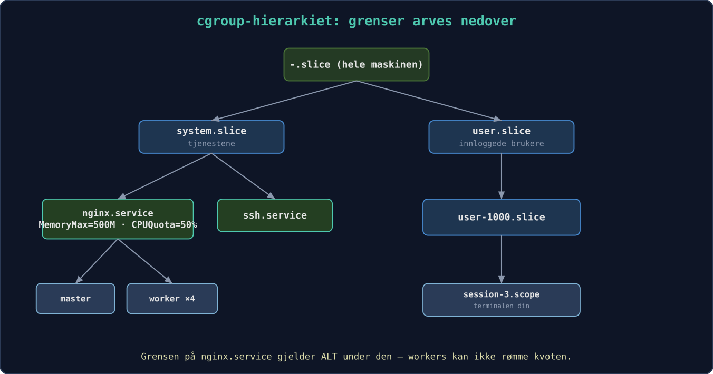
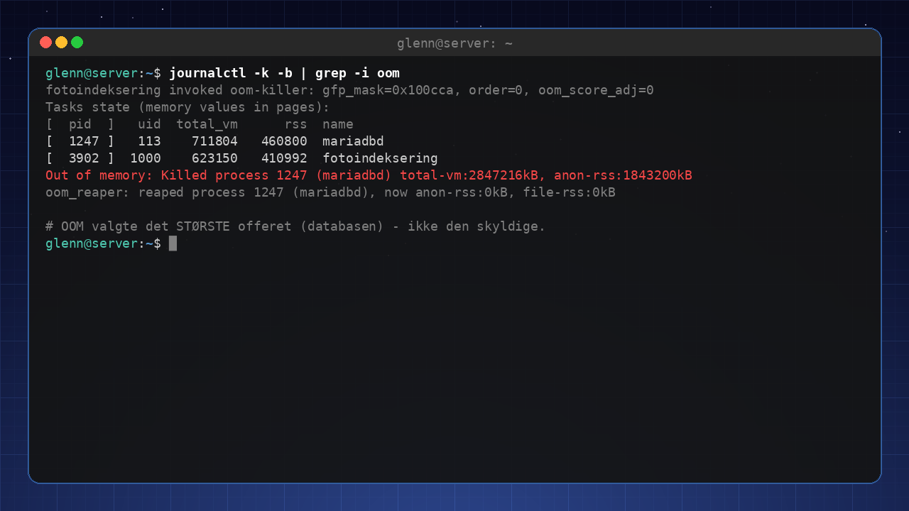
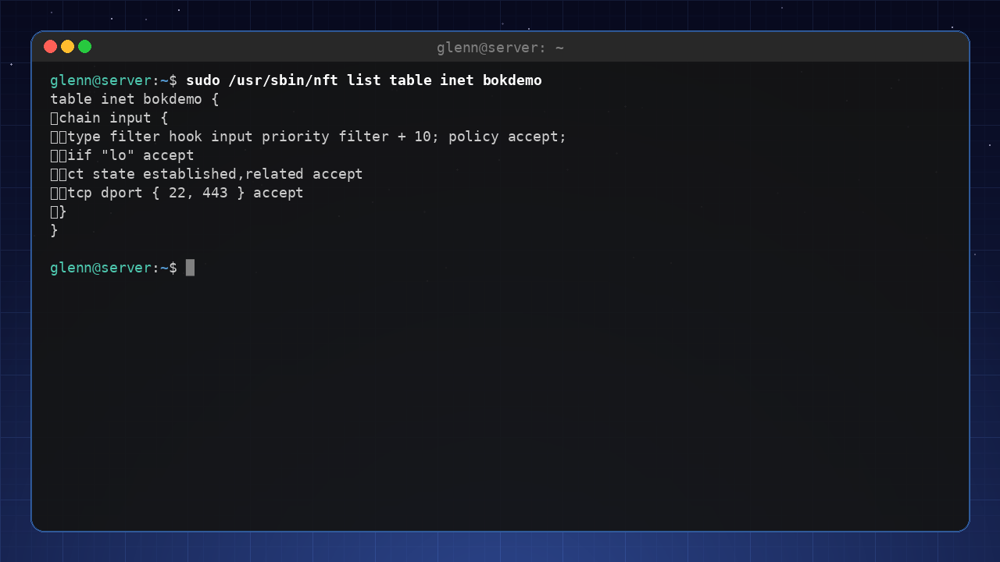
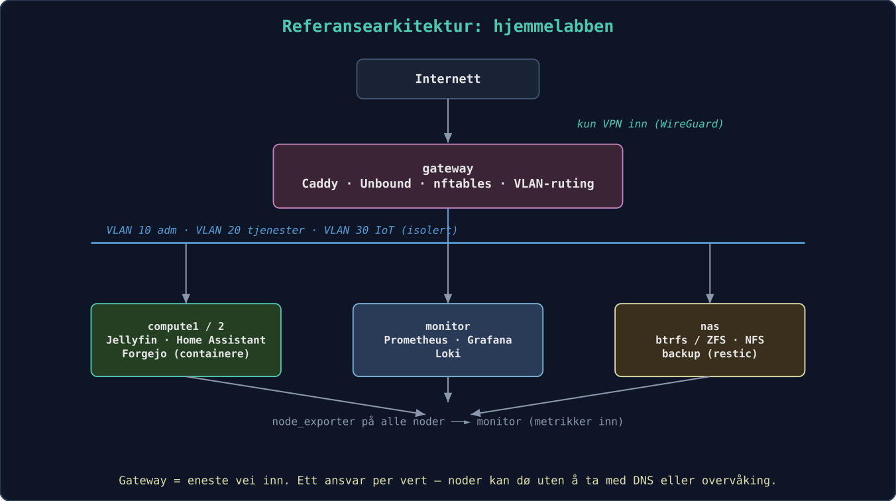

# Linux for Experts 2027

**Third book in the series – master your system at the source level and run your own infrastructure like a pro.**

*Collected edition – all chapters in one file. Generated 2026-08-02.*

## Contents

- Preface
- 1. The Kernel
- 2. Processes, Signals, and cgroups
- 3. Memory and Performance
- 4. X-Ray Vision: strace, lsof, and perf
- 5. Serious Storage
- 6. Python for System Administrators
- 7. Ansible
- 8. Your Own Git Server and CI/CD at Home
- 9. 🟡 NixOS
- 10. Expert-Level Networking
- 11. Reverse Proxy and TLS Everywhere
- 12. Monitoring and Alerting
- 13. Containers in Depth
- 14. Virtualization and Home Lab Architecture
- 15. Security, Seriously
- 16. Troubleshooting Without a Safety Net
- 17. The Day the Desktop Won't Start
- 18. Package and Share Your Software
- 19. 🔴 Linux From Scratch
- 20. Giving Back
- 21. Continuing the Journey
- Bonus: FAQ for Experts
- Appendix A: Extended quick reference
- Appendix B: Glossary for experts
- Appendix C: Reference architecture for the home lab
- Appendix D: The Master's Exam


---

# Preface

**The third book in the series – for you who understand your system and now want to master it at the source level, and run your own infrastructure like a pro.**

You've finished *Linux for Intermediate Users* (or the equivalent): you're at home in the terminal, you script with a clear conscience, you run services on a home server, and you use Git daily. This book takes the final step – from "understands Linux" to "can explain, troubleshoot, and build everything."

**What this book is NOT:** certification prep (LPIC/RHCSA), enterprise operations for large organizations, or a programming course. Deliberately left out are also SELinux in depth, raw WireGuard setup (covered in Book 2), Kubernetes in production, and immutable distros – scoping, not oversight. It's still a book for the enthusiast – but now with the whole machinery laid open.

**The thread running through it all:** Over the course of the book you build out your **home lab** into a complete, monitored, automated, and hardened environment – described as code, so the entire setup can be recreated with a single command.

Welcome to the third book. You've already discovered that Linux isn't an operating system you "know," but a workshop you keep getting better acquainted with. Now we're going to open all the doors.

"Expert" here doesn't mean you remember every flag to `tar` or can quote `man` pages from memory. It means you've developed an intuition for how the system fits together, and that you can *reason* your way to solutions for problems you've never seen before. You're going to learn to ask the machine the right questions – and to understand the answers.

The book is built around your **home lab**. It starts as a couple of machines and a few containers, and grows chapter by chapter into a full-fledged, monitored, self-healing environment. What matters most, though, isn't the end result but all the decisions and understanding you pick up along the way. From chapter 7 onward, everything you do becomes version-controlled and automated – the goal is that on the last page you can recreate the entire lab with one single command.

We keep the same friendly tone as in the earlier books. You'll find **Try it yourself** exercises, and challenging sections are marked 🟡 (recommended taste) or 🔴 (optional finale). The chapters follow a fixed template, but principles come before installation manuals. Tools change; understanding lasts. That goes for the version numbers in the book too – kernels, image tags, distro releases – which are as they were when the book was written; the principles hold even as the numbers march on.

Three new devices set this book apart from the previous ones:

**"Measure first."** From now on, one rule governs all tuning: *never adjust anything you haven't measured*. The enthusiast sets `vm.swappiness=10` because a blog post said so; the expert measures before and after. You get the tools along the way: `fio` for disk, `iperf3` for network, `hyperfine` for commands.

**"Anatomy of an Incident."** Each part ends with a real troubleshooting story, told as it unfolds: symptom → hypotheses → commands → findings → lesson. Tools can be looked up – it's the reasoning that makes you an expert.

**The Master's Exam.** At the back of the book (Appendix D), ten exercises await where something *is* wrong in your lab – planted deliberately by a sabotage playbook. No answer key until you've tried.

## What you'll need

| Tier | Hardware | Enough for |
|------|--------|-----------|
| **Minimum** | One machine with 16 GB RAM and VMs | Everything in the book – the whole lab can be virtual |
| **Recommended** | PC + one lab machine (old PC or Pi) | More realistic networking and operations |
| **Luxury** | Dedicated hypervisor host + Pi + NAS | The reference architecture in Appendix C |

In other words, the machine you already have will do. Time-wise: Parts 1 and 2 are evening material (2–4 hours per chapter), Part 3 is weekend projects, and Part 4 is for when the crises (or the curiosity) arrive. The lab's build stages, chapter by chapter, are in Appendix C.

**Tested on:** Commands and package names in this book are verified against Debian 13 and Ubuntu 24.04-based systems (including Linux Mint 22). Where the distros diverge, the text says so. (Example output – kernel versions, package versions, and the like – varies with distro and time, so don't worry if your numbers differ from the book's.) If you're running something else, the differences are small – and now you have the tools to find them. We write `apt` throughout; on Fedora it's `dnf`, on Arch `pacman` – at your level that translation is trivial (the distro safari in Book 2 gave you the map).

Now it's time to see what's really going on under the hood.

---

# 1. The Kernel – the engine you never see

*Part 1: The System in Depth*

**In this chapter you'll learn:**

- Kernel modules: loading, removing, and blacklisting – and why `modprobe` almost always beats `insmod`.
- Module parameters: tuning a driver with `modinfo -p` and `options` lines, without compiling anything.
- The initramfs: the mini-system that boots your machine – what has to be in it, and how to avoid breaking it.
- Kernel parameters in real time with `sysctl` – and the kernel command line in GRUB, done systematically.
- The difference between an oops and a panic, kdump in brief, and Magic SysRq as the last resort.
- What Secure Boot means for third-party modules – the knowledge behind many a black screen.
- 🔴 Optional: compiling your own kernel – with realistic warnings and safety nets.

---

The Linux kernel is the first code that runs after the bootloader, and the last to let go when the machine shuts down. For most people it's an invisible layer – you only notice it when something goes wrong. In this chapter we make the kernel visible. Along the way you'll meet a principle that follows you through the entire book: **everything is a file**. The kernel's settings, the modules' parameters, even the emergency brake that can restart a frozen machine – all of it lives as readable and writable files under `/proc` and `/sys`.

## 1.1 Kernel modules

The kernel is modular. Drivers and filesystem support are loaded on demand. With `lsmod` you see which modules are active, and with `modprobe` you can load or remove them manually. Modules live under `/lib/modules/$(uname -r)/`. When you plug in a USB drive, udev automatically loads `usb-storage` and `ext4` (or whatever the drive is formatted with).

Start by finding out which module drives your own hardware:

```bash
lspci -k | grep -A3 -i network   # "Kernel driver in use:" is the answer
lsmod | grep <driver>            # and there it is, along with who's using it
```

You can blacklist modules you don't want – a problematic Wi-Fi driver, say – with a file in `/etc/modprobe.d/`:

```bash
# /etc/modprobe.d/blacklist-pcspkr.conf
blacklist pcspkr
```

Note the nuance: `blacklist` only prevents *automatic* loading via hardware aliases. If you want to forbid the module entirely, even when something requests it by name, you use the hard variant `install pcspkr /bin/false` – loading then "succeeds" without anything happening.

And if you try to remove a module that's in use (`sudo modprobe -r snd_hda_intel`), you'll most likely get "Module is in use" – PipeWire is holding it. That error message is instructive in itself: the kernel refuses to remove modules that others depend on.

## 1.2 Module parameters – tune the driver without compiling

Most modules have tunable parameters – switches and values the developer has exposed. `modinfo -p` lists them with explanations:

```bash
modinfo -p snd_hda_intel | head -5
```

```
power_save:Automatic power-saving timeout (in second, 0 = disable). (int)
power_save_controller:Reset controller in power save mode. (bool)
enable_msi:Enable Message Signaled Interrupt (MSI) (bint)
...
```

The current values live – of course – as files, under `/sys/module/<module>/parameters/`:

```bash
cat /sys/module/snd_hda_intel/parameters/power_save
```

Some of these files are writable and can be changed in real time; others are read only when the module loads. The permanent route is an `options` line in `/etc/modprobe.d/`:

```bash
# /etc/modprobe.d/audio.conf
options snd_hda_intel power_save=1
```

The next time the module loads (in practice: next boot), the parameter takes effect. This is the tool for when the internet says "set `options iwlwifi 11n_disable=8` to fix your flaky Wi-Fi" – now you know *what* you're actually doing, and you can check with `modinfo -p iwlwifi` what the switch means. For modules compiled *into* the kernel (not loadable), the same thing is set as `module.parameter=value` on the kernel command line – we'll get to that in 1.6.

## 1.3 modprobe vs. insmod – dependencies don't resolve themselves

Modules depend on each other: `ext4` needs `mbcache` and `jbd2`, and many network drivers need shared helper libraries. The map of these dependencies lives in `/lib/modules/$(uname -r)/modules.dep` and is built by `depmod`:

```bash
modprobe --show-depends ext4     # what would modprobe load, and in what order?
```

```
insmod /lib/modules/6.8.0-134-generic/kernel/lib/crc16.ko
insmod /lib/modules/6.8.0-134-generic/kernel/fs/mbcache.ko
insmod /lib/modules/6.8.0-134-generic/kernel/fs/jbd2/jbd2.ko
insmod /lib/modules/6.8.0-134-generic/kernel/fs/ext4/ext4.ko
```

There you see the whole division of labor: `insmod` is the low-level tool that loads *one* .ko file, knowing nothing about dependencies or `/etc/modprobe.d/`. `modprobe` is the boss that looks things up in `modules.dep`, loads everything in the right order, and respects blacklists and `options` lines. That's why `insmod` is almost never the right choice – run it on a module with unmet dependencies and you get cryptic "Unknown symbol" errors in `dmesg`. The one place `insmod` belongs: when you're developing a module yourself and want to load your freshly built .ko file straight from the build directory.

If you've copied a module file under `/lib/modules/` manually (it happens, e.g. with a vendor-supplied driver), you have to update the map before `modprobe` can find it:

```bash
sudo depmod -a
```

Packages and DKMS do this for you – which is why you rarely think about it.

## 1.4 The initramfs – the mini-system before the system

Here's a chicken-and-egg problem: the kernel needs the disk driver and the filesystem module to mount the root filesystem – but the modules live *on* the root filesystem. The solution is the **initramfs**: a small, compressed archive containing exactly the modules and tools needed to reach root. The bootloader loads both the kernel and the initramfs into memory; the kernel unpacks the archive as a temporary root filesystem in RAM, runs a small script that loads modules, finds the root disk (unlocking encryption and activating LVM/RAID if needed) – and then switches to the real root filesystem.

What *must* be in it? Everything that stands between the kernel and the root filesystem:

- The driver for the disk controller (`nvme`, `ahci`, `virtio_blk` in VMs).
- The filesystem module for root (`ext4`, `btrfs` …).
- `dm-crypt` modules and tools if root is encrypted – plus the keyboard driver, or you won't be able to type the passphrase!
- LVM or mdadm support if root lives there (chapter 5).

See for yourself what's in yours:

```bash
lsinitramfs /boot/initrd.img-$(uname -r) | grep -E 'nvme|ext4|dm-crypt'
```

The initramfs is built by `update-initramfs` and must be rebuilt whenever the assumptions change – a new disk controller, a changed `/etc/crypttab`, or an `options`/`blacklist` line in `/etc/modprobe.d/` that needs to apply already during boot:

```bash
sudo update-initramfs -u          # update for the running kernel
sudo update-initramfs -u -k all   # for all installed kernels
```

**If you're on Fedora/Arch:** the same job is done by `dracut` (Fedora) and `mkinitcpio` (Arch, configured via `HOOKS=(...)` in `/etc/mkinitcpio.conf`). The principle – and the failure modes – are identical.

**And when it goes wrong?** If a required module is missing, the kernel can't find the root filesystem. After a timeout you land in the initramfs's emergency shell – a spartan BusyBox prompt:

```
Gave up waiting for root file system device.
(initramfs) _
```

It looks like the end of the world, but it's actually a *tool*: you can list devices with `ls /dev`, load modules manually with `modprobe`, and mount root by hand. The full rescue procedure – including chrooting from a live USB to rerun `update-initramfs` – is the subject of chapter 16.

⚠️ **A broken initramfs = a machine that won't boot.** Therefore: don't delete old kernels the moment a new one is installed. GRUB keeps the previous kernel (with its own, working initramfs) under "Advanced options" – that's your safety net. Always verify that a new kernel boots *before* you clean out the old one.

## 1.5 Kernel parameters and sysctl

The kernel's behavior can be tuned in real time via `/proc/sys/`. The `sysctl` tool gives you a tidy path to these. Run `sysctl -a` and let yourself be fascinated – here you'll find everything from network settings (`net.core.somaxconn`) to memory management (`vm.swappiness`). The dots in the name are literally directory separators: `vm.swappiness` *is* the file `/proc/sys/vm/swappiness`, and `cat` and `echo` work just as well as `sysctl`. By putting lines in `/etc/sysctl.d/` you make changes permanent (`sudo sysctl --system` reloads them without a reboot).

Typical parameters you'll want to tune on a server:
- `vm.swappiness=10` – makes the system stay away from swap for as long as possible (the full story of swap and memory comes in chapter 3).
- `net.ipv4.ip_forward=1` – turns on routing (you'll need it in chapter 10).
- `kernel.sysrq=1` – enables Magic SysRq for emergency recovery (see 1.7).


## 1.6 The kernel command line – GRUB, the e key, and /proc/cmdline

The bootloader (GRUB) passes command-line arguments to the kernel. You may have used `nomodeset` to get graphics working. The permanent parameters live in `/etc/default/grub` under `GRUB_CMDLINE_LINUX_DEFAULT`; after a change, you run `sudo update-grub`. With `quiet` and `splash` you suppress most of the boot messages – but as an expert you may well leave them off, to catch errors as they happen.

The ground truth – what the kernel *actually* received at this boot – is always in:

```bash
cat /proc/cmdline
```

```
BOOT_IMAGE=/boot/vmlinuz-6.8.0-134-generic root=UUID=3f1c... ro quiet splash
```

Check it before you troubleshoot "why isn't my parameter working?" – often the answer is that it never made it in (forgot `update-grub`, or wrong variable in `/etc/default/grub`).

> **Not everyone boots with GRUB: systemd-boot and UKI.** A growing share of systems – Pop!_OS, some Fedora variants, many Arch setups – use **systemd-boot** instead. It reads its entries straight from the ESP partition; `bootctl list` shows them, and `bootctl status` shows which bootloader you actually have. There's no `update-grub` to forget here: kernel packages add entries via `kernel-install`, and the command line sits as plain text in the entry files on the ESP. The next step in the same evolution is **Unified Kernel Images (UKI)**: kernel, initramfs, and command line packed into *one* EFI binary that can be signed as a unit – which plays very well with Secure Boot (1.8). The rescue techniques in chapter 16 apply regardless; only the bootloader repair differs (`bootctl install` instead of `grub-install`). And `/proc/cmdline` is the ground truth no matter which bootloader you run.

**Temporary editing – the expert's favorite trick:** In the GRUB menu (hold Shift or press Esc during boot if the menu is hidden), press `e` on an entry, edit the line starting with `linux`, and boot with Ctrl+X. The change applies to *this one boot only* – perfect for experiments, and completely safe: the next boot is exactly as before.

Parameters worth knowing by heart:

| Parameter | Does | When |
|-----------|------|-----|
| `nomodeset` | Disables the kernel's graphics setup | Black screen during boot (chapter 17) |
| `systemd.unit=rescue.target` | Boot to single-user mode with a root shell | Troubleshooting services that hang the boot |
| `systemd.unit=emergency.target` | Even more minimal – hardly anything mounted | Broken `/etc/fstab` |
| `init=/bin/bash` | Skip systemd entirely – straight into a shell | Forgotten root password, totally wrecked init |
| `console=ttyS0,115200` | Console on the serial port | Headless lab servers and VMs (`virsh console`!) |
| `mitigations=off` | Disables CPU vulnerability mitigations | ⚠️ See below |

`init=/bin/bash` deserves a footnote: you land in a shell where root is mounted *read-only* and nothing else is running – remember `mount -o remount,rw /` before changing anything, and `sync` before forcing a reboot. Chapter 16 uses this as one of its rescue tools.

⚠️ `mitigations=off` gives measurably better performance on older CPUs by disabling the protections against Spectre/Meltdown-class vulnerabilities. On an isolated lab machine it can be a deliberate choice – on anything that runs foreign code (a browser! containers with other people's images!) it's a bad idea. The threat-model thinking that settles such questions comes in chapter 15.

## 1.7 Oops, panic, and Magic SysRq

Two words are often confused, and the difference matters:

An **oops** is the kernel's "exception": it hit a bug (typically a null pointer in a driver), writes an error report to the log, kills the process that was involved – and *keeps running*. You'll find it in `sudo dmesg` or `journalctl -k`, recognizable by "Oops:" or "BUG:" followed by a "Call Trace". After an oops the kernel is marked **tainted** and in an unknown state: save the logs, plan a reboot – but you have time to shut down cleanly.

A **kernel panic** is when the kernel cannot continue without risking data corruption – often an oops in a place where there's no process to sacrifice (interrupt context), or the root filesystem never got mounted. Everything freezes, with a dump on the screen. Here's how to read the most important line:

```
RIP: 0010:usb_submit_urb+0x1f/0x5a0 [usbcore]
```

`RIP` is the instruction pointer: the crash happened in the function `usb_submit_urb`, 0x1f bytes into it, and the module name in brackets – `[usbcore]` – is the prime suspect. The function names are resolved automatically against the kernel's symbol table (`/proc/kallsyms` on a running system, the file `System.map-$(uname -r)` in `/boot`). If a third-party module is in the brackets (`[nvidia]`, `[zfs]`), you've almost always found the culprit. No brackets means the kernel's own code – in which case defective hardware (RAM!) is statistically the most common cause, not a kernel bug.

**kdump – an autopsy instead of guesswork:** You rarely get a chance to read the panic screen, and it doesn't survive a reboot. `kdump` solves this with `kexec`: a spare kernel sits ready in a reserved memory region (the `crashkernel=` parameter on the command line – on Debian/Ubuntu, `kdump-tools` sets it automatically for you), and on panic *that* kernel boots – without restarting the hardware – and writes a memory image to `/var/crash/`:

```bash
sudo apt install kdump-tools     # answer yes to enable
kdump-config show                # "ready to kdump" is the goal
```

For the home lab, analyzing the dump itself (the `crash` tool) is rarely worth the effort – but the fact *that* the dump exists, with the log from the moment of panic in the `dmesg` file next to it, turns "the machine rebooted last night" into a solvable mystery instead of a frustrating one.

**Magic SysRq – the emergency brake:** When the machine seems frozen, the kernel is often still listening at a level below everything else: the key combination Alt+SysRq (SysRq usually shares a key with PrtSc) plus a command letter. What's allowed is governed by `kernel.sysrq` – a bitmask where `1` means "everything" and e.g. `176` (a common default) only allows sync, remount, and reboot. Set `kernel.sysrq=1` in `/etc/sysctl.d/` on lab machines.

The classic is the sequence **REISUB** (hold Alt+SysRq, press the letters a couple of seconds apart): **R**aw (take the keyboard back from the graphics environment), t**E**rm (SIGTERM to everyone – chapter 2 explains why TERM before KILL), k**I**ll (SIGKILL to the rest), **S**ync (write buffers to disk), **U**mount (remount everything read-only), re**B**oot. It's a *controlled* emergency landing – unlike the power button, which is jumping without a parachute as far as your filesystems are concerned.

And because everything is a file: the same commands can be sent via `/proc/sysrq-trigger` – invaluable when you're in over SSH on a machine whose local console is dead:

```bash
echo s | sudo tee /proc/sysrq-trigger   # sync
echo b | sudo tee /proc/sysrq-trigger   # immediate reboot – NO sync first, do s and u yourself!
```

## 1.8 Secure Boot and signed modules

One mechanism explains a surprising number of "the driver installed fine but doesn't work" mysteries: **UEFI Secure Boot**. With Secure Boot on, the firmware only starts bootloaders that are cryptographically signed; the distro's shim and kernel are signed, and the kernel enters *lockdown* mode – it refuses to load **unsigned modules**. Check your own status:

```bash
mokutil --sb-state                          # SecureBoot enabled/disabled
sudo dmesg | grep -i 'secure boot\|lockdown'
```

For everything that comes from the distro's package repository this is invisible – the modules are signed with the distro's key. The problem is **third-party modules built locally via DKMS**: the NVIDIA driver, VirtualBox, ZFS. They're built on your machine and cannot possibly be pre-signed. The solution is **MOK** (Machine Owner Key): a key *you* own, which you enroll in the firmware with `mokutil`, and which DKMS then uses to sign the modules. Debian/Ubuntu/Mint set this up semi-automatically: during installation of a DKMS package you're asked for a one-time password, and at the next boot a blue "MOK Manager" screen appears – **do not skip it**; choose "Enroll MOK" and enter the password. If you skip it, the symptom is a classic:

```bash
sudo modprobe nvidia
# modprobe: ERROR: could not insert 'nvidia': Key was rejected by service
```

The module is perfectly built – the kernel just refuses to trust it. The alternatives are to enroll the key after the fact (`mokutil --import /var/lib/dkms/mok.pub` or your distro's variant – the path varies, so find yours with `sudo find /var/lib -name 'mok*' 2>/dev/null` – then reboot and MOK Manager) or to disable Secure Boot in the firmware – an entirely legitimate choice on a lab machine, but a trade-off you should make deliberately (chapter 15). The full drama of "NVIDIA driver + Secure Boot = black screen" gets its practical treatment in chapter 17 – but now you already know *why* it happens.

## 1.9 🔴 Optional finale: Compile your own kernel

This is more of an educational journey than a necessity. When you boot with a kernel you assembled yourself, much of the mystique evaporates – and you gain an invaluable understanding of which components actually make up a kernel. But let's be honest about what you're giving up first:

- **The distro patches:** Your distro's kernel is not the vanilla kernel from kernel.org – it carries hundreds of patches (hardware fixes, AppArmor setup, backported security fixes). Your self-built kernel doesn't have them.
- **Security updates:** The distro's kernel is updated by `apt`; yours you maintain yourself – or let it rot.
- **Secure Boot:** Your self-built kernel is unsigned. With Secure Boot on, it simply won't boot – you either have to sign it with your MOK key (see 1.8) or disable Secure Boot while you experiment.

Therefore: do this in a VM, or on the lab machine where the previous kernel is standing by in GRUB anyway.

The configuration itself is half the learning, and there are three paths:

- `make menuconfig` – the interactive menu system. Fascinating to *explore*, but answering 12,000 questions sensibly from scratch is unrealistic.
- `make oldconfig` – start from an existing config (copy your distro's: `cp /boot/config-$(uname -r) .config`) and only get asked about *new* options. The sensible default route.
- `make localmodconfig` – like oldconfig, but disables every module that isn't *loaded right now*. Build time plummets (minutes instead of hours) – but plug in your USB gadgets first, or you'll build a kernel without support for them.

```bash
sudo apt build-dep linux                       # the build tools
tar xf linux-6.x.tar.xz && cd linux-6.x        # latest stable from kernel.org
cp /boot/config-$(uname -r) .config            # start from the distro's config
make olddefconfig                              # like oldconfig, but takes default answers for everything new
make -j$(nproc)                                # coffee. lots of coffee. (localmodconfig: one cup)
sudo make modules_install install              # puts kernel+initramfs in /boot and runs update-grub
```

(`linux-6.x` is a placeholder – grab the latest stable from kernel.org, the 6.x series, and consider the latest LTS if you'd rather not upgrade often.)

The last step matters more than it looks: `make install` *adds* the new kernel to GRUB – it replaces nothing. Your distro kernel is still there under "Advanced options" as a fallback, with its own initramfs. If the new kernel doesn't boot (and it often doesn't on the first try – that's half the point), you just pick the old one and try again. The same safety net as in 1.4: **never delete a working kernel before its successor has proven itself.**

---

**Try it yourself:**

1. Find your network card's driver with `lspci -k`, and see it in `lsmod`. Then load and remove a *harmless* module: `sudo modprobe pcspkr && sudo modprobe -r pcspkr`, and watch the events with `sudo dmesg | tail`.
2. Pick a module you actually use (e.g. `snd_hda_intel` or your Wi-Fi driver), run `modinfo -p` on it, and read the current values in `/sys/module/<module>/parameters/`. Do you recognize any of the switches from forum threads you've followed?
3. Run `modprobe --show-depends ext4` and compare with `grep ext4 /lib/modules/$(uname -r)/modules.dep` – you're seeing the same map from two angles.
4. Look inside your own initramfs: `lsinitramfs /boot/initrd.img-$(uname -r) | grep -E 'nvme|ahci|ext4|btrfs'`. Can you find the driver for *your* disk controller and *your* root filesystem?
5. Compare `cat /proc/cmdline` with `GRUB_CMDLINE_LINUX_DEFAULT` in `/etc/default/grub`. Also check `mokutil --sb-state` – is Secure Boot on for you?
6. 🟡 Boot once into rescue mode: press `e` in the GRUB menu, add `systemd.unit=rescue.target` to the `linux` line, and boot with Ctrl+X. Look around, then `reboot` – the next boot is completely normal. (Feel free to do it in a VM the first time.)
7. 🟡 Enable full SysRq (`sudo sysctl kernel.sysrq=1`) and test the most harmless command: `echo s | sudo tee /proc/sysrq-trigger`, then look for "Emergency Sync complete" in `sudo dmesg | tail`. Now you know the emergency brake works – *before* you need it.
8. 🔴 In a VM: install `kdump-tools`, verify with `kdump-config show`, and trigger a controlled panic with `echo c | sudo tee /proc/sysrq-trigger`. Watch the VM kexec-boot, and find the autopsy report under `/var/crash/`. Read the `dmesg` file there and identify the RIP line.
9. 🔴 Build your own kernel in a VM following the recipe in 1.9 – with `localmodconfig` to keep the build time down. Boot it, run `uname -r`, and enjoy the view. Then boot *back* into the distro kernel via "Advanced options", so you've practiced the safety net too.

---

**Key takeaways from this chapter**

- `modprobe` resolves dependencies via `modules.dep` (built by `depmod`) and reads `/etc/modprobe.d/`; `insmod` does neither – use it only on modules you've built yourself.
- Module parameters: `modinfo -p` shows them, `/sys/module/<m>/parameters/` shows current values, `options` lines in `/etc/modprobe.d/` make them permanent.
- The initramfs contains everything between the kernel and the root filesystem; `update-initramfs -u` builds it, `lsinitramfs` shows its contents, and if something's missing you land in the `(initramfs)` shell (chapter 16). The previous kernel in GRUB is the safety net – never delete it too early.
- `sysctl` tunes the kernel in real time via `/proc/sys/`; `/etc/sysctl.d/` makes it permanent.
- The command line: `e` in GRUB changes one boot, `/etc/default/grub` + `update-grub` changes all of them, and `/proc/cmdline` is the ground truth. If the system boots with systemd-boot/UKI instead of GRUB, the tools are `bootctl` and `kernel-install` – no `update-grub`. `systemd.unit=rescue.target` and `init=/bin/bash` are rescue tools; `mitigations=off` is a trade-off, not a free lunch.
- Oops = the kernel limps on (read `journalctl -k`, plan a reboot); panic = full stop. The RIP line with a module name in brackets points to the culprit; kdump gives you the autopsy, Magic SysRq (REISUB) gives you the controlled emergency landing.
- Secure Boot requires signed modules: DKMS modules are signed with your MOK key via `mokutil` – "Key was rejected by service" means the key isn't enrolled, not that the driver is broken (chapter 17).
- Your own kernel costs you distro patches, automatic updates, and the Secure Boot signature – build with `oldconfig`/`localmodconfig` from the distro's `.config`, and always keep a working kernel in GRUB.

---

# 2. Processes, Signals, and cgroups

*Part 1: The System in Depth*

**In this chapter you'll learn:**

- What a process *really* is – and how to read everything about it in `/proc`.
- Signals: the language you speak to processes, and why SIGKILL should be the last resort.
- The process tree and process states – the truth about zombies and the unkillable.
- Priorities with `nice` and `ionice` – and why they are only wishes.
- Cgroups: how systemd (and containers) set limits processes can't escape.
- Slices, scopes, and services: systemd's map of the cgroup tree – and how you choose whom the OOM killer takes first.
- Capabilities: root broken into pieces – the bridge to hardening (chapter 15) and containers (chapter 13).
- Two systemd tricks you'll use for the rest of the book: drop-ins and template units.

---

A process is a program in execution – so far the beginner definition. The expert needs more: how processes come into being, how they die, how you talk to them while they live, and how you set limits they cannot escape. That last part is the foundation under the containers in chapter 13 – and under the incident that closes Part 1, when the OOM killer picked the wrong victim.

## 2.1 What a process really is

Every process has a **PID** and a parent (**PPID**) – all of them descendants of PID 1 (systemd). But the truly useful part is that the process's entire inner life lies open in `/proc/<PID>/` – the "everything is a file" principle from chapter 1 in practice:

```bash
ls /proc/$$/            # $$ = the PID of the shell you're sitting in
cat /proc/$$/cmdline    # the command line it was started with
ls -l /proc/$$/cwd      # symlink to the working directory – right now
ls -l /proc/$$/fd       # all open files, sockets, and pipes
grep -E 'State|VmRSS' /proc/$$/status   # state and actual memory use
```

`/proc/<PID>/fd` is underrated in troubleshooting: "which file is this process actually writing to?" is answered with a single `ls -l`. (The `lsof` tool from chapter 4 is in practice a pretty frontend to exactly this.)

The rest of the directory is an answer book – each file answers its own troubleshooting question:

```bash
tr '\0' '\n' < /proc/$$/environ   # the environment it STARTED with (null-separated, hence tr)
cat /proc/$$/limits               # the ulimits that actually apply – "too many open files"?
cat /proc/$$/io                   # bytes read and written – who's grinding on the disk?
cat /proc/$$/sched                # got CPU or just waited? (runtime, context switches)
cat /proc/$$/smaps_rollup         # memory, honestly accounted
```

Two of them deserve elaboration. `environ` is the answer when a service "doesn't see" the variable you set – you set it in your shell, not in the service's environment, and here you see the ground truth. And `smaps_rollup` corrects a lie in `ps`: RSS counts shared libraries in full in *every* process that uses them. The `Pss` field distributes shared memory fairly among its users, and `Private_Dirty` is what only this process is holding on to – the number that's actually freed if it dies. Ten nginx workers "using 50 MB each" in `ps` are in reality sharing most of it. The tools `smem` and `ps_mem` do this arithmetic for all processes at once and sort by Pss – handy when you want to find the *actual* memory culprit. (Want it per memory region instead of as a sum: `smaps`, same directory.)

And when `ps aux` shows too much: build your own view with `-o`:

```bash
ps -o pid,ppid,stat,ni,rss,cmd -p $$      # exactly the columns you care about
ps -eo pid,ppid,stat,cmd --forest | less  # the whole tree, indented
```

## 2.2 Signals – the language of processes

`kill` sends signals, not necessarily death. The ones you'll actually meet:

| Signal | No. | Meaning | Can be caught? |
|--------|----|-----------|-------------|
| SIGTERM | 15 | "Please exit" – the process gets to clean up | Yes |
| SIGKILL | 9 | "Die now" – the kernel removes the process directly | **No** |
| SIGHUP | 1 | "The line dropped" – services often use it to reload their config | Yes |
| SIGINT | 2 | Ctrl+C in the terminal | Yes |
| SIGSTOP / SIGCONT | 19/18 | Freeze / thaw (SIGSTOP can't be caught either) | No / Yes |
| SIGUSR1/2 | 10/12 | "Free for any use" – asks e.g. `dd` for a progress report | Yes |

(`kill -l` lists them all; `man 7 signal` explains them.)

**Why the order TERM → KILL matters:** the process can *catch* SIGTERM (with `trap`, as in your scripts from Book 2) and use it to close files, flush buffers, and log out of the database. SIGKILL is never delivered to the process – the kernel simply removes it: no cleanup, half-written files, leftover lock files. Hence: `kill PID`, wait a few seconds, *then* possibly `kill -9`. (systemd does exactly this on `systemctl stop`: TERM, a grace period, then KILL.)

In practice you target processes by name, not number:

```bash
pgrep -a jellyfin                  # find and show – always pgrep BEFORE pkill
pkill -HUP nginx                   # ask all the nginx processes to reread their config
sudo systemctl kill -s HUP nginx   # same, but precisely scoped to the service's cgroup
```

The last one is the expert's variant: `systemctl kill` hits *exactly* the processes that belong to the service – never a random process that happens to share the name. (And avoid getting used to `killall`: on certain other Unix systems it literally means "kill everything.")

## 2.3 The process tree, zombies, and the unkillable

`pstree -p` shows the family relationships. Two fates are worth understanding:

**Orphans**: if the parent dies first, the child is adopted by PID 1 (or a *subreaper*, such as a terminal multiplexer). Entirely undramatic – it's how nohup jobs and tmux sessions survive.

**Zombies** (`Z` in the STAT column): the process is *finished*, but the parent hasn't collected its exit code yet. A zombie uses no CPU and no memory – just a row in the process table. It can't be killed, because it's already dead; what helps is the *parent* cleaning up (or dying itself, so PID 1 takes over). Watch one be born and die:

```bash
python3 -c 'import os,time
if os.fork() == 0: exit()      # the child exits immediately
time.sleep(15)'                # the parent waits without collecting the exit code
# in another terminal, within 15 seconds:
ps -eo pid,stat,cmd | grep -w Z    # <defunct> – there's the zombie
```

After 15 seconds the parent dies, and the zombie disappears with it. Many zombies from the same program are a bug in the program – not in Linux.

**The truly unkillable** are not the zombies but the `D` state: *uninterruptible sleep*, almost always waiting for I/O (a dying disk, a hung NFS mount). A D process ignores even SIGKILL – it cannot be interrupted in the middle of a kernel call. If you see processes stuck in D: stop shooting at the process and find the I/O problem (`iotop`, `dmesg` – chapter 4 takes the hunt further).

The states you read in `ps`: `R` running, `S` sleeping (normal), `D` waiting for I/O, `T` stopped, `Z` zombie.

## 2.4 nice and ionice – priority without guarantees

Before the hard limits: the soft ones. `nice` lowers CPU priority (0 is the default, 19 is "back of the line"), `renice` changes a running process, and `ionice` does the same for disk:

```bash
nice -n 19 tar czf backup.tar.gz ~/data   # start out nice
sudo renice 19 -p 4242                    # make a running process nice
ionice -c 3 -p 4242                       # I/O class idle: disk only when nobody else wants it
```

Note the limitation: nice only helps when there's *competition* for the resources, and guarantees nothing. For batch jobs it's often all you need – incident #3 later in the book is solved with `IOSchedulingClass=idle`, which is systemd's way of saying `ionice -c 3`. If you need guarantees, you go to cgroups.

And at the very opposite end of the scale: **real time**. `chrt` sets the POSIX real-time classes (SCHED_FIFO/RR), which take precedence over *everything* ordinary – nice values included:

```bash
chrt -p 4242                          # show class and priority for a running process
sudo chrt -f 50 audio-processing      # SCHED_FIFO, priority 50 – ahead of everything normal
```

🔴 Treat `chrt` like a loaded gun: a real-time process in an endless loop never voluntarily gives up the CPU, and can in practice freeze the machine – not even the SSH session you were going to rescue yourself with gets any runtime. Use it only for short, well-tested audio and measurement jobs, and deny services that don't need it the entire capability with `RestrictRealtime=yes` (chapter 15).

## 2.5 Cgroups – hard limits, measured consumption

Control groups (cgroups v2) are the kernel's mechanism for **limiting, measuring, and isolating** resource use for *groups* of processes. Systemd organizes the whole machine into a cgroup tree – see it for yourself with `systemd-cgls`:



*The figure shows: directives like `MemoryMax=` and `CPUQuota=` are set on branches and inherited down the hierarchy – nginx cannot escape the quota by starting more workers.*


The limits are set in unit files (or drop-ins, see 2.9):

```ini
[Service]
MemoryHigh=400M     # soft limit: above this the process is throttled and memory reclaimed aggressively
MemoryMax=500M      # hard limit: above this → OOM kill, but ONLY within this cgroup
CPUQuota=50%        # hard CPU limit: at most half a core, no matter how idle the machine is
CPUWeight=50        # soft: half weight WHEN there's competition for CPU (default is 100)
```

The soft/hard distinction is the expert knowledge here: `MemoryHigh` gives the service a chance to behave (and gives you a blip in your metrics), `MemoryMax` is the guillotine – but a *local* guillotine that protects the rest of the machine. That's exactly the medicine from incident #1: the photo indexing got `MemoryHigh`, and the database no longer had to die for its sins.

Memory and CPU are just two of the controllers. Here are the four you'll actually use – every limit exists both as a file in the cgroup and as a systemd directive:

| Resource | File in the cgroup | systemd directive | Typical use |
|---------|----------------|------------------|-------------|
| CPU | `cpu.max` | `CPUQuota=` | rein in a CPU-hungry job |
| Memory | `memory.high` / `memory.max` / `memory.swap.max` | `MemoryHigh=` / `MemoryMax=` / `MemorySwapMax=` | brake / guillotine / swap ceiling |
| I/O | `io.max` / `io.latency` | `IOReadBandwidthMax=` et al. / `IODeviceLatencyTargetSec=` | bandwidth cap / latency target |
| Process count | `pids.max` | `TasksMax=` | fork-bomb protection |

Two of them deserve a footnote. `io.latency` is not a cap but a *target*: you say "this group shall have at most 10 ms of I/O latency," and the kernel throttles the *other* groups when the target is missed – the right tool when the database should have first claim on the disk. And `pids.max` is the underrated fork-bomb protection: a service that strays into endless forking bangs its head against the ceiling of its own cgroup instead of filling the entire process table. (systemd already sets `DefaultTasksMax=` on all services – which is why a classic fork bomb in a service no longer takes down the whole machine.)

The files can be read – and written – directly:

```bash
cat /sys/fs/cgroup/system.slice/ssh.service/pids.max
echo 200 | sudo tee /sys/fs/cgroup/system.slice/ssh.service/pids.max   # applies until restart
```

But set the limit in the unit file instead (`TasksMax=200`): sysfs changes vanish at the next reboot – the same lesson as with `sysctl` in chapter 1.

And everything can be *measured* while it runs – cgroups keep the books whether or not you've set any limits:

```bash
cat /sys/fs/cgroup/system.slice/ssh.service/memory.current   # actual use, right now
systemd-cgtop                                                # "top", but per cgroup
```

One-off jobs don't need a unit file – `systemd-run` creates a temporary one:

```bash
systemd-run --user -p CPUQuota=10% dd if=/dev/zero of=/dev/null
```

This is the bedrock the containers in chapter 13 stand on: a container is, at bottom, processes in a cgroup plus namespaces. If you understand the tree above, you've already understood half of container technology.

## 2.6 Slices, scopes, and services – systemd's map of the tree

You've seen `systemd-cgls` – now you'll read the output like a native. systemd builds the tree out of three unit types:

- **`.slice`** units are the *branches* – pure grouping, no processes of their own. Limits set on a slice apply to the sum of everything beneath it.
- **`.service`** units are the *leaves* systemd itself starts – every service in its own cgroup, which is why `systemctl kill` hits so precisely.
- **`.scope`** units are processes that came into being somewhere else but should be accounted for in the tree: SSH sessions, terminal windows, `systemd-run --scope` jobs, VMs.

The top of the tree is always the same: `system.slice` (all system services), `user.slice` (one `user-<UID>.slice` per logged-in user), and `machine.slice` (VMs and containers, chapters 13–14). That gives you immediately useful handles – if you want all user sessions *combined* to never choke the services, you set the limit on `user.slice`, in one place:

```bash
systemd-cgls /system.slice        # one branch at a time
systemd-cgtop -m                  # "top" per cgroup, sorted by memory (-c CPU, -i I/O)
systemctl status 4242             # the expert trick: which unit OWNS this PID?
sudo systemctl set-property user.slice MemoryHigh=4G   # limit on a whole branch, live
```

You create your own branches with `Slice=`: define `batch.slice` with `CPUWeight=20`, set `Slice=batch.slice` in all your batch jobs – one limit, many services.

## 2.7 Who shall die? `OOMScoreAdjust=` vs. `MemoryMax=`

If the *whole machine* runs out of memory, the kernel's OOM killer wakes up and picks a victim by score – chapter 3 covers the full arithmetic. But you can look at the cards already:

```bash
cat /proc/$$/oom_score       # the kernel's dice roll: higher number dies first
cat /proc/$$/oom_score_adj   # your thumb on the scale: −1000 to +1000
```

`OOMScoreAdjust=` in a unit file sets that last number: `-500` says "take someone else first," `+500` says "feel free to take me." (`-1000` means "never" – reserved for things like sshd; use it with respect, because an unkillable memory leak is a nightmare.)

So you have two tools that are often confused, each with its own job:

- **`MemoryMax=`** is a *local* hard limit: it protects the rest of the machine against this service. Set it on the *suspects* – services that might take it into their heads to balloon.
- **`OOMScoreAdjust=`** influences the *global* choice: it protects this service against the rest of the machine. Set it (negative) on the *victims* that must survive – the database, SSH.

Incident #1 with the benefit of hindsight: the photo indexing should have had `MemoryHigh=`/`MemoryMax=` (suspect), the database `OOMScoreAdjust=-500` (victim). Belt and suspenders.

## 2.8 Capabilities – root broken into pieces

Finally, a dimension of processes you need for both security and containers: **capabilities**. Classic Unix is binary – root gets everything, everyone else gets the rest. Modern Linux breaks root's superpowers into roughly 40 pieces: `CAP_NET_BIND_SERVICE` (bind ports below 1024), `CAP_NET_RAW` (raw network packets – which is why `ping` can run without root), `CAP_SYS_ADMIN` ("the new root" – so broad it's almost as dangerous as everything). Every process carries its own sets, and you read them straight out of `/proc`:

```bash
grep Cap /proc/$$/status            # five bitmasks – CapEff is "what applies right now"
capsh --decode=000001ffffffffff     # translate the mask into names (package libcap2-bin)
getpcaps 4242                       # same answer, pre-translated, per PID
capsh --print                       # your own, right now
```

(The system call behind the adjustments is called `prctl` – you'll see it in `strace` output in chapter 4, typically when a process drops capabilities it's finished with.)

The expert use is the systemd directives – this is how a service runs as a harmless user but gets to bind port 80:

```ini
[Service]
User=web
AmbientCapabilities=CAP_NET_BIND_SERVICE     # gets exactly this piece
CapabilityBoundingSet=CAP_NET_BIND_SERVICE   # ...and can NEVER acquire more
```

This is the bridge onward: hardening in chapter 15 is largely about shrinking `CapabilityBoundingSet=` (and `systemd-analyze security` grades you on it), and the containers in chapter 13 are to a large degree defined by which capabilities they *don't* have – container runtimes drop most of them by default.

## 2.9 Two systemd tricks experts use daily

**Override without touching the package's files:** `sudo systemctl edit myservice` opens an empty "drop-in" file in `/etc/systemd/system/myservice.service.d/`. Everything you write there overrides the package's unit file – and survives upgrades. This is how you put `MemoryMax=` on a service you don't own. `systemctl cat myservice` shows the result with all drop-ins.

**Template units:** A file named `backup@.service` can be started as `backup@documents.service` and `backup@photos.service` – `%i` in the file is replaced with whatever comes after the at sign. One definition, many instances. You'll meet the pattern everywhere: `getty@tty1`, `wg-quick@wg0`.

---

**Try it yourself:**

1. Explore your own shell: `ls -l /proc/$$/fd` and `grep State /proc/$$/status`. Open a file with `less` in another window and watch it show up under `fd`.
2. Run the zombie demo from 2.3 and watch `<defunct>` come and go in `ps`.
3. Start `systemd-run --user -p CPUQuota=10% dd if=/dev/zero of=/dev/null`, see that `top` shows ~10%, find it in `systemd-cgls --user`, and read its `memory.current` under `/sys/fs/cgroup/user.slice/`. Stop it with `systemctl --user stop <the name you were given>`.
4. 🟡 Test the guillotine safely: `systemd-run --user --scope -p MemoryMax=100M stress --vm 1 --vm-bytes 200M` – the job is OOM-killed *inside its own cgroup* without the machine noticing a thing. See the proof with `journalctl --user -e`.
5. Send `SIGUSR1` to a running `dd` (`pkill -USR1 dd`) and watch it report progress – signals are more than murder.
6. Read more of your shell's records: `tr '\0' '\n' < /proc/$$/environ`, `cat /proc/$$/limits`, and `cat /proc/$$/oom_score`. Does "Max open files" match `ulimit -n`?
7. Decode PID 1's superpowers: take the `CapEff` mask from `grep Cap /proc/1/status` and run `capsh --decode=<the mask>`. Compare with your own shell (`capsh --print`).
8. 🔴 Detonate a fork bomb in a cage: `systemd-run --user --scope -p TasksMax=30 -p CPUQuota=20% bash -c ':(){ :|:& };:'`. **Type the command EXACTLY as written** – if you forget `-p TasksMax=30`, there is no cage, and the bomb really does take down the machine. Success looks like this: `pids.current` in the scope's cgroup directory sits banging against 30, the terminal fills up with "Retry: Resource temporarily unavailable" – and the rest of the machine stays responsive. Find the scope with `systemd-cgls --user`, and clean up with `systemctl --user stop <the scope name>`.

---

**Key takeaways from this chapter**

- `/proc/<PID>/` is the process's open record – `fd`, `status`, `limits`, `environ`, `io`, and `smaps_rollup` answer most questions. `Pss` is the honest memory number; RSS lies about shared memory.
- TERM before KILL, always: SIGKILL means zero cleanup. `systemctl kill` hits precisely.
- Zombies are harmless rows in a table; the `D` state means "find the I/O problem, don't shoot the process."
- nice/ionice are wishes, `chrt` is an order (and dangerous in a loop – `RestrictRealtime=` exists for a reason); cgroups are guarantees. `MemoryHigh` brakes, `MemoryMax` beheads – locally.
- Limits are set on branches of the cgroup tree and inherited downward – this is what containers are made of. `TasksMax=` is the fork-bomb protection.
- Slices are branches, services are leaves, scopes are adopted children. `systemd-cgtop` shows the books; `systemctl status <PID>` shows the owner.
- `MemoryMax=` protects the machine against the service; `OOMScoreAdjust=` protects the service against the machine. Chapter 3 covers the arithmetic behind it.
- Capabilities are root broken into pieces: `AmbientCapabilities=` gives a harmless user exactly enough – the foundation under chapters 13 and 15.
- `systemctl edit` (drop-ins) and `name@.service` (templates) are tools you'll use for the rest of the book.

---

# 3. Memory and Performance – the Truth About "Full RAM"

*Part 1: The System in Depth*

**In this chapter you'll learn:**

- Why "free" memory is almost always in use – deliberately – and the difference between the page cache and buffers.
- How to read `/proc/meminfo`, `vmstat`, and `sar -r` without misreading them: Active/Inactive, Dirty, Writeback, anonymous vs. file-backed memory.
- What `drop_caches` actually does – and why benchmarking is the only good reason to use it.
- Swap, swappiness – and zram vs. zswap: which is which, and when compressed memory pays off.
- The OOM killer: how it picks its victim, and how you influence the choice.
- Transparent Huge Pages (THP): free performance for some, a latency ghost for others.
- PSI – the kernel's own pressure gauges, the modern supplement to load average.
- The NUMA basics that explain oddities on used servers.

---

"Linux is eating all my memory!" you hear beginners say. The beginner answer is "no, that's just cache." The expert answer is longer – and more useful: memory management in Linux is a system of lists, thresholds, and trade-offs that you can *read* straight out of `/proc`, just like you read processes in chapter 2. If you can read it, you can tell "the machine is busy" from "the machine is about to drown" – long before the OOM killer has to pick a victim.

## 3.1 Page cache and buffers – free performance, precisely explained

Linux uses free RAM as disk cache. When you read a file, its contents are copied into memory. Read it again and it's lightning fast. When you write, data goes to the cache first and gets flushed to disk later (write-back). `free` shows "available" memory, which is the real amount free for new processes – cache counts as available because the kernel can drop it instantly.

`free` shows two columns people mix up:

- **buff (Buffers):** cache for *block devices* – filesystem metadata and raw block I/O. Usually a few dozen MB.
- **cache (Cached):** the **page cache** – the actual *contents* of files you've read or written. This is where the big gigabytes live.

And one more trap: `Cached` includes **Shmem** – tmpfs and shared memory. A 4 GB file in `/tmp` (if that's tmpfs) looks like "cache" but can *not* be dropped – it exists nowhere else. That's the most common reason "available" is lower than `free + buff/cache` would suggest.

The rule of thumb: look at **available**, ignore **free**. A machine with 200 MB "free" and 12 GB "available" is doing perfectly fine.

## 3.2 Reading /proc/meminfo like an expert

`free` is the summary; `/proc/meminfo` is the full ledger. The fields that actually matter:

```bash
grep -E '^(MemFree|MemAvailable|Buffers|Cached|Shmem|Active|Inactive|Dirty|Writeback|AnonPages|SReclaimable):' /proc/meminfo
```

| Field | Means | Common misreading |
|------|-------|-------------------|
| `MemFree` | RAM nobody is using for anything | "Low MemFree = problem." No – unused RAM is wasted RAM. |
| `MemAvailable` | The kernel's estimate of what new processes can get | The number you should actually look at. |
| `Active` / `Inactive` | The kernel's two LRU lists: recently used pages vs. reclaim candidates | "Inactive = waste." No – it's the *restocking shelf* the kernel draws from first when someone needs memory. |
| `Active(anon)` / `Inactive(anon)` | Anonymous memory (heap, stack – no file behind it) | Can only be reclaimed via **swap**. Without swap, this memory is locked in. |
| `Active(file)` / `Inactive(file)` | File-backed memory (the page cache) | Can be dropped (clean) or written back (dirty) – which is why file cache is "cheap" and anonymous memory is "expensive." |
| `Dirty` | Written pages not yet on disk | A big number *during* a big copy is normal – that's write-back doing its job. |
| `Writeback` | Pages being written to disk *right now* | Persistently high = the disk can't keep up. The storage hunt continues in chapter 5. |
| `Shmem` | tmpfs and shared memory | Looks like cache, cannot be dropped. |
| `SReclaimable` | Reclaimable slab (dentry/inode caches) | Also part of "available" – the kernel's own metadata caches. |

The **anonymous vs. file-backed** distinction is the key to this whole chapter: file pages have a copy on disk and can be released for free; anonymous pages have no file behind them and *must* go to swap to be reclaimable. That's why a system without swap, under memory pressure, ends up throwing away the entire page cache (and turning slow as molasses from all the re-reading) before the OOM killer finally steps in.

## 3.3 vmstat and sar -r – read correctly

`vmstat 1` gives you one snapshot per second. The columns that actually reveal memory pressure:

```bash
vmstat 1 5
```

```
procs -----------memory---------- ---swap-- -----io---- -system-- -------cpu-------
 r  b   swpd   free   buff  cache   si   so    bi    bo   in   cs us sy id wa st
 1  0 204800 312456  48220 6892344   0    0     4    12  310  620  3  1 95  1  0
```

- **si / so** (swap in/out, KB/s): *this* is the distress signal – not `swpd`. That swap *is in use* (`swpd` > 0) only means the kernel at some point found cold memory it would rather use for cache. Sustained **so** means it's pushing pages out *right now*; **si** at the same time means it's pulling them back in again – that's *thrashing*, and the machine feels dead.
- **b:** processes in uninterruptible wait – the `D` state from chapter 2.3, almost always I/O.
- **wa:** CPU time spent waiting for I/O. High `wa` + high `b` = the disk is the bottleneck, not the CPU.

The most common misreading in one sentence: **"swap is in use, so we have a problem" is wrong – sustained si/so is the problem.**

`sar -r` (from the `sysstat` package) gives the same picture over time – and has a trap of its own: `%memused` includes cache and therefore typically sits in the 90s on a perfectly healthy machine. Look at `kbavail` instead, and – for capacity planning – `%commit`: how much memory processes *have been promised in total*, which can exceed 100% (overcommit is normal; it only becomes dangerous when the promises are all called in at once). Chapter 12 systematizes this with continuous collection.

## 3.4 drop_caches – what it does, and when it's pointless

`/proc/sys/vm/drop_caches` takes three values: `1` drops the page cache, `2` drops the slab caches (dentries/inodes), `3` both. Only *clean* pages are dropped – hence `sync` first, so dirty pages get written to disk and become clean:

```bash
sync
echo 3 | sudo tee /proc/sys/vm/drop_caches
```

**⚠️ This does not "free up" memory you need.** The kernel reclaims cache automatically – in the right order, guided by the LRU lists from 3.2 – the very moment someone actually needs the memory. Dropping the caches manually only makes the machine *slower*, because everything has to be re-read from disk, and `free` looks "prettier" for a few minutes. Production scripts running drop_caches from cron are a sure sign that someone misread `free`.

The *one* good reason: **benchmarking**. If you want to measure cold performance (first read after boot), the cache has to go – otherwise you're measuring RAM speed and thinking it's the disk. This is what the "measure first" principle looks like in practice:

```bash
# Create a 1 GB test file
dd if=/dev/urandom of=~/testfile bs=1M count=1024

# Cold read: the disk has to deliver
sync; echo 3 | sudo tee /proc/sys/vm/drop_caches
time cat ~/testfile > /dev/null

# Warm read: the page cache delivers
time cat ~/testfile > /dev/null
```

Typical result on a SATA SSD: **~2.0 s cold, ~0.15 s warm** – a factor of 10–15. On spinning rust, often a factor of 50. That's the entire page cache chapter in two numbers. With `hyperfine` (from Book 2's "measure first" toolbox) it becomes reproducible:

```bash
hyperfine --prepare 'sync; echo 3 | sudo tee /proc/sys/vm/drop_caches' 'cat ~/testfile > /dev/null'
```

`--prepare` runs before *every* round, so all the measurements are cold – that's exactly why the flag exists.

## 3.5 Swap and swappiness

Swap is not "emergency RAM" – it's the kernel's ability to reclaim *anonymous* memory (cf. 3.2). Without swap, only the file cache can be sacrificed; with swap, the kernel can additionally park cold heap pages from processes that never touch them, and use the space for cache that actually does useful work.

`vm.swappiness` (0–200, default 60) controls the balance between swapping anonymous memory and dropping file cache. A low value (10) means "drop cache first, keep process memory in RAM as long as possible" – sensible on a desktop, where an application being swapped back in feels like stuttering. On servers with a good SSD, the default is rarely worth touching – and if you have zram (next section), a *higher* swappiness is often the right call, since "swap" is then compressed RAM and nearly free.

## 3.6 zram and zswap – compressed memory in practice

The two get mixed up constantly, but they are different mechanisms:

- **zram** is a compressed ramdisk used as a swap device. Pages that get "swapped out" are compressed and stay in RAM – the disk isn't touched at all. Typical compression is 2–3:1: 2 GB of zram swap might cost 800 MB of physical RAM.
- **zswap** is a compressed *buffer in front of* an existing disk swap. Pages are compressed into a RAM pool first; only when the pool is full are the oldest ones written to the disk behind it. It's enabled with the kernel parameter `zswap.enabled=1` (chapter 1) – but note that zswap is already *on* by default in many newer kernels and distros; check with `cat /sys/module/zswap/parameters/enabled`. If you set up zram swap on such a system, make a deliberate choice about the combination – letting zswap compress pages on their way into an already-compressed zram device is just a waste of CPU.

The rule of thumb: **zram when you don't want disk swap at all** (little RAM, a Raspberry Pi with a wear-prone SD card, a laptop with a small SSD), **zswap when you already have disk swap** and want to make it less painful – among other reasons because hibernation requires real disk swap, which zram cannot provide. If you have plenty of RAM and almost never any swap traffic, neither gives you a measurable gain – compressing pages that never get swapped is just CPU cycles burned for nothing.

Practical setup with `systemd-zram-generator` (the package has the same name on Debian/Mint; the alternative `zram-tools` with `/etc/default/zramswap` works too):

```bash
sudo apt install systemd-zram-generator
```

```ini
# /etc/systemd/zram-generator.conf
[zram0]
zram-size = ram / 2
compression-algorithm = zstd
```

```bash
sudo systemctl daemon-reload
sudo systemctl start systemd-zram-setup@zram0.service
zramctl                 # shows the device, algorithm, and actual compression
swapon --show           # zram0 should be at the top, with higher priority than disk swap
```

The `zramctl` columns DATA (uncompressed) versus COMPR (actual RAM use) show you the compression ratio in black and white – measure, don't assume.

**If you're on Fedora/Arch:** Fedora has shipped swap-on-zram as the default since Fedora 33 – if you're coming from there, all of this is already in place, and `zramctl` shows it. On Arch, `zram-generator` is the same package and the same configuration file.

## 3.7 The OOM killer

When memory is full and the kernel can't reclaim any more, it has to pick a victim. The Out-of-Memory killer (OOM) gives every process a "badness score" that essentially tracks memory usage (root processes get a small discount). You can adjust vulnerability via `/proc/<PID>/oom_score_adj`: the scale runs from `-1000` (full immunity – sshd uses it, so you don't get locked out of a leaking server) to `+1000` (volunteer first victim). A value like `-500` only *reduces* the probability – it does not grant immunity. See the current score with `cat /proc/<PID>/oom_score`. The history lives in `dmesg`.



Note the logic in the caption: the OOM killer punishes the *biggest*, not the *guilty*. The database that has built up legitimate memory usage over weeks scores higher than the indexing job that triggered the crisis. That's exactly why chapter 2.5 put `MemoryHigh`/`MemoryMax` on the culprit: with cgroup limits, the OOM kill becomes *local* – the guillotine falls inside the job's own cgroup, and the database survives. In the systemd world there's also `systemd-oomd`, which intervenes *before* the kernel's OOM killer – it listens to the pressure gauges you'll meet in 3.9.

## 3.8 Transparent Huge Pages – free for some, a ghost for others

The standard page size on x86-64 is 4 KiB. For a process with 8 GB of memory, that's two million pages – and the TLB (the CPU's cache for address translation) holds only a few thousand. **Transparent Huge Pages** lets the kernel quietly use 2 MiB pages for large, contiguous regions: 512 times fewer TLB lookups, a measurable win for memory-intensive workloads.

So why not always? Because "transparent" has a price: the kernel (khugepaged) has to *find and assemble* 2 MiB of contiguous physical memory, which on a fragmented system means compaction work – and that can surface as unexplained latency spikes in the middle of someone else's critical path. On top of that, 2 MiB pages waste memory when the program only touches a few KiB of them. That's why Redis and MongoDB explicitly warn against `always`.

```bash
cat /sys/kernel/mm/transparent_hugepage/enabled
# always [madvise] never
```

- `always`: the kernel uses huge pages everywhere it can.
- `madvise`: only where the program *asks for it* with `madvise(MADV_HUGEPAGE)` – a sensible default, and what most distributions now ship.
- `never`: never.

And – "measure first": before you touch anything, see whether THP is even in play on your machine:

```bash
grep AnonHugePages /proc/meminfo            # how much anonymous memory is on huge pages right now
grep thp_fault_alloc /proc/vmstat           # how often the kernel actually allocates them
```

If `AnonHugePages` is a large share of `AnonPages`, the setting matters to you; if it's near zero, the whole debate is academic on your machine. **⚠️ A change in `/sys` only lasts until reboot** – and if you make it permanent (the kernel parameter `transparent_hugepage=madvise`, cf. chapter 1), measure your workload before and after, with `hyperfine` or `perf stat` from chapter 4 (`dTLB-load-misses` is the counter that reveals whether huge pages helped). A setting whose effect you haven't measured is a superstition.

## 3.9 PSI – the kernel's own pressure gauges

Load average is one big sack of both "wants CPU" and "waiting for disk" – the number says that *something* is tight, never *what*. Since kernel 4.20 there's something better: **Pressure Stall Information**, three files that measure exactly what fraction of the time tasks spend *stalled* against a resource:

```bash
cat /proc/pressure/memory
```

```
some avg10=2.04 avg60=0.75 avg300=0.40 total=12876411
full avg10=0.32 avg60=0.11 avg300=0.05 total=4563122
```

- **some:** fraction of time (in percent) that *at least one* task was stuck waiting for the resource. Somebody is squeezed.
- **full:** fraction of time that *all* non-idle tasks were stuck at once – the whole machine got no useful work done. This is the number that hurts.
- **avg10 / avg60 / avg300:** rolling averages over 10, 60, and 300 seconds – acute, recent, sustained. `total` is accumulated stall time in microseconds, handy for computing rates.

The same format exists for `cpu` and `io` (CPU has no meaningful `full` at the system level – by definition, everyone can't be waiting for CPU at once without somebody having it). The interpretation key: `memory full avg10` above a few percent means the machine is spending noticeable time on reclaim and swapping *right now* – that's thrashing quantified, and the signal `systemd-oomd` uses to intervene before the kernel's OOM killer. PSI also exists per cgroup (`/sys/fs/cgroup/.../memory.pressure`), so you can see *which service* is suffering – the bridge between chapter 2 and the containers in chapter 13. And in chapter 12 you'll have node-exporter scrape PSI continuously, so Grafana shows the pressure over time and Alertmanager speaks up before you notice it yourself.

## 3.10 NUMA – when memory has geography

On machines with multiple CPU sockets, each socket has *its own* memory: local memory is fast, the neighbor's memory goes over an interconnect and is measurably slower. This is **NUMA** – Non-Uniform Memory Access. The kernel tries to keep processes and their memory on the same node, but doesn't always succeed.

```bash
numactl --hardware
```

A typical home lab machine shows one node – in which case the whole topic is irrelevant to you, and that's the main point: **on single-node machines, NUMA problems don't exist.** But if you buy a used dual-socket rack server (temptingly cheap on eBay, Craigslist, or at a university surplus sale), NUMA explains oddities like a VM with half the machine's RAM performing unevenly: its memory is spread across two nodes, and half the accesses take the detour. `numastat` shows hits and misses per node, and `numactl --cpunodebind=0 --membind=0 command` pins a job to one node. You rarely need more than that – but now you know where to look when the used server acts "weird." The virtualization chapter (14) comes back to how you size VMs with this in mind.

## 3.11 The toolbox

- `free -h` – the summary; read **available**, ignore free.
- `cat /proc/meminfo` – the full ledger (reading key in 3.2).
- `vmstat 1` – continuous: si/so is the distress signal, b and wa point to I/O.
- `sar -r` (sysstat) – the same over time; remember that `%memused` includes cache.
- `smem` – actual memory use per process, with shared libraries fairly apportioned (PSS).
- `cat /proc/pressure/{cpu,memory,io}` – the pressure gauges from 3.9.
- `zramctl` / `swapon --show` – compressed swap, in black and white.
- `numactl --hardware` / `numastat` – the geography of memory.

---

**Try it yourself:**

1. Run `free -h` and note "available." Start a memory-hungry job, e.g. `stress --vm 1 --vm-bytes 2G` (`sudo apt install stress`). Watch "available" sink and `buff/cache` perhaps shrink. Interrupt with Ctrl+C and watch the memory come back.
2. Run `vmstat 1` in one window while the stress job from exercise 1 runs in another – if you have swap, look for movement in `si`/`so`; watch `free` and `cache` move either way.
3. Open two windows: `watch -n1 'grep -E "^(Dirty|Writeback):" /proc/meminfo'` in one, `dd if=/dev/zero of=~/big.tmp bs=1M count=2048` in the other. Watch Dirty build up and Writeback drain – the write-back mechanism from 3.1, live. Clean up with `rm ~/big.tmp`.
4. 🟡 The cold/warm measurement from 3.4: create the test file, drop the caches (requires sudo), and time `cat` cold versus warm. Note the factor – it's your disk's most honest report card, and a preview of chapter 5.
5. Read `cat /proc/pressure/memory` at rest, and again while the stress job is running. Can you get `some avg10` above zero? Above 1%?
6. Check `cat /sys/kernel/mm/transparent_hugepage/enabled` and `grep AnonHugePages /proc/meminfo` – is THP in play on your machine, or is it academic for you?
7. 🟡 Set up zram on the lab machine following the recipe in 3.6. Run the stress job again and read `zramctl`: what compression ratio do *you* get on DATA versus COMPR?
8. 🔴 Combine with chapter 2: run `systemd-run --user --scope -p MemoryMax=200M stress --vm 1 --vm-bytes 400M`, and read `memory.pressure` for the scope under `/sys/fs/cgroup/user.slice/` while it's being squeezed. You're now seeing memory pressure *per service* – exactly what the monitoring in chapter 12 will capture automatically.

---

**Key takeaways from this chapter**

- Read **available**, not free: cache is available memory hard at work. Buffers is block metadata, Cached is file contents – and includes tmpfs, which can *not* be dropped.
- Anonymous memory must be swapped to be reclaimed; file pages can simply be released. That's why swap makes the system *smarter*, not slower – sustained `si`/`so` in vmstat is the distress signal, not the fact that swap is in use.
- Dirty/Writeback is write-back at work: high during writes is normal, persistently high means the disk can't keep up (chapter 5).
- `drop_caches` has exactly one good use: cold benchmarks. It doesn't free memory you need – the kernel does that itself, better.
- zram = compressed swap in RAM (little RAM, SD/SSD wear – the Fedora default); zswap = a compressed buffer in front of disk swap. Measure the ratio with `zramctl`.
- The OOM killer punishes the biggest, not the guilty – cgroup limits from chapter 2 make the kill local, and systemd-oomd intervenes earlier via PSI.
- THP: `madvise` is a sensible default; `always` can cause latency spikes. Measure (`AnonHugePages`, `perf stat` in chapter 4) before you change anything.
- PSI (`/proc/pressure/`) quantifies what load average only hints at: `some` = somebody is waiting, `full` = everybody is waiting. Scraped in chapter 12.
- NUMA doesn't concern single-node machines – but it explains uneven performance on used multi-socket servers. `numactl --hardware` gives you the answer in one second.

---

# 4. X-Ray Vision: strace, lsof, and perf

*Part 1: The System in Depth*

**In this chapter you'll learn:**

- `strace`: see every system call a program makes – and the flags that make it usable: `-f`, `-p`, `-e trace=`, `-T`, and the statistician `-c`.
- The pitfalls: why strace costs performance, what yama/ptrace restrictions are, and the setuid trap.
- "Who's holding this file/port?" recipes with `lsof`, `/proc/<PID>/fd`, and `ss` – including deleted-but-open files.
- `perf` from `perf top` to flame graphs – and the two failures everyone hits first: the paranoid sysctl and missing symbols.
- The eBPF toolbox: several bpftrace one-liners and the bpfcc classics `opensnoop`, `execsnoop`, `biolatency`, and `tcplife`.
- The "measure first" reflex: numbers before and after the fix, not gut feeling – and `trace-cmd` as the next step when even perf doesn't see enough.

---

When a program behaves strangely, you want to see what it's actually doing – not guess. These tools give you X-ray vision, each with its own focus: `strace` sees *one process* in microscopic detail, `lsof` sees *what's open* right now, `perf` sees *where the time goes*, and eBPF sees *the whole system at once*. The PSI numbers from chapter 3 tell you *that* the machine is suffering; the tools here tell you *who* is tormenting it and *why*. This is the chapter that turns "it just fails" into "I can see why it fails."

## 4.1 strace – system calls in real time

`strace` captures every system call a program makes – the entire conversation between the program and the kernel. You can start a program under strace, or attach to a running process with `-p`. Typical scenario: a process hangs. `sudo strace -p $(pgrep -o nginx)` may reveal that it's waiting in a `connect()` toward a DNS server that isn't answering. Or that `openat()` fails with `ENOENT` because a configuration file is missing:

```bash
strace ls -l /no/thing
# ...
# openat(AT_FDCWD, "/no/thing", O_RDONLY|...) = -1 ENOENT (No such file or directory)
```

The error code is right there in the output – no interpretation needed. (`man 3 errno` lists all the codes.)

Raw strace output is a firehose. Three flags make it drinkable:

**`-f` – follow child processes.** Almost always necessary. Modern software forks: nginx has workers, scripts start subcommands, `sudo` turns into something else. Without `-f` you only see the parent – and wonder why "nothing is happening." Get used to typing `strace -f` by default.

**`-e trace=` – filter by category or call.** The categories are the expert's shortcuts:

```bash
strace -f -e trace=network curl -s http://example.com   # only socket calls – DNS and TCP visible
strace -f -e trace=%file ls /etc                        # only file-related calls
strace -f -e trace=openat,stat cat /etc/hostname        # exactly the calls you care about
```

`%file`, `%network`, `%process`, and `%signal` cover the most common hunts. The answer to "which config files does this program *actually* read?" is always `-e trace=%file` – you'll be surprised how many places things go looking.

**`-T` and `-r` – time.** `-T` shows how long each call took (in `<0.000042>` parentheses at the end), `-r` shows time since the previous call. When something "hangs a little," `-T` is the verdict: one `connect()` at `<5.00231>` is a DNS timeout, a thousand fast `stat()` calls are something else entirely.

## 4.2 strace as statistician – and "measure first" in practice

`-c` turns strace from a log into an accounting: no line per call, but a table at the end – number of calls, time, and errors per system call. It's the first choice when the question is "why is this *slow*?" rather than "why does this *fail*?".

Here is the measure-first principle in miniature – a before/after measurement you can do right now. A script that shouts for `/bin/echo` a thousand times:

```bash
strace -cf bash -c 'for i in $(seq 1000); do /bin/echo hi; done' >/dev/null
# % time     seconds  usecs/call     calls    errors syscall
# ------ ----------- ----------- --------- --------- ----------------
#  28.4     0.211    211            1000              clone
#  24.1     0.179    179            1001              execve
#  ...                              ~13,000 total
```

A thousand `clone` + a thousand `execve` – one process *per line of output*. The fix is to use the shell's built-in `echo`:

```bash
strace -cf bash -c 'for i in $(seq 1000); do echo hi; done' >/dev/null
# ~40 calls total. No clone, no execve.
```

From ~13,000 system calls to ~40 – and the runtime falls to match. The point isn't echo; the point is the *way of working*: measure, change, measure again. The numbers before and after are the proof that the fix worked – gut feeling is not. (Same reflex with `hyperfine` for wall-clock time and `perf` later in the chapter for CPU time.)

Also look at the **errors column** in the `-c` table: thousands of `ENOENT` from `openat` often mean a program is hunting through long search paths for every single file – a classic and easily fixed performance problem.

## 4.3 🔴 Fault injection – and the pitfalls you must know

strace can do more than *watch* system calls – it can **sabotage them in a controlled way**. `-e inject=` lets you force errors that are hard to provoke for real: full disk, network down, missing permissions.

```bash
strace -e trace=openat -e inject=openat:error=ENOSPC ./my_program
# every openat() now returns -1 ENOSPC – the program THINKS the disk is full
```

This is how you test error handling *before* reality does: does your backup script handle a full disk, or does it leave behind half a file and exit 0? You can also hit only every n-th call (`:when=3+`) or add a delay (`:delay_enter=`) to simulate a slow disk.

> **🔴 Warning:** Fault injection changes reality for the process. Never run it against a production process or anything you can't afford to have crash – the program gets real errors and may respond with real destruction (aborted writes, corrupt state). Test on copies, in a VM, or against a program started for that purpose alone.

And three pitfalls that apply to all use of strace:

**Performance.** strace uses the kernel's `ptrace` mechanism: the process is *stopped* at the entry and exit of every single system call while strace takes notes. A syscall-heavy program can become 10–100× slower. Attaching strace to a busy production service is therefore an intervention, not an observation – use `-e trace=` to narrow it down, keep it short, or use the eBPF tools in 4.7, which watch without stopping anyone.

**ptrace restrictions (yama).** On Ubuntu/Mint and most modern distros, the kernel refuses to let ordinary users attach to processes that aren't their own *children* – even your own processes. That's the security module yama (`sysctl kernel.yama.ptrace_scope`, default `1` – a sysctl, as in chapter 1). If you get `Operation not permitted` on `strace -p`: use `sudo`, don't turn off the protection.

**The setuid trap.** If you run `strace sudo whoami`, sudo fails mysteriously. Under ptrace, the kernel refuses to let setuid programs raise their privileges (otherwise anyone could eavesdrop on them – and worse). The solution is to flip the order: `sudo strace whoami`, or attach to the process after it has raised itself.

## 4.4 lsof, /proc, and ss – who's holding this file? This port?

In Unix everything is a file – and `lsof` (**l**i**s**t **o**pen **f**iles) shows all the open ones: regular files, sockets, pipes, devices. You saw in chapter 2 that `/proc/<PID>/fd` is the ground truth for *one* process; `lsof` is in practice a pretty, searchable frontend to exactly that – for *all* processes. The recipes you'll actually use:

**"Who's holding this port?"**

```bash
sudo lsof -i :8096                 # which process is listening/talking on port 8096
sudo ss -ltnp 'sport = :8096'      # same answer from the sockets side – faster on busy machines
```

`ss -tp` (without `-l`) also shows *established* connections with process names – "what is it that's talking to 185.x.x.x?" is answered there. `ss` reads the kernel's socket tables directly and is the tool you build on in chapter 10.

**"Who's holding this file?"**

```bash
sudo lsof /var/log/syslog          # everyone with the file open, with PID and mode
ls -l /proc/<PID>/fd | grep syslog # cross-check straight in /proc – no tools needed
sudo lsof -p <PID>                 # the other direction: EVERYTHING one process has open
```

**"The disk is full, but `du` can't find the space."** `rm` only deletes the *name* of a file – the blocks are freed only when the last open file handle is closed (the full inode mechanics behind this come in chapter 5). A log file deleted while the service is still writing therefore keeps growing *invisibly*. The recipe, in short form:

```bash
sudo lsof +L1                        # "link count under 1" – deleted-but-open files
# COMMAND   PID USER  FD  TYPE  SIZE/OFF NLINK    NODE NAME
# jellyfin 1234 jelly  4w  REG  8589934592    0  262147 /var/log/jellyfin.log (deleted)
sudo truncate -s 0 /proc/1234/fd/4   # emergency: empty it through the file handle, no restart
```

Why this works, how the `df`/`du` discrepancy reveals the situation, and the proper cures – section 5.1 owns all that. Here it's enough to know which two commands answer the question.

## 4.5 perf – find out where the time goes

`perf` is the kernel's own profiler: it takes statistical samples ("which function was running right now?") thousands of times per second, at almost zero cost – safe even on production systems, unlike strace. The package is called `linux-tools-common` (+ `linux-tools-$(uname -r)`) on Ubuntu/Mint.

Three ways of working, in increasing thoroughness:

```bash
sudo perf top                              # "top for functions" – the whole machine, live
perf record -g ./my_program                # profile one run, with call stacks (-g)
sudo perf record -g -p <PID> -- sleep 30   # or 30 seconds of a running process
perf report                                # interactive report of the recording (perf.data)
```

`perf top` is the first choice when "the machine is slow" and you don't know who's to blame – the function at the top *is* the answer, whether it lives in a program or in the kernel. `perf record`/`report` is the next step: `-g` includes the call stack, so the report shows not just *that* `memcpy` dominates, but *who called it*. Navigate with the arrow keys and Enter to unfold stacks.

And where `perf record` produces a *profile* (where the time went), **`perf stat`** is the *counter*: it runs a command and presents the ledger from the CPU's hardware counters – instructions, cache misses, context switches, and more:

```bash
perf stat -e instructions,cache-misses,context-switches gzip -c big.file >/dev/null
#     4,812,334,190      instructions
#        52,118,402      cache-misses
#               113      context-switches
```

Two numbers before and after a change are often all you need – this is exactly what chapter 3 used `perf stat` for in the THP measurement, with `dTLB-load-misses` as the counter. Rule of thumb: `perf stat` answers "*how much*?", `perf record` answers "*where*?".

Two failures everyone meets first:

**`perf_event_paranoid`.** As an ordinary user you're denied measurements of other people's processes and the kernel. It's governed by a sysctl (the chapter 1 knowledge again):

```bash
sudo sysctl kernel.perf_event_paranoid=1   # temporary: allow more for non-root
```

Or simpler: run perf with `sudo` and leave the default alone.

**Missing symbols.** If the report shows only hex addresses (`0x00007f3a...`) instead of function names, debug symbols are missing for the program or its libraries. On Ubuntu/Mint the packages are called `<package>-dbgsym` (requires the ddebs archive). And if the program is compiled without frame pointers – as much distro software is – the call stacks are additionally *short and wrong*; ask perf to unwind the stack via DWARF debuginfo instead:

```bash
perf record --call-graph dwarf ./my_program
```

**If you're on Fedora/Arch:** the package is simply called `perf`, and debug symbols are fetched automatically on demand via `debuginfod` – symbols often just work there without you lifting a finger.

## 4.6 Flame graphs – the whole profile in one picture

`perf report` is precise, but a **flame graph** shows the entire profile as one interactive SVG image: the width of each box is its share of the time, the height is the call stack. Brendan Gregg's FlameGraph scripts (the same Gregg you'll meet again in chapter 21) transform a perf recording in two steps:

```bash
git clone https://github.com/brendangregg/FlameGraph
sudo perf record -F 99 -g -p <PID> -- sleep 30      # 99 samples/sec for 30 s
sudo perf script | FlameGraph/stackcollapse-perf.pl \
                 | FlameGraph/flamegraph.pl > flame.svg
# open flame.svg in the browser – click to zoom, Ctrl+F to search
```

`perf script` prints the raw stacks, `stackcollapse` counts them, `flamegraph.pl` draws. The reading skill: look for *wide plateaus* – a wide box high up is a function burning CPU itself; a wide tower is a call path worth understanding. One glance often replaces half an hour of digging in `perf report` – and the SVG can be attached to the bug report or archived as the "before" picture for your next optimization.

## 4.7 🟡 bpftrace – X-ray vision on the whole system at once

`strace` sees one process – and slows it down badly, because it stops the process at every system call. **eBPF** solves the same problem from the opposite end: instead of stopping the program and peeking in, you load a tiny program *into the kernel itself*, attached to a measurement point (a system call, a kernel function, a network event). The kernel runs it every time the point is passed and delivers the numbers to you – without stopping anyone. Before the program is let in, the kernel's *verifier* proves mathematically that it cannot crash or hang; that's why this is safe even in production. The result: you see the *whole* system at once, almost for free.

The `bpftrace` tool turns this into one-liners:

```bash
sudo apt install bpftrace
# Who is opening which files, right now, on the whole machine?
sudo bpftrace -e 'tracepoint:syscalls:sys_enter_openat { printf("%s → %s\n", comm, str(args->filename)); }'
```

The pattern is always the same – `probe { action }` – so one learned line quickly becomes four:

```bash
# Which programs are STARTED, system-wide? (exec tracing)
sudo bpftrace -e 'tracepoint:syscalls:sys_enter_execve { printf("%s → %s\n", comm, str(args->filename)); }'

# Who makes the most system calls? Counted in the kernel, printed at Ctrl+C:
sudo bpftrace -e 'tracepoint:raw_syscalls:sys_enter { @[comm] = count(); }'

# Size histogram of block I/O – who writes big and who writes small:
sudo bpftrace -e 'tracepoint:block:block_rq_issue { @bytes = hist(args->bytes); }'
```

Notice `@[comm] = count()`: the aggregation happens *in the kernel*, and you only get the finished table. That's why eBPF is almost free where strace is a handbrake.

## 4.8 bpfcc-tools – the classics that each answer their own question

The `bpfcc-tools` package gives you ready-made eBPF tools (on Ubuntu/Mint with the `-bpfcc` suffix). Four of them cover a surprising share of everyday troubleshooting – learn which *question* each of them answers:

| Tool | The question it answers |
|---------|------------------------|
| `opensnoop-bpfcc` | "Which files are being opened, by whom – and which opens *fail*?" (config-file hunting without strace) |
| `execsnoop-bpfcc` | "Which processes are being started?" – reveals what a "magic" script actually runs |
| `biolatency-bpfcc` | "How long does disk I/O take?" – latency histogram; the verdict when processes sit in `D` (chapter 2) and the SMART numbers from chapter 5 need interpreting |
| `tcplife-bpfcc` | "Which TCP connections are created, how long do they live, how many bytes?" – connection *accounting* where tcpdump (chapter 10) shows packet *contents* |

These are the spot-check tools you grab when the dashboards from chapter 12 show *that* something is wrong: Prometheus says "disk latency rose at 14:32," `biolatency-bpfcc` says *by how much*, and `opensnoop-bpfcc` says *who*. Continuous monitoring plus X-ray vision on demand – that's the pair that makes you accurate.

**If you're on Fedora/Arch:** the package is called `bcc-tools`, and the tools lack the suffix – they're called `opensnoop`, `execsnoop`, etc. (on Fedora they live in `/usr/share/bcc/tools/`).

**Try it yourself:** Run `sudo execsnoop-bpfcc` in one terminal and `git status` in another. See how many processes one "simple" command actually starts.


## 4.9 Further down: ftrace and trace-cmd

One more tool belongs on the map, even though you'll need it less often: **ftrace**, the kernel's built-in function tracer. Where perf takes *samples*, ftrace can log *every single* kernel function that gets called, with timestamps – the entire machinery beneath a system call, in order. The raw interface lives in `/sys/kernel/tracing/`, but the `trace-cmd` frontend is the way in:

```bash
sudo apt install trace-cmd
sudo trace-cmd record -p function_graph -P <PID>   # trace one process's journey through the kernel
sudo trace-cmd report | less                       # call tree with time per function
```

The rule of use is simple: start with perf or bpftrace; reach for ftrace when you know *which* kernel call is slow and need to see *what happens inside it*. It's the tool for questions like "why does this particular `fsync()` take 400 ms?" – and a natural continuation if chapter 1 gave you a taste for the kernel's insides.

---

**Try it yourself:**

1. Run `strace ls -l /no/thing` and find the `openat` call that returns `-1 ENOENT`. Then run `strace -e trace=%file ls /etc` and see how many files one "simple" command touches.
2. Follow a network program: `strace -f -e trace=network -T curl -s http://example.com >/dev/null`. Find the `connect()` calls and read the times in the `<...>` parentheses – how long did DNS take?
3. Do the before/after measurement from 4.2 yourself: `strace -cf bash -c 'for i in $(seq 1000); do /bin/echo hi; done' >/dev/null`, then the same with the built-in `echo`. Compare the total number of calls.
4. Recreate the "deleted-but-open" situation: run `exec 3<> /tmp/big.file` and `rm /tmp/big.file` in one shell, find the file again with `sudo lsof +L1` and under `/proc/$$/fd`, and close with `exec 3>&-`.
5. 🟡 Profile something real: `sudo perf top` while running `sha256sum` on a large file – which function tops the list? Then make a flame graph of the same thing with the recipe in 4.6.
6. 🟡 Run the syscall counter from 4.7 (`raw_syscalls:sys_enter`) for 30 seconds on your desktop machine. Who on your machine is chattiest with the kernel – and would you have guessed it?
7. 🔴 Fault injection – only against a harmless victim: `strace -e trace=openat -e inject=openat:error=ENOENT cat /etc/hostname`. Watch `cat` fail on a file that exists. Reflect on what the same trick would do to your backup script – and test it, on a copy.

---

**Key takeaways from this chapter**

- `strace -f` is the default (the children are half the story); `-e trace=` filters, `-T` finds the call that hangs, `-c` finds the thousand calls that add up to the slowness.
- strace *stops* the process at every call – expensive in production. `sudo` solves yama denials; `strace sudo` is a trap, `sudo strace` is correct.
- 🔴 `-e inject=` tests error handling by serving up real errors – invaluable on test copies, dangerous against everything else.
- "Who's holding the port/file?": `lsof -i :port` and `ss -tp` for ports, `lsof <file>` and `/proc/<PID>/fd` for files, `lsof +L1` for deleted files eating disk in secret.
- perf takes cheap samples: `perf top` for "who?", `perf record -g` + `perf report` for "why?", `perf stat` for the pure counters ("how much?"), flame graph for the whole picture. The paranoid sysctl and missing symbols (`--call-graph dwarf`, dbgsym packages) are the first two hurdles.
- eBPF sees the whole system without stopping anyone: bpftrace for tailor-made questions, the bpfcc classics for the four most common ones – and ftrace/`trace-cmd` when you must see *inside* a slow kernel call.
- Measure first, measure after: the numbers from `strace -c`, perf, or hyperfine are the proof that the fix worked.

---

# 5. Serious Storage – RAID, LVM, btrfs, and ZFS

*Part 1: The System in Depth*

**In this chapter you'll learn:**

- Why `rm` on a log file doesn't free any space – and how `lsof +L1` finds the culprit.
- Software RAID with mdadm: building, fire drill – and monitoring that actually wakes you up.
- LVM in depth: snapshots with rollback, thin provisioning (and the danger of overcommit), SSD caching.
- btrfs at a serious minimum: subvolumes, `send/receive`, `scrub`, and `balance` – and the RAID5/6 warning.
- ZFS: why the license tangle exists, and your first pool in ten minutes.
- SMART and TRIM: the few attributes that actually predict disk death, `smartd` alerting – and letting the SSD tidy up after itself.
- LUKS that unlocks itself: `systemd-cryptenroll` with TPM2 or FIDO2 – and why the passphrase slot is sacred.
- fio with realistic profiles: queue depth, block size, and latency percentiles – measure first, or ache afterward.

---

Filesystems and volumes are more than just room for files. Storage is where mistakes are *most expensive*: a forgotten service holding a deleted file open, a RAID that has been degraded for three months without anyone saying so, a thin pool that filled up one night in February. This chapter teaches you to build flexible, self-healing storage – and, at least as important, to *know* when it is no longer healthy.

## 5.1 Inodes, links, and why `rm` doesn't free space

Every file has an inode – metadata (owner, permissions, timestamps) and pointers to data blocks. A filename is just a link to an inode. `ln` creates a new link (hard link) – as long as at least one link exists, the data is kept. `rm` deletes only the link; the inode and the blocks are removed only when the last link is gone *and* no process has the file open. That's why you can delete a log file while a service is still writing to it – the space is freed when the service closes the file.

```
 report.txt ───────┐
                   ├──► inode 5324 ──► [data blocks on the disk]
 hardlink.txt ─────┘      │
                          └── owner, permissions, timestamps
 shortcut.txt ··· (symlink: points to the NAME "report.txt", not the inode)

 rm report.txt   → the inode lives on (hardlink.txt holds it)
 rm hardlink.txt → the inode is freed … when the last open file handle closes
```

*The figure shows: filenames are just links to an inode – the data lives as long as at least one link or one open file handle exists.*

This is not academic. The classic looks like this: the disk is full, you find a 12 GB log file, delete it with `rm` – and `df -h` *still* shows a full disk. The service that wrote the log has the file open, and the kernel keeps the blocks alive until the file handle closes. You deleted the name, not the data.

You recognize the symptom by `df` and `du` disagreeing: `du` walks the directory tree and counts files *with names*; `df` asks the filesystem about actual block usage. A deleted-but-open file is invisible to `du` but occupies space with `df`. The discrepancy *is* the diagnosis. You find the culprit with `lsof` (chapter 4) and the little flag `+L1` – "show open files with fewer than one link," that is, files that are deleted but still open:

```bash
sudo lsof +L1
# COMMAND    PID USER  FD   TYPE ... NLINK    SIZE NAME
# rsyslogd   812 root   7w  REG  ...     0 12884901888 /var/log/big.log (deleted)
```

`NLINK 0` and `(deleted)` – there are your 12 gigabytes. Two solutions, in order of preference:

```bash
# 1. Empty the file instead of deleting it – next time:
sudo truncate -s 0 /var/log/big.log      # or: sudo sh -c '> /var/log/big.log'

# 2. If the file is already deleted: restart the service (closes the handle), or
#    the expert edition – empty it via the process's own file handle from the lsof output:
sudo truncate -s 0 /proc/812/fd/7
```

The rule to take with you: **log files get emptied, not deleted** – that's why `logrotate` exists, and why it sends SIGHUP (chapter 2) to services after rotating.

## 5.2 Software RAID with mdadm

One of your disks is going to die – that's not pessimism, it's statistics. The question is whether it happens as an incident you handle calmly, or a wreck you discover too late. Software RAID with `mdadm` is the Linux answer: completely ordinary disks, no proprietary RAID controller (which is itself a single point of failure – if *it* dies, you have to find an identical one), and the entire state readable in `/proc/mdstat`. RAID 1 mirrors everything to two disks and tolerates one dying. RAID 5/6 stripes with parity and gives more space per dollar – but with a sharp edge: the rebuild after a disk replacement reads *all* of the surviving disks and takes hours, and if disk number two dies along the way (not unlikely when the disks are the same age and equally worn), everything is gone. Your gauge is `/proc/mdstat`: `[UU]` is a healthy mirror, `[_U]` means you're running on your last disk. Here's how you create a mirror:

```bash
sudo mdadm --create /dev/md0 --level=1 --raid-devices=2 /dev/sdb1 /dev/sdc1
```

> **⚠️ RAID is not backup.** RAID protects against *disk failure* – nothing else. Delete a file, and the deletion is mirrored in real time to all the disks. Ransomware encrypts all the copies simultaneously. RAID gives you uptime; backup (Book 2) gives you an undo window. You need both, and each does its own job.

**Fire drill without extra hardware:** With loop devices you can practice disk failure completely safely:

```bash
# Make two "disks" out of files, build a mirror from them
for i in 1 2; do truncate -s 500M disk$i.img; done
sudo losetup /dev/loop101 disk1.img && sudo losetup /dev/loop102 disk2.img
sudo mdadm --create /dev/md9 --level=1 --raid-devices=2 /dev/loop101 /dev/loop102

sudo mdadm --fail /dev/md9 /dev/loop101     # the "disk" dies!
cat /proc/mdstat                            # [_U] – degraded, but the data lives
sudo mdadm --remove /dev/md9 /dev/loop101   # take out the dead one
sudo mdadm --add /dev/md9 /dev/loop101      # insert a "new" disk
watch cat /proc/mdstat                      # watch the rebuild live
```

The day a real disk dies, your fingers have done this before. That's the entire difference between panic and routine.

![The fire drill live: /proc/mdstat during a rebuild – note the degraded [_U] and the progress bar](bilder/05-mdstat.png)

## 5.3 RAID without alerting is false security

Here comes the point many people skip: a degraded RAID nobody knows about is *worse* than no RAID – you believe you're protected while running on your last disk. RAID 1 tolerates one disk dying. It does not tolerate one disk dying *in March* and the other *in August*, if nobody replaced the first one.

The antidote is called `mdadm --monitor`. Most distros start it automatically as `mdmonitor.service` – but it stays mute until you tell it where the alerts should go:

```bash
# /etc/mdadm/mdadm.conf  (Debian/Mint; /etc/mdadm.conf on certain others)
MAILADDR you@example.com                   # requires working local e-mail
PROGRAM /usr/local/bin/md-alert            # OR: run this on every event
```

E-mail from a home server is fragile – use ntfy instead, like the rest of the lab (Book 2). The `PROGRAM` script receives the event and the device as arguments:

```bash
#!/bin/sh
# /usr/local/bin/md-alert – two lines are the entire alerting system
curl -s -d "mdadm: $1 on ${2:-unknown device}" https://ntfy.sh/your-secret-channel
```

And – as with backup – an alerting system you've never seen fire does not exist. Test it:

```bash
sudo mdadm --monitor --scan --test --oneshot   # sends a TestMessage for every array – NOW
```

If the message reached your phone, you're in business. The third leg is metrics: `node_exporter` (chapter 12) reads `/proc/mdstat` on its own and exposes `node_md_disks{state="failed"}` – so once the Prometheus lab is up, you add an alert rule on exactly that, and have belt *and* suspenders.

## 5.4 LVM – flexible volumes

Partitions are decisions you make on installation day and live with for years – and "how big should root be?" is a question nobody answers correctly three years in advance. LVM (Logical Volume Manager) removes the problem by inserting a layer between the disks and the filesystems: physical volumes (PVs) are enrolled into a common pot (VG, volume group), and from the pot you carve logical volumes (LVs) in the size you need *right now* – they can grow, be snapshotted, and be moved while the system is running. The sharp edge sits in the direction: *growing* is safe and done live; *shrinking* requires unmounting and is where people lose filesystems (never shrink the LV before the filesystem – or let `-r` do both in the right order). Your gauges are `sudo vgs` (the `VFree` column – how much the pot has left to hand out) and `sudo lvs` (the volumes and their state); those two commands are your view into the entire stack, and you'll be running them often throughout the chapter.


The basic flow is three commands and a filesystem – and the most important everyday payoff is that volumes can grow *while in use*:

```bash
sudo pvcreate /dev/md0                       # the RAID from 5.2 as the foundation
sudo vgcreate vg-data /dev/md0
sudo lvcreate -L 50G -n media vg-data
sudo mkfs.ext4 /dev/vg-data/media

# Six months later, no unmounting, no downtime:
sudo lvextend -r -L +20G /dev/vg-data/media  # -r grows the filesystem in the same stroke
```

Note `-r` (`--resizefs`): it spares you the classic "grew the LV, forgot the filesystem" moment.

## 5.5 LVM snapshots in practice – an undo window on command

A snapshot is a frozen point-in-time image of a volume, created in a second. LVM uses copy-on-write: the snapshot starts empty and fills only with the *changes* that happen afterward – so it doesn't need to be as big as the original, just big enough for the changes during the snapshot's lifetime:

```bash
sudo lvcreate -s -L 5G -n root-before-upgrade /dev/vg-system/root
```

Now you can run the scary upgrade with peace of mind. Afterward you have two exits:

```bash
# Everything went fine – discard the undo window (snapshots cost performance while they live):
sudo lvremove /dev/vg-system/root-before-upgrade

# Everything went WRONG – roll back:
sudo lvconvert --merge /dev/vg-system/root-before-upgrade
# If the volume is in use (e.g. the root filesystem), the actual rollback happens
# at the next activation – in practice: at the next reboot. The snapshot vanishes in the merge.
```

> **⚠️ A full snapshot dies.** When the changes exceed the snapshot's size, the snapshot becomes invalid and is discarded – your original volume is safe, but the undo window is gone. Keep an eye on `sudo lvs` (the `Data%` column) for long-lived snapshots.

`lvconvert`, by the way, is LVM's Swiss Army knife: the same tool converts between volume types – snapshot merge as above, linear volume to mirrored (`--type raid1`), and ordinary LV to cache or thin setups as in the next section.

## 5.6 Thin provisioning and SSD caching – powerful, with sharp edges

Ordinary LVs reserve all their space up front. **Thin provisioning** flips that: you create a pool of real space, and volumes that merely *pretend* – blocks are allocated only when something is actually written:

```bash
sudo lvcreate --type thin-pool -L 100G -n pool vg-data
sudo lvcreate -V 80G --thin -n vm-web vg-data/pool     # -V: virtual size
sudo lvcreate -V 80G --thin -n vm-db  vg-data/pool     # 160G "promised" out of 100G real
```

The gains are real: space is shared intelligently, and snapshots of thin volumes are almost free (no separate size to guess at, far lower performance cost than classic snapshots). That's why Proxmox uses LVM-thin as its default VM storage (chapter 14).

> **⚠️ Overcommit is a loan you can default on.** In the example above, 160 GB is promised, 100 GB exists. If the pool goes *completely full*, all the thin volumes get I/O errors at the same time – filesystems are remounted read-only or corrupted, and cleaning up a full pool is unpleasant expert surgery. A full disk is a bad day; a full thin pool is a bad week. Monitor `sudo lvs` (`Data%` on the pool), set a Prometheus alert (chapter 12), and let LVM help you: `thin_pool_autoextend_threshold = 80` in `/etc/lvm/lvm.conf` grows the pool automatically – *if* the VG has free space to draw on.

**SSD cache in one command:** if you have a big HDD volume and a small SSD to spare, `lvconvert` can put the SSD in front as a cache – the hottest blocks are served from SSD, the rest from HDD:

```bash
sudo lvcreate -L 50G -n fast vg-data /dev/nvme0n1p3    # cache volume ON the SSD
sudo lvconvert --type cache --cachevol fast vg-data/media
sudo lvconvert --splitcache vg-data/media              # undo: detach the cache safely
```

You rarely need to know more about it than that – but know it exists before you buy a huge SSD "just in case."

## 5.7 btrfs – snapshots as a first-class citizen

btrfs and ZFS are the next generation: built-in snapshots, compression, checksums on *everything*, and self-healing against bitrot. btrfs is built into the Linux kernel and easy to adopt – and four concepts take you from "have heard of it" to "use it":

**Subvolumes** are the filesystem's own snapshottable branches – think "directories with superpowers." The Ubuntu/Mint convention is `@` for the root and `@home` for the home directories, mounted separately. The point: you can then roll back the system without rolling back your documents.

```bash
sudo btrfs subvolume list /                # see your branches
sudo btrfs subvolume snapshot -r / /.snapshots/root-2027-01-15   # -r: read-only
```

**If you're on Fedora/Arch:** Fedora installs with btrfs by default but names the subvolumes `root` and `home` instead of `@` and `@home` – same idea, different names. On Arch you choose the layout yourself; the `@` convention is wise if you want to use tools like Timeshift.

**send/receive** turns read-only snapshots into a backup engine: `btrfs send` serializes a snapshot (or just the *difference* from the previous one), `receive` unpacks it on another disk or machine:

```bash
sudo btrfs send /.snapshots/root-2027-01-15 | sudo btrfs receive /mnt/backupdisk/
# next time, only the changes since last time – incremental backup done properly:
sudo btrfs send -p /.snapshots/root-2027-01-15 /.snapshots/root-2027-02-15 \
  | sudo btrfs receive /mnt/backupdisk/
```

**scrub** reads all blocks and verifies the checksums – this is how the self-healing is actually *triggered* (with redundancy, errors are repaired automatically; without it, you at least learn *which* file is rotten). Run it monthly with a systemd timer (chapter 2 gave you template units – `btrfs-scrub@-.timer` from the `btrfs-progs` package is exactly one of those):

```bash
sudo btrfs scrub start /
sudo btrfs scrub status /        # runs in the background; 0 csum errors is the goal
sudo systemctl enable --now btrfs-scrub@-.timer   # "-" = escaped path for "/"
```

**balance** redistributes block groups – needed when `btrfs filesystem usage /` shows a lot of allocated-but-empty, or after you've added a disk. Run it *with a filter*, or you'll move everything and it takes hours:

```bash
sudo btrfs balance start -dusage=50 /    # only data blocks less than 50% full
```

> **⚠️ btrfs RAID5/6: still no.** btrfs has built-in RAID, and mirroring (`raid1`) is solid and recommended. But the RAID5/6 modes have known holes (including the "write hole" on power loss) and are still not considered safe by the developers themselves. If you want parity RAID: mdadm underneath (5.2) or ZFS raidz (5.8) – not btrfs raid5/6.

## 5.8 ZFS – the license tangle, and your first pool

ZFS comes via OpenZFS and is loved for its stability and richness of features. Why isn't it in the kernel when everyone loves it? The license: ZFS is CDDL, the kernel is GPL, and most – but not all – lawyers believe they can't be mixed in the same source tree. Ubuntu's lawyers disagree and ship prebuilt modules; Debian stays on the safe side and builds them locally with DKMS on your machine; the kernel developers won't take the chance, especially not with Oracle as the rights holder. Nobody has the definitive answer – which is why installation feels different from distro to distro. (**If you're on Fedora/Arch:** Fedora doesn't package ZFS at all – there, btrfs is the first choice; on Arch it exists via DKMS/`archzfs`, with kernel upgrades that occasionally have to wait for the module.)

Once the module is in place, ZFS is astonishingly little to learn for a lot in return. The entire basic flow – pool, dataset, snapshot, scrub – is four commands:

```bash
sudo zpool create -o ashift=12 tank mirror /dev/sdb /dev/sdc   # mirrored pool, 4k-aligned
sudo zfs create -o compression=lz4 tank/backup                 # dataset ≈ subvolume
sudo zfs snapshot tank/backup@2027-01-15                       # instant, free
sudo zpool scrub tank && zpool status                          # health check + report
```

Notice the model: you don't create partitions and filesystems – you create **datasets** that share the pool's space freely, each with its own settings (compression, quotas, snapshots). Rolling back is `zfs rollback tank/backup@2027-01-15`; sending a backup to another machine is `zfs send | ssh ... zfs receive`, exactly parallel to btrfs. This book doesn't need to be a ZFS book beyond this – know that raidz1/2 is the solid parity RAID btrfs lacks, that `zpool scrub` belongs in a monthly timer just like btrfs scrub, and that Proxmox (chapter 14) supports ZFS out of the box if your lab is headed that way.

## 5.9 SMART – disks talk

All modern disks keep books on their own health – SMART (Self-Monitoring, Analysis and Reporting Technology). `sudo smartctl -a /dev/sda` (package `smartmontools`) shows all of it, and "all" is the problem: the output is full of numbers that look alarming and mean nothing. The art is knowing which few attributes actually *predict* disk death. Backblaze, which publishes failure statistics from hundreds of thousands of disks, has shown that a handful do exactly that – and that roughly one disk in four still dies with no SMART warning. Read it this way: a SMART warning means "replace the disk," but silence does not mean "healthy."

For SATA disks there are three you watch in `sudo smartctl -A /dev/sda` (read the `RAW_VALUE` column):

- **`Reallocated_Sector_Ct`** – sectors the disk has given up on and moved to the reserve area. Zero is the norm; a small, *stable* number can be lived with; a number climbing from week to week means the disk is dying – order the replacement now.
- **`Current_Pending_Sector`** – sectors that couldn't be read and are waiting for reallocation. That's unstable data *right now*: take a backup first, troubleshoot afterward.
- **`UDMA_CRC_Error_Count`** – transfer errors between disk and controller. Here's the twist: this is almost always **the cable**, not the disk. Reseat or replace the SATA cable before you throw away a healthy disk. (The counter never resets – what matters is whether it's *increasing*.)

NVMe has its own, tidier health log (`sudo smartctl -A /dev/nvme0`): **`Media and Data Integrity Errors`** should be 0 – anything else is bad news – and **`Percentage Used`** is the wear estimate against the rated write volume: 4% after two years is excellent, and over 100% means "out of spec," not imminent death. If, on the other hand, `Available Spare` falls below its threshold, that's acute.


But you're not supposed to sit and read these numbers by hand – that's the job of `smartd`, which ships in the same package. One line in `/etc/smartd.conf` (feel free to replace the entire default contents) and an alert script following the same recipe as `md-alert` in 5.3:

```bash
# /etc/smartd.conf
DEVICESCAN -a -o on -S on -n standby,q -m <nomailer> -M exec /usr/local/bin/smart-alert
```

`-a` monitors everything that matters (the attributes above included), `-o on`/`-S on` turn on the disk's own offline tests and attribute saving, `-n standby,q` lets sleeping disks sleep instead of waking them every half hour, and `-m <nomailer> -M exec` says "don't attempt e-mail – run my script":

```bash
#!/bin/sh
# /usr/local/bin/smart-alert – smartd sets the SMARTD_* variables for us
curl -s -d "smartd: $SMARTD_FAILTYPE on $SMARTD_DEVICE – $SMARTD_MESSAGE" \
  https://ntfy.sh/your-secret-channel
```

And – same rule as in 5.3 – an alert you've never seen fire does not exist. Add `-M test` to the `DEVICESCAN` line, run `sudo systemctl restart smartd`, and a test alert should hit your phone immediately. Remove the flag once you've seen it work.

And the day the SMART numbers are already ugly and the disk is stuttering: then it's no longer monitoring you need, but salvage – the `ddrescue` drill in chapter 16 is written for exactly that moment.

## 5.10 TRIM – let the SSD tidy up after itself

An SSD cannot overwrite a block directly – it must erase first, and erasing is expensive. So the filesystem has to *tell* the SSD which blocks are free (discard/TRIM), or the controller believes everything you've ever written is still in use, and performance sinks over the years. Two ways to say it:

- **The `discard` mount flag:** TRIM is sent synchronously on every deletion. Sounds right, but costs latency on every single `rm` – and has historically triggered firmware bugs on certain disks.
- **`fstrim.timer`:** one collected cleanup per week, outside working hours. This is the recommendation – and most distros (Mint/Ubuntu/Debian, Fedora, Arch) already enable it:

```bash
systemctl status fstrim.timer      # enabled? Then you're done.
sudo fstrim -av                    # run manually and see what gets trimmed:
# /            : 41.3 GiB (44342394880 bytes) trimmed on /dev/mapper/vg-root
```

The pitfall is *the layers in between*: TRIM has to travel all the way from the filesystem, through LVM and encryption, down to the disk – and **LUKS blocks it by default** (for a subtle privacy reason: TRIM reveals which parts of the encrypted disk are empty). If `fstrim` says "the discard operation is not supported," check the chain:

```bash
lsblk --discard        # DISC-GRAN/DISC-MAX nonzero at every layer = TRIM gets through
```

If the columns are 0 at the LUKS layer: add `discard` to the `/etc/crypttab` line (or `luksOpen --allow-discards`), update the initramfs, reboot – and check `lsblk --discard` again. LVM passes discard through on its own on modern systems; for thin pools (5.6) TRIM is extra important, since that's how freed space *comes back to the pool*.

## 5.11 LUKS that unlocks itself – systemd-cryptenroll and TPM2

Encrypted disks have become the default choice – but the LUKS passphrase at boot is the reason many leave the home server unencrypted: nobody wants to run to the basement with a keyboard after every power outage. `systemd-cryptenroll` solves it by putting an *extra key* in a free LUKS slot and sealing it in the machine's TPM2 chip:

```bash
sudo systemd-cryptenroll --tpm2-device=auto /dev/sda3   # the LUKS partition, not the mapper device
```

By default the key is bound to PCR 7 – the TPM's measurement of the Secure Boot state – so an attacker can't boot a different OS and politely ask the TPM for the key. With `--tpm2-pcrs=0+7` you also bind to the firmware measurement: tighter, but then the disk locks itself after BIOS updates, and you have to type the passphrase and enroll again. If you have no TPM – or no trust in it – a FIDO2 key is the alternative: `--fido2-device=auto`, and the boot ritual becomes "insert the key and tap it" instead of a phrase.

Then you tell the system to try the TPM first, in `/etc/crypttab`:

```
# /etc/crypttab – tpm2-device=auto tries the TPM, falls back to the passphrase
data  UUID=...  none  tpm2-device=auto,discard
```

(`discard` is the TRIM pass-through from 5.10 – they belong together on an SSD.) For volumes unlocked *after* boot – data disks, backup volumes – this works right out of the box: it's systemd that reads crypttab in the running system, and it understands `tpm2-device=auto`. Reboot (or `sudo systemctl restart systemd-cryptsetup@data`), and the volume unlocks itself.

> **⚠️ The root filesystem is the exception on Debian/Ubuntu/Mint.** The root disk is unlocked in the *initramfs* – and there these distros use not systemd but initramfs-tools' classic `cryptroot` script, which as of Debian 13/Ubuntu 24.04 cannot use LUKS2 tokens: the TPM plugin (`libcryptsetup-token-systemd-tpm2.so`) is never copied into the initramfs, `tpm2-device=auto` is ignored, and you get the passphrase prompt as before. Check for yourself with the tool from chapter 1: `lsinitramfs /boot/initrd.img-$(uname -r) | grep -i tpm2` – an empty answer means no support. If you want TPM-unlocked *root*, the paths are: switch to dracut (which builds the initramfs with systemd and understands the crypttab option – the default on Fedora; `sudo apt install dracut` exists on Debian, but it's a real intervention in the boot chain: test in a VM first), or – simplest and often good enough on a home server – let the root disk keep its passphrase and use TPM2 on the data volumes.

> **⚠️ Never delete the passphrase slot.** The TPM key is bound to *this* machine in *this* state: move the disk to another machine, replace the motherboard, or change the Secure Boot setup, and you're left with a disk only the passphrase can open. `sudo cryptsetup luksDump /dev/sda3` shows the slots (and the `Tokens:` section shows the TPM2/FIDO2 enrollments) – there should always be at least one passphrase slot in addition. If you change your mind, `systemd-cryptenroll --wipe-slot=tpm2 /dev/sda3` removes the TPM enrollment again.

And be honest about the threat model: TPM unlocking protects against the *disk* being stolen, sold, or thrown away unwiped – it does not protect against the whole machine being carried out, since it unlocks itself at boot (then the login and the lock screen are the defense). Chapter 15 does that whole calculation.

## 5.12 Measure first: fio with realistic profiles

Choosing between RAID levels, filesystems, or "is my SSD actually slow?" – measure with `fio`. Run the same test before and after the change – the numbers decide, not gut feeling.

> **⚠️ fio against a block device DESTROYS DATA.** `--filename=/dev/sdb` with a write test overwrites the disk without asking – filesystem, partition table, everything. Always use a *file* on a mounted filesystem, as in the examples here, unless you're testing a disk that's being repurposed anyway.

```bash
sudo apt install fio
cd /path/to/the/disk/you/want/to/test     # fio tests where the test file lives!

# Profile 1 – sequential read, large blocks: "how fast do I copy big files?"
fio --name=seq-read --filename=fio.test --size=2G --rw=read --bs=1M \
    --iodepth=8 --ioengine=libaio --direct=1 --runtime=30 --time_based

# Profile 2 – random read, 4k, queue depth 1: "how snappy does the system disk FEEL?"
fio --name=rand-qd1 --filename=fio.test --size=2G --rw=randread --bs=4k \
    --iodepth=1 --ioengine=libaio --direct=1 --runtime=30 --time_based

# Profile 3 – same, queue depth 32: "what can the disk take when many ask at once?"
fio --name=rand-qd32 --filename=fio.test --size=2G --rw=randread --bs=4k \
    --iodepth=32 --ioengine=libaio --direct=1 --runtime=30 --time_based
rm fio.test
```

Three choices decide what you're actually measuring:

- **Block size (`--bs`):** large blocks (1M) measure *throughput* (MB/s) – file copying, backup, media. Small blocks (4k) measure *IOPS* – databases, the system disk, "why is everything stuttering?". One disk can be brilliant at one and miserable at the other.
- **Queue depth (`--iodepth`):** QD1 is "one question at a time" – how an interactive system usually experiences the disk, and where latency is everything. QD32 is "everyone asks at once" – where NVMe disks shine with parallelism. The datasheet numbers ("1 million IOPS!") are always measured at high QD; your everyday experience lives at QD1.
- **`--direct=1`:** bypasses the page cache (chapter 3). Forget it on a read test, and you're measuring RAM speed while believing your SSD does 6 GB/s. That's the most common mismeasurement there is – and the reason `--end_fsync=1` belongs on write tests.

And in the output: skip the average, read the **latency percentiles**:

```
clat percentiles (usec):
 |  50.00th=[  110],  99.00th=[  190],  99.90th=[  334],  99.99th=[ 9110]
```

p50 is the typical experience; p99/p99.9 are the hiccups users curse about. A disk with a nice average and an ugly tail *feels* slow. The orders of magnitude to calibrate your gut against: an HDD does roughly **100–200 IOPS** on 4k randread with ~5–10 ms latency (the read head physically moves!); a SATA SSD does tens of thousands of IOPS at ~100 µs; an NVMe does hundreds of thousands at tens of µs. Run profile 2 on an old HDD and then an SSD, and you'll see with your own eyes why "switch to an SSD" was the best performance advice of the decade.

---

**Try it yourself:**

1. **Deleted-but-open:** Run `tail -f /tmp/demo.log` in one terminal (create the file first, preferably with some content from `dd if=/dev/urandom of=/tmp/demo.log bs=1M count=100`). Delete the file in another terminal, see that `df` doesn't change, find it with `sudo lsof +L1`, and empty it via `/proc/<PID>/fd/<FD>` as in 5.1.
2. If you have a spare disk (or USB stick), create an LVM volume: `pvcreate`, `vgcreate`, `lvcreate`, format with `mkfs.ext4`, mount, and grow it with `lvextend -r`. Take a snapshot with `lvcreate -s`, change some files, and roll back with `lvconvert --merge`.
3. Run the RAID fire drill from 5.2 with loop devices – all the way until `[UU]` is back.
4. 🟡 Point the `PROGRAM` line in `mdadm.conf` at an ntfy channel (5.3) and trigger a test alert with `sudo mdadm --monitor --scan --test --oneshot`. No message = find out why *now*, not the day a disk dies.
5. 🟡 **Thin overcommit at play:** Create a thin pool on a loop device (5.6), create two volumes that together promise more than the pool has, and fill them with `dd` while watching `watch sudo lvs`. See `Data%` climb – and stop *before* 100%, now that you know what happens there.
6. 🟡 Create a btrfs filesystem on a loop file, create a subvolume, take a read-only snapshot, and send it to a *different* loop-mounted btrfs with `btrfs send | btrfs receive`. Run `btrfs scrub start` and read the status.
7. Run fio profiles 2 and 3 from 5.12 on your machine and compare IOPS and p99 latency. Then run profile 2 once more *without* `--direct=1` – and explain, with chapter 3 in hand, why the number suddenly became absurdly high.
8. Check your TRIM chain: `systemctl status fstrim.timer`, `lsblk --discard`, and `sudo fstrim -av`. Using LUKS: is discard let through?
9. Read the SMART numbers on your disks with `sudo smartctl -A` and find the attributes from 5.9 – what's the `RAW_VALUE` of `Reallocated_Sector_Ct` (SATA) or `Percentage Used` (NVMe)? Set up `smartd` with the `-M exec` script and confirm the test alert with `-M test`.
10. 🟡 **TPM2 enrollment in a safe sandbox:** Create a VM with an emulated TPM (virt-manager: "Add Hardware" → TPM; requires the `swtpm` package), install with LUKS, and run `systemd-cryptenroll --tpm2-device=auto` against the LUKS partition. Set `tpm2-device=auto` in `/etc/crypttab` and reboot – and notice the difference from the warning in 5.11: a *data volume* unlocks itself, while the *root partition* on a Debian/Mint VM still asks for the phrase (initramfs-tools lacks token support – confirm with `lsinitramfs | grep -i tpm2`). Finally verify with `cryptsetup luksDump` that the passphrase slot still exists.

---

**Key takeaways from this chapter**

- Filenames are links; data lives until the last link *and* the last open file handle are gone. `df`/`du` discrepancy + `lsof +L1` = deleted-but-open file. Empty log files (`truncate`), don't delete them.
- RAID gives uptime, not an undo window – and a RAID without tested alerting (`mdadm --monitor`, ntfy, node_exporter) is false security.
- LVM: `lvextend -r` grows live; snapshots give rollback with `lvconvert --merge`; thin provisioning is powerful, but a full pool is a catastrophe – monitor `Data%`.
- btrfs: subvolumes (`@`/`@home`) + `send/receive` + monthly `scrub` is the entire core usage. RAID1 yes, RAID5/6 no.
- ZFS is out of the kernel because of CDDL/GPL – but pool, dataset, snapshot, and scrub take ten minutes to learn.
- SMART: on SATA it's `Reallocated_Sector_Ct`, `Current_Pending_Sector`, and `UDMA_CRC_Error_Count` (usually the cable!) that count; on NVMe, `Media and Data Integrity Errors` and `Percentage Used`. Let `smartd` keep watch – and test the alert.
- SSDs need TRIM: `fstrim.timer` over the `discard` flag, and check that it gets through LUKS with `lsblk --discard`.
- `systemd-cryptenroll` unlocks LUKS via TPM2 or FIDO2 – but the TPM binding applies only to this machine in this state. Always keep a passphrase slot – and remember that on Debian/Ubuntu this applies to *data volumes*, not root (initramfs-tools lacks token support, see 5.11).
- fio: choose block size and queue depth to match the question you're asking, use `--direct=1`, read the percentiles – and *never* test against a raw disk with data on it.

---

## Anatomy of an Incident #1: The Database Died at 3:12 AM

*A true story from a home lab near you. Read it like a detective story – and note the order of the questions.*

**The symptom:** You wake up to Nextcloud showing "Internal Server Error." Everything else on the server responds.

**The hypotheses:** Full disk? Crashed database? Network? You check the cheapest one first:

```bash
df -h                        # disk: 62% – not it
systemctl status mariadb     # "inactive (dead)" – THERE
```

**The trail:** Why did it die? The service's own log ends abruptly:

```bash
journalctl -u mariadb -b | tail -3
# ...
# mariadb.service: Main process exited, code=killed, status=9/KILL
```

`status=9/KILL` – someone sent SIGKILL. But no humans were awake at 3:12 AM. When a process is killed with nine and there's no sender in its own log, the prime suspect is always the same: the kernel. You check the kernel log:

```bash
journalctl -k -b | grep -i oom
# Out of memory: Killed process 1247 (mariadbd) total-vm:2847216kB ...
```

**The finding:** The OOM killer. But why did the machine run out of memory at 3 AM? `systemctl list-timers` reveals that the photo indexing job (new last week) starts at 3:00 AM – and it reads the entire photo library into memory, on a VM with 2 GB of RAM where the database is already using half. The indexing squeezed the memory, and the OOM killer picked the *biggest* victim: the database. The guilty party survived; the innocent one died. Such is the badness score.

**The fix:** `systemctl start mariadb` now. Then the proper one: `sudo systemctl edit foto-indeksering` → `MemoryHigh=512M` (the trick from chapter 2.5), and `OOMScoreAdjust=-800` in mariadb's drop-in, so the database is never first choice again.

**The lesson:** SIGKILL with no explanation in the service's log → look in the *kernel's* log. OOM picks the biggest, not the guilty. And resource limits (chapter 2) are cheaper than sleepless nights.

---

# 6. Python for System Administrators

*Part 2: Infrastructure as Code*

**In this chapter you'll learn:**

- Building CLI tools with `argparse` – flags, help text, and validation for free.
- `pathlib` as the standard for file paths – no more string-splicing with `os.path`.
- Using `subprocess` correctly: why `shell=True` with user input is a gift to attackers, and what `check`, `capture_output`, and `timeout` do for you.
- Structured logging that plays on journald's team – and why "log to stdout" is often the whole answer under systemd.
- Signal handling and `Type=notify`: tools that exit cleanly and report when they're ready – chapter 2 meets systemd.
- Testing with pytest – because admin scripts deserve tests too, *before* they get a cron job.
- Packaging with `pyproject.toml` and `pipx` – the bridge to chapter 18.

---

When your bash script passes 50 lines, it's time to consider Python. Not because bash is bad – but because you now need data structures, error handling, tests, and logging, and in bash all of that becomes a fight against the tool. This chapter isn't about Python as a language (you know plenty of that already), but about *the difference between a script and a tool*: a script runs; a tool can be interrupted safely, explains itself in the log, tolerates weird input, has tests, and can be installed. That difference is what decides whether you dare give it a systemd timer.

## 6.1 argparse – professional CLI tools

With `argparse` you give the user flags, help text, and validation for free:

```python
import argparse
parser = argparse.ArgumentParser(description='Backup tool')
parser.add_argument('kilde', help='Path to the source data')
parser.add_argument('--dest', default='/backup', help='Destination directory')
args = parser.parse_args()
```

You're spared parsing `$@` by hand, and your tool behaves like every other *nix command: `-h` works, unknown flags produce an error message with a return code ≠ 0, and the help text writes itself. That last part is underrated – six months from now, `--help` is the only documentation you'll bother to read.

## 6.2 pathlib – paths as objects, not strings

The old habit is gluing paths together with strings and `os.path.join`, and cutting them apart with `split` and regex. Stop doing that – `pathlib.Path` is the standard now:

```python
from pathlib import Path

konfig = Path.home() / '.config' / 'backup' / 'config.toml'   # / joins paths
if konfig.exists():
    innhold = konfig.read_text()

for logg in Path('/var/log').glob('*.log'):
    print(logg.name, logg.suffix, logg.parent)   # basename/splitext/dirname – for free

Path('/var/lib/mittverktoy').mkdir(parents=True, exist_ok=True)  # mkdir -p
```

The payoff isn't just prettier code: `Path` objects *know* they are paths. `.name`, `.suffix`, `.parent`, `.stat()`, `.read_text()`, and `.write_text()` replace half a dozen `os` and `os.path` functions, and glob patterns are built in. Every function in the standard library (and `subprocess`) accepts `Path` objects directly. For the rest of the book, `pathlib` is the house rule – you'll see it in action in 6.5.

## 6.3 subprocess – running external programs correctly

Python's strength as an admin language is that it doesn't pretend the rest of the system doesn't exist: `subprocess.run()` runs a command and returns a `CompletedProcess` with return code and output. But this is also where the chapter's most important security rule lives.

**Never `shell=True` with user input.** See why:

```python
# VULNERABLE – don't do this:
subprocess.run(f'rsync -av {args.kilde} /backup', shell=True)

# If someone runs your tool with kilde = 'photos; rm -rf ~'
# the command line becomes:  rsync -av photos; rm -rf ~
# ...and the shell obediently does both.
```

This is exactly the same class of bug as SQL injection: data gets interpreted as code. The fix is to never let a shell interpret the string – pass the arguments as a *list*, and they go straight to the program with no shell in between:

```python
import subprocess

try:
    result = subprocess.run(
        ['rsync', '-av', args.kilde, args.dest],
        check=True,            # return code ≠ 0 → CalledProcessError, no silent failure
        capture_output=True,   # stdout/stderr end up in result, not in the terminal
        text=True,             # str instead of bytes
        timeout=3600,          # never hang forever
    )
except subprocess.CalledProcessError as e:
    print(f'rsync failed ({e.returncode}): {e.stderr}')
    raise SystemExit(1)
except subprocess.TimeoutExpired:
    print('rsync took more than an hour – aborted')
    raise SystemExit(1)
```

The four flags are the "best practice" quartet:

- `check=True` makes failures *loud*. Without it, the script cheerfully carries on after a failed backup – this book's most expensive kind of silence.
- `capture_output=True` gives you `result.stdout`/`result.stderr` to parse and log.
- `timeout=` is your insurance against hung processes (an NFS mount stuck in `D` state, see chapter 2.3). On expiry, `run()` raises `TimeoutExpired` – but only after *killing the child process*, so you're not left with an orphaned rsync.
- List, not string – the injection vaccine above.

If you actually need shell features (pipes, globbing), build them in Python instead (globbing via `pathlib`, pipes via two `run()` calls) – or consider whether the job really belongs in bash after all.

## 6.4 Structured logging – speak journald's language

A tool meant to run unattended communicates through its log. `print()` doesn't cut it: no levels, no filtering, and no way to turn up the detail when something is wrong. The basic setup with the `logging` module is four lines:

```python
import logging

logging.basicConfig(
    level=logging.INFO,
    format='%(levelname)s %(name)s: %(message)s',   # note: no timestamp
)
log = logging.getLogger('backup')

log.info('starting backup of %s', args.kilde)
log.warning('skipping %s: no read access', sti)
log.error('rsync failed: %s', e.stderr)
```

Why no timestamp in the format? Because the tool is going to run under systemd – and then stdout/stderr go **automatically to the journal**, which stamps every line with time, unit, PID, and machine on its own. Logging to stdout is therefore not a shortcut, it's *correct*: journald is your central log collector (and in chapter 12 it gets shipped onward to Loki, so your Python tools show up in Grafana without a single extra line of code). Files in `/var/log/mittverktoy.log` with their own rotation are reinventing a wheel journald is already rolling.

Give the tool a findable name in the unit file:

```ini
[Service]
ExecStart=/usr/local/bin/backup-verktoy /home/glenn/data
SyslogIdentifier=backup
```

```bash
journalctl -t backup -e          # only your tool's lines
journalctl -t backup -p warning  # ...and only what's worth looking at
```

Want to go further – your own *fields* you can filter on, not just text – there's `JournalHandler` in the `python3-systemd` package:

```python
from systemd.journal import JournalHandler
log.addHandler(JournalHandler(SYSLOG_IDENTIFIER='backup'))
```

Then `log.error` maps to journald priority `err` (so `journalctl -p err` catches it), and you can attach structured fields. But start simple: `basicConfig` to stdout + `SyslogIdentifier=` fully covers most admin tools.

## 6.5 API calls and Prometheus metrics

Often your tool will want to talk to a web API, for example Prometheus. Use `requests` and parse JSON – and remember `timeout=` here too (same principle as in 6.3: never hang forever).

**An example that ties the chapters together:** node_exporter (chapter 12) has a *textfile collector* – it reads `.prom` files from a directory and exposes the contents as metrics. That means a small Python script can make anything measurable:

```python
#!/usr/bin/env python3
# backup_metrikk.py – how old is the latest backup? (run by a systemd timer)
import time
from pathlib import Path

nyeste = max(Path('/backup').glob('*.tar.gz'), key=lambda p: p.stat().st_mtime)
alder_timer = (time.time() - nyeste.stat().st_mtime) / 3600

Path('/var/lib/node_exporter/textfile/backup.prom').write_text(
    f'backup_alder_timer {alder_timer:.1f}\n'
)
```

In chapter 12 you'll set up the alert rule `backup_alder_timer > 26` – and from then on you *know* the backup is running, instead of believing it. Ten lines of Python, and "measure first" suddenly applies to your backup too.

## 6.6 Signals and systemd integration – tools that behave

In chapter 2 you learned what `systemctl stop` does: SIGTERM, a grace period, then SIGKILL. Now you switch perspective – you're the *recipient*. A Python program that receives SIGTERM dies on the spot by default: no `finally` blocks, no cleanup, half-written files. With the `signal` module you catch it instead, just like `trap` in bash:

```python
import signal

stopp = False
def paa_sigterm(signum, frame):
    global stopp
    stopp = True                      # ask the main loop to exit – don't exit here

signal.signal(signal.SIGTERM, paa_sigterm)

for fil in filer:
    if stopp:
        log.info('got SIGTERM – exiting cleanly after %s', forrige)
        break
    kopier(fil)
```

Note the pattern: the signal handler does *as little as possible* (sets a flag), and the main loop decides on a safe point to stop – between two files, never in the middle of one. This is what makes `systemctl stop` on your tool never leave a mess behind.

**Type=notify – say when you're actually ready.** For long-lived services you can go one step further. With `Type=notify`, systemd waits to report the service as started until the program itself says `READY=1` – and with `WatchdogSec=` systemd additionally demands regular signs of life:

```ini
[Service]
Type=notify
WatchdogSec=30
ExecStart=/usr/local/bin/min-daemon
```

The protocol is delightfully simple: a datagram on a Unix socket that systemd provides in the environment variable `NOTIFY_SOCKET`. The `sdnotify` and `pystemd` packages will do it for you, but it's small enough to write yourself:

```python
import os, socket

def sd_notify(melding: bytes):
    sti = os.environ.get('NOTIFY_SOCKET')
    if not sti:
        return                               # not running under systemd – perfectly fine
    if sti.startswith('@'):                  # abstract socket namespace
        sti = '\0' + sti[1:]
    with socket.socket(socket.AF_UNIX, socket.SOCK_DGRAM) as s:
        s.connect(sti)
        s.sendall(melding)

sd_notify(b'READY=1')                        # after init: "dependent units may start now"
# ...and in the main loop, more often than WatchdogSec/2:
sd_notify(b'WATCHDOG=1')
```

The payoff: `After=min-daemon.service` in other units now means "after it *works*", not "after the process started" – and if the main loop hangs (deadlock, waiting forever), the `WATCHDOG=1` stops arriving, and systemd kills and restarts the service automatically. Self-healing in four lines.

## 6.7 Testing – admin scripts deserve tests too

"It's just a script" – right up until it runs as root from a timer at 3:00 AM. The rule in this book: *if it gets a cron job or a timer, it gets tests first.* And the secret that makes admin code testable is separating **parsing and logic** from **command execution**:

```python
# diskbruk.py
import subprocess

def parse_df(tekst: str) -> dict[str, int]:
    """{mount_point: percent_used} from `df -P` output."""
    bruk = {}
    for linje in tekst.splitlines()[1:]:          # skip the header line
        felter = linje.split()
        bruk[felter[5]] = int(felter[4].rstrip('%'))
    return bruk

def hent_diskbruk() -> dict[str, int]:
    ut = subprocess.run(['df', '-P'], check=True, capture_output=True, text=True)
    return parse_df(ut.stdout)
```

`parse_df` takes a string and returns data – it can be tested without root, without disks, without luck. And the subprocess call itself you mock:

```python
# test_diskbruk.py
import subprocess
from unittest.mock import patch
from diskbruk import parse_df, hent_diskbruk

DF_EKSEMPEL = """\
Filesystem 1024-blocks Used Available Capacity Mounted on
/dev/sda2 122880000 98304000 24576000 80% /
/dev/sdb1 976754640 87907918 888846722 9% /backup
"""

def test_parse_df():
    bruk = parse_df(DF_EKSEMPEL)
    assert bruk['/'] == 80
    assert bruk['/backup'] == 9

def test_hent_diskbruk_uten_ekte_df():
    juks = subprocess.CompletedProcess(['df', '-P'], 0, stdout=DF_EKSEMPEL)
    with patch('diskbruk.subprocess.run', return_value=juks):
        assert hent_diskbruk()['/'] == 80
```

```bash
sudo apt install python3-pytest
pytest test_diskbruk.py     # 2 passed – in milliseconds, without touching the system
```

Two tests, and you've already caught the classics before they catch you: the header line, the `%` sign, a mount point with a space in it (aha – *that one* breaks `split()`! Write the test that exposes it, and fix the parser). This is the same discipline ShellCheck gave your bash scripts – and in chapter 8 you'll put `pytest` into the CI pipeline, so no commit reaches the lab repo without green tests.

## 6.8 Packaging – from a script in ~/bin to an installable tool

A tool that others (including future you) are going to use deserves better than `cp` to `/usr/local/bin`. The minimum is one file, `pyproject.toml`, next to the code:

```toml
[project]
name = "backup-verktoy"
version = "0.1.0"
requires-python = ">=3.11"
dependencies = ["requests"]

[project.scripts]
backup-verktoy = "backup_verktoy.cli:main"     # entry point: command → function

[build-system]
requires = ["hatchling"]
build-backend = "hatchling.build"
```

The line under `[project.scripts]` is the key: it says "the command `backup-verktoy` shall run the function `main()` in the module `backup_verktoy.cli`". At installation, a small wrapper is generated on PATH – no `#!` lines, no `chmod +x`, no symlinks.

And installation? `pipx`, which you know from Book 2, works just as well on your own tools as on other people's:

```bash
cd backup-verktoy/
pipx install .                 # its own venv, the command on PATH – done
backup-verktoy --help
pipx install --editable .      # during development: code changes take effect immediately
```

The dependencies (like `requests`) end up in the tool's own virtual environment – system Python stays untouched, and "it works on my machine" turns into "it installs the same everywhere". In newer guides you'll often meet `uv` – a lightning-fast replacement for pip, pipx, and venv written in Rust – but the principles are the same: `pyproject.toml` and entry points work identically, so everything you learn here survives the tool swap. This is the bridge to chapter 18: there you'll package this same project as a proper `.deb` for the whole lab, and in chapter 7 you'll let Ansible roll it out. The structure you just laid down – package, entry point, tests – is exactly what those chapters build on.

## 6.9 Example: a small backup tool

Let's write a backup tool that pulls the whole chapter together: `argparse` for flags, `pathlib` for the paths, `subprocess.run` with list/`check`/`timeout` around rsync, `logging` to the journal, SIGTERM handling for safe interruption, `parse_` functions with pytest tests – and a `pyproject.toml` so it installs with `pipx`. It reports to an API when it finishes and runs as a systemd service with `SyslogIdentifier=backup`. The skeleton – how the pieces actually fit together – looks like this:

```python
def main() -> int:
    args = lag_parser().parse_args()          # 6.1: argparse in its own function → testable
    logging.basicConfig(level=logging.INFO,   # 6.4: stdout, no timestamp –
                        format='%(levelname)s %(name)s: %(message)s')  # journald stamps it
    signal.signal(signal.SIGTERM, paa_sigterm)  # 6.6: handler only sets the stop flag

    try:                                      # 6.3: the quartet around rsync
        subprocess.run(['rsync', '-a', str(args.kilde), str(args.dest)],
                       check=True, capture_output=True, text=True, timeout=3600)
    except subprocess.CalledProcessError as e:
        log.error('rsync failed (%d): %s', e.returncode, e.stderr)
        return 1

    tmp = metrikkfil.with_suffix('.tmp')      # 6.5: write the metric atomically –
    tmp.write_text(f'backup_alder_timer 0.0\n')  # never a half-written .prom file
    tmp.rename(metrikkfil)                    # rename on the same filesystem is atomic
    return 0

if __name__ == '__main__':
    raise SystemExit(main())                  # 6.8: the same main() is the entry point for pipx
```

The full implementation – with API notification, the `parse_` functions, the tests, and the unit file – is in the lab repo.

## 6.10 Measure first: hyperfine

Is your Python version faster than the bash script it replaced? Don't guess – measure. `hyperfine` runs the commands many times and gives you statistics with warmup runs and standard deviation:

```bash
sudo apt install hyperfine
hyperfine './gammel.sh' './ny.py'
# Summary: './ny.py' ran 3.42 ± 0.18 times faster than './gammel.sh'
```

This is the book's "measure first" principle in miniature: one tool, and the argument about "which is fastest" is over in ten seconds.

---

**Try it yourself:**

1. Write a Python script that takes a URL as an argument (argparse!), checks the HTTP status code, and prints OK or FAIL with an appropriate return code. Make it executable, test it – and compare it against `curl -o /dev/null -w '%{http_code}'` in hyperfine.
2. See the injection with your own eyes – in an empty directory: run `subprocess.run(f'ls {navn}', shell=True)` with `navn = 'x; touch HACKET'`, and watch the file `HACKET` appear. Then run the list variant `subprocess.run(['ls', navn])` and see the attack turn into a harmless error message.
3. Take an old script that uses `os.path` and string-splicing, and rewrite the path handling with `pathlib`. Count the lines before and after.
4. Add `logging` to `backup_metrikk.py` from 6.5, run it with `systemd-run --user -p SyslogIdentifier=backup-test ...`, and find the lines again with `journalctl --user -t backup-test`.
5. 🟡 Write a loop that processes "files" (e.g. `time.sleep(2)` × 10) with the SIGTERM handler from 6.6. Start it with `systemd-run --user`, run `systemctl --user stop` on it, and verify in the journal that it exited cleanly between two "files" – not in the middle of one.
6. 🟡 Write `parse_df` and the two tests from 6.7, run `pytest` – then add a test with a mount point containing a space (`/mnt/my stuff`). Fix the parser until the test goes green.
7. 🔴 Build a minimal `Type=notify` service with the `sd_notify` function from 6.6 and `WatchdogSec=10`. Have it send `WATCHDOG=1` every 3 seconds – then stop sending (comment out the line). Watch in the journal how systemd notices and takes action.
8. 🔴 Add a `pyproject.toml` with an entry point to the URL checker from exercise 1, install with `pipx install .`, and run it from anywhere on PATH. You've just published your first tool – to your own machine, so far.

---

**Key takeaways from this chapter**

- The difference between a script and a tool: tools can be interrupted safely, explain themselves in the log, tolerate weird input, have tests, and can be installed.
- `pathlib` is the standard for paths; `argparse` is the standard for the command line.
- `subprocess.run` with a **list** (never `shell=True` with user input), `check=True`, `capture_output=True`, and `timeout=` – the injection vaccine, and loud failures instead of silent catastrophes.
- Log to stdout with the `logging` module; under systemd that *is* journald integration. `SyslogIdentifier=` makes the tool findable, and chapter 12 ships it onward to Loki.
- Catch SIGTERM with `signal` (flag in the handler, stop at a safe point); `Type=notify` + `sd_notify` gives a real "ready" signal and watchdog self-healing.
- Separate parsing from command execution, test the parsing with pytest and mock subprocess – *before* the tool gets a timer. In chapter 8 the pipeline runs the tests for you.
- `pyproject.toml` + entry point + `pipx install .` makes the script installable – the bridge to .deb packaging in chapter 18.

---

# 7. Ansible – Describe the State, Not the Commands

*Part 2: Infrastructure as Code*

**In this chapter you'll learn:**

- Playbooks and idempotence: why "run it twice, same result" is the whole point.
- The inventory in depth: groups, `group_vars`/`host_vars` – and `ansible-inventory --graph` to see what Ansible actually sees.
- Handlers and `notify`: restart only when something *changed*.
- The book's most important Ansible safety net: `validate:` – the config error is stopped *before* the file lands on disk.
- Dry runs as a standing habit (`--check --diff`) and rolling deployment (`serial:`).
- Secrets: when you choose `ansible-vault`, and when sops + age is better.
- The idempotence traps: `command` without `creates=`, timestamps in templates – and "green but broken".

---

With Ansible, your entire home lab becomes reproducible. You write *what* you want, not *how* to achieve it. This is idempotence in practice: running the playbook twice produces the same end result.

**Why Ansible and not Puppet, Chef, or Salt?** Three reasons that matter for a lab: Ansible is *agentless* – it only needs SSH, which you already have on all your machines (Book 2!), while the others require their own software (and often a master server) on every node. Playbooks are YAML you can still read a year from now. And the community is the biggest, so the recipe you need usually already exists. In large enterprises the others may win – in a home lab, Ansible is the obvious choice.

## 7.1 Your first playbook

```yaml
- name: Configure web server
  hosts: web
  become: yes
  tasks:
    - name: Install nginx
      apt:
        name: nginx
        state: present
    - name: Start the service
      systemd:
        name: nginx
        state: started
        enabled: yes
```

Run it with `ansible-playbook playbook.yml -i inventory.ini`. If nginx is already installed, nothing happens – Ansible reports `ok` instead of `changed`. Learn to *read* that difference: `changed` means "I did something", `ok` means "the state was already correct". A mature playbook reports `changed=0` on the second run. If it doesn't, you have an idempotence trap (7.8).

## 7.2 The inventory in depth – groups, group_vars, and host_vars

The inventory defines your machines. The minimal variant is a single file:

```ini
[web]
labserver ansible_host=192.168.1.10

[pi]
pi4 ansible_host=192.168.1.11

[servere:children]
web
pi
```

But variables *inside the inventory file* scale poorly. The convention that holds up as the lab grows is directories alongside it: `group_vars/<group-name>.yml` applies to everyone in the group, `host_vars/<hostname>.yml` applies to one machine – and Ansible picks them up automatically:

```
inventory/
├── hosts.ini
├── group_vars/
│   ├── all.yml          # applies to everyone: time zone, NTP, your SSH key
│   ├── servere.yml      # shared by the group: nfs_server, DNS setup
│   └── pi.yml           # ARM quirks
└── host_vars/
    └── labserver.yml    # this host only: disk layout, which services
```

The precedence is intuitive: most specific wins. `host_vars` beats `group_vars/<group>`, which beats `group_vars/all`. So put defaults in `all.yml` and override downward – the same mindset as systemd drop-ins from chapter 2.6.

And when you're wondering what Ansible *actually* sees – which machines end up in which groups, and which variables a host ends up with – ask the inventory itself:

```bash
ansible-inventory -i inventory --graph          # the group tree, with all members
ansible-inventory -i inventory --host labserver # every variable the host ends up with
```

`--graph` is the first line of defense against "why didn't the playbook run against the Pi?" – usually the machine simply isn't in the group you thought it was.

🟡 **Dynamic inventory:** When the lab gains VMs that come and go (chapter 14), maintaining `hosts.ini` by hand gets tedious. That's when you swap the file for an *inventory plugin* that asks the hypervisor: `community.general.proxmox` fetches the machine list straight from the Proxmox API, complete with tags that become groups. Same commands (`--graph` included) – but the list writes itself. Nothing you need from day one; just know the transition exists, and that it doesn't require changing your playbooks.

## 7.3 Roles and secrets: vault or sops + age?

As the lab grows, you organize with roles: one role for `docker`, one for monitoring, and so on – reusable building blocks that `site.yml` assembles per machine.

Secrets (API keys, passwords) go into Git *encrypted*, never in plaintext. The book has mentioned both tools – here's the actual *choice*:

**`ansible-vault` is the simple answer.** Built in, zero extra tools, one password:

```bash
ansible-vault create group_vars/all/vault.yml   # opens an editor, saves encrypted
ansible-playbook site.yml --ask-vault-pass      # decrypts during the run
```

The price: the file is all-or-nothing. `git diff` only shows that *a blob of ciphertext* changed contents – not which key changed. With one user and a handful of secrets, that's perfectly fine.

🟡 **sops + age is the diffable answer.** [sops](https://github.com/getsops/sops) encrypts *per value*, not per file – the key names stay in plaintext, only the values are ciphertext. Minimal setup:

```bash
age-keygen -o ~/.config/sops/age/keys.txt       # creates a key pair; the public key is printed
# .sops.yaml in the repo root:
#   creation_rules:
#     - age: age1qxk...your-public-key
sops secrets/prod.yml                            # opens an editor; saved encrypted field by field
```

The result in Git looks like this – and now `git diff` tells you *which* key was rotated, without revealing the value:

```yaml
db_password: ENC[AES256_GCM,data:Xk2v...,type:str]
api_token: ENC[AES256_GCM,data:9fQz...,type:str]
```

And how does the CI runner decrypt? The runner's private age key goes in as a secret in Forgejo (chapter 8) and is written to the environment variable `SOPS_AGE_KEY` in the workflow step right before `ansible-playbook` runs. The pipeline can then decrypt the secrets – without the key ever living in the repo.

**The rule of thumb:** vault when you're on your own and the secrets are few; sops + age when the secrets will live in Git over time, several machines (or the CI runner in chapter 8) need to decrypt with their own age keys, and you want the history to be readable. Chapter 15 takes secrets management further as part of the threat model.

## 7.4 Handlers and notify – restart only when something changed

The beginner version restarts the service on every run, "just to be safe". That breaks idempotence: a run with no changes shouldn't touch anything. The pattern that fixes it is called **handlers** – tasks that only run when a task actually reported `changed`, and that are deferred to the end of the play:

```yaml
tasks:
  - name: Deploy the nginx config
    template:
      src: labserver.conf.j2
      dest: /etc/nginx/sites-available/labserver.conf
    notify: reload nginx

handlers:
  - name: reload nginx
    systemd:
      name: nginx
      state: reloaded
```

Three properties make this *the* idempotent pattern: the handler runs **only on change** (unchanged config → no restart → no downtime), it runs **once** even if ten tasks notify it, and it runs **at the end** – so all the config pieces are in place before the service is reloaded. (If you need it in the *middle* of a play – e.g. before a task that depends on the new config – there's `meta: flush_handlers`.)

Note also `reloaded` rather than `restarted` where the service supports it: nginx re-reads its config without dropping a single connection. That's the SIGHUP trick from chapter 2.2, wrapped up in systemd.

## 7.5 validate: – the config error that never reaches the disk

Now for the chapter's most important safety net. Think through what happens when you roll out a broken `sshd_config`: the `template` task succeeds (the file did get written!), the handler restarts sshd, sshd refuses to start – and the *next* SSH connection to that machine is impossible. The tool you manage the machine with just sawed off the branch it was sitting on.

`validate:` reverses the order. Ansible writes the new file to a *temporary* path, substitutes it into the command where the `%s` is, and puts the file in place **only if the command succeeds**:

```yaml
- name: Hardened sshd config (chapter 15 tightens the contents)
  template:
    src: sshd_config.j2
    dest: /etc/ssh/sshd_config
    validate: /usr/sbin/sshd -t -f %s
  notify: restart ssh          # the service is called "ssh" on Debian/Ubuntu

- name: Sudoers drop-in for the backup user
  template:
    src: backup-sudo.j2
    dest: /etc/sudoers.d/backup
    mode: "0440"
    validate: visudo -cf %s
```

If the template produces garbage, the run fails with sshd's own error message – and the *old, working* file remains untouched on disk. The handler is never notified. You're still logged in. This is the difference between "Ansible told you" and "you're standing with a keyboard in front of the machine in the garage".

The three you should always validate – because errors in exactly these lock you out or take everything down:

| File | validate command |
|-----|-------------------|
| `sshd_config` | `/usr/sbin/sshd -t -f %s` |
| sudoers files | `visudo -cf %s` |
| Caddyfile | `caddy validate --config %s --adapter caddyfile` |

One honest nuance: `validate` tests the file *in isolation*, at the temporary path. Config fragments that only make sense as part of a whole – a file in `sites-available/` typically references the rest of the nginx setup – can't be validated on their own. Then you move the safety net one notch: put `nginx -t` as its own task *after* the deployment, before the handler is allowed to reload. The point stands either way: **no reload until something has said the config is valid.** You'll use the same pattern in chapter 10 for the firewall – `nft -c -f %s` checks an nftables ruleset without activating it.

## 7.6 Dry run first: --check --diff

Make this a reflex, on par with `pgrep` before `pkill` from chapter 2:

```bash
ansible-playbook site.yml --check --diff   # SHOW what would happen
ansible-playbook site.yml --diff           # do it – and show the diffs along the way
```

`--check` runs the whole playbook without changing anything; `--diff` shows line by line what would have been written to files and templates. Together they are Ansible's answer to `git diff` before `git commit`: you get to see that the change in `group_vars` actually hits the machines you thought it would – and *only* them.

Be aware of the limits: `command`/`shell` tasks are skipped in check mode (Ansible can't know what they would have done), and tasks that depend on their results may then fail. That's not a reason to drop the habit – it's yet another reason to prefer real modules over `shell` (7.8).

In chapter 8 you'll automate the reflex: the CI pipeline in Forgejo runs `ansible-lint` and `ansible-playbook --check` on every push, so a typo in the YAML never reaches `main` – much less the lab server.

## 7.7 Rolling deployment: serial and max_fail_percentage

By default, Ansible runs each task on *all* hosts in parallel. Convenient – right up until the task is "restart the DNS server" and you have two of them precisely *so that* one always answers. Then you just restarted both at once, and the whole lab lost name resolution.

`serial:` splits the play into batches that run to completion one at a time, and `max_fail_percentage:` pulls the emergency brake:

```yaml
- name: Upgrade and restart service nodes
  hosts: servere
  serial: 1                # one host at a time; [1, "50%"] = careful start, then faster
  max_fail_percentage: 0   # one host fails in a batch → the rest stop – no domino effect
  tasks:
    # ...
```

With `serial: 1`, the first host is a *canary*: if something goes wrong there, the others stand untouched in the old, working state. In a home lab with three nodes it sounds like overkill – until the day the playbook has a bug that only shows up on restart. Then the difference is "one service down" versus "everything down, and the machine you troubleshoot from is one of them".

## 7.8 Idempotence traps – green doesn't mean healthy

Idempotence isn't something Ansible *gives* you – it's something the modules offer and you can break. The three classic traps:

**1. `command`/`shell` without a guard.** These modules have no idea what the command does, so they report `changed` every time – and *run* every time. The fixes:

```yaml
- name: Initialize the database (first run only)
  command: /usr/local/bin/init-db.sh
  args:
    creates: /var/lib/app/.initialized   # if the file exists, the task is skipped

- name: Read out the current version (changes nothing)
  command: app --version
  register: app_versjon
  changed_when: false                    # honest reporting: this is a read
```

If you see `changed` on the same task in every single run, the playbook is lying about the state – and you've lost the most important signal Ansible gives you.

**2. Timestamps in templates.** A template with `{{ ansible_date_time.iso8601 }}` in the top comment is *never* unchanged: every run writes a new file, reports `changed` – and drags the handler along, so the service restarts every night for no reason. If you want to track provenance, use something stable: the role name and `{{ ansible_managed }}` – not the clock.

**3. "Green but broken."** `PLAY RECAP ... failed=0` means the *tasks* succeeded – not that the service works. Ansible wrote the config, started the unit, and systemd said yes; that the process died two seconds later, or that the port never opened, is outside the ledger. So end critical plays with a *verification*, so the lie is exposed while you're still watching:

```yaml
- name: Wait until the service actually answers
  wait_for:
    port: 8096
    timeout: 30

- name: And that it answers sensibly
  uri:
    url: http://localhost:8096/health
    status_code: 200
```

(Chapter 12 makes this check permanent – Prometheus asks every fifteen minutes, not just at deployment.)

## Anatomy of an Incident (miniature): Green playbook, locked door

*A short version in the same genre as the book's four big incidents – this one happens in almost every home lab once. The goal is for yours to happen in a VM.*

**Timeline:**

- **21:04** – You harden SSH (getting ahead of chapter 15) and edit `sshd_config.j2`. In goes, among other things, `PasswordAuthentification no` – with a typo you don't see.
- **21:06** – `ansible-playbook site.yml`. The template task: `changed`. The handler restarts ssh. `PLAY RECAP: ok=14 changed=2 failed=0`. Green. You close the lid and call it a night.
- **21:06:30** – What you didn't see: sshd refused to start on the unknown keyword. Ansible didn't care – the *restart task* only sent the command, and your existing SSH session lived on (it's a separate process, independent of the listener – chapter 2.3).
- **07:40** – New workday: `ssh labserver` → `Connection refused`. Nothing is listening on port 22. The machine is in the garage; you stand there with a keyboard and monitor under your arm and type `journalctl -u ssh` at the console: `Bad configuration option: PasswordAuthentification`.

**The fix right there:** correct the typo at the console, `systemctl start ssh`. **The real fix:** three lines in the playbook – `validate: /usr/sbin/sshd -t -f %s` on the template task. Run it again with the typo still in place, and see the difference: the task *fails* with sshd's own error message, the old config stands untouched, the handler never runs, and you're still logged in.

**The lesson:** a "green playbook" only proves that Ansible did what you asked – not that what you asked for was wise. The safety nets that would have caught this are all from this chapter: `validate:` (7.5), `--check --diff` before running (7.6), a verification task that attempts a *new* SSH connection at the end (7.8) – and the analog rule that can't be automated: **keep the old session open until you've tested a new one.**

## 7.9 From zero to done

The goal is for a fresh Debian install to become a full-fledged node in the lab with one command:

```bash
ansible-playbook -i inventory site.yml --ask-become-pass
```

After this, you have NFS mounts, Docker, monitoring, and all your services. This is the essence of Infrastructure as Code (IaC) – and from now on, the repo this lives in is the book's connecting thread: chapter 8 gives it CI, chapters 10 and 15 fill it with firewall rules and hardening, and Appendix C shows the full architecture it ends up describing.

---

**Try it yourself:**

1. Write a playbook that creates a user with an SSH key, installs `htop`, and sets the time zone. Run it against a VM – and run it *twice*: the second run should report `changed=0`.
2. Build the inventory from 7.2 with `group_vars/` and `host_vars/`, and verify with `ansible-inventory --graph` and `ansible-inventory --host <host>`. Move a variable from the inventory file into `group_vars` and confirm that `--host` shows the same end result.
3. Put a `command` task in a playbook and watch it report `changed` on every run. Fix it with `creates:` or `changed_when:` until the playbook is honest again.
4. Create a template with `notify` and a handler. Run it, change the template, run again – and see that the handler only fires when the file actually changed.
5. 🟡 The safety-net exercise (in a VM!): create an `sshd_config` template with `validate: /usr/sbin/sshd -t -f %s`, insert a deliberate typo, and watch the run fail *without* the file on disk being touched – sshd keeps running, and you're still logged in. Then remove `validate:`, repeat in the same VM, and experience the incident above on safe ground. (Snapshot first – chapter 14.)
6. 🟡 Make `--check --diff` a habit: run it before *every* real run for one week, and note how many times the diff showed something you hadn't anticipated.
7. 🔴 Rolling deployment: clone the lab VM so you have two hosts in the same group, set `serial: 1` and `max_fail_percentage: 0` on a play that restarts a service, and run it while pinging the service – one host should always answer. Then introduce a failure that triggers the emergency brake, and confirm that host number two was never touched.

---

**Key takeaways from this chapter**

- Idempotence is the contract: `changed=0` on the second run. `command` without `creates=`/`changed_when` and timestamps in templates break it.
- Variables live in `group_vars`/`host_vars`, most specific wins – and `ansible-inventory --graph` shows the ground truth.
- Handlers + `notify` = restart only on real change, once, at the end. Prefer `reloaded` where it exists.
- `validate:` is the safety net: `sshd -t -f %s`, `visudo -cf %s`, `caddy validate` – the broken file never reaches the disk. Fragments get validated as a whole before reload.
- Always dry-run: `--check --diff` before every run – and let the CI in chapter 8 do it on every push.
- `serial: 1` makes the first host a canary; `max_fail_percentage: 0` stops the domino run.
- Vault when you're alone and the secrets are few; sops + age when diffable history and multiple keys (CI!) matter.
- A green run doesn't prove a healthy service – verify with `wait_for`/`uri`, and keep the old SSH session open until the new one works.

---

# 8. Your Own Git Server and CI/CD at Home

*Part 2: Infrastructure as Code*

**In this chapter you'll learn:**

- Running your own Git service with Forgejo – and why the lab deserves it.
- Forgejo Actions in practice: runner setup, labels, secrets, and workflows that actually test something.
- Matrix builds: the same test against multiple Python versions or distros in one workflow.
- `pre-commit`: catch the errors *before* they reach the server – CI becomes the double check, not the first line of defense.
- Automatic deployment: push to `main` → Ansible rolls it out. GitOps, home edition.
- Runbooks in the repo: the documentation that saves you at three in the morning.
- `git bisect run` against the lab repo: find *exactly* the commit that broke the lab – automatically.

---

When you manage infrastructure as code, you want control over your code. Forgejo (a lightweight Git service) runs beautifully on a Raspberry Pi. (Heard of Gitea? Forgejo is a community-driven fork of that very Gitea, created in 2022 when Gitea got a commercial owner – they are still very similar, but Forgejo is stewarded by the nonprofit Codeberg and powers Codeberg.org. That's why this book chooses it.)

And with your own Git server comes your own **software factory**: every push triggers tests, linting, and – once everything is green – deployment. It's the same flow the big open-source projects use, just in miniature. The day you send your first patch upstream (chapter 20), you'll recognize the whole machinery.

## 8.1 Set up Forgejo

Forgejo is in practice one binary and one data directory – and still gives you everything you expect from a Git service: web interface, pull requests, issues, and, as the rest of this chapter is about, built-in CI/CD. You can install the binary straight on the host, but the container variant is fastest to get going and easiest to upgrade in a controlled way. Put the service behind the reverse proxy from chapter 11, and create one repo for your Ansible code and one for your applications. A lab-style `compose.yaml`:

```yaml
services:
  forgejo:
    # The major number will have moved on by the time you read this – the point stands: pin deliberately,
    # and upgrade deliberately (podman pull + read the release notes), never :latest blindly.
    image: codeberg.org/forgejo/forgejo:11
    restart: unless-stopped
    environment:
      - USER_UID=1000
      - USER_GID=1000
    volumes:
      - ./data:/data
    ports:
      - "3000:3000"    # web UI (behind the proxy from chapter 11)
      - "2222:22"      # SSH for git push/pull
```

The first login makes you an administrator. Enable Actions under *Site administration → Actions* (in newer versions it's on by default), and push your lab repo from chapter 7 there. From now on, the lab lives *at home* – not with a third party.

## 8.2 Forgejo Actions – the runner does the work

Forgejo has built-in CI/CD, compatible with the GitHub Actions format. But the server *runs* nothing itself – it just hands out jobs. The workhorse is **forgejo-runner**, a separate binary you run wherever you want the jobs executed: on the same machine, on another box in the lab, or in a VM (chapter 14) if you want the jobs in a cage.

Three steps from zero to a working runner:

**1. Fetch a registration token** in Forgejo: *Site administration → Actions → Runners → Create new runner* (or per organization/repo under *Settings → Actions → Runners* if the runner should only work for them).

**2. Register the runner** – this is where you decide the **labels**, the names workflows use in `runs-on:` to request exactly this runner:

```bash
forgejo-runner register --no-interactive \
  --instance https://git.example.com \
  --token <token-from-the-web-ui> \
  --name lab-runner \
  --labels docker:docker://node:20-bookworm,ubuntu-latest:docker://ghcr.io/catthehacker/ubuntu:act-22.04
```

Read the label syntax carefully, because this is where everyone stumbles the first time: `name:docker://image` means "a job requesting `runs-on: name` runs in a container from this image". The label `ubuntu-latest` against an act image means workflows copied from GitHub work unchanged. There is also `name:host` – the job then runs directly on the runner machine without a container: faster, but zero isolation, so use it only for runners you keep in a cage of their own.

And be honest about the threat model: `docker://` labels that use the host's Docker socket effectively give the jobs root power over the runner machine – CI runs code from everyone who can push, after all. So run the runner rootless with Podman, or in a dedicated VM (chapter 14) if anyone besides you has push access.

**3. Run the daemon** – as a systemd service, of course (chapter 2 gave you the tools):

```bash
forgejo-runner daemon    # test in the foreground first; then a unit file with
                         # User=runner, WorkingDirectory=/var/lib/forgejo-runner
```

The runner shows up with a green dot under *Runners* in the web interface. Now the factory has a worker.

## 8.3 Workflows in practice: lint, tests, secrets, and matrix

Workflows are YAML files in `.forgejo/workflows/` in the repo (the directory `.github/workflows/` is read too – handy for mirrored repos). The basic example – ShellCheck on every push:

```yaml
# .forgejo/workflows/lint.yaml
name: lint
on: [push]
jobs:
  shellcheck:
    runs-on: docker
    steps:
      - uses: actions/checkout@v4
      - run: |
          apt-get update && apt-get install -y shellcheck
          shellcheck scripts/*.sh
```

When you push a new commit, you get immediate feedback if you've introduced an error. Extend with the jobs that fit the lab: `ansible-lint` and `ansible-playbook --check` for the roles from chapter 7, `pytest` for the Python tools from chapter 6 – exactly the tests you can already run by hand, just automatic and every time.

**Secrets** are the answer to "but surely the deploy key can't live in the repo?". Correct – it lives in Forgejo: *Settings → Actions → Secrets*, at the repo level or the organization level (organization secrets are inherited by all the repos – put the SSH key there once instead of in ten repos). In the workflow you fetch it with `${{ secrets.NAME }}`; Forgejo masks the value in the logs. Same discipline as ansible-vault from chapter 7: secrets are never versioned in plaintext.

**Matrix** is the factory's multiplier: one job definition, several variants. Test your Python tool against three Python versions at once:

```yaml
name: test
on: [push]
jobs:
  pytest:
    runs-on: docker
    strategy:
      matrix:
        python: ["3.11", "3.12", "3.13"]
    container:
      image: python:${{ matrix.python }}-slim
    steps:
      - uses: actions/checkout@v4
      - run: pip install pytest && pytest -q
```

Three jobs run, one per version, and each reports separately – you see at a glance that the tool works on 3.11 but breaks on 3.13. The same trick tests a script against multiple *distros* (`image: ${{ matrix.distro }}` with `debian:12`, `ubuntu:24.04`, `fedora:41` in the matrix) – useful before you share the tool with the world in chapter 18.

## 8.4 Automatic deployment – GitOps, home edition

The last step in the pipeline can be to trigger the Ansible playbook against the lab. Code changes are then automatically rolled out into the infrastructure – a push to `main` is all it takes:

```yaml
  deploy:
    needs: [shellcheck, pytest]          # runs only when the tests are green
    if: github.ref == 'refs/heads/main'  # …and only on main
    runs-on: docker
    steps:
      - uses: actions/checkout@v4
      - name: Deploy with Ansible
        run: |
          apt-get update && apt-get install -y ansible openssh-client
          install -m 600 /dev/null ~/deploy_key
          echo "${{ secrets.DEPLOY_SSH_KEY }}" > ~/deploy_key
          ansible-playbook -i inventory/ site.yml --private-key ~/deploy_key
```

Note the ordering: `needs:` means deploy never happens on a red pipeline, and `if:` means experimental branches never touch the production lab. This is the GitOps core in one sentence: **the repo is the source of truth, and the machines converge on it** – not the other way around.

## 8.5 Pre-commit – CI before the server

A pipeline that catches your mistake after push is good. A hook that catches it *before the commit even comes into existence* is better – a shorter path from mistake to message is always a win. The `pre-commit` framework (install with `pipx install pre-commit`) wires linters into Git's commit hook, driven by one file in the repo:

```yaml
# .pre-commit-config.yaml
repos:
  - repo: https://github.com/shellcheck-py/shellcheck-py
    rev: v0.10.0.1
    hooks:
      - id: shellcheck
  - repo: https://github.com/astral-sh/ruff-pre-commit
    rev: v0.11.0
    hooks:
      - id: ruff          # Python lint for the tools from chapter 6
  - repo: https://github.com/ansible/ansible-lint
    rev: v25.1.3
    hooks:
      - id: ansible-lint  # the roles from chapter 7
```

```bash
pre-commit install            # enable the hook in this repo
pre-commit run --all-files    # run everything on the whole repo – do this first
```

From now on, the relevant linters run automatically on the files you try to commit; if one fails, the commit is stopped before it becomes history. Note the division of labor this creates: **pre-commit is the first line of defense, CI is the double check** – it catches the colleague (or future you on a new machine) who forgot `pre-commit install`, and it runs the heavy tests that are too slow for a commit hook. Both read the same configuration, so you can even run `pre-commit run --all-files` as a CI step and get guaranteed agreement between local and server.

(In a rare hurry, there's `git commit --no-verify`. Use it the way you use `kill -9` from chapter 2: knowingly, rarely, and with a slightly guilty conscience.)

## 8.6 Document for future you

The IaC repo tells you *what* the lab is; documentation tells you *why* – and *what to do when it's on fire*. Experts document, and they do it in the repo, not in some detached wiki document nobody can find. Three habits:

- **A README per role/service** – five lines is enough: what it does, why it exists, which ports, what it depends on.
- **Runbooks for known failures** – "Jellyfin stutters → check io-wait in Grafana → is it the backup job? → …". Write it *while* you troubleshoot, not afterwards – the incident cases in this book are runbooks in narrative form.
- **The ops journal is `git log`** – if the commit messages say *why* ("Moved backup to 03:30 – saturated the disk during the day"), you have a complete, timestamped journal for free.

Runbooks deserve structure, not just good intentions. Give them their own directory in the lab repo, one file per procedure, with filenames you can find again with `ls` when you're stressed:

```
runbooks/
├── jellyfin-stutters.md
├── disk-full-root-partition.md
├── dns-not-responding.md
└── forgejo-runner-dead.md
```

And give every file the same template – five fixed headings that force out what's actually needed at three in the morning:

```markdown
# DNS not responding in the lab

**Symptom:** Name resolution fails on all machines; `dig @192.168.10.53 example.com` times out.
**Diagnosis:** `systemctl status unbound` on the DNS host. Is it running? Check `journalctl -u unbound -e`
for config errors after the latest deploy (`git log -1 -- roles/dns/`).
**Fix:** Config error → `git revert` the latest DNS commit, run the playbook again.
Service dead for no reason → `systemctl restart unbound`.
**Verification:** `dig @192.168.10.53 jellyfin.example.com +short` returns an answer; the Grafana panel
"DNS lookups" is green again.
**Last tested:** 2027-03-14 (drill – it worked)
```

The "Last tested" field is the template's most important line: a runbook nobody has run in a year is a hypothesis, not a procedure. Test them in peacetime – the same philosophy as the fire drills in chapter 16.

Why in the *same* repo as the code? Three reasons. The runbook and the configuration it rescues change *together* – if you swap DNS solutions in one commit, you update the runbook in the same commit, and `git log` shows they belong together. It's available with `less` over SSH when Grafana, the wiki, and half the lab are down – text files in a Git repo are the most robust storage format you have. And it comes along in every clone and every backup, for free.

The test for everything you write: **the "future me" principle**. Six months from now you'll remember none of this. Write for that person – they're your most important reader.

## 8.7 🟡 The Git tools you discover as an expert

Book 2 gave you the workflow; these four are worth *knowing about* – the man pages take care of the rest the day you need them:

- **`git tag chapter-12`** – mark milestones. The lab repo does this per chapter; do the same at "everything works" moments.
- **`git stash`** – put half-finished work aside in two seconds when something urgent comes up; `git stash pop` brings it back.
- **`git bisect`** – binary search through history: mark one good and one bad commit, and Git halves its way to the culprit. Combined with IaC, that means you can find *exactly which change* broke the lab – section 8.8 turns it into a full exercise.
- **`git worktree`** – several branches checked out at once, each in its own directory, without cloning.

## 8.8 🟡 Exercise: `git bisect run` – find the commit that broke the lab

The scenario: DNS lookups in the lab stopped working, and you *know* it was fine about 20 commits ago – but which of the 20 was it? Reading the diffs one by one is the amateur's method. The expert's method is binary search, and because the lab is code, even the testing can be automated.

**Step 1: Write a test script.** The contract is simple: exit code 0 means "this commit is healthy", anything else means "sick". Because the lab is IaC, the test can be "dry-run the playbook and check the service":

```bash
#!/usr/bin/env bash
# test-lab.sh – exit 0 = healthy commit, exit 1 = sick
set -u
# Does this version of the code survive a dry run? (--check from chapter 7)
ansible-playbook -i inventory/ site.yml --check --diff -l dns-host || exit 1
# And does the service actually answer? (adjust to your own lab)
dig @192.168.10.53 jellyfin.example.com +short | grep -q . || exit 1
exit 0
```

**Step 2: Put the script outside the repo.** `git bisect` checks out old commits – if the script lived in the repo, it would be swapped out from under your feet:

```bash
cp test-lab.sh /tmp/ && chmod +x /tmp/test-lab.sh
```

**Step 3: Set the bounds and let Git work:**

```bash
git bisect start
git bisect bad HEAD          # it's broken now
git bisect good HEAD~20      # 20 commits ago it worked
git bisect run /tmp/test-lab.sh
```

Now the magic happens: Git checks out the midpoint, runs the script, marks the commit good or bad based on the exit code, and keeps halving. 20 commits require only **~4–5 runs** (binary search: log₂ 20) – and you don't touch the keyboard until the verdict lands:

```
abc1234 is the first bad commit
    Tightened the unbound ACL to a single subnet
```

There's the culprit, commit message and all. Now you also understand *why* it broke – the ACL shut out the VLAN from chapter 10.

**Step 4: Clean up and fix:**

```bash
git bisect reset             # back to HEAD – always, even if you abort
git revert abc1234           # or fix forward – and update runbooks/dns-not-responding.md
```

Two expert details to finish: exit code **125** from the script means "this commit can't be tested, skip it" (handy when an intermediate commit doesn't even run), and `git bisect log` gives you the whole search as a journal – paste it into the fix's commit message, and the troubleshooting documents itself.

---

**Try it yourself:**

1. Install Forgejo in a container (the compose file in 8.1), create a repo, and push your lab code from chapter 7 there.
2. Set up `forgejo-runner` on a machine in the lab: fetch a token, register with labels as in 8.2, and run a "hello world" workflow (`run: echo "the factory lives"`). Watch the green check mark appear.
3. Put the ShellCheck workflow from 8.3 in the lab repo, push a commit with a deliberate error in a script (`rm $dir/*` without quotes is a classic) and watch the pipeline turn red.
4. Install `pre-commit` with the configuration from 8.5, run `pre-commit run --all-files` – and then try to commit that same script error. Feel the difference: the message arrives before the commit exists.
5. 🟡 Write a matrix workflow that tests one of your Python tools from chapter 6 against three Python versions. Can you find (or create) a construct that works in 3.12 but not 3.11?
6. 🟡 Write your first runbook using the template in 8.6 – pick a failure you've actually had. Test it from start to finish, and put today's date in "Last tested".
7. 🔴 Bisect fire drill: create a practice repo with a script and 20 small commits, where one commit in the middle of the pile sabotages the script subtly. Write a test script and find the culprit with `git bisect run` – without reading a single diff. Clock how many runs Git needed, and compare with log₂ 20.

---

**Key takeaways from this chapter**

- Forgejo gives you the Git service at home; **forgejo-runner** turns it into a factory – register with labels, and `runs-on:` selects the runner.
- Workflows in `.forgejo/workflows/` run the tests you already know by hand – ShellCheck, `ansible-lint`, `pytest` – automatically on every push; matrix multiplies them across versions and distros.
- Secrets live in Forgejo secrets (repo or organization level), never in the repo – and `needs:` + `if:` ensure deployment only happens from a green `main`.
- `pre-commit` is the first line of defense, CI is the double check – same linters, two layers.
- Runbooks live in the repo, one file per procedure, with a fixed template: symptom, diagnosis, fix, verification, *last tested*. An untested runbook is a hypothesis.
- `git bisect run` + IaC + a test script = troubleshooting as binary search: 20 commits, ~5 automatic runs, zero diff reading.

---

# 9. 🟡 NixOS – Declarative All the Way Down

*Part 2: Infrastructure as Code*

**In this chapter you'll learn:**

- How the entire system – packages, services, users – is described in one declarative file.
- Generations: why every rebuild is a complete, bootable system – and how you roll back.
- `nixos-rebuild switch` vs. `boot` vs. `test` – and when to use which.
- Garbage collection: why old generations eat disk, and how to clean up without sawing off the rollback branch.
- Flakes: pinned inputs and `flake.lock` as a lockfile for the whole system.
- When NixOS actually pays off – and when Ansible on a regular distro is the wiser choice.

---

NixOS is a Linux distribution where the entire system – packages, configuration, services – is described in one declarative file (`/etc/nixos/configuration.nix`). Upgrades are atomic: if something fails, you just boot the previous generation. This chapter gives you more than a taste: you'll set up NixOS in a VM, learn the generation mechanics that make "undo" a first-class feature, and have the honest discussion about when this actually beats the Ansible setup from chapter 7.

## 9.1 The whole system in one file

This is what "a server" looks like as code:

```nix
{
  services.openssh.enable = true;
  services.nginx.enable = true;
  virtualisation.docker.enable = true;
  users.users.glenn = {
    isNormalUser = true;
    extraGroups = [ "wheel" "docker" ];
    openssh.authorizedKeys.keys = [ "ssh-ed25519 AAAA… glenn@laptop" ];
  };
}
```

`sudo nixos-rebuild switch` builds and activates – atomically. Did something go wrong? `sudo nixos-rebuild switch --rollback`, or pick the previous *generation* in the GRUB menu: every rebuild is a complete, bootable system, and old generations stick around until you clean up. It's the Timeshift idea from Book 1, built into the operating system itself.

Note what does *not* happen: you never edit `/etc/nginx/nginx.conf` directly. Nix generates it from your declaration, puts it in `/nix/store/`, and points symlinks there. If you change the file by hand, it gets overwritten on the next rebuild – configuration drift is impossible by definition. It feels like a straitjacket for the first few weeks, and like a life vest for the rest of your life.

## 9.2 Generations: switch, boot, and test

`nixos-rebuild` has three main modes, and the difference between them is the expert knowledge that saves you the day a change is risky:

| Command | Activates now? | Becomes the boot default? | Use when |
|----------|---------------|---------------------|----------|
| `nixos-rebuild switch` | Yes | Yes | Everyday changes: one more service, one more package |
| `nixos-rebuild boot` | **No** – only at the next boot | Yes | Kernel upgrades and risky changes |
| `nixos-rebuild test` | Yes | **No** | Experiments: a reboot takes you back to the last known good |

`boot` is the underrated one: it builds the new generation completely and puts it at the top of the GRUB menu, but doesn't touch the running system. New kernel, new graphics drivers, changes to the disk layout? `boot`, then a planned restart – and if the machine doesn't come up, *all* the old generations are still in the GRUB menu, ready to boot. `test` is the mirror image: perfect for "I just want to see if this works" – the bootloader is untouched, so even a total catastrophe doesn't survive a reboot.

See your history:

```bash
nixos-rebuild list-generations                # generations with date, kernel, and the active one marked
sudo nix-env --list-generations \
  --profile /nix/var/nix/profiles/system      # same list, the classic way
```

And undo – two paths:

```bash
sudo nixos-rebuild switch --rollback   # switch to the previous generation, now
# …or when boot goes wrong: pick an older generation in the GRUB submenu
# "NixOS - All configurations" and boot straight into the past
```

Rollback from GRUB is the real superpower: it doesn't require a working system. A regular distro with a broken libc is a rescue job for chapter 16; a NixOS machine with a broken libc is one menu choice away from last Tuesday.

## 9.3 Garbage collection – why old generations eat disk

The price of the time machine: every generation keeps *all* of its dependencies alive in `/nix/store/` – old kernels, old glibcs, old everything. After a few months of regular rebuilds, the store can take tens of gigabytes. Clean up with:

```bash
sudo nix-collect-garbage --delete-older-than 30d   # delete generations older than 30 days…
sudo nix-collect-garbage -d                        # …or EVERYTHING except the active one (more brutal)
du -sh /nix/store                                  # see the effect
```

Two things to know: You can only roll back to generations that *exist* – don't run garbage collection right after a risky change; let the new generation prove itself first. And the GRUB menu isn't cleaned up at that same moment – the deleted entries disappear at the next `nixos-rebuild boot`/`switch`. 30 days is a sensible default window for the home lab: enough history to undo, not enough to fill the disk.

## 9.4 Flakes – a lockfile for the whole system

Classic `configuration.nix` has a hidden dependency: the *channel* – which version of the `nixpkgs` package collection the machine subscribes to. Two machines with identical configuration files can build different systems if their channels were updated at different times. **Flakes** remove that last bit of hidden state: all inputs are pinned explicitly, and a `flake.lock` locks them to exact commits. A minimal flake for a NixOS machine:

```nix
{
  description = "Home lab: server01";

  inputs.nixpkgs.url = "github:NixOS/nixpkgs/nixos-25.05";  # switch to the newest stable release when you read this

  outputs = { self, nixpkgs }: {
    nixosConfigurations.server01 = nixpkgs.lib.nixosSystem {
      system = "x86_64-linux";
      modules = [ ./configuration.nix ];
    };
  };
}
```

```bash
sudo nixos-rebuild switch --flake .#server01   # build THIS machine from THIS repo
nix flake update                               # update flake.lock to the newest pinned inputs
```

Think of `flake.lock` as `package-lock.json` – but for the entire operating system: commit `flake.nix` *and* `flake.lock` to Git (the same repo discipline as in chapter 7), and any machine that builds from the same commit gets a bit-for-bit identical system. Upgrades become a diff in the lockfile that you can read, test, and if necessary revert – like all other code.

Formally, flakes are still marked "experimental" and must be enabled (`nix.settings.experimental-features = [ "nix-command" "flakes" ];`), but in practice they are the modern standard: new documentation, new projects, and most shared configurations you'll find assume flakes. Learn them from the start – that's where everything is pointing.

## 9.5 NixOS or Ansible? An honest trade-off

Compare with Ansible from chapter 7: the playbook *changes* a machine toward a desired state; Nix *builds* the state from scratch every time. Both are infrastructure as code – but they are different philosophies, and the choice deserves more than enthusiasm.

**What NixOS gives you:**

- **Atomic changes with a built-in undo button** – no half-finished states, rollback from GRUB even when the system won't boot.
- **The whole system in one repo** – not just the services you remembered to write playbooks for; *everything* is declared, down to kernel choice and bootloader.
- **Zero configuration drift** – Ansible only guarantees the state of what the playbook mentions; everything else can drift. On NixOS, "everything else" doesn't exist.

**What NixOS costs you:**

- **A steep learning curve** – the Nix language, the module system, and an entirely different mental model. Count on weeks, not evenings.
- **Everything outside the Nix model becomes painful** – a downloaded binary expecting `/lib/x86_64-linux-gnu/` won't find it; upstream's "just run this script" instructions rarely land. Workarounds exist, but they're extra work.
- **Troubleshooting is different** – the standard reflex of "edit the config file and restart" doesn't work; you have to find the right module option instead. The knowledge from the rest of this book still applies, but the path to it is new.
- **Fragmented documentation** – the official manual, the wiki, blog posts, and the flake era don't always tell the same story. You will end up reading source code (luckily, chapter 20 teaches you to like it).

**Decision rule for the home lab:** NixOS on machines you reinstall often or experiment hard on – test VMs, a tinkering laptop, a machine where "tear it down and rebuild from Git" is the whole workflow. Ansible on the machines where you want standard Linux knowledge (and all the answers on the internet) to apply directly – the main server with the services the family depends on, and anything someone else might have to operate. And remember it isn't either–or: many people run one NixOS box in the lab as a learning arena, while the Ansible repo from chapter 7 manages the rest.

---

**Try it yourself:**

1. 🟡 Install NixOS in a VM – it's the safe way, and the whole point: a NixOS VM costs nothing to break and recreate. Follow the official quickstart, and feel free to take a VM snapshot after the installation.
2. 🟡 Add `services.nginx.enable = true;` to `configuration.nix`, run `sudo nixos-rebuild switch`, and test with `curl localhost`. Remove the line, rebuild again – and see that nginx is *completely* gone, not just stopped.
3. 🟡 Practice the undo button: make a change with `switch`, run `nixos-rebuild list-generations`, roll back with `sudo nixos-rebuild switch --rollback` – and then try the same thing via the GRUB submenu on a reboot.
4. 🟡 Do a few rebuilds, check `du -sh /nix/store`, clean up with `sudo nix-collect-garbage --delete-older-than 1d`, and measure again. Notice that the GRUB menu isn't cleaned up until the next rebuild.
5. 🔴 Convert the configuration to a flake (template in 9.4): put `flake.nix` and `configuration.nix` in a Git repo, build with `--flake`, run `nix flake update` and read the diff in `flake.lock` – there you see exactly what a "system upgrade" actually is.

---

**Key takeaways from this chapter**

- The whole system in one declarative file: Nix *builds* the state from scratch – configuration drift is impossible by definition.
- `switch` for everyday use, `boot` for kernels and risk (activates only at the next boot – GRUB always has the old generations), `test` for experiments that shouldn't survive a reboot.
- Rollback is first-class: `nixos-rebuild switch --rollback` or a GRUB menu choice – even when the system won't boot.
- Old generations eat disk; `nix-collect-garbage --delete-older-than 30d` cleans up – but never right after a risky change.
- Flakes pin all inputs; `flake.lock` is the lockfile for the whole system. Formally experimental, in practice the modern standard.
- NixOS where you tear down and rebuild often; Ansible (chapter 7) where standard knowledge should apply. One NixOS VM in the lab is the cheap way to learn both worlds.

---

## Anatomy of an Incident #2: The playbook that locked every door at once

**The symptom:** You roll out a "small" SSH hardening change with Ansible against *all* the machines. The playbook reports green. Thirty seconds later: `ssh: connect refused` – on every single machine. Including the ones you were going to fix the others from. You recognize the pattern from the miniature in chapter 7 – here it is at full scale, and with several layers of lessons.

**What happened:** The template file for `sshd_config` used the variable `ssh_allow_users` – which was defined in the group variables for *one* machine group, but not the others. There, `AllowUsers` was left empty. The handler restarted sshd everywhere, sshd refused to start with an invalid configuration – and since the playbook ran against all hosts in parallel, every door died in the same second. Idempotence doesn't help when the *content* is wrong: the playbook did exactly what you asked, everywhere, efficiently.

**The rescue:** One terminal still had an *open* SSH session from before the rollout (established connections survive an sshd restart). From there: fix the variable, run the playbook again. Without that session, it would have been keyboard and monitor in the garage.

**The lessons – three lines in the playbook would have stopped it all:**

```yaml
- name: Write sshd_config
  template:
    src: sshd_config.j2
    dest: /etc/ssh/sshd_config
    validate: 'sshd -t -f %s'     # 1: refuses to write a config sshd itself rejects
```

Plus `serial: 1` at the play level (2: roll out one machine at a time – the first failure stops the rest) and the habit of `ansible-playbook --check --diff` before every real run (3: see the diff before it happens). And always keep one SSH session open when you're changing SSH.

---

# 10. Expert-Level Networking

*Part 3: Operating Like a Pro*

**In this chapter you'll learn:**

- nftables for real: sets, maps, rate limiting and logging – rulesets as *data*, not long lists.
- Loading rulesets atomically with `nft -f`, making it idempotent with Ansible – and the watchdog pattern that saves you when you change the firewall over SSH.
- VLANs in practice: the IoT gadgets in their own cage, with a forwarding policy that lets them out to the internet but never into the lab.
- Unbound in depth: DNSSEC validation you can *prove*, internal names with local-zone, and your own reverse zone.
- CGNAT, IPv6, and the real ways into your lab on American ISPs.
- Packet-level troubleshooting: tcpdump's filter grammar, and `ss`, `mtr` and `tracepath` as modern triage tools.

---

The network is the lab's nervous system. Here we take control of everything from the firewall to DNS.

## 10.1 nftables – the modern firewall

`nftables` is the kernel's own firewall language – the one `iptables` gets translated into these days, and the one `ufw` hides behind simplifications. We'll write it directly. A minimal firewall that allows SSH and HTTPS:

```nftables
table inet filter {
    chain input {
        type filter hook input priority 0; policy drop;
        iif lo accept
        ct state established,related accept
        tcp dport {22, 443} accept
    }
}
```

Three details make this more than "iptables with a new spelling":

- **The `inet` family** covers IPv4 *and* IPv6 in the same table – one rule, both protocols. (Remember that for 10.8: your IPv6 firewall is already half written.)
- **`hook input priority 0`** says *where* in a packet's journey the chain attaches: `input` is traffic to the machine itself; `forward` (which we'll need in 10.6) is traffic *through* it.
- **`policy drop`** is the fate of everything that matches no rule. Combined with `ct state established,related` at the top, the logic becomes: replies to conversations *we* started always get in; everything else must be explicitly invited.

`sudo nft list ruleset` shows the entire active ruleset – the command you'll run most often.



## 10.2 Sets and maps – rulesets as data

The beginner writes one rule per IP address. The expert separates *logic* from *data*: the rules are few and stable; the data lives in **sets** and **maps**.

A **named set** is a named collection you can change without touching the rules – for example a blocklist (the book's set is called `blokkliste` – Norwegian for exactly that):

```nftables
table inet filter {
    set blokkliste {
        type ipv4_addr
        flags interval
        elements = { 203.0.113.0/24, 198.51.100.7 }
    }
    chain input {
        type filter hook input priority 0; policy drop;
        ip saddr @blokkliste drop
        # ... the rest of the rules from 10.1
    }
}
```

`flags interval` lets the set hold whole networks, not just single addresses. And here's the point: the set can be changed *live*, without reloading the ruleset:

```bash
sudo nft add element inet filter blokkliste { 192.0.2.99 }
sudo nft delete element inet filter blokkliste { 192.0.2.99 }
sudo nft list set inet filter blokkliste
```

This is the building block behind tools like fail2ban – and behind your own "block this scanner now" script (the Python tools from chapter 6 can populate the set).

A **map** goes one step further: it looks up a key and returns a *value* – for example a verdict (accept/drop) per port:

```nftables
    chain input {
        # ...
        tcp dport vmap { 22 : accept, 443 : accept, 8096 : accept }
    }
```

Or your entire port forwarding as a single DNAT rule with a map from port to "address . port" (the map is called `portvideresending` – "port forwarding"):

```nftables
table ip nat {
    map portvideresending {
        type inet_service : ipv4_addr . inet_service
        elements = { 8096 : 192.168.20.25 . 8096,
                     2222 : 192.168.10.5  . 22 }
    }
    chain prerouting {
        type nat hook prerouting priority dstnat; policy accept;
        iifname "wan0" dnat ip addr . port to tcp dport map @portvideresending
    }
}
```

A new service to expose? One new element in the map – no new rules. Lookups in sets and maps are also hash-based: one rule with a thousand elements is *faster* than a thousand rules.

## 10.3 Rate limiting and logging – brake and evidence

**Slow down SSH brute force** without fail2ban: a *dynamic* set with a timeout, where the firewall itself keeps the naughty list (`ssh_syndere` – "SSH sinners"):

```nftables
table inet filter {
    set ssh_syndere {
        type ipv4_addr
        flags dynamic, timeout
        timeout 10m
    }
    chain input {
        type filter hook input priority 0; policy drop;
        iif lo accept
        ct state established,related accept
        ip saddr @ssh_syndere drop
        tcp dport 22 ct state new add @ssh_syndere { ip saddr limit rate over 3/minute } drop
        tcp dport 22 accept
        tcp dport 443 accept
    }
}
```

Read the middle rule slowly: a *new* SSH connection counts against a per-source-address counter; if an address exceeds **3 new connections per minute**, it lands in `ssh_syndere` for 10 minutes – and the rule above drops everything from it. Legitimate use (you, with keys and multiplexing from Book 2) notices nothing; a script that hammers hits the wall after three attempts. (Older recipes use the `meter` keyword for the same thing – dynamic sets are the modern spelling, and they also let you *see* the list: `sudo nft list set inet filter ssh_syndere`.)

**Measure first – prove the brake works.** From another machine, before the rule:

```bash
for i in $(seq 10); do nc -zw1 192.168.10.5 22 && echo "$i: open"; done
# 1: open  2: open  ...  10: open        – all ten get through
```

After the rule: the first three answer "open", then it goes quiet – and your source address sits in `ssh_syndere` with a counting-down timeout. The before/after measurement takes thirty seconds and is the difference between "I think the brake works" and "I know".

**Logging:** put `log prefix` on what you want to see – typically as the second-to-last fate before drop (the prefix `input-avvist` means "input-rejected"):

```nftables
        limit rate 6/minute log prefix "input-avvist: "
        counter drop
```

The log ends up in the *kernel's* log, not in a separate file – you read it with `journalctl -k -g input-avvist` (or `dmesg`). The `limit rate` in front keeps a port scan from drowning your journal, and `counter` gives you a tally even when the log is silent (`nft list ruleset` shows it). In chapter 12, Loki forwards these lines to the dashboard, and "who's knocking?" becomes a panel.

## 10.4 Atomic loading, the watchdog pattern, and Ansible

`nft add rule ...` on the command line is fine for experiments – but the *truth* should live in one file: `/etc/nftables.conf`, which starts with `flush ruleset` and is loaded with:

```bash
sudo nft -c -f /etc/nftables.conf   # -c: syntax check ONLY, changes nothing
sudo nft -f /etc/nftables.conf      # load – atomic: all or nothing
sudo systemctl enable nftables      # ...and at boot
```

Atomic here means: the kernel switches to the new ruleset in a single operation. There is no dangerous in-between moment where half the firewall is loaded – unlike the iptables era, when a script could fail on line 14 and leave you half-exposed. Live changes (like the set elements in 10.2) are for operational moments; the file is for state. If you change something live that should survive, it goes into the file.

🔴 **Warning: firewall rules over SSH are the saw you're taking to the branch you're sitting on.** One forgotten `ct state established,related` or a wrong port number, and the machine in the utility closet is as far away as a server three states over. Hence **the watchdog pattern** – load the new ruleset and a time-delayed rollback *in the same command*:

```bash
sudo sh -c '(echo "flush ruleset"; nft list ruleset) > /root/nft-forrige.conf
            nft -f /etc/nftables.conf
            sleep 90
            nft -f /root/nft-forrige.conf'
```

Open a **new** SSH session and verify that you can get in. Everything works? `Ctrl+C` in the watchdog window before the 90 seconds are up. Locked out? Do nothing: the watchdog rolls back by itself. (Why a *new* session? The old one often survives on `ct state established` and gives false confidence.) The alternative, of course, is to practice in a VM first – chapter 14 gives you snapshots for exactly this.

> **Anatomy of an Incident: locked out by your own firewall**
>
> **Symptom:** New, elegant ruleset loaded over SSH at 23:40. The session freezes mid-`nft list ruleset`. New connection: *Connection timed out*. The server sits headless in the utility closet.
>
> **Diagnosis (next morning, monitor and keyboard balanced on a knee):** The ruleset had `policy drop` – but `tcp dport 22 accept` had ended up in the wrong chain after a copy-paste. Everything was syntactically valid; `nft -c` was satisfied. Nobody checked the semantics.
>
> **Fix:** `nft -f` of the previous version from Git (the chapter 7 repo!), then the rule into the right chain.
>
> **Lesson:** `-c` checks *grammar*, not *meaning*. The watchdog pattern above would have turned this into 90 seconds of annoyance instead of a morning with a keyboard in the closet. And: console access (KVM/Proxmox console, chapter 14) is the firewall's safety net.

**Idempotent with Ansible (chapter 7):** the ruleset is a template in the lab repo, validated *before* it lands, and loaded only when it actually changed:

```yaml
- name: nftables ruleset in place (validated first)
  ansible.builtin.template:
    src: nftables.conf.j2
    dest: /etc/nftables.conf
    validate: nft -c -f %s
  notify: load nftables

# handlers:
- name: load nftables
  ansible.builtin.command: nft -f /etc/nftables.conf
```

`validate` runs `nft -c -f` against a temporary copy – if the syntax is invalid, the old file is never touched. Because the file starts with `flush ruleset`, `nft -f` is naturally idempotent: the state in the kernel *is* the file, no matter how many times the handler runs. Your firewall is now code, versioned and reproducible – the book's running theme.

## 10.5 VLANs – segment the network

With VLANs you can isolate IoT gadgets, guests, and servers into their own segments. A trunk port from the router carries tagged packets. On Linux you create VLAN interfaces with `ip link add link eth0 name eth0.10 type vlan id 10`. Combined with bridges and nftables, you get a professional setup where a compromised IoT switch can't snoop on lab traffic.

```
 Internet ──── router ════ trunk (all VLANs, tagged) ════ switch/server
                                                             │
                     ┌───────────────────┬───────────────────┤
                 VLAN 10             VLAN 20             VLAN 30
              administration        services               IoT
              (SSH, Proxmox)       (web, media)   (isolated – internet only)
                     ▲                   ▲                   │
                     └── nftables decides what may cross ────┘
```

*The figure shows: one physical trunk link carries all the VLANs tagged; nftables decides which traffic may move between the segments.*

## 10.6 The IoT cage, complete: VLAN, bridge and forwarding policy

The diagram in 10.5 promises that "nftables decides what may cross". Let's deliver on that promise: the server will route between the VLANs, and IoT (VLAN 30) gets internet – but never reaches administration (10) or services (20).

First the interfaces and routing (shown here with `ip` commands so you can see the mechanics – in the lab you persist this with systemd-networkd or the Ansible role from chapter 7):

```bash
ip link add link eth0 name vlan30 type vlan id 30
ip addr add 192.168.30.1/24 dev vlan30
ip link set vlan30 up
sysctl -w net.ipv4.ip_forward=1        # the server is now a router
```

If the VMs from chapter 14 should live on the services VLAN, you create a **bridge** and make the VLAN interface a port in it – the VMs then attach to `br20` as if it were a physical switch in VLAN 20:

```bash
ip link add br20 type bridge
ip link set eth0.20 master br20
ip link set br20 up
```

Then the policy itself – this is the `forward` chain, traffic *through* the server:

```nftables
table inet filter {
    chain forward {
        type filter hook forward priority 0; policy drop;
        ct state established,related accept
        ct state invalid drop

        # IoT gets the internet – and nothing else
        iifname "vlan30" oifname "wan0" accept

        # administration may manage everything (but nothing manages administration)
        iifname "vlan10" oifname { "vlan20", "vlan30" } accept
    }
    chain postrouting {
        type nat hook postrouting priority srcnat; policy accept;
        oifname "wan0" masquerade
    }
}
```

Notice the asymmetry – it's the whole point: there is no rule letting `vlan30` in toward `vlan10` or `vlan20`. When *you* (from VLAN 10) open the heat pump's app, you initiate the conversation, and the replies come back via `established,related`. The heat pump itself can never *start* a conversation inward. A compromised IoT gadget sees the internet – and a wall. (In chapter 12 you'll put an alert on the `counter`s in this chain: an IoT gadget that suddenly *tries* to reach the LAN is worth a notification.)

## 10.7 Your own recursive DNS with Unbound

Most routers use the ISP's DNS. With Unbound you get a local, **recursive** DNS server that asks the root servers directly – no third party logging your lookups. Configure DHCP (e.g. with `dnsmasq` or `kea`) to hand out Unbound's address.

**Full recursion or forwarding?** Recursion (the default) means Unbound hunts from the root servers on down by itself: maximum independence, but a cold cache makes first lookups slower, and some networks block arbitrary outbound port 53. The alternative is to *forward* to an upstream resolver – preferably encrypted with DNS-over-TLS:

```
forward-zone:
    name: "."
    forward-tls-upstream: yes
    forward-addr: 9.9.9.9@853#dns.quad9.net
```

The trade-off, honestly stated: recursion gives no third party a *complete* log, but root and TLD servers see the lookups unencrypted; forwarding encrypts the transport but moves the trust to a single party. In the home lab, full recursion is the principled choice – and the one that teaches you the most.

**DNSSEC validation** is on by default in the distro packages (via `auto-trust-anchor-file` pointing at the root key). But "on" is a claim – *prove* it:

```bash
dig @192.168.10.53 +dnssec isc.org
# look for: the  ad  flag (authenticated data) in the answer, and RRSIG records
dig @192.168.10.53 dnssec-failed.org
# should return SERVFAIL – the domain is signed INCORRECTLY ON PURPOSE; rejection = validation works
delv @192.168.10.53 isc.org
# delv validates on its own and says it outright: "fully validated"
```

If you get an answer from `dnssec-failed.org`, your resolver is *not* validating – and you've measured something worth knowing.

**Internal names with local-zone:** Unbound answers for the lab's names itself, before anything leaves the house. But first a decision that applies to the whole book: *which domain?* Internal names go under **`home.arpa`** – reserved for exactly this, home networks, in RFC 8375 (ICANN has since also reserved `.internal` for private use). Don't invent a homemade pseudo-TLD like `.lan`: it's unreserved and could become a real TLD tomorrow – and then your names collide with the internet. And `.local` is outright forbidden in regular DNS: it's reserved for mDNS (Avahi), and reusing it gives you names that work and vanish unpredictably. If, on the other hand, you want *public* certificates on internal services, you need a real domain you own – in this book `example.com` (swap in your own) – and we solve that DNS challenge in chapter 11:

```
server:
    interface: 192.168.10.53
    access-control: 192.168.0.0/16 allow

    local-zone: "home.arpa." static
    local-data: "proxmox.home.arpa.  IN A 192.168.10.5"
    local-data: "jellyfin.home.arpa. IN A 192.168.20.25"
```

`static` means: if the name isn't here, it doesn't exist (NXDOMAIN) – no leaking of internal names to the internet. In chapter 11 you'll point practically *all* the service names at the reverse proxy's address, and let it route onward by name.

**A private reverse zone:** the forgotten half. When `tcpdump` or the logs in chapter 12 show `192.168.20.25`, you want *names*:

```
    local-data-ptr: "192.168.10.5  proxmox.home.arpa"
    local-data-ptr: "192.168.20.25 jellyfin.home.arpa"
```

Unbound already ships with a built-in, empty `168.192.in-addr.arpa` zone (precisely so that private addresses never leak out as queries to the root servers – they have no answer there anyway); `local-data-ptr` fills it with your names. Test: `dig @192.168.10.53 -x 192.168.20.25` should answer `jellyfin.home.arpa.` – and suddenly every troubleshooting session is a little more readable. (If you instead delegate the whole zone to another internal DNS, you need `local-zone: "168.192.in-addr.arpa." nodefault` to turn off the built-in one.)

## 10.8 IPv6 without fear

Many ISPs delegate a /56 prefix – 256 subnets, one per VLAN if you like (US cable providers are often stingier: Comcast typically hands out a /60, still 16 subnets – plenty for a home lab). In the lab you assign stable addresses, reuse the firewall logic from 10.1, and let Unbound do recursive lookups over IPv6 without further ado. What remains is knowing what *your* ISP actually gives you.

**American reality:** Practice varies a lot between US ISPs. Cable providers (Comcast/Xfinity, Spectrum) usually give you a public – if dynamic – IPv4 address, so port forwarding works out of the box. **CGNAT** is the norm on T-Mobile Home Internet and Starlink, and increasingly common on fixed-wireless and some fiber providers. Behind CGNAT you have no public IPv4 address, and port forwarding is impossible – then IPv6 or a VPN out (chapter 15) are the real ways into the lab. Check whether you're behind CGNAT: if the WAN address on your router is in the 100.64.0.0/10 range, the answer is yes. And a pragmatic option many forget: several ISPs sell a **static, public IPv4 address** as an add-on – usually on business-class plans, typically $10–30 a month – often the simplest way out if you want to expose services without wrestling with IPv6 or a mesh VPN.

**Measure it, don't guess:** not every CGNAT setup uses the 100.64 range on the router's WAN. Two checks that settle the matter:

```bash
curl -4 https://ifconfig.me      # the address the world sees you as
# different from your router's WAN address?  → there's another NAT between you and the internet: CGNAT
mtr -4 -rc1 $(curl -s4 ifconfig.me) | head -5
# more than one hop home to "yourself"? → same conclusion
ip -6 addr show scope global     # a 2xxx: address here = you HAVE working IPv6
```

**What IPv6 gives you for free:** every machine in the lab gets a globally routable address – port forwarding as a concept disappears. "Exposing Jellyfin" is no longer a NAT exercise but a firewall rule: open inbound 8096 to exactly that machine. And because your ruleset uses the `inet` family (10.1), policy drop and all your rules already apply to IPv6 – you open things deliberately, not by accident.

**And if you're behind CGNAT with no IPv6 at the receiving end?** (Your guests' cell network is often exactly that – the reverse problem.) Then the options, in increasing order of abstraction:

1. **Pay for a static IPv4** – mentioned above; boring, predictable, often best.
2. **A cheap VPS with a WireGuard tunnel home:** the VPS has the public address and DNATs (with a map, as in 10.2!) incoming traffic through the tunnel. Full control; you own the whole chain.
3. **Tailscale Funnel or Cloudflare Tunnel:** an outbound tunnel from the lab; the service provider receives the traffic. Zero open ports and zero CGNAT problem – in exchange for a third party in the middle. Tailscale arrives in chapter 15; Cloudflare Tunnel suits the HTTP services behind the proxy in chapter 11.

## 10.9 tcpdump – see the actual packets

Logs tell you what the programs *think* happened; `tcpdump` shows what actually went on the wire:

```bash
sudo tcpdump -i eth0 port 53          # watch the DNS lookups happen live
sudo tcpdump -i any host 192.168.1.50 # all traffic to/from one machine
sudo tcpdump -i eth0 -w dump.pcap port 443   # save for analysis in Wireshark
```

The classic: a service "isn't responding". `tcpdump port 8096` shows SYN packets coming in – but no SYN-ACK going back. Now you know the packets *arrive*, but nothing is listening (or the firewall drops them): the fault is on the server, not in the network. One minute of tcpdump replaces an hour of guessing.

 For cozier reading of saved dumps: `termshark` (Wireshark in the terminal) or Wireshark on the desktop.

**The filter grammar** is small and composable – learn it once, use it for decades (Wireshark capture filters are the same language):

- Primitives: `host 192.168.1.50`, `net 192.168.30.0/24`, `port 53`, `portrange 8000-9000`
- Direction: `src`/`dst` in front of the primitive (`dst port 22` – only *toward* SSH)
- Protocol: `tcp`, `udp`, `icmp`, `arp`, `ether host <mac>`
- Combine with `and`, `or`, `not` – and parentheses. Put **the whole filter in single quotes**, or the shell eats your parentheses.

The flags you always want: `-nn` (no name lookups – faster, and you're often troubleshooting DNS itself…), `-i` (interface; `-i any` when you don't know), `-c 100` (stop after 100 packets), `-w`/`-r` (write/read pcap).

**Recipes** for this chapter's lab:

```bash
# Which gadgets speak DNS to anything BUT my Unbound? (IoT with hardcoded 8.8.8.8!)
sudo tcpdump -nn -i vlan30 'port 53 and not host 192.168.10.53'

# SYN without ACK – connection attempts that never get answered (port scan, or victim of policy drop)
sudo tcpdump -nn -i any 'tcp[tcpflags] & (tcp-syn|tcp-ack) == tcp-syn'

# All traffic from ONE specific gadget, whatever IP it got today
sudo tcpdump -nn -e -i eth0 ether host dc:a6:32:1b:22:11

# What is 192.168.30.40 up to – besides what I know about?
sudo tcpdump -nn -i eth0 'host 192.168.30.40 and not (port 443 or port 123)'
```

The first recipe is the gold: run it for five minutes on the IoT VLAN after 10.6 is in place, and you *see* who's trying to sneak past your resolver. (Next move, for the especially interested: a DNAT rule that force-routes all port 53 from vlan30 to Unbound.)

## 10.10 ss, mtr and tracepath – modern triage

`netstat` is history – it lives in the obsolete `net-tools` package and scrapes `/proc` at a snail's pace. Its successor `ss` speaks netlink directly with the kernel and filters *in* the kernel:

```bash
ss -tlnp                     # who is LISTENING: TCP, numeric, with process names
ss -tnp dst 192.168.20.25    # active conversations toward one machine
ss -tn state syn-sent        # connections that never get an answer – hello, policy drop
ss -s                        # grand total: how many sockets, in which states
```

`ss -tlnp` is the new reflex answer to "is the service even listening?" – check *that* before you reach for tcpdump.

**`mtr`** is traceroute and ping fused together: continuous measurement of loss and latency *per hop*, live. Where traceroute gives you one snapshot, mtr shows the intermittent – which is what packet loss almost always is:

```bash
mtr npr.org                  # interactive: watch the loss% column per hop
mtr -rwc 100 npr.org         # report with 100 measurements – paste straight into your ISP complaint
```

Measure first, here too: `mtr -rwc 100` **before and after** you change WiFi channel, cable or switch port. "2% loss on hop 1" before and "0.0%" after is a story with numbers in it – and shows whether the problem was *yours* (hops 1–2) or the ISP's (further out). Rule of thumb: loss that appears on one hop but *disappears* on the next ones is just a router deprioritizing ICMP aimed at itself – real loss follows the whole way out.

**`tracepath`** is the modest relative: needs no root, and discovers the **path MTU** along the way. When the WireGuard tunnel in chapter 15 "works, but large transfers hang", `tracepath` is the tool that reveals the path can't take full-size packets – the answer is an MTU adjustment, not a reinstall.

## 10.11 Measure first: iperf3

Before you blame WiFi, cables or the VLAN setup – measure:

```bash
iperf3 -s                     # on one machine (server)
iperf3 -c 192.168.1.10        # from the other: measures actual throughput
```

Run it before and after network changes. "It feels slow" is a hypothesis; 940 Mbit/s is a fact. And after 10.6: measure *through* the server too (client in one VLAN, server in another) – then you're measuring your routing and your forward chain, not just the cable.

---

**Try it yourself:**

1. Set up Unbound in a container or on a VM. Configure a client to use it and run `dig @<unbound-ip> +dnssec isc.org` – verify the `ad` flag. Then prove the validation negatively: `dig @<unbound-ip> dnssec-failed.org` should return SERVFAIL, and `delv @<unbound-ip> isc.org` should say "fully validated". Add a `local-data-ptr` for one of your machines and test with `dig -x`.
2. 🟡 Create the `blokkliste` set from 10.2 and add your phone's IP address with `nft add element` – watch the phone lose contact with the server, then remove the element again. Live change, no reload.
3. 🟡 Set up the SSH brake from 10.3 on a VM and run the before/after measurement with the `nc` loop. Watch yourself land on the naughty list: `sudo nft list set inet filter ssh_syndere` – and wait out the timeout.
4. 🔴 Fire drill in a VM (take a snapshot first!): build a ruleset that *deliberately* lacks the SSH rule, and load it with the watchdog pattern from 10.4. Feel the 90 seconds where the new SSH session fails – and watch the watchdog roll back on its own. Now you trust the pattern before you need it in production.
5. Run the DNS recipe from 10.9 on your (IoT) network for five minutes: `tcpdump -nn 'port 53 and not host <your-resolver>'`. How many gadgets with hardcoded DNS did you find?
6. Run `mtr -rwc 100` against the same target over WiFi and over cable, and compare loss and latency per hop. Save the reports – that's your baseline the next time "the network is slow".

---

**Key takeaways from this chapter**

- nftables: logic in rules, data in **sets and maps** – blocklists and port forwarding change live, without reloading. The `inet` family covers IPv4 and IPv6 in one.
- `nft -f` loads atomically; `nft -c -f` checks grammar but not meaning. Over SSH: **always the watchdog pattern** – new config and a time-delayed rollback in the same command.
- The firewall is code: a template + `validate: nft -c -f %s` in Ansible makes the ruleset idempotent and versioned (chapter 7).
- The IoT cage is an asymmetry: `established,related` lets *replies* in, but no rule lets VLAN 30 *start* anything toward the lab.
- Unbound: full recursion = no consolidated third-party log; prove DNSSEC with the `ad` flag, SERVFAIL on dnssec-failed.org, and `delv`. `local-zone` and `local-data-ptr` give you names – in both directions.
- Behind CGNAT, port forwarding is impossible: check with `curl -4 ifconfig.me` against your router's WAN address. IPv6 turns exposure into a firewall rule; otherwise: static IPv4, VPS + WireGuard, or a Tailscale/Cloudflare tunnel (chapters 11 and 15).
- The triage order: `ss -tlnp` (is it listening?), `tcpdump` with the filter grammar (do the packets arrive?), `mtr` (where along the path does it break?) – and always measure before/after with iperf3 and mtr.

---

# 11. Reverse Proxy and TLS Everywhere

*Part 3: Operating Like a Pro*

**In this chapter you'll learn:**

- Why HTTPS belongs on the home network too – and what a reverse proxy actually solves.
- Caddy with automatic Let's Encrypt – and the DNS challenge in practice, without a single open port.
- Secrets *outside* the Caddyfile: `EnvironmentFile=` and systemd drop-ins.
- Your own internal CA with step-ca and mkcert – and the part every guide skips: getting the clients to *trust* it.
- Security headers (HSTS, nosniff, Referrer-Policy, CSP) with one reusable Caddy snippet.
- Certificate transparency: why all your certificates are public – and what that means for your subdomains.
- When Traefik or nginx actually are better choices than Caddy.

---

"Why do I have to remember port numbers?" With a reverse proxy you get normal URLs and automatic HTTPS – even on the home network. `jellyfin.example.com` instead of `192.168.20.25:8096`, one certificate, one open port (`example.com` is the book's running example domain – swap in your own wherever you follow the recipes). And because that one port sits in front of *everything*, this is also the place where you enforce encryption and security headers for the whole lab at once.

## 11.1 Why HTTPS at home?

Encryption prevents snooping on Wi-Fi, and many modern apps (Jellyfin, Home Assistant) require HTTPS to work fully. On top of that, you learn how PKI works, a skill that's worth its weight in gold. And with the IoT gadgets in their own VLAN (chapter 10), the "internal network" is no longer one trust level anyway – encrypt as if someone is listening, and you never have to wonder.

## 11.2 Caddy – a reverse proxy with automatic TLS

Caddy obtains Let's Encrypt certificates automatically and renews them itself. A simple Caddyfile:
```
jellyfin.example.com {
    reverse_proxy 192.168.20.25:8096
}
```

```
                         ┌──► jellyfin   :8096
 browser ───HTTPS:443──► Caddy ──HTTP──►├──► nextcloud  :8080
 jellyfin.example.com     │             └──► grafana    :3000
                          └─ one certificate, one open port,
                             routing by domain name
```

*The figure shows: all traffic goes encrypted to Caddy on port 443, which routes onward to the right service based on the domain name.*

Making the names exist only internally is handled by your unbound server from chapter 10: point `*.example.com` (or whatever you choose) at the Caddy machine's IP in local zones, and the names resolve at home no matter what the world thinks.

## 11.3 The DNS challenge in practice – certificates without open ports

For internal domains with no public reachability, you use the DNS challenge: Let's Encrypt asks you to prove ownership by placing a TXT record in your DNS zone, instead of reaching your server on port 80/443. The result: real, valid certificates for services nobody outside can reach. **Note:** DNS modules don't ship with standard Caddy; you build an edition with your DNS provider's module via `xcaddy`, or download a pre-built variant from caddyserver.com/download with the module checked.

Concretely, with Cloudflare as the example. First an API token with the *least possible* privileges – never the global API key: in the Cloudflare dashboard, **My Profile → API Tokens → Create Token**, the "Edit zone DNS" template, permission **Zone / DNS / Edit**, scoped to your one zone. Then the build:

```bash
xcaddy build --with github.com/caddy-dns/cloudflare   # build Caddy with the DNS module
```

Two caveats: `xcaddy` requires an installed Go toolchain, and the binary you build must *replace* the distro package's `/usr/bin/caddy` – otherwise the next `apt` upgrade puts the standard binary back, and your DNS module is silently gone. Use `dpkg-divert` or Caddy's documented replacement method ("Build from source" → "Package support files" in the documentation), and the self-built binary survives package updates.

```
*.example.com {
    tls {
        dns cloudflare {env.CF_API_TOKEN}    # prove ownership via DNS – no open ports
    }
    reverse_proxy 192.168.20.25:8096
}
```

Note `{env.CF_API_TOKEN}`: the token is **not** in the Caddyfile. Your Caddyfile ends up in Git (chapters 7–8) – secrets do not. Put the token in an environment file only root can read, and point the service at it with a drop-in (`systemctl edit`, the trick from 2.6):

```bash
sudo install -m 600 /dev/null /etc/caddy/secrets.env
echo 'CF_API_TOKEN=your-token-here' | sudo tee /etc/caddy/secrets.env >/dev/null
sudo systemctl edit caddy
```

```ini
[Service]
EnvironmentFile=/etc/caddy/secrets.env
```

This is the pattern for *all* secrets handling in services – chapter 15 builds on it (and shows the alternatives `LoadCredential=` and Ansible vault).

Using a different registrar? Many have their own Caddy plugin – **Namecheap** included (`github.com/caddy-dns/namecheap` – you create the API key in the account panel), and check the module list on caddyserver.com for others. If your provider has no API at all, there's an elegant general solution: **acme-dns** – a tiny DNS server you operate yourself solely for ACME challenges, which you delegate the `_acme-challenge` name to with a single CNAME record at your provider. One manual record, and the rest is automatic forever.

Whichever method you choose: certificates that renew automatically are certificates that one day *stop* renewing automatically without you noticing. In chapter 12 you'll set up alerting on expiry dates with blackbox-exporter – do it, before the calendar does the job for you on the worst possible day.

## 11.4 Internal certificates – mkcert and step-ca

Sometimes you want certificates for `*.home.arpa` without any public domain at all. Then you create your own CA (Certificate Authority).

**mkcert** (available in the package repositories) is perfect for development and the lab: zero configuration, done in ten seconds:

```bash
mkcert -install                  # create a local CA and install it in the machine's trust store
mkcert home.arpa "*.home.arpa"       # issue certificate + key as two files
```

You point Caddy at the files with `tls home.arpa+1.pem home.arpa+1-key.pem` instead of automatic ACME. The limitation is honestly admitted in the name: mkcert is made for *your* development machine, not for supplying an entire lab.

**step-ca** is the grown-up variant: a running CA service with ACME support, so Caddy (and everything else that speaks ACME) can obtain and renew internal certificates fully automatically – the Let's Encrypt experience, but indoors. It is **not** in apt: install it from Smallstep's own repo or as a binary, see [smallstep.com/docs/step-ca/installation](https://smallstep.com/docs/step-ca/installation). The setup is two commands and a wizard:

```bash
step ca init --acme        # wizard: CA name, DNS name, password for the CA key
step-ca $(step path)/config/ca.json    # start the CA (in production: as a systemd service)
```

And in Caddy, globally at the top of the Caddyfile:

```
{
    acme_ca https://ca.home.arpa:8443/acme/acme/directory
    acme_ca_root /etc/ssl/certs/lab-rot-ca.pem
}
```

With that, every service in the lab gets real, short-lived, automatically renewed certificates – with no dependency on anything outside the house.

> **step-ca can do more: SSH certificates.** The same CA can issue SSH certificates. Instead of copying `authorized_keys` to every single machine, you point sshd at the CA's public key with `TrustedUserCAKeys` – then every server trusts all users the CA vouches for. Users fetch short-lived certificates with `step ssh certificate`, and when the certificate expires, the access dies on its own – no cleaning up key files on twenty machines. This is the next step up after the `AllowGroups` hardening in chapter 15.

## 11.5 Getting your clients to trust your CA

This is where most guides stop – and this is where the green padlock stops too, if you skip it. A certificate from your own CA is worthless until the clients have the CA's *root certificate* in their trust store.

On Linux machines (Debian/Ubuntu/Mint), the `ca-certificates` system owns the trust:

```bash
sudo cp lab-rot-ca.pem /usr/local/share/ca-certificates/lab-rot-ca.crt   # MUST be named .crt
sudo update-ca-certificates                                              # → "1 added"
curl https://jellyfin.home.arpa/    # no -k, no complaints – the trust is in place
```

This is a perfect Ansible task (chapter 7): one role that deploys the root certificate and runs `update-ca-certificates` on all machines, and the whole lab agrees on whom it trusts. Two footnotes: Firefox has historically had its own trust store (newer versions can use the system's; check `security.enterprise_roots.enabled`), and phones are their own special misery – iOS requires both a profile installation *and* a separate "Certificate Trust Settings" click, while Android apps as a rule ignore user-installed CAs completely (only the browser trusts them). If phones are important clients in your house, it's often less friction to use a real domain with the DNS challenge from 11.3 – then the trust is free.

**And now the warning, in bold because it deserves it:** a CA that your clients trust can issue certificates for **any** domain – `yourbank.com` included – and the clients will accept them without a peep. If the CA key leaks, an attacker can decrypt and forge all TLS traffic for every machine that trusts it. Therefore: password-protect the CA key (step-ca does this for you), keep the CA machine minimal and locked down (chapter 15), and never install your lab CA on work machines or other people's devices. An internal CA is a sharp tool – treat the key as the single most dangerous point in the whole lab, because that's what it is.

## 11.6 Security headers – hardening in one place

When all traffic goes through Caddy, you can enforce security headers for all services in one reusable snippet (the Caddyfile calls it `sikkerhetshoder` – Norwegian for "security headers"; feel free to rename it):

```
(sikkerhetshoder) {
    header {
        Strict-Transport-Security "max-age=31536000"        # HSTS: the browser refuses HTTP for a year
        X-Content-Type-Options "nosniff"                    # don't guess the content type
        Referrer-Policy "strict-origin-when-cross-origin"   # don't leak internal URLs outward
        -Server                                             # and remove the bragging header
    }
}

jellyfin.example.com {
    import sikkerhetshoder
    reverse_proxy 192.168.20.25:8096
}
```

Briefly, on each: **HSTS** asks the browser to *remember* that the domain must use HTTPS – afterwards it refuses to even try HTTP, even if you type it. Powerful, but sticky: if you start with `max-age=31536000` and your certificate setup breaks, the domain is unreachable in the browser until you fix TLS – there is no "continue anyway" button past HSTS. Start with a low value (`max-age=3600`) until the setup has proven itself, and stay away from the `preload` flag at home: it enrolls the domain in a list baked into the browsers themselves, and the way out of there is measured in months. **nosniff** stops the browser from "guessing" that a file is really executable HTML. **Referrer-Policy** keeps internal URLs (with service names and paths) from leaking to external sites you click through to. **Content-Security-Policy** is the most powerful header – an allowlist of where the page may load scripts and resources from – but also the only one you should *not* set globally: a strict CSP tends to break the app behind the proxy (and Jellyfin and Grafana set sensible ones of their own). Set it per service, once you've read what the app needs.

## 11.7 OCSP stapling and certificate transparency – the public traces

Two things happen to your certificates that are worth knowing about, even though you don't have to do anything:

**OCSP stapling:** instead of every client asking the certificate issuer "is this certificate still valid?" (slow, and a privacy leak – the issuer sees who visits you), the server fetches a freshly signed proof of validity and "staples" it to the TLS handshake. Caddy does this automatically, including renewing the proof. In nginx it's a few config lines; in Caddy it's a paragraph you just finished reading.

**Certificate transparency** is more surprising: every public certificate that is issued – including all of yours from Let's Encrypt – is logged in public, searchable logs. Go to [crt.sh](https://crt.sh), search for your domain, and see for yourself: every certificate you've ever been issued, with timestamps. That also means **every subdomain you get a certificate for becomes public knowledge** – `archive.example.com`, `finance.example.com`, it's all sitting there for anyone who bothers to look it up (and attackers bother). That's a solid argument for the wildcard certificate from 11.3: `*.example.com` reveals exactly nothing about what's behind it. CT is otherwise a good thing – it's how misissued certificates get discovered – but it's a good thing built on visibility, and the visibility goes both ways.

## 11.8 Caddy, Traefik, or nginx – an honest trade-off

The book uses Caddy because it has the least friction: automatic TLS, OCSP stapling, and sensible defaults out of the box, and a Caddyfile you can actually read. But "least friction" isn't always the right answer:

- **Traefik** shines in container-heavy environments: it reads docker labels and discovers services *by itself* – start a new container with three labels, and the route and the certificate exist seconds later, without you touching a config file. If your lab runs as Compose stacks with frequent changes (chapter 13), that's a real win. The price is a steeper configuration model and more moving parts.
- **nginx** gives you maximum control and performance, and has an ocean of documentation – nearly every self-hosted app has a ready-made nginx recipe. You pay with manual certificate handling (certbot + reload hooks) and more configuration per service. Choose it when you need fine-grained control (rate limiting, advanced caching, exotic rewrites), or when you want to learn the tool you'll meet everywhere in working life.
- **Caddy** for everything else – which in practice is most things at home.

The decision rule for the home lab: *everything in containers with frequent changes → Traefik; a need for fine-grained control or nginx-specific recipes → nginx; otherwise → Caddy.* And most importantly: the architecture from the figure in 11.2 is identical either way – if you swap proxies later, you're swapping one component, not a way of thinking.

---

**Try it yourself:**

1. Set up Caddy in front of a simple web app running on a high port. Give it a local domain in `/etc/hosts` and see that you get the green padlock.
2. Go to [crt.sh](https://crt.sh) and search for a domain you own (or your employer's). See every certificate ever issued – and which subdomains are thereby public knowledge. Convince yourself of the wildcard argument from 11.7.
3. 🟡 mkcert exercise: `mkcert -install`, issue a certificate for `test.home.arpa`, point Caddy at the files with the `tls` directive, and verify with `curl -v https://test.home.arpa/` that the chain is accepted without `-k`. Afterwards, find out where the root certificate ended up (`mkcert -CAROOT`).
4. 🟡 Put the `(sikkerhetshoder)` snippet from 11.6 on a service and verify with `curl -sI https://your-service/ | grep -iE 'strict|nosniff|referrer'`. Set HSTS with `max-age=60` first – and experience for yourself that the browser refuses HTTP for the next minute.
5. 🔴 The full DNS route: an API token with minimal privileges, an `xcaddy` build with the DNS module, the token in `/etc/caddy/secrets.env` via `EnvironmentFile=`, and a wildcard certificate for `*.example.com` – without a single open port. Finally check on crt.sh that only the wildcard name became public.
6. 🔴 Set up step-ca with `step ca init --acme`, point Caddy at it with `acme_ca`, and distribute the root certificate to another lab machine with `update-ca-certificates`. Full internal PKI – no internet dependency.

---

**Key takeaways from this chapter**

- One proxy, one port, one place for TLS and security headers – routing happens by domain name, and unbound (chapter 10) points the names there.
- The DNS challenge gives you real certificates without open ports; an API token with minimal privileges, and the secret in `EnvironmentFile=` – never in the Caddyfile (more in chapter 15).
- mkcert for lab and development, step-ca when you want automatic internal ACME – but the trust must be *distributed* (`update-ca-certificates`), and the CA key is the lab's most dangerous single point.
- HSTS is powerful and sticky: low `max-age` first, never `preload` at home. nosniff and Referrer-Policy cost nothing; CSP is set per app.
- All public certificates are searchable on crt.sh – your subdomains are public. A wildcard hides them.
- Traefik for container-heavy environments, nginx for maximum control, Caddy for least friction – and monitor the expiry dates regardless (chapter 12).

---

# 12. Monitoring and Alerting – Prometheus and Grafana

*Part 3: Professional Operations*

**In this chapter you'll learn:**

- The monitoring staircase: from "is it up?" to full observability – and when each step is *enough*.
- Prometheus and node_exporter: metrics from every machine, collected in one place.
- The textfile collector as a pattern: make *anything* measurable with a `.prom` file – written atomically.
- Recording and alerting rules: `predict_linear`, which sees the crisis before it happens, and `for:`, which prevents flapping.
- Alertmanager with grouping and inhibition: one problem should produce *one* message, not twenty.
- Logs: when journald is enough, and when Loki + promtail actually pays off.

---

You're going from "I think everything is running" to "I know." This is the "measure first" principle from the preface, elevated to infrastructure: instead of measuring when something is wrong, you measure *all the time* – and let the system speak up when the numbers point the wrong way.


## 12.1 Start simple: uptime-kuma and ntfy

Before we build the cathedral, put up the chapel – in five minutes:

- **uptime-kuma** (one container): a status page that pings your services and HTTP-checks the web interfaces. Green/red, response times, history. For a lab with a handful of services, this is often *enough*.
- **ntfy**: push notifications to your phone without app-store accounts: `curl -d "Disk on nas is 91% full" ntfy.sh/my-secret-channel` – and your phone chimes. Note: on the public ntfy.sh, the channel name is the entire "password" – anyone who guesses it can both read and send. Use a long, random string (`openssl rand -hex 16`), or self-host the service.

These two give you 80% of the peace of mind for 5% of the effort. The rest of the chapter builds the last 20 – metrics over time, logs, and intelligent alerting. And in 12.8 we come back to exactly *when* the chapel is enough, and when you need the cathedral.

## 12.2 Prometheus and node_exporter

node_exporter collects CPU, memory, disk, and network stats from each machine. Prometheus scrapes them and stores time series. With `ansible` (chapter 7) you roll node_exporter out to all your nodes and add them to prometheus.yml:

```yaml
# prometheus.yml – the core of the configuration
global:
  scrape_interval: 15s

rule_files:
  - regler.yml            # the recording and alerting rules from 12.5 ("regler" = rules)

scrape_configs:
  - job_name: node
    static_configs:
      - targets:
          - nas.home.arpa:9100
          - pi.home.arpa:9100
          - vm-host.home.arpa:9100
```

Notice what node_exporter *already* gives you for free: the pressure metrics (PSI) from chapter 3 are there as `node_pressure_*` – "how long are processes waiting for CPU/memory/I/O" – and the mdadm status from chapter 5 as `node_md_disks`. Much of what you learned to read manually in Part 1 now becomes time series you can see trends in.

The Prometheus model is worth understanding, because it explains the rest of the chapter: everything is **time series with labels**. `node_filesystem_avail_bytes{instance="nas.home.arpa:9100", mountpoint="/data"}` is one series; the query language PromQL does math on them. And the metric `up` is built in: it's 1 when a target answered the last scrape, 0 when it didn't – your simplest "is the machine up" indicator.

## 12.3 Grafana – dashboards that show everything

Grafana pulls data from Prometheus and draws the graphs. Import ready-made dashboards (e.g. ID 1860 for node exporter) and get an instant overview. You can build your own panels, for example "free disk space on /data", and set color thresholds.

But don't let the setup live as clicks in the web interface – Grafana can be **provisioned**, and then the dashboards are code. The data source is a few lines of YAML:

```yaml
# /etc/grafana/provisioning/datasources/prometheus.yaml
apiVersion: 1
datasources:
  - name: Prometheus
    type: prometheus
    url: http://localhost:9090
    isDefault: true
```

Dashboards go in as JSON files in `/var/lib/grafana/dashboards` (export from the web interface, or download 1860 as JSON), and a small provisioning file points there (the book calls the provider `labb` – "lab"):

```yaml
# /etc/grafana/provisioning/dashboards/labb.yaml
apiVersion: 1
providers:
  - name: labb
    type: file
    options:
      path: /var/lib/grafana/dashboards
```

With that, the FAQ's advice "don't back up Grafana – provision it" is honored in practice: your entire Grafana setup is a few text files that belong in the lab repo, and chapter 7 rolls them out. If the container dies, an identical Grafana is back up in minutes – without a single click to reconstruct.

A piece of advice from experience: dashboards are for *humans who look at them*, and you are not going to look at them every day. That's fine. The dashboard's job is to answer when you *ask* ("what happened last night?"); alerting's job (12.5–12.6) is to speak up when you don't ask. Build both, but trust the alerts.

## 12.4 Your own metrics: the textfile collector as a pattern

node_exporter measures the machine – but the most important questions are often about *your* things: is the backup running? Is the certificate about to expire? In chapter 6 you wrote ten lines of Python that put `backup_alder_timer` ("backup age in hours") into a `.prom` file. That wasn't a one-off trick – it was a **pattern**, and it deserves to be generalized.

The **textfile collector** is node_exporter's back door for your own metrics: start it with `--collector.textfile.directory=/var/lib/node_exporter/textfile`, and every `.prom` file in that directory is exposed as metrics – side by side with CPU and disk, with the same labels, the same Grafana, the same alerting path. No new service, no new port.

One rule is sacred: **write the file atomically**. Prometheus can scrape at any moment – if you write straight to the `.prom` file, it can read a half-written one. The solution is old Unix wisdom: write to a temporary file in the *same* directory, then `mv` it into place (rename is atomic on the same filesystem):

```bash
#!/bin/bash
# custom-metrics.sh – run by a systemd timer, e.g. every 5 minutes
set -euo pipefail
OUT=/var/lib/node_exporter/textfile
TMP=$(mktemp "$OUT/.metrics.XXXXXX")

{
  echo '# HELP apt_ventende_oppdateringer Packages that can be upgraded'
  echo '# TYPE apt_ventende_oppdateringer gauge'
  echo "apt_ventende_oppdateringer $(apt-get -s upgrade | grep -c '^Inst ')"

  # SMART: reallocated sectors – the number from chapter 5 that warns of disk death
  # (SATA attribute; for NVMe: use the Media Errors / Percentage Used fields from `smartctl -A`)
  echo '# TYPE smart_reallokerte_sektorer gauge'
  echo "smart_reallokerte_sektorer{disk=\"sda\"} $(smartctl -A /dev/sda \
    | awk '/Reallocated_Sector_Ct/ {print $10}')"

  # Days left on the internal certificate from chapter 11
  expiry=$(date -d "$(openssl x509 -enddate -noout \
    -in /etc/ssl/lab/nas.crt | cut -d= -f2)" +%s)
  echo '# TYPE sertifikat_dager_igjen gauge'
  echo "sertifikat_dager_igjen $(( (expiry - $(date +%s)) / 86400 ))"
} > "$TMP"

mv "$TMP" "$OUT/custom.prom"   # atomic – Prometheus never sees a half-written file
```

(The metric names are the book's Norwegian ones – `apt_ventende_oppdateringer` is "pending apt updates", `smart_reallokerte_sektorer` is "reallocated sectors", `sertifikat_dager_igjen` is "certificate days left". They match the rules later in the chapter, so keep them as they are – or rename them consistently in both places.)

Run it from a systemd timer (template units from chapter 2.6 if you want one per disk), and put both files in the Ansible repo. Typical candidates for your own metrics: backup age (chapter 6), pending updates, SMART attributes (chapter 5), certificate days left (chapter 11), the number of files in a queue directory, the temperature from a sensor. The rule of thumb: **if you can write a number to stdout, you can monitor it.**

## 12.5 Recording and alerting rules – seeing the crisis before it happens

Threshold alerts ("disk over 90%") are fine – but the expert alerts on the *trend*. The PromQL function `predict_linear` looks at the last few hours of development and extrapolates: "at this write rate, how much will be free in 24 hours?" Expressions like that get long fast, so Prometheus lets you precompute them with **recording rules** – and alert on them with **alerting rules**:

```yaml
# regler.yml
groups:
  - name: disk
    rules:
      # Recording rule: predicted free space in 24 h, based on a 6 h trend.
      # The level:metric:operation convention makes the name self-explanatory.
      - record: instance:disk_ledig_om_24t:predikert
        expr: >
          predict_linear(node_filesystem_avail_bytes{fstype!~"tmpfs|overlay"}[6h],
                         24 * 3600)

      - alert: DiskFullInnenEttDogn
        expr: >
          instance:disk_ledig_om_24t:predikert < 0
          and node_filesystem_avail_bytes / node_filesystem_size_bytes < 0.30
        for: 30m
        labels:
          severity: warning
        annotations:
          summary: "{{ $labels.instance }}: {{ $labels.mountpoint }} will be full within a day"
          description: >-
            At the write rate of the past 6 hours, {{ $labels.mountpoint }}
            will be full within 24 hours. Clean up, or grow the LVM volume (chapter 5).

  - name: backup
    rules:
      - alert: BackupHengerEtter
        expr: backup_alder_timer > 26      # the metric from chapter 6!
        for: 1h
        labels:
          severity: warning
        annotations:
          summary: "Backup on {{ $labels.instance }} is more than a day old"
          description: "The most recent backup is {{ $value | humanize }} hours old. Check the timer: journalctl -u backup.timer"

  - name: maskiner
    rules:
      - alert: MaskinNede
        expr: up{job="node"} == 0
        for: 3m
        labels:
          severity: critical
        annotations:
          summary: "{{ $labels.instance }} is not responding to scrapes"
```

(Rule and alert names are Norwegian too: `DiskFullInnenEttDogn` = "disk full within a day", `BackupHengerEtter` = "backup is lagging", `MaskinNede` = "machine down".) Three details separate good rules from noisy ones:

- **The `for:` duration** is anti-flapping: the expression must be true *continuously* for that long before the alert fires. Without it, your phone chimes on every 30-second CPU spike. Rule of thumb: `for:` at least twice the scrape interval, and longer the more slowly the problem develops.
- **The `and` condition** in the disk rule dampens false prophecies: a nearly empty disk that receives one large file "trends" toward full – but with 70% free, it's not urgent. Combine trend with level.
- **Annotations are for humans.** "`node_filesystem_avail_bytes < 0`" helps no one at 11 p.m. "/data on nas will be full within a day – clean up or grow the LVM volume" can be acted on from the couch. Write the message for the person you'll be when it arrives: tired.

> **A miniature Anatomy of an Incident: the alert that came six hours before the crisis.** Thursday 17:40, your phone chimes: "nas: /data will be full within a day." Odd – `df -h` shows 71%. But the graph in Grafana shows a straight line climbing since 14:00: the camera recorder, reconfigured that same afternoon, is recording continuously instead of on motion. A five-minute fix, while dinner is still warm. Without `predict_linear`, the alert would have been "disk 95%" – at 03:40. Thresholds measure the *level*; trends measure the *direction*. It's the direction that buys you time.

## 12.6 Alertmanager – from alarms to messages

Prometheus *fires* alerts; **Alertmanager** decides what happens to them: where they're sent (e-mail, Matrix, ntfy), how they're bundled, and which ones should stay silent. The last two are the difference between an alerting system and a noise machine:

```yaml
# alertmanager.yml
route:
  receiver: ntfy
  group_by: [alertname, instance]   # same problem on same machine → ONE message
  group_wait: 30s                   # wait a moment: gather alerts that belong together
  group_interval: 5m
  repeat_interval: 4h               # don't nag more often than every 4 hours

receivers:
  - name: ntfy
    webhook_configs:
      - url: https://ntfy.home.arpa/varsler   # via an ntfy-alertmanager bridge or webhook

inhibit_rules:
  # If the machine is down, we KNOW its services aren't responding.
  # Mute everything else from the same instance – one root problem, one alert.
  - source_matchers: ['alertname = MaskinNede']
    target_matchers: ['severity = warning']
    equal: [instance]
```

- **Grouping** (`group_by`) bundles alerts that share labels: if a disk dies and eight filesystem alerts fire at once, you get one message with eight rows – not eight chimes.
- **Inhibition** is its logical relative: while `MaskinNede` ("machine down") is active for an `instance`, all milder alerts for the same machine are held back. You don't need twenty messages saying the services on a dead machine aren't responding – you need one saying the machine is dead.

Always test the chain end to end: `amtool alert add test-alert severity=warning` (or any rule with `expr: vector(1)`) and confirm that your phone actually chimes. An alerting system you've never seen fire is a hope – not a system.

## 12.7 Logs: journald is already half the job – when do you need Loki?

Here you get an honest trade-off instead of a reflex answer. **journald is already a structured, indexed log database** – per machine. `journalctl -u nginx --since -1h -p err` is a precise query, without you having installed anything at all. With two or three machines, `ssh nas journalctl ...` is a perfectly respectable workflow, and if you want the logs physically collected without a new stack, systemd itself ships `systemd-journal-remote` (receiving) and `systemd-journal-gatewayd` (HTTP exposure).

But journald only deserves that trust if the journal actually survives a reboot – and that's not a given: if `/var/log/journal` doesn't exist, journald keeps the logs in `/run/log/journal` on tmpfs, which is wiped at boot. Fix it once and for all with a drop-in (don't edit `/etc/systemd/journald.conf` directly – drop-ins survive package updates):

```ini
# /etc/systemd/journald.conf.d/persistent.conf
[Journal]
Storage=persistent
```

```bash
sudo systemctl restart systemd-journald
```

The alternative without a drop-in is to create the directory yourself – if it exists, journald uses it automatically: `sudo mkdir -p /var/log/journal && sudo systemd-tmpfiles --create --prefix /var/log/journal`. Why this is mandatory: without a persistent journal, `journalctl -b -1` – the log from the *previous* boot – is empty, and that's exactly the one you need in Part 4 when the machine has crashed and you're finding out why.

**Loki** pays off when you want two things journald doesn't give you: searching *across* machines in a single query ("show all error messages in the whole lab for the past hour"), and the link to Grafana – the error-rate graph and the logs behind it, in the same time window, on the same screen. The troubleshooting flow becomes: see the blip in the metric → zoom into the time range → read the logs that explain it. That link is what's worth an extra service.

The agent that ships logs to Loki is called **promtail** (its successor Grafana Alloy does the same; the configuration idea is identical). The best source isn't log files but journald itself – that way the systemd metadata comes along as labels:

```yaml
# promtail-config.yml – minimal: journald → Loki
server:
  http_listen_port: 9080

positions:
  filename: /var/lib/promtail/positions.yaml   # remembers where it left off

clients:
  - url: http://loki.home.arpa:3100/loki/api/v1/push

scrape_configs:
  - job_name: journal
    journal:
      max_age: 12h
      labels:
        job: systemd-journal
    relabel_configs:
      - source_labels: ['__journal__systemd_unit']
        target_label: unit               # search per service in Grafana
      - source_labels: ['__journal__hostname']
        target_label: host               # ...and per machine
```

Note the frugality: only `unit` and `host` become labels. Loki indexes *labels*, not content – many labels with many values (the PID, say!) make it slow and hungry. The log text itself is searched with LogQL on demand: `{host="nas"} |= "error"`.

**The decision in short form:** 1–3 machines and you rarely troubleshoot across them → journald (possibly journal-remote) is enough. More machines, or you already have Grafana up and want metrics and logs in the same pane → Loki + promtail.

## 12.8 "Is it up?" – uptime-kuma or blackbox exporter

Back to the question from 12.1 – because now you can place the tools in a decision framework instead of choosing on gut feeling:

- **uptime-kuma** when the question is "is the service up, and do I want to be told if not". A ready-made status page, built-in notifications (ntfy!), zero dependency on the rest of the stack. That it stands *outside* Prometheus is also a strength: it can tell you the monitoring machine itself is down.
- **blackbox exporter** when you're *already* running Prometheus and want the measurements in the same system: same rules, same Alertmanager (with grouping and inhibition from 12.6), same Grafana. It probes HTTP/TCP/ICMP/DNS from the outside – the way your users experience the service – and gives you `probe_success`, `probe_duration_seconds`, and the gem `probe_ssl_earliest_cert_expiry`.

```yaml
# prometheus.yml – probe all the services behind the proxy from chapter 11
  - job_name: blackbox
    metrics_path: /probe
    params:
      module: [http_2xx]
    static_configs:
      - targets:
          - https://jellyfin.example.com
          - https://cloud.example.com
    relabel_configs:
      - source_labels: [__address__]
        target_label: __param_target       # the target becomes ?target=... in the probe
      - source_labels: [__param_target]
        target_label: instance             # ...and a readable label in the alerts
      - target_label: __address__
        replacement: blackbox.home.arpa:9115 # the exporter itself is what gets scraped
```

And with certificate expiry as a time series, the alert rule writes itself – same idea as `sertifikat_dager_igjen` in 12.4, but measured from the outside, the way the browser sees it:

```yaml
      - alert: SertifikatUtloperSnart
        expr: (probe_ssl_earliest_cert_expiry - time()) / 86400 < 14
        for: 6h
        labels:
          severity: warning
        annotations:
          summary: "The certificate for {{ $labels.instance }} expires in under 14 days"
          description: "Caddy should have renewed this automatically (chapter 11) – something is wrong with the renewal. Check: journalctl -u caddy"
```

Notice what the rule really monitors: not the certificate, but *the automation that was supposed to renew it*. That's mature monitoring – you don't alert on the job, you alert on whether the safety net beneath it holds.

---

**Try it yourself:**

1. Set up uptime-kuma and ntfy, and have kuma notify you via ntfy when you stop a service with `systemctl stop`. The chapel first.
2. Install Prometheus and Grafana on the lab machine, roll node_exporter out to at least one more node, and import dashboard 1860. Find the PSI metrics (`node_pressure_*`) and recognize the numbers from chapter 3.
3. Write your own `.prom` file following the pattern in 12.4 (temp file + `mv`!), with at least one metric – e.g. the number of files in your downloads folder. Verify with `curl -s localhost:9100/metrics | grep <name>`.
4. 🟡 Create the `BackupHengerEtter` rule from 12.5, and *test* it: `touch -d '2 days ago'` on the newest backup file, run the metrics script, and watch the alert go from `pending` (where `for:` is counting) to `firing` in the Prometheus interface – and land on your phone.
5. 🟡 Point the blackbox exporter at the proxy from chapter 11 and graph `probe_ssl_earliest_cert_expiry` – see the date Caddy is going to renew on.
6. 🔴 Provoke an alert storm – and tame it: stop an entire VM while both `MaskinNede` and service alerts are active. First run *without* `inhibit_rules` and count the messages; then add the inhibition rule from 12.6 and repeat. The difference is the whole point.

---

**Key takeaways from this chapter**

- Build the staircase in the right order: uptime-kuma + ntfy give you 80% of the peace of mind in five minutes; the Prometheus stack builds the last 20.
- The textfile collector is the pattern for your own metrics: a number into a `.prom` file – always via temp file + `mv`, always from a timer. If you can write a number, you can monitor it.
- Alert on trends, not just thresholds: `predict_linear` buys you hours. `for:` prevents flapping; annotations are written for a tired human.
- Grouping and inhibition in Alertmanager turn one root problem into one message – "the machine is down" should mute everything it explains.
- journald is already a log database per machine; Loki pays off only when you search across machines and want logs linked to metrics in Grafana. Keep Loki labels few.
- The blackbox exporter measures from the outside – `probe_success` and certificate expiry feed into the same rule set. Monitor the automation, not just the service.

---

# 13. Containers in Depth

*Part 3: Professional Operations*

**In this chapter you'll learn:**

- What a container *really* is: namespaces plus cgroups — and how to build one by hand with `unshare`.
- `lsns`, `/proc/<pid>/ns/`, and `nsenter` — the troubleshooting gold that lets you jump into a running container.
- Rootless Podman: the real limitations (ports, ownership, networking) — and why it's still the right default choice at home.
- The security layers around a container: seccomp, capabilities, and AppArmor/SELinux labels.
- Storage without surprises: volumes vs. bind mounts, tmpfs for secrets, and what overlayfs actually does.
- Quadlet: containers as real systemd services — and when docker-compose is still fine.
- System containers (LXC/nspawn) and an honest assessment of k3s.

---

You're already running containers. Now you'll understand them without the magic. And you actually hold the key already: in chapter 2 you saw that cgroups set limits processes can't escape. Containers are the other half of the same story — **cgroups limit what a process gets to *use*; namespaces limit what it gets to *see***. No hypervisor, no guest kernel (that's the difference from virtual machines, which chapter 14 covers): a container is ordinary processes on your kernel, wrapped up so they believe they're alone.

## 13.1 Build your own images

With a Containerfile (Dockerfile) you build an image in layers. Every `RUN` command becomes a new layer — minimize them to save space. Multi-stage builds give you a slim production image without build tools:

```bash
# Containerfile
FROM docker.io/library/python:3.12-slim AS build
WORKDIR /app
COPY requirements.txt .
RUN pip install --no-cache-dir --target=/app/deps -r requirements.txt

FROM docker.io/library/python:3.12-slim
WORKDIR /app
COPY --from=build /app/deps /app/deps
COPY app.py .
ENV PYTHONPATH=/app/deps
USER 1000
CMD ["python3", "app.py"]
```

```bash
podman build -t my-app .
podman image tree my-app        # look at the layers you just created
```

Two habits separate professional images from accidental ones: **the `USER` directive** (don't run as root inside the container when you can avoid it — more on why in 13.4), and **pinned base images** (`python:3.12-slim`, not `python:latest` — `latest` is a moving target that destroys reproducibility, in direct conflict with the "everything as code" principle from Part 2).

## 13.2 What a container really is

A container is a process with its own **namespaces** and its own **cgroup**. Cgroups you know from chapter 2 — they set the limits. Namespaces give the process a private copy of something the whole machine otherwise shares. There are seven of them:

| Namespace | Isolates | Flag for `unshare` |
|-----------|----------|---------------------|
| **mnt** | Mount points — its own filesystem tree | `--mount` |
| **pid** | Process IDs — its own PID 1 | `--pid` |
| **net** | Network stack — its own interfaces, ports, routes | `--net` |
| **uts** | Hostname and domain name | `--uts` |
| **ipc** | System V IPC and POSIX message queues | `--ipc` |
| **user** | UID/GID mapping — "root" inside ≠ root outside | `--user` |
| **cgroup** | The view of the cgroup tree | `--cgroup` |

(Newer kernels also have an eighth, *time*, for a private clock — mostly used when migrating containers.)

See them on your own machine — each row in `lsns` is one namespace, and the NPROCS column shows how many processes share it:

```bash
lsns                        # all namespaces you can see
lsns -t net                 # just the network namespaces
ls -l /proc/$$/ns/          # your shell's memberships — symlinks with inode numbers
```

That last one is worth staring at for a moment: two processes are in the same namespace if and only if the symlinks in `/proc/<pid>/ns/` point to the same inode. That is the *entire* membership model.

**Build a container by hand.** No Docker, no Podman — just the kernel:

```bash
sudo unshare --pid --mount --net --uts --fork --mount-proc bash
# You are now "inside". Look around:
hostname minicontainer && hostname   # its own UTS namespace — the host notices nothing
ps aux                               # just bash and ps — and bash is PID 1!
ip link                              # only lo, and it's down: a private, empty network
exit
```

`--fork` is needed because a new PID namespace first applies to the *children* of whoever calls `unshare`; `--mount-proc` mounts a fresh `/proc` so `ps` tells the truth inside the new namespace. Add `chroot /my/rootfs` (a Debian tree from `debootstrap`, say), and you've essentially built the core of Docker yourself — the rest is layer management, network plumbing, and a pleasant API. All the fancy features are just Linux kernel functionality, nicely wrapped.


**Troubleshooting gold: `nsenter`.** Whatever can be unshared out of can also be entered. `nsenter` jumps into a running process's namespaces — invaluable when a container is built so lean that it lacks troubleshooting tools:

```bash
podman inspect --format '{{.State.Pid}}' my-app    # find the container's PID on the host
sudo nsenter -t <pid> -n ss -tlpn                  # run the HOST's ss inside the CONTAINER's network
sudo nsenter -t <pid> -n -p -m                     # full entry: net + pid + mount
```

Read that middle line one more time, because it's the whole point: the container doesn't have `ss` installed — but it doesn't need to. `-n` switches only the network namespace, so you're using the host's binaries with the container's view of the world. "Which ports is it *actually* listening on?" gets answered in seconds, no matter how stripped-down the image is.

## 13.3 Rootless — and the real limitations

Podman runs containers as your regular user, with no daemon and no root. The trick is **user namespaces**: root inside the container maps to your UID outside, and the container's other users map to a reserved range defined in `/etc/subuid` and `/etc/subgid`:

```bash
grep glenn /etc/subuid          # e.g. glenn:100000:65536
podman top my-app huser user    # users inside vs. outside
```

If a process breaks out of a rootless container, it lands as *you* — an unprivileged user — not as root. That's the entire sales pitch, and the reason rootless Podman is the right default at home. (Docker has a rootless mode too, but it's retrofitted; with Podman it's the normal state.) But be honest about the costs:

**Ports below 1024** are reserved for root. `podman run -p 80:80` fails rootless. Three ways out: publish on a high port (`-p 8080:80`), lower the threshold with `sudo sysctl net.ipv4.ip_unprivileged_port_start=80` — or, what you'll end up doing in chapter 11 anyway: let the reverse proxy take port 80/443 and let the containers live on high ports behind it.

**Ownership on volumes** looks odd. A file owned by UID 999 *inside* the container is owned by 100998 (or similar) *outside* — the subuid mapping in practice. If you need to fix permissions on a bind mount, do it from inside the mapping:

```bash
podman unshare ls -l ~/volumes/db      # see the files the way the container sees them
podman unshare chown -R 999:999 ~/volumes/db
```

**Network performance** is lower. Without root, Podman can't freely create real veth pairs, so traffic goes through a user-space translator: historically `slirp4netns`, now **pasta** (faster, the default in newer Podman). On a home server you'll rarely notice — for high-traffic services it's measurable. Measure before you worry (`iperf3` through the container — the "measure first" principle from chapter 4).

None of these are showstoppers at home; all three have simple workarounds. The default stands: **rootless for everything, root only when you have a concrete need you can name.**

## 13.4 Security in a container context

"Containers are isolated" is true enough for everyday use and false enough to deserve its own section. They share a kernel with the host — the isolation is only as good as the layers you leave in place. Three layers do the work (the threat model that decides how far you go comes in chapter 15):

**Seccomp** filters system calls. The default profile in Podman/Docker blocks around 40 of the kernel's ~450 syscalls — exotic things like `kexec_load` and `open_by_handle_at` that no ordinary application needs, but that have been used in breakouts. You get it for free; don't turn it off:

```bash
podman run --security-opt seccomp=unconfined ...   # ⚠️ don't do this to "fix" a bug
```

If you hit a mysterious "Operation not permitted" inside a container, seccomp or capabilities is suspect number one — the right response is to find *which* call (with `strace` from chapter 4) and open exactly that, not to remove the whole profile.

**Capabilities** are root's privilege split into ~40 pieces (networking, mounting, module loading …). Containers get a bundle by default — most services need almost none of it. The expert pattern is drop-everything-and-add-back:

```bash
podman run --cap-drop=ALL --cap-add=NET_BIND_SERVICE -p 80:80 nginx
podman inspect --format '{{.EffectiveCaps}}' <container>   # the answer key
```

Start with `--cap-drop=ALL`, see what breaks, add back one at a time. A web app that gets by with zero capabilities (most of them!) has precious little to break out with.

**MAC labels** (AppArmor on Debian/Ubuntu/Mint, SELinux on Fedora/RHEL) are the outermost fence. Under SELinux, container processes run as `container_t` — a type that can barely touch anything on the host. You'll first meet this when a bind mount gives "Permission denied" even though the file permissions are correct: the volume lacks a container label. The fix is the `:z`/`:Z` flags:

```bash
podman run -v ~/data:/data:Z ...     # :Z = private label, for this container only
podman run -v ~/shared:/data:z ...   # :z = shared label, several containers can read
```

> ⚠️ `:Z` *relabels* the directory on the host. Never use it on system directories or your home directory — `-v /home/glenn:/data:Z` makes your entire home area inaccessible to everything except the container. Always point at a dedicated data directory.

Chapter 15 applies the same trio — seccomp, capabilities, MAC — to systemd sandboxing of regular services. The mechanisms are identical; containers have simply turned them on for you.

## 13.5 Storage: volumes, bind mounts, tmpfs — and overlayfs

Everything you write in a container's own filesystem disappears with the container. Three ways to persist — and a rule of thumb for when to use which:

| | Named volume | Bind mount | tmpfs |
|---|---|---|---|
| Syntax | `-v pgdata:/var/lib/postgresql` | `-v ~/config/app:/etc/app:ro` | `--tmpfs /run` |
| Lives | Wherever Podman wants (`podman volume inspect`) | Exactly where you said | RAM only |
| Suited for | Data you don't need to *look at*: databases, indexes | Config you edit, media you own | Secrets, temp files |
| Survives reboot | Yes | Yes | **No — and that's the point** |

The rule: **named volumes for data the application owns, bind mounts for files *you* own.** A Postgres data directory is something you should never poke at with an editor — let Podman manage it as a volume (that also spares you the ownership and label trouble from 13.3/13.4; Podman handles both automatically for volumes). A Caddyfile or `config.yml` you edit weekly — bind-mount it, preferably `:ro`. And tmpfs for anything that *shouldn't* survive: an API-key filesystem in RAM never lands on disk, never in a backup, never in an image.

**Overlayfs** is the reason images are cheap. An image is a stack of read-only layers; the container gets one thin, writable layer on top, and overlayfs shows you the sum. If the container writes to a file from a layer below, the whole file is first copied up to the top layer — **copy-up**. That yields two practical insights:

```bash
podman diff <container>    # A/C/D list: exactly what the container has changed since the image
```

`podman diff` reads straight from the top layer — that's why it can answer exactly, and why it's gold when you're wondering "what has this container actually messed up?". And the copy-up cost explains a classic performance mystery: the first write to a large file from an image layer (a 2 GB database file, say) triggers a copy of the *entire* file. One more reason for the rule above — databases belong on volumes, which live *outside* the overlay stack.

## 13.6 Compose vs. Quadlet — containers as services

Docker-compose is pleasant, but it's its own little universe: its own restart logic, its own logs, its own lifecycle tool. You *already have* a system for "start this at boot, restart on crash, show me the logs" — it's called systemd, and you know it from chapter 2. **Quadlet** is the bridge: put a `.container` file in `/etc/containers/systemd/` (or `~/.config/containers/systemd/` for rootless), and Podman generates a full-fledged systemd service from it:

```ini
# /etc/containers/systemd/jellyfin.container
[Unit]
Description=Jellyfin media server

[Container]
Image=docker.io/jellyfin/jellyfin:10.9.11
Volume=jellyfin-config:/config
Volume=/srv/media:/media:ro,z
PublishPort=8096:8096
AutoUpdate=registry

[Service]
Restart=always

[Install]
WantedBy=multi-user.target
```

```bash
sudo systemctl daemon-reload         # generates jellyfin.service from the .container file
sudo systemctl start jellyfin
systemctl status jellyfin            # a regular service: journalctl, enable, everything works
```

The `AutoUpdate=registry` line does nothing on its own — the engine is `podman-auto-update.timer`: enable it (`systemctl enable --now podman-auto-update.timer`), and the registry is checked daily; containers with the directive get pulled fresh and restarted — with automatic rollback (`podman auto-update --rollback`, on by default) if the new container doesn't come up.

Recognize the format? It's a unit file with an extra `[Container]` section — everything from chapter 2 applies. `MemoryMax=500M` in the `[Service]` section? Works. A drop-in with `systemctl edit`? Works. Dependencies (`After=postgres.service`), template units (`app@.container`)? Works. The container has become a first-class citizen of the system instead of a foreign object next to it. And because it's just text files in `/etc`, it's perfect Ansible food: a role in chapter 7 that deploys `.container` files and runs `daemon-reload`, and your entire container fleet is described as code.

When is compose still fine? Two honest answers: **during development**, where the speed of `docker compose up`/`down` beats everything, and **when projects ship compose files** — most self-hosted projects do, and a working compose file today beats a perfect Quadlet file tomorrow. A sensible flow: prototype with compose, migrate to Quadlet once the service has earned a permanent spot in the lab. (`podlet` can even generate `.container` files from compose files and `podman run` commands.)

## 13.7 🟡 The relatives: system containers

Docker and Podman run *application* containers — the ideal is one process per container. **LXC** and **systemd-nspawn** run *system* containers: an entire distro with its own init, users, and services — like a VM, but without the hypervisor cost. Proxmox (chapter 14) uses LXC for exactly this, and nspawn comes with the systemd you already have: `sudo systemd-nspawn -D /my/rootfs -b` boots an entire Debian in a directory. You don't even have to build the rootfs yourself: `machinectl pull-tar <url>` (or `import-tar` for a local archive — newer systemd uses `importctl` for this) puts ready-made images in `/var/lib/machines`, and `machinectl start <name>` boots them as managed machines. Same kernel mechanisms as in 13.2 — just a different usage pattern: pick an application container for a single service, a system container when you need "a whole machine" on the cheap.

## 13.8 🟡 k3s — Kubernetes in a small package

k3s is a lightweight Kubernetes distribution, perfect for home use. You can declaratively run pods with YAML — and a test cluster is actually just three steps away. The entire installation is one call:

```bash
curl -sfL https://get.k3s.io | sh -    # installs and starts k3s as a systemd service
sudo k3s kubectl get nodes             # one node with status Ready — that IS your cluster
```

Then a minimal deployment, declared in YAML the way Kubernetes wants it:

```yaml
# web.yaml
apiVersion: apps/v1
kind: Deployment
metadata:
  name: web
spec:
  replicas: 1
  selector:
    matchLabels:
      app: web
  template:
    metadata:
      labels:
        app: web
    spec:
      containers:
        - name: nginx
          image: docker.io/library/nginx:1.27
```

```bash
sudo k3s kubectl apply -f web.yaml     # desired state in …
sudo k3s kubectl get pods              # … running pod out
```

There's your test cluster — and now the honest conclusion: *when* is this overkill? Most of the time. Kubernetes pays off only once you have many services and actually need horizontal scaling, automatic failover, and GitOps. For a single machine in the basement, the cluster above is mostly an instructive weekend experiment (`sudo k3s-uninstall.sh` cleans up after you) — for most people, Docker Compose, or Quadlet, which should be looking pretty tempting by now, will do fine for a long time.

---

**Try it yourself:**

1. Build an image for a simple Python app with the multi-stage Containerfile from 13.1. Run it rootless with Podman, and look at the namespaces it got with `lsns` and `ls -l /proc/<pid>/ns/`.
2. 🟡 Build a container by hand: `sudo unshare --pid --mount --net --uts --fork --mount-proc bash`. Check that `ps aux` shows you as PID 1, set your own hostname, and confirm from another terminal that the host is untouched. Bonus: put a cgroup limit on it with `systemd-run` from chapter 2 — then you've built both halves yourself.
3. Start a container (`podman run -d --name web -p 8080:80 nginx`), find the PID with `podman inspect --format '{{.State.Pid}}' web`, and run `sudo nsenter -t <pid> -n ss -tlpn`. You are now troubleshooting a container's network with tools the container doesn't have.
4. 🟡 Run the same nginx with `--cap-drop=ALL` and watch it fail in the log (`podman logs`). Add capabilities back one at a time until it starts — how few could you get away with?
5. Run `podman diff` on a container that's been running for a while, and explain three of the lines you see. Then clean up: should some of this have been a volume or a tmpfs?
6. 🟡 Write a `.container` file for the Python app from exercise 1, put it in `~/.config/containers/systemd/`, and start it with `systemctl --user daemon-reload && systemctl --user start <name>`. Then add `MemoryMax=200M` with `systemctl --user edit` — your chapter 2 knowledge works directly on containers.
7. 🔴 All the way down: build a rootfs with `sudo debootstrap stable /my/rootfs`, start it with the `unshare` command from 13.2 plus `chroot /my/rootfs /bin/bash` — and compare the feeling with `podman run -it debian bash`. It's the same machine(ry).

---

**Key takeaways from this chapter**

- A container is processes in namespaces (what they *see*) plus a cgroup (what they get to *use*) — chapter 2 was half the syllabus.
- `lsns` shows namespaces, `/proc/<pid>/ns/` shows membership, and `nsenter -t <pid> -n` lets you troubleshoot with the host's tools inside the container's network.
- Rootless Podman is the default choice: the limitations (ports <1024, subuid ownership, pasta networking) have simple workarounds — a breakout that lands as an unprivileged user does not.
- Security in layers: keep the seccomp default profile, run `--cap-drop=ALL` and add back what's needed, and remember `:z`/`:Z` on volumes under SELinux (but never on directories you share with anything else).
- Volumes for data the application owns, bind mounts for files you edit, tmpfs for what shouldn't survive. Databases belong outside the overlay stack — copy-up is expensive for large files.
- Quadlet turns containers into real systemd services: `.container` files in `/etc/containers/systemd/`, everything from chapter 2 works, and Ansible (chapter 7) can deploy them. Keep compose for development and for projects that ship compose files.

---

# 14. Virtualization and Home Lab Architecture

*Part 3: Professional Operations*

**In this chapter you'll learn:**

- When you need a full virtual machine — and when a container (chapter 13) is enough.
- KVM/libvirt from the command line: `virt-install`, `virsh`, and snapshots without a GUI.
- Libvirt networking done properly: the NAT network behind `virbr0`, bridging that makes VMs first-class neighbors on the LAN — and why it doesn't work over Wi-Fi.
- Cloud-init: a new, fully configured VM in seconds — which Ansible (chapter 7) then takes over.
- Proxmox: the LXC vs. KVM decision rules, storage choices, and backup with vzdump.
- Wake-on-LAN in practice: the powerful node sleeps until you need it — and the power budget (Appendix C) thanks you.

---

Sometimes you need an entire operating system, not just a container. A container (chapter 13) shares the kernel with the host — lightweight, but that's also the limitation: if you want to test a different kernel, run a different OS, experiment with nftables rules that could lock you out, or give something *full* isolation, you need a virtual machine. KVM is the kernel's built-in hypervisor (the `kvm` module from chapter 1), and libvirt is the management layer on top. Performance is near native — this is the same technology the cloud providers build on, just without the bill.

## 14.1 KVM and libvirt from the command line

Everything you need on a Debian host:

```bash
sudo apt install qemu-kvm libvirt-daemon-system virtinst libvirt-clients
sudo adduser $USER libvirt        # skip sudo for virsh (log in again)
virt-host-validate                 # check that VT-x/AMD-V is on — otherwise: BIOS
```

`virsh` is your daily tool — think of it as `systemctl` for VMs:

```bash
virsh list --all                   # all VMs, including the powered-off ones
virsh start lab-vm1
virsh shutdown lab-vm1             # sends an ACPI "press the power button" — polite
virsh destroy lab-vm1              # yanks the plug — the SIGKILL variant
virsh console lab-vm1              # serial console (exit with Ctrl+])
virsh dominfo lab-vm1              # CPU, memory, state
virsh edit lab-vm1                 # the VM's XML definition, straight into $EDITOR
```

Notice the parallel from chapter 2: `shutdown` is SIGTERM (the guest gets to clean up), `destroy` is SIGKILL. The same rule applies: polite first.

**Snapshots** are the superpower that makes VMs perfect lab rats — with qcow2 disks they're built in:

```bash
virsh snapshot-create-as lab-vm1 pre-upgrade "Right before dist-upgrade"
virsh snapshot-list lab-vm1
virsh snapshot-revert lab-vm1 pre-upgrade   # the undo button
```

Take a snapshot, sabotage away, roll back. That's how you practice for chapter 16 without sweaty palms. (Note: snapshots are *not* backup — they live on the same disk as the VM. More in 14.4.)

## 14.2 Libvirt networking — NAT, bridging, and isolated labs

Networking is where most VM setups either "just work" or "almost work". Understand the three variants, and you'll choose the right one on purpose.

**The default network (NAT):** Out of the box, libvirt creates the network `default`: a virtual switch `virbr0` on the host (typically 192.168.122.0/24), NAT out to the world, and a dedicated `dnsmasq` process that hands out DHCP addresses and answers DNS for the VMs. See for yourself:

```bash
virsh net-list --all               # default: active, autostart
virsh net-dumpxml default          # the entire definition as XML
virsh net-dhcp-leases default      # who got which IP — gold when troubleshooting
ip addr show virbr0                # the switch as seen from the host
ps aux | grep dnsmasq              # there's the DHCP/DNS server libvirt started for you
```

NAT means: the VMs can reach out (and the host can reach them), but the rest of the LAN can't see them. Perfect for throwaway VMs and testing — useless for a Jellyfin VM the whole house is supposed to reach.

**Bridging — the VM as a first-class neighbor:** With a bridge (`br0`) on the host's physical network, the VM hangs *directly* on the home network: it gets an IP from the router's DHCP, looks like any other machine, and can get DNS names and firewall rules like one (chapters 10 and 11). You create the bridge with the host's networking tools — with systemd-networkd it looks like this:

```ini
# /etc/systemd/network/10-br0.netdev
[NetDev]
Name=br0
Kind=bridge

# /etc/systemd/network/11-br0-bind.network
[Match]
Name=eno1
[Network]
Bridge=br0

# /etc/systemd/network/12-br0.network
[Match]
Name=br0
[Network]
DHCP=yes
```

After that, just point the VM at the bridge: `--network bridge=br0` in `virt-install`.

**The classic trap: bridging over Wi-Fi doesn't work.** The 802.11 standard in practice only allows frames with the wireless card's own MAC address — the access point drops frames from "foreign" MACs, which is exactly what a bridge sends on behalf of the VMs. If the host only has Wi-Fi, your options are NAT (which works fine), or routing/`macvtap` with their own quirks. The rule is simple: **VM host on a cable.** One more reason the lab machine sits by the switch, not on the kitchen counter.

**Isolated networks — the lab that must not get out:** If you're practicing something that has no business on the Internet (DHCP experiments, vulnerability testing, a cluster that should only talk internally), define a network *without* a `<forward>` element — then there is no way out:

```xml
<!-- isolated.xml -->
<network>
  <name>isolated</name>
  <bridge name='virbr9' stp='on'/>
  <ip address='10.99.0.1' netmask='255.255.255.0'>
    <dhcp>
      <range start='10.99.0.10' end='10.99.0.99'/>
    </dhcp>
  </ip>
</network>
```

```bash
virsh net-define isolated.xml
virsh net-start isolated
virsh net-autostart isolated
```

VMs on `network=isolated` see each other and the host — and nothing else. It's the VLAN thinking from chapter 10, in miniature and without extra hardware.

## 14.3 Cloud-init — machines that configure themselves

Clicking through a Debian installer in 2027 is something you do once — to know what it feels like. After that: **cloud images**. The distros publish pre-installed qcow2 images that read configuration from a data source at first boot — and the simplest data source is a small ISO you build yourself. Three small files control everything:

**`user-data`** — users, keys, packages, and commands:

```yaml
#cloud-config
hostname: lab-vm1
users:
  - name: glenn
    groups: sudo
    shell: /bin/bash
    sudo: ALL=(ALL) NOPASSWD:ALL
    ssh_authorized_keys:
      - ssh-ed25519 AAAAC3Nza... glenn@workstation
package_update: true
packages:
  - qemu-guest-agent
  - python3            # all Ansible needs to take over (chapter 7)
runcmd:
  - systemctl enable --now qemu-guest-agent
```

**`meta-data`** — the identity (important detail: change the `instance-id`, and cloud-init runs again at next boot):

```yaml
instance-id: lab-vm1
local-hostname: lab-vm1
```

**`network-config`** — optional; without it, DHCP is used. If you want a static IP from the first second:

```yaml
version: 2
ethernets:
  enp1s0:
    dhcp4: false
    addresses: [192.168.122.50/24]
    routes:
      - to: default
        via: 192.168.122.1
    nameservers:
      addresses: [192.168.122.1]
```

Then the whole flow — from zero to SSH in under a minute:

```bash
sudo apt install cloud-image-utils                  # gives you cloud-localds
wget https://cloud.debian.org/images/cloud/trixie/latest/debian-13-genericcloud-amd64.qcow2

# own disk with the cloud image as a read-only backing file (copy-on-write, chapter 5 thinking)
qemu-img create -f qcow2 -F qcow2 \
  -b debian-13-genericcloud-amd64.qcow2 lab-vm1.qcow2 20G

cloud-localds --network-config network-config seed.iso user-data meta-data

virt-install --name lab-vm1 --memory 2048 --vcpus 2 \
  --disk path=lab-vm1.qcow2,format=qcow2 \
  --disk path=seed.iso,device=cdrom \
  --os-variant debian13 --import \
  --network network=default --noautoconsole

ssh glenn@192.168.122.50    # done. No installer, no clicking.
```

And here comes the division of labor that makes your lab reproducible: **cloud-init makes the machine *reachable* — Ansible makes it *finished*.** Keep `user-data` minimal (user, key, python3), and let the playbooks from chapter 7 own the rest. Then the whole truth lives in your Git repo, and "new VM" is two commands: one `virt-install`, one `ansible-playbook`.

## 14.4 Proxmox — hypervisor platform

Proxmox VE packages KVM and LXC in a web interface with cluster support, snapshots, and live migration — Debian under the hood, so everything you know from this book still applies in the shell. For a one-machine lab, plain libvirt is perfectly fine; Proxmox starts paying off when you have multiple nodes, want backup and snapshots in one place, or share the lab with someone who prefers buttons.

> **⚠️ Two nodes is not a cluster.** Proxmox clusters require quorum — a majority among the nodes — and in a 2-node cluster, one dead node means the survivor loses its majority and refuses to start VMs. The solution is a **QDevice** as the third vote (a Raspberry Pi running `corosync-qnetd` is plenty), or in an emergency `pvecm expected 1` on the surviving node — a manual emergency brake, not an operating pattern. The real solution is called three nodes.

**LXC or KVM? The decision rules:**

- **LXC** (system containers, familiar from 13.7): shares the host's kernel → nearly free in memory and CPU, starts in seconds. The first choice for ordinary Linux services: DNS, reverse proxy, Forgejo, monitoring.
- **KVM** (full VM): its own kernel, full isolation. Required for other OSes (*BSD, Home Assistant OS), for anything that loads kernel modules or fiddles with kernel parameters — and for whatever you want to live-migrate without caveats.
- **The pitfalls:** Docker *inside* LXC is a classic that "almost works" — overlay filesystems and nesting against the host kernel produce intermittent, weird failures. Run Docker/Podman in a VM. Same story with *mounting* NFS/SMB in unprivileged LXC containers: the kernel refuses. Rule of thumb: **if the service needs the kernel for anything beyond running processes, give it a VM.**

**Storage — the choice that decides what you can do later:**

- **local-lvm** (LVM-thin, default): block storage with fast snapshots and thin provisioning. A solid first choice on a single node.
- **ZFS**: snapshots, compression, self-healing (chapter 5) — and the key to **replication** between nodes without shared storage. Remember the memory hunger from the chapter 5 discussion.
- **Directory** (qcow2 files in a directory): simple and flexible, but snapshot support depends on the file format, and performance is the worst. Fine for ISOs and templates.

In short: snapshots and replication aren't features you "turn on" — they follow from the storage choice you made when you installed. Choose with chapter 5 fresh in mind.

**Backup:** `vzdump` is Proxmox's built-in backup tool — run it on a schedule from the GUI or by hand:

```bash
vzdump 101 --mode snapshot --storage backup-nas --compress zstd
```

`--mode snapshot` takes the backup while the guest is running. If you have more than a handful of guests, **Proxmox Backup Server** is worth its own (virtual!) machine: incremental, deduplicated, with verification and easy file-level restore. But no technology repeals the **3-2-1 rule**: three copies, two media, one off-site. A backup on the same ZFS pool as the VM is a snapshot with self-confidence.

The architecture question — what runs where — we gather in Appendix C: the typical pattern is LXC for the light always-on services, VMs for the Docker host and everything experimental, and virtual networks that mirror the VLAN segmentation from chapter 10.

## 14.5 The lab and the electric bill 🇺🇸

A home lab runs around the clock — and electricity is a real operating cost. At the US national average of about **$0.16/kWh** (it varies a lot by state — from around $0.10 in the cheapest states to $0.30 and up in California, and more in Hawaii), the math is simple: **watts × 8.76 = kWh per year**. A Raspberry Pi 5 (~7 W) costs you about 61 kWh/year; an old desktop that "just sits there" (~80 W) pulls ~700 kWh/year — about a dollar a month versus nine or ten, depending on your rate. Measure the actual draw with a smart plug with energy monitoring before you decide on an architecture: the conclusion is often "Pi + old PC that only gets woken on demand" (Wake-on-LAN!) instead of everything-on-all-the-time. Typical numbers (measure yourself — they vary with load and age):

| Device | Typical draw | kWh/yr | Cost/yr @ $0.16/kWh |
|-------|--------------|--------|--------------------------|
| Raspberry Pi 5 | ~7 W | ~61 | **~$10** |
| Mini PC/NUC | ~12 W | ~105 | **~$17** |
| 2-bay NAS | ~25 W | ~219 | **~$35** |
| Old desktop | ~80 W | ~700 | **~$112** |

Three practical moves: **Wake-on-LAN** (the next section shows the setup), **a smart plug with energy monitoring** (gives you both the numbers and remote control of the power), and for the keenest: **time-of-use scheduling** — if your utility offers TOU rates, run the heavy, non-urgent jobs (transcoding, LFS builds!) in the hours when power is cheapest.

And of course an expert does the math themselves, in one line:

```bash
watt=25; price=0.16; awk "BEGIN{printf \"\$%.0f/yr\n\", $watt*8.76*$price}"
```

The power budget belongs in Appendix C along with the rest of the architecture.

## 14.6 Wake-on-LAN in practice — nodes that sleep

The architecture from Appendix C has a deliberate split: the Pi/NUC is *always on* and draws almost nothing; the powerful VM host is *usually off* — but never further away than one network packet. Wake-on-LAN (WoL) is the magic: the network card listens for a "magic packet" even while the machine is powered off, and presses the power button for you. The setup has three steps:

**1. BIOS/UEFI:** Enable what's usually called "Wake on LAN", "Power On by PCI-E", or "Resume by LAN" under power management. Without this, nothing else helps.

**2. The network card on the VM host:** Check and enable with `ethtool`:

```bash
sudo ethtool eno1 | grep Wake-on
#   Supports Wake-on: pumbg      ← the g means "magic packet" is supported
#   Wake-on: d                   ← d = disabled. Turn it on:
sudo ethtool -s eno1 wol g
```

But `ethtool -s` is forgotten on reboot — and some drivers turn it back off. Make it persistent with a `.link` file, which systemd-udevd applies every time the card appears, regardless of which network manager you use:

```ini
# /etc/systemd/network/50-wol.link
[Match]
MACAddress=aa:bb:cc:dd:ee:ff

[Link]
WakeOnLan=magic
```

(Find the MAC address with `ip link show eno1` — and write it down, it's what you wake the machine with.)

**3. Wake it from another machine** — typically from the Pi that's always on:

```bash
sudo apt install wakeonlan
wakeonlan aa:bb:cc:dd:ee:ff
```

Seconds later, the host answers on SSH. From here the ideas write themselves, and everything can be turned into code: an Ansible playbook (chapter 7) that wakes the host, runs the weekly backup, and puts it back to sleep with `systemctl suspend`; a little Python tool (chapter 6) — `lab wake bigrig` — with the MAC addresses in a config file; a cron job that wakes the build machine in the cheap night hours from the time-of-use section. The requirements: wired network (WoL over Wi-Fi is as hopeless as bridging over Wi-Fi), and the waker must sit on the same L2 network — or you have to route magic packets across the VLAN boundaries from chapter 10.

---

**Try it yourself:**

1. Install libvirt (14.1), create `user-data`/`meta-data` with your own SSH key, and boot a Debian cloud image with `cloud-localds` + `virt-install` as in 14.3. Time it from command to successful `ssh` — and compare with the last time you clicked through an installer.
2. Explore the default network: `virsh net-dumpxml default`, find the dnsmasq process with `pgrep -a dnsmasq`, and look up the VM's IP with `virsh net-dhcp-leases default`.
3. 🟡 Take a snapshot of the VM, do something dumb on purpose (`sudo rm /etc/fstab` is a classic), and roll back with `virsh snapshot-revert`. This is the practice format for all of chapter 16.
4. 🟡 Define the isolated network from 14.2, connect two VMs to it, and verify that they reach each other but not the Internet. A free network lab.
5. 🟡 Set up Wake-on-LAN on a wired machine per 14.6: `ethtool`, `.link` file, reboot, check that `Wake-on: g` survived — and wake it from another machine with `wakeonlan`. Use the smart plug to measure what the machine draws while off (WoL typically costs 1–3 W).
6. 🔴 Create a bridge `br0` on a wired host (14.2), start a VM with `--network bridge=br0`, and watch it get an IP from your home router's DHCP — a first-class neighbor on the LAN. Give it a name in your local DNS from chapter 10.

---

**Key takeaways from this chapter**

- Container when the kernel can be shared, VM when it can't: other OSes, own kernels, full isolation — and the Docker host.
- `virsh` is `systemctl` for VMs: `shutdown` is TERM, `destroy` is KILL. Snapshots make VMs safe lab rats — but are not backup.
- Libvirt networking on purpose: NAT (`virbr0` + dnsmasq) for testing, bridging for services the whole network should reach (wired only!), isolated networks for labs with no way out.
- Cloud-init makes the machine reachable, Ansible makes it finished: minimal `user-data` (user, key, python3), the rest in playbooks — the whole lab in Git.
- Proxmox: LXC for light Linux services, KVM for anything that needs the kernel itself. The storage choice (LVM-thin/ZFS/directory) decides snapshots and replication; vzdump + 3-2-1 for backup.
- Wake-on-LAN = BIOS + `ethtool -s ... wol g` + `.link` file + `wakeonlan` from another machine: the expensive node sleeps, and the power budget in Appendix C holds.

---

# 15. Security, Seriously

*Part 3: Professional Operations*

**In this chapter you'll learn:**

- The threat model as a filter: why "what's worth the effort?" is the first security question, not the last.
- AppArmor in practice: creating a profile with `aa-genprof`, tuning it with `aa-logprof`, and reading DENIED lines in the journal.
- `systemd-analyze security` as a workflow – measure, tighten, measure again. The book's "measure first" principle applied to hardening.
- SSH hardening without locking yourself out – and how Ansible `validate:` makes it safe to automate.
- auditd rules that answer questions ("who touched /etc/shadow?") instead of drowning you in noise.
- Mesh VPN with Tailscale/headscale – and ACL thinking: default deny between your own machines.

---

Security is about your threat model. What do you want to protect against? For a home lab the answer is rarely "nation-state actors" – it's automated scans against open ports, a compromised IoT gadget on the inside, and a vulnerability in one of the services you've exposed yourself. Everything in this chapter is *defensive* and aimed at exactly those threats. We take measures without panic – and we measure the effect of each one, just like everywhere else in the book.

## 15.1 AppArmor and SELinux

Mandatory Access Control (MAC) limits what a process can do, *even when it runs as root*. Ordinary file permissions (DAC) ask "who are you?"; MAC additionally asks "which program are you?" – and a compromised nginx with an AppArmor profile still can't read `/etc/shadow`, no matter what privileges the attacker manages to obtain inside the process. It's the same philosophy as cgroups in chapter 2: limits the process cannot escape from.

AppArmor (Debian/Ubuntu/Mint) uses per-program profiles, identified by the binary's path. SELinux (the RHEL family) is more granular – labels on every file and process – but has a well-earned reputation for a steep learning curve. On the book's distros, AppArmor is what actually runs, so that's where we get practical.

**Status and the landscape:**

```bash
sudo aa-status                 # how many profiles, and in which mode
ls /etc/apparmor.d/            # the profiles live here – the name is the binary's path with / turned into .
sudo aa-status | grep -A5 complain   # who is only observing
```

So the profile name `usr.sbin.nginx` means "the profile for `/usr/sbin/nginx`". Two modes are the key to working safely:

- **complain**: violations are *logged*, but allowed. Training mode – nothing breaks.
- **enforce**: violations are *blocked*. Live mode.

**Create a profile – the workflow:** The tools are in the `apparmor-utils` package. `aa-genprof` observes the program while you use it, and suggests rules:

```bash
sudo apt install apparmor-utils
sudo aa-genprof /usr/local/bin/my-service
# In ANOTHER terminal: run the service through all its normal use
#   (start, read config, write logs, handle a request …)
# Back in aa-genprof: press S (Scan) and answer the suggestions:
#   Allow / Deny / Glob (generalize the path) – then F (Finish)
```

The result lands in `/etc/apparmor.d/usr.local.bin.my-service`. Don't put it straight into enforce – let it run in complain for a few days first, so you catch the usage patterns you forgot during training (log rotation, the weekly job …):

```bash
sudo aa-complain /etc/apparmor.d/usr.local.bin.my-service   # observe
# … a few days later:
sudo aa-logprof            # fold logged violations into the profile, interactively
sudo aa-enforce /etc/apparmor.d/usr.local.bin.my-service    # live
```

**Reading a DENIED line** is half the skill. The violations land in the kernel log:

```bash
journalctl -k -g DENIED
```

```
audit: type=1400 apparmor="DENIED" operation="open"
  profile="/usr/local/bin/my-service" name="/etc/shadow"
  pid=4242 comm="my-service" requested_mask="r" denied_mask="r"
```

Read it like this: *which profile* (`profile=`), *what it attempted* (`operation="open"`, `requested_mask="r"` = read), and *against which path* (`name="/etc/shadow"`). If it's legitimate behavior, run `aa-logprof` and approve it. If it isn't – then the profile just did its job, and you know exactly what happened.

## 15.2 systemd sandboxing – measure, tighten, measure again

systemd can isolate services without any extra tools. Directives like `ProtectSystem=strict`, `PrivateTmp=true`, `NoNewPrivileges=yes`, and `ReadOnlyPaths=` mean the service can't write to the system. This is simple and effective – make it a habit.

And here the book's "measure first" principle arrives at security: **`systemd-analyze security <service>`** gives the service an exposure score from 0 (locked down) to 10 (wide open) and lists *exactly* which directives are missing. Run it before and after hardening – the falling number is your progress:

```bash
systemd-analyze security            # score table for ALL services
systemd-analyze security nginx      # detailed checklist for one
```

Few tools give you this much hardening per minute – and almost nobody knows it exists.


Make it a standing workflow, not a one-time stunt:

1. **Measure:** `systemd-analyze security my-service` – note the score.
2. **Read the list:** every line marked ✗ is a directive you can add, with an explanation.
3. **Drop-in:** `sudo systemctl edit my-service` (drop-ins from chapter 2 – the package's files are never touched).
4. **Activate:** `sudo systemctl restart my-service`.
5. **Test that the service still works.** A hardened service that doesn't work isn't hardened – it's broken.
6. **Measure again** – and tighten the next notch when you have time.

**A concrete before/after:** A typical homegrown service starts at **9.6** ("UNSAFE"). This drop-in file takes it down into the **4s** in one minute:

```ini
[Service]
NoNewPrivileges=yes
ProtectSystem=strict
ProtectHome=yes
PrivateTmp=yes
PrivateDevices=yes
RestrictAddressFamilies=AF_INET AF_INET6 AF_UNIX
CapabilityBoundingSet=
```

A quick glossary: `ProtectSystem=strict` makes the entire filesystem read-only for the service, `ProtectHome=yes` hides all home directories, `PrivateTmp` gives it its own empty `/tmp`, `RestrictAddressFamilies` limits which socket types it can open, and an empty `CapabilityBoundingSet=` strips all of root's superpowers (capabilities – a relative of the cgroup limits from chapter 2: the kernel enforces, the process can't negotiate).

Restart, measure again: **4.5** ("OK"). Test that the service works – if it needs to write somewhere, open exactly that path with `ReadWritePaths=/var/lib/my-service`.

The next notch is the system-call filter:

```ini
SystemCallFilter=@system-service
SystemCallErrorNumber=EPERM
ProtectKernelTunables=yes
ProtectControlGroups=yes
RestrictNamespaces=yes
LockPersonality=yes
```

`@system-service` is a curated group of the system calls an ordinary service needs – everything outside it (like `ptrace`, `mount`, `reboot`) is blocked. New measurement: **1.8** ("OK"). From 9.6 to 1.8 with one drop-in file – that's the before/after picture that makes hardening addictive.

⚠️ **`SystemCallFilter` can break services subtly.** The symptoms are crashes with SIGSYS or mysterious "Operation not permitted" in the log (`journalctl -u my-service -e`). Test thoroughly – and tighten gradually: the score shows the way, but *the service that still works* is the answer key. (The same thinking applies to containers – chapter 13 shows how rootless operation and seccomp profiles are the container world's answer to exactly these directives.)

## 15.3 SSH hardening – without locking yourself out

SSH is the home lab's front door, and the hardening is a few lines. Put them in their own file under `/etc/ssh/sshd_config.d/` (the same drop-in thinking as systemd – the main file is never touched):

```bash
sudo nano /etc/ssh/sshd_config.d/10-hardening.conf
```

```ini
PermitRootLogin no                 # root never logs in directly – use sudo
PasswordAuthentication no          # keys only
KbdInteractiveAuthentication no    # closes the "interactive" password back door too
AllowGroups ssh-users              # only members of this group get in
MaxAuthTries 3                     # three attempts, then the connection is cut
LoginGraceTime 20                  # 20 seconds to authenticate, not 2 minutes
```

`AllowGroups` (or `AllowUsers glenn` for individual users) is underrated: a forgotten test account with a weak password is worthless to an attacker when it isn't on the list. Create the group and join it *before* you activate:

```bash
sudo groupadd ssh-users && sudo usermod -aG ssh-users glenn
```

The next step up after `AllowGroups` is SSH certificates issued by step-ca – then you don't have to maintain key lists per machine; see the sidebar in chapter 11.

**Keys:** use ed25519 – modern, fast, and with short keys that are trivial to copy:

```bash
ssh-keygen -t ed25519 -C "glenn@workstation"
ssh-copy-id -i ~/.ssh/id_ed25519.pub server1
```

(RSA keys from the old days still work, but don't create new ones; DSA is dead.)

**Validate before you activate** – `sshd -t` reads the configuration and reports syntax errors *without* touching the running service:

```bash
sudo sshd -t && sudo systemctl reload ssh
```

⚠️ **Test in a separate session BEFORE you log out.** A running SSH session survives `reload` – so keep it open, open a *new* terminal, and log in again. If it doesn't work, you still have the old session to fix the mistake. This rule applies every single time you touch sshd config, no matter how trivial the change looks.

And once the lab is code (chapter 7): Ansible has `validate:` for exactly this – the file is put into use *only* if `sshd -t` approves it:

```yaml
- name: Hardened sshd config
  ansible.builtin.template:
    src: 10-hardening.conf.j2
    dest: /etc/ssh/sshd_config.d/10-hardening.conf
    validate: /usr/sbin/sshd -t -f %s
  notify: reload ssh
```

A mistyped template never rolls out to any machine. That's the idempotence thinking from chapter 7 applied to the one place you absolutely don't want to experiment in production.

## 15.4 auditd – who did what?

auditd logs security events: file accesses, system calls, logins. With `ausearch` you can trace exactly which user changed a sensitive file. An invaluable resource in incident response.

But auditd is also the tool it's easiest to drown in. The internet is full of CIS rule sets hundreds of lines long that log *everything* – and logs nobody reads protect nobody. Start from the opposite end: which questions do you want to be able to answer? For a home lab, the most important ones are "did anyone change the identity files?" and "which commands were run as root?". That's five rules:

```bash
sudo apt install auditd
sudo nano /etc/audit/rules.d/hardening.rules
```

```ini
# Changes to identity and privilege files
-w /etc/passwd -p wa -k identity
-w /etc/shadow -p wa -k identity
-w /etc/sudoers -p wa -k sudoers
-w /etc/sudoers.d/ -p wa -k sudoers

# Commands run as root by real, logged-in users (typically via sudo)
-a always,exit -F arch=b64 -S execve -F euid=0 -F auid>=1000 -F auid!=unset -k root-commands
```

`-w` is a file watch (`w` = write, `a` = attribute change), `-k` is the key you search on afterwards. Read the last rule like this: log every program execution (`execve`) where the effective user is root (`euid=0`), but the *originally* logged-in user (`auid` – which survives `sudo`) is a regular account. Activate with `sudo augenrules --load`, verify with `sudo auditctl -l`.

**Reading the results:**

```bash
sudo ausearch -k identity -i --start today    # who touched passwd/shadow today? (-i = readable names)
sudo ausearch -k root-commands -i | grep proctitle   # what was actually run as root?
sudo aureport -x --summary                    # the leaderboard: most-executed programs
sudo aureport -au                             # authentication attempts, successful and not
```

In the `ausearch` output, `auid` is the answer to "who": it points to the account that logged in, no matter how many `sudo` and `su` came afterwards.

⚠️ **Keep the rule set small.** Every rule costs log volume and a little performance, and a rule set you don't understand is worse than none – it gives false security and real noise. Add one rule when you have a new question you want to be able to answer, not before. (And let Loki from chapter 12 collect the audit logs along with the rest – then you still have them even if the machine is compromised.)

## 15.5 Hardening and the threat model

Instead of 400-item CIS checklists: four measures in the right order. But everything starts with the question: "What's worth the effort?" For a home lab, isolated segments and good firewall rules are often what matter most.

A pragmatic order, most expensive threat first:

1. **Measure the attack surface:** `ss -tlnp` – every listening port is a door. Services only needed locally get bound to `127.0.0.1`; the rest stand behind nftables with default drop (chapter 10).
2. **Segment:** the IoT gadgets in their own VLAN (chapter 10) is worth more than all the hardening of the gadgets themselves – they *are* not to be trusted, so build the cage accordingly.
3. **SSH per 15.3, updates automatic:** `unattended-upgrades` for security fixes – an unpatched known vulnerability is the home lab's most realistic way in.
4. **Sandbox what you expose:** every service that accepts traffic from outside deserves the 15.2 treatment – and containers (chapter 13) run rootless.

`unattended-upgrades` is two commands to set up:

```bash
sudo apt install unattended-upgrades
sudo dpkg-reconfigure -plow unattended-upgrades
```

After that, security updates install automatically in the background; what gets updated is controlled in `/etc/apt/apt.conf.d/50unattended-upgrades`.

`fail2ban` is nice noise reduction against password guessing – but note that with `PasswordAuthentication no`, guessing is already stillborn; then fail2ban is mostly cosmetics for the log. The threat model decides, as always.

## 15.6 🟡 Mesh VPN: Tailscale and headscale

Plain WireGuard (Book 2) is star-shaped: everything goes via the home server. **Tailscale** builds a *mesh* on top of WireGuard: all your devices reach each other directly, with automatic key management, NAT traversal (works behind CGNAT!), and access rules. The trade-off is a cloud-based coordination server – if you want to own that yourself, you run **headscale**, the open self-hosted edition. Honest assessment: Tailscale is the best "it just works" experience in this book; headscale is right when the principle of self-hosting weighs heaviest.

**Getting started** is three commands per machine:

```bash
sudo apt install tailscale     # via Tailscale's apt repo
sudo tailscale up              # opens a login link – approve in the browser
tailscale status               # all your nodes, with 100.x.y.z addresses
```

Turn on **MagicDNS** in the admin panel, and the machines reach each other by name: `ssh server1` works from the cabin, behind CGNAT, without a single opened port at home. (The Grafana dashboards from chapter 12 are suddenly available everywhere – safely.)

**ACL thinking – default deny here too:** Tailscale's default policy allows everything between all your nodes. That's the same mistake as a firewall with default accept – and the medicine is the same as in chapter 10: deny everything, open only what's needed. The moment you replace the default rule, everything not explicitly allowed is blocked:

```json
{
  "tagOwners": {
    "tag:server": ["autogroup:admin"]
  },
  "acls": [
    // Your admin machines reach the servers on SSH and HTTPS – and only that
    {"action": "accept", "src": ["autogroup:admin"], "dst": ["tag:server:22,443"]},
    // The monitoring server gets to scrape node_exporter on the others (chapter 12)
    {"action": "accept", "src": ["tag:server"], "dst": ["tag:server:9100"]}
  ]
}
```

Notice what's *not* there: your phone doesn't reach the servers at all, the servers don't reach your workstation, and a compromised node can't move freely through the mesh. The difference from nftables is *who* the rules are about: identities and roles (tags) instead of IP addresses – the rules survive machines changing networks.

**headscale** for the self-hosting purist: the coordination server is one binary behind the reverse proxy from chapter 11, and the clients are the same – you just point them home:

```bash
sudo tailscale up --login-server https://headscale.example.com
```

You trade away MagicDNS comfort and a ready-made admin panel for full control over your metadata. Both choices are right – for each their own threat model.

---

**Try it yourself:**

1. Run `systemd-analyze security` and sort mentally: which of *your own* services has the worst score? Harden it with the drop-in flow from 15.2, measure before and after, and note both numbers in the lab repo's README.
2. Harden SSH per 15.3: drop-in file, `sshd -t`, `reload` – and test logging in from a **new** terminal while the old session stays open. Don't lock yourself out to save thirty seconds.
3. 🟡 Create an AppArmor profile for a small script or a service of your own with `aa-genprof`. Put it in enforce and try to read `/etc/shadow` from the service – find the DENIED line with `journalctl -k -g DENIED` and point at `profile=`, `name=`, and `requested_mask=`.
4. 🟡 Install auditd with the five rules from 15.4. Run `sudo touch /etc/passwd` (harmless – it only updates the timestamp) and find the event again with `ausearch -k identity -i`. Who does `auid` point to?
5. 🟡 Set up Tailscale on two devices, turn on MagicDNS, and replace the default ACL with a default-deny policy that only opens SSH from your machine. Verify that your phone *no longer* reaches the server.
6. 🔴 Put `SystemCallFilter=@system-service` on a real service in the lab. Watch `journalctl -u <the-service>` for a few days – no SIGSYS and no "Operation not permitted"? Then it gets to stay. If you run into trouble: remove the line, and you've learned exactly where the limit is for that service.

---

**Key takeaways from this chapter**

- Threat model first: for the home lab that means segmentation, default deny, and patching – not paranoia.
- The AppArmor flow is *complain → use → aa-logprof → enforce*. DENIED lines in the journal tell you exactly who tried what against which path.
- `systemd-analyze security` makes hardening measurable: **9.6 → 1.8** with one drop-in. Measure, tighten, test that the service works, measure again.
- SSH: keys only (ed25519), `AllowGroups`, `PermitRootLogin no` – and never `reload` without `sshd -t` and an open spare session. Ansible `validate:` provides the same safety net as code.
- auditd: a few rules that answer real questions beat a hundred lines of copied checklist. `ausearch -k` and `aureport` are the reading glasses; `auid` is "who".
- Tailscale/headscale give you a mesh VPN with identity-based ACLs – the same default-deny thinking as nftables, but per role instead of per IP.

---

## Anatomy of an Incident #3: Everything is slow – but only on Wednesdays

**The symptom:** The family complains: Jellyfin stutters. But only now and then, and never when you check. "It feels slow" is all you have.

**From anecdote to data:** Without monitoring, this would have been unsolvable. With Grafana (chapter 12) you open the node_exporter dashboard and look two weeks back. There: the CPU is healthy, memory is healthy – but **io-wait** (`wa` from the chapter 3 tools) spikes every Wednesday 14:00–15:30. Exactly when the movie sessions stutter.

**The trail:** What happens Wednesdays at 14:00? `systemctl list-timers` – and there it is: `restic-backup.timer`, moved to Wednesday afternoon "temporarily" three months ago. You confirm it live the next Wednesday: `sudo iotop -o` shows restic saturating the disk, and `biolatency` (chapter 4) shows disk latency multiplying tenfold.

**The fix – three layers:**

```bash
sudo systemctl edit restic-backup.service
```

```ini
[Service]
IOSchedulingClass=idle      # backup gets the disk ONLY when nobody else wants it
Nice=19
```

Plus the timer back to `OnCalendar=*-*-* 03:30` – and a Grafana graph the following week that *proves* the io-wait spikes are gone. Measure first, measure after.

**The lesson:** Periodic problems require historical data – the monitoring you set up in peacetime is the only road from "it feels slow" to "it IS the backup job, Wednesdays at 14:00". And `IOSchedulingClass=idle` should have been standard on every batch job from day one.

---

# 16. Troubleshooting Without a Safety Net

*Part 4: The Master's Certificate*

**In this chapter you'll learn:**

- Why you end up in the initramfs shell – and the systematic way out: `blkid` → manual mount → `exit`.
- `break=mount` as a diagnostic tool: stop the boot *on purpose* exactly where it usually goes wrong.
- The complete chroot recipe from a live USB – with the bind mounts that separate success from cryptic error messages.
- GRUB repair and kernel-panic analysis without panicking yourself.
- Dying disks: why `ddrescue` always comes *first*, and what `testdisk`/`photorec` can realistically give you back.
- Fire drills in peacetime: a concrete quarterly program that turns disasters into routine.

---

When the machine won't boot, the disk is clicking, or everything looks dark – that's when you step in. Everything you've learned in this book culminates here: the `/proc` understanding from chapter 2, the storage layers from chapter 5, the journal from chapter 12. What separates the expert from the panic-stricken isn't that the expert never sees the `(initramfs)` prompt – it's that she knows exactly what it means, and has stood there before. Voluntarily.

## 16.1 Boot problems: why you end up in the initramfs shell

Remember the sequence from chapter 1.4: the bootloader loads the kernel and the initramfs, and the initramfs' job is to *find and mount the root filesystem* – and then pass the baton to systemd. If it can't, it waits a while and gives up:

```
Gave up waiting for root file system device.
(initramfs) _
```

The three classic causes, in descending order of frequency:

1. **The UUID no longer matches.** You cloned the disk, recreated the filesystem, or changed partitions – and `root=UUID=...` in GRUB points to a filesystem that doesn't exist.
2. **A module is missing from the initramfs.** A new disk controller, a disk moved from SATA to NVMe, or a VM that switched from `virtio` to something else – the kernel simply doesn't *see* the disk. (Chapter 1.4 showed how to inspect the contents with `lsinitramfs`.)
3. **A broken `/etc/fstab`.** A typo in the root line, or a mount with `defaults` instead of `nofail` on a disk that's no longer attached – then the boot stops either in the initramfs or in systemd's emergency shell right afterward.

**What you actually have at that prompt:** a BusyBox shell. That means a spartan but fully usable toolbox – `ls`, `cat`, `mount`, `blkid`, `modprobe`, `dmesg`. No tab completion to brag about, no `less` (use `more`), but everything you need for the diagnosis.

The systematic rescue, step by step:

```bash
(initramfs) dmesg | more            # did the kernel see the disk at all? (look for sd*/nvme*/vd*)
(initramfs) ls /dev/sd* /dev/nvme* /dev/vd*   # which block devices exist?
(initramfs) blkid                   # UUIDs and filesystem types – the answer key
(initramfs) mount /dev/vda2 /root   # mount root manually where init expects it
(initramfs) exit                    # the boot continues from /root – often that's all it takes!
```

If the `mount` succeeds and `exit` boots the machine, you *know* the problem is the pointer, not the disk: fix `root=UUID=` (chapter 1.6) or `/etc/fstab`, and run `update-grub`/`update-initramfs -u`. If, on the other hand, `blkid` doesn't show the disk at all, the driver is missing – try `modprobe nvme` (or whatever your controller is called) and see if the device appears. If it does, the permanent fix is to rebuild the initramfs from a chroot (16.2).

**Diagnosis without waiting for the wreck:** the kernel parameter `break=mount` (type it in with the `e` key in GRUB, chapter 1.6) stops the boot *on purpose* right before the root mount and gives you the same shell – with the full diagnostic apparatus, but without the stress. It's the surgical way to inspect what the initramfs actually sees when you suspect the next reboot will fail. (`break=top` stops even earlier, before modules are loaded.)


## 16.2 Chroot from a live USB – the complete recipe

Some repairs can't be done from the initramfs shell – it lacks `update-initramfs`, `grub-install`, and the package system. So you boot a live USB and use `chroot`: you mount the sick system and *step into it*, so the tools run as if the machine had booted normally.

This is where many do a half-hearted job – mount root, chroot straight in, and wonder why everything fails. The point is that the tools inside the chroot need the *virtual* filesystems from the running live system: `/dev` to see the disks, `/proc` and `/sys` for kernel information, `/run` for, among other things, LVM and `resolv.conf`. The complete recipe:

```bash
# 1. Find and mount the root filesystem (use lsblk/blkid to identify it)
sudo mount /dev/sda2 /mnt

# 2. UEFI system and GRUB needs repairing? Mount the EFI partition too:
sudo mount /dev/sda1 /mnt/boot/efi

# 3. Bind-mount the virtual filesystems from the live system:
for d in dev proc sys run; do
    sudo mount --rbind /$d /mnt/$d
    sudo mount --make-rslave /mnt/$d
done

# 4. Step in:
sudo chroot /mnt /bin/bash
```

`--rbind` (recursive bind) instead of `--bind` brings the submounts along – most importantly `/dev/pts` (without it, certain tools that want to open terminals fail) and `/sys/firmware/efi/efivars` (without it, `efibootmgr` can't write boot entries). `--make-rslave` ensures that unmounts inside the chroot don't propagate outward and tear down the live system's own mounts.

Inside the chroot you're "home" – now the usual tools work:

```bash
update-initramfs -u          # rebuild the initramfs (missing module, changed crypttab)
grub-install /dev/sda        # reinstall the bootloader (BIOS; on UEFI, grub-install with no argument is enough)
update-grub                  # regenerate the menu (picks up new UUIDs)
nano /etc/fstab              # or fix whatever was actually wrong
```

On machines with systemd-boot, the `grub-install` step is replaced by `bootctl install` – see the systemd-boot/UKI info box in chapter 1.

And just as important – an orderly retreat:

```bash
exit                         # out of the chroot
sudo umount -R /mnt          # -R unmounts recursively, in the right order
```

A plain `umount /mnt` will just fail with "target is busy" as long as the bind mounts are alive – `-R` takes the whole tree.

**The common mistakes** – learn them, and you'll recognize them by their symptoms:

| Forgotten | Symptom |
|-------|---------|
| `/dev` | `grub-install` fails: "cannot find a device for /" – it literally sees no disks |
| `/sys` (with efivars) | `grub-install`/`efibootmgr` on UEFI: "EFI variables are not supported on this system" |
| `/proc` | `update-grub` finds no mounted filesystems; many tools behave inexplicably |
| `/run` | LVM tools complain, and DNS is dead inside the chroot (`resolv.conf` is often a symlink into `/run/...`) |
| The EFI partition | `grub-install` "succeeds" but writes to the wrong place – the machine still won't boot |

⚠️ One architecture checkpoint before you start: **the live USB must match the system's bit width and boot mode.** Boot the live system in BIOS mode on a UEFI installation, and `efivars` doesn't exist – no bind mount in the world can help you. Check with `ls /sys/firmware/efi` in the live system – if the directory exists, you're in UEFI mode.

## 16.3 GRUB repair and kernel panic

`grub-install` and `update-grub` from the chroot in 16.2 rescue the bootloader. If you just need to *get past* a broken GRUB setup once, you can often boot manually from the GRUB command line (the `c` key): the `linux` and `initrd` commands point at the files, `boot` starts the machine – and from the running system you make the permanent repair.

With a kernel panic, the first question is always: *one-off or pattern?* `journalctl -k -b -1` shows the kernel log from the previous boot, including the panic itself (assuming a persistent journal – chapter 12). Repeated panics in different places in the code make hardware the prime suspect: run `memtest86+` for a full night, check `dmesg` for MCE messages ("Machine Check Exception"), and look for BIOS updates. A panic in the *same* place every time points to a driver or module – then `journalctl -k` and the lookup techniques from chapter 1.7 are the way forward.

## 16.4 The disk died: ddrescue first – always

A dying disk has a limited number of reads left in it. Every time you run `fsck`, `testdisk`, or even just mount it, you spend from that budget – and a disk with growing errors gets *worse* with activity. That's why the rule is absolute: **never work against the original.** The first and only job against the sick disk is to make a complete image with `ddrescue`:

```bash
sudo apt install gddrescue                  # the package is called gddrescue, the command ddrescue
sudo ddrescue -d /dev/sdb disk.img disk.map # first pass: copy everything that reads quickly
sudo ddrescue -d -r3 /dev/sdb disk.img disk.map  # pass two: 3 new attempts ONLY on the bad areas
```

The third argument – the **map file** – is the secret. `ddrescue` keeps a running ledger there of what has been read, what failed, and what remains. That means you can interrupt at any time (power outage, a disk that needs a rest at refrigerator temperature, whatever) and *resume exactly where you left off* with the same command. It's also why pass two only touches the bad areas: everything healthy is already in the boat. Without a map file, every attempt starts from zero – and every wasted attempt costs reads the disk can't afford.

The strategy in `ddrescue` is to grab the healthy data *first* and argue with the bad sectors *last* – the opposite of naive `dd`, which happily stands there hammering on the first bad sector while the rest of the disk dies in the background.

Once the image is secured, you put the original in a drawer and continue working **against a copy of the copy**:

```bash
cp disk.img arbeidskopi.img                 # the img file from ddrescue is now the "original" – protect it too
sudo losetup -fP --show arbeidskopi.img     # -P reads the partition table → /dev/loop0p1, loop0p2 ...
sudo fsck /dev/loop0p2                      # now fsck can run wild – it's just a file
sudo mount /dev/loop0p2 /mnt                # best case: everything is here. Copy it out and exhale.
```

If `fsck` doesn't help, you escalate – still against the copy:

- **`testdisk`** reconstructs damaged partition tables and can extract files from partitions that no longer "exist". Run `sudo testdisk arbeidskopi.img` and follow the (surprisingly good) text menu.
- **`photorec`** is the last line of defense: it ignores the filesystem completely and hunts for known file signatures (JPEG, PDF, ODF …) raw in the data stream.

**Expectation management for photorec:** what you get back is thousands of files with names like `f0128394.jpg` – *without* original file names, *without* directory structure, *without* timestamps. The metadata lived in the filesystem, and the filesystem is precisely what's gone. For vacation photos that's an acceptable price; for a project archive with a thousand small files it's a jigsaw puzzle with no picture on the box. You've heard the conclusion before, but here it's literal: regular backups (Book 2, and the restic drill in 16.5) turn this entire section into a training exercise instead of a disaster.

## 16.5 The fire drill – practice while nothing is burning

The fire department doesn't practice during a fire. Everything in this chapter is perishable – the chroot recipe you read today, you won't remember under stress two years from now. The solution is **scheduled disasters**: set aside an hour each quarter, in a VM, and break something on purpose.

Two non-negotiable rules: **always in a VM, never on real machines** – and **take a snapshot first**, so a failed drill costs you one `virsh` call instead of a reinstall:

```bash
virsh snapshot-create-as labb-vm foer-ovelse    # the safety net (chapter 14)
# ... the drill ...
virsh snapshot-revert labb-vm foer-ovelse       # reset and try again
```

A concrete annual program – adjust freely, but *put it in your calendar*:

| Quarter | Drill | Time | Connects to |
|---------|--------|-----|---------|
| Q1 | Delete GRUB in the VM (`dd if=/dev/zero of=/dev/vda bs=446 count=1` takes out the boot code; or delete `/boot/grub`). Repair from a live ISO with the full chroot recipe in 16.2 | 45–60 min | 16.2, 16.3 |
| Q2 | "Lose" a RAID disk: disconnect one loop device and rebuild the array | 30–45 min | Chapter 5.2 |
| Q3 | Restore a backup to an *empty* VM – from zero to working service, against the clock | 60–90 min | Book 2 / restic |
| Q4 | Boot into the initramfs on purpose: set a wrong UUID in `root=`, or sabotage an fstab line. Rescue yourself with 16.1 – and try `break=mount` while you're at it | 30–45 min | 16.1, chapter 1.6 |

And the classic extra drills once the program is second nature:

1. **Restore something from backup** – one file and one whole directory, against the clock. (Is your restic password actually reachable when the disk holding your password manager is the one that died?)
2. **Power failure:** hard-stop a VM mid-write (`virsh destroy`) and verify that the journaling filesystem + services come back up cleanly.

Before each drill: write down what you *think* will happen. Afterward: what actually happened. The gap between the two is your syllabus. Log the time too – it should shrink from quarter to quarter, and the runbook habit from chapter 8.6 is where the notes belong.

The ultimate version awaits in **Appendix D: The Master's Exam** – where `sabotasje.yml` from the lab repo plants a *random* fault, and you don't even know what's broken. The quarterly program here is the training; the Master's Exam is the final.

---

**Try it yourself:**

1. 🟡 Run the chroot recipe from 16.2 against a *healthy* VM from a live ISO – all the way through, including `umount -R`. The first time should happen when nothing is at stake.
2. 🟡 Boot the lab VM with `break=mount` (edit the kernel line with `e` in GRUB) and explore the initramfs shell in peace: `blkid`, `ls /dev`, `cat /proc/modules`. Finish with `exit` and watch the boot continue.
3. 🟡 Simulate a boot failure: change the `root=` parameter to an invalid UUID from the GRUB menu (one boot, no lasting damage) – and rescue yourself from the initramfs shell with the recipe in 16.1.
4. 🟡 Create a harmless "dying disk": a disk file in the VM, write some files, run `ddrescue` from it to an image with a map file, interrupt midway with Ctrl+C and watch it resume. Then delete the partition table on the *copy* and recover it with `testdisk`.
5. 🔴 Run `photorec` against the same copy and see with your own eyes what "files without names or structure" actually means – *before* the day you have to explain it to someone who just lost their photos.
6. 🔴 Take a snapshot of the lab VM, delete GRUB as in the Q1 drill, and repair – against the clock. Note the time; repeat next quarter and beat it.

---

**Key takeaways from this chapter**

- The `(initramfs)` prompt is a tool, not the end of the world: `dmesg` → `blkid` → manual `mount` → `exit` solves most cases, and `break=mount` gives you the same shell on demand.
- Chroot without bind mounts is a trap: `/dev`, `/proc`, `/sys`, `/run` (rbind + rslave) – plus the EFI partition when GRUB needs reinstalling. Back out with `umount -R`.
- The symptoms betray the forgotten mount: no disks = forgot `/dev`; "EFI variables not supported" = forgot efivars.
- Dying disk: **never** run tools against the original. `ddrescue` with a map file first (interruptible, resumable), then `fsck`/`testdisk`/`photorec` against a copy of the copy.
- `photorec` rescues content, not names or structure – backup is still the only recovery that gives you everything back.
- Fire drills quarterly, in a VM, snapshot first – and the Master's Exam in Appendix D as the final once the program is second nature.

---

# 17. The Day the Desktop Won't Start

*Part 4: The Master's Certificate*

*A Linux expert isn't the person who knows the most commands. It's the person who still gets the job done when the graphical interface is gone.*

**In this chapter you'll learn:**

- The ways in when the graphics are gone: the text console and SSH – and the calm that comes with knowing them.
- The standard triage: four steps in a fixed order that tell you *which layer* is failing.
- Telling Wayland from X11: how to know what you're running, where the logs live for each of them, and the session switch on the login screen as a diagnostic tool.
- The NVIDIA/DKMS classic from the inside: why a kernel upgrade produces a black screen, how to spot it – and the Secure Boot twist from chapter 1 in practice.
- Layered repair: display manager, driver, hardware – in the right order.
- Text-mode life as preparedness: the tools you should know *before* you need them.

**The scene:** Saturday night. You just want to watch a movie. You wake the machine, the screen lights up – and then goes black. No login box. No mouse pointer. You hammer keys in a panic, and nothing seems to happen. Your pulse climbs. Then you remember: *I've trained for this* – the troubleshooting method from Book 2, the fire drills from chapter 16, the boot failure we planted in the Master's Exam. You try `Ctrl+Alt+F3`, wait a second – and there it is: `login:`. There is a way in. Your breathing slows.

This chapter isn't about new commands. It's about keeping a cool head when the desktop is gone, and using the whole toolbox from the preceding chapters to find out *what* is wrong – and fix it.

## 17.1 First step: get to a shell

You have two main ways in when the graphics are gone:

**Physical text console:** `Ctrl+Alt+F3` (F1–F6 work on most systems) gives you a pure text shell. It's almost always available even when the display manager has crashed – give it a couple of seconds, and don't be thrown off by the screen being black *before* you press. Log in with your username and password, and you're home.

**SSH from another machine:** If the machine is still on the network, `ssh user@machine-ip` is often the *comfortable* way in – a full terminal, from the couch, with copy/paste. On a lab machine, sshd is running anyway.

If you have neither a text console nor SSH, it's GRUB recovery mode and chapter 16 – but always try the first two.

Once you're in: `journalctl -b -f` in one window (tmux!). You'll soon see what's complaining.

## 17.2 The standard triage: four steps, always in the same order

Resist the temptation to guess ("it's probably NVIDIA again…") and reinstall blindly. Instead, run the same short sequence every time – it costs one minute and tells you which layer is failing:

1. **Get to a shell** – text console or SSH (17.1). No shell, no diagnosis.
2. **Only the errors from this boot:**

   ```bash
   journalctl -b -p err
   ```

   `-b` limits the output to the current boot, `-p err` filters out everything below error level (you know the priority levels from Book 2). Often the culprit sits right there in plain text.
3. **The kernel's own complaints about graphics:**

   ```bash
   sudo dmesg | grep -iE 'nvidia|drm|fail'
   ```

   DRM (Direct Rendering Manager) is the kernel's graphics layer – messages from here mean the problem sits *below* the display manager.
4. **Which driver is actually in use?**

   ```bash
   lspci -k | grep -A3 VGA
   ```

   The line `Kernel driver in use:` is the verdict. If it says `nvidia`, `amdgpu`, or `i915`, the driver is loaded – keep looking further up the stack (17.3–17.4). If the line is empty, or the fallback driver `nouveau` shows up where you expected `nvidia`, the fault lives in the module layer (17.5 and chapter 1).

The point of the order: steps 2–3 tell you *that* and *where* something is failing, step 4 decides the *direction* – up toward the display manager and session, or down toward the driver and hardware. The rest of the chapter is those two directions.

## 17.3 Diagnostics: what do the logs say?

The graphics stack involves the display manager (gdm/lightdm/sddm), the compositor/X server, and the GPU driver. Filter out what's relevant from this boot:

```bash
journalctl -b | grep -iE "gdm|lightdm|sddm|xorg|wayland|drm|nvidia|amdgpu|error|fail"
```

**Common culprits and their tracks:**

- **Display manager crashing:** the log stops abruptly after `Started GNOME Display Manager`. Try starting it manually and watch the complaints in real time: `sudo systemctl restart gdm` + `journalctl -u gdm -f`. Messages like "cannot open display" or "no screens found" point you onward.
- **Driver not loaded:** `lspci -k | grep -iA3 vga` – if `Kernel driver in use:` is empty or shows the wrong name, the GPU module is the problem (chapter 1). The classic is the NVIDIA module lost in a kernel upgrade – the full autopsy comes in 17.5.
- **X11 details:** `grep EE /var/log/Xorg.0.log` shows the X server's own errors (where it's still in use).
- **Hardware tracks:** `sudo dmesg | grep -iE "error|fail"` reveals disk and GPU problems underneath everything else.

Notice that the list points in two directions: toward the *session* (display manager, compositor) and toward the *driver*. To choose the right direction, you need to know what kind of session you're even running – next section.

## 17.4 Wayland or X11? Know what you're troubleshooting

Haphazard graphics troubleshooting often ends in searching logs that don't exist: `Xorg.0.log` on a machine that never starts X, or `xrandr` tricks in a Wayland session. So the first question is always: *what am I actually running?*

```bash
echo $XDG_SESSION_TYPE                # "wayland" or "x11" – in a working session
loginctl                              # list the sessions on the machine
loginctl show-session 3 -p Type       # same answer from the outside – perfect over SSH
```

The last one is the SSH variant: you're sitting in your own SSH session (which is `tty`), but asking about the *display* session's type. The answer decides where the logs live:

- **X11:** the X server writes its own log – `/var/log/Xorg.0.log`, or `~/.local/share/xorg/Xorg.0.log` when X runs without root (increasingly common). The error lines are tagged `(EE)`:

  ```bash
  grep '(EE)' /var/log/Xorg.0.log ~/.local/share/xorg/Xorg.0.log 2>/dev/null
  ```

- **Wayland:** there is no "Wayland log" – the compositor (gnome-shell, kwin_wayland, sway) is an ordinary process that logs to the journal:

  ```bash
  journalctl -b _COMM=gnome-shell -p warning   # switch to kwin_wayland/sway to match your environment
  journalctl --user -b -p err                  # the session's own services
  ```

The symptoms split along the same line too, and that saves you false trails:

- **Typically Wayland:** screen sharing/recording that fails (it goes through `xdg-desktop-portal` and PipeWire, not straight at the screen), certain older apps behaving oddly through the XWayland bridge (blurry scaling, global hotkeys, tools that want to control the mouse and keyboard in other windows). The session *starts* – it's individual features that fail.
- **Typically X11:** "no screens found" and "cannot open display" in the log, an old `xorg.conf` pointing at hardware you no longer have, tearing. Here it's more often the whole session that refuses.

**The session switch as a diagnostic tool:** On the login screen, the gear icon (gdm/sddm) lets you choose the session type – "GNOME" (Wayland) or "GNOME on Xorg", and the equivalents for KDE. It's more than a preference; it's an experiment: if the Xorg session starts but the Wayland session doesn't, the fault lives in the compositor/session – not in the driver. If *neither* starts, the fault sits deeper: driver or hardware. (The old `startx` trick still exists, but requires the `xinit` package and a full X11 stack – the session switch gives you the same answer without installing anything.)

## 17.5 The NVIDIA/DKMS classic – and the Secure Boot twist

The most common single cause of "black screen after an update" deserves its own autopsy. The sequence of events:

1. `apt upgrade` installs a new kernel.
2. NVIDIA's driver is a *third-party* kernel module and must be recompiled for every kernel – that's DKMS's job (chapter 1).
3. The build fails silently: kernel headers are missing, or the driver version is too old for the new kernel.
4. The machine boots the new kernel – without a graphics module. Black screen. (The fallback driver `nouveau` is typically blacklisted by the NVIDIA packages, so there is no plan B.)

The diagnosis is three commands and a comparison:

```bash
dkms status                    # "installed" for the running kernel? Or a build error?
uname -r                       # the kernel you're actually running
modinfo -F vermagic nvidia     # the kernel the module was built for
journalctl -b | grep -iE 'dkms|nvidia'
```

If `modinfo` reports a different kernel version than `uname -r` – or "Module nvidia not found" – you've found the fault: the module doesn't exist for the kernel you're booting. The fix, in two steps:

```bash
# 1. The undo button: boot the previous kernel from GRUB ("Advanced options" in the menu)
#    – the module still exists there, and you get a working desktop to work from.
# 2. Rebuild, with headers in place:
sudo apt install linux-headers-$(uname -r)
sudo apt install --reinstall nvidia-dkms-*       # the wildcard matches your distro's version number
sudo dkms autoinstall                            # build for all installed kernels
```

If the build still fails, the answer sits in the build log DKMS points to (`/var/lib/dkms/nvidia/.../make.log`) – most often a driver too old for the kernel, and then the solution is a newer driver package, not more reinstalls.

**The Secure Boot twist:** Then there's the variant where `dkms status` says "installed", the build is perfect – and the screen is still black. With Secure Boot enabled, the kernel refuses to load *unsigned* modules, and the journal gives it away:

```bash
mokutil --sb-state                     # is Secure Boot on?
sudo dmesg | grep -i 'key was rejected\|module verification'
```

`Key was rejected by service` doesn't mean a broken driver – it means DKMS's signing key hasn't been enrolled in the firmware. Chapter 1 covered the theory; the cure in practice is to enroll the MOK key and finish in MOK Manager on the next reboot:

```bash
sudo mokutil --import /var/lib/dkms/mok.pub    # or your distro's variant – then reboot
```

(The alternative – turning Secure Boot off in the firmware – is a legitimate lab choice, but make it deliberately, cf. chapter 15.)

## 17.6 When the hardware is the culprit

Everything from chapters 5 and 16 applies here:

- **Disk:** `sudo smartctl -a /dev/nvme0 | grep -iE "error|media"` – climbing error counts mean the graphics crash was just the symptom (cf. Incident #4).
- **Memory:** memtest86+ is *not* run from a shell – it's its own little operating system. Install the `memtest86+` package and it appears as an option in the GRUB menu; boot it from there (or from a live USB) and let it run a full pass.
- **Heat/power:** if the machine freezes without a trace in the logs, check the temperatures – `sensors` (package `lm-sensors`), or read them straight from `/sys/class/thermal` as you learned in chapter 1. A CPU/GPU oscillating around 90–100 °C before the crash is its own answer.

## 17.7 Repair – step by step

| Problem | Fix |
|---------|---------|
| Display manager crashes | `sudo apt install --reinstall gdm3`, or switch temporarily: `sudo apt install lightdm` |
| Broken X configuration | Move `/etc/X11/xorg.conf` out of the way (if it exists) – X manages fine without it |
| Driver missing after a kernel upgrade | Boot the previous kernel from GRUB; `sudo apt install --reinstall nvidia-dkms-*` (the full diagnosis in 17.5) |
| Module built, but refused at load (Secure Boot) | `mokutil --sb-state`; enroll the MOK key (17.5, chapter 1) |
| The user's own config | `mv ~/.xinitrc ~/.xinitrc.bak` – and check `~/.config` for recent changes |
| Disk full (GUIs handle it badly!) | `df -h`, clean up with `ncdu`, `apt autoremove`, `docker system prune` |
| Half-finished upgrade | `sudo dpkg --configure -a && sudo apt install -f` |

And the systemd tool people forget: `sudo systemctl default` tries to take the system back to its normal (graphical) state – while `sudo systemctl isolate multi-user.target` deliberately parks it in text mode while you repair.

## 17.8 Text-mode life – living without a mouse

Even with the graphics back, these tools are worth knowing – for servers, SSH sessions, and the next crisis:

- `mc` (Midnight Commander) – file manager in the terminal
- `nmtui` – NetworkManager with menus (the lifesaver when WiFi settings must be changed without a GUI)
- `links` – web browser in the terminal; good enough to look up an error message
- `btop`, `ncdu`, `tmux` – the old friends, now truly getting their moment to shine

**Try it yourself:** Install `mc` and `links` now (while everything works), and spend ten minutes in each. The day you need them is not the day to learn them.

## 17.9 The big challenge – a day without a GUI

Set aside one day where you do *everything* in the terminal: email (`mutt`), files (`mc`), web searches (`links`), music (`mpd` + `ncmpcpp`), notes (vim), system work (everything you already know). Note what you miss – half of it turns out to have a terminal solution you didn't know about, and the rest is an honest list of what the GUI actually gives you.

This isn't asceticism for its own sake: it's training in being *at home* in the text environment – not just passing through.

## 17.10 Practice it – in the lab

Fire drills (VM with a snapshot, as always – and the last three on your everyday machine, while everything works):

1. `sudo systemctl stop gdm` + reboot → get in via the text console, find and start the service.
2. Put an invalid line in an X configuration file → repair from the console with the logs as your map.
3. Fill the root disk almost completely: check free space with `df -h /`, and create a file that eats most of it, e.g. `sudo fallocate -l 40G /var/fyll` (adjust the number – and note: do *not* use `/tmp`, it's often tmpfs and fills your RAM instead!) → watch how the GUI behaves, log in on the console, find the culprit with `ncdu` and clean up.
4. Run the standard triage (17.2) on a healthy machine and note the baseline: which driver `lspci -k` shows, and what `journalctl -b -p err` contains when all is well. Deviations from that picture are what you're hunting for in a crisis.
5. Find your session type with `echo $XDG_SESSION_TYPE`, log out (save your work first!) and choose the other type from the gear icon on the login screen – verify with the same command. Now you've done the "diagnostic switch" from 17.4 once in peacetime.
6. 🟡 Got an NVIDIA card? Do the health check from 17.5 now – `dkms status`, `mokutil --sb-state`, and compare `modinfo -F vermagic nvidia` with `uname -r`. If everything matches today, you know what "healthy" looks like – and you'll catch a failed DKMS build *before* the next reboot, not after.

---

**Key takeaways from this chapter**

- The way in: `Ctrl+Alt+F3` or SSH – one of them is almost always open.
- The triage always runs in the same order: shell → `journalctl -b -p err` → `dmesg` → `lspci -k` – the last one decides whether to search up toward the session or down toward the driver.
- Know what you're running before you search: `echo $XDG_SESSION_TYPE` (or `loginctl show-session`). X11 logs to `Xorg.0.log`, Wayland to the journal – and the session switch on the login screen separates session faults from driver faults.
- Kernel upgrade + NVIDIA is the classic: `dkms status` and `modinfo -F vermagic nvidia` against `uname -r` make the diagnosis; the previous kernel in GRUB is the undo button. And with Secure Boot: "Key was rejected" means MOK enrollment (chapter 1), not a broken driver.
- Terminal skills aren't nostalgia; they're preparedness. Practice in peacetime.

---

# 18. Package and Share Your Software

*Part 4: The Master's Certificate*

**In this chapter you'll learn:**

- What a .deb package *actually* is – and how to build one by hand with `dpkg-deb`.
- The proper way: the `debian/` directory, `dpkg-buildpackage` and debhelper – and when the simple way is genuinely good enough.
- Quality control with `lintian` – locally and in the CI pipeline from chapter 8.
- Your own apt repository with `reprepro`: from `includedeb` to `apt install` on every lab machine, served by Caddy from chapter 11.
- Signing and trust: why `signed-by=` with an explicit key file is today's standard, what the signature actually proves – and what it doesn't.
- Flatpak: a minimal, complete manifest with `flatpak-builder` – and when Flatpak is the right tool (GUI) and when .deb is (CLI and system).

---

You've built useful tools. In chapter 6 your backup tool got a `pyproject.toml`, an entry point and `pipx install .` – it installs cleanly, but only on the machine you're sitting at. Now you take the last step: make it installable *everywhere*. The goal is that a fresh lab machine gets your tools with `apt install backup-verktoy`, that updates roll out with `apt upgrade`, and that the Ansible role from chapter 7 shrinks to a single `apt:` task. From "a script on one machine" to "installable everywhere" – and along the way you learn the format half the Linux world is distributed in.

## 18.1 Anatomy of a .deb – build one by hand

A .deb file isn't magic: it's an `ar` archive with two tarballs – one holding the files to be laid down on the filesystem, and one holding metadata. The best way to understand it is to build one with no help at all. All `dpkg-deb` needs is a directory that *looks like* the root filesystem, plus a `DEBIAN/` directory with metadata:

```bash
mkdir -p pakkerot/DEBIAN pakkerot/usr/bin
cp backup-verktoy pakkerot/usr/bin/          # the script from chapter 6
chmod 755 pakkerot/usr/bin/backup-verktoy
```

The soul of the package is `pakkerot/DEBIAN/control`:

```ini
Package: backup-verktoy
Version: 0.1.0-1
Section: admin
Priority: optional
Architecture: all
Depends: python3 (>= 3.11), python3-requests, rsync
Maintainer: Your Name <you@example.com>
Description: Backup tool for the home lab
 Runs rsync-based backups with logging to journald,
 handles SIGTERM and reports backup age to Prometheus.
```

Two details separate the experienced from the beginner: `Architecture: all` means "architecture-independent" (scripts, config, documentation) – compiled code would say `amd64` or `arm64`. And the continuation lines in `Description` *must* start with a single space – that's how the format tells the long description from the next field.

Note the `Depends:` line. In chapter 6, `requests` lived inside pipx's virtual environment; in the deb world, dependencies are *the distribution's packages* (`python3-requests`), and apt makes sure they're in place before your tool is installed. Two worlds, same need – different solutions.

Then you build:

```bash
dpkg-deb --build --root-owner-group pakkerot backup-verktoy_0.1.0-1_all.deb
dpkg-deb -I backup-verktoy_0.1.0-1_all.deb   # metadata – the control fields back out
dpkg-deb -c backup-verktoy_0.1.0-1_all.deb   # contents – like tar -t
```

`--root-owner-group` isn't decoration: without it the files in the package are owned by *you*, and after installation there are suddenly files in `/usr/bin` owned by your personal login instead of `root`. Install with apt, not dpkg – then `Depends:` is resolved automatically:

```bash
sudo apt install ./backup-verktoy_0.1.0-1_all.deb
dpkg -L backup-verktoy      # which files did the package lay down?
dpkg -S /usr/bin/backup-verktoy   # the other direction: which package owns this file?
```

If the package needs to *do* something at install time, you put scripts in `DEBIAN/` – for example `postinst` (run after unpacking) and `prerm` (before removal). The classic for a service is `systemctl daemon-reload` and enabling a timer in `postinst`. The scripts must be executable (755) and should survive being run more than once – idempotence again, the same mindset as in chapter 7.

This raw method is perfectly legitimate for what it is: architecture-independent script and config packages for your own use in the lab. But it has gaps you won't see until they sting – no `md5sums` file (so `debsums` can't verify anything), no automation for systemd units or config files, no help with dependencies for compiled code. Which is why the proper way exists.

## 18.2 The proper way: the debian/ directory and dpkg-buildpackage

Every piece of software in the Debian archive is built from a `debian/` directory in the source tree. Learn it, and suddenly you read *all* of Debian's packages like open books – and that is exactly the skill package maintenance in chapter 20 builds on. The minimum is four files:

```
backup-verktoy/
├── backup-verktoy              # the tool itself
└── debian/
    ├── control                 # metadata – now with a source AND a binary package
    ├── changelog               # version history – the version number lives HERE
    ├── rules                   # the build recipe (a Makefile)
    └── install                 # which files go where
```

`debian/control` now has two stanzas – one for the source package (how to build) and one per binary package (what gets produced):

```ini
Source: backup-verktoy
Section: admin
Priority: optional
Maintainer: Your Name <you@example.com>
Build-Depends: debhelper-compat (= 13)
Standards-Version: 4.7.0

Package: backup-verktoy
Architecture: all
Depends: ${misc:Depends}, python3 (>= 3.11), python3-requests, rsync
Description: Backup tool for the home lab
 Runs rsync-based backups with logging to journald,
 handles SIGTERM and reports backup age to Prometheus.
```

`${misc:Depends}` is a placeholder debhelper fills in during the build – your first taste of the machinery now working *for* you. `debian/rules` is formally a Makefile, but in practice three lines that delegate everything to debhelper:

```makefile
#!/usr/bin/make -f
%:
	dh $@
```

(The line under `%:` starts with a tab – it's a Makefile – and the file must be executable.) `dh` runs a sequence of helpers that do everything you did by hand in 18.1, plus everything you didn't know you should have done: it generates `md5sums`, sets correct permissions and ownership, compresses man pages, and – the real gem – finds files by magic names. Drop in a unit file named `debian/backup-verktoy.service` and `dh_installsystemd` installs it *and* generates `postinst`/`prerm` that enable, start and stop the service correctly on install, upgrade and removal. Hand-written maintainer scripts become the exception, not the rule.

`debian/install` says where the files go:

```ini
backup-verktoy usr/bin
```

And `debian/changelog` is more than history – **the version number is read from here**, not from control. Create it with `dch` from the `devscripts` package:

```bash
sudo apt install build-essential debhelper devscripts
dch --create --package backup-verktoy -v 0.1.0-1 "First packaged release."
```

```ini
backup-verktoy (0.1.0-1) unstable; urgency=medium

  * First packaged release.

 -- Your Name <you@example.com>  Fri, 31 Jul 2026 12:00:00 -0400
```

The format is strict (RFC 2822 date with English day and month names, two spaces before the name) – which is why you use `dch` instead of writing it by hand. Finally, add the file `debian/source/format` containing `3.0 (native)` – "native" means the package has no separate upstream tarball, which is right for tools that *are* Debian packages from birth. (When you package somebody else's software you use `3.0 (quilt)` with an `orig.tar` file alongside – you'll meet that in chapter 20.)

Build:

```bash
dpkg-buildpackage -us -uc -b    # -us -uc: no signing yet; -b: binary package only
ls ..                           # backup-verktoy_0.1.0-1_all.deb + .buildinfo + .changes
```

The result lands in the *parent directory*, together with a `.changes` file describing the whole build. (The next step down this road is `debuild` and `sbuild`, which build in a clean, minimal environment for reproducible results – but note that the CI workflow in 18.3 solves the same problem in practice by building in a clean container.) So when is the simple way from 18.1 enough, and when do you need this one? Rule of thumb: `dpkg-deb` for one-off and internal packages with no services and no compiled code; the `debian/` directory the moment the package has a systemd unit, config files that must survive upgrades, compiled dependencies – or as soon as anyone but you is going to use it. The cost is four small files; the payoff is that hundreds of well-known traps have already been avoided on your behalf.

## 18.3 Lintian – peer review at the package level

Debian has codified decades of packaging experience in `lintian` – a linter that checks your package against Debian Policy and known failure patterns. Run it on everything you build:

```bash
sudo apt install lintian
lintian backup-verktoy_0.1.0-1_all.deb
lintian -i ../backup-verktoy_0.1.0-1_amd64.changes   # -i: explain every finding
```

Typical findings on a first package: `no-manual-page` (write one!), `extended-description-is-empty`, mistakes in the changelog format. Everything comes with an explanation via `-i`, and most of them are worth fixing – this is the same discipline ShellCheck brought to your bash scripts and `pytest` brought to your Python code: a merciless, patient colleague who reads everything.

And like all linting, it belongs in CI (chapter 8), so no package reaches the repository unchecked:

```yaml
# .forgejo/workflows/package.yaml
on: [push]
jobs:
  build-deb:
    runs-on: docker
    container:
      image: debian:13
    steps:
      - uses: actions/checkout@v4
      - run: apt-get update && apt-get install -y build-essential debhelper devscripts lintian
      - run: dpkg-buildpackage -us -uc -b
      - run: lintian ../*.deb
```

A green pipeline now means: the tests pass (chapter 6), *and* the package is buildable and policy-clean. The natural next step in the same workflow is to put the package into the repository – which is what you'll build now.

## 18.4 Your own apt repository with reprepro

An apt repository is, at bottom, just a directory structure with index files served over HTTPS – and `reprepro` is the simplest tool that maintains that structure for you. (The alternative `aptly` can do more – snapshots of the repository, multiple versions of the same package, mirroring – but for a home lab reprepro is the right size. Know the limitation: reprepro keeps only *one* version per package per distribution.)

First the repository needs a GPG key to sign with – the *why* comes in 18.5, here's the *how*:

```bash
gpg --quick-generate-key "Homelab apt repo <apt@example.com>" ed25519 sign 5y
gpg --list-keys --keyid-format long apt@example.com   # note the key ID
gpg --export apt@example.com > homelab-archive.gpg    # public half, for the clients
```

Then the repository itself. All configuration is one file, `conf/distributions`:

```bash
sudo mkdir -p /srv/apt-repo/conf
```

```ini
# /srv/apt-repo/conf/distributions
Origin: homelab
Label: Homelab
Codename: stable
Architectures: amd64 arm64
Components: main
Description: Your own packages for the home lab
SignWith: YOUR_KEY_ID
```

`Codename` is the name the clients refer to – you could call it `trixie` to mirror Debian, but a plain name like `stable` together with your own `Origin:` makes it obvious in `apt policy` whose package is whose. `Architectures` lists the real architectures in the lab; `Architecture: all` packages are added for all of them automatically. Add the package:

```bash
sudo apt install reprepro
sudo reprepro -b /srv/apt-repo includedeb stable backup-verktoy_0.1.0-1_all.deb
sudo reprepro -b /srv/apt-repo list stable        # see the contents
sudo reprepro -b /srv/apt-repo remove stable backup-verktoy   # and this is how it's removed
```

`includedeb` does it all in one go: copies the package into `pool/`, regenerates the indexes in `dists/` and signs the `Release` file with the key from `SignWith`. New version of the tool? Bump `debian/changelog` with `dch -v 0.1.1-1`, build, `includedeb` again – reprepro swaps out the old one.

Serving it is a perfect job for Caddy from chapter 11 – static files over HTTPS:

```ini
# Caddyfile
apt.example.com {
    root * /srv/apt-repo
    file_server
    @internal path /conf/* /db/*
    respond @internal 403
}
```

The last two lines are the detail that shows craftsmanship: the clients only need `dists/` and `pool/` – `conf/` (with your configuration) and `db/` (reprepro's internal database) have no business being on the network.

Then the client side. Copy the *public* key to every lab machine (Ansible!), and point apt at the repository with a deb822 file – today's format in `/etc/apt/sources.list.d/`:

```bash
sudo install -m 0644 homelab-archive.gpg /usr/share/keyrings/
```

```ini
# /etc/apt/sources.list.d/homelab.sources
Types: deb
URIs: https://apt.example.com
Suites: stable
Components: main
Signed-By: /usr/share/keyrings/homelab-archive.gpg
```

(The classic one-liner `deb [signed-by=/usr/share/keyrings/homelab-archive.gpg] https://apt.example.com stable main` does the same thing – but the deb822 format is the standard going forward and far more readable.)

```bash
sudo apt update
sudo apt install backup-verktoy
apt policy backup-verktoy     # origin: apt.example.com – your repository, in black and white
```

Take a moment with this: your tool is now installed with the same command, the same signature check and the same upgrade flow as the rest of the system. The Ansible role from chapter 7 no longer needs to copy files – it says `apt: name=backup-verktoy state=latest`, and `apt upgrade` on every machine rolls out new versions. The circle from chapter 6 is closed.

## 18.5 Signing and trust – what the signature actually means

So what were `SignWith` and `Signed-By` really doing? Follow the chain: reprepro signs the `InRelease` file (and `Release` + `Release.gpg`). It contains cryptographic checksums of the `Packages` indexes, which in turn contain checksums of every single .deb. **One signature therefore anchors the entire repository** – apt verifies the signature, then the hash chain, and refuses to install anything that doesn't match. See it for yourself:

```bash
curl -s https://apt.example.com/dists/stable/InRelease | head -20   # clearsigned text
gpg --verify InRelease         # the same check apt makes – with your key in the keyring
```

This protects against tampering in transit and on the mirror – but note what it does *not* prove: that the contents are safe. The signature says "this arrived unchanged from whoever holds the private key" – no more, no less. Your trust in a repository is trust in the *key holder*: for `apt.example.com` that's you; for `deb.debian.org` it's the Debian project's release process. Which is why every third-party repository you add is an actor you grant install rights on your machine – choose them the way you choose SSH keys you trust.

And that's why the old `apt-key` isn't merely deprecated but removed: it put keys in one *global* keyring, where **any** key could sign **any** repository. A compromised little third-party repository could therefore serve you an "updated" libc pretending to be from Debian. `Signed-By=` binds the key to exactly one repository – your key can vouch for `apt.example.com` and nothing else, ever. Explicit trust, minimum reach: the same principle as capabilities in chapter 2 and sandboxing in chapter 15.

Two operational habits to close on: the private key lives only on the build machine (and in backup – tested the way you learned in chapter 5), and the key was given an expiry date (`5y`) on purpose. Extend it with `gpg --quick-set-expire` before it runs out; a forgotten, never-expiring key gone astray is worse than an expired one.

## 18.6 Flatpak – when the tool has a face

Everything so far has been about CLI and system tools – and there .deb is right: full system integration, systemd units, dependencies from the distribution. But write a *GUI* tool and the math flips. A .deb built against Mint 22's libraries isn't guaranteed to work on Fedora or the next Ubuntu; Flatpak solves that by shipping the application with a versioned *runtime* of libraries and running it in a sandbox – the same package on every distro.

A minimal, complete manifest – for an imagined GUI over the `diskbruk` tool from chapter 6:

```yaml
# com.example.Diskbruk.yaml
app-id: com.example.Diskbruk
runtime: org.gnome.Platform
runtime-version: '48'
sdk: org.gnome.Sdk
command: diskbruk-gui
finish-args:
  - --socket=wayland
  - --socket=fallback-x11
  - --device=dri
modules:
  - name: diskbruk
    buildsystem: simple
    build-commands:
      - install -Dm755 diskbruk-gui /app/bin/diskbruk-gui
    sources:
      - type: dir
        path: .
```

Read it from the top: the app is identified by a reverse domain name, built against the GNOME SDK and run on the GNOME runtime (KDE apps use `org.kde.Platform`). (Version numbers like `'48'` here and `Standards-Version: 4.7.0` in 18.2 are current as of writing – use the latest ones when you read this.) `finish-args` are the holes you *deliberately* punch in the sandbox – without them the app has neither screen access nor filesystem. It's the systemd sandboxing from chapter 15 with the sign flipped: there you locked down a service that had everything; here you open up an app that has nothing. Build and run:

```bash
flatpak install flathub org.flatpak.Builder org.gnome.Platform//48 org.gnome.Sdk//48
flatpak run org.flatpak.Builder --user --install --force-clean build/ com.example.Diskbruk.yaml
flatpak run com.example.Diskbruk
flatpak info --show-permissions com.example.Diskbruk   # the sandbox, in black and white
```

Choosing between the formats is rarely hard: **CLI tools, daemons and anything with system integration → .deb** (and your apt repository). **GUI apps meant to reach users across distros → Flatpak** (and in its ultimate form: publishing on Flathub – yet another road into the "giving back" landscape from chapter 20). The line runs at system access: a backup daemon in a Flatpak sandbox is just as wrong as a GTK program in a .deb built for one distro.

---

**Try it yourself:**

1. Build the backup tool from chapter 6 as a raw .deb with `dpkg-deb --build --root-owner-group`. Inspect it with `dpkg-deb -I` and `-c`, install it with `apt install ./…`, and list the files with `dpkg -L`.
2. Convert it to a proper `debian/` directory (control, rules, changelog via `dch`, install) and build with `dpkg-buildpackage -us -uc -b`. Run `lintian -i` on the result and fix at least one finding – the missing man page, for instance.
3. 🟡 Set up reprepro with its own GPG key, serve the repository with Caddy (remember the 403 on `/conf` and `/db`), and configure another VM as a client with a `.sources` file and `Signed-By`. Verify with `apt policy` that the package comes from your repository.
4. 🟡 Ship an update: `dch -v 0.1.1-1`, build, `includedeb` – then run `apt update && apt upgrade` on the client. Watch your own package show up in the upgrade list among the distro's.
5. 🟡 Add package build + lintian as a Forgejo workflow (chapter 8), and let a red lintian finding stop the pipeline.
6. 🔴 Finish the Flatpak manifest above for a small GUI tool (or a "hello world" in GTK), build it with flatpak-builder, and examine the sandbox with `flatpak info --show-permissions`. Remove the `--socket=wayland` lines and see what happens.

---

**Key takeaways from this chapter**

- A .deb is files + metadata: `dpkg-deb --build` with a `DEBIAN/control` is enough for internal script packages – and it teaches you the format.
- The `debian/` directory + `dpkg-buildpackage` is the proper way: debhelper handles systemd units, md5sums and a hundred traps for you. The version number lives in `debian/changelog`.
- `lintian` is the packaging world's ShellCheck – run it locally and in CI (chapter 8).
- reprepro + Caddy (chapter 11) give you your own apt repository: `includedeb` in, `apt install` out – and Ansible deployment becomes a single `apt:` line.
- The signature on `InRelease` anchors the whole repository, but it proves origin – not innocence. `Signed-By=` with a dedicated key file binds the trust to one repository; that's why `apt-key` is gone.
- .deb for CLI and system, Flatpak for GUI across distros – and `finish-args` are the sandbox holes you choose to punch yourself.
- The structure you learned here is Debian's own – the road to upstream package maintenance (chapter 20) is shorter than you think.

---

# 19. 🔴 Linux From Scratch – the Grand Tour

*Part 4: The Master's Certificate*

**In this chapter you'll learn:**

- What Linux From Scratch actually is – and what you realistically walk away with afterwards.
- Why the toolchain is built in several rounds – cross-contamination from the host system is the main enemy.
- Which parts of the LFS book give the most insight per hour – and which are a pure test of patience.
- The four classic pitfalls: the chroot environment, the password you forgot, the kernel configuration, and the bootloader.
- The rules of the road: a VM with snapshots, exact versions, and why you never skip a sanity check.

---

We're building a complete Linux system from source code, step by step. This is the ultimate demystification – and the book's most optional chapter. The recipe itself lives in the official LFS book; our role is to be the map reader riding alongside it: telling you where the steep sections are, where the views are best, and where people tend to get lost.

> **Realistic expectations:** You'll gain a deep understanding of how a Linux distribution fits together – understanding no other exercise provides. You will *not* get a production-ready server: no package manager, no security updates, nothing you should run real services on. Plan on **2–5 full days** for a first-time builder – most of it is waiting for compilation, not active work. Do it in a VM with snapshots, set aside a weekend or three, and treat it as an intellectual exercise – not as a new distro for daily use. Follow the official book at [linuxfromscratch.org](https://www.linuxfromscratch.org) – it's free, thorough, and regularly updated.

## 19.1 What you're building – and what you walk away with

Let's be completely honest about the math first, because this is where most people miscalibrate.

**The time investment:** The LFS book measures build times in **SBU** – *Standard Build Units*, where 1 SBU is the time your machine takes to build binutils the first time. The whole system is many dozens of SBUs, and the big items (GCC with its test suite, glibc) are hours of `make` where your only job is to *not* touch anything. A modern machine with many cores helps a lot; an old lab PC turns the weekend into a week. Active screen time is maybe 10–15 hours – the rest is compiler fans.

**The result:** A system that boots to a root prompt. No package manager, so every update means "recompile it yourself". No security updates arrive on their own. Realistically, you're going to boot it a few times, savor the triumph – and then let the VM gather dust. That's *normal*, and it's perfectly fine.

**Why it's worth it anyway:** Because afterwards you've watched *every single component come into being*. You know why `/usr/bin` looks the way it does, what glibc actually is, what happens between the bootloader and the login prompt – not because you've read it, but because you *typed the commands that put it there*. Everything from chapters 1 (the kernel), 5 (filesystems), and 16 (the boot chain) goes from "understood" to "experienced". It's the difference between reading about Half Dome and hiking it.

## 19.2 The route – three legs

The route goes like this: **(1)** build a temporary *toolchain* (binutils → GCC → glibc – the compiler that will build everything else), **(2)** build the core tools in a chroot environment (bash, coreutils, everything you take for granted), **(3)** compile the kernel and set up the bootloader. When you type `exec /bin/bash` and see the prompt in a system you built with your own hands, you truly understand what a distribution is.

Notice how much of this you already know from this book: the chroot technique in leg 2 is *exactly* the same as the rescue recipe in chapter 16.1, and the kernel compilation in leg 3 is chapter 1.9 with higher stakes. LFS is in many ways the final exam for Part 1 and Part 4 – just with more waiting.

## 19.3 The chapters with the most "aha" in them

Not all parts of the LFS book are equally instructive per hour. Here's the map reader's priority list:

**The toolchain bootstrapping (LFS Part III) is philosophical gold.** The question it answers: how do you build a compiler for a system that doesn't exist yet – *without* your host system contaminating it? The answer is to build GCC and binutils in **several rounds**: the first round is built with the host's tools and is therefore "impure" – it may link against the host's glibc and headers. Then the new glibc is built with it, and *after that* the toolchain is rebuilt, linked against the new glibc instead of the host's. Finally everything is built one last time inside the chroot, where the host isn't even visible. Each round washes away a little more of the host – **cross-contamination** is the enemy, and the whole dance is an answer to a chicken-and-egg problem you'll never forget once you've been through it.

**The chapters where the base system takes shape** are where the magic is most visible: glibc (suddenly you understand what "everything links against libc" means), coreutils (`ls`, `cp`, `cat` – you build them, and they're just programs), bash, and all the small libraries you've never thought about. This is where "the system" stops being a mysterious whole and becomes a pile of individual parts you know by name.

**The boot setup at the end** – kernel configuration, GRUB, and init – ties the loop back to chapters 1 and 16: now *you* are the distributor, and every choice the distro made for you, you have to make yourself.

**And the pure test of patience:** the GCC builds with test suites (several hours each), the glibc tests, and the long stretch of medium-sized packages in the middle where you type `./configure && make && make install` on autopilot. It's fine to admit that the learning yield per hour is low here – it's a transit leg, not a viewpoint. Spend the waiting time *reading* the next chapter of the LFS book instead of doomscrolling.

## 19.4 The pitfalls – where first-time builders get stuck

Decades of LFS builders have worn the same four potholes into the trail. Recognize them in advance:

**1. Environment variables in the chroot.** The LFS book uses `env -i` when entering the chroot – an *empty* environment where only the variables the book explicitly sets exist. If you jump in with `sudo chroot /mnt/lfs` without this, the host's `PATH` and environment leak in, and suddenly you're building with the wrong tools without noticing – the cross-contamination from 19.3 sneaking in the back door. This is the same technique (and the same trap) as the chroot rescue in chapter 16.1: the environment you bring with you *is* part of the chroot.

**2. The password you never set.** The system boots, the login prompt shines at you – and you can't get in. The classic is forgetting `passwd root` inside the chroot before rebooting, or mangling `/etc/passwd`/`/etc/shadow` so the hash doesn't match. The rescue is, ironically, yet another chroot from a live ISO (chapter 16 again). Set the root password as part of your final checklist, not as an afterthought.

**3. The kernel configuration.** LFS by default uses *no* initramfs – so the kernel must have the driver for the disk controller (in a VM: virtio) and the root filesystem (e.g. ext4) compiled **in**, not as modules. Forget that, and you get the book's most classic error message: `VFS: Unable to mount root fs` – a kernel panic before the system even exists. This is exactly the initramfs lesson from chapter 1.4 mirrored: your distro solves this with an initramfs; in LFS you must solve it with kernel config. The troubleshooting is chapter 16 in practice.

**4. The bootloader.** `grub-install` against the wrong disk, `root=` pointing at the wrong partition, or (if you chose modules after all) an initramfs that was never created. The symptom is a GRUB prompt or a panic; the medicine is chapter 16.2. Double-check with `blkid` that the UUID in the configuration actually is your root partition *before* you reboot.

The common denominator: three of the four pitfalls land you in the rescue recipes from chapter 16. If you've done the fire drills there, none of them is scary – just annoying.

## 19.5 The rules of the road

Three rules separate the successful trip from the frustrating one:

**Build in a VM with snapshots.** KVM/libvirt from chapter 14 is perfect: take a snapshot after each completed leg (toolchain done, chroot done, before the kernel build). One typo in a `make install` as root can otherwise cost you a day's worth of building – with a snapshot it costs one `virsh snapshot-revert`.

**Follow the book's versions exactly.** The LFS book is tested as a *whole*: the listed versions of binutils, GCC, and glibc are verified against each other. "I'll take the latest GCC instead" is the most common way to inflict undocumented build failures on yourself. Never mix versions, and never mix instructions from two editions of the book.

**Never skip the sanity checks.** The book stops in several places and asks you to verify the toolchain, typically in this style:

```bash
echo 'int main(){}' | gcc -xc -
readelf -l a.out | grep ld-linux
# The correct answer points at YOUR new dynamic linker, e.g.:
# [Requesting program interpreter: /lib64/ld-linux-x86-64.so.2]
```

If the interpreter points at the host's linker instead, the toolchain is contaminated – and *everything* you build on top of it inherits the flaw. Five seconds of `readelf` now saves you from discovering it eight hours of compilation later. The checkpoints are in the book because someone bled for them.

And if a second round tempts you, there's **ALFS/jhalfs** – the LFS project's own tool that turns the book's instructions into an automated build, fully in the book's "everything as code" spirit: the first run by hand for the sake of learning, the second with jhalfs for the sake of reproducibility.

---

**Try it yourself – the itinerary:** 🔴

1. **Preparation (one evening):** Create a VM with the chapter 14 tools – 4+ cores, 8 GB RAM, 40 GB disk – and install a minimal distro as the host. Take a snapshot: `baseline`.
2. **Read before you build:** Skim the LFS book's preface and toolchain chapter *before* you type anything. If you understand why the rounds are there, the rest of the trip is downhill.
3. **First leg:** Build the first three packages (binutils, GCC, glibc) and feel the triumph. Run the sanity check – and see with your own eyes that the interpreter points to the right place. Snapshot: `toolchain`.
4. **The rest of the route:** One leg per session, snapshot after each. Log any deviations from the book (ideally there should be none).
5. **The summit push:** Kernel config, GRUB, `passwd root` – and reboot into your own system. Log in, run `uname -a`, and take a screenshot. You've earned it.
6. **The retreat is part of the curriculum too:** If something goes wrong at boot – don't start over. Chroot in from a live ISO and repair it (chapter 16). That's half the education.

---

**Key takeaways from this chapter**

- LFS doesn't give you a usable system – it gives you something better: you've watched **every component come into being**. Plan on 2–5 full days, mostly waiting for `make`.
- The toolchain is built in several rounds to wash away **cross-contamination** from the host system – that's the book's deepest lesson.
- Most insight per hour: the toolchain bootstrapping, glibc/coreutils, and the boot setup. The rest is transit – read during the waits.
- The pitfalls are well known: the chroot environment (`env -i`!), a forgotten root password, a kernel without the root-disk driver, GRUB against the wrong partition. Three of the four are solved with the chapter 16 techniques.
- The rules of the road: a VM with snapshots (chapter 14), the book's versions **exactly**, and never – ever – skip a sanity check.

---

# 20. Giving Back – at the Expert Level

*Part 4: The Master's Certificate*

**In this chapter you'll learn:**

- Reading source code as a troubleshooting tool – where the documentation ends, the source begins.
- Git as a research tool: `git log --follow`, `git blame -w -C`, and the pickaxe search `-S` – the history tells you *why* the code is the way it is.
- lore.kernel.org in practice: from the `Link:` tag in a kernel commit to the entire review thread behind it – and what you learn from just *reading*.
- The road from bug report to accepted patch – with a concrete first journey you can copy.
- Package maintenance and knowledge sharing: the other ways to give back.

---

The circle closes. Now you're ready to contribute. But a good contribution doesn't start with writing – it starts with *reading*: the source, the history, and the discussions. The first three sections are about exactly that.

## 20.1 Read the source – the skill above all others

Book 2 taught you man pages; the expert goes one step further: where the documentation ends, **read the code**. It's less intimidating than it sounds – you're not supposed to understand everything, just find your answer:

```bash
apt source packagename        # fetch the source of what you're running (requires deb-src lines)
rg "cryptic-setting" .        # find where the config flag is actually parsed
```

Three situations where the source beats everything else: a configuration option is undocumented (read the parser – then you also see the default value), an error message gets zero hits online (search for it *verbatim* in the project's GitHub – in both issues and code), and "what does this package actually do at install time?" (`less /var/lib/dpkg/info/package.postinst`). Reading other people's code is also the best preparation for contributing your own.

## 20.2 Read the history – `git log` and `git blame` as research tools

The code tells you *what* the program does; the history tells you *why*. It's the difference between the tourist and the local: the expert reads the history *before* proposing changes. That odd `if` statement you want to "clean up" is often a three-year-old bugfix – and the commit that introduced it tells you exactly which bug. In chapter 8.8 you used `git bisect` to find *which* commit broke something; here you use the same history to understand why the code turned out the way it did.

The toolbox, in the order you'll typically use it:

```bash
git log --oneline -- src/parser.c        # overview: every commit that touched the file
git log --follow -p -- src/parser.c      # the full story of ONE file, diff by diff – follows renames
git blame -w -C src/parser.c             # who last changed each line? -w ignores whitespace,
                                         # -C follows code that was MOVED from other files
git log -S 'max_retries' --oneline       # "pickaxe": commits where the text was added or removed
git show a1b2c3d                         # the whole commit: message, author, diff – and the why
```

Two of them deserve elaboration. Without `-w -C`, `git blame` often lies: a pure reformatting or a file split "takes ownership" of lines someone else wrote, and you end up asking the wrong person – or reading the wrong commit message. And `-S` (the pickaxe search) answers the question grep can't: "when was this function *introduced* – and when did it *disappear*?" If you search for something that no longer exists in the code, pickaxe finds the commit that removed it, with the rationale in the message. (Need a regex instead of literal text: `-G`. And `git log -L :functionname:file.c` follows a single function's evolution through history.)

The endpoint is always the same: a commit message. In well-run projects it's a small essay – what was wrong, why this particular solution, which alternatives were rejected – plus links to the bug report or the discussion behind it. *That* is the answer to "can I safely change this?" If you find *no* explanation, you've still learned something: now you know you have to ask, not assume. Chesterton's fence, git edition: you don't tear down the fence until you know why it was put up – and `git log` is where the fence builder left the note.

## 20.3 lore.kernel.org – read the discussion behind the commit

The kernel takes this one level further: *every single* patch is discussed on open mailing lists, and everything is archived, searchable, at **lore.kernel.org** (which chapter 21 recommends as a place to learn – here's the user manual). The key is the `Link:` tag that most kernel commits carry in their message:

```bash
git clone --depth 50 https://git.kernel.org/pub/scm/linux/kernel/git/torvalds/linux.git
cd linux
git log --oneline -5 -- fs/btrfs/     # recent commits in a subsystem you care about
git show <hash> | grep -A2 'Link:'    # → https://lore.kernel.org/r/<message-id>
```

Paste the link into your browser and you're standing in the middle of the thread where the patch was submitted, criticized, defended, and finally accepted. From there you can navigate the whole series: a patch series is sent as `[PATCH 0/5]` (the cover letter explaining the whole) plus one e-mail per sub-patch, and it's revised in public – `[PATCH v2 0/5]`, v3, v4 … Each new version carries a changelog ("v2: renamed per Christoph's review") showing exactly what the criticism led to. Search directly at `https://lore.kernel.org/all/?q=` – the search syntax supports fields like `f:` (from), `s:` (subject), and `dfn:` (filename in the diff).

If you want to work with the threads locally, **b4** is the kernel folks' own tool (the `b4` package in apt):

```bash
b4 mbox <message-id>       # fetch the WHOLE thread as an mbox – read it in mutt or your favorite client
b4 am <message-id>         # fetch the latest version of the patch series, ready for git am
```

`b4 am` does the research for you: it finds the last revision of the series, collects the `Reviewed-by`/`Acked-by` tags from the thread, and stages everything ready to be applied.

And here's the under-communicated point: you don't need to send a single patch to get value from this. **Just reading a review thread is a course in itself.** You see the tone (direct but factual – the criticism targets the code, never the person), the requirements (each patch does *one* thing, the commit message justifies it, the series must build at every step), and the patience (five revisions over three weeks is completely normal – nobody takes it personally). The day you send something upstream yourself, you know exactly what awaits – and you write your v1 the way other people's v4 looks.

## 20.4 From bug report to patch

Find a project you use. Read `CONTRIBUTING.md`. Test and reproduce a bug. Write a tidy report, or better still: a pull request with a fix.

**A concrete first journey – here's what it can look like:** You use `tldr` daily (chapter 7) and notice that the `tldr rsync` page is missing an example for the flag you reach for most often – or one of its examples is outdated. Perfect first contribution: (1) Fork `tldr-pages/tldr` on GitHub. (2) `git clone` your fork, create a branch: `git switch -c rsync-example`. (3) Edit the page under `pages/common/` and add or fix the example – follow the format of the existing entries on the page. (4) Commit, push, and open a pull request – the template tells you what to fill in. (5) A maintainer might comment "tighten the description here" – you fix it, push again, and the PR updates automatically. A few days later: *merged*. Your name is in the history of a tool with millions of users, and the whole journey used nothing but skills from chapters 21 and 22 of Book 2. The "good first issue" / "help wanted" labels on GitHub exist for exactly this.

## 20.5 Package maintenance

Many distributions are looking for package maintainers. You can adopt an orphaned package and maintain it: update versions, fix dependencies, communicate with upstream. This is an invaluable gift to the community – and chapter 18 promised that the road here is shorter than you think. It's true: you can already build packages with `dpkg-buildpackage` and quality-check them with `lintian`. All that's missing is a package to care about.

Where do you find it? Debian's **WNPP** list ("Work-Needing and Prospective Packages") is the official bulletin board: packages marked **O** (Orphaned – the maintainer has let go), **RFA** (Request for Adoption – the maintainer is asking to be relieved), and **ITA** (Intent to Adopt – someone has already stepped up). Even better is the tool **`how-can-i-help`** (it's in apt): it looks at the packages *you* actually have installed and lists the contribution opportunities among exactly those – orphaned packages, RFAs, bugs tagged for newcomers. You help best where you're a user yourself, and the tool makes the connection for you – run it after an `apt upgrade` and it reminds you where you're needed.

The adoption itself is less ceremonial than it sounds. Every O/RFA entry is an ordinary bug report, and you reply in it: introduce yourself, express interest, and feel free to ask about co-maintenance first. Nobody expects you to take over everything alone from day one – fixing a couple of bugs and building an updated version together with an experienced sponsor is the normal way in.

## 20.6 Share the knowledge

Write a blog post, give a lightning talk at work, or make a video. Explaining what you've learned cements your own understanding and helps the next generation of enthusiasts.

---

**Try it yourself:**

1. Fetch the source of a tool you use daily (`apt source packagename`), and use `rg` to find where a configuration option you know is actually parsed. What's the default value?
2. Pick a file in a project you care about and read its life story: `git log --follow -p -- thefile`. Find the oldest line still alive with `git blame -w -C`, and read the commit message behind it with `git show`. Were you surprised by *why* it exists?
3. Use the pickaxe on something that's gone: find an option or feature that was removed from a project (the changelog will tip you off), and dig up the commit that removed it with `git log -S 'thename' --oneline`. What was the rationale?
4. 🟡 Clone the kernel shallowly (`git clone --depth 50 …` as in 20.3), find a recent commit in a subsystem you care about (`git log --oneline -5 -- drivers/…` or `fs/…`), follow the `Link:` to lore.kernel.org – and read the *whole* thread, from `[PATCH 0/N]` to the last revision. Note three concrete requirements the reviewers made.
5. 🟡 Install `b4` and fetch the same thread locally with `b4 mbox <message-id>`. Compare v1 and the final version of the series – what did the review change?
6. Find a "good first issue" in a tool you use, and submit a pull request – even if it's just a documentation improvement. Follow the journey from 20.4.
7. 🔴 Take the step beyond GitHub: find an orphaned Debian package (search for "orphaned packages" / `wnpp`), and investigate what adoption actually involves – without committing yourself. *Knowing* what it takes is the first half of being able to say yes one day.

---

**Key takeaways from this chapter**

- Where the documentation ends: `apt source` + `rg`. The parser shows you both the option and its default value.
- Read the history before proposing changes: `git log --follow -p` for a file's life, `git blame -w -C` for honest answers about who and why, `git log -S` for what's gone. The commit message is where the fence builder left the note.
- The kernel's `Link:` tag leads to the whole discussion on lore.kernel.org; `b4` fetches threads and patch series locally. Reading a review thread is a free master class in tone, requirements, and patience.
- Your first contribution needs only skills you already have: fork, branch, commit, PR – and the willingness to fix things after review.
- Giving back takes many forms: patches, package maintenance, translations, blog posts. They all count.

---

# 21. Continuing the Journey

*Part 4: The Master's Certificate*

**In this chapter you'll learn:**

- Where experts actually get their news: LWN, release notes, FOSDEM – without the noise.
- The sources close to the kernel: docs.kernel.org, man-pages, and lore.kernel.org.
- The reference works you'll consult for the rest of your life – from the Arch Wiki to Debian Policy.
- The people and projects worth following, with Brendan Gregg at the front.
- Modern alternatives to the classic tools (`rg`, `fd`, `bat`, `eza` …) – and the crucial balance: why they are tools for *your* machine, not replacements for the fundamentals.
- The practice that ties it all together: read the source, find the commit, watch the decision being made.

---

This book ends here. You don't. "Expert" isn't a state you reach but a direction you hold – and what separates those who keep growing isn't talent, but *the sources they drink from*. Here they are.

## 21.1 The news stream – stay current without the noise

- **[LWN.net](https://lwn.net)** – the week's most important Linux journalism, written by people who read the source code. Kernel news, deep technical articles, no clickbait. Worth the subscription – this is *the newspaper* for people like you now.
- **Release notes** – actually read them, before you upgrade. Your distro's and the kernel's release notes are where the changes that affect you are written down.
- **[FOSDEM recordings](https://video.fosdem.org)** – Europe's largest free-software conference publishes everything for free. One talk with your coffee is a week's dose of learning.

## 21.2 The sources close to the kernel

- **[docs.kernel.org](https://docs.kernel.org)** – the kernel's own `Documentation/` tree, nicely formatted. Start with the *admin-guide* – it's written for operators, not kernel developers, and explains everything from sysctl parameters to OOM behavior straight from the horse's mouth.
- **[The man-pages project](https://www.kernel.org/doc/man-pages/)** – sections 2 and 3 (system calls and the C library) are deeper than you think you need – right up until your strace output (chapter 4) suddenly makes sense on a whole new level.
- **[lore.kernel.org](https://lore.kernel.org)** – the entire LKML archive, searchable. You're not supposed to *subscribe* to LKML (nobody really does anymore) – but reading the discussion behind a decision you're curious about is watching the world's largest software project think out loud.

## 21.3 The reference works

- **[Arch Wiki](https://wiki.archlinux.org)** – still the best, regardless of distro (you knew that from Book 2).
- **[systemd.io](https://systemd.io)** and `man systemd.directives` – *every* directive, indexed. The answer to "is there a setting for …" is usually yes.
- **[The GNU manuals](https://www.gnu.org/manual/)** (`info` or the web) – for when `--help` and the man page aren't enough for bash, coreutils, or make.
- **[Debian Policy](https://www.debian.org/doc/debian-policy/)** – a quiet document with a big impact: it explains *why* a Debian system is put together the way it is. Reading it is understanding the mindset behind half the Linux world.
- **[The OpenZFS documentation](https://openzfs.github.io/openzfs-docs/)** – if you chose ZFS in chapter 5, this is your home.

## 21.4 The people

- **[Brendan Gregg](https://www.brendangregg.com)** – the father of performance analysis in the modern era. His website and the books *Systems Performance* and *BPF Performance Tools* are the natural continuation of chapters 3, 4, and 12. When this book said "measure first" – he wrote the methods.
- **The maintainers of your tools** – follow the bug trackers and release notes of the five tools you depend on most. That's worth more than a hundred general newsletters.

## 21.5 Modern tools worth knowing

Throughout this book you've used the classic tools: `grep`, `find`, `cat`, `ls`, `df`, `ps`, `top`. That wasn't nostalgia – it was pedagogy. The classic tools are **always** there: on the unfamiliar server you SSH into at three in the morning, in the initramfs shell from chapter 16, in the minimal container, on the router running BusyBox. Your muscle memory for `grep -r` works *everywhere*. Your muscle memory for tools that have to be installed first does not.

But on *your* workstation – the machine you sit at eight hours a day – you deserve better ergonomics. Over the last decade, a generation of modern command-line tools has emerged (many written in Rust) that do the same jobs faster and more pleasantly. They aren't replacements for the fundamentals; they're quality tools built on top of them. Think of it as the craftsman who *can* use any hammer, but keeps a favorite in his own belt.

| Classic | Modern | What it gives you |
|----------|---------|-----------------|
| `grep -r` | `ripgrep` (`rg`) | Recursive by default, skips `.git/` and respects `.gitignore`, often 5–10× faster on source code |
| `find` | `fd` | Human syntax (`fd pattern` instead of `find . -name '*pattern*'`), ignores hidden files and `.gitignore` by default |
| `cat` | `bat` | Syntax highlighting, line numbers, git changes in the margin – and behaves like `cat` in pipes |
| `ls` | `eza` | Colors with meaning, `--tree`, git status per file, better defaults |
| `df` | `duf` | Readable table, separates local/network/special filesystems, color-coded fill levels |
| `ps` | `procs` | Readable columns with colors, search by name without `grep`, shows ports and docker membership |
| `top`/`htop` | `btop` | Full overview of CPU/memory/disk/network in one picture – an old friend from Book 2, which got to shine in chapter 17 |
| `cd` + memory | `zoxide` | `z proj` jumps to the directory you *mean* – learns from where you actually go |
| Ctrl+R | `fzf` | Fuzzy search through history, filenames, and anything else that can be listed – the glue in many setups |
| `time` (loosely) | `hyperfine` | Statistical benchmarking with warm-up runs – you've been using this since chapters 3 and 6 ("measure first") |

All of them are in apt on Debian and Mint/Ubuntu – with two naming traps: the package `fd-find` installs the binary as `fdfind`, and `bat` may be called `batcat` (name collisions with older packages; an alias in `.bashrc` fixes it).

```bash
sudo apt install ripgrep fd-find bat eza duf procs btop zoxide fzf
```

The payoff is easiest to show, not tell. Searching for a function in a source tree:

```bash
# Classic: you have to remember recursion, binary files, and excluding .git/ yourself
grep -rn --include='*.py' 'def backup_alder' . --exclude-dir=.git

# Modern: recursive, .gitignore-aware and filtered by file type – and noticeably faster
rg -tpy 'def backup_alder'
```

And finding all YAML files changed in the last week:

```bash
# Classic – powerful, but you write a small program every time
find . -name '*.yml' -mtime -7 -not -path './.git/*'

# Modern – says what you mean
fd -e yml --changed-within 1week
```

Do run `hyperfine "grep -rn TODO ." "rg TODO"` in a large source tree (for example the kernel source from chapter 20) and see the difference in black and white – fully in the spirit of this book: measure, don't guess.

Two caveats, and then the balance is complete. First: in *scripts* you still write `grep`, `find`, and `ls` – scripts must run on machines you don't control, and the POSIX tools are the contract (ShellCheck from chapter 8 agrees). Second: learn the classic tool *first*, always. Someone who only knows `rg` is helpless in an initramfs; someone who knows `grep` picks up `rg` in ten minutes. The book taught you the first on purpose – the second is the reward.

How do you keep up with new tools of this kind? You already have the channels from 21.1: your distro's release notes mention new packages, and LWN covers the significant ones. Beyond that, the "awesome" lists on GitHub (search "awesome cli tools", "modern unix") are curated catalogs worth an annual read-through – but remember the maintainer advice from 21.4: five tools you follow properly beat a hundred you've starred.

## 21.6 The practice that ties it together

When you wonder "why is it like this?" – don't settle for a forum answer. Find the commit (`git log`, `git blame` in the source code – chapter 20.1), read the discussion (lore.kernel.org, the project's PRs), and watch the decision being made. It takes ten minutes and gives an understanding no summary can.

And finally, the circle from chapter 20: the day you *answer* a question on a forum, fix a man page, or send a patch – you're no longer just downstream of the knowledge. You're one of the sources.

---

**Try it yourself:**

1. Read one LWN article on a topic from this book.
2. Find the documentation for a sysctl parameter you've changed, in the kernel's admin-guide.
3. Look up `man 2 openat` and recognize it from the strace output in chapter 4. Does it feel like running into an old acquaintance? Then the book has done its job.
4. Install `ripgrep` and `fd` (`sudo apt install ripgrep fd-find`) and repeat a search you recently did with `grep -r` or `find`. Measure the difference with `hyperfine` in a large source tree – and notice how much shorter the command got.
5. Try `zoxide` for a week: `sudo apt install zoxide`, put `eval "$(zoxide init bash)"` in `.bashrc`, and see if the `z` reflex takes hold. (If it doesn't – uninstall with a clear conscience. Tools have to earn their place.)
6. Open a script you wrote in chapter 6 or 8 and check: does it use only classic tools? Good – it should. Modern tools belong in your hands, not in your scripts.

---

**Key takeaways from this chapter**

- LWN is the newspaper, docs.kernel.org is the kernel's own voice, man-pages sections 2 and 3 are the depth behind strace – and lore.kernel.org shows how the decisions were made.
- The reference works (Arch Wiki, systemd.io, Debian Policy, the GNU manuals) answer "is there a setting for …" – usually with a yes.
- Follow people and maintainers, not just news streams: Brendan Gregg for performance, and the bug trackers of the five tools you depend on most.
- Modern tools (`rg`, `fd`, `bat`, `eza`, `duf`, `procs`, `btop`, `zoxide`, `fzf`) are quality tools for *your* workstation – the classics are the contract that's always there on unfamiliar servers, in the initramfs, and in scripts. Learn the classic first; enjoy the modern afterwards.
- When you wonder "why is it like this?": find the commit, read the discussion, watch the decision being made. Ten minutes, lasting understanding.
- The circle closes the day you answer, fix, and send patches yourself – then you're one of the sources.

---

## Anatomy of an Incident #4: The machine that wouldn't come up after the power outage

**The symptom:** After a power outage, the lab server won't boot. The screen shows `(initramfs)` and a BusyBox prompt. Your pulse climbs – but this prompt is a tool, not a death sentence.

**First question: why did it stop here?** Scroll up through the messages (or `dmesg | tail`): `ALERT! UUID=… does not exist. Dropping to a shell!` The kernel couldn't find the root filesystem. Two main hypotheses: the disk is dead, or the filesystem is dirty after the power cut.

**The trail:** `blkid` from the initramfs shell shows the disk – it *exists*, with the right UUID. Not dead, then. That strengthens hypothesis two: the filesystem's journal needs cleaning up before it will let itself be mounted:

```bash
fsck -y /dev/nvme0n1p2      # -y: answer yes to the repairs
# ... journal recovered, clean ...
exit                         # the initramfs continues the boot – and the machine is up!
```

**But one more time:** The week after, it happens again – without a power outage. Recurring "random" filesystem errors on the same disk are a red flag. `sudo smartctl -a /dev/nvme0` (chapter 5.9): `Media and Data Integrity Errors: 214` and climbing. The disk is dying; the power outage was just the messenger. `ddrescue` to a new disk *now*, while it still reads (chapter 16.4) – and last night's backup makes the whole operation undramatic.

**The lesson:** the initramfs prompt gives you the tools exactly where you need them (`blkid`, `fsck`). Fix the symptom, but *chase the cause*: one filesystem error is bad luck, two is a suspect. And the SMART numbers knew it all along – if `smartd` alerting had been in place (chapter 5.9 + 12), you would have swapped the disk before the power outage even happened.

---

# Bonus: FAQ for Experts

**Should I use AI assistants in the terminal?**
Yes – they've become good at explaining, exploring, and drafting. But the expert's rules are the same as for curl scripts in Book 2: understand the command *before* you run it, verify against the man page when it matters (AIs make up flags now and then), and never pipe generated text straight into `sudo`. Use them as a knowledgeable colleague you double-check – not as an autopilot with root access.

**Should I learn C or Rust?**
For contributing to the kernel or writing system-level tools, Rust is the rising star, but C is still the foundation. Rust is now officially in the kernel, and for new drivers it's a real way in – but to *read* the kernel (and most existing system code) you still need C. Start with C to understand pointers and memory management; Rust can come later.

**Is Kubernetes at home madness?**
Usually yes. Unless you explicitly want to learn Kubernetes, Quadlet (chapter 13) or Compose gives you most of what you need with far less complexity. k3s is a nice middle ground, but wait until you actually miss a feature.

**Do I need certifications?**
They can open doors with employers, but they don't measure real expertise. If it's knowledge you're after, this book and your own lab are far more valuable. A certification forces you through topics you might otherwise have skipped – think of it as structured learning, not a goal in itself.

**How do I back up the lab itself?**
Separate *configuration* from *data*. The configuration IS your Git repo (chapters 7–8) – the machines can be recreated from it, so VMs rarely need image backups. The data (photos, documents, databases) follows the 3-2-1 rule from Book 2 with restic. Concretely, per service: **Forgejo** has `forgejo dump` – one archive with repos, database, and config. **Docker volumes**: bind-mount the data to a path restic already covers (easiest), or stop the container and grab the volume path under `/var/lib/docker/volumes/`. **Grafana**: don't back it up – *provision* dashboards and data sources as code in Git, and they're recreatable by definition. **Prometheus**: the time series are consumables (history is nice, not critical) – the config and alert rules live in Git. See the pattern? In a codified lab, the best backup is the one you don't have to take.

The test that decides whether you've succeeded: can you recreate the entire lab from the Git repo + the latest restic snapshot? An exercise worthy of the Master's Exam.

**Does the lab have to run around the clock?**
No. Split the services in two: what the *network* needs (DNS/Pi-hole, VPN – put them on a Pi drawing 7 W) and what *you* need now and then (media server, build machines – Wake-on-LAN and let them sleep). A lab that draws 100 W around the clock because "it's easiest" is an unmeasured lab – and you know what this book thinks about unmeasured things.

---

# Appendix A: Extended quick reference

## The kernel and modules (ch. 1)
- `lspci -k | grep -A3 -i network` – which driver is the hardware running?
- `modinfo -p <module>` – list the module's tunable parameters
- `modprobe --show-depends ext4` – show the dependency chain (which is why not `insmod`)
- `lsinitramfs /boot/initrd.img-$(uname -r) | grep <module>` – is the module in the initramfs?
- `sudo update-initramfs -u` – rebuild the initramfs (Fedora: `dracut -f`, Arch: `mkinitcpio -P`)
- `cat /proc/cmdline` – the kernel's actual command line for this boot
- `mokutil --sb-state` – is Secure Boot on? (unsigned modules are refused)

## Processes and cgroups (ch. 2)
- `cat /proc/<pid>/environ | tr '\0' '\n'` – the environment variables the process actually sees
- `grep -E 'State|VmRSS' /proc/<pid>/status` – state and real memory usage
- `sudo systemctl kill -s HUP <service>` – a signal scoped precisely to the service's cgroup
- `systemd-cgls` / `systemd-cgtop` – the cgroup tree and "top per cgroup"
- `systemd-run --user -p CPUQuota=10% <command>` – one-off job with a hard limit
- `capsh --decode $(grep CapEff /proc/<pid>/status | awk '{print $2}')` – decode capabilities
- `cat /proc/<pid>/oom_score` – how exposed is the process to the OOM killer?

## Memory and performance (ch. 3)
- `grep -E 'Dirty|Writeback|Active|Inactive' /proc/meminfo` – what's waiting for disk, what's in use
- `vmstat 1` – si/so ≠ 0 over time is the distress signal, not swpd
- `cat /proc/pressure/memory` – PSI: what percentage of the time somebody was waiting for memory
- `zramctl` – compressed swap in RAM: size and actual compression
- `cat /sys/kernel/mm/transparent_hugepage/enabled` – THP mode (always/madvise/never)

## strace (ch. 4)
- `strace -f -p <pid>` – follow a running process and all its children (almost always `-f`)
- `strace -e trace=%file -o log command` – file-related calls only
- `strace -c command` – system call statistics (watch the errors column!)
- `strace -T command` – time spent per call ("why is it hanging? – DNS!")

## lsof and sockets (ch. 4)
- `sudo lsof -i :8096` – who's holding the port? (`ss -tlpn` shows the same)
- `sudo lsof +L1` – deleted-but-open files (df/du discrepancies, the log file that won't release space)
- `ls -l /proc/<pid>/fd` – all open files, straight from the source

## perf and eBPF (ch. 4)
- `perf top` – where is the CPU burning right now?
- `perf record -g command` + `perf report` – collect and view a profile
- `perf script | stackcollapse-perf.pl | flamegraph.pl > flame.svg` – flame graph
- `sudo execsnoop-bpfcc` / `opensnoop-bpfcc` – every process start/file open (eBPF)
- `sudo biolatency-bpfcc` – disk latency as a histogram; `tcplife-bpfcc` – the life of TCP connections

## Storage (ch. 5)
- `mdadm --create /dev/md0 --level=1 --raid-devices=2 /dev/sdb1 /dev/sdc1` – create RAID 1
- `mdadm --detail /dev/md0` / `cat /proc/mdstat` – status
- `sudo mdadm --monitor --test --oneshot /dev/md0` – test that alerting actually works
- `lvcreate -s -L 5G -n rot_snap /dev/vg0/rot` – LVM snapshot; `lvconvert --merge` rolls back
- `lvs` – watch `Data%` on thin pools BEFORE they fill up
- `btrfs subvolume list /` · `btrfs scrub start /` · `btrfs send/receive` – the btrfs trio
- `zpool status` / `zfs snapshot pool/data@name` – ZFS health and snapshot
- `sudo fstrim -av` – TRIM now; `systemctl enable fstrim.timer` – weekly
- `fio --name=test --rw=randread --bs=4k --size=1G --runtime=30` – measure disk IOPS (against a FILE, never the raw disk!)

## Ansible (ch. 7)
- `ansible all -m ping` – test connectivity
- `ansible-playbook playbook.yml --check --diff` – dry run with diff, always first
- `ansible-inventory --graph` – see how the inventory is actually interpreted
- `validate: sshd -t -f %s` – in the template task: stop config errors BEFORE the file lands
- `ansible-vault edit secret.yml` – edit an encrypted file

## Git and CI (ch. 8)
- `git bisect start; git bisect bad; git bisect good v1.0; git bisect run ./test.sh` – find the culprit automatically
- `git log -S 'text'` – when was this introduced/removed? (pickaxe)
- `git blame -w -C file` – who wrote the line – without being fooled by moves/whitespace
- `pre-commit run --all-files` – local CI before push

## nftables (ch. 10)
- `nft list ruleset` – the entire ruleset as the kernel sees it
- `nft -c -f rules.nft` – syntax check without loading (a validate candidate!)
- `sudo nft -f rules.nft` – atomic load of the whole ruleset
- `nft add element inet filter blokkliste { 203.0.113.7 }` – add to a named set live
- `journalctl -k | grep <prefix>` – find the `log prefix` hits

## DNS and networking (ch. 10)
- `dig +dnssec example.com @192.168.1.2` – the ad flag proves DNSSEC validation
- `ss -tlpn` – listening ports with process (netstat is history)
- `mtr -rw <host>` – traceroute + packet loss in one report
- `sudo tcpdump -nn -i eth0 'port 53 and not host 192.168.1.2'` – DNS going around your resolver
- `sudo tcpdump -i eth0 -w file.pcap` – capture to file, analyze in Wireshark

## TLS and certificates (ch. 11)
- `caddy validate --config /etc/caddy/Caddyfile` – check before restarting
- `crt.sh` (website) – every certificate the log has seen for your domain – subdomains are public
- `mkcert example.test` – local development certificate with a local CA

## Containers (ch. 13)
- `lsns` – all namespaces on the machine
- `sudo nsenter -t <pid> -n ss -tlpn` – see the network from inside the container
- `podman run --cap-drop=ALL --cap-add=NET_BIND_SERVICE ...` – least possible privilege
- `podman diff <container>` – what changed in the top layer?
- A `.container` file in `/etc/containers/systemd/` – Quadlet: a container as a systemd service

## Virtualization (ch. 14)
- `virsh snapshot-create-as <vm> pre-experiment` – snapshot BEFORE you experiment
- `virsh net-dhcp-leases default` – which IPs did the VMs get?
- `cloud-localds seed.img user-data meta-data` – a cloud-init seed for a local VM
- `sudo ethtool -s eno1 wol g` + `wakeonlan <MAC>` – enable Wake-on-LAN and wake the machine

## Security (ch. 15)
- `systemd-analyze security <service>` – exposure score and hardening checklist
- `sudo aa-status` – AppArmor profiles and mode; `aa-logprof` – adjust based on DENIED lines
- `sudo sshd -t` – validate the SSH config BEFORE you log out
- `sudo ausearch -k identitet -i` – read auditd hits per key (the keys from 15.4)
- `tailscale status` – who's on the network, and when were they last seen?

## Troubleshooting (ch. 16)
- `blkid` – the UUIDs as they actually are (check against fstab/GRUB)
- `for d in dev proc sys run; do mount --rbind /$d /mnt/$d; done; chroot /mnt` – the chroot recipe
- `ddrescue -d /dev/sdX disk.img disk.map` – rescue the disk to an image FIRST (never work against the original)
- `echo 1 | sudo tee /proc/sys/kernel/sysrq` + REISUB – controlled emergency reboot

## Observation and measurement ("measure first")
- `iperf3 -s` / `iperf3 -c <host>` – measure network throughput
- `hyperfine 'command1' 'command2'` – benchmark commands statistically
- `sar -r 1 5` – memory usage over time; `cat /proc/pressure/{cpu,io,memory}` – pressure, not guessing

## Modern tools (ch. 21 – quality-of-life tools for your machine, not replacements)
- `rg pattern` (ripgrep) – `grep -r`, but faster and with sensible defaults
- `fd -e yml` – `find`, but readable (Debian/Ubuntu: the command is `fdfind`)
- `bat file` – `cat` with syntax colors (Debian/Ubuntu: `batcat`); `duf` – `df` for humans

---

# Appendix B: Glossary for experts

- **ACME:** The protocol behind Let's Encrypt: the client proves control of a domain (HTTP-01 or DNS-01) and receives the certificate automatically. The DNS-01 challenge is the key to valid certificates on services that are never reachable from the internet (chapter 11).
- **Auid:** Audit user ID – the *originally* logged-in user, set at login and unchanged through `sudo` and `su`. The field that answers "who was it really?" in the auditd logs (chapter 15).
- **Capabilities:** The root privilege split into pieces (`CAP_NET_BIND_SERVICE`, `CAP_SYS_ADMIN`, …), so a process can get exactly what it needs instead of everything. The foundation of systemd hardening and rootless containers (chapters 2 and 15).
- **CGNAT:** Carrier-Grade NAT – the ISP places you behind a shared public address, and incoming connections (and thus port forwarding) become impossible; common on T-Mobile Home Internet and Starlink. Worked around with a VPS or a tunnel as the public meeting point (chapter 10).
- **Cgroup v2:** The kernel's mechanism for limiting, accounting for, and isolating resource usage (CPU, memory, I/O) in one unified hierarchy – in practice managed by systemd through slices, scopes, and services. Unlike nice, the limits are something processes cannot escape (chapter 2).
- **Chroot:** Swaps a process's root directory – the rescue technique when you boot from USB and repair a system "from the inside," and the build technique in LFS. Not a security boundary: root breaks out of a chroot (chapters 16 and 19).
- **D state:** Uninterruptible sleep – the process is waiting on I/O in the middle of a kernel call and ignores even SIGKILL. Processes stuck in D are an I/O problem (a dying disk, a hung NFS mount), not a process problem (chapter 2).
- **DKMS:** Dynamic Kernel Module Support – automatically rebuilds third-party kernel modules (NVIDIA, ZFS, VirtualBox) on every kernel update. Under Secure Boot the modules must additionally be signed with a MOK (chapter 1).
- **DNSSEC:** Cryptographic signatures on DNS answers, so forged answers can be exposed. Validation happens in the resolver – in the lab, Unbound – not in the client (chapter 10).
- **Drop-in (systemd):** A small `.conf` file in `unit.service.d/` that overrides selected directives without touching the package's unit file. `systemctl edit` creates it for you, and upgrades leave it alone (chapter 2).
- **eBPF:** Programs that run safely inside the kernel and observe it from within – the engine behind tracing tools like `bpftrace` and BCC, at a fraction of the cost of `strace` (chapter 4).
- **home.arpa:** The domain reserved in RFC 8375 for home networks. Use it for internal names instead of homemade pseudo-TLDs like `.lan` (unreserved, could become a real TLD) or `.local` (reserved for mDNS) (chapter 10).
- **Idempotence:** An operation can be repeated without changing the result after the first time. The load-bearing beam of Ansible and all declarative configuration: you describe the desired state, and a new run that finds no drift changes nothing (chapter 7).
- **Initramfs:** The small temporary root filesystem the kernel starts in, with just enough modules and tools to find and mount the real root filesystem – including unlocking LUKS. Generated per kernel; forget to regenerate it after changes and the machine won't boot (chapter 1).
- **Inode:** The data structure that *is* the file – metadata, ownership, and pointers to the data blocks; the filename is just a directory entry pointing at it. Explains both hard links and why a deleted file lives on as long as a process holds it open (chapter 5).
- **LUKS:** Linux Unified Key Setup – the standard for full-disk encryption, with multiple key slots so a passphrase, a recovery key, and a TPM can unlock the same volume (chapter 5).
- **MOK:** Machine Owner Key – your own signing key, enrolled in shim with `mokutil`, so self-built kernel modules (typically from DKMS) are accepted under Secure Boot (chapter 1).
- **Namespace:** A kernel feature that gives processes each their own view of a system resource – PIDs, network, mounts, users. Containers are, at bottom, namespaces plus cgroups plus overlayfs (chapters 2 and 13).
- **OOM killer:** The kernel's emergency brake when memory runs out: it kills the process with the highest score – often the biggest one, not the guilty one. Cgroup limits make the kill local, and `systemd-oomd` steps in earlier, based on PSI (chapters 2 and 3).
- **Overlayfs:** The filesystem behind container images: a stack of read-only layers plus one thin writable layer on top. The first write to a file from a lower layer copies the whole file up – **copy-up** – which is why databases belong on volumes outside the stack (chapter 13).
- **Page cache:** The kernel's buffer of disk contents in RAM – the reason "free" memory looks low and the second read is fast. Released on demand; `available` in `free`, not `free`, is the number that counts (chapter 3).
- **PSI:** Pressure Stall Information (`/proc/pressure/`) – the kernel's own pressure gauges for CPU, memory, and I/O: `some` = somebody is waiting, `full` = everybody is waiting. Quantifies what load average only hints at, exists per cgroup, and is the signal `systemd-oomd` acts on (chapters 3 and 12).
- **Pss:** Proportional Set Size – a memory measure where shared libraries are divided fairly among the processes using them, unlike RSS, which counts them in full for every one of them. Read from `smaps_rollup`, or aggregated with `smem` (chapter 2).
- **Quadlet:** Podman's bridge to systemd: a `.container` file in `/etc/containers/systemd/` generates a full systemd service, so containers get boot start, restart logic, and a journal like everything else on the machine (chapter 13).
- **RAID:** Mirroring or striping across multiple disks – redundancy against disk failure, never backup: deletions and ransomware are mirrored just as loyally. The expert trap is the array that has been silently degraded for months; monitor `/proc/mdstat` (chapter 5).
- **Reverse proxy:** One service (in this book Caddy) that receives all incoming HTTP(S) and routes it on to internal services – thereby gathering TLS, certificates, and access control in one place (chapter 11).
- **Runbook:** A written, tested recipe for a known failure situation: symptoms, diagnosis, actions, verification. Written in peacetime, used at three in the morning (chapter 16).
- **SBU:** Standard Build Unit – the LFS book's unit of time: 1 SBU is the time your machine takes to build binutils the first time, and all later build times are given as multiples of it (chapter 19).
- **Seccomp:** A filter restricting which system calls a process may make. The container runtimes' default profile blocks the most dangerous ones; systemd offers the same for services via `SystemCallFilter=` (chapters 13 and 15).
- **Secure Boot:** UEFI verifies the signature of every link in the boot chain before it is allowed to run. Self-built kernels and modules then require your own key – see MOK (chapter 1).
- **Signal:** An asynchronous message to a process. Everything except SIGKILL and SIGSTOP can be caught – hence the order TERM (the process gets to clean up) before KILL (the kernel removes it with no cleanup) (chapter 2).
- **SPOF:** Single Point of Failure – the component that takes everything else down with it; in the home lab typically the DNS resolver or the proxy. The reference architecture is largely about knowing which SPOFs you have *chosen* to live with (Appendix C).
- **Subuid/subgid:** The UID and GID ranges in `/etc/subuid` and `/etc/subgid` that a rootless container maps its internal users to – root inside the container is a real, unprivileged user on the host (chapter 13).
- **Swap:** Not "an extension of RAM," but the place the kernel can move *anonymous* memory pages, so cold memory makes way for page cache. A little swap usage is healthy; sustained pressure (see PSI) is the problem (chapter 3).
- **Template unit:** A unit file with `@` in its name (`backup@.service`) that is instantiated per argument – `%i` is replaced with whatever follows the at sign. One definition, many instances: `getty@tty1`, `wg-quick@wg0` (chapter 2).
- **Thin provisioning:** LVM volumes that only pretend to have the space: blocks are allocated on first write, so you can promise more than the pool owns. Powerful for snapshots and VMs – and dangerous without monitoring, because a full thin pool stops everything that writes (chapter 5).
- **TPM:** Trusted Platform Module – a crypto chip that can hold the LUKS key and only hand it over when the boot chain is untampered. Gives you encryption without a passphrase at boot – against a different threat model than the phrase (chapter 5).
- **TRIM/discard:** Tells the SSD which blocks the filesystem no longer uses, so the controller can erase them ahead of time and keep write performance up. Run periodically via `fstrim.timer` – and it must be let through every intermediate layer (LUKS, LVM) to reach the disk (chapter 5).
- **Trunk:** A network link carrying tagged traffic for several VLANs over one physical cable; on Linux terminated as one interface per VLAN id (`eth0.10`) (chapter 10).
- **UKI:** Unified Kernel Image – kernel, initramfs, and command line packed into one EFI binary that can be signed as a unit. Plays very well with Secure Boot and systemd-boot (chapter 1).
- **WNPP/RFA:** Debian's bulletin board of packages that need people ("Work-Needing and Prospective Packages"); RFA – Request for Adoption – means the maintainer is asking to be relieved. `how-can-i-help` shows the opportunities among the packages you already use (chapter 20).
- **Zombie:** A process that has finished but whose exit code its parent hasn't yet collected – uses neither CPU nor memory, and can't be killed, because it's already dead. Disappears when the parent cleans up or dies itself; many zombies from the same program are a bug in that program (chapter 2).

---

# Appendix C: Reference architecture for the home lab

The whole book's project ends up in a defined setup that can be recreated with a single command. But more important than *what* the architecture is, is *how you reason your way to it* – the order is the whole point:

1. **DNS first** – everything else refers to names. Without your own DNS, every service becomes a sticky note full of IP addresses.
2. **Monitoring early, not last** – you can't improve (or troubleshoot) what you don't measure, and monitoring set up in peacetime is the monitoring that saves you in war (see Incident #3).
3. **Backup before the services get data** – day one. A service without a backup plan isn't "almost done"; it hasn't been started.
4. **Access via VPN before anything is exposed** – the port you never opened is the port you never have to defend.
5. **One responsibility per host where possible** – the compute nodes can die without DNS or monitoring dying with them.

And an honest admission: the gateway is a deliberate *single point of failure*. At home we accept it (a redundant gateway costs more than the downtime it saves); in production the answer would have been different. *Knowing* where your SPOFs are is half the design work – the SPOF map further down does the full walkthrough.

Here is the architecture as a diagram, along with the accompanying Ansible repo.

**Machines:**
- **gateway:** Proxmox host with KVM, runs Caddy, Unbound, nftables, VLAN router.
- **nas:** Debian with btrfs/ZFS, NFS server, SMART monitoring.
- **compute1, compute2:** VMs/containers for applications (Jellyfin, Home Assistant, Git).
- **monitor:** VM with Prometheus, Grafana, Loki.



*The figure shows: the gateway is the only way in (VPN only), services and monitoring live in separate zones, and all nodes report metrics to monitor.*

**Network:**
- VLAN 10: Management (SSH, Proxmox GUI)
- VLAN 20: Services (web, media)
- VLAN 30: IoT (isolated, limited to internet access via proxy)
- The reverse proxy routes `*.example.com` to the right service regardless of VLAN.

**The address plan – the book's canonical one:**

| VLAN | Subnet | Name (home.arpa) | Static address | Role |
|------|---------|------------------|--------------|-------|
| 10 (management) | 192.168.10.0/24 | `gateway.home.arpa` | 192.168.10.1 | Routing, nftables, Caddy |
| 10 (management) | 192.168.10.0/24 | `proxmox.home.arpa` | 192.168.10.5 | Proxmox host |
| 10 (management) | 192.168.10.0/24 | `dns.home.arpa` | 192.168.10.53 | Unbound DNS |
| 20 (services) | 192.168.20.0/24 | `nas.home.arpa` | 192.168.20.10 | NFS, backup target |
| 20 (services) | 192.168.20.0/24 | `monitor.home.arpa` | 192.168.20.20 | Prometheus, Grafana, Loki |
| 20 (services) | 192.168.20.0/24 | `jellyfin.home.arpa` | 192.168.20.25 | Jellyfin (compute1) |
| 30 (IoT) | 192.168.30.0/24 | – | 192.168.30.1 (gateway) | No fixed services |

Internal names live under `home.arpa` (RFC 8375, cf. chapter 10); public names under a separate, real domain – that's the `example.com` examples (swap in your own domain). Chapters 8, 10, 11, and 12 cite this plan: if you change it, change it *here* first – the plan is code and lives in the inventory in the lab repo.

**The SPOF map – what breaks when something dies?**

The admission above deserves to become method. Walk through the architecture component by component and ask three questions: what stops working when *this one* dies, what is the **cheapest** measure that makes the loss livable, and what does it cost? Note the premise: full redundancy is the wrong use of money at home. The goal is not that nothing can die – it's that you know *in advance* what dies along with it, and have a plan you've practiced (the fire drills in chapter 16). We buy redundancy only where it's nearly free; everywhere else, the plan is the measure.

| Component | Consequence of loss | Cheapest mitigation | What it costs |
|-----------|------------------------|----------------------------|----------------|
| gateway | Everything: no routing, DNS, VPN, or way in | Config in Git + Proxmox backup of the VMs; the old home router in a drawer as emergency internet | **$0** (reuse) |
| DNS (unbound) | "Everything is down" as seen from the couch: no name resolution, so even healthy services appear dead | A secondary resolver on a box that's on anyway; DHCP hands out both (chapter 10) | **$0** |
| Reverse proxy (Caddy) | Services gone by name and TLS – but direct `IP:port` works | Caddyfile in Git → restore in minutes; an `IP:port` list in the repo's README | **$0** |
| nas | Files, media, and backup target gone; NFS clients hang in D state (chapter 2) | RAID mirror + SMART alerting against disk death (chapter 5); off-site backup against box death | one extra disk, **~$60+** |
| monitor | You're blind – but everything keeps running | uptime-kuma or another external watchdog that watches the watcher (chapter 12) | **$0** |
| compute1/2 | Individual services down | `ansible-playbook` against the other node – this is the whole point of chapter 7 | **$0** |
| Power | Everything down, plus the risk of dirty filesystems (Incident #4, chapter 21) | A small UPS for gateway + nas, with NUT/apcupsd for a controlled shutdown | **~$100–150** |

Two of the rows deserve elaboration.

**DNS is the cheapest insurance in the entire table.** The components on the gateway don't necessarily die together: the unbound VM can be down while routing is alive and well – and then "everything is down" for everyone in the house, even though everything is actually running. A secondary resolver on a machine that's on anyway (a Pi, or the monitor VM – preferably a different physical box than the gateway) costs zero dollars and ten minutes with the Ansible role you already have. Let DHCP hand out both. Clients do switch to the secondary slowly and reluctantly, but that's the difference between "a bit sluggish for a while" and "the family thinks the lab is down." Chapter 10 has the setup.

**Power takes everything – but the problem isn't uptime.** A UPS at home isn't bought to keep Jellyfin up through the outage; it's bought so nas and gateway get to *shut down cleanly* when the battery runs low (NUT sends the shutdown signal). Incident #4 in chapter 21 shows what a hard cut can cost a filesystem – and fire drill 4 in chapter 16 lets you practice exactly this in peacetime.

Notice the pattern in the cost column: almost everything is zero dollars, because the measure is almost never more hardware – it's *configuration in Git, backups, and a practiced plan*. You only pay where data (the extra disk) or filesystem integrity (the UPS) is at stake. That's honest prioritization for a home lab: know what breaks, have a plan – and let the production environments at work pay for the rest of the redundancy.

**The power budget as a decision tool**

The power table and the calculator one-liner are in chapter 14.4 – here they are at work. The reference architecture above isn't drawn only along security zones, but also along watts: what has to run around the clock lives on the stingiest boxes; the heavy stuff lives on machines that get to sleep.

A worked example, with **$0.16/kWh** as a round number (roughly the US national average – it varies a lot by state, from around a dime in the Pacific Northwest to twice the average in California and New England – do the math with your own rate):

- **Alternative A:** the "free" decommissioned Xeon server from work as an all-in-one lab, 24/7. ~90 W idle → 788 kWh/year → **~$126/year**.
- **Alternative B:** a NUC (~12 W) around the clock for everything that *must* stay up, plus the Xeon as a WoL node (chapter 14) for heavy jobs, woken ~10 hours a week: the NUC part ~$17/year, the Xeon part 90 W × 520 h ≈ 47 kWh ≈ $8/year → **~$25/year**.

The difference of ~$100/year pays off a used NUC in a couple of years – so the free server wasn't free after all: it cost ten dollars a month just to exist. (The math is even being kind: under load, the Xeon draws far more than its idle number.)

From this follows a simple decision rule: **a service deserves 24/7 only if something else depends on it continuously.** DNS, DHCP, the VPN endpoint, monitoring (which has to alert while you sleep), and home automation pass the test – they live on gateway, monitor, and other low-watt boxes. Build machines, transcoding, experiment VMs, and the LFS build (chapter 19) don't: they get woken on demand with Wake-on-LAN, or started as VMs on Proxmox when you actually need them (chapter 14).

And the "measure first" principle applies to watts like everything else: the numbers in 14.4 are typical, yours are yours. The cheapest way to measure is a smart plug with power metering – with Tasmota or Zigbee feeding Home Assistant, you get consumption *logged over time*, and then you see the daily profile instead of a snapshot (idle and load are two completely different numbers). No smart plug with logging? Read the plug's meter manually morning and evening for a few days. And if you export the measurements to Prometheus (chapter 12), the lab gets a power dashboard next to everything else – with an Alertmanager rule that speaks up when someone forgot to put the build machine back to sleep.

**Ansible repo structure:**
```
ansible-lab/
├── inventory/
│   ├── production/
│   │   ├── hosts.yml
│   │   └── group_vars/
├── playbooks/
│   ├── site.yml
│   ├── gateway.yml
│   ├── nas.yml
│   └── common.yml
├── roles/
│   ├── base/
│   ├── docker/
│   ├── monitoring/
│   └── caddy/
└── vault/  (ansible-vault encrypted files)
```

Vault is fine here; if you use sops+age from chapter 7 (the recommendation with multiple machines and CI), the encrypted files live right in the roles, and the `vault/` directory goes away.

With `ansible-playbook -i inventory/production/hosts.yml playbooks/site.yml`, a new machine becomes part of the architecture. The whole setup is documented in the repo's README.

**The lab's build stages – chapter by chapter:**

| After chapter | The lab consists of |
|----------------|------------------|
| 1–5 | One machine (a VM is fine) you know inside out: kernel, processes, storage |
| 6 | + your first Python tools |
| 7 | + the `ansible-lab` repo is born – everything from here on is code |
| 8 | + your own Git server with CI that tests your code |
| 10–11 | + a segmented network, your own DNS, reverse proxy with TLS |
| 12 | + monitoring and alerting on all nodes |
| 13–14 | + containers and VMs provisioned automatically |
| 15 | + hardened, measured with `systemd-analyze security` |
| 16–19 | You practice, package, share, and contribute – the lab is complete |

**The repo follows the book:** the `ansible-lab` repo is published together with the book, with one commit (or tag) per chapter – the reader can check out `kapittel-12` (the repo's tags are Norwegian: *kapittel* = chapter) and see exactly what the lab looked like at that point, or diff their way forward. The "everything as code" principle, provably. The repo also contains the `sabotasje/` folder with the Master's Exam playbook – and its own `README.md` with rules and run instructions, since experience says half the readers jump straight there.

---

# Appendix D: The Master's Exam – ten faults to find and fix

Theory is easy with the answer key next to you. The Master's Exam takes the answer key away: an Ansible playbook plants one randomly chosen fault in a lab VM. Your job: find it, understand it, fix it. **Take a VM snapshot first. Never run it against real machines.**

The playbook isn't an add-on you download separately – it's part of your lab repo and lives as `sabotasje/sabotasje.yml` in the same Git repo as the rest of the lab (the lab repo keeps its Norwegian filenames – *sabotasje* means sabotage). That's the book's connecting thread right through the last page: everything is code, including the sabotage (chapter 7). Next to it sits a short `sabotasje/README.md` with the ground rules and the exact commands.

```yaml
# sabotasje.yml (concept – full version in the lab repo)
- hosts: all        # the inventory – and only the inventory – picks the victim (see "How to run the exam safely")
  become: yes
  vars:
    # -e oppgave=N selects an exercise; without it, a random one is drawn
    feil: "{{ oppgave | default(range(1, 11) | random) }}"
  tasks:
    - name: Utfør sabotasje nr. {{ feil }}
      include_tasks: "sabotasje/{{ feil }}.yml"
```

(The repo's variable names are Norwegian too: `oppgave` = exercise, `feil` = fault.) The rules and run instructions live in `sabotasje/README.md` in the lab repo – read it before your first attempt.

## How to run the exam safely

A playbook that breaks things on purpose deserves the same respect as a loaded gun – and the same routine every time. Here's what a round looks like:

**1. Never against a machine you care about.** The exam runs against a dedicated practice VM – a clone of a lab machine or a fresh cloud-init VM (chapter 14). Not the production lab, not the home server, not "just this once."

**2. Snapshot first.** This is what makes sabotage a fire drill in peacetime (chapter 16) instead of a real fire:

```bash
# KVM/libvirt (chapter 14):
virsh snapshot-create-as ovelse-vm for-sabotasje \
  --description "Clean state before the Master's Exam"

# Proxmox (105 = the VM's ID):
qm snapshot 105 for-sabotasje --description "Clean state before the Master's Exam"
```

(More Norwegian from the lab repo: `ovelse-vm` = practice VM, `for-sabotasje` = before-sabotage.)

**3. Run the playbook with an explicit inventory.** Don't use the lab's regular inventory file from chapter 7 – hand Ansible the practice VM directly on the command line:

```bash
cd lab-repo/sabotasje
ansible-playbook -i 'ovelse-vm,' sabotasje.yml            # random exercise
ansible-playbook -i 'ovelse-vm,' sabotasje.yml -e oppgave=3   # a specific exercise
```

The comma in `-i 'ovelse-vm,'` is not a typo: it makes Ansible interpret the argument as a list of one host instead of a filename. *That* is the safety net – the practice VM is the only machine Ansible knows about at all, so your lab inventory isn't even in the room, and a slip of the fingers can't sabotage the wrong machine. That's also why the playbook says `hosts: all`: the inventory alone picks the victim. (`ovelse-vm` has to be a name SSH knows – put it in `~/.ssh/config`, or use the IP address directly: `-i '192.168.122.50,'`.)

**4. Set the clock before you log in.** 30–60 minutes per exercise (see the rules below) – a time box keeps the drill honest and stops one stubborn fault from eating the whole evening.

**5. The answer key is checked only after an honest attempt.** It's in the lab repo and it tempts you, but the value of the exam is the time you spend *without* a safety net. If time ran out, you're allowed to peek – but then read the key's *method*, not just the answer, and ask yourself where your path diverged from the shortest one.

**6. Roll back and take the next one.** Don't keep fixing a half-repaired VM – start every exercise from a clean state:

```bash
virsh snapshot-revert ovelse-vm for-sabotasje    # KVM/libvirt
qm rollback 105 for-sabotasje                    # Proxmox
```

> **Ground rules for sabotage**
>
> - **Never against the production lab.** Only against the practice VM – no exceptions.
> - **Always snapshot** before every run, roll back after every exercise.
> - **Always an explicit inventory** (`-i 'ovelse-vm,'`) – never the lab's inventory file.
> - **Log what you did** – commands, hypotheses, dead ends. The runbook habit from chapter 8 applies even when the patient is your own practice VM; the log is what you learn the most from afterwards.

**The ten exercises** (in increasing difficulty – the answer key with methods is at the end of the lab repo, not here):

1. A service the family uses is stopped – and doesn't start on reboot.
2. The disk is filling up with 1 GB of garbage a minute. Find the source and stop it.
3. DNS lookups fail on the whole machine, but `ping 1.1.1.1` works.
4. An fstab line is broken – the machine boots into the emergency shell on the next reboot.
5. SSH suddenly accepts password login again, and an unknown key sits in `authorized_keys`. (This is a simulated find-and-clean-up: real incident response – evidence preservation, a timeline, a host that has to be assumed compromised – is beyond the scope of this book.)
6. A cron job runs every minute and eats CPU – but `crontab -l` is empty. (Hint: cron has more than one home.)
7. The web service responds locally on the server, but not from the network.
8. `apt upgrade` fails with a held, broken package.
9. The logs show OOM kills every night at 2 a.m. Find the culprit and set limits.
10. The machine is "slow": one innocently named process is using all the I/O. Expose it and neutralize it.

**The rules:** Set a clock (30 minutes per exercise is ambitious, 60 is honest). Keep a troubleshooting log as you go – commands and hypotheses. Compare it afterwards with the answer key's method: the goal isn't just the right answer, but the *shortest possible path* to it. Solve 7 out of 10 without the key and you've passed. Manage to write your own eleventh sabotage – then you're done with this book.

---

---

**You now have the tools, the understanding, and the confidence. Go on and build something amazing. And remember: give back to the community that has given you all of this.**
