# Linux for Intermediate Users 2026

**The sequel – for you who have used Linux for a while and want to understand and master your system.**

*Collected edition – all chapters in one file. Generated 2026-08-03.*

## Contents

- Preface
- 1. How Linux Actually Fits Together
- 2. The Terminal, for Real This Time
- 3. Text Processing in the Terminal
- 4. Users, Groups, and File Permissions
- 5. The Package System in Depth
- 6. Disks, File Systems, and fstab
- 7. How to Learn More
- 8. Config Files and Text Editing
- 9. Shell Scripting
- 10. systemd and Services
- 11. Networking in Practice
- 12. SSH
- 13. tmux and modern terminal tools
- 14. Virtual machines and containers
- 15. Self-hosting
- 16. Backup like a pro
- 17. Security and Hardening
- 18. Distro Safari
- 19. The Desktop on Your Terms
- 20. Troubleshooting as a Method
- 21. Git
- 22. Giving Back
- Bonus: Frequently Asked Questions for Intermediate Users
- Appendix A: Extended Quick Reference
- Appendix B: Glossary for Intermediate Users
- Closing Words


---

# Preface

Welcome to *Linux for Intermediate Users 2026*.

This book is for you if you've taken the leap – you've installed Linux, used it daily, solved a few problems, and now you feel you want *more*. Maybe you've started opening the terminal out of habit, or you're wondering what actually happens when you press the power button. Maybe you've watched other people do cool things with their systems and thought: "I want to learn that too."

You're no longer a beginner, but you're not an expert either. You're an *intermediate user* – someone who has laid the foundation and is ready to build on it.

## Who is this book for?

This book is for you if you:

- Have used Linux for a few months (or more) and are comfortable with daily use.
- Know the basic terminal commands (`ls`, `cd`, `sudo apt`, `flatpak`).
- Have installed programs from the Software Manager and maybe tried a few command lines.
- Are curious about how the system fits together under the hood.
- Want to learn to automate, customize, and truly *own* your machine.

You do **not** need to be a programmer, but you must be willing to read, try, and fail – with patience.

## How to use this book

The book is divided into four main parts, and they build on each other:

- **Part 1: Understand your system** – Architecture, the text tools (grep, sed, awk), permissions, packages, disks, and fstab.
- **Part 2: Master the tools** – Documentation, config files, scripting, systemd, networking, SSH, and tmux.
- **Part 3: Build something of your own** – Virtual machines, containers, self-hosting, backup, and security.
- **Part 4: Out into the ecosystem** – Other distros, desktops on your terms, troubleshooting as a method, Git, and contributing to the community.

Read the chapters in order if you can – they build on each other. But you can also jump to topics you're excited about, as long as you've read Part 1.

## What you can expect

After this book, you will:

- Understand how Linux is built, from the kernel to the desktop.
- Be able to use the terminal as an effective tool, not just a copy-paste machine – including grep, sed, awk, and find.
- Write your own simple scripts to automate everyday tasks.
- Know how to look things up in the documentation instead of guessing.
- Manage services, networking, and security with confidence.
- Be able to set up your own little "cloud" at home (Nextcloud, Jellyfin, Pi‑hole).
- Have a troubleshooting method that works on almost any problem.
- Use Git – the tool the entire Linux world is built on.
- Get an overview of the whole Linux ecosystem and know which direction you want to go next.

Along the way, the book also cultivates one habit worth noting right now: **measure, don't guess** – the "measure first" principle. You'll meet it for the first time in chapter 13, where we measure how fast the tools actually are, and again in chapter 20, where it becomes the backbone of troubleshooting.

## A promise

I promise you one thing: **You don't need to know everything at once.** Learn one thing, try it, fail, learn from the failure, and move on. That's how we all learn.

Good luck – and enjoy the journey!

---

## A few words from the author

I'm not a systems administrator by trade. My day job is project management in construction, at one of Norway's larger contractors – schedules, contracts, and numbers that have to add up.

But computers have been my passion since I was young, and a little over a year ago I decided to give Linux a real chance. I haven't looked back since.

This book is my second year, distilled. Everything I had to look up twice because the first answer didn't make sense, everything I broke and had to fix, every moment where a piece suddenly clicked into place – gathered in the order I wish someone had handed it to me.

One more thing I think you should know: this book was written with a great deal of help from artificial intelligence – Claude Fable has been my main sparring partner, along with a few other language models. That's actually part of the story of why Linux became manageable for me in the first place. Having someone to ask at eleven at night, who never tires of the eleventh follow-up question, changes how steep a learning curve feels. The content is mine, and every command was tested on real machines before it earned its place – but I had company along the way, and I'd wish the same for you.

A note on language: these books were originally written in Norwegian and adapted for a US audience. If a turn of phrase now and then sounds like it came from somewhere colder – it did.

Learn one thing, try it, break something, fix it. That's the whole method.

Good luck.

**Glenn Roar Høye**
*August 2026*

---

# 1. How Linux Actually Fits Together

*Part 1: Understand your system*

**In this chapter you'll learn:**

- What happens from the moment you press the power button until you see the desktop.
- The filesystem hierarchy – what the various directories are used for.
- What processes, memory, and "everything is a file" mean in practice.

---

## The boot process – from power to desktop

When you press the power button, a whole chain of events begins. Let's follow them step by step.

1. **UEFI/BIOS** – The built-in firmware on the motherboard wakes up. It checks the hardware, then finds the boot device (the hard drive/SSD) configured in the BIOS.
2. **Bootloader (GRUB)** – UEFI runs the bootloader, usually GRUB. GRUB shows a menu where you can choose which operating system to start (Linux, Windows, etc.). GRUB then loads the Linux kernel and an initial ramdisk (`initramfs`) into memory. Initramfs solves a chicken-and-egg problem: the kernel needs the disk driver to reach the disk the driver lives on – initramfs is the mini-system in memory that gives the kernel what it needs to get going.
3. **The kernel** – The Linux kernel starts. It initializes the hardware (CPU, memory, devices), sets up memory management, and starts the first process: `systemd` (or `init` on older systems).
4. **systemd** – The "firstborn" process (PID 1). It starts all other services in the right order: mounts filesystems, sets up networking – and finally starts the display manager (e.g. GDM or LightDM), which shows the login screen.
5. **Login** – You enter your username and password. Only then does the desktop environment itself start (Cinnamon, GNOME, COSMIC, …), and you see the desktop.

The whole process usually takes 10–30 seconds, depending on hardware and the number of services.

## The filesystem hierarchy – what lives where?

Linux has a hierarchical filesystem that starts at the root directory `/`. Here's an overview of the most important directories:

| Path | Purpose |
|-----|-------------|
| `/` | The root of the filesystem. Everything hangs off of here. |
| `/bin` | Essential system commands (e.g. `ls`, `cp`). Often a symbolic link to `/usr/bin`. |
| `/boot` | Files needed for booting: the kernel, initramfs, GRUB configuration. |
| `/dev` | Device files – all hardware (disks, USB, sound cards) appears as files here. |
| `/etc` | System configuration files (e.g. networking, users, services). |
| `/home` | Users' personal directories. `/home/username` corresponds to `C:\Users\username` on Windows. |
| `/lib` | Libraries (dynamic shared libraries, like `.dll` on Windows). |
| `/media` | Mount point for removable media (USB sticks, CD-ROMs). |
| `/mnt` | Temporary mounting of filesystems. |
| `/opt` | Optional add-on software (e.g. manually installed programs). |
| `/proc` | Virtual filesystem showing process information and system status. |
| `/root` | Home directory for the root user (the administrator). |
| `/run` | Runtime data, often temporary files. |
| `/sbin` | System administration commands (for root). |
| `/srv` | Data for services (e.g. a web server). |
| `/sys` | Virtual filesystem for hardware information and settings. |
| `/tmp` | Temporary files (deleted on reboot). |
| `/usr` | User programs, libraries, and documentation. The largest directory. |
| `/var` | Variable data (logs, spool files, cache). |

**Remember:** In Linux, **everything is a file** – even hardware, processes, and communication channels appear as files. This means you can read from and write to them with ordinary tools.

## Processes and memory

A process is a running program. Every process has a unique ID (`PID`). You can see all processes with `ps aux` or `top`/`htop`.

- **Memory** – Linux uses virtual memory. Programs are given a virtual address space, and the kernel translates it to physical RAM. When RAM is full, swap (space on disk) is used as an extension.
- **Zombie processes** – A process that has finished, but whose parent process hasn't collected its exit status yet. They're harmless, but can pile up with sloppy programming. A zombie uses neither CPU nor memory – it's just a row in the process table, so there's no reason to hunt them down.
- **Daemons** – Background processes that start at boot and run continuously (e.g. network services, printing). They often end in a `d`, e.g. `sshd`, `cron`.

## "Everything is a file" – a practical example

You can read CPU information from a file:

```bash
cat /proc/cpuinfo
```

Or see how much memory is free:

```bash
cat /proc/meminfo
```

`/proc` and `/sys` are full of windows into the system like these:

```bash
cat /proc/uptime                          # seconds since boot
cat /proc/loadavg                         # system load
cat /sys/class/power_supply/BAT0/capacity # battery percentage on a laptop
cat /sys/class/thermal/thermal_zone0/temp # CPU temperature (in thousandths of a degree)
ls /sys/class/net                         # all network interfaces
```

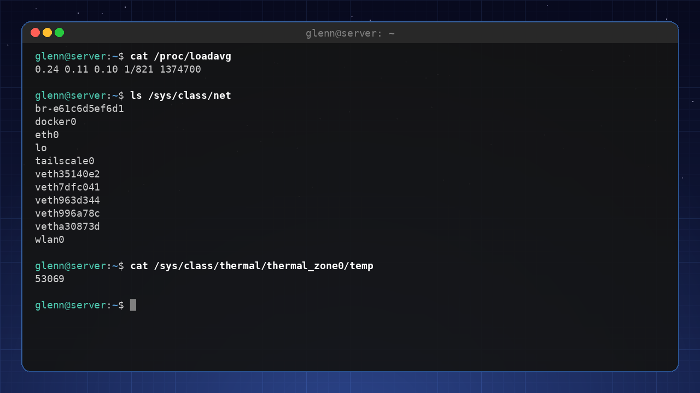

Tools like `top`, `free`, and even the battery icon in your panel really do nothing more than read these files and present them nicely. This is one of the reasons Linux is so transparent and easy to troubleshoot.

---

**Try it yourself:**

1. Run `df -h` to see disk space and mount points.
2. Run `ls -la /` to see all the root directories.
3. Run `cat /etc/os-release` to see which distribution you're running.
4. Run `htop` (install with `sudo apt install htop`) and explore the processes.

---

**Key takeaways from this chapter**

- The boot process: UEFI → GRUB → the kernel → systemd → desktop.
- The filesystem hierarchy has a clear structure; know the most important directories.
- "Everything is a file" – hardware, processes, and configuration are accessible through files.
- Processes have PIDs and run in the background as daemons.

---

# 2. The Terminal, for Real This Time

*Part 1: Understand your system*

**In this chapter you'll learn:**

- The difference between the terminal, the shell, and the command line.
- Pipes (`|`), redirection, and wildcards.
- History, aliases, and customizing `.bashrc`.
- A quick look at alternative shells (zsh, fish).

---

## Terminal vs. shell – which is which?

- **Terminal** – The graphical window you open (e.g. GNOME Terminal, Konsole). It displays text and sends your keystrokes to the shell.
- **Shell** – The program that interprets your commands. The default is **Bash** (Bourne Again SHell). Others: zsh, fish.
- **Command line** – The actual text you type.

When you open the terminal, Bash starts. You can see which shell you're using with `echo $SHELL`.

## Pipes and redirection – the power of text streams

Linux commands read from standard input (stdin) and write to standard output (stdout) and standard error (stderr). You can connect these together.

**Pipes (`|`)** send the output of one command as the input to the next:

```bash
ls -la | grep ".txt"   # Shows only files containing ".txt"
```

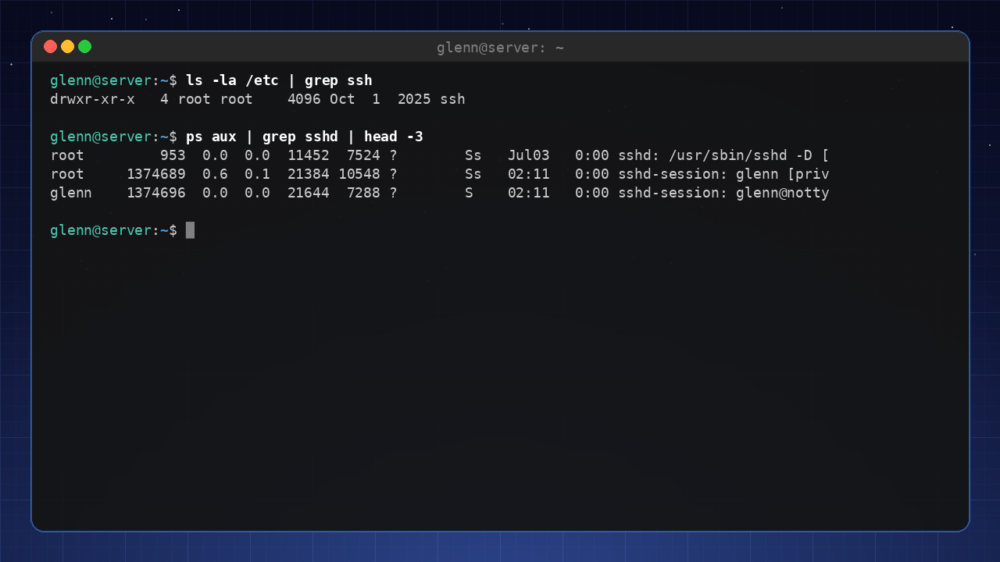

**Redirection** sends output to a file instead of the screen:

```bash
ls -la > file.txt      # Writes output to a file (overwrites)
ls -la >> file.txt     # Appends to the end
```

**Error messages** can be redirected with `2>`:

```bash
ls -la /does-not-exist 2> errors.log
```

A very common trick is `2>/dev/null` – "throw away the error messages". `/dev/null` is a black hole that swallows everything you send to it, and it's handy when a command spews out error messages you don't care about:

```bash
find / -name "*.conf" 2>/dev/null
```

**Combining stdout and stderr:**

```bash
ls -la /does-not-exist > out.txt 2>&1
```

## Wildcards – save keystrokes

- `*` – matches zero or more characters: `*.txt` means all files ending in `.txt`.
- `?` – matches exactly one character: `image?.jpg` (image1.jpg, image2.jpg, …).
- `[...]` – one character from a set: `image[0-9].jpg`.

**Example:** Copy all `.conf` files from `/etc` to a folder:

```bash
cp /etc/*.conf ~/my_config/
```

## History and shortcuts

- `Ctrl + R` – Search your command history. Start typing, and it finds earlier commands.
- `Ctrl + A` – Go to the beginning of the line.
- `Ctrl + E` – Go to the end.
- `Ctrl + U` – Delete everything from the cursor to the beginning.
- `Ctrl + K` – Delete everything from the cursor to the end.
- `!!` – Repeat the last command.
- `!$` – The last argument of the previous command.

## Aliases – make your own shorthand

Create permanent aliases by adding them to `~/.bashrc`:

```bash
alias ll='ls -la'
alias update='sudo apt update && sudo apt upgrade'
alias ports='sudo ss -tulpn'
```

That last alias deserves a comment: `ss -tulpn` shows who is listening on which ports – chapter 11 explains it properly.

Load your changes with `source ~/.bashrc`.

## Your own `.bashrc` – personal customization

`.bashrc` runs every time you start an interactive bash session. Here you can set:

- Environment variables (e.g. `export EDITOR=nano`).
- Aliases.
- A customized prompt (PS1).
- Your own functions.

Example of a useful function:

```bash
mkcd() {
    mkdir -p "$1" && cd "$1"
}
```

Now you can type `mkcd new_folder` to create a folder and enter it in one go.

## Alternative shells – zsh and fish

- **zsh** – Very popular, with lots of extensions and themes (Oh My Zsh). Largely compatible with Bash.
- **fish** – The "Friendly interactive shell" – has autocompletion and syntax highlighting out of the box, but is not 100% compatible with Bash.

For intermediate users, I recommend trying **zsh** with Oh My Zsh – it gives you a much better terminal experience. One caveat, though: zsh is for your *interactive* shell – scripts are still written in bash (chapter 9). And if you switch to zsh, your `.bashrc` tricks belong in `~/.zshrc` instead – otherwise you'll be left wondering why your changes to `.bashrc` aren't working.

---

**Try it yourself:**

1. Run `history | grep "apt"` to see all your commands involving `apt`.
2. Create an alias `up` that runs `sudo apt update && sudo apt upgrade -y`.
3. Add `export PS1="\u@\h:\w$ "` to `.bashrc` to change your prompt to `user@host:path$`.
4. Try `Ctrl + R` and type `sudo` to find earlier sudo commands.

---

**Key takeaways from this chapter**

- The shell is the command interpreter; the terminal is the window.
- Pipes (`|`) and redirection (`>`, `>>`, `2>`) are indispensable.
- Wildcards (`*`, `?`, `[]`) save time.
- `.bashrc` is your personal configuration file for the shell.
- Try zsh with Oh My Zsh for a modern experience.

---

# 3. Text Processing in the Terminal

*Part 1: Understand your system*

**In this chapter you'll learn:**

- `grep` and `find` – the two search tools you'll use every week.
- `sed` and `awk` – change and extract text without opening an editor.
- `cut`, `sort`, `uniq`, and `wc` – small tools that become powerful in chains.
- `xargs` – pass search results along as arguments.

---

Almost everything in Linux is text: logs, config files, command output. If you master the text tools, you can answer questions like "which errors happened last night?" or "where in the configuration does this live?" in seconds. This may be the most-used chapter in the whole book – these tools show up again in every chapter that follows.

## grep – find text in files

`grep` searches for text (or patterns) in files and streams:

```bash
grep ERROR /var/log/syslog          # lines containing ERROR
grep -i error /var/log/syslog       # -i: ignore case
grep -r TODO ~/projects             # -r: search recursively through a directory
grep -n "Port" /etc/ssh/sshd_config # -n: show line numbers
grep -v "^#" /etc/fstab             # -v: show lines that do NOT match (here: hide comments)
grep -c ERROR app.log               # -c: count matches
grep -A3 -B1 "panic" app.log        # show 3 lines after and 1 before each match
```

That last trick – `grep -v "^#"` – is gold for reading config files: you see only the active lines.

**Combined with pipes** (from chapter 2), grep becomes a filter:

```bash
ps aux | grep firefox               # is Firefox running?
history | grep ssh                  # what was it I typed last time?
dpkg -l | grep -i nvidia            # which NVIDIA packages are installed?
```

## find – find files

Where `grep` searches *inside* files, `find` searches *for* files:

```bash
find . -name "*.jpg"                # all .jpg from here on down
find . -iname "*.JPG"               # -iname: case-insensitive
find ~ -type d -name "node_modules" # only directories (-type d) with this name
find . -mtime +30                   # files modified more than 30 days ago
find . -size +100M                  # files larger than 100 MB
find /etc -name "*.conf" 2>/dev/null  # throw away the "Permission denied" noise
```

`find` can also *do* something with what it finds:

```bash
find . -name "*.tmp" -delete                  # delete (test with -print first!)
find . -name "*.sh" -exec chmod +x {} \;      # run a command per file
```

> **A habit that pays off:** Always run the `find` command without `-delete`/`-exec` first, check that the list looks right, and add the action afterward.

## xargs – from list to arguments

`xargs` takes lines from stdin and turns them into arguments for another command:

```bash
find . -name "*.log" | xargs wc -l         # count lines in all log files
find . -name "*.bak" | xargs -r rm         # delete all .bak files (-r: do nothing if empty)
cat servers.txt | xargs -I{} ssh {} uptime # run uptime on every server in the list
```

If the filenames contain spaces, use null-separated mode – this is the standard trick:

```bash
find . -name "*.jpg" -print0 | xargs -0 ls -lh
```

## sed – search and replace in streams

`sed` (stream editor) changes text on its way through a pipe – or directly in files:

```bash
sed 's/old/new/' file.txt           # replace first match per line (shows the result)
sed 's/old/new/g' file.txt          # /g: all matches per line
sed -i 's/8080/9090/g' config.yml   # -i: edit the file in place (take a backup first!)
sed -n '10,20p' file.txt            # show only lines 10–20
sed '/^$/d' file.txt                # delete empty lines
```

`sed -i` is the tool when you need to change the same setting in many files:

```bash
grep -rl "old-server-name" /etc/app/ | xargs sed -i 's/old-server-name/new-server-name/g'
```

That command line – grep finds the files, xargs feeds sed – is a pattern you'll reuse for the rest of your life.

## awk – the column tool

`awk` is a full programming language, but 90% of its use is one thing: **picking columns**.

```bash
df -h | awk '{print $5, $6}'        # columns 5 and 6 (use% and mount point)
ps aux | awk '$3 > 50'              # processes using more than 50% CPU
awk -F: '{print $1}' /etc/passwd    # -F: set the delimiter (here a colon) – all usernames
ls -l | awk '{sum += $5} END {print sum}'   # sum up file sizes
```

Think of it this way: `grep` selects *lines*, `awk` selects *columns*.

## cut, sort, uniq, and wc – the small tools

```bash
cut -d: -f1 /etc/passwd             # same as the awk example – column 1, colon-separated
sort names.txt                      # sort alphabetically
sort -h sizes.txt                   # -h: sort "human-readable" numbers (1K, 2M, 3G)
sort -rn numbers.txt                # -r: descending, -n: numeric
uniq -c                             # count identical adjacent lines (requires sorted input!)
wc -l file.txt                      # count lines
```

**The classic** – which IP addresses are hammering your SSH server the most?

```bash
grep "Failed password" /var/log/auth.log | awk '{print $(NF-3)}' | sort | uniq -c | sort -rn | head
```

Read it from the left: find the lines → pick the IP column → sort → count duplicates → sort by count → show the top. Five small tools, one powerful answer. *This* is the terminal's superpower. If you get no matches in `auth.log` yet, that's actually a good sign – come back to this example after chapter 12 (SSH), when the log will have some content.

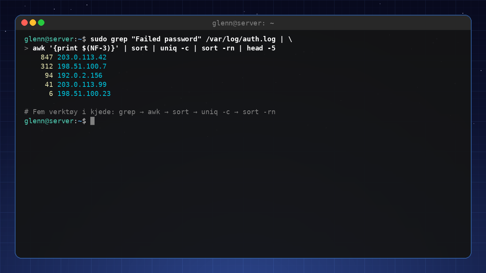

> **🟡 Optional:** Modern alternatives like `ripgrep` (a faster grep) and `fd` (a simpler find) are covered in chapter 13. Learn the classics first – they exist on every system.

---

**Try it yourself:**

1. Find all lines in `/etc/ssh/sshd_config` that are *not* comments or blank: `grep -v "^#" /etc/ssh/sshd_config | grep -v "^$"`.
2. Find the 5 largest files in your home directory: `find ~ -type f -size +50M 2>/dev/null | head -5`.
3. Use `df -h | awk '{print $5, $6}'` and find the partition with the least space.
4. Count how many unique commands you have in your history: `history | awk '{print $2}' | sort | uniq -c | sort -rn | head`.

---

**Key takeaways from this chapter**

- `grep` selects lines, `awk` selects columns, `sed` changes text.
- `find` finds files – always test without `-delete` first.
- `xargs` glues the tools together when results need to become arguments.
- The chains (`grep | awk | sort | uniq -c | sort -rn`) are more powerful than any single tool.

---

# 4. Users, Groups, and File Permissions

*Part 1: Understand your system*

**In this chapter you'll learn:**

- How Linux handles users and groups – and why groups are the key to most of it.
- Adding a user to a group with `usermod -aG` without sawing off the branch you're sitting on.
- Understanding `chmod`, `chown`, `stat`, and permission numbers (755, 644).
- Why `sudo` works the way it does.
- Common "Permission denied" errors – and why `chmod 777` is never the answer.

---

Every single "Permission denied" you will ever see boils down to one sentence: *a user tried something the permissions don't allow*. Once you understand the model behind it – who is the user, which groups are they in, what do the permissions on the file say – the error messages stop being mysterious and become a simple calculation you can solve in ten seconds. This chapter gives you that calculation.

## Users and groups – who's who?

Linux is a multi-user system, and that applies even on a machine where you're the only person: your web server runs as one user, the database as another, and you as a third. The point is *damage limitation* – if the web server gets compromised, the attacker can only do what the web server user can do. Every user has a unique **UID** (User ID) and belongs to one primary group and possibly several secondary groups.

- **System users** – Created by the system to run services (e.g. `www-data`, `mysql`). They usually have UID < 1000 and generally can't log in.
- **Regular users** – UIDs start at 1000 and count upward.
- **root** – The superuser, UID 0. Has unlimited privileges – permission checks simply don't apply to UID 0.

View user information with `id` and `whoami`. List all users: `cat /etc/passwd`. The passwords themselves aren't in there – they're stored encrypted in `/etc/shadow`, which only root can read. (That's a nice example of file permissions in practice, by the way: run `ls -l /etc/shadow` and see for yourself.)

**Why groups?** Because the permissions on a file only have room for one owner – but often *several* people need access. The group is the middle ground: the file is owned by one user, but everyone in the right group gets in. That's how Linux answers "give Alice and Bob, but no one else, access to this folder" – and how the system gives you access to the printer (`lp`), virtual machines (`libvirt`), or Docker (`docker`) without making you root.

## Group membership in practice – `usermod -aG`

This is the operation you'll do again and again: a service says "you must be in group X", and you need to add yourself. The command is:

```bash
sudo usermod -aG group username          # add the user TO the group
groups username                          # check which groups the user is in
```

**`-a` (append) is not optional decoration.** `usermod -G` on its own *replaces* the entire list of secondary groups with what you specify. If you type `sudo usermod -G docker glenn`, you're now a member of `docker` – and *only* `docker`. If you were in the `sudo` group, you're not anymore, and you've just lost the ability to fix the mistake with sudo. With `-aG`, the group is added without touching the rest. Make `-aG` muscle memory.

**The trap everyone falls into at least once:** the group change only takes effect at your *next login*. Your group list is read when the session starts – terminals you already have open don't know about the new group, and the command that refused still refuses. It looks like `usermod` didn't work. It worked – you just can't see it yet.

```bash
groups                  # the groups your SESSION has (may be outdated)
groups glenn            # the groups the user has according to the system (the truth)
newgrp docker           # starts a new shell where the group applies – only in that shell
```

If the two `groups` variants disagree, what's missing is a log out / log in. `newgrp` is the band-aid for a single session; a full logout (or reboot) is what actually cleans things up. This comes back in chapter 14, where the `libvirt` group is your ticket to running virtual machines without sudo – and half of the "it doesn't work" cases there are precisely a forgotten re-login.

## File permissions – read, write, execute

Every file and directory has three sets of permissions, and the system checks them in this order:

- **Owner** – The user who owns the file. If you're the owner, the owner set applies – done.
- **Group** – Otherwise: if you're in the file's group, the group set applies.
- **Others** – Otherwise: everyone else gets this set.

Each set has three permissions: **r** (read), **w** (write), **x** (execute).

For a file, `r` means you can read the contents, `w` that you can change them, `x` that you can run it (if it's a program/script).

For a directory the letters mean something slightly different – and it's worth pausing on: `r` lets you *list* the contents, `x` lets you *enter* the directory (`cd`) and reach the files in it, and `w` lets you create and delete files there. Note that last one: the right to delete a file lives in the *directory*, not in the file. A file you can't write to can still be deleted by anyone who has `w` on the directory it lives in.

## Permission numbers (octals) – 755, 644 explained

Each permission has a numeric value: `r=4`, `w=2`, `x=1`. The sum gives a number from 0–7 – and because the values are 4, 2, and 1, each sum corresponds to exactly one possible combination. That's why the numbers work as shorthand.

- `7` = `rwx` (4+2+1)
- `6` = `rw-` (4+2)
- `5` = `r-x` (4+1)
- `4` = `r--` (4)
- `0` = `---`

Permissions are given as three digits: owner, group, others.

- `755` – Owner: read+write+execute (7), group: read+execute (5), others: read+execute (5). Common for executables and directories: everyone can use them, only the owner can change them.
- `644` – Owner: read+write (6), group: read (4), others: read (4). Common for text files: everyone can read, only the owner can write.
- `600` – Owner read+write only. The standard for private things – SSH keys, password files. SSH actually *refuses* to use a key with looser permissions than this.

## Viewing permissions – `ls -l` and `stat`

`ls -l` shows the permissions as text (`-rw-r--r--`). When you want the number instead – for example to compare with what an installation guide requires – `stat` is the precision tool:

```bash
stat file.txt                       # everything: permissions, owner, timestamps, size
stat -c '%a %A %U:%G' file.txt      # compact: e.g. "644 -rw-r--r-- glenn:glenn"
```

`%a` gives the octal number, `%A` the text, `%U:%G` owner and group. One line, the whole calculation – this is the command to run *before* you change anything, so you know what you're changing from.

## Changing permissions – `chmod` and `chown`

**`chmod`** – Change permissions. Numeric when you want to set everything at once, symbolic when you want to adjust one thing without touching the rest:

```bash
chmod 755 file.sh       # Numeric: set the whole permission set
chmod u+x file.sh       # Add execute for the owner – everything else untouched
chmod go-w file.txt     # Remove write for group and others
```

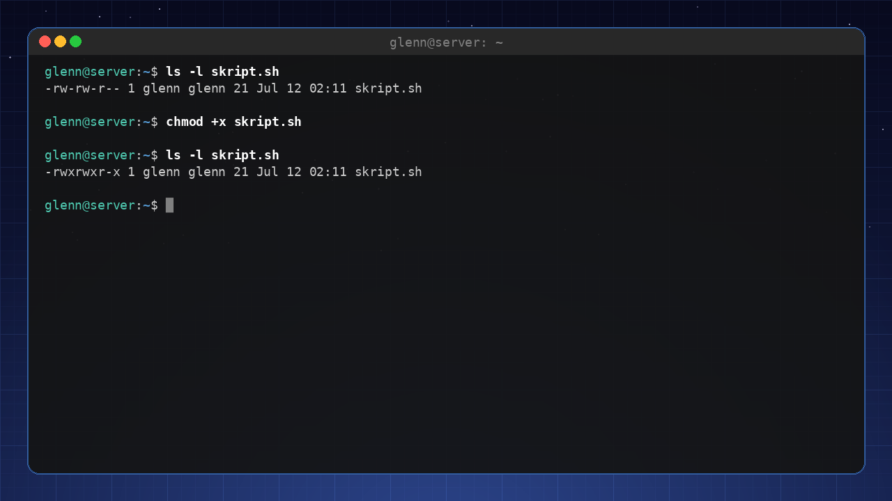

**`chown`** – Change owner and group. Requires root, for an obvious reason: if anyone could give files away, anyone could also *take* them.

```bash
sudo chown user:group file.txt
sudo chown -R user:group /folder     # Recursive
```

### Why `chmod 777` is never the answer

Somewhere on the internet, someone is going to suggest `chmod -R 777` as the solution to your permission problem. And it "works" – in the same way that removing the lock from your entire house "solves" a locked door. `777` means *every* user on the system can read, modify, and execute everything in the folder: the web server user, a compromised service, a script running amok. You haven't solved the problem; you've removed the security that was the problem's symptom.

The right answer is always a variant of the same recipe:

1. **Find out who is being denied.** Which user runs the process that's failing? (`ps aux | grep service`, or read the error message.)
2. **Find out what it needs.** Read? Write? Enter the directory? Check the current state with `stat -c '%a %A %U:%G'`.
3. **Grant exactly that access** – usually by setting the right group on the files (`chown :group`) and giving the group `rw` or `rX`, or by adding the user to the right group with `usermod -aG`.

It takes two minutes longer than `777` – and those are the two minutes that separate an administrator from someone who copies commands.

## Why `sudo`? – privileges on demand

`sudo` lets you run a command as another user (usually root). Why not just log in as root? Because `sudo` gives you root *per command* instead of *per session*: every privileged step is a deliberate choice, everything is logged, and a forgotten root terminal isn't left open for the rest of the day. It requires you to be in the `sudo` group (or `wheel` on some systems) – yet another example of group membership being the key. When you run `sudo`, you're asked for your own password, and the system checks `/etc/sudoers` to see what you're allowed to do.

You can edit the sudoers file with `sudo visudo` – never directly with an editor. `visudo` checks the syntax before saving; a typo saved straight into the file can lock you out of sudo on the entire system.

`sudo` can also run commands as users other than root, with `-u`:

```bash
sudo -u www-data ls /var/www        # see the folder the way the web server sees it
```

That's gold for troubleshooting: instead of *guessing* whether the web server has access, you *test* it.

## Common "Permission denied" errors

1. **You're trying to write to a directory you don't have write permission in.**  
   Diagnosis: `stat -c '%a %A %U:%G' thefolder` – does someone else own it, and is the group missing `w`? Solution: give the right user/group access with `chown`/`chmod` – or use `sudo` if it really is an administrative task.
2. **You're trying to run a file without the `x` permission.**  
   Classic after downloading a script – the `x` bit doesn't come along. Solution: `chmod +x file`.
3. **You're trying to read a file that belongs to another user.**  
   Solution: `sudo` for the one-off case; if it's something you need regularly, the right answer is a group you're both members of.
4. **You HAVE been added to the right group – but it still doesn't work.**  
   Compare `groups` (the session) with `groups username` (the system). If they disagree, all that's missing is a new login – see the group section above.

---

**Try it yourself:**

1. Create a file: `touch /tmp/test.txt`, and look at it with both `ls -l /tmp/test.txt` and `stat -c '%a %A %U:%G' /tmp/test.txt`. (We use `/tmp` because your home directory may be closed to other users – in which case the next step would already have been stopped at the directory.)
2. Lock it down: `chmod 600 /tmp/test.txt` – run `stat` again and see that the number matches the text.
3. Prove that the permissions are actually enforced: `sudo -u nobody cat /tmp/test.txt`. You're now running `cat` as the system user `nobody` – and you get "Permission denied", even though you own the file yourself and used sudo. `600` means owner only, and `nobody` is not the owner. That's the entire model in one command.
4. Open it up for reading again: `chmod 644 /tmp/test.txt`, and see that the same `sudo -u nobody cat /tmp/test.txt` now succeeds.
5. Check your own groups: `groups`, and compare with `id`. Do you recognize the `sudo` group?

---

**Key takeaways from this chapter**

- Users and groups control access – and groups are the tool for "several people need access, but not everyone".
- `usermod -aG group user` – always with `-a`, otherwise the group list gets replaced. The change only takes effect after a new login (`newgrp` for one session, `groups` shows session vs. system truth).
- Permissions: r=4, w=2, x=1. Three digits: owner, group, others. `stat -c '%a %A %U:%G'` shows the whole picture on one line.
- `chmod` and `chown` are the key tools – and `chmod 777` is removing the lock, not solving the problem: find out who needs access, and grant exactly that.
- `sudo` gives you root per command, not per session – and `sudo -u user` lets you test access instead of guessing.
- Error messages are almost always about permissions – or a group change waiting for a new login.

---

# 5. The Package System in Depth

*Part 1: Understand your system*

**In this chapter you'll learn:**

- What APT actually does – package repositories, dependencies, and versions.
- The difference between `apt` and `apt-get`.
- PPAs – what they are and why you should be careful.
- Flatpak permissions with Flatseal.
- AppImage and Snap – pros and cons.
- pipx – Python tools without messing up the system's Python.
- How to downgrade a package and keep your system clean.

---

Installing software on Linux is something entirely different from downloading an installer from a website. The package system knows which files belong to which package, what depends on what, and where everything comes from – that's why you can update the entire system with a single command. But in recent years, several formats have appeared alongside the classic one: Flatpak, Snap, AppImage, and the Python world's pipx. This chapter gives you the overview, so you know which tool to reach for when.

## APT – Advanced Package Tool

APT is the package manager used in Debian-based distributions (Ubuntu, Linux Mint, Pop!_OS). It fetches packages from **package repositories** – official archives of pre-built software packages.

**Basic APT commands:**

| Command | Meaning |
|----------|-----------|
| `sudo apt update` | Updates the package list from the repositories. |
| `sudo apt upgrade` | Upgrades all installed packages to the latest version. |
| `sudo apt full-upgrade` | Like upgrade, but removes packages if necessary. |
| `sudo apt install <package>` | Installs a package. |
| `sudo apt remove <package>` | Removes a package (keeps configuration). |
| `sudo apt purge <package>` | Removes a package and its configuration. |
| `sudo apt autoremove` | Removes unneeded dependencies. |
| `apt search <query>` | Searches the package repository. |
| `apt show <package>` | Shows details about a package. |

Notice the two-part split: `update` only fetches the *list* of what's available – it installs nothing. It's `upgrade` that actually upgrades. That's why they're always run as a pair, and why `sudo apt update && sudo apt upgrade` is probably the command line you'll type most often.

**`apt` vs. `apt-get`** – `apt` is a newer, more user-friendly frontend to `apt-get` and `apt-cache`. For daily use, `apt` is all you need. `apt-get` is still useful in scripts because it's more stable and changes less.

## PPAs – Personal Package Archives

PPAs are third-party repositories that extend the software selection. They can give you newer versions of programs, or software that isn't in the official repositories.

**How to add a PPA:**

```bash
sudo add-apt-repository ppa:name/ppa
sudo apt update
sudo apt install package
```

Sources you add today end up as files in `/etc/apt/sources.list.d/` with the `.sources` extension – a readable key-value format (deb822), which is the new format you'll see, instead of the old one-line `.list` files.

**Words of caution:**

- PPAs are made by other users – they can contain unstable or insecure packages.
- If you add many PPAs, conflicts can arise.
- Remove a PPA with `sudo add-apt-repository --remove ppa:name/ppa`.

## Flatpak – permissions and Flatseal

Flatpak is a modern package format that runs apps in a sandbox. Each app has its own permissions (access to the filesystem, network, audio, etc.). Sometimes apps have too many permissions – you can control them with **Flatseal**.

**Install Flatseal:**

```bash
flatpak install flathub com.github.tchx84.Flatseal
```

Open Flatseal and look at which permissions each app has. You can, for example, remove access to your entire home directory and grant access only to specific folders.

## AppImage and Snap

- **AppImage** – A single executable file. No installation, no dependencies. Just download, `chmod +x`, and run. Perfect for trying software without leaving traces on the system. Downside: no automatic updates.
- **Snap** – Canonical's (Ubuntu's) package format, similar to Flatpak but with one centralized store. The client itself (`snapd`) is open source – it's the *store server* that is closed, and that's the part the criticism targets: only Canonical can run a Snap store. Many people also dislike that some apps start more slowly. On Ubuntu, Snap is the default for many apps. You can avoid Snap by installing Flatpak versions instead.

## Python tools outside apt – pipx

Many useful command-line tools are written in Python – `yt-dlp`, `httpie`, `glances`, and hundreds of others. If they're not in the package repository (or are there in an old version), it's tempting to fetch them straight from the Python world with `pip install`. But on modern distributions, exactly that is blocked, and for good reason: the system's Python is owned by apt. If pip were allowed to write straight into it, it could overwrite files that the distro's own tools depend on – and suddenly your package manager no longer works.

That's why you get this error message when you try:

```
$ pip install yt-dlp
error: externally-managed-environment

× This environment is externally managed
╰─> To install Python packages system-wide, try apt install
    python3-xyz, where xyz is the package you are trying to
    install.
    ...
```

This isn't something broken – it's a safeguard (defined in PEP 668) saying that the Python environment is managed externally, by apt. The answer isn't to force your way past it, either, but to use **pipx**: it installs each tool in its own isolated virtual environment and puts the command itself in your PATH. The tools get what they need, the system's Python stays untouched, and everyone is happy.

```bash
sudo apt install pipx
pipx ensurepath          # makes sure ~/.local/bin is in PATH (run once)
pipx install yt-dlp      # its own isolated environment – the command works everywhere
pipx list                # what have I installed with pipx?
pipx upgrade-all         # upgrade all pipx tools
```

## Downgrading packages

If an update has caused problems, you can downgrade to an older version.

For APT packages:

```bash
sudo apt install package=version    # Install a specific version
sudo apt-mark hold package          # Pin the version so it won't be upgraded
sudo apt-mark unhold package        # Remove the pin
```

But which versions actually exist? That's what `apt policy` answers:

```bash
apt policy package
```

The output shows three things: **Installed** (the version you have now), **Candidate** (the version `apt install` would pick), and a version table showing which package repository each version comes from. If installed and candidate are the same, you're up to date – and if there are multiple lines in the table, you have something to downgrade to. If you'd rather have all versions as a simple list:

```bash
apt list -a package
```

## Keep your system clean

APT doesn't clean up after itself: dependencies get left behind when the package that needed them is gone, and every downloaded `.deb` file is stored in a cache on disk. Three commands keep it in check:

- `sudo apt autoremove` – remove dependencies no package needs anymore.
- `sudo apt autoclean` – remove downloaded package files that no longer exist in the repository.
- `sudo apt clean` – empty the entire package cache (frees the most space).

---

**Try it yourself:**

1. Find out which version of a package you have: `apt show <package>`.
2. Add a PPA (e.g. for a newer version of a program you use) and install from it.
3. Install Flatseal and check the permissions of a Flatpak app.
4. Run `apt policy` on a few packages you use, and find one where the version table shows more than one version. Downgrade it with `sudo apt install package=version`, and upgrade back with `sudo apt upgrade`. (Many packages have only one version in the repository – then there's nothing to downgrade to, and that's completely normal.)
5. Try `pip install yt-dlp` and see the PEP 668 error message with your own eyes – then install the tool properly with `pipx install yt-dlp`.

---

**Key takeaways from this chapter**

- APT is the central package manager on Debian systems.
- PPAs give you access to more software, but use them with care.
- Flatpak provides sandboxed apps; Flatseal lets you control permissions.
- AppImage is handy for individual programs; Snap is an alternative – the client is open, the store server closed.
- `pip install` straight into the system is blocked (PEP 668) – use `pipx` for Python tools.
- `apt policy` shows the installed version, candidate, and sources; you can downgrade and pin versions when needed.

---

# 6. Disks, File Systems, and fstab

*Part 1: Understand your system*

**In this chapter you'll learn:**

- `lsblk`, `blkid`, and `df` – see which disks exist and where they are mounted.
- `mount` and `umount` – attach and detach file systems manually.
- `/etc/fstab` – one of the most important files in Linux, and how to edit it safely.
- `du` and `ncdu` – find out what's eating your disk space.

---

In Windows, disks are called C: and D:. In Linux, everything is instead *mounted* into the same file tree – a USB stick shows up as a directory under `/media`, an extra disk can become `/data`. This chapter puts you in control of how that happens.

## See what you have: lsblk, blkid, and df

**`lsblk`** shows block devices (disks and partitions) as a tree:

```bash
lsblk
```

```
NAME        MAJ:MIN RM   SIZE RO TYPE MOUNTPOINTS
nvme0n1     259:0    0 476.9G  0 disk
├─nvme0n1p1 259:1    0   512M  0 part /boot/efi
└─nvme0n1p2 259:2    0 476.4G  0 part /
sda           8:0    1  57.7G  0 disk
└─sda1        8:1    1  57.7G  0 part /media/user/USBSTICK
```

The naming logic: `nvme0n1` is the first NVMe SSD, `sda`/`sdb` are SATA disks and USB devices, and the `p1`/`1` at the end is the partition number.

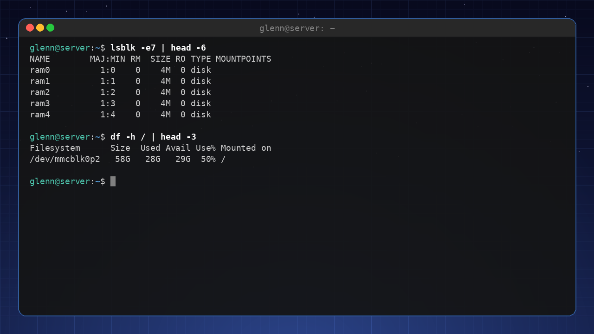

**`blkid`** shows the UUID (the unique ID) and file system type of each partition – you'll need it for fstab in a moment:

```bash
sudo blkid
```

**`df -h`** shows how much space is used per mounted file system (`-h` = human-readable sizes):

```bash
df -h
```

## mount and umount – manual mounting

Your desktop environment mounts USB sticks automatically, but on servers – and when the automation fails – you do it yourself:

```bash
sudo mkdir -p /mnt/usb              # create a mount point (a perfectly ordinary directory)
sudo mount /dev/sda1 /mnt/usb       # mount the partition there
ls /mnt/usb                         # the contents are now accessible
sudo umount /mnt/usb                # detach (note: umount, not unmount)
```

**Important about `umount`:** If you get "target is busy", some program has files open there – often it's just a terminal sitting in the directory. `lsof +f -- /mnt/usb` shows you the culprit.

> **Take this with you:** A mounted disk is just a directory with contents from another file system. That's the whole magic.

## /etc/fstab – disks that mount automatically

`/etc/fstab` (filesystem table) determines what gets mounted at boot. A typical line looks like this:

```
UUID=a1b2c3d4-...  /data  ext4  defaults  0  2
```

The six fields mean:

| Field | Example | Meaning |
|------|----------|-----------|
| 1 | `UUID=a1b2…` | Which partition (use the UUID from `blkid`, not `/dev/sdb1` – device names can swap places between boots!) |
| 2 | `/data` | Where it should be mounted |
| 3 | `ext4` | File system type (`ext4`, `ntfs`, `vfat`, …) |
| 4 | `defaults` | Options – `defaults` is right for most people |
| 5 | `0` | Used by `dump` (an old backup tool) – always 0 |
| 6 | `2` | File system check at boot: 1 for the root file system, 2 for others, 0 to skip |

**Example: add an extra data disk permanently**

```bash
sudo blkid                          # find the partition's UUID
sudo mkdir -p /data
sudo nano /etc/fstab                # add the line above with your UUID
sudo mount -a                       # mount everything in fstab NOW – tests your line at the same time
```

> **⚠️ The most important rule for fstab:** Always run `sudo mount -a` afterward and watch for error messages, and ideally `sudo findmnt --verify` too. A broken fstab line can keep the machine from booting normally. If you make a mistake and the machine hangs at boot: choose "recovery mode" in GRUB, or boot from a live USB, and remove the line.

**Useful option:** if you add `nofail` in field 4 (e.g. `defaults,nofail`), the machine boots fine even if the disk is missing – smart for external disks that aren't always connected.

**Good to know:** On modern systems, systemd reads fstab and generates its own "mount units" from the lines. If you've just changed fstab, you may therefore need `sudo systemctl daemon-reload` before `mount -a` behaves as expected – that explains the occasional confusing experience, and is a small taste of systemd in chapter 10.

## What's eating the space? du and ncdu

`df` tells you *that* the disk is full – `du` tells you *what* is filling it:

```bash
du -sh ~/*                          # the size of everything in your home directory
du -sh /var/log                     # how big are the logs?
sudo du -xh / 2>/dev/null | sort -rh | head -20   # the 20 largest directories on the root disk
```

Even better: **`ncdu`** – an interactive disk usage explorer you navigate with the arrow keys:

```bash
sudo apt install ncdu
ncdu ~                              # explore your home directory
sudo ncdu -x /                      # the whole system disk (-x: stay on one file system)
```

Common culprits when the disk is full: `/var/log` (see logrotate in chapter 10), old Timeshift snapshots, Flatpak cache (`flatpak uninstall --unused`), and the Downloads folder.

## 🟡 Optional: file system types in one minute

- **ext4** – the standard on Linux. Robust, boring, right for most people.
- **btrfs** – modern, with built-in snapshots (used by Fedora and openSUSE).
- **xfs** – solid with large files and large disks.
- **ntfs / vfat (FAT32/exFAT)** – Windows file systems. Linux reads and writes both; use exFAT on USB sticks that will be shared with Windows/Mac.

---

**Try it yourself:**

1. Run `lsblk` and draw (in your head) the tree of disks and partitions on your machine.
2. Insert a USB stick, find it with `lsblk`, and mount it manually at `/mnt/usb`. Remember `umount` afterward.
3. Run `sudo findmnt --verify` and see whether your fstab is healthy.
4. Install `ncdu` and find the largest directory in your home area.

---

**Key takeaways from this chapter**

- `lsblk` shows the disks, `df -h` shows the space, `du`/`ncdu` show what's filling it.
- Mounting = attaching a file system as a directory. `mount` and `umount` do it manually.
- `/etc/fstab` controls automatic mounting – use UUIDs, and always test with `sudo mount -a`.
- `nofail` saves the boot when an external disk is missing.

---

# 7. How to Learn More – Man Pages and Documentation

*Part 2: Master the Tools*

**In this chapter you'll learn:**

- How to read man pages – without drowning.
- `apropos` and `whatis` – find the command when you only know what you want to do.
- `--help`, `info`, and `tldr` – the other sources of documentation.
- How to look things up instead of guessing.

---

This may be the most important chapter in the book, even though it's short. What marks an intermediate Linux user is not *remembering* all the commands – it's knowing **how to look them up**. All the documentation is already on your machine, available without an internet connection.

## man – the manual

Every tool has a manual page:

```bash
man rsync
```

**Navigating man pages** (they open in `less`):

- `Space` / `b` – page down / up
- `/keyword` + Enter – search; `n` for the next match, `N` for the previous
- `g` / `G` – jump to the top / bottom
- `q` – quit

**How to read a man page without drowning:**

1. Read **NAME** and **DESCRIPTION** – what does the tool do?
2. Look at **SYNOPSIS** – how is the command put together? (Square brackets `[...]` mean optional.)
3. **Don't read all the options.** Search instead: if you want to find out what `-a` in rsync means, type `/-a` and press Enter.
4. Jump to **EXAMPLES** at the bottom if it exists – many man pages have good examples at the very end.

## The sections – why there's more than one "passwd"

The manual is divided into numbered sections. The most important ones: **1** = commands, **5** = file formats, **8** = administration commands.

```bash
man passwd      # section 1: the passwd command
man 5 passwd    # section 5: the format of the FILE /etc/passwd
man 5 fstab     # the format of /etc/fstab – useful after the previous chapter!
```

So when you see `passwd(5)` in a text, it means "passwd in section 5". Now you know what the number means.

## apropos and whatis – when you don't know the name

You want to do something, but can't remember the command? `apropos` searches the descriptions of all man pages:

```bash
apropos rename          # everything related to renaming
apropos -s 1 partition  # only regular commands about partitions
whatis rsync            # one line: what does this command do?
```

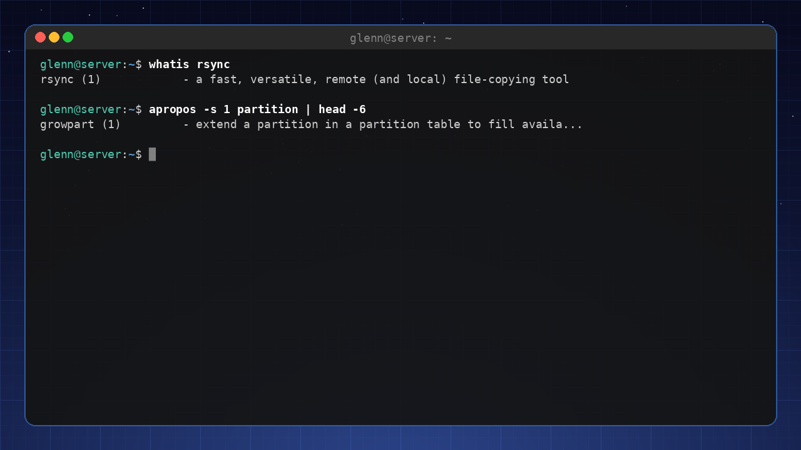

(If `apropos` returns nothing, run `sudo mandb` once to build the search index.)

## --help – the short version

Almost every command has a built-in summary:

```bash
rsync --help | less
ip --help
```

`--help` is faster than the man page when you just need to check the spelling of an option. Feel free to combine it with grep: `rsync --help | grep delete`.

## info and tldr – the two extremes

- **`info`** – the GNU tools' extended documentation (more book, less reference). Try `info coreutils`. Honestly: most people get by with man + --help.
- **`tldr`** 🟡 – the opposite: *only* examples, community-driven. Perfect when you roughly know what you're doing but can't remember the syntax:

```bash
sudo apt install tldr
tldr tar          # the 6 most common ways to use tar – done
```

## The order when you're stuck

1. `tldr command` – has someone made an example of exactly this?
2. `command --help | grep keyword` – quick check of the options.
3. `man command` and search with `/`.
4. The Arch Wiki ([wiki.archlinux.org](https://wiki.archlinux.org)) – for concepts and setups, not just individual commands.
5. A search engine with the error message in quotes – last resort, not first.

Notice that the browser comes *last*. The documentation on your machine is faster, precise for *your* version, and works at a cabin with no cell coverage.

---

**Try it yourself:**

1. Open `man rsync`, search with `/--delete`, and read what the option does.
2. Run `man 5 fstab` and find the explanation of field 6 (the pass field).
3. Use `apropos` to find the command that shows how long the machine has been up (hint: `apropos uptime`).
4. Install `tldr` and look up `tar`, `find`, and `chmod`.

---

**Key takeaways from this chapter**

- Nobody remembers everything – skilled people look things up. The documentation is on your machine.
- Man pages are read with search (`/word`), not cover to cover. The EXAMPLES section is gold.
- `man 5` documents *file formats* – like fstab and passwd.
- `apropos` finds the command when you only know what you want to achieve; `tldr` gives you the examples.

---

# 8. Config Files and Text Editing

*Part 2: Master the Tools*

**In this chapter you'll learn:**

- Where settings actually live – `/etc` vs. `~/.config`.
- Why `vim` is worth learning (and how to survive the first 20 minutes).
- How to preserve your setup with dotfiles.

---

Everything you've configured on your system – the aliases in your shell, the colors in `htop`, your SSH setup – lives in plain text files. That means you can read them, search them with the tools from chapter 3, and take them with you. This chapter is about where these files live, how to edit them efficiently, and how to collect them so your setup survives a reinstall.

## Configuration files – system vs. user

On Linux, settings are stored in text files, not in a central database like the Windows registry. That sounds old-fashioned, but it's a strength: a text file can be read, compared, backed up, and version-controlled.

- **System configuration** – `/etc/` (e.g. `/etc/ssh/sshd_config`). Often requires `sudo` to edit.
- **User configuration** – `~/.config/` (e.g. `~/.config/htop/htoprc`) or directly in your home directory as hidden files (`.bashrc`, `.gitconfig`). These override the system settings for your user.

The benefit: you can easily copy configuration files to a new machine, and you can see exactly what has been changed.

## Vim – a 20-minute survival course

`vim` is a powerful text editor installed on almost every Linux system – including servers where `nano` is missing. It has a steep learning curve, and the reason is that `vim` is *modal*: the keys mean different things depending on which mode you're in. This is what confuses beginners – and it's also what makes experienced users lightning fast.

**Two modes to start with:**

1. **Normal mode** – for navigation and commands. (Start here – this is where `Esc` always takes you back.)
2. **Insert mode** – for typing text. (Press `i` to enter it.)

**Basic commands:**

- `i` – enter insert mode at the cursor.
- `a` – enter insert mode after the cursor.
- `Esc` – go back to normal mode.
- `:w` – save the file.
- `:q` – quit.
- `:wq` – save and quit.
- `:q!` – quit without saving.
- `h`, `j`, `k`, `l` – move the cursor (left, down, up, right).
- `x` – delete the character under the cursor.
- `dd` – delete the whole line.
- `u` – undo the last change.
- `Ctrl + r` – redo.
- `/search` – search for text.
- `:e file` – open another file without quitting.

These will get you through any quick config-file edit. If you want to select text, there's a separate visual mode (`v`) – that, and much more, is best learned interactively.

**Tip:** Run `vimtutor` – a built-in, interactive tutorial that takes half an hour and is worth every minute.

## Dotfiles – preserve your setup

Dotfiles are your configuration files (like `.bashrc`, `.vimrc`, `.gitconfig`) – the sum of all the small tweaks you've made over time. Collect them in one place, and you can restore your setup on a new machine in minutes instead of redoing every tweak. In this chapter you build the structure itself – the folder and the symlinks; in chapter 21 you learn Git and turn exactly this folder into a repo you can pull down anywhere.

**The usual approach:**

1. Create a folder `~/dotfiles`.
2. Move your configuration files there.
3. Create symbolic links back to your home directory, so programs find the files where they expect them:

```bash
ln -s ~/dotfiles/.bashrc ~/.bashrc
```

For now this is "just" a tidy folder – but it's a deliberate choice. When you learn Git in chapter 21, you'll turn this folder into a version-controlled repo and push it to GitHub. Then every change to your setup is logged, and a new machine is one `git clone` away from feeling like yours.

**Or** use a tool like `GNU Stow` to manage the symlinks automatically.

---

**Try it yourself:**

1. Open `/etc/ssh/sshd_config` with `sudo nano` and look at the contents. Don't change anything!
2. Open `~/.bashrc` and add a comment.
3. Start `vimtutor` and work through the first lessons.
4. Create `~/dotfiles`, move `.bashrc` there, and create the symlink back to your home directory. Verify that a new shell still reads the file. The folder now sits ready to become a Git repo in chapter 21.

---

**Key takeaways from this chapter**

- System settings live in `/etc`, user settings in `~/.config` or directly in your home directory.
- `vim` is powerful – learn `i`, `Esc`, `:wq`, `dd`, `u`, and `/search`.
- Dotfiles are the key to restoring your setup quickly – you create the folder and the symlinks now; the Git repo comes in chapter 21.

---

# 9. Shell Scripting – Automate Your Everyday Tasks

*Part 2: Master the Tools*

**In this chapter you'll learn:**

- Scripting basics: variables, if statements, loops, and functions.
- Arguments and exit codes – the building blocks of reusable scripts.
- Practical examples: a backup script, photo renaming, cleaning up Downloads.
- How to avoid classic scripting mistakes with `set -euo pipefail` and ShellCheck.
- How to run scripts automatically with cron and systemd timers.

---

## Your first script

A shell script is a text file containing commands that are executed in sequence. Start by creating a file, e.g. `mitt_skript.sh`.

```bash
#!/bin/bash
# This is a comment
# (Real scripts should have a safety line here – it comes later in the chapter.)
echo "Hello, world!"
```

Make it executable: `chmod +x mitt_skript.sh`. Run it with `./mitt_skript.sh`.

## Variables

```bash
name="Alex"
echo "Hello, $name"
```

You can use `$(command)` to capture the output of a command:

```bash
today=$(date +%Y-%m-%d)
echo "Today is $today"
```

## Conditions (if)

```bash
if [ -f "file.txt" ]; then
    echo "The file exists."
else
    echo "The file does not exist."
fi
```

Common tests:
- `-f` – file exists.
- `-d` – directory exists.
- `-z` – string is empty.
- `-eq` – equal (numeric), `-ne` – not equal, `-gt` – greater than, etc.

## Loops

**For loop:**

```bash
for file in *.jpg; do
    echo "Processing $file"
done
```

**While loop:**

```bash
counter=1
while [ $counter -le 5 ]; do
    echo "Counter: $counter"
    counter=$((counter+1))
done
```

## Arguments – make your scripts reusable

A script that only does one hardcoded thing is a throwaway script. With **arguments**, the same script can be used again and again:

```bash
#!/bin/bash
# hils.sh
set -euo pipefail
echo "Hello, $1! You are $2 years old."
```

Run it with `./hils.sh Alex 42`. Inside the script:

- `$1`, `$2`, … – the first, second argument
- `$0` – the name of the script itself
- `$#` – the number of arguments
- `$@` – all the arguments (use `"$@"` with quotes in loops)

**Check that the user remembered the argument:**

```bash
if [ $# -eq 0 ]; then
    echo "Usage: $0 <folder>"
    exit 1
fi
```

## Exit codes – does the script know how it went?

Every command returns an **exit code**: `0` means success, anything else means failure. You'll find the code of the previous command in `$?`:

```bash
cp important.txt /backup/
echo $?    # 0 if the copy succeeded
```

This is the foundation of `&&` and `||`, which you've already used:

```bash
sudo apt update && sudo apt upgrade   # upgrade runs ONLY if update succeeded
cp file.txt /backup/ || echo "Copy failed!"   # || runs only on failure
```

In your own scripts, use `exit 1` to signal failure – that way *other* scripts (and cron) can react to the fact that your script failed.

## Functions – tidy scripts

When a script grows, collect reusable logic in functions:

```bash
#!/bin/bash
set -euo pipefail

log() {
    echo "[$(date +%H:%M:%S)] $1"
}

backup_dir() {
    local source="$1"
    local target="$2"
    log "Copying $source ..."
    rsync -a "$source/" "$target/" && log "OK" || log "FAILED on $source"
}

backup_dir ~/Documents /media/backupdisk/Documents
backup_dir ~/Pictures /media/backupdisk/Pictures
```

`local` makes the variable invisible outside the function – a good habit that prevents mysterious bugs.

## Practical examples

**1. Backup script – back up important folders**

```bash
#!/bin/bash
# backup.sh – Copies Documents and Pictures to an external disk
set -euo pipefail

sources=("/home/user/Documents" "/home/user/Pictures")
dest="/media/user/backupdisk/backup_$(date +%Y-%m-%d)"

mkdir -p "$dest"
for source in "${sources[@]}"; do
    # The destination is a fresh, dated folder for every run – so --delete is
    # pointless (there's never anything there to delete). If you mirror to a
    # FIXED destination, you do need --delete – chapter 16 covers its pitfalls.
    rsync -av "$source/" "$dest/$(basename "$source")/"
done
echo "Backup complete."
```

**2. Cleaning up Downloads – move files by type**

```bash
#!/bin/bash
# rydding.sh – Move files in Downloads into subfolders
set -euo pipefail

cd ~/Downloads || exit

# Create the folders if they don't exist
mkdir -p Pictures Documents Videos Music Other

for file in *; do
    [ -f "$file" ] || continue     # skip folders – including the ones we just created
    case "$file" in
        *.jpg|*.png|*.gif) mv "$file" Pictures/ ;;
        *.pdf|*.doc|*.txt) mv "$file" Documents/ ;;
        *.mp4|*.avi) mv "$file" Videos/ ;;
        *.mp3|*.flac) mv "$file" Music/ ;;
        *) mv "$file" Other/ ;;
    esac
done
```

The line `[ -f "$file" ] || continue` is more important than it looks: without it, `*` also catches the folders the script itself just created, and the first run would have moved `Pictures` into `Other` and wrecked the whole structure. Note that this is a **logic error** – the script is syntactically flawless, so ShellCheck (which you'll meet in a moment) wouldn't say a word. Errors like this are only found by testing: create a throwaway folder with a few test files and run the script there before letting it loose on real data.

**3. Photo renaming – give your vacation photos sensible names**

```bash
#!/bin/bash
# omdoep.sh – Name every .jpg in a folder by date + sequence number
# Usage: ./omdoep.sh ~/Pictures/vacation hawaii
set -euo pipefail

dir="${1:-.}"           # first argument, or "here" if empty
prefix="${2:-photo}"    # second argument, or "photo"

counter=1
for file in "$dir"/*.jpg; do
    [ -e "$file" ] || continue    # skip if there are no matches
    new=$(printf '%s/%s-%03d.jpg' "$dir" "$prefix" "$counter")
    mv -n "$file" "$new"          # -n: never overwrite existing files
    counter=$((counter+1))
done
echo "Renamed $((counter-1)) photos."
```

Notice `${1:-.}` – "use argument 1, or `.` as the default". Small tricks like this make scripts robust.

## Safety net: `set -euo pipefail`

The three most common script disasters are: the script keeps going after an error, a typo in a variable name silently becomes an empty string, and a failure in the middle of a pipe disappears. One line at the top of the script – you've seen it in every example above – stops all three:

```bash
#!/bin/bash
set -euo pipefail
```

- `-e` – stop at the first command that fails
- `-u` – stop if you use a variable that isn't set (catches typos!)
- `-o pipefail` – a pipe fails if *any* stage in it fails

**Why this matters:** Imagine `rm -rf "$dirr/"*` – with that typo in the variable name, it becomes `rm -rf /*` without `-u`. With `set -u`, the script stops with a clear error message instead. This one line has saved countless filesystems.

## ShellCheck – automatic proofreading

**ShellCheck** analyzes your scripts and finds the bugs before they bite you:

```bash
sudo apt install shellcheck
shellcheck mitt_skript.sh
```

It explains every warning with a link to the documentation. You can also paste scripts into [shellcheck.net](https://www.shellcheck.net) without installing anything. Make it a habit: **run ShellCheck on everything you write** – it's like having an experienced colleague reading over your shoulder.

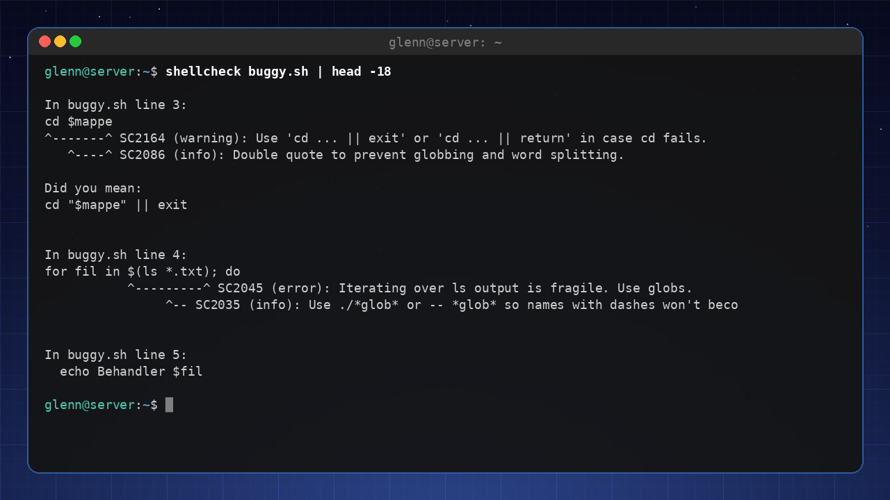

## Debug scripts with `bash -x`

Want to see exactly what the script does, line by line, with every variable filled in:

```bash
bash -x mitt_skript.sh
```

Each command is printed with a `+` in front as it runs – invaluable when a script doesn't do what you think it does.

## Automation with cron

`cron` is a time-based scheduler that runs scripts at set times.

Edit your own crontab:

```bash
crontab -e
```

Add a line to run a script every day at 03:00:

```
0 3 * * * /home/user/backup.sh
```

Format: `minute hour day month weekday command`.

Cron is simple and great for learning the principle – but in 2026, **systemd timers** are the recommended way to run jobs automatically. They give you logging via journalctl, they run jobs you missed while the machine was off, and they show up in `systemctl list-timers`. Chapter 10 shows you how to set one up.

## 🟡 Optional: three more useful building blocks

**`case`** – tidier than long if/elif chains when you're checking one value against several patterns (you saw it in the cleanup script above):

```bash
case "$1" in
    start)   echo "Starting..." ;;
    stop)    echo "Stopping..." ;;
    *)       echo "Usage: $0 {start|stop}"; exit 1 ;;
esac
```

**`trap`** – clean up no matter how the script exits (error, Ctrl+C, finished):

```bash
tmpfile=$(mktemp)
trap 'rm -f "$tmpfile"' EXIT   # ALWAYS runs on exit
```

**`getopts`** – proper flags (`-v`, `-o file`) instead of counting arguments:

```bash
while getopts "vo:" flag; do
    case "$flag" in
        v) verbose=1 ;;
        o) outfile="$OPTARG" ;;
    esac
done
```

None of these are required to get started – but as your scripts grow, this is what separates a homemade script from one that feels professional.

---

**Try it yourself:**

1. Write a script that lists all the files in a folder and saves the list to a log file.
2. Write a script that takes the folder as an argument (`$1`) and complains with `exit 1` if the argument is missing.
3. Add `set -euo pipefail` to your scripts and run ShellCheck on them. Fix what it complains about.
4. Write a script that deletes every file in Downloads older than 30 days.
5. Set up a cron job that runs your cleanup script every week.

---

**Key takeaways from this chapter**

- Shell scripts are collections of commands in a file.
- Variables, if statements, loops, and functions give you control.
- Arguments (`$1`, `$@`) and exit codes (`$?`, `exit 1`) make scripts reusable and reliable.
- Start every script with `set -euo pipefail` – it's your seatbelt.
- Run ShellCheck on everything you write.
- `rsync` is a powerful tool for backup and synchronization.
- Automate with cron or (preferably) systemd timers – see chapter 10.

---

# 10. systemd and Services

*Part 2: Master the Tools*

**In this chapter you'll learn:**

- What systemd is and why it matters.
- `systemctl` and `journalctl` – the two commands you need.
- Starting, stopping, enabling, and disabling services.
- Creating your own systemd service.
- systemd timers – the modern way to run automatic jobs.
- Troubleshooting a slow boot with `systemd-analyze`.

---

## What is systemd?

`systemd` is the init system and system manager on most modern Linux distros. It's the first process (PID 1) and manages boot, services, logs, and devices.

You interact with systemd through `systemctl` and `journalctl`.

## systemctl – control services

**Common commands:**

| Command | Meaning |
|----------|-----------|
| `systemctl status ssh` | Show the status of a service. |
| `systemctl start ssh` | Start the service. |
| `systemctl stop ssh` | Stop the service. |
| `systemctl restart ssh` | Restart it. |
| `systemctl enable ssh` | Enable the service so it starts at boot. |
| `systemctl disable ssh` | Disable it. |
| `systemctl list-units --type=service` | Show all active services. |
| `systemctl list-unit-files --type=service` | Show all services (including disabled ones). |

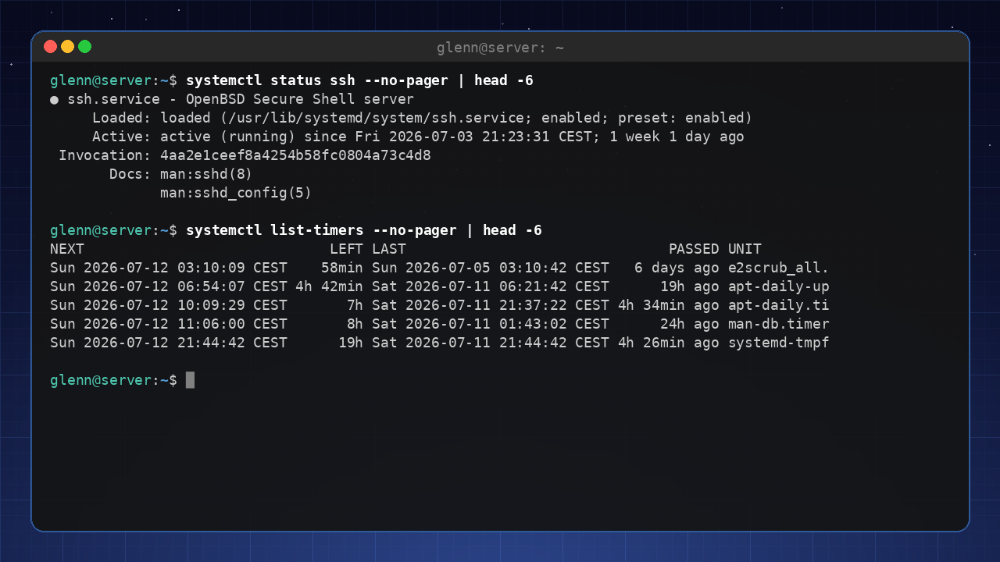

## journalctl – view logs

`journald` collects logs from the system and its services.

| Command | Meaning |
|----------|-----------|
| `journalctl` | Show all logs (a lot of text). |
| `journalctl -xe` | Show the latest logs with details. |
| `journalctl -u ssh` | Show logs for a specific service. |
| `journalctl --since "10 min ago"` | Show logs from the last 10 minutes. |
| `journalctl -f` | Follow logs in real time (like `tail -f`). |
| `journalctl -b` | Only logs from **this boot** (`-b -1` = the previous one). |
| `journalctl -k` | Only the kernel log (same as `dmesg`). |
| `journalctl -p err` | Only errors and worse (`warning` includes warnings). |
| `journalctl --disk-usage` | How much space the logs are using. |
| `sudo journalctl --vacuum-size=200M` | Shrink the logs to 200 MB. |

The four you'll use the most: `-u service` (what did this particular service say?), `-b` (what has happened since boot?), `-p err` (only what's wrong), and `-f` (watch it happen live). They combine freely: `journalctl -u ssh -b -p warning`.

**The priority scale:** Log messages have eight severity levels, from worst to mildest: `emerg` → `alert` → `crit` → `err` → `warning` → `notice` → `info` → `debug`. When you write `-p err`, it means "err *and worse*" – so you also get `crit`, `alert`, and `emerg`. The levels can also be written as numbers from 0 (`emerg`) to 7 (`debug`), so `-p 3` is the same as `-p err`. The scale comes from the old syslog system and shows up everywhere Linux logs anything.

**What about the old log files in `/var/log`?** The text logs there (e.g. from web servers) are rotated by **logrotate**: old logs are compressed, numbered, and eventually deleted so they don't eat your disk. It happens all by itself – but know that the configuration lives in `/etc/logrotate.d/` for the day a service you built yourself starts filling up `/var/log`. For the journal, `--vacuum-size` above has you covered.

## Create your own systemd service

Let's say you have a script `min_script.sh` that you want to run in the background and start automatically.

1. Create a service file: `/etc/systemd/system/min_tjeneste.service` (with `sudo`):

```ini
[Unit]
Description=My fantastic service
After=network.target

[Service]
ExecStart=/home/user/min_script.sh
Restart=on-failure
User=user

[Install]
WantedBy=multi-user.target
```

2. Reload the changes:

```bash
sudo systemctl daemon-reload
```

3. Start and enable the service:

```bash
sudo systemctl start min_tjeneste
sudo systemctl enable min_tjeneste
```

### User services – no sudo required

systemd can also run services in your own user session, entirely without `sudo`. Put the unit file in `~/.config/systemd/user/` instead of `/etc/systemd/system/`, and use the same commands with the `--user` flag: `systemctl --user daemon-reload`, `systemctl --user enable --now min_tjeneste`, and `journalctl --user -u min_tjeneste`. This is perfect for things that only concern you – a sync job, a local development server – and you keep them out of the system's services.

## systemd timers – automatic jobs, done right

In chapter 9 you learned cron. Timers are systemd's version – and they have three clear advantages: the output lands in the journal (`journalctl -u job`), `Persistent=true` runs jobs the machine "missed" while it was off, and `systemctl list-timers` shows everything at a glance.

A timer consists of two files with the same name. First the service, which describes *what* (`/etc/systemd/system/backup.service`):

```ini
[Unit]
Description=Run the backup script

[Service]
Type=oneshot
ExecStart=/home/user/backup.sh
User=user
```

Then the timer, which describes *when* (`/etc/systemd/system/backup.timer`):

```ini
[Unit]
Description=Backup every night at 03:00

[Timer]
OnCalendar=*-*-* 03:00:00
Persistent=true

[Install]
WantedBy=timers.target
```

Enable the **timer** (not the service):

```bash
sudo systemctl daemon-reload
sudo systemctl enable --now backup.timer
systemctl list-timers               # see when it runs next
journalctl -u backup.service        # see how the last run went
```

`OnCalendar` also understands `daily`, `weekly`, and `Mon *-*-* 07:00`. Test the format with `systemd-analyze calendar "Mon 07:00"`.

> 🟡 **One-off jobs:** `systemd-run --on-active=30m /home/user/skript.sh` runs something once, 30 minutes from now – handy when you just want to postpone something a little.

## Troubleshoot a slow boot

If the system boots slowly, you can see what's taking time:

```bash
systemd-analyze blame      # Show time spent per service
systemd-analyze critical-chain  # Show the critical chain
```

A typical `blame` output looks like this – slowest service at the top:

```
12.480s NetworkManager-wait-online.service
 4.212s snapd.service
 1.845s docker.service
  980ms systemd-journal-flush.service
```

Anything under a couple of seconds is normal. It's only when a single service takes ten seconds or more (like `NetworkManager-wait-online` above) that it's worth digging further. This helps you find the bottlenecks.

---

**Try it yourself:**

1. Check the status of a service (e.g. `systemctl status ssh`).
2. View that service's logs with `journalctl -u ssh`.
3. Create a simple systemd service for a script you've written, and enable it.

---

**Key takeaways from this chapter**

- `systemd` is the init system that manages services and boot.
- `systemctl` is used to start, stop, and enable services.
- `journalctl` gives you insight into the logs.
- You can create your own services for your own scripts.
- `systemd-analyze` helps you find slowdowns.

---

# 11. Networking in Practice

*Part 2: Master the Tools*

**In this chapter you'll learn:**

- The modern networking commands: `ip`, `nmcli`, `ping` – and `ss`, which answers "who's listening?".
- How DNS works, and how to change your DNS server without sabotaging your system.
- Firewalls like a pro – `ufw` with rules you understand, including a free brake on brute force.
- Setting up a complete WireGuard VPN – home to your own network from anywhere.

---

Networking feels like magic right up until it stops working – and then you're standing there with no internet and no way to google your way out of it. Almost all network troubleshooting boils down to four questions: *Do I have an address? Can I reach out? Does name resolution work? Who's listening on this machine?* This chapter gives you the tool for each of them – and finishes with the chapter's main project: your own VPN with WireGuard, which chapter 15 builds on.

## Networking tools

**`ip`** – the replacement for the old `ifconfig`. Shows and changes everything about interfaces, addresses and routes:

```bash
ip addr show           # all interfaces and IPs
ip -br addr            # -br: brief format – one line per interface
ip link set eth0 up    # bring an interface up
ip route show          # the routing table – "default via …" is the way out
```

Take note of `ip route show`: the line starting with `default via` is your router's address – if it's missing, the machine has no way out of the local network, no matter how nice the IP address looks.

**`nmcli`** – the command-line tool for NetworkManager, which manages the network on Ubuntu, Mint and most desktop distros. Whatever you click in the network menu, `nmcli` can do in the terminal – including over SSH:

```bash
nmcli device status         # status for all devices
nmcli connection show       # saved connections (you'll need the names shortly)
nmcli connection up <name>  # connect
```

**`ping`** – the simplest and often the most important tool: is the host even there?

```bash
ping -c 4 8.8.8.8           # send 4 packets to Google DNS
ping -c 4 wikipedia.org     # same, but via name resolution
```

Those two lines together are a diagnostic tool in themselves: if the first works but the second doesn't, the network is fine – it's DNS that's failing. Now you know where to look.

## ss – who's listening?

In chapter 2 you got the alias `ports='sudo ss -tulpn'` with a promise of an explanation. Here it is. `ss` (socket statistics) shows network connections, and with exactly these five flags it answers the question you ask most often: *which programs are listening on which ports?*

```bash
sudo ss -tulpn
```

The flags: `-t` TCP, `-u` UDP, `-l` only *listening* sockets, `-p` which process owns the port (hence `sudo`), `-n` numbers instead of names (port 22, not "ssh").

The columns that matter: **Local Address:Port** shows where it's listening, and **Process** shows who. The address tells you more than you'd think: `127.0.0.1:631` means the service can only be reached from the machine itself, while `0.0.0.0:22` (or `[::]:22` for IPv6) means *all interfaces* – it's visible to the entire network. Run the command after installing a new service ("is it actually listening?"), when a port is "in use" ("by whom?"), and at regular intervals as a security check: everything listening on `0.0.0.0` should either be there on purpose – or be stopped behind the firewall you're about to set up.

## DNS – domain names to IP addresses

When you type `wikipedia.org`, the system asks a DNS server for the IP address. By default you use your ISP's DNS, but many people switch to e.g. Cloudflare (1.1.1.1) or Google (8.8.8.8) for better performance and privacy.

Here lies a classic trap. Old guides (and old reflexes) say "put the nameserver line straight into `/etc/resolv.conf`". **Don't do it.** On Ubuntu and Mint, `/etc/resolv.conf` is not a regular file but a symlink to a file managed by systemd-resolved and NetworkManager – see for yourself with `ls -l /etc/resolv.conf`. If you overwrite it, you break the symlink, and from then on you're fighting the system: the setting disappears at the next connection, or worse – it lingers and causes DNS trouble that's painful to troubleshoot, because none of the usual tools show the truth anymore.

The right approach has two steps, like most troubleshooting: first look, then change.

**See the current DNS:**

```bash
resolvectl status      # which DNS server does each interface use?
```

**Change temporarily** (great for testing – lasts until the next connection):

```bash
resolvectl dns wlp3s0 1.1.1.1    # swap wlp3s0 for your interface from "ip -br addr"
```

**Change permanently** – do it where the setting is actually owned, in the NetworkManager connection:

```bash
nmcli connection show                  # find the name of your connection
nmcli connection modify "Home-wifi" ipv4.dns 1.1.1.1 ipv4.ignore-auto-dns yes
nmcli connection down "Home-wifi" && nmcli connection up "Home-wifi"
```

`ipv4.ignore-auto-dns yes` is the detail people forget: without it, 1.1.1.1 just gets added *alongside* the DNS server your router hands out. Verify afterwards with `resolvectl status` – 1.1.1.1 should now be listed as the DNS server for the interface, and the setting survives both reboots and reconnections.

## Firewall with UFW – rules you understand

UFW (Uncomplicated Firewall) is a frontend for the kernel's firewall. You enabled it in the beginner book; now you'll create your own rules – and understand them.

**Default rules** – the foundation everything else builds on:

- `sudo ufw default deny incoming` – deny all incoming traffic.
- `sudo ufw default allow outgoing` – allow all outgoing traffic.

In other words: nothing gets in unless you've said yes. Every `allow` rule is a deliberate exception.

**Allow specific ports:**

```bash
sudo ufw allow 22/tcp        # SSH
sudo ufw allow 80/tcp        # HTTP
sudo ufw allow 443/tcp       # HTTPS
sudo ufw allow 22 from 192.168.1.0/24  # SSH only from the local network
sudo ufw allow 22 comment 'SSH'  # with a comment – your future self says thanks
```

**`limit` – a free brake on brute force.** If SSH is going to be open to more than your home network, use `limit` instead of `allow`:

```bash
sudo ufw limit 22/tcp
```

The rule allows traffic as normal, but blocks IP addresses that open more than 6 connections in 30 seconds. A real user notices nothing; a script hammering away with password guesses gets locked out. One command, zero maintenance – the closest you'll get to free security.

**Remove a rule:**

```bash
sudo ufw delete allow 22
```

**Check status and rules:**

```bash
sudo ufw status verbose
```

Combine this with the previous section: `sudo ss -tulpn` shows what's listening, `sudo ufw status verbose` shows what gets in. You should be able to explain both lists line by line – that's the whole difference between a machine you *administer* and a machine you merely *use*.

## WireGuard – your own VPN

WireGuard is a modern VPN: small, fast and built on key pairs instead of usernames and certificate jungles. The result is that you can reach your home network – the file server, Pi-hole, SSH – from anywhere, through one encrypted tunnel, without exposing a single service to the internet.

The mental model is the same as for the SSH keys in chapter 12: each machine has a private key (secret, stays put) and a public key (shared freely). Server and client exchange *public* keys, and that's how they trust each other. No passwords, no certificates – just two key pairs and two small config files. We'll set up the home server as the VPN server and the laptop as the client.

**1. Install and generate keys** – on *both* machines:

```bash
sudo apt install wireguard
sudo -i                      # become root – the files belong in /etc/wireguard
cd /etc/wireguard
umask 077                    # important: new files become readable only by root
wg genkey | tee privatekey | wg pubkey > publickey
```

You'll recognize the chain from chapter 2: `wg genkey` creates the private key, `tee` saves it *and* passes it along, `wg pubkey` derives the public one. Without `umask 077`, privatekey becomes readable by everyone on the machine – that's the entire point of that line.

**2. The server's `/etc/wireguard/wg0.conf`:**

```ini
[Interface]
Address = 10.8.0.1/24
ListenPort = 51820
PrivateKey = <contents of the server's privatekey>

[Peer]
# The laptop
PublicKey = <contents of the client's publickey>
AllowedIPs = 10.8.0.2/32
```

`10.8.0.0/24` is the tunnel's own little network – addresses that only exist inside the VPN. The server is `.1`, the client becomes `.2`. `AllowedIPs` on the server side means "this peer may only use this address" – if you add more clients later, each gets its own `[Peer]` block and its own `/32`.

**3. The client's `/etc/wireguard/wg0.conf`:**

```ini
[Interface]
Address = 10.8.0.2/24
PrivateKey = <contents of the client's privatekey>

[Peer]
# The home server
PublicKey = <contents of the server's publickey>
Endpoint = myhome.example.com:51820   # DNS name or public IP
AllowedIPs = 10.8.0.0/24, 192.168.1.0/24
PersistentKeepalive = 25   # keep the tunnel alive behind cellular/NAT
```

On the client side, `AllowedIPs` means something different: "which traffic goes *into the tunnel*". Here: the tunnel network plus the home network (swap `192.168.1.0/24` for yours) – the rest of your internet traffic flows as before. If you'd rather send *all* traffic through the tunnel – useful on open café WiFi – set `AllowedIPs = 0.0.0.0/0`. `Endpoint` is your home's address as seen from the outside; if you don't have a static IP, a dynamic DNS name is the solution. Cable ISPs (Comcast/Xfinity, Spectrum) usually give you a public dynamic IPv4 address, which works fine with dynamic DNS – but on T-Mobile Home Internet or Starlink you're often behind CGNAT and have no reachable public address at all. Check by comparing `curl -4 ifconfig.me` with your router's WAN address: if they differ, you're behind CGNAT, and a tunnel service like Tailscale is the workaround (a static IP is typically a paid add-on on business plans). And `PersistentKeepalive = 25` sends a small sign of life every 25 seconds, so the NAT on cellular networks and routers doesn't have time to forget the tunnel between uses.

**4. Let the traffic through** – three obstacles must come down, all on the server/home side:

```bash
echo "net.ipv4.ip_forward=1" | sudo tee /etc/sysctl.d/99-wireguard.conf
sudo sysctl --system         # activate without rebooting
sudo ufw allow 51820/udp     # the firewall on the server
```

The third obstacle is your home router: set up port forwarding of **UDP 51820** to the server's local IP address (in the router's admin page, usually under "Port forwarding"). Without it, the client's packets never make it past the outside of the router. And `ip_forward` is what lets the server forward packets between the tunnel and the home network – without it, you reach the server, but nothing behind it.

**5. Start – and let it start itself:**

```bash
sudo systemctl enable --now wg-quick@wg0     # on both machines
```

Note the `@wg0` form: `wg-quick@.service` is a systemd *template unit* – one service definition that gets instantiated per interface. The name after the at sign says which config file is used (`wg0` → `/etc/wireguard/wg0.conf`); if you also had a `wg1.conf`, `wg-quick@wg1` would start that one. You'll meet this pattern in several other places in systemd.

**6. Verify:**

```bash
sudo wg show
```

Look for two things: `latest handshake` (a recent timestamp = the keys match and packets get through) and `transfer` (the numbers growing = traffic is flowing). From the client:

```bash
ping 10.8.0.1        # the server's tunnel address
```

If it answers, the tunnel is up – then try SSH to the server's *home* address (e.g. `192.168.1.10`) over cellular. That moment is worth the whole project.

> **When it doesn't work** – the symptoms tell you where the fault is:
>
> - **No handshake in `wg show`:** the packets aren't getting through, or the keys don't match. Check in this order: the port forwarding in the router, the `Endpoint` address, and that it's *public* keys that were exchanged – the classic slip is pasting privatekey where publickey should go. WireGuard never says "wrong key"; it just stays silent.
> - **Handshake, but no traffic:** the tunnel is up, but the packets stop. That's almost always a forgotten `ip_forward` on the server, or `AllowedIPs` on the client not covering the network you're trying to reach.
> - **The server answers, but the rest of the home network doesn't:** the other machines don't know the way back to `10.8.0.0/24`. Add a static route in your home router (10.8.0.0/24 via the server's IP) – or let the server NAT the traffic.

## VPN as a bridge onward

This setup is more than an exercise: in chapter 15, the WireGuard tunnel is the recommended way to reach self-hosted services – VPN home instead of exposing services to the internet. What you just built is the foundation.

---

**Try it yourself:**

1. Run `ip -br addr` and `ip route show` – find your IP address and default router.
2. Run `sudo ss -tulpn` and explain every line: which service, which port, and is it listening locally (`127.0.0.1`) or towards the network (`0.0.0.0`)?
3. Check your DNS setup with `resolvectl status` – and confirm with `ls -l /etc/resolv.conf` that the file really is a symlink.
4. Switch to `sudo ufw limit 22/tcp` instead of a plain allow rule, and add a rule that allows SSH only from your local network.
5. (🔴 Optional, but recommended) Set up WireGuard between two machines – e.g. the home server and the laptop – and verify with `sudo wg show` and a ping across the tunnel.

---

**Key takeaways from this chapter**

- `ip`, `nmcli` and `ping` are the modern tools; `sudo ss -tulpn` answers "who's listening?".
- Never write directly to `/etc/resolv.conf` – it's a symlink. Test with `resolvectl dns`, make it permanent with `nmcli connection modify`.
- UFW: deny all incoming by default, allow deliberate exceptions – and use `ufw limit` on SSH.
- WireGuard is key-based VPN home: two key pairs, two config files, port forwarding and `ip_forward` – always verify with `wg show`.

---

# 12. SSH – control everything from anywhere

*Part 2: Master the Tools*

**In this chapter you'll learn:**

- Setting up SSH keys instead of passwords.
- Using `~/.ssh/config` to simplify connections.
- File transfer with `scp` and `rsync`.
- Securing your SSH server.
- Using SSH as a bridge to the projects in Part 3.

---

## SSH keys – safer than passwords

SSH (Secure Shell) lets you log in to other machines securely. Instead of a password, you use a key pair: a private key (kept with you) and a public key (placed on the server).

**Generate keys:**

```bash
ssh-keygen -t ed25519 -C "you@example.com"
```

This creates `~/.ssh/id_ed25519` (private) and `~/.ssh/id_ed25519.pub` (public).

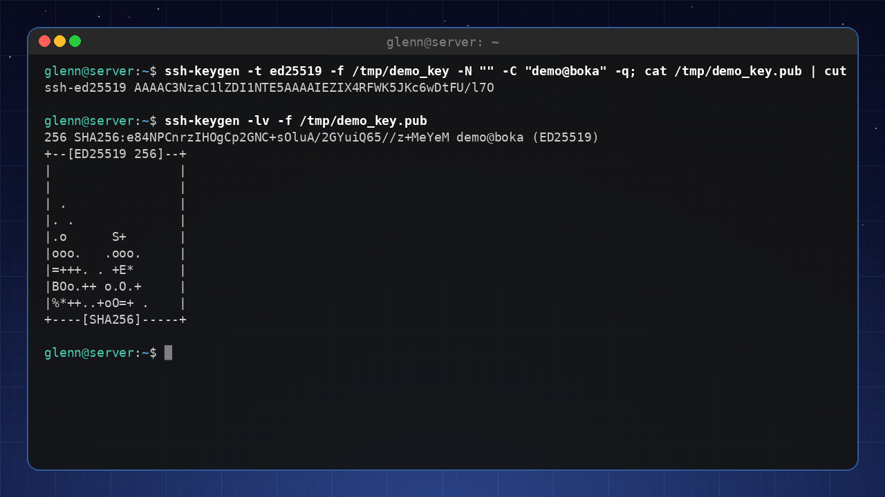

**Copy the public key to the server:**

```bash
ssh-copy-id user@server
```

Now you can log in without a password.

## Passphrase, ssh-agent and known_hosts

**Set a passphrase on the key** when `ssh-keygen` asks – that way a stolen laptop doesn't equal free access to your servers. But typing the passphrase for every connection gets tiresome. The solution is **ssh-agent**, which holds the unlocked key in memory:

```bash
ssh-add                     # unlock the key once (the agent is already running on most distros)
ssh-add -l                  # which keys are loaded?
```

For the rest of the session you log in without typing anything. On the desktop, the agent usually integrates with the keyring, so the passphrase is remembered until you log out.

**`~/.ssh/known_hosts`** is the other file you'll encounter. The first time you connect to a server, SSH asks whether you trust its fingerprint – if you say yes, it's stored here. If you later get the scary warning "REMOTE HOST IDENTIFICATION HAS CHANGED!", it means the server's key is different from last time. The cause is often innocent (the server was reinstalled), but check before you accept! Remove the old entry with:

```bash
ssh-keygen -R servername-or-ip
```

## `~/.ssh/config` – save time

Create a configuration file to define shortcuts for your SSH connections:

```bash
Host my_server
    HostName 192.168.1.100
    User user
    Port 22
    IdentityFile ~/.ssh/id_ed25519
```

Now you can type `ssh my_server` instead of the full address.

### Multiplexing – reuse the connection

Add this at the bottom of `~/.ssh/config`, and create the directory for the socket files:

```bash
mkdir -p ~/.ssh/sockets
```

```
Host *
    ControlMaster auto
    ControlPath ~/.ssh/sockets/%r@%h-%p
    ControlPersist 10m
```

Now your second and third connections to the same server reuse the first – login happens instantly, and `scp` and `rsync` ride the same connection instead of negotiating a new one. This is one of the best tricks at this level.

## File transfer with `scp` and `rsync`

- **`scp`** – copy files over SSH:

```bash
scp file.txt user@server:/home/user/
scp -r folder/ user@server:/home/user/
```

- **`rsync`** – more advanced, can synchronize and resume interrupted transfers:

```bash
rsync -avz --progress /local/folder/ user@server:/remote/folder/
```

## Securing your SSH server

If you expose SSH to the internet, you should take a few measures:

1. **Change the default port** (from 22 to a higher port) – note that this only reduces the *noise* in the log, not the risk; the actual security comes from requiring keys (`PasswordAuthentication no`).
2. **Disable password login** (keys only).
3. **Restrict which users can log in**.

Edit `/etc/ssh/sshd_config`:

```
Port 2222
PasswordAuthentication no
AllowUsers user
```

Restart SSH: `sudo systemctl restart ssh` (the service is called `ssh` on Ubuntu/Mint, `sshd` on some other distros).

**The golden rule for all SSH changes:** keep the session you're logged in with, and test in a *new*, extra terminal that you can still get in – *before* you log out. If the new connection goes wrong, you're still sitting safely in the old one and can fix the mistake. The rule applies to everything in this chapter – and everything you do to SSH later (chapter 17 reminds you of it).

> **Two traps when changing the port:**
>
> 1. Newer Ubuntu versions use "socket activation" for SSH. Then the `Port` line in sshd_config is ignored unless you switch to the classic service: `sudo systemctl disable --now ssh.socket && sudo systemctl enable --now ssh.service`.
> 2. Remember the firewall from chapter 11! Open the new port and close the old one: `sudo ufw allow 2222/tcp && sudo ufw delete allow 22/tcp`.

## SSH as a bridge to Part 3

SSH is the foundation for many of the projects in the next part. You'll use SSH to administer servers and transfer files.

---

**Try it yourself:**

1. Generate an SSH key pair.
2. Copy the key to another machine (e.g. a VM).
3. Create a `~/.ssh/config` file for that machine.
4. Transfer a file with `scp`.

---

**Key takeaways from this chapter**

- Use SSH keys for security and convenience.
- `~/.ssh/config` simplifies connections.
- `scp` and `rsync` are your friends for file transfer.
- Secure the SSH server by changing the port, disabling passwords and restricting users.

---

# 13. tmux and modern terminal tools

*Part 2: Master the Tools*

**In this chapter you'll learn:**

- `tmux` – terminal sessions that survive you logging out (nearly mandatory on servers).
- Splits, windows and detach/attach.
- The modern tools: `ripgrep`, `fd`, `bat`, `eza`, `fzf`, `btop`, `zoxide` and friends.

---

## tmux – the terminal that never dies

Picture this: you're logged in to the home server over SSH and have started a backup that takes two hours. Then you lose WiFi. Without tmux, the backup dies along with the connection. With tmux, it keeps running – and you can reconnect from another machine and pick up exactly where you left off.

tmux (*terminal multiplexer*) gives you sessions that live on the machine, independent of your terminal window.

```bash
sudo apt install tmux
tmux                        # start a new session
```

**The basic principle:** All tmux commands start with the prefix `Ctrl+b`, then a key:

| Keystroke | Does |
|-----------|------|
| `Ctrl+b` then `%` | Split the window vertically (two panes side by side) |
| `Ctrl+b` then `"` | Split horizontally (top/bottom) |
| `Ctrl+b` then arrow key | Jump between panes |
| `Ctrl+b` then `c` | New window (like a tab) |
| `Ctrl+b` then `n` / `p` | Next / previous window |
| `Ctrl+b` then `d` | **Detach** – leave the session (it lives on!) |
| `Ctrl+b` then `x` | Close the pane |

**Detach and attach – tmux's superpower:**

```bash
tmux new -s backup          # start a named session
# ... start the long job ...
# Ctrl+b d  (detach – or just lose the network, same result)

tmux ls                     # which sessions are running?
tmux attach -t backup       # reconnect – everything is just as you left it
```

**The habit that makes you a server user:** The first command after `ssh my_server` is always `tmux attach || tmux`. That way you're *always* working in a session that tolerates disconnection.

> 🟡 **Optional:** The config file is called `~/.tmux.conf`. A popular first change is switching the prefix from `Ctrl+b` to `Ctrl+a`. The alternative `zellij` is a modern, more self-explanatory challenger – but tmux is everywhere, so learn it first.

## The modern tools

The classic tools (`grep`, `find`, `ls`, `cat`) exist on every system and need to live in your fingers. But on *your* machine you can treat yourself to the modern versions – faster, prettier and smarter by default:

| Classic | Modern | Why switch? |
|----------|---------|----------------|
| `grep -r` | **ripgrep** (`rg`) | Much faster, automatically skips `.git` and binary files |
| `find` | **fd** | Simpler syntax: `fd report` instead of `find . -name "*report*"` |
| `cat` | **bat** | Syntax highlighting, line numbers, git changes in the margin |
| `ls` | **eza** | Colors, icons, `--tree` view |
| `top`/`htop` | **btop** | Beautiful and clear system monitor |
| `du`/`ncdu` | **dust** | Disk usage as an easy-to-read tree |
| `cd` | **zoxide** | Remembers your directories: `z proj` jumps to `~/Documents/Projects` |
| `time` | **hyperfine** | Statistical benchmarking with warmup runs – not just one random measurement |
| – | **fzf** | Fuzzy search in everything: history, files, processes |

Install the ones you want to try:

```bash
sudo apt install ripgrep fd-find bat eza btop du-dust zoxide fzf hyperfine
```

> **Debian/Ubuntu detail:** `fd` is called `fdfind`, `bat` is called `batcat` – and the package for `dust` is called `du-dust` (name collisions). The command itself is still called `dust`. Create aliases in `.bashrc`: `alias fd=fdfind` and `alias bat=batcat`.

**Tasters:**

```bash
rg TODO                     # search recursively from here – just like that, no flags
fd -e jpg                   # all .jpg files below here
bat /etc/fstab              # fstab with colors and line numbers
eza -la --tree --level=2    # directory tree two levels down
```

**fzf deserves an extra paragraph.** After installing (say yes to key bindings, or run the setup script it suggests) you get:

- `Ctrl+R` – your command history as an *interactive fuzzy search* (type "ssh back" and find `ssh backup-server` from last year)
- `Ctrl+T` – find files while you're typing a command

**zoxide** learns from you: every time you `cd` somewhere, it's remembered. After a day of use, you just type `z dow` to land in `~/Downloads`. Enable it with one line in `.bashrc`:

```bash
eval "$(zoxide init bash)"
```

**hyperfine – measure, don't guess.** Is `rg` actually faster than `grep -r` on *your* machine? Don't guess – measure:

```bash
hyperfine 'grep -r TODO .' 'rg TODO'
```

hyperfine runs both commands many times (with warmup runs first, so the disk cache doesn't fool you) and gives you the mean, the spread and a clear conclusion: "X ran 4.2 times faster than Y". The habit has a name in this series: **"measure first"**. Measure before you conclude – it's one of the most important habits you'll carry forward, and the rest of the series builds on it.

## Should I learn classic or modern?

Both – in the right order. The classics are the lingua franca: every guide uses them, and they exist on every server you'll ever SSH into. The modern ones are *your* daily comfort. Rule of thumb: **understand `grep`, use `rg`.**

---

**Try it yourself:**

1. Start `tmux`, split the window with `Ctrl+b %`, run `btop` in one pane and work in the other.
2. Detach with `Ctrl+b d`, close the entire terminal window, open a new one and run `tmux attach`. Everything's alive!
3. Install `ripgrep` and compare `rg TODO` with `grep -r TODO .` in a project.
4. Install `fzf` and press `Ctrl+R` – search for an old command.

---

**Key takeaways from this chapter**

- tmux gives you terminal sessions that survive disconnection – invaluable over SSH.
- `Ctrl+b d` (detach) and `tmux attach` are the two moves that matter most.
- Modern tools (`rg`, `fd`, `bat`, `eza`, `btop`, `fzf`, `zoxide`) make everyday life better on your machine.
- Learn the classic tools first – the modern ones are comfort, not replacement.

---

# 14. Virtual machines and containers

*Part 3: Build something of your own*

**In this chapter you'll learn:**

- Why virtual machines and containers are useful.
- KVM/virt-manager and GNOME Boxes.
- What containers are (Podman/Docker).
- Your first `compose` file.

---

## Virtual machines – test safely

With a virtual machine (VM) you can run an entirely different operating system on your computer. Perfect for trying out new distributions or running programs in an isolated environment. Take a snapshot of the VM before you experiment – that undo button is exactly what makes VMs a safe playground.

**GNOME Boxes** – the easiest choice for beginners:

```bash
sudo apt install gnome-boxes
```

Open Boxes, click "+" and pick an ISO file. Boxes handles the rest.

**KVM + virt-manager** – more advanced, but also faster and more flexible:

```bash
sudo apt install virt-manager qemu-kvm
```

You may need to add your user to the `libvirt` group: `sudo usermod -aG libvirt $USER` (remember the rule from chapter 4: group changes only take effect after you log out and back in).

## Containers – lightweight virtualization

A container runs on the same kernel as the host, but is isolated from the rest of the system. Containers start in seconds and use fewer resources than VMs.

**Podman** – daemonless and more secure than Docker (the default in many distros).  
**Docker** – more widespread and has a huge ecosystem.

**Install Podman:**

```bash
sudo apt install podman
```

**Run your first container:**

```bash
podman run docker.io/library/hello-world
```

We write out the full image name with the registry (`docker.io/library/...`) on purpose: a bare `hello-world` gives Podman an interactive menu or an error message on many setups, and full names are good practice anyway – there's never any doubt about where the image comes from.

## The everyday commands – what you'll actually type every day

Starting containers is the easy part. The daily work is looking at, inspecting and troubleshooting them (swap `podman` for `docker` as you prefer – the commands are identical):

```bash
podman ps                       # which containers are running?
podman ps -a                    # ...including stopped ones (which may have crashed)
podman logs nextcloud           # what is the container saying? (-f to follow live)
podman exec -it nextcloud bash  # open a shell INSIDE the container
podman inspect nextcloud        # all configuration as JSON (ports, volumes, IP)
podman stop nextcloud           # stop
podman rm nextcloud             # remove (the container itself, not the data in volumes)
podman volume ls                # which volumes (storage areas) exist?
podman image ls                 # which images are stored locally?
podman system prune             # clean up stopped containers and unused images
```

The troubleshooting reflex when a container is acting up: `ps -a` (is it running at all?) → `logs` (what is it complaining about?) → `exec -it … bash` (go look for yourself, from the inside). Those three steps solve almost everything.

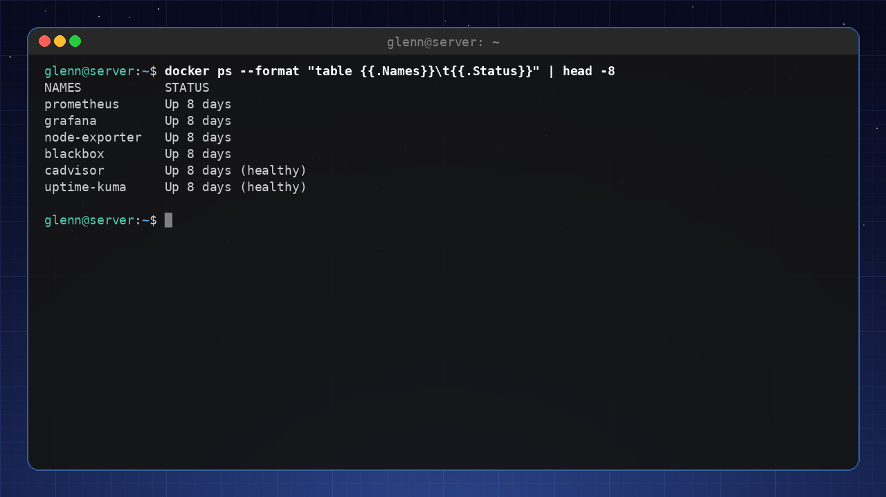

## Docker Compose / Podman Compose

When you have several containers that need to work together (say, a web server and a database), you use a `compose` file.

Example `docker-compose.yml`:

```yaml
services:
  web:
    image: nginx
    ports:
      - "8080:80"
  db:
    image: postgres
    environment:
      POSTGRES_PASSWORD: example
```

Install the compose tool first, then start it up:

```bash
sudo apt install podman-compose
podman-compose up -d
```

---

**Try it yourself:**

1. Install GNOME Boxes and try booting another distribution in a VM.
2. Install Podman and run `podman run -it ubuntu bash` to get a temporary Ubuntu container.
3. Write a simple `compose` file with an Nginx container.

---

**Key takeaways from this chapter**

- VMs give you full isolation and are great for testing – and with snapshots, you can always undo.
- Containers are lightweight and start fast, because they share the kernel with the host.
- Podman/Docker are the container tools – their commands are largely identical.
- Compose files simplify multi-container setups: the whole stack described in one readable file.

---

# 15. Self-hosting – your own cloud at home

*Part 3: Build something of your own*

**In this chapter you'll learn:**

- What self-hosting is, and the pattern that repeats across every project.
- Four classics: Pi‑hole, Nextcloud, Jellyfin and Syncthing.
- US context: dynamic DNS, router setup, and what you should (and shouldn't) expose.

---

## Why self-host?

Instead of paying for cloud services, you can run your own on an old PC or a Raspberry Pi. You get full control over your data, no subscriptions, and – perhaps most importantly – you learn an enormous amount along the way. Everything you've built up in this book (SSH, systemd, containers, backup) comes into play here.

## The pattern – more important than the commands

Every self-hosting project follows the same recipe:

1. **Install** the service (package, container, or official script).
2. **Open the web interface** – the service listens on a port: `http://server-ip:PORT`.
3. **Configure** in the browser.
4. **Put it into production**: make sure it starts on boot (systemd/`--restart always`), gets backed up (chapter 16) and stays updated.

> **About installation commands:** They age fast. That's why this chapter shows the *principle* and points to the official installation pages for the details – they're always up to date, and by now you have the background to read them. Always check the project's own documentation first.

## Project 1: Pi‑hole – ad-free DNS for the whole home

**What:** A DNS server that answers "doesn't exist" whenever anything asks for ad and tracking domains. Because your *entire network* uses it, phones and smart TVs are protected too – with no software on the devices.

**The principle:** Install Pi-hole → set your router (or each device) to use Pi-hole's IP as its DNS → all ad DNS is stopped at the door. The web interface at `http://server-ip/admin` shows statistics and lets you tune the blocklists.

Official installation ([docs.pi-hole.net](https://docs.pi-hole.net)):

```bash
curl -sSL https://install.pi-hole.net | bash
```

> **Wait – curl straight into bash?** Yes, this breaks The Terminal Rule from the beginner book. It's Pi-hole's official method, and the principle still stands: only do this when you trust the source. Want to be thorough? Download the script first (`curl -sSL https://install.pi-hole.net -o pihole.sh`), read through it, then run `sudo bash pihole.sh`.

The most common snag is that "the DNS port is busy": on Ubuntu Server, systemd-resolved already listens on port 53, which Pi-hole needs. The installer usually handles this itself – if it doesn't, `resolvectl` and `DNSStubListener=no` (in `/etc/systemd/resolved.conf`) are the trail to follow.

## Project 2: Nextcloud – your own Google Drive

**What:** File sync, calendar, contacts, photos and document editing – on your machine.

**The principle:** Nextcloud is a web application that needs a web server and a database. You used to have to rig all of that yourself; today the project recommends "All-in-One" (AIO) – a single Docker container that sets up and maintains the rest for you. It's the containers from chapter 14 in practice: you start the AIO container (the command is in the official guide at [github.com/nextcloud/all-in-one](https://github.com/nextcloud/all-in-one)), open `https://server-ip:8080`, and follow the wizard. AIO requires Docker (`sudo apt install docker.io`), not Podman – because AIO manages the Docker daemon directly via its socket to start and update the other containers, something Podman's daemonless design doesn't offer.

> **Why not Snap?** `sudo snap install nextcloud` is the fastest route on Ubuntu – but Mint blocks snapd, and the container setup works the same everywhere and gives you ops practice as a bonus.

Install the client on your PC and phone afterwards – then your files sync just like with Dropbox, only home to you.

## Project 3: Jellyfin – your own streaming service

**What:** A Netflix-like interface for *your* movies, shows and music, with apps for TV and phone. Completely free, no account, no "premium".

**The principle:** Point Jellyfin at your media folders, and it indexes everything with cover art and metadata, then streams to all your devices. The web interface lives on port 8096. Jellyfin isn't in the package repositories – use the official installation page ([jellyfin.org/downloads](https://jellyfin.org/downloads)), which offers a repo script for Debian/Ubuntu (same caveat as with Pi-hole: feel free to read the script first).

## Project 4: Syncthing – synchronization without a central server

**What:** Synchronizes folders *directly between* your devices, encrypted, with no third party – simpler than Nextcloud if file sync is all you need.

**The principle:** Install it on two devices (`sudo apt install syncthing` – this one is in the package repository), open `http://localhost:8384` on both, let them approve each other's device IDs, and pick the folders to share.

## US context – at home behind the router

All the services above work perfectly *from home* with no extra setup. If you want to reach them **from outside**, you have two paths:

1. **Recommended and safe: VPN home.** Use the WireGuard setup from chapter 11 – then you can reach everything at home without exposing anything to the internet. This is the right choice for the vast majority. It also sidesteps a common US obstacle: on T-Mobile Home Internet and Starlink you're usually behind CGNAT, which makes port forwarding impossible anyway (chapter 11 showed the check: compare `curl -4 ifconfig.me` with your router's WAN address – if they differ, you're behind CGNAT, and a tunnel or Tailscale is the way through).
2. **🔴 Advanced: exposing to the internet.** Requires a public IP to begin with – cable ISPs like Comcast/Xfinity and Spectrum usually give you a public dynamic IPv4; a static IP is typically a paid add-on on business plans. On top of that: dynamic DNS (e.g. DuckDNS – residential IPs change), port forwarding of 80/443 in the router, HTTPS via Let's Encrypt – and a clear-eyed understanding that *you* are now operating an internet-exposed service: automatic updates, fail2ban (chapter 17) and strong passwords are no longer optional.

Rule of thumb: **expose as little as possible; a VPN covers nearly every need.**

---

**Try it yourself:**

1. Set up Pi‑hole in a VM or on a Pi, and point one device (your phone) at it as DNS. Watch the statistics fill up.
2. Follow the Nextcloud AIO guide and sync a folder from your PC.
3. Set up Syncthing between your PC and your phone.
4. (🔴 Optional) Set up WireGuard and reach the Pi-hole admin page from home over your cellular connection.

---

**Key takeaways from this chapter**

- Every project follows the same pattern: install → web interface on a port → configure → put into production.
- Commands age – the projects' official documentation is always the source of truth, and now you can read it.
- Pi‑hole protects the whole network; Nextcloud replaces cloud storage; Jellyfin streams your media; Syncthing syncs with no middleman.
- Reach your services from outside via VPN (WireGuard) – exposing them to the internet is an operational responsibility, not a shortcut.

---

# 16. Backup like a pro

*Part 3: Build something of your own*

**In this chapter you'll learn:**

- The 3-2-1 rule for backups.
- `rsync` in depth – the workhorse behind almost all copying.
- `restic` – versioned, encrypted backup (with password handling, pruning and health checks).
- Automate backups with systemd timers – and get an alert on your phone when they fail.
- Most important of all: test your restores!

---

## The 3-2-1 rule

A good backup strategy follows 3-2-1:
- **3** copies of your data (original + 2 backups).
- **2** different storage media (e.g. local disk + external disk).
- **1** copy off-site (e.g. in the cloud or at a friend's place).

## rsync – the workhorse

You've used `rsync` in scripts and over SSH. Now it deserves a proper explanation, because this is the tool that makes mirror copies practical.

**The genius of rsync:** It only copies the *differences*. The first run takes time – but the next time, source and destination are compared, and only changed files (in fact, only the changed *parts* of files over the network) are transferred. A nightly backup of 500 GB where 2 GB is new takes minutes, not hours.

```bash
rsync -av ~/Documents/ /media/backupdisk/Documents/
```

- `-a` ("archive") – copy everything recursively and preserve permissions, owners and timestamps. Almost always what you want.
- `-v` – say what's happening.

**The two traps everyone falls into:**

1. **The trailing slash matters:** `~/Documents/` (with `/`) copies the *contents* of the folder; `~/Documents` (without) copies *the folder itself* into the destination. The wrong variant leaves you with `Documents/Documents/`.
2. **`--delete` mirrors deletions too:** files you've deleted locally get deleted in the backup as well. That gives you a true mirror copy – but it means an accidental deletion carries over into the next backup. Always test with `--dry-run` first:

```bash
rsync -av --delete --dry-run ~/Documents/ /media/backupdisk/Documents/   # SHOW what would happen
rsync -av --delete ~/Documents/ /media/backupdisk/Documents/             # do it
```

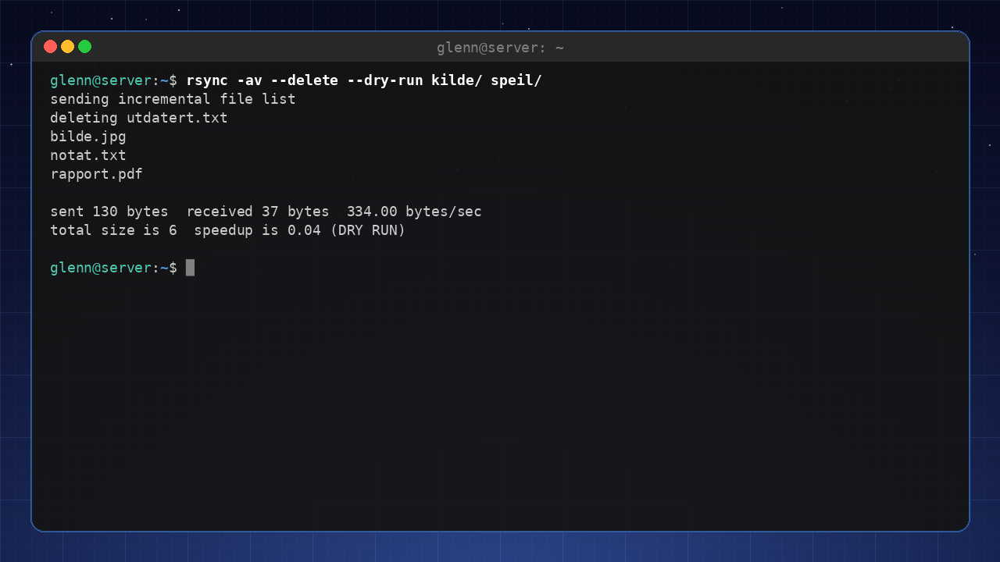

Other useful flags: `--exclude ".cache"` (skip folders), `-z` (compress over the network), `--progress` (per-file progress). And because rsync works over SSH out of the box, remote backup is just `rsync -avz ~/Documents/ user@server:/backup/`.

**When is rsync enough – and when do you need more?** rsync gives you a copy of the *current state*. It protects against disk failure, but not against "the file got corrupted last week and I only just noticed" – then the mirror is just as corrupted. For that, you need *versioned* backup:

## `restic` – versioned and encrypted

`restic` is fast, encrypted and simple – and it's the tool we stick with for the rest of the series. Every run creates a *snapshot*, and thanks to deduplication, a hundred snapshots cost little more than one: only what's actually new gets stored.

**Install:**

```bash
sudo apt install restic
```

**Initialize a backup repo (locally or in the cloud):**

```bash
restic init --repo /media/backupdisk/restic-repo
```

You'll be asked to choose a password. This is not just any password – the entire repo is encrypted with it. More on that in a moment.

**Take a backup:**

```bash
restic backup /home/user --repo /media/backupdisk/restic-repo
```

**Restore:**

```bash
restic restore latest --target /restored --repo /media/backupdisk/restic-repo
```

`restic` can also back up straight to cloud storage like AWS S3 or Backblaze B2 – handy for the "1" in 3-2-1.

### The password: where does it live?

If you lose the repo password, the backup is irretrievably gone – the encryption makes no distinction between you and a thief. So the password needs two homes:

- **In your password manager**, like any other important password.
- **In a file on the machine**, so the timer can run without you:

```bash
sudo sh -c 'echo "your-repo-password" > /root/.restic-password'
sudo chmod 600 /root/.restic-password
```

Then point restic at the file with the environment variable `RESTIC_PASSWORD_FILE=/root/.restic-password` (for example via `Environment=` in the service file).

And run the uncomfortable check: is the restic password available on the day the disk holding your password manager is the one that died? A printout on paper in a drawer is not a bad idea.

### Prune – or the repo grows forever

Snapshots pile up. Without cleanup, the repo grows until the disk is full:

```bash
restic forget --keep-daily 7 --keep-weekly 4 --keep-monthly 6 --prune --repo /media/backupdisk/restic-repo
```

The keep logic reads like this: keep one snapshot per day for the last 7 days, one per week for the last 4 weeks, and one per month for the last 6 months – the rest are forgotten. `--prune` deletes the data that no longer belongs to any snapshot; without it, the space isn't freed.

### Health check

Run regularly – ideally weekly in its own timer:

```bash
restic check --repo /media/backupdisk/restic-repo
```

`check` verifies that the repo's structure and data are intact, and catches silent corruption *before* the day you actually need the backup. A backup you haven't verified is a hope, not a backup – more on that under "test your restores" below.

> **Also exists: `borg`.** `borgbackup` (`sudo apt install borgbackup`) solves the same job on the same idea – deduplicated, encrypted, versioned – and is a mature alternative that shines especially when your backup server is a plain SSH box, and when you want append-only mode to prevent ransomware on the client from deleting old backups. We'll use restic going forward in the series.

## Automate with systemd timers

Chapter 10 showed the whole recipe: a `backup.service` that runs the script, and a `backup.timer` with `OnCalendar=daily` and `Persistent=true`. Set `ExecStart` to your restic command, enable the timer, and check the result with `journalctl -u backup.service` the next morning.

**But who checks the journal every morning?** Nobody – which is why a failed backup should speak up on its own. `ntfy` is free push notifications over HTTP: pick a topic (a name nobody can guess – that's the entire "authentication"), install the app on your phone, and send notifications with a single `curl`. Put it in the failure branch of your backup script:

```bash
if ! restic backup /home/user --repo /media/backupdisk/restic-repo; then
    curl -d "Backup failed on $(hostname)" ntfy.sh/my-secret-topic
fi
```

Alternatively, let systemd do the job with `OnFailure=backup-alert.service` in the service file, where the alert service runs that same curl line. The point is the same either way: silence means success, and your phone only pings when something is wrong.

## Most important of all: test your restores!

A backup you've never tested is just hope. Set aside time to actually restore some files and check that they're readable.

---

**Try it yourself:**

1. Install `restic` and create a local backup repo.
2. Take a backup of a folder.
3. Delete a file from that folder, and restore it from the backup.
4. Run `restic check` and `restic forget --keep-daily 7 --keep-weekly 4 --keep-monthly 6 --prune` – and read what they tell you.
5. (Optional) Set up a systemd timer that runs the backup daily, and an ntfy notification that speaks up if it fails.

---

**Key takeaways from this chapter**

- Follow the 3-2-1 rule for real safety.
- `rsync -av` mirrors efficiently (only the differences are copied) – but mind the trailing slash, and test `--delete` with `--dry-run`.
- A mirror copy (rsync) protects against disk failure; versioned backup (`restic`) also protects against old mistakes.
- The repo password must outlive everything else: password manager + a file for the timer (`RESTIC_PASSWORD_FILE`) + ideally paper.
- `restic forget --prune` keeps the repo in check; `restic check` tells you whether it's still healthy.
- Automate with a systemd timer, let ntfy alert you on failure – and test your restores regularly.

---

# 17. Security and Hardening

*Part 3: Build something of your own*

**In this chapter you'll learn:**

- An honest threat model for home users.
- Automatic security updates with `unattended-upgrades`.
- Disk encryption with LUKS – checking what you have, and practicing safely with an encrypted container.
- fail2ban for exposed services.
- Next-level password hygiene and 2FA.

---

Security isn't about doing *everything* – it's about doing the right things against the threats you actually face. That's why this chapter starts with the threat model – and every measure that follows answers one concrete question: which threat does this stop?

## A threat model for home users

What is actually dangerous to you?

- **Outside attacks** – Most attacks come from botnets that scan the internet for vulnerable services and known, unpatched vulnerabilities. Secure SSH and web servers – and keep your system updated.
- **Theft of the machine** – If someone steals your PC, they can get at your data if the disk isn't encrypted.
- **Malware** – Rare on Linux, but possible if you install from untrustworthy sources.
- **Social engineering** – Phishing and the like. Good habits help more than any tool here.

You don't need to defend yourself against a nation-state intelligence agency – you need to defend yourself against ordinary threats. The rest of the chapter takes them one by one.

## unattended-upgrades – patch known holes automatically

The most realistic way into a home machine isn't a brilliant attack, but a known vulnerability that already has a fix you simply haven't installed – exactly the kind of hole the botnets from the threat model scan for. `unattended-upgrades` installs security updates automatically in the background, shrinking the window between "a fix exists" and "the fix is installed" from weeks to hours. This is the home user's single most important measure – two commands, done:

```bash
sudo apt install unattended-upgrades
sudo dpkg-reconfigure -plow unattended-upgrades   # answer "Yes" to enable
```

The default setup fetches only security updates – regular upgrades are still up to you, and if you want to tweak the details, the configuration lives in `/etc/apt/apt.conf.d/50unattended-upgrades`.

## Disk encryption with LUKS

Disk encryption answers threat number two: theft of the machine. The easiest path is to choose encryption from the start, during the Linux installation – then the entire disk is encrypted, and you type a passphrase at boot. Check whether you already have it:

```bash
lsblk
```

Look for a layer of type `crypt` in the output:

```
NAME                TYPE   MOUNTPOINTS
nvme0n1             disk
└─nvme0n1p3         part
  └─nvme0n1p3_crypt crypt
    └─vg-root       lvm    /
```

If you find a `crypt` layer, the disk is encrypted. **Be clear about what the passphrase actually protects against:** a stolen disk or a machine that is *powered off*. A logged-in, unlocked machine is as open as ever – encryption doesn't help against malware, attacks over the network, or someone sitting down at the keyboard while you're logged in. Lock the screen when you step away, and shut the laptop down completely (not just sleep) before putting it in your bag.

### Exercise: an encrypted container in a file

Encrypting a disk that's already in use is risky, but you can learn the entire LUKS toolbox completely safely with a container inside an ordinary file:

```bash
truncate -s 100M container.img                 # create an empty 100 MB file
sudo cryptsetup luksFormat container.img       # format as LUKS (choose a passphrase)
sudo cryptsetup open container.img mybox       # unlock -> /dev/mapper/mybox
sudo mkfs.ext4 /dev/mapper/mybox               # create a file system inside the container
sudo mount /dev/mapper/mybox /mnt
echo "secret note" | sudo tee /mnt/note.txt
sudo umount /mnt
sudo cryptsetup close mybox                    # lock it again
```

Open it again with `cryptsetup open` and `mount` – without the passphrase, `container.img` is just unreadable noise. A container like this is useful in its own right, too: it can live on a USB stick or in the cloud. In Book 3 we build further on LUKS with automatic unlocking via TPM.

## fail2ban – blocks repeated failed attempts

This measure targets the botnets from the threat model: `fail2ban` monitors logs and blocks IP addresses that keep failing, e.g. wrong passwords against SSH.

**Install and enable:**

```bash
sudo apt install fail2ban
sudo systemctl enable --now fail2ban
```

Don't edit `jail.conf` – it gets overwritten by updates. Your own settings go in `/etc/fail2ban/jail.local`. A minimal setup that enables the SSH jail:

```ini
[sshd]
enabled = true
maxretry = 5        # number of failed attempts before blocking
bantime = 1h        # how long the IP stays blocked
```

Restart with `sudo systemctl restart fail2ban`, and check that the jail is running: `sudo fail2ban-client status sshd`.

> **Debian trap:** On plain Debian without `rsyslog` there is no `/var/log/auth.log`, and then fail2ban refuses to start. Add `backend = systemd` in `jail.local` (under `[sshd]` or `[DEFAULT]`), and it reads the systemd journal directly.

One nuance to finish: if you followed chapter 12 and set `PasswordAuthentication no`, nobody can guess their way in anyway – the keys are the security. Then fail2ban is mostly noise reduction: the log becomes readable again, and the machine stops wasting effort on thousands of hopeless attempts. Still worth it, but it's the key requirement that carries the load.

## Password hygiene and 2FA

Your passwords are the line of defense against both remote attacks and social engineering:

- **Use a password manager** (Bitwarden, KeePassXC) with strong, unique passwords. Unique passwords mean that one leaked service doesn't bring down all the others – and a password manager that only autofills on the correct web address is a surprisingly good phishing defense.
- **Enable 2FA (two-factor)** wherever possible (Google Authenticator, Authy, or a YubiKey). Then a stolen or phished password alone isn't enough to get in.
- For extra security, you can use the `google-authenticator` package to add 2FA to SSH logins.

> **Don't lock yourself out:** Always test changes to SSH login in a *new, extra* session while the old one stays open. If the 2FA setup is wrong and you've already logged out, you're locked out of your own server. This rule applies to all changes to your SSH setup – including the ones from chapter 12.

---

**Try it yourself:**

1. Install `unattended-upgrades` and check that it's active: `systemctl status unattended-upgrades`.
2. Check whether you have full disk encryption: `lsblk` and look for the `crypt` layer.
3. Do the container exercise: create, open, write to, close, and reopen an encrypted file container.
4. Install fail2ban, enable `[sshd]` in `jail.local`, and check the status: `sudo fail2ban-client status sshd`.
5. Set up 2FA for an online service you use (e.g. your Google account).

---

**Key takeaways from this chapter**

- Assess your threat landscape realistically – most people don't need military-grade security.
- Automatic security updates are the home user's single most important measure.
- Disk encryption protects a powered-off machine against theft – not a logged-in one.
- fail2ban reduces the noise; the key requirement from chapter 12 is the actual security.
- Use a password manager and 2FA for important accounts – and test SSH changes in an extra session.

---

# 18. Distro Safari – with a Parachute

*Part 4: Further out into the ecosystem*

**In this chapter you'll learn:**

- Fedora, Debian, Arch, openSUSE, and NixOS.
- What they do differently, and when switching makes sense.
- Test everything in a VM first.

---

## Why try a new distro?

Every distribution has its own philosophy, package system, and tools. Trying a different distro can give you new perspectives and new tools.

## Fedora – modern and cutting-edge

- **Origin:** Independent project sponsored by Red Hat. Fedora is the upstream source that Red Hat Enterprise Linux is built from.
- **Package system:** DNF (RPM).
- **Philosophy:** The latest technologies, while staying stable.
- **Good for:** People who want a modern system without going all the way to Arch.

## Debian – extremely stable

- **Origin:** Independent. Debian is the "mother" that Ubuntu (and therefore Mint) is built from.
- **Package system:** APT.
- **Philosophy:** Stability over novelty.
- **Good for:** Server use and anyone who appreciates long-term support.

## Arch Linux – build your own

- **Origin:** Independent (rolling release).
- **Package system:** Pacman.
- **Philosophy:** Minimalism; the user decides everything.
- **Good for:** People who want to learn Linux from the inside out.
- **Warning:** Not for beginners – but you're an intermediate user now!

## openSUSE – professional and flexible

- **Origin:** Independent, with SUSE as the main sponsor.
- **Package system:** Zypper (RPM).
- **Philosophy:** Great administration and tooling (YaST).
- **Good for:** People who want a solid alternative to Debian/Ubuntu.

## A map of the package commands

The package systems all do exactly the same thing – they just speak different dialects. If you know one of the columns by heart, you can translate directly:

| Task | Debian/Ubuntu/Mint | Fedora | Arch | openSUSE |
|---|---|---|---|---|
| Install | `apt install` | `dnf install` | `pacman -S` | `zypper install` |
| Search | `apt search` | `dnf search` | `pacman -Ss` | `zypper search` |
| Update everything | `apt upgrade` | `dnf upgrade` | `pacman -Syu` | `zypper update` |
| Remove | `apt remove` | `dnf remove` | `pacman -R` | `zypper remove` |

## NixOS – a declarative system

- **Unique:** The entire system is configured with a single file (`configuration.nix`).
- **Advantage:** Reproducible, easy to roll back.
- **Good for:** People who like infrastructure as code.

## Distro hopping – when should you switch?

Switch distros when:

- You have a specific reason (e.g., better support for new hardware).
- You're curious about a different philosophy.
- You have the time and the desire to learn.

Do **not** switch just because it's "cool" – take the time to really get to know the system.

## Test in a VM first

Use GNOME Boxes or virt-manager to try a new distro without risking your main system. Run it for a week, install the programs you need, and see if it suits you.

---

**Try it yourself:**

1. Download a Fedora ISO and run it in a VM.
2. Try installing the programs you use daily.
3. Compare its package management with APT.

---

**Key takeaways from this chapter**

- Fedora, Debian, Arch, openSUSE, and NixOS have different strengths.
- Arch is excellent for learning, but demanding.
- Always test new distros in a VM before you consider switching.

---

# 19. The Desktop on Your Terms

*Part 4: Further out into the ecosystem*

**In this chapter you'll learn:**

- Wayland vs. X11 – which one you should choose.
- Tiling window managers (Sway, Hyprland) – what they are and who they're for.
- Keyboard-driven workflows.
- Version control for your dotfiles.

---

## Wayland vs. X11

- **X11** – the older display server. Works with everything, but has security challenges and development has slowed to a crawl.
- **Wayland** – modern, faster, and more secure. Used by most new installations today.

Most people run Wayland by default (GNOME, KDE, COSMIC). If you run into problems, you can switch to X11 at login (choose "Xorg" on the login screen). Check what you're running with `echo $XDG_SESSION_TYPE`.

## Wayland in practice – the questions people actually ask

**Scaling on high-resolution displays:** Wayland does *fractional scaling* (125%, 150%) sharply and correctly – this was long X11's weakest point, especially with two displays at different resolutions. Turn it on under Settings → Displays. If certain older apps (X11 apps running through the XWayland bridge layer) look blurry when scaled, there are switches for that in KDE and newer GNOME.

**Gaming:** Works great on Wayland in 2026 – and often *better* than X11: VRR/adaptive sync (FreeSync/G-Sync) is handled per display, and tearing problems are effectively gone. Steam and Proton don't care which one you're running.

**NVIDIA:** Historically Wayland's Achilles' heel, but with the 555-series drivers and newer (explicit sync) it works well. If you get weird graphics glitches with NVIDIA on Wayland: update the driver first, and try the X11 session as a temporary plan B.

**Screen sharing in Teams/Zoom/Discord:** Works, but goes through a "portal" – you get a system dialog asking which display or window you want to share, instead of the app seeing everything (that's the whole security point of Wayland). If you share your screen and it just goes black, it's usually an old app version without portal support – use the browser version of the meeting service; that always supports it.

**HDR:** In place in KDE Plasma and on its way in GNOME/COSMIC – but the entire chain has to support it (display, cable, game/player). Expect it to work for games and video in KDE, and to still be early days elsewhere. This is impossible on X11, so HDR is in itself one reason everything is happening on Wayland now.

## Tiling window managers – for keyboard heroes

A "tiling" WM automatically organizes windows into tiles, so you never have to drag windows around. You control everything with the keyboard.

- **Sway** – Wayland-based, i3-compatible.
- **Hyprland** – Modern, with animations and flexible configuration.

**Who is it for?** If you like working fast without a mouse, this is for you. But it does require learning new shortcuts.

**The first half hour:** The hurdle isn't picking the right WM – it's daring to make that first login. Install Sway with `sudo apt install sway`, log out, and choose the Sway session from the menu on the login screen. You're greeted by a nearly empty screen, and that's the point: `Super+Enter` opens a terminal, and `Super+1`, `Super+2`, and `Super+3` switch between workspaces. When you've had enough, `Super+Shift+e` takes you safely back to the login screen and your usual desktop. Nothing is broken – the two sessions live side by side, and you can visit Sway as often or as rarely as you like.

## Keyboard-driven workflow

- Learn the shortcuts for switching windows, launching programs, and navigating workspaces.
- Use a launcher (e.g., `rofi`, `wofi`) to start programs with a keystroke.

## Version control for dotfiles

The configuration you build up in a tiling WM is exactly the kind of dotfiles that chapter 8 explained why you should version-control – and in chapter 21 we set up the actual git repo for them.

---

**Try it yourself:**

1. Check whether you're running Wayland with `echo $XDG_SESSION_TYPE`.
2. Install Sway: `sudo apt install sway` and try it in a separate session.
3. Set up a git repo for your dotfiles.

---

**Key takeaways from this chapter**

- Wayland is the future; X11 is on its way out.
- Tiling WMs give you a highly efficient keyboard-based workflow.
- Version-controlling your dotfiles gives you control over your setup.

---

# 20. Troubleshooting as a Method

*Part 4: Further out into the ecosystem*

**In this chapter you'll learn:**

- From panic to plan – a systematic approach.
- Read logs with `journalctl` and `dmesg`.
- Map out the machine: `lsusb`, `lspci`, `lsblk`, `free`, `df`, and friends.
- Find out why the machine is slow: `btop`, `iotop`, `vmstat`.
- Understand error messages instead of googling blindly.
- When and how to write a good bug report.

---

## Systematic troubleshooting

When something goes wrong, don't panic. Follow these steps:

1. **Reproduce** – Can you recreate the problem? Note exactly what you did.
2. **Check the logs** – The logs often tell you what happened.
3. **Check status** – Is the service running? `systemctl status`.
4. **Check permissions** – Do you have access? `ls -l`.
5. **Search for the error message** – Use the exact text of the error message you got.
6. **Test one change at a time** – Don't do ten things at once.

## Log files – your best friends

- **`journalctl`** – systemd logs. Use `-b` for the current boot, `-p err` for errors only, `-u service` for a single service, `-f` to follow live (full overview in chapter 10).
- **`dmesg`** – kernel logs (hardware, drivers). Run `sudo dmesg -w` in one window while you plug in the USB device that "doesn't work" – you'll see immediately whether the kernel sees it.
- **`/var/log/`** – classic log files (e.g., `/var/log/auth.log` for logins).

## Map out the machine – question and command

Half of troubleshooting is finding out what the system *actually sees*. Here's the lookup table:

| Question | Command |
|----------|----------|
| Does the machine see the USB device? | `lsusb` |
| Does it see the graphics card/WiFi chip? | `lspci` (filter: `lspci \| grep -i net`) |
| What disks and partitions exist? | `lsblk` |
| What is mounted where? | `findmnt` (or just `mount`) |
| Is the disk full? | `df -h` |
| What's filling it up? | `du -sh /var/* \| sort -rh \| head` or `ncdu` |
| Is memory full? | `free -h` |
| How long has the machine been up, and how loaded is it? | `uptime` |
| Which kernel and distro am I running? | `uname -r` and `hostnamectl` |

`hostnamectl` is underrated: one command gives you the hostname, distro, kernel version, and hardware model – exactly what a bug report needs.

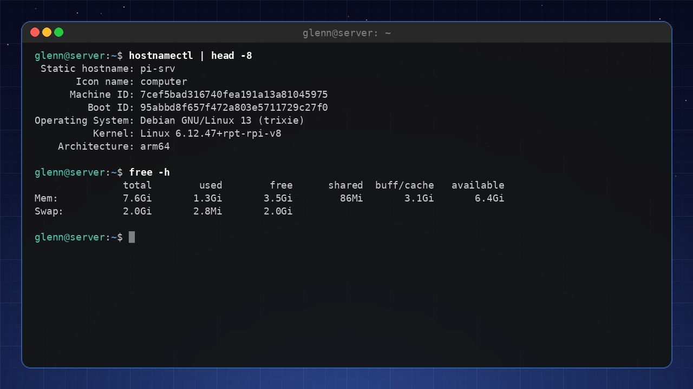

## When the machine is slow – find the bottleneck

"Slow" always has one of four causes: CPU, memory, disk, or network. The tools below tell you which one:

- **`btop`** (or `htop`) – the first choice. If you see a process at 100% CPU, case closed. If you see that memory is full and *swap* is in use, it's the memory.
- **`iotop`** (`sudo iotop -o`) – who's writing to and reading from the disk the most? A machine with idle CPU that still "hangs" is often just sitting there waiting for the disk.
- **`iftop`** (`sudo iftop`) – who's using the network? Reveals that the "slow browser" is really a cloud sync saturating the line.
- **`vmstat 2`** 🟡 – columns of numbers every 2 seconds; the `wa` column (I/O wait) above ~20 means the disk is the bottleneck. Its relative `iostat 2` (in the `sysstat` package) shows the same per disk.

The workflow: `btop` first → CPU or memory visible? Done. Otherwise → `iotop` (disk?) → `iftop` (network?). Four commands, and "the machine is slow" has become a concrete suspect.

## Anatomy of a Troubleshooting Session

*Let's see the method in action – told the way it unfolds, from symptom to lesson learned.*

**The symptom:** "The machine is slow." Programs take ten seconds to start, the file manager stutters. The temptation is to jump straight to a conclusion: "the disk is old, I need an SSD." But we don't guess – we follow the workflow.

**The hypotheses:** CPU, memory, disk, or network. We check the cheapest one first:

```bash
btop        # CPU: 8% – not it. Memory: plenty of headroom – not it either.
```

But at the bottom of `btop`, I/O wait is glowing high: the processor is sitting there *waiting for the disk*. Next step in the workflow:

```bash
sudo iotop -o    # shows only processes actually doing I/O
```

**The finding:** At the top sits the cloud storage client, writing steadily at full speed. It was set up last week – and is syncing the entire home directory, including an 80 GB photo archive. We test the hypothesis before we celebrate: pause the sync in the client's menu, and the machine responds normally again within seconds. Confirmed.

**The fix:** Don't leave it paused forever – then you lose the syncing you actually wanted. Open the client's settings and limit it to the folders that need the cloud (documents, not the photo archive), or set it to sync at night when the machine sits unused.

**The lesson:** Four commands from "the machine is slow" to a named culprit – without opening the machine, and without buying anything. Guessing would have ended with a new SSD getting chewed up just as busily by the same client. The method isn't slower than gut feeling; it's faster – because it never fixes the wrong thing.

## Understanding error messages

Read the error message carefully. It tells you:
- What went wrong (e.g., "Permission denied").
- Which file or service was involved.
- Often a hint about the solution.

Example: `error: cannot open display: :0` means X11 isn't available – you might be running in a plain terminal.

## Writing a good bug report

If you're asking for help, provide as much information as possible:

- Which distribution and version (e.g., "Linux Mint 22 Cinnamon").
- What you were trying to do.
- What happened (the error message).
- What you've already tried.

This makes it much easier for others to help you.

---

**Try it yourself:**

1. Take a problem you've run into before, and try to find it in the logs.
2. Run `journalctl -b -p err` and see what errors have been logged since the last boot.
3. Write a hypothetical bug report for an imagined problem.

---

**Key takeaways from this chapter**

- Work systematically: reproduce, check the logs, check status, check permissions.
- `journalctl` and `dmesg` are your most important log tools.
- Error messages often contain the answer – read them carefully.
- Good bug reports help the community help you.

---

# 21. Git – the Tool the Whole Linux World Uses

*Part 4: Further out into the ecosystem*

**In this chapter you'll learn:**

- What version control actually solves.
- The core workflow: `init`, `add`, `commit`, `status`, `log`.
- Working with GitHub/GitLab: `clone`, `pull`, `push`.
- Branches: `branch`, `switch`, and `merge`.
- Hands-on project: your dotfiles repo under Git.

---

You don't have to be a programmer to need Git. The Linux kernel is developed with Git (Linus Torvalds created Git *for* it), all the software you use lives in Git repos, configuration recipes are shared as Git repos – and your dotfiles deserve the same. If you know Git, you can both safeguard your own files and take part in everything else.

**What does Git solve?** Three things: *history* (what did I change last Tuesday?), *freedom to undo* (roll back to a working version), and *collaboration* (several people can work on the same thing without overwriting each other).

## Getting started

```bash
sudo apt install git
git config --global user.name "Your Name"
git config --global user.email "you@example.com"
git config --global init.defaultBranch main
```

You run the three config lines once; they're stored in `~/.gitconfig` (a dotfile, of course).

## The core cycle: edit → add → commit

A Git repo is a perfectly ordinary folder plus a hidden `.git` folder containing the history.

```bash
mkdir ~/dotfiles && cd ~/dotfiles
git init                        # turn the folder into a repo

cp ~/.bashrc bashrc             # add a file
git status                      # red: "untracked" – Git sees it, but isn't tracking it
git add bashrc                  # put it in "staging" – ready to be saved
git commit -m "Add bashrc"      # save a snapshot with a message
git log --oneline               # the history – one line per commit
```

**Mental model:** `add` puts changes in a shopping cart, `commit` pays at the register. You choose what goes into each commit – which is why one commit can be "fixed alias" and the next "new vim config", instead of one big "changed stuff".

The daily rhythm is just:

```bash
git status                      # what have I changed?
git diff                        # show the changes line by line
git add -A                      # include everything that changed
git commit -m "Describe the change"
```

**Good commit messages** say *what* and *why*, briefly: "Increase bash history length to 10000" beats "changes".

## .gitignore – keep the junk out

Some files should never enter the history (caches, secrets, build artifacts). List them in `.gitignore`:

```
*.log
.cache/
secrets.env
```

> **⚠️ Important:** NEVER put passwords or API keys in a repo you push – the history remembers even if you delete the file afterwards.

## Working with GitHub/GitLab: clone, pull, push

A *remote* is a copy of the repo on a server. Create an empty repo on GitHub (or GitLab/Codeberg), and connect yours to it:

```bash
git remote add origin git@github.com:username/dotfiles.git
git push -u origin main         # first push; after that, plain "git push" is enough
```

(The SSH key from chapter 12 is exactly what GitHub wants – paste the public key under *Settings → SSH keys*.)

And the other direction:

```bash
git clone git@github.com:username/dotfiles.git      # fetch a repo (yours or someone else's)
git pull                                            # fetch new changes later
```

That closes the circle: `commit` locally → `push` up → `clone`/`pull` down on the next machine. The dotfiles setup from chapter 8 is now available everywhere.

## Branches – a safe playground

A *branch* is a parallel timeline. Want to try a big overhaul of your `.bashrc` without risking the one that works:

```bash
git switch -c experiment        # create and switch to a new branch
# ...edit, add, commit as usual...
git switch main                 # back to safe ground – the files look like before!
git merge experiment            # happy? merge the experiment into main
git branch -d experiment        # clean up the branch
```

If a **merge conflict** occurs (the same lines changed in two places), Git stops and marks the file with `<<<<<<<`/`>>>>>>>`. Edit the file into the shape you want, remove the markers, `git add` and `git commit`. That's all a conflict is – not dangerous, just Git asking you to choose.

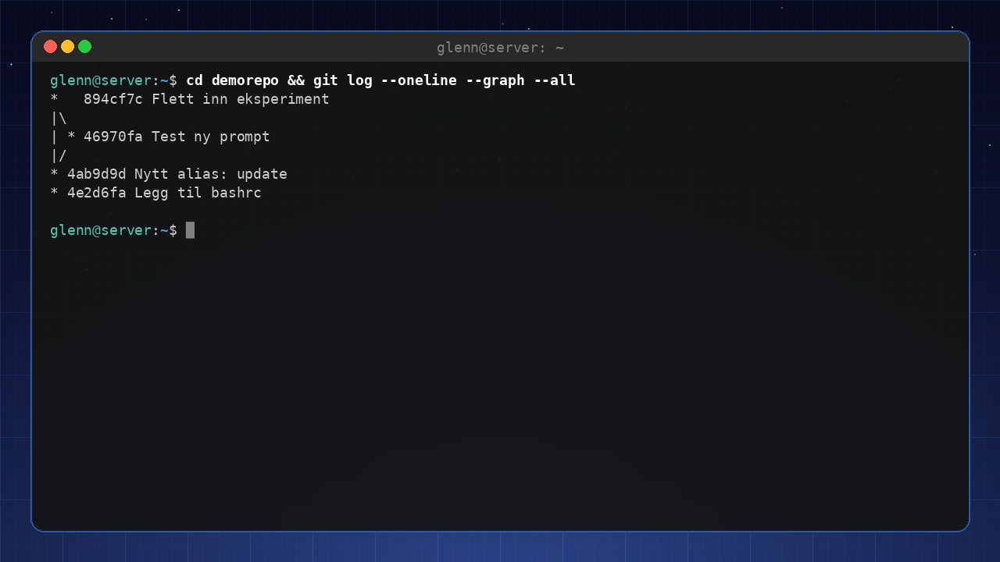

## Undoing – the three most common

```bash
git restore file.txt            # discard unsaved changes in a file
git restore --staged file.txt   # take a file out of the shopping cart (after add)
git revert a1b2c3               # create a new commit that undoes an old one (safe for shared history)
```

> 🔴 **Advanced:** `git reset --hard` deletes work for good. Save it for when you're confident – `revert` solves the same problem without loss.

## The definitive workflow (the one you'll actually use)

```bash
git pull                        # start the day up to date
git status && git diff          # see what you've done
git add -A && git commit -m "…" # save
git push                        # share
```

Four lines. That's 95% of all Git use outside software development.

---

**Try it yourself:**

1. Create `~/dotfiles`, turn it into a Git repo, and commit your `.bashrc` (as in the example).
2. Create a branch, change something, switch back to main and watch the change "disappear". Merge it in.
3. Create a repo on GitHub, push your dotfiles repo, and clone it to another machine (or a VM from chapter 14).
4. Run `git log --oneline --graph` and see your history as a graph.

---

**Key takeaways from this chapter**

- Git gives you history, freedom to undo, and sharing – for config files, notes, and scripts too.
- The rhythm is `status` → `add` → `commit` → `push`; `clone`/`pull` is the other direction.
- Branches let you experiment safely; merge conflicts are a question, not a crisis.
- Never put secrets in the repo – the history doesn't forget.

---

# 22. Giving Back – Contributing to Open Source

*Part 4: Out into the ecosystem*

**In this chapter you'll learn:**

- You don't need to know how to program to contribute.
- Report bugs properly.
- Translate software into other languages.
- Improve documentation.
- How the community works – issues, pull requests, and good manners.

---

## Many ways to contribute

Open source lives on contributions from volunteers. You can contribute without being a developer:

- **Report bugs** – Use the program, discover a bug, and report it well.
- **Translate** – Many apps and documents need translations. If you speak another language, that's a superpower.
- **Write documentation** – Improve guides, add examples.
- **Help others** – Answer questions in forums, on Reddit, on Discord.
- **Donate money** – Support the projects you depend on.

## You already have the tool: Git

All collaboration in open source runs through Git and platforms like GitHub, GitLab, and Codeberg. The workflow you learned in chapter 21 – clone, change, commit, push – is exactly the same whether you're fixing a typo in VLC's documentation or contributing code. The only new piece is the **pull request**: you make the change in your own copy (*fork*) of the project, push, and ask the project to pull it in. The platforms walk you through it with buttons.

Here's what the classic first voyage looks like – fixing a typo in a README:

1. Click **Fork** on the project page. You now have your own copy under your account.
2. `git clone` your fork – exactly like in chapter 21.
3. `git switch -c fix-typo` – create a branch for the change.
4. Edit the file in your usual editor.
5. `git add` and `git commit` with a short, descriptive message.
6. `git push -u origin fix-typo`.
7. The platform now shows a **"Compare & pull request"** button. Click it.
8. Write one polite sentence about what you changed and why. That's enough.

From there the platform guides you through the rest – the maintainers see the change, comment if needed, and merge it in. Notice that steps 2–6 are pure repetition of chapter 21; the only new parts are the fork button and the pull request. The real first voyage – a genuine contribution to the tldr project – we'll take in Book 3.

## How the community works

- **Issue trackers** – Where bugs and feature requests are reported.
- **Pull requests** – Your way of delivering improvements.
- **Code of Conduct** – Most projects have guidelines for behavior.

## Becoming part of the community

Start small: Find a project you use daily, look through the issue list, and see if you can contribute documentation or translations. Over time, you might help out with code.

---

**Try it yourself:**

1. Find a program you use (e.g. GIMP, VLC) and check whether it's missing a translation into a language you speak.
2. Report a small bug you've discovered (properly).
3. Find a project you use, open the issue list, and read three *closed* issues. Notice what the good reports have in common: version numbers, steps to reproduce the bug, and what was expected versus what actually happened.

---

**Key takeaways from this chapter**

- Open source needs all kinds of contributions – not just code.
- Report bugs with good details.
- Translation and documentation are worth their weight in gold.
- Git is the tool for collaboration.
- The community is open and inclusive.

---

# Bonus: Frequently Asked Questions for Intermediate Users

**Should I switch to Arch?**  
If you want to learn a lot and have time to configure things, yes. But you don't need to switch from Mint or Ubuntu – you can learn just as much there.

**Is Snap really that bad?**  
It's slower than Flatpak and less open, but it works. Many avoid it on principle. You can choose Flatpak instead.

**Do I need antivirus now?**  
No, unless you're running a server that shares files with Windows machines. Linux has very few viruses.

**What's the difference between X11 and Wayland?**  
X11 is older, Wayland is modern and more secure. Most people should use Wayland.

**How do I know which distro to choose?**  
Find one that fits your workflow. Test it in a VM. What matters most is that you're happy with it.

**Can I use Linux for gaming?**  
Yes, Steam Proton and Lutris make most things playable. Check ProtonDB before you buy.

**How do I keep my system secure?**  
Update regularly, use a firewall, secure SSH, avoid shady PPAs, and use a password manager.

**What is a "rolling release"?**  
Distros like Arch update continuously instead of having fixed versions. More risk, but always fresh software.

---

# Appendix A: Extended Quick Reference

## The terminal (chapter 2)

- `command1 | command2` – pass output along (pipe)
- `> file` / `>> file` – write to file / append to the end
- `Ctrl + R` – search command history
- `!!` – repeat the last command

## Text processing and search (chapter 3)

- `grep -rn "text" .` – search recursively with line numbers; `-v` = invert, `-i` = ignore case
- `find . -name "*.jpg"` – find files; `-mtime +30` = older than 30 days
- `sed -i 's/old/new/g' file` – search and replace in the file
- `awk '{print $2}'` – pick column 2
- `… | sort | uniq -c | sort -rn | head` – count and rank occurrences
- `find … -print0 | xargs -0 command` – pass matches as arguments (safe for spaces)

## Permissions (chapter 4)

- `chmod 755 file` / `chmod u+x file` – change permissions
- `sudo chown user:group file` – change owner
- r=4, w=2, x=1 → owner/group/others

## Disks and file systems (chapter 6)

- `lsblk` – disks and partitions as a tree
- `df -h` – free space; `du -sh directory` / `ncdu` – what's filling it up
- `sudo mount /dev/sda1 /mnt/usb` / `sudo umount /mnt/usb`
- `sudo blkid` – UUIDs for fstab
- `sudo mount -a` + `sudo findmnt --verify` – test fstab before rebooting!

## Documentation (chapter 7)

- `man command` – search inside with `/word`, quit with `q`
- `man 5 fstab` – section 5 = file formats
- `apropos keyword` – find the command when you don't know its name
- `command --help | grep word` – quick option check
- `tldr command` – just the examples

## Shell scripting (chapter 9)

- `$1`, `$@`, `$#` – arguments; `$?` – exit code of the previous command
- `set -euo pipefail` – stop on errors, undefined variables, and pipe failures
- `shellcheck script.sh` – find mistakes before they bite
- `bash -x script.sh` – run with full trace output for debugging
- `crontab -e` – cron jobs (`min hour day month weekday command`)

## systemd (chapter 10)

- `systemctl start/enable/status/restart <service>`
- `journalctl -u <service> -b -p err` – logs: service + this boot + errors only
- `journalctl -b -p err` – all errors and worse from this boot
- `journalctl --disk-usage` / `sudo journalctl --vacuum-size=200M`
- `systemctl list-timers` – all automated jobs
- `systemd-analyze blame` – what's slowing down boot

## Networking (chapter 11)

- `ip addr show`
- `nmcli connection show`
- `ufw allow <port>/<proto>`
- `sudo ufw limit 22/tcp` – brute-force brake on SSH
- `ping <host>`
- `ss -tulpn` – who's listening on which ports
- `resolvectl status` – which DNS am I actually using

### WireGuard

- `sudo wg show` – handshake and traffic
- `sudo systemctl enable --now wg-quick@wg0` – start the tunnel (and at boot)

## SSH (chapter 12)

- `ssh-keygen -t ed25519` / `ssh-copy-id user@host`
- `ssh-add` – unlock the key for the session; `ssh-keygen -R host` – remove an old fingerprint
- `scp` and `rsync` – file transfer
- `ControlMaster auto` + `ControlPath ~/.ssh/sockets/%r@%h-%p` + `ControlPersist 10m` in `~/.ssh/config` – reuse one connection (multiplexing)

## tmux and modern tools (chapter 13)

- `tmux new -s name` – new session; `tmux attach -t name` – reattach
- `Ctrl+b d` – detach; `Ctrl+b %` / `"` – split; `Ctrl+b c` – new window
- `hyperfine 'command1' 'command2'` – measure, don't guess

## Containers (chapter 14)

- `podman ps -a` / `podman logs name` / `podman exec -it name bash`
- `podman inspect name` / `podman volume ls`
- `podman system prune` – clean up

## Backup (chapter 16)

- `rsync -av --delete --dry-run source/ target/` – test mirroring first!
- `restic backup /path --repo /backup/repo`
- `restic restore latest --target /path`
- `restic forget --keep-daily 7 --keep-weekly 4 --keep-monthly 6 --prune` – retention and cleanup
- `restic check` – health check of the repo

## Troubleshooting (chapter 20)

- `lsusb` / `lspci` / `lsblk` – does the machine see the device?
- `free -h` / `df -h` / `uptime` / `hostnamectl` – system state at a glance
- `sudo dmesg -w` – follow the kernel log live
- `btop` → `sudo iotop -o` → `sudo iftop` – find the bottleneck (CPU/memory → disk → network)

## Git (chapter 21)

- `git status` / `git diff` – what have I changed?
- `git add -A && git commit -m "message"` – save
- `git push` / `git pull` – share and fetch
- `git switch -c branch` / `git merge branch` – experiment safely
- `git log --oneline --graph` – the history

---

# Appendix B: Glossary for Intermediate Users

| Term | Explanation |
|--------|------------|
| **Daemon** | A background process (e.g. `sshd`, `cron`). |
| **Socket** | A communication endpoint for IPC or networking. |
| **Kernel module** | An extension of the kernel (driver) loaded on demand (more in Book 3). |
| **chroot** | Change the root directory for a process (creates a jail) (more in Book 3). |
| **initramfs** | Temporary file system used during boot. |
| **Tiling WM** | Window manager that organizes windows in tiles. |
| **Podman/Docker** | Tools for containers. |
| **Compose** | File that defines a multi-container setup. |
| **restic/borg** | Versioned backup tools with encryption. |
| **Dotfiles** | Configuration files that start with a dot (`.bashrc`). |
| **Pipe** | `\|` – sends the output of one command as input to the next. |
| **Exit code** | Number a command exits with: 0 = success, anything else = failure. Check with `$?`. |
| **fstab** | `/etc/fstab` – the file that controls which file systems are mounted at boot. |
| **UUID** | Unique ID for a partition – used in fstab instead of device names. |
| **tmux** | Terminal multiplexer: sessions that survive disconnects, splits, and tabs. |
| **Timer (systemd)** | systemd's replacement for cron – runs services on a schedule. |
| **Repo (Git)** | A directory with version history. Can be pushed to/cloned from GitHub and the like. |
| **Commit** | A saved snapshot in the Git history, with a descriptive message. |
| **Merge conflict** | When the same lines have been changed in two places – Git asks you to choose. |
| **VRR** | Variable refresh rate (FreeSync/G-Sync) – smoother gaming visuals. |

---

# Closing Words

Congratulations! You have completed *Linux for Intermediate Users 2026*. You now have a solid understanding of how Linux works, and you have the tools to administer, customize, and build with the system. Remember: learning is a continuous journey. Use what you've learned, keep exploring, and don't be afraid to fail – that's how we learn.

If you find errors or have improvements for the book, please send feedback – the community lives on contributions.

Good luck, and enjoy the vast world of possibilities that Linux opens up for you! 🐧
