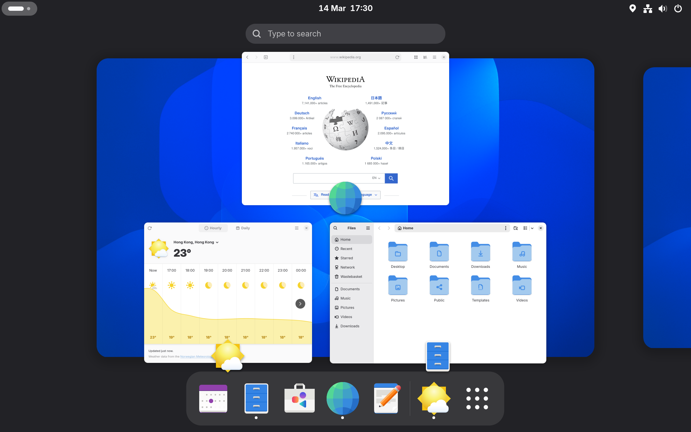
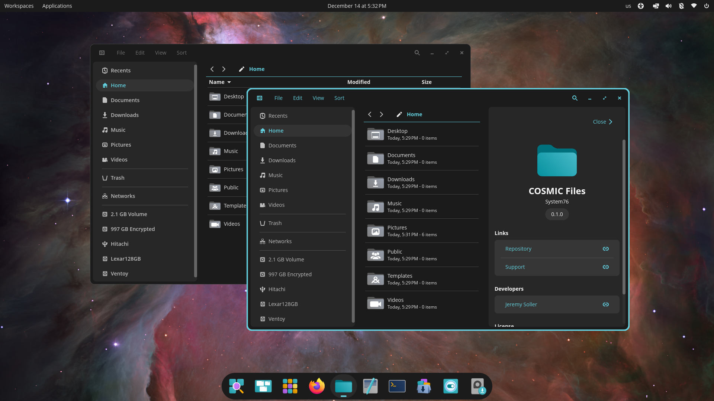
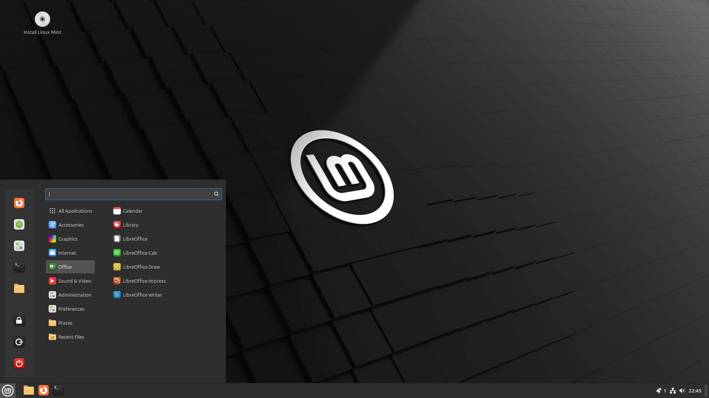
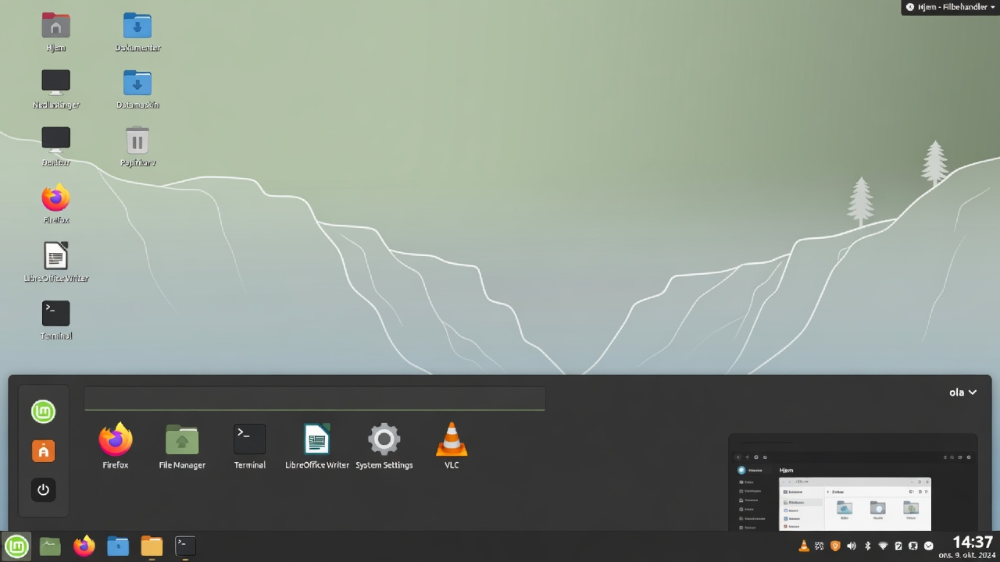
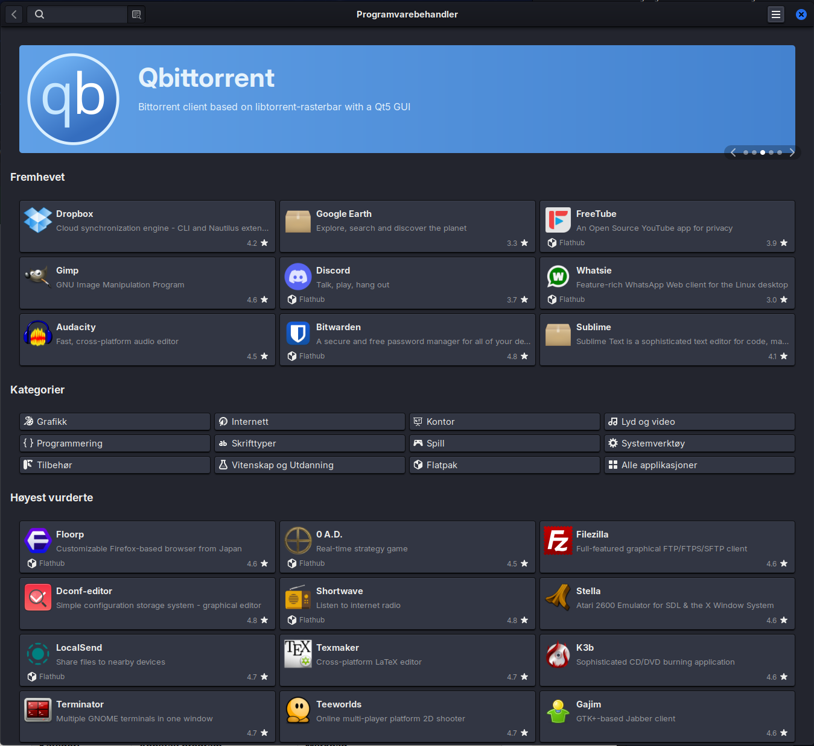
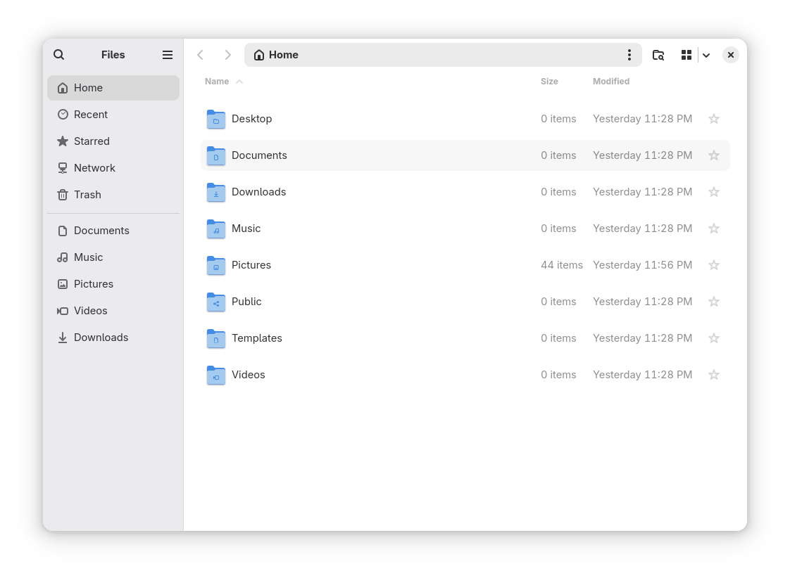
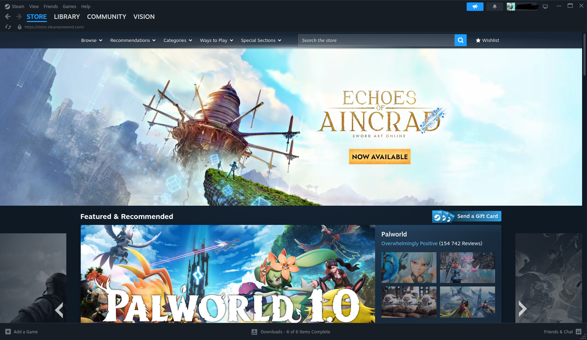

# Linux for Nybegynnere 2026

**En praktisk og vennlig guide for deg som vil bytte fra Windows til Linux.**

*Samlet utgave – alle kapitler i én fil. Generert 2026-08-02.*

## Innhold

- Forord
- 1. Innledning
- 2. Hva er egentlig Linux?
- 3. Hvilken Linux skal jeg velge?
- 4. Forberedelse og installasjon
- 5. Første gang du starter Linux
- 6. Daglig bruk
- 7. Terminalen
- 8. Vanlige problemer de første ukene
- 9. Tilpasning og finpuss
- 10. Sikkerhet, backup og gode vaner
- 11. Hva nå? Neste steg og ressurser
- Bonus: Ofte stilte spørsmål og myter om Linux
- Hurtigreferanse
- Ordliste


---

# Forord

Velkommen til *Linux for Nybegynnere 2026*.

Denne boken er skrevet for deg som har vurdert å bytte fra Windows til Linux, men som har vært litt usikker. Kanskje du har hørt at Linux er "vanskelig", "bare for programmerere", eller at "ingenting fungerer". Kanskje du har sett en venn bruke det og lurt på om det kan passe for deg også.

Jeg har skrevet denne boken fordi jeg tror at 2026 er et av de beste tidspunktene noensinne å bytte til Linux på. Maskinvaren støttes bedre enn før, spill fungerer overraskende bra, og de mest nybegynnervennlige distribusjonene har aldri vært mer polerte.

## Hvem er denne boken for?

Denne boken er for:

- Deg som er lei av reklame, sporing og unødvendige "funksjoner" i Windows
- Deg som vil ha et raskere og mer stabilt system på en eldre maskin
- Deg som er nysgjerrig og liker å forstå tingene du bruker
- Deg som vil ha et operativsystem som respekterer deg som bruker

Den er **ikke** skrevet for folk som allerede er erfarne Linux-brukere, eller for de som vil ha den mest tekniske og avanserte veiledningen. Det finnes masse andre bøker og ressurser for dem.

## Hvordan bruke denne boken

Du kan lese den fra perm til perm, men det er ikke nødvendig. De fleste kapitlene kan leses uavhengig av hverandre når du først har installert systemet.

De første fire kapitlene anbefaler jeg at du leser i rekkefølge:

1. Innledning (hvorfor du kanskje vil bytte)
2. Hva Linux egentlig er
3. Hvilken distribusjon du bør velge
4. Installasjon

Deretter kan du hoppe til de kapitlene som er mest relevante akkurat nå.

## Hva du kan forvente

Du vil lære nok til å:

- Installere Linux trygt (enten som dual boot eller alene)
- Bruke datamaskinen til dagligdagse ting
- Installere og bruke de programmene du trenger
- Løse de fleste vanlige problemene selv
- Tilpasse systemet slik at det føles som ditt eget

Du vil *ikke* lære alt. Det er heller ikke meningen. Linux er stort, og det er helt greit å lære ting etter hvert som du trenger dem.

## En liten oppfordring

Det beste rådet jeg kan gi deg er dette:

**Vær tålmodig med deg selv de første ukene.**

Alt vil føles litt annerledes. Noen ting vil være bedre. Noen ting vil være verre. Det er helt normalt. De fleste som har byttet til Linux sier at det tok mellom to og fire uker før det føltes helt naturlig.

Hvis noe ikke fungerer, pust rolig. Nesten alle problemer har en løsning, og det finnes et veldig hjelpsomt fellesskap der ute.

## Takk

Takk for at du har valgt å gi Linux en sjanse. Jeg håper denne boken gjør overgangen litt enklere og mye mer behagelig.

Lykke til!

— Forfatteren

---

# 1. Innledning – Hvorfor i det hele tatt bytte til Linux?

*Sist oppdatert: 2026-07-11*

**I dette kapittelet lærer du:**

- De vanligste grunnene til å bytte til Linux i 2026
- Hvorfor boken er skrevet for helt vanlige mennesker
- Hvordan boken er bygget opp og hvordan du får mest ut av den

---

### Innledning

Velkommen! Du har kanskje hørt om Linux før. Kanskje en venn har nevnt det, eller du har sett det nevnt i en YouTube-video. Kanskje du er lei av at Windows føles tregt, eller at du får stadig flere reklameinnslag i operativsystemet ditt. Uansett hvorfor du er her – du er på rett sted.

Denne boken er skrevet for deg som er nybegynner. Du trenger ikke å være teknisk. Du trenger ikke å kunne kode. Du trenger bare nysgjerrighet og litt tålmodighet.

## Hvorfor bytte i det hele tatt?

De fleste som bytter til Linux gjør det ikke fordi de "må". De gjør det fordi de oppdager at det finnes et bedre alternativ for dem.

Her er noen av de vanligste grunnene i 2026:

### 1. Personvern – du eier maskinen din

Windows samler mye data om deg. Microsoft vet hva du søker etter, hvilke apper du bruker, hvor lenge du bruker dem, og mye mer. I nyere versjoner av Windows har det kommet stadig flere funksjoner som "Recall" (som tar skjermbilder av alt du gjør) og integrasjon med Copilot som analyserer aktiviteten din.

Linux derimot er bygget på en helt annen filosofi: **Du eier maskinen din**. Ingen storbedrift sporer deg som standard. Ingen skjulte telemetri-tjenester som sender data hjem til selskapet uten at du vet om det.

### 2. Ingen reklame i operativsystemet

Har du lagt merke til at Windows 11 har stadig flere forslag, widgets, "anbefalte" apper og reklame i Start-menyen? Mange brukere opplever at operativsystemet selv begynner å føles som en reklameplattform.

Linux har ikke det. Skrivebordet ditt er ditt. Punktum. Ingen "Get Microsoft 365" som dukker opp hver gang du åpner et dokument. Ingen "Prøv Edge"-meldinger.

### 3. Det er gratis – og vil alltid være det

Du betaler ingenting for Linux. Ikke for selve systemet, ikke for oppdateringer, og ikke for de fleste programmene du trenger. Det er ingen "Pro"-versjon som plutselig dukker opp etter noen måneder, og ingen abonnement du må fornye.

Dette gjelder også de fleste programmene: LibreOffice, VLC, GIMP, Firefox – alt er gratis uten begrensninger.

### 4. Du lærer hvordan datamaskinen din faktisk fungerer

Med Windows blir du ofte behandlet som en passiv bruker. Du skal bare klikke på ting og håpe at det fungerer. Med Linux blir du invitert inn bak kulissene. Du lærer hvordan ting henger sammen. Det føles både befriende og nyttig – spesielt når noe går galt og du faktisk forstår hvorfor.

Mange som har brukt Linux en stund sier at de føler seg mer "i kontroll" over maskinen sin.

### 5. Motstand mot store tech-selskaper

Mange er lei av å være låst inn i økosystemer. Du skal ikke trenge å ha en Microsoft-konto for å bruke PC-en din. Du skal ikke bli presset til å bruke OneDrive eller Edge. Linux gir deg tilbake kontrollen.

Du bestemmer selv hvilke tjenester du vil bruke – og hvilke du ikke vil bruke.

### 6. Det er overraskende stabilt og lett

Mange som prøver Linux for første gang blir overrasket over hvor raskt og stabilt det føles – selv på eldre maskiner.

Ingen tvungne omstarter midt i arbeidet. Ingen "Oppdatering pågår, vennligst ikke slå av maskinen" når du skal rekke en deadline. Mange opplever at eldre bærbare som har blitt trege på Windows plutselig føles raske igjen.

### 7. Norske forhold fungerer godt

I 2026 fungerer de fleste norske tjenestene utmerket på Linux:

- BankID og BankID-appen (via nettleser eller app)
- Vipps
- Altinn
- NRK TV og NRK Radio
- DNB, Nordea, Sparebank1 nettbanking
- Posten, Bring, Vy, etc.

De fleste ting som er viktige i hverdagen i Norge fungerer uten problemer.

## "Men er ikke Linux bare for nerds?"

Dette er den største myten. For 15–20 år siden var det kanskje delvis sant. I 2026 er det ikke det.

I dag finnes det Linux-distribusjoner som er laget spesielt for folk som kommer fra Windows. De ser ut og føles nesten identisk med det du er vant til. Du kan bruke musen akkurat som før. Du kan ha flere vinduer åpne. Du kan installere apper med noen få klikk.

Du trenger ikke å bruke terminalen hvis du ikke vil (selv om det er gøy å lære seg litt etter hvert).

## Er Linux noe for deg? (ærlig sjekkliste)

Før du kaster deg ut i det, vær ærlig med deg selv:

**Linux passer ekstra godt hvis du:**

- Har en eldre PC som ikke støttes av Windows 11 lenger (Windows 10 mistet støtte i 2025)
- Er lei av reklame og sporing i operativsystemet
- Vil ha et stabilt og raskt system uten tvungne oppdateringer midt i arbeidet
- Bruker mest nettleser, kontor, musikk/video og norske tjenester som Vipps og BankID

**Vurder å vente hvis du:**

- Er helt avhengig av Adobe-pakken (Photoshop, Premiere) til jobb
- Spiller kun nyere multiplayer-spill med streng anti-cheat
- Har en helt splitter ny ARM-laptop (f.eks. nyeste Snapdragon eller Apple Silicon) og ikke vil risikere problemer

Hvis du er i tvil: Start med å prøve Linux fra en USB-pinne uten å installere noe. Da mister du ingenting.

## Personlige grunner – hva er dine?

Før du fortsetter, ta et øyeblikk og tenk:

- Hva irriterer deg mest med Windows akkurat nå?
- Hva håper du å få ut av å prøve Linux?
- Er det personvern? Hastighet? Kostnad? Nysgjerrighet? Mindre reklame?

Skriv det gjerne ned. Det vil hjelpe deg å holde motivasjonen oppe når ting føles litt uvant de første dagene.

Her er noen eksempler på hva andre har sagt:

> "Jeg var lei av at Windows 11 føltes som en reklameplattform."
> "Maskinen min fra 2018 ble så treg at jeg nesten kjøpte ny. Etter Linux Mint føles den rask igjen."
> "Jeg vil ikke at Microsoft skal vite alt jeg gjør på datamaskinen min."

**Norsk case:** Kari (62) fra Bergen hadde en 8 år gammel laptop som ble treig på Windows 10. Hun installerte Linux Mint med hjelp av barnebarnet. Nå bruker hun den til e-post, aviser, Vipps og NRK. "Den føles ny igjen, og jeg slipper alle de irriterende meldingene," sier hun.

## Hva du kan forvente av denne boken

Denne boken er ikke en tykk lærebok full av kommandoer. Den er en praktisk følgesvenn som tar deg gjennom hele reisen – fra valg av distribusjon til daglig bruk – slik forordet beskriver. Og viktigst av alt: Du vil lære at det er helt greit å ikke vite alt med en gang.

## Hvorfor mange angrer på at de ikke byttet tidligere

Etter noen uker eller måneder med Linux hører man ofte følgende:

- "Hvorfor føltes dette så skummelt før?"
- "Maskinen min har aldri vært så rask"
- "Jeg merker nesten ikke at jeg bruker et annet operativsystem lenger"
- "Jeg savner ingenting fra Windows bortsett fra et par programmer jeg har erstattet"

Overgangen er ofte mindre dramatisk enn folk frykter.

## En liten advarsel

Det vil være dager der ting ikke fungerer som forventet. Det er en del av prosessen. Forskjellen fra Windows er at når du først har lært hvordan du løser ting, føler du deg mye mer i stand til å håndtere fremtidige problemer selv.

## Klar for å starte?

Da setter vi i gang.

Neste kapittel handler om det mest grunnleggende: **Hva er egentlig Linux?** – forklart på en måte som alle kan forstå.

---

**Det viktigste fra dette kapittelet**

- Linux gir deg mer kontroll, bedre personvern og færre reklameinnslag enn Windows.
- Du kan ikke ta feil valg – alle anbefalte distribusjoner er gode for nybegynnere.
- Boken er laget for å være beroligende og praktisk – ta det i ditt eget tempo.

---

# 2. Hva er egentlig Linux? (enkelt forklart, uten teknisk tull)

**I dette kapittelet lærer du:**

- Forskjellen på Linux-kjernen, distribusjoner og skrivebordsmiljøer
- Hvorfor det finnes så mange ulike Linux-varianter
- Enkel metafor for å forstå hvordan Linux henger sammen

---

### Innledning

La oss starte med det viktigste: Linux er ikke ett enkelt program. Det er ikke "et alternativ til Windows" på samme måte som en app er et alternativ til en annen app.

Linux er en hel familie av operativsystemer.

## Den enkleste forklaringen

Tenk på det slik:

- **Windows** er et ferdig produkt laget av Microsoft. Du kjøper (eller får) hele pakken.
- **Linux** er som en motor som mange forskjellige produsenter bruker til å bygge sine egne biler.

Motoren (kjernen) kalles **Linux-kjernen**. Men det du faktisk bruker – det du ser på skjermen – er laget av mange forskjellige mennesker og organisasjoner rundt om i verden.

Når folk sier "jeg bruker Linux", mener de nesten alltid en hel pakke som kalles en **distribusjon** (eller "distro" for kort).

## Hva er en distribusjon?

En distribusjon er en komplett pakke som inneholder:

- Linux-kjernen (motoren)
- Et skrivebordsmiljø (det du ser og klikker på)
- Programmer og verktøy
- Installasjonsprogram
- Oppdateringssystem
- Utseende og innstillinger

Eksempler på populære distribusjoner i 2026:

- Linux Mint
- Ubuntu
- Pop!_OS
- Zorin OS
- Fedora
- Debian

Alle bruker den samme Linux-kjernen, men de er satt sammen på forskjellige måter – akkurat som ulike bilmerker kan bruke samme motor, men ha forskjellig karosseri, interiør og kjørefølelse.

## Hvorfor finnes det så mange?

Fordi folk har forskjellige behov og preferanser:

- Noen vil ha noe som ligner mest mulig på Windows
- Noen vil ha noe som er veldig moderne og minimalistisk
- Noen vil ha maksimal stabilitet
- Noen vil ha det nyeste av det nyeste

Det fine er at du kan prøve flere uten å ødelegge noe. De fleste distribusjoner kan kjøres direkte fra en USB-pinne før du installerer dem.

## Open Source – hva betyr det egentlig?

Linux er **åpen kildekode** (open source). Det betyr at alle kan se hvordan det er laget, endre det, og dele endringene sine.

Hvorfor er dette viktig for deg som nybegynner?

- Tusenvis av mennesker jobber med å forbedre det hele tiden
- Det er ingen skjult agenda eller reklame
- Hvis noe er galt, kan hvem som helst fikse det (og mange gjør det)
- Det er ekstremt vanskelig å putte skadelig programvare inn i systemet uten at noen oppdager det

Open source betyr ikke at det er ustabilt eller "amatørmessig". Tvert imot: Mye av internett, supermaskiner, telefoner (Android) og til og med mange biler kjører på Linux.

## Skrivebordsmiljøer – det du ser og klikker på

Når du installerer Linux, velger du ofte også et **skrivebordsmiljø**. Dette er det visuelle laget – hvordan vinduer ser ut, hvordan oppgavelinjen fungerer, hvordan du bytter mellom apper.

Noen populære:

- **Cinnamon** – Klassisk og Windows-lignende (brukes i Linux Mint)
- **GNOME** – Moderne og ryddig (brukes i Ubuntu)
- **COSMIC** – Nytt og raskt, laget av System76 (brukes i Pop!_OS)
- **KDE Plasma** – Svært tilpasningsdyktig, kan se ut som nesten hva som helst
- **XFCE** – Lett og raskt, bra på eldre maskiner

Slik kan to av dem se ut – samme Linux, helt forskjellig interiør:





Du kan bytte skrivebordsmiljø senere hvis du vil – det er en av de kuleste tingene med Linux.

## Kort oppsummert

- Linux = kjernen (motoren)
- Distribusjon = hele bilen (det du installerer og bruker)
- Skrivebordsmiljø = interiøret og dashbordet

Du trenger ikke å huske alt dette akkurat nå. Det viktigste å ta med seg er:

**Linux er ikke ett ting. Det er mange forskjellige måter å kjøre datamaskinen din på – og du kan velge den som passer deg best.**

## Prøv selv

Neste gang du ser en omtale av Linux på nettet eller YouTube: prøv å finne ut hvilken distribusjon og hvilket skrivebordsmiljø det handler om. Nå kan du nemlig skille motoren (kjernen), bilen (distribusjonen) og interiøret (skrivebordsmiljøet) fra hverandre – og det er mer enn de fleste kan.

## Hva skjer videre?

I neste kapittel skal vi se på de beste distribusjonene for nybegynnere i 2026, og hjelpe deg å velge den rette.

---

**Det viktigste fra dette kapittelet**

- Linux er ikke ett program, men en hel familie av operativsystemer (distribusjoner).
- Du velger distribusjon og skrivebordsmiljø – akkurat som å velge bilmerke og interiør.
- Du trenger ikke huske alt teknisk – det viktigste er å velge noe som føles kjent.

---

# 3. Hvilken Linux skal jeg velge?

*Sist oppdatert: 2026-07-11*

**I dette kapittelet lærer du:**

- De fire beste distribusjonene for nybegynnere i 2026
- Fordeler og ulemper ved hver av dem
- En klar anbefaling basert på din situasjon

---

Dette er et av de vanligste spørsmålene – og det er helt forståelig. Det finnes hundrevis av distribusjoner, og det kan føles overveldende.

Den gode nyheten: For de fleste nybegynnere i 2026 finnes det egentlig bare noen få gode alternativer å vurdere.

Her er mine klare anbefalinger, rangert etter hvem de passer best for.

## 1. Linux Mint – Det tryggeste valget for de fleste

**Best for:** De fleste som kommer rett fra Windows og vil ha minst mulig sjokk.

Linux Mint er kjent for å være det mest "Windows-lignende" alternativet. Det bruker Cinnamon-skrivebordet som har en klassisk oppgavelinje nederst, en Start-meny, og støtte for mapper på skrivebordet.


**Fordeler:**

- Ser og føles kjent
- Svært stabilt
- Inneholder det meste du trenger fra starten av
- Veldig bra dokumentasjon og fellesskap
- Lett å installere drivere og multimedia-kodeker
- Oppdateringer er konservative og trygge

**Ulemper:**

- Ser litt "tradisjonell" ut (noen synes det er kjedelig)
- Ikke alltid det aller nyeste av programvare

**Anbefales hvis:** Du vil ha noe som "bare funker" og minner mest mulig om Windows 10/11.

Mange nordmenn begynner med Linux Mint Cinnamon.

## 2. Zorin OS – Når du vil ha det aller mest Windows-aktige

**Best for:** De som er redde for endring og vil ha noe som ligner Windows 11 mest mulig.

Zorin OS er bygget på Ubuntu, men er designet for å føles kjent for Windows-brukere. Den har flere forskjellige "utseender" du kan bytte mellom – inkludert et som ligner veldig på Windows 11.

**Fordeler:**

- Kan se ut som Windows 11, Windows 10 eller macOS
- Svært nybegynnervennlig
- God støtte for Windows-programmer via Wine/Bottles

**Ulemper:**

- Litt mer "ferdigpakket" enn andre
- Fellesskapet er mindre enn Mint og Ubuntu

**Anbefales hvis:** Du vil ha minst mulig "nytt" å forholde deg til visuelt.

## 3. Pop!_OS – Utmerket for nyere maskiner og gaming

**Best for:** Deg som har en relativt ny PC, kanskje med NVIDIA-grafikkort, eller som er interessert i gaming.

Pop!_OS lages av System76 (et selskap som selger Linux-PC-er). Det er basert på Ubuntu, men har mange forbedringer – spesielt når det gjelder grafikk, drivere og produktivitet.

Siden versjon 24.04 har Pop!_OS sitt eget skrivebordsmiljø, **COSMIC**, som System76 har bygget helt fra bunnen av i programmeringsspråket Rust – det gjør det raskt og moderne. COSMIC ble lansert som stabilt i slutten av 2025 og er trygt for daglig bruk, men er fortsatt et ungt prosjekt under aktiv utvikling. Det skiller seg fra GNOME og Cinnamon ved innebygd **vindusflislegging** (automatisk organisering av vinduer) og et fleksibelt panel-system – en av grunnene til at mange velger nettopp Pop.


**Fordeler:**

- Ekstremt god støtte for NVIDIA og ny maskinvare
- Fantastiske veiledninger og videoer
- Innebygd støtte for Flatpak
- Veldig bra for gaming (Steam + Proton)
- Ren og moderne utseende

**Ulemper:**

- COSMIC-skrivebordet er nytt og kan føles litt annerledes enn Windows
- Litt mer "moderne" enn Mint

**Anbefales hvis:** Du har ny maskin, gamer, eller liker et ryddig og moderne utseende.

## 4. Ubuntu – Det mest brukte alternativet

**Best for:** Deg som vil ha det største fellesskapet og mest mulig dokumentasjon.

Ubuntu er den mest kjente og mest brukte Linux-distribusjonen i verden. Nesten alt du finner av veiledninger på internett fungerer på Ubuntu.

**Fordeler:**

- Størst fellesskap
- Mest støtte fra programvareutviklere
- Svært mange guider og videoer
- Langsiktig støtte (LTS-versjoner)

**Ulemper:**

- Har blitt litt mer "moderne" de siste årene
- Noen synes Canonical legger til for mye "egne ting"

**Anbefales hvis:** Du vil ha det "tryggeste" valget i betydningen "alle andre bruker dette også".

## Kort sammenligning (2026)

| Distribusjon   | Windows-lignende | Ny maskin/gaming | Størst fellesskap | Lett å komme i gang | Anbefalt for                  |
|----------------|------------------|------------------|-------------------|---------------------|-------------------------------|
| Linux Mint     | ★★★★★           | ★★★             | ★★★★             | ★★★★★              | De fleste                     |
| Zorin OS       | ★★★★★           | ★★★             | ★★★              | ★★★★★              | De som er redde for endring   |
| Pop!_OS        | ★★★             | ★★★★★           | ★★★★             | ★★★★               | Ny maskin + gaming            |
| Ubuntu         | ★★★             | ★★★★            | ★★★★★            | ★★★★               | De som vil ha mest støtte     |

## Mitt råd til deg

- **Har du aldri brukt Linux før?** → Start med **Linux Mint** eller **Zorin OS**.
- **Har du en nyere PC eller gamer?** → Gå for **Pop!_OS**.
- **Vil du ha det mest populære?** → Velg **Ubuntu**.

Du kan ikke ta feil valg her. Alle disse fire er utmerkede for nybegynnere.

## Hvordan teste før du bestemmer deg?

De fleste distribusjoner har en "Try" eller "Live" modus:

1. Last ned .iso-filen fra den offisielle nettsiden (og velger du Pop!_OS, trenger du ikke lete etter noen LTS-knapp – Pop!_OS har bare én aktuell utgave, ta den)
2. Lag en bootbar USB (vi går gjennom dette i neste kapittel)
3. Start PC-en fra USB-en
4. Prøv systemet uten å installere det

Du kan surfe på nettet, åpne filer, teste programvare – alt uten å endre noe på harddisken din.

Dette er den beste måten å finne ut om en distribusjon føles riktig for deg.

## Andre distribusjoner (bare hvis du blir nysgjerrig senere)

- **Fedora** – Moderne og "ren", bra for utviklere
- **Debian** – Ekstremt stabil, men litt mer konservativ
- **Manjaro** eller **EndeavourOS** – Basert på Arch (mer avansert)
- **Bazzite** eller **Nobara** – Bygget spesielt for gaming; verdt en titt hvis spill er hovedprioriteten din

For nybegynnere anbefaler jeg at du holder deg til de fire jeg nevnte øverst.

## Neste steg

Nå som du har en idé om hvilken distribusjon du vil prøve, skal vi gå gjennom hvordan du forbereder installasjonen på en trygg måte.

---

**Det viktigste fra dette kapittelet**

- De fleste bør starte med Linux Mint eller Zorin OS.
- Har du ny maskin eller gamer? Velg Pop!_OS.
- Du kan ikke ta feil valg – alle anbefalte alternativer er trygge.

---

# 4. Forberedelse og installasjon

*Sist oppdatert: 2026-07-11*

**I dette kapittelet lærer du:**

- Hvordan ta sikker backup før installasjon
- Hvordan lage en bootbar USB med Rufus
- Forskjellen på dual boot og full erstatning
- Steg-for-steg installasjon med vanlige fallgruver

---

Dette er det kapittelet de fleste er litt nervøse for. Det er helt normalt.

Den gode nyheten er at installasjon av Linux i dag er mye enklere enn de fleste tror – spesielt hvis du følger stegene nøye. Vi skal ta det rolig og trygt.

## Hva du bør ha klart før du begynner

- Ekstern harddisk eller stor USB for backup
- Notat med hvilke programmer du bruker mest i dag
- Passordene dine (eller passordbehandler eksportert)
- Litt tid (sett av 1–2 timer første gang)
- En kopp kaffe eller te

## Først: Ta backup! (Viktigst av alt)

Dette kan ikke sies ofte nok:

**Ta backup av viktige filer før du begynner.**

Selv om du bare skal prøve Linux fra en USB først, er det lurt å ha en kopi av:

- Dokumenter og prosjekter
- Bilder og videoer
- Passord (bruk en passordbehandler som Bitwarden eller KeePassXC!)
- E-postinnstillinger og viktige e-poster
- Nedlastinger du vil beholde
- Eventuelle viktige programmer du har kjøpt (lisensnøkler)

Den enkleste måten er å kopiere alt viktig til en ekstern harddisk eller en stor USB-pinne. Du kan også bruke OneDrive, Google Drive, Proton Drive eller iCloud som midlertidig backup.

**Pro tips:** 

- Ta backup av mapper som "Dokumenter", "Bilder", "Nedlastinger" og "Skrivebord".
- Eksporter passordene dine fra nettleseren til en fil (du kan importere dem igjen senere).
- Noter deg hvilke programmer du bruker mest, så du vet hva du skal installere på Linux.

### Slik flytter du filene dine fra Windows (steg for steg)

Når Linux er installert:

1. Koble til den eksterne harddisken eller USB-en du brukte til backup.
2. Åpne filbehandleren (Nemo i Mint).
3. Finn den eksterne disken i venstre side (ofte under "Andre steder").
4. Kopier mappene dine til "Dokumenter", "Bilder" osv. i Linux.
5. Åpne Firefox → Innstillinger → Personvern og sikkerhet → Bokmerker → Importer bokmerker og passord.

Dette er ofte den første oppgaven folk gjør etter installasjon. Ta deg god tid her.

## Velg distribusjon og last ned

Gå til den offisielle nettsiden for distribusjonen du har valgt:

- **Linux Mint**: [https://linuxmint.com](https://linuxmint.com) (direkte nedlasting: [https://linuxmint.com/download.php](https://linuxmint.com/download.php))
- **Zorin OS**: [https://zorin.com/os](https://zorin.com/os) (nedlasting: [https://zorin.com/os/download/](https://zorin.com/os/download/))
- **Pop!_OS**: [https://system76.com/pop](https://system76.com/pop)
- **Ubuntu**: [https://ubuntu.com/download/desktop](https://ubuntu.com/download/desktop)

Last ned den nyeste **LTS**-versjonen (Long Term Support). Det er den mest stabile utgaven som får oppdateringer i mange år (vanligvis 5 år).

Filen du laster ned heter vanligvis noe som `linuxmint-22-cinnamon-64bit.iso` eller lignende. Dette kalles en **ISO-fil**.

**Viktig:** Last alltid ned fra den offisielle nettsiden. Unngå tilfeldige nedlastingssider.

🟡 Valgfritt: Verifiser nedlastingen med sjekksum (anbefales hvis du er ekstra forsiktig). På Linux Mint-siden finner du SHA256-verdien. Etter nedlasting:

```bash
sha256sum linuxmint-*.iso
```

Sammenlign tallet med det som står på nettsiden. Hvis det matcher, er filen ekte og uendret.

## Lag en bootbar USB-pinne

Dette er det viktigste steget for å installere Linux.

Du trenger:

- En USB-pinne på minst 8 GB (helst 16 GB eller mer). Alt på den vil bli slettet.
- Et program som kan lage en "bootbar" USB.

### Anbefalte programmer (2026)

**Hvis du fortsatt er på Windows:**

- **Rufus** (gratis, populært og enkelt) – [https://rufus.ie](https://rufus.ie)
- **balenaEtcher** – [https://www.balena.io/etcher](https://www.balena.io/etcher) (veldig brukervennlig)
- **Ventoy** (avansert, men veldig praktisk – kan ha flere ISO-filer på samme pinne)

**Hvis du allerede er på Linux:**

- Bruk `dd`-kommandoen eller verktøy som `gnome-disks` / balenaEtcher.

### Slik lager du bootbar USB med Rufus (enklest for de fleste):

1. Last ned og åpne Rufus (trenger ikke installasjon).
2. Sett inn USB-pinnen.
3. I Rufus:
   - Velg USB-pinnen under "Device"
   - Klikk på pilen ved "Boot selection" og velg ISO-filen du lastet ned
   - La resten stå på standardinnstillinger. Rufus foreslår vanligvis det riktige for din maskin (GPT + UEFI på moderne PC-er).
4. Klikk **Start**.


Vent til prosessen er ferdig. Det kan ta 5–15 minutter avhengig av USB-pinnen din.

> **Viktig:** Alt på USB-pinnen vil bli slettet. Ta backup hvis det er noe der fra før.

Etter at USB-en er ferdig, kan du la den stå i maskinen.

## Ekstra tips for en vellykket installasjon

### Velg riktig USB-pinne
Bruk en USB 3.0 eller nyere hvis mulig. Eldre USB 2.0-pinner er tregere, men fungerer fortsatt.

### Lagre nedlastingslenken
Det er lurt å notere deg hvor du lastet ned ISO-filen fra, slik at du kan laste ned ny versjon senere hvis du trenger den.

### Lag flere USB-pinner
Mange lager en ekstra "rednings-USB" med samme distribusjon. Da har du alltid en måte å starte maskinen på hvis noe går galt.

### Prøv "Try before install" grundig
Bruk minst 15–30 minutter i Live-modus før du installerer. Test:
- WiFi
- Lyd (spill av en YouTube-video)
- Skjermoppløsning
- Berøringsskjerm hvis du har det
- Ekstern skjerm hvis du bruker det

### Partisjonering for viderekomne (valgfritt) 🔴 Avansert – hopp gjerne over
Hvis du velger "Noe annet" under installasjon, kan du manuelt lage partisjoner. En vanlig oppsett er:
- `/` (root) – 30–50 GB
- `/home` – resten av plassen (dine personlige filer)
- swap – 4–8 GB (avhengig av hvor mye RAM du har)


For nybegynnere anbefales det å la installasjonsprogrammet håndtere partisjoneringen.

## Dual boot eller erstatt Windows helt?

Nå kommer et viktig valg.

### Dual boot (anbefalt for de fleste nybegynnere)

Du beholder Windows, og kan velge hvilket operativsystem du vil starte når du skrur på PC-en.

**Fordeler:**

- Du kan gå tilbake til Windows når som helst
- Trygt å eksperimentere
- Perfekt hvis du er usikker eller trenger Windows til noe spesifikt (f.eks. visse programmer eller spill)

**Ulemper:**

- Tar plass på harddisken (du må dele opp disken)
- Litt mer komplisert å sette opp
- Noen ganger kan Windows-oppdateringer rote til bootloaderen (men dette er sjeldent i 2026)

### Erstatt Windows helt

Du sletter Windows og har bare Linux.

**Fordeler:**

- Ren og ryddig installasjon
- Hele disken tilgjengelig for Linux
- Ingen konflikter med Windows

**Ulemper:**

- Du mister Windows (må reinstallere senere hvis du angrer)
- Mer risikabelt hvis du ikke er sikker

**Mitt råd:** Start med **dual boot**. Du kan alltid slette Windows senere når du er komfortabel med Linux.

## Steg-for-steg installasjon (Linux Mint som eksempel)

Hver distribusjon har litt forskjellige installatører, men prinsippet er det samme. Her bruker vi Linux Mint som eksempel – prosessen er veldig lik i Zorin OS, Pop!_OS og Ubuntu.

### 1. Start fra USB-en

- Sett inn USB-pinnen
- Start PC-en på nytt
- Trykk gjentatte ganger på en tast for å komme til oppstartsmenyen. Vanlige taster:
  - **F12** (Dell, mange andre)
  - **F10** eller **Esc** (HP)
  - **F2** eller **Del** (noen andre merker)
  - Prøv **Esc** først – mange maskiner viser en meny der

- Velg USB-pinnen fra listen (ofte står det "UEFI: USB" eller bare navnet på USB-pinnen)


**Tips hvis det ikke fungerer:**

- Gå inn i BIOS/UEFI (vanligvis Del, F2 eller F10 mens maskinen starter)
- Slå på "Boot from USB" hvis det er av
- Prøv å slå av "Secure Boot" midlertidig (se egen forklaring under)
- Prøv en annen USB-port (helst en USB 2.0-port hvis du har)

### Secure Boot – hva er det og hvordan håndterer du det?

**Hva er Secure Boot?**
Secure Boot er en sikkerhetsfunksjon i de fleste PC-er fra 2012 og fremover. Den sjekker at operativsystemet som starter er "signert" av en godkjent nøkkel. Dette hindrer skadelig programvare i å starte før operativsystemet.

**Hvorfor må jeg kanskje slå det av for å installere Linux?**
Enkelte Linux-distribusjoner har ikke signerte drivere for all maskinvare (spesielt NVIDIA-grafikk og enkelte WiFi-kort). Derfor kan PC-en nekte å starte fra USB-pinnen med mindre Secure Boot er av.

**Slik slår du Secure Boot av (og på igjen):**

1. Start PC-en og trykk på **F2**, **Del**, **F10** eller **Esc** (avhengig av merke) for å gå inn i BIOS/UEFI.
2. Finn fanen **Security** eller **Boot**.
3. Finn **Secure Boot** og sett den til **Disabled**.
4. Lagre og avslutt (vanligvis **F10**).

**Etter installasjon:**
De fleste moderne distribusjoner (Ubuntu, Linux Mint, Pop!_OS og Zorin OS i nyere versjoner) **støtter Secure Boot** med signerte kjerner. Du kan derfor slå Secure Boot på igjen etter installasjon: gå tilbake til BIOS/UEFI og sett Secure Boot til **Enabled**. Starter ikke maskinen da, er det bare å slå den av igjen – ingenting blir ødelagt.

> **Merk:** Hvis du bruker NVIDIA sine proprietære drivere, kan Secure Boot skape trøbbel. Da må du enten beholde Secure Boot av, eller signere driverne selv (🔴 avansert – ikke anbefalt for nybegynnere).

### 2. Velg "Start Linux Mint" (Live-modus)

Du kommer inn i et levende system. Ingenting er installert ennå. Du kan teste alt.



Bruk denne muligheten til å:
- Sjekke at WiFi fungerer
- Teste lyd
- Se hvordan mus og tastatur oppfører seg
- Åpne nettleseren og surfe litt

Hvis alt føles greit, dobbeltklikk på "Install Linux Mint" på skrivebordet.

### 3. Følg installasjonsveiviseren

1. **Språk** — Velg **Norsk bokmål** (eller nynorsk hvis du foretrekker det).
2. **Tastatur** — Velg norsk tastaturoppsett.
3. **Tilkobling** — Koble til WiFi. Dette er viktig for å laste ned oppdateringer under installasjonen.
4. **Multimedia-kodeker** — Huk av for «Install multimedia codecs» når installereren spør. Da spiller video og musikk uten videre.
5. **Installasjonstype** (det viktigste steget!):

   Her må du velge forsiktig:

   - **"Installer Linux Mint ved siden av Windows"** eller lignende → Dual boot (anbefalt)
   - **"Slett disk og installer Linux Mint"** → Erstatt alt

   Se nøye på oversikten. Den viser harddiskene dine. Pass på at du ikke velger feil disk hvis du har flere.

   

6. **Tidssone** — Velg Oslo eller din by.
7. **Brukerkonto**
   - Skriv inn fullt navn
   - Velg et brukernavn (vanligvis små bokstaver uten æøå)
   - Lag et sterkt passord
   - Velg om du vil logge inn automatisk eller kreve passord (jeg anbefaler passord)

8. **Start installasjonen**
   - Klikk "Installer". Dette kan ta 10–40 minutter avhengig av maskinen.


9. **Ferdig**
   - Når installasjonen er ferdig, blir du bedt om å starte på nytt.
   - **Ta ut USB-pinnen** før du starter på nytt.

## Ofte stilte spørsmål under installasjon

**"Hva betyr 'Slett disk og installer'?"**
Det betyr at hele harddisken blir slettet og bare Linux blir installert.

**"Kan jeg installere på en ekstern harddisk?"**
Ja, men det er ikke anbefalt for daglig bruk. Hastigheten blir lavere.

**"Hva hvis jeg har flere harddisker?"**
Vær ekstremt forsiktig. Velg riktig disk i installasjonsprogrammet. Se på størrelse og navn.

**"Må jeg slå av Secure Boot permanent?"**
Ofte ikke. Prøv å slå den på igjen etter installasjon. De fleste moderne distribusjoner støtter Secure Boot.

## Vanlige feil å unngå under installasjon

1. **Ikke fortsett hvis du er usikker på hvilken disk som blir brukt.** Gå tilbake og dobbeltsjekk.
2. **Ikke fjern USB-pinnen for tidlig.** Vent til installasjonsprogrammet sier at det er trygt.
3. **Ikke hopp over oppdateringer etter installasjon.** De første oppdateringene er ofte viktige.
4. **Ikke installer for mange ting de første dagene.** La systemet stabilisere seg først.

## Første omstart – GRUB-menyen

Når PC-en starter på nytt, vil du se en meny som heter **GRUB**. Her kan du velge:

- Linux (vanligvis øverst eller "Linux Mint")
- Windows Boot Manager

Bruk piltastene og Enter for å velge.

Linux står øverst og starter automatisk etter noen sekunder hvis du ikke velger noe. Standardvalget kan endres senere i innstillingene.

## Vanlige problemer under installasjon

- **Kan ikke starte fra USB**: Se tipsene over om BIOS/UEFI og Secure Boot.
- **Svart skjerm etter valg av USB**: Prøv en annen USB-port, eller legg til `nomodeset` i oppstartsparametrene (avansert).
- **Ingen WiFi i live-modus**: Noen ganger må du installere drivere etter installasjon (se kapittel 8).
- **Feilmelding om partisjonering**: Ikke få panikk. Du kan gå tilbake og velge igjen. Aldri fortsett hvis du er usikker på hvilken disk som blir slettet.

## Etter installasjonen – første ting å gjøre

1. La systemet laste ned alle oppdateringer.
2. Start på nytt.
3. Sett opp Flatpak (hvis ikke allerede på plass):

```bash
sudo apt install flatpak
flatpak remote-add --if-not-exists flathub https://flathub.org/repo/flathub.flatpakrepo
```

(På Ubuntu vises ikke Flatpak-apper i programvaresenteret uten pakken `gnome-software-plugin-flatpak` – installer den med `sudo apt install gnome-software-plugin-flatpak`.)

4. Installer **Timeshift** (system-snapshots):

```bash
sudo apt install timeshift
```

5. Ta ditt første system-snapshot (anbefales sterkt!).

## Etter installasjonen – de første 48 timene

1. Installer alle oppdateringer og start på nytt
2. Installer Timeshift og ta første snapshot
3. Installer de 5–6 programmene du bruker mest
4. Test at alt du trenger til daglig fungerer (spesielt norske tjenester)
5. Ta en ny backup av viktige filer til ekstern disk

Hvis alt dette fungerer, har du kommet godt i gang.

## Gratulerer!

Du har nå installert Linux. Neste kapittel handler om hva du ser når du logger inn for første gang.

**Det viktigste fra dette kapittelet**

- Ta alltid backup før du begynner.
- Prøv Linux fra USB først (Live-modus) – det er trygt.
- Velg dual boot hvis du er usikker.
- Installer Timeshift og ta første snapshot umiddelbart etter installasjon.
- Ha mobilen klar som støtte under installasjonen.

---

# 5. Første gang du starter Linux

**I dette kapittelet lærer du:**

- Hvordan skrivebordet ser ut og fungerer
- Hvordan finne og installere programmer
- Grunnleggende navigasjon og oppdateringer

---

Gratulerer! Du har nå startet Linux for første gang. La oss se på hvordan ting fungerer.

## Skrivebordet – førsteinntrykket

Når du logger inn, ser du noe som ligner et vanlig skrivebord, men med noen forskjeller avhengig av hvilken distribusjon du valgte.

### Typiske elementer:

**Oppgavelinje / Panel**

- Vanligvis nederst (Linux Mint Cinnamon) eller øverst (Ubuntu GNOME, Pop!_OS)
- Viser åpne vinduer
- Har en "Start-meny" eller "Activities" / "Oversikt"

**Skrivebordet**

- Kan ha ikoner (avhengig av distribusjon)
- Høyreklikk for alternativer (bakgrunn, innstillinger, etc.)

**Systemstatus**

- Klokke
- WiFi, lyd, batteri, oppdateringer
- Brukermeny (avlogging, avslutning, innstillinger)



## Viktige forskjeller fra Windows

- **Super-tasten** (Windows-tasten) åpner ofte oversikten eller startmenyen.
- Høyreklikk er fortsatt din beste venn.
- Det finnes ingen "Kontrollpanel" som heter det – alt ligger i **Innstillinger**.
- Lukk-, minimer- og maksimer-knappene er vanligvis øverst til høyre (noen distribusjoner har dem til venstre).
- Du kan ha flere arbeidsområder (virtuelle skrivebord) – veldig nyttig!

### Windows → Linux: hva heter tingene?

| Windows | Linux |
|---------|-------|
| Programmer og funksjoner | Programvaresenter |
| Kontrollpanel | Innstillinger |
| Oppgavebehandling | Systemovervåker (eller `htop` i terminalen) |
| Filutforsker | Filbehandler (Nemo, Nautilus, Dolphin) |
| C:\ | `/` (roten av filsystemet) |
| C:\Users\brukernavn | `/home/brukernavn` |
| .exe-filer | .deb, Flatpak eller AppImage |
| MS Office | LibreOffice |
| Paint | Pinta |
| Notepad | Tekstredigerer (Gedit, Kate, Xed) |

## Hvordan finne og installere programmer

Dette er en av de største forskjellene fra Windows – og en av de beste.

I stedet for å gå til nettsider og laste ned .exe-filer, har Linux et innebygd **programvarelager** (repository).

### To hovedmåter å installere programmer på:

1. **Programvaresenter / Software Center / Discover**
2. **Flatpak** (moderne og anbefalt metode i 2026)

### Programvaresenteret

Avhengig av distribusjon har det forskjellige navn:

- **Linux Mint**: "Programvaresenter"
- **Pop!_OS / Ubuntu**: "Ubuntu Software" eller "App Center"
- **Zorin OS**: "Software"

Slik fungerer det vanligvis:

1. Åpne Programvaresenteret fra startmenyen eller oppgavelinjen.
2. Søk etter programmet du vil ha (f.eks. "VLC", "GIMP", "Firefox").
3. Klikk **Installer**.

Programmet installeres automatisk, inkludert alle avhengigheter.



### Flatpak – den moderne måten

Flatpak er en nyere teknologi som gjør at programmer kjører likt på alle Linux-distribusjoner. Fordelene:

- Alltid nyeste versjon
- Bedre sikkerhet (programmer er isolert)
- Fungerer på tvers av distribusjoner

Mange distribusjoner har Flatpak støtte innebygd.

### Alle metodene i én oversikt 🟡 Valgfritt

Du kommer til å møte flere begreper for å installere programmer. Her er hele bildet, så du kjenner igjen navnene:

| Metode | Hva det er | Fordeler | Ulemper |
|--------|-------------|----------|---------|
| **Programvaresenter** | Grafisk «app-butikk» | Enkelt, trygt, krever ingen kunnskap | Kan ha eldre versjoner |
| **apt** | Kommandolinje-verktøy (Debian/Ubuntu-familien) | Raskt, offisielle pakker | Krever terminal |
| **Flatpak** | Moderne, isolerte apper fra Flathub | Alltid nyeste versjon, trygt, fungerer på alle distroer | Bruker mer diskplass |
| **Snap** | Canonical (Ubuntu) sitt alternativ til Flatpak | Enkelt, godt integrert i Ubuntu | Omdiskutert – lukket baksystem, tregere oppstart |
| **AppImage** | Én fil – last ned og kjør | Ingen installasjon, bærbart | Ingen automatiske oppdateringer |

**Anbefaling for nybegynnere:**

- Bruk **Programvaresenteret** for de fleste apper.
- Velg **Flatpak**-versjonen når det er mulig (ofte merket «Flathub» i Programvaresenteret).
- **Snap** møter du mest på Ubuntu – der er den standard, og programvaresenteret gir deg gjerne Snap-versjonen uansett. Det fungerer helt fint, og du kan fint bruke Flatpak i tillegg. Utenfor Ubuntu er Flatpak det vanlige valget.
- **AppImage** er greit for enkeltprogrammer du bare vil teste.

## Viktige programmer du bør installere med en gang

Her er noen anbefalinger for nybegynnere:

| Kategori          | Anbefalt program              | Merknad                              |
|-------------------|-------------------------------|--------------------------------------|
| Nettleser         | Firefox eller Chromium        | Ofte forhåndsinstallert              |
| Kontor            | LibreOffice                   | Gratis og veldig bra                 |
| Bilder            | GIMP eller Shotwell           | GIMP for avansert                    |
| Video             | VLC                           | Spiller nesten alt                   |
| Musikk            | Spotify eller Lollypop        | -                                    |
| E-post            | Thunderbird                   | Svært bra                            |
| Passord           | KeePassXC eller Bitwarden     | Anbefales sterkt                     |
| Skjermklipp       | Flameshot                     | Mye bedre enn standard               |
| System-backup     | Timeshift                     | Viktig! Installer tidlig             |

## Oppdateringer

Linux oppdaterer seg selv mye mer sømløst enn Windows.

Du vil se et ikon for oppdateringer i oppgavelinjen. Klikk på det og installer oppdateringer regelmessig.

I begynnelsen kan det komme mange oppdateringer – det er helt normalt.

**Anbefalt rutine:**

1. Åpne Programvaresenter eller bruk terminal
2. Installer alle oppdateringer
3. Start på nytt hvis det blir bedt om det

Kapittel 10 samler hele den anbefalte vedlikeholdsrutinen (oppdateringer, Timeshift og backup) på ett sted.

## Arbeidsområder (virtuelle skrivebord)

En av de kuleste funksjonene i Linux:

- Du kan ha flere "skrivebord" samtidig
- Bytt med Super + Page Up/Down eller Super + tall
- Flytt vinduer mellom arbeidsområder
- Perfekt for å skille jobb og privat, eller ulike prosjekter

## Avslutte og starte på nytt

- Klikk på av/på-ikonet eller brukermenyen
- Velg "Avslutt", "Start på nytt" eller "Logg ut"

De fleste distribusjoner spør ikke "Hvorfor avslutter du?" som Windows gjør.

## Tips for de første timene

- Klikk deg rundt. Det er vanskelig å ødelegge noe når du bare klikker.
- Høyreklikk overalt – du blir overrasket over hvor mange alternativer som dukker opp.
- Ikke vær redd for å lukke vinduer eller flytte ting rundt.
- Alt du installerer kan du også avinstallere like lett.
- Prøv å lage et nytt arbeidsområde og flytt noen vinduer dit.

## Neste steg

Nå som du er inne og har orientert deg, skal vi gå gjennom det du faktisk bruker til daglig: nettlesing, kontor, bilder, musikk og filbehandling.

---

**Det viktigste fra dette kapittelet**

- Høyreklikk er din beste venn.
- Bruk Programvaresenteret for de fleste apper, og Flatpak for nyere versjoner.
- Installer Timeshift tidlig.
- Prøv flere arbeidsområder (virtuelle skrivebord) – det sparer mye rot.

**Prøv selv:** Åpne terminalen med Ctrl+Alt+T, skriv `ls`, trykk Enter, og lukk vinduet. Det var det.

---

# 6. Daglig bruk – det du faktisk trenger

**I dette kapittelet lærer du:**

- Hvordan bruke nettleser, e-post og streaming
- LibreOffice og andre dagligdagse programmer
- Filbehandling og norske tjenester (Vipps, BankID, Altinn osv.)

---

Nå kommer det viktigste kapittelet for de fleste: Hvordan bruker du Linux til det du gjør hver dag?

Den korte versjonen: Du kan gjøre nesten alt det samme som på Windows – bare på litt andre måter. Og i 2026 fungerer de fleste norske tjenester du bruker i hverdagen utmerket.

## Nettlesing

### Nettlesere

De fleste distribusjoner kommer med **Firefox** eller **Chromium** forhåndsinstallert. Begge fungerer utmerket.

- YouTube fungerer perfekt
- Netflix, Viaplay, HBO Max, Disney+, TV 2 Play fungerer godt i både Firefox og Chrome (støtte for Widevine er innebygd)
- NRK TV og NRK Radio fungerer utmerket

Hvis du savner Chrome: Du kan installere Google Chrome eller Microsoft Edge fra de offisielle nettsidene, eller bruke Chromium (den åpne versjonen).

**Tips:** Bruk Firefox hvis du bryr deg om personvern. Den er standard i de fleste distribusjoner og fungerer veldig bra.

Hvis du vil installere Firefox via Flatpak (ofte nyere versjon):
```bash
flatpak install flathub org.mozilla.firefox
```

**Norske nettsteder som fungerer godt:**

- vg.no, dagbladet.no, aftenposten.no
- finn.no
- nabobil.no, hyre.no
- alle de store bankene

## E-post

Du har flere gode alternativer:

1. **Bruk nettleseren** (Gmail, Outlook, Proton Mail, etc.)
2. **Thunderbird** – Et utmerket, gratis og åpen kildekode e-postprogram som kommer forhåndsinstallert i mange distribusjoner. Støtter IMAP, kalender og kontakter.
3. **Evolution** – Et alternativ som ligner litt på Outlook.

De fleste anbefaler å starte med Thunderbird.

## Norske hverdags-tjenester

Dette er viktig for mange som vurderer Linux i Norge.

De fleste ting som er viktige i hverdagen i Norge fungerer uten problemer. Her er en ærlig oversikt i tre kategorier:

### Fungerer utmerket i nettleseren

| Tjeneste              | Tips |
|-----------------------|------|
| BankID                | Kodebrikke eller BankID-app via nettleser. Støttes av nesten alle banker. |
| Altinn                | Full støtte i moderne nettlesere. |
| Helsenorge            | Utmerket opplevelse. |
| NRK TV / Radio        | Svært god kvalitet. |
| Ruter, Vy, AtB        | Billetter og reiseinfo fungerer fint. |
| Posten / Bring        | Sporing og bestilling uten problemer. |
| Skatteetaten          | Offentlige tjenester generelt fungerer bra. |

### Fungerer, men med begrensninger

**Vipps** – Vipps sin web-løsning ([vipps.no](https://vipps.no)) fungerer i Firefox og Chrome, men er **begrenset til enkelte funksjoner**: logge inn, se transaksjonshistorikk og starte betalinger som fullføres på mobilen. For å **sende penger, betale i butikk eller bruke Vipps som betalingsmiddel på nett** trenger du fortsatt mobilappen. Dette er ikke en Linux-begrensning – Vipps-web er bevisst begrenset av Vipps selv, og det er akkurat likt på en Windows-PC.

### Krever mobilappen

Tjenester som BankID-appen (selve appen), Vipps-betaling i butikk og enkelte bank-apper bor på telefonen din uansett operativsystem på PC-en. Telefonen og Linux-PC-en jobber fint sammen – se avsnittet om KDE Connect lenger ned.

Hvis noe ikke fungerer perfekt, er det nesten alltid løsbart med en annen nettleser eller en liten innstilling.

## YouTube, Netflix og streaming

Alt dette fungerer direkte i nettleseren.

Hvis du vil ha en bedre opplevelse:

- **FreeTube** (YouTube uten reklame og tracking)
- **Jellyfin** eller **Plex** klienter hvis du har egen medieserver

## Kontorarbeid – LibreOffice

**LibreOffice** er det programmet du vil bruke for dokumenter, regneark og presentasjoner.

Det er gratis, åpen kildekode, og svært kraftfullt.


### Hva tilsvarer hva?

| Windows-program     | Linux-alternativ       | Merknad                              |
|---------------------|------------------------|--------------------------------------|
| Microsoft Word      | LibreOffice Writer     | Svært likt, støtter .docx            |
| Microsoft Excel     | LibreOffice Calc       | God støtte for de fleste regneark    |
| Microsoft PowerPoint| LibreOffice Impress    | Fungerer bra for de fleste presentasjoner |
| OneNote             | Joplin, Logseq eller Notes | Joplin er utmerket for notater    |

**Viktig:** LibreOffice kan åpne og lagre filer i Microsoft Office-format (.docx, .xlsx, .pptx). Noen ganger kan formatering se litt annerledes ut, men det har blitt mye bedre de siste årene.

**Tips:** Hvis du samarbeider mye med folk som bruker Microsoft 365, kan du fortsatt bruke nettapplikasjonene i nettleseren (Word Online, Excel Online) parallelt.

## Bilder

- **Enkel visning og organisering:** Shotwell (ofte forhåndsinstallert) eller GNOME Bilder
- **Redigering:** **GIMP** (gratis og veldig kraftfullt)
- **Enklere redigering:** Pinta eller Krita

De fleste som bare vil beskjære bilder, justere lys og legge til tekst, klarer seg fint med GIMP eller nettapplikasjoner som Photopea (i nettleseren).

## Musikk og video

### Musikk

- **Lokal musikk:** Lollypop, Rhythmbox, eller Strawberry
- **Streaming:** Spotify (offisiell klient via Flatpak: `flatpak install flathub com.spotify.Client`), Tidal, eller Deezer via nettleser

### Video

- **VLC Media Player** – fortsatt kongen. Spiller nesten alt du kaster på den.
- **MPV** – lett og moderne alternativ

**Videoredigering:** **Kdenlive** (gratis, finnes i programvaresenteret) dekker fint hverdagsklipping som ferievideoer og småprosjekter. For de ambisiøse finnes også **DaVinci Resolve** for Linux – FAQ-en sier mer om den.

## Filbehandling og organisering

Dette er en av de områdene hvor Linux ofte føles bedre enn Windows.

### Filbehandlere (avhengig av distribusjon)

- **Linux Mint (Cinnamon):** Nemo – veldig lik Windows Utforsker
- **Ubuntu / Pop!_OS:** Nautilus (Files)
- **KDE:** Dolphin – ekstremt kraftfull



### Nyttige ting du kan gjøre:

- **Faner** i filbehandleren (åpne flere mapper i samme vindu)
- **Søk** direkte i mappen (ofte bare begynn å skrive)
- **Høyreklikk → Egenskaper** for detaljert info
- **Kopier sti** (veldig nyttig)
- **Flere visninger:** Ikoner, liste, detaljer

### Anbefalt mappestruktur

De fleste distribusjoner har disse standardmappene:

- Dokumenter
- Nedlastinger
- Bilder
- Musikk
- Videoer
- Skrivebord

Du kan lage dine egne mapper under "Hjem" (ditt personlige område).

**Tips:** Unngå å lagre ting direkte på skrivebordet hvis du vil ha det ryddig. Bruk heller mapper.

## Skrive ut og skanne

De fleste skrivere fungerer uten ekstra innsats i 2026.

- Gå til **Innstillinger → Skrivere**
- Ofte gjenkjennes skrivere automatisk
- For eldre skrivere kan du trenge å installere drivere via Programvaresenteret (søk etter merke + modell)

Får du ikke skriveren til å fungere? Kapittel 8 har en grundig steg-for-steg-veiledning for skrivere.

## Mobiltelefon og filer

- Koble telefonen med USB – den dukker ofte opp som en ekstern enhet
- For Android: Mange bruker **KDE Connect** eller **GSConnect** for å sende filer, se varsler og kontrollere musikk trådløst. Dette er et av de mest populære verktøyene blant Linux-brukere.

## Vanlige daglige snarveier

- **Super (Windows-tast) + tall** – bytt til program nr. X i oppgavelinjen
- **Super + D** – vis skrivebordet
- **Alt + Tab** – bytt mellom vinduer
- **Super + Tab** eller **Super + `** – bytt mellom vinduer i samme program

## Du er allerede i gang

Hvis du kan gjøre alt dette, bruker du allerede Linux til det meste av det du trenger i hverdagen – inkludert de fleste norske tjenestene.

## Ekstra tips for daglig bruk

### Organisering av filer
Lag mapper som "Arkiv", "Aktive prosjekter" og "Ferdig" under Dokumenter. Bruk datoer i filnavn når det er nyttig (f.eks. `2026-07-11-møtenotater.txt`).

### Flere skjermer
De fleste distribusjoner håndterer flere skjermer veldig bra. Gå til Innstillinger → Skjerm for å arrangere dem.

### Nattmodus / mørk modus
De fleste skrivebordsmiljøer har innebygd mørk modus. Dette er skånsomt for øynene på kvelden.

### Automatisk oppdatering av apper
Mange Flatpak-apper oppdaterer seg selv. Du kan også sette opp automatiske systemoppdateringer hvis du vil.

### Synkronisering mellom enheter
Verktøy som Syncthing lar deg synkronisere filer mellom Linux, Windows, Mac og telefon uten å bruke sky-tjenester.

## Vanlige norske bruksområder som fungerer bra

- Skrive CV og jobbsøknader i LibreOffice
- Redigere bilder til sosiale medier i GIMP eller Pinta
- Se NRK, TV2, Viaplay og Netflix
- Sjekke Vipps-historikk via nettleser (selve betalingene skjer på mobilen)
- Føre regnskap i LibreOffice Calc
- Delta i videomøter via Zoom, Teams (nett) eller Jitsi
- Lage presentasjoner

## Hvordan håndtere filer fra Windows

De fleste filtyper fungerer uten problemer:
- Bilder (jpg, png, etc.)
- Dokumenter (docx, pdf, odt)
- Musikk og video (mp3, mp4, etc.)
- Excel-filer (xlsx)

Noen ganger kan formatering i Office-filer se litt annerledes ut. Lagre som .odt hvis du vil ha best kompatibilitet mellom LibreOffice-brukere.

## Tips for å føle seg hjemme raskere

- Endre bakgrunnsbilde til noe du liker første dag
- Installer de 3 programmene du bruker mest med en gang
- Lær deg 2–3 snarveier du bruker daglig
- Prøv å ikke sammenligne for mye med Windows de første ukene

I neste kapittel skal vi se på terminalen – ikke fordi du må, men fordi den er overraskende nyttig når du først lærer de viktigste kommandoene.

---

**Det viktigste fra dette kapittelet**

- De fleste norske tjenester fungerer utmerket i nettleseren.
- LibreOffice er et solid og gratis alternativ til Microsoft Office.
- Bruk faner i filbehandleren – det er mye bedre enn i Windows Utforsker.

**Prøv selv:** Koble til en ekstern USB eller harddisk og kopier en mappe over til "Dokumenter". Åpne den i filbehandleren.

---

# 7. Terminalen – ikke vær redd for den

**I dette kapittelet lærer du:**

- Hvorfor terminalen er nyttig (selv om du ikke må bruke den)
- De 10–15 viktigste kommandoene
- Hvordan installere apper fra terminalen trygt

---

Mange som kommer fra Windows får frysninger når de hører ordet "terminal" eller "kommandolinje". Det er helt forståelig.

Den gode nyheten: Du trenger ikke terminalen for å bruke Linux. Mange bruker Linux i årevis uten å åpne den en eneste gang.

Men... når du først lærer de viktigste kommandoene, blir terminalen et av de mest nyttige verktøyene du har.

## Hvorfor er terminalen nyttig?

- Den er raskere enn å klikke gjennom menyer for mange ting
- Den fungerer likt på nesten alle Linux-systemer (og Mac)
- Den kan gjøre ting som er nesten umulig med mus og tastatur alene
- Den hjelper deg å forstå hva som egentlig skjer
- Den er gull verdt når noe går galt og du finner en løsning på internett

Tenk på det som en fjernkontroll til datamaskinen din. Du kan gjøre mye uten den, men noen ganger er det den enkleste måten.

## De viktigste kommandoene de fleste nybegynnere trenger

Her er de viktigste. Du trenger ikke lære alle på en gang.

### Navigasjon

| Kommando     | Hva den gjør                              | Eksempel                  |
|--------------|-------------------------------------------|---------------------------|
| `pwd`        | Viser hvor du er akkurat nå               | `pwd`                     |
| `ls`         | Lister filer og mapper                    | `ls`                      |
| `ls -la`     | Lister alt, inkludert skjulte filer       | `ls -la`                  |
| `cd`         | Bytt mappe                                | `cd Dokumenter`           |
| `cd ..`      | Gå ett nivå opp                           | `cd ..`                   |
| `cd ~`       | Gå til hjemmemappen din                   | `cd ~`                    |

### Filer og mapper

| Kommando     | Hva den gjør                                      | Eksempel                           |
|--------------|---------------------------------------------------|------------------------------------|
| `mkdir`      | Lag ny mappe                                      | `mkdir bilder/ferie`               |
| `cp`         | Kopier fil eller mappe                            | `cp bilde.jpg bilder/`             |
| `mv`         | Flytt eller gi nytt navn                          | `mv gammelt.txt nytt.txt`          |
| `rm`         | Slett fil (forsiktig!)                            | `rm fil.txt`                       |
| `rm -r`      | Slett mappe og alt inni (veldig forsiktig!)       | `rm -r gammel-mappe`               |

**Viktig advarsel om `rm`:** 🟡 Valgfritt å lære tidlig, men viktig. Det finnes ingen "Papirkurv" i terminalen. Når noe er slettet, er det borte for alltid. Bruk med omhu.

### Se innhold i filer

- `cat filnavn` — Viser hele innholdet av en fil
- `less filnavn` — Viser innholdet side for side (trykk Q for å avslutte)

### Oppdateringer (veldig nyttig)

**Debian-baserte systemer (Linux Mint, Ubuntu, Pop!_OS, Zorin OS):**

```bash
sudo apt update
sudo apt upgrade
```

**Flatpak-oppdateringer (anbefalt å kjøre regelmessig):**

```bash
flatpak update
```

`sudo` betyr "kjør dette som administrator". Du blir bedt om passordet ditt. Du ser ikke stjernene mens du skriver – det er helt normalt.

### Andre nyttige kommandoer

- `clear` — tømmer terminalvinduet
- `history` — viser kommandoer du har brukt tidligere
- `exit` eller `Ctrl + D` — lukker terminalen

## Praktiske eksempler

### Oppdatere hele systemet raskt

```bash
sudo apt update && sudo apt upgrade -y && flatpak update -y
```

### Lage en mappe og flytte en fil inn i den

```bash
mkdir Prosjekter
mv viktig-dokument.pdf Prosjekter/
```

### Finne ut hvor du er og hva som ligger der

```bash
pwd
ls -la
```

## Hvordan åpne terminalen

- **Linux Mint / Cinnamon:** Høyreklikk på skrivebordet → "Åpne i terminal", eller søk etter "Terminal"
- **De fleste andre:** Trykk `Ctrl + Alt + T` eller søk etter "Terminal" / "Konsole"

## Et praktisk eksempel: Installere noe via terminalen

La oss si du vil installere VLC via Flatpak:

```bash
flatpak install flathub org.videolan.VLC
```

Eller oppdatere alt på en gang:

```bash
sudo apt update && sudo apt upgrade -y
flatpak update -y
```

Du kan kopiere og lime inn kommandoer fra veiledninger på internett – det er helt vanlig og trygt så lenge du stoler på kilden. (Mer om det i Terminalregelen mot slutten av kapittelet.)

## Vanlige installasjonskommandoer (Debian-baserte distroer)

Her er de mest nyttige kommandoene du vil bruke i starten:

### Først: Sørg for at Flatpak er satt opp (viktig!)

Mange distribusjoner har det allerede, men for å være sikker:

```bash
sudo apt update
sudo apt install flatpak
flatpak remote-add --if-not-exists flathub https://flathub.org/repo/flathub.flatpakrepo
```

### Installer programmer via apt (raskt og offisielt)

```bash
# Systemverktøy
sudo apt install timeshift          # System-backup (svært anbefalt)
sudo apt install tlp tlp-rdw        # Bedre batteritid på laptop
sudo apt install ufw                # Brannmur (valgfritt)

# Vanlige programmer
sudo apt install vlc                # Beste videoavspiller
sudo apt install gimp               # Bildebehandling
sudo apt install thunderbird        # E-post
sudo apt install keepassxc          # Passordbehandler
sudo apt install flameshot          # Bedre skjermklipp
sudo apt install neofetch           # Vis systeminfo (kult)
```

(I nyere distroversjoner heter etterfølgeren `fastfetch` – prøv gjerne `sudo apt install fastfetch` først hvis du er på noe nyere enn Mint 22 / Ubuntu 24.04.)

### Installer via Flatpak (anbefalt for mange moderne apper)

```bash
# Populære apper
flatpak install flathub org.videolan.VLC
flatpak install flathub com.spotify.Client
flatpak install flathub com.discordapp.Discord
flatpak install flathub com.valvesoftware.Steam
flatpak install flathub org.gimp.GIMP
flatpak install flathub org.keepassxc.KeePassXC
flatpak install flathub org.mozilla.firefox
flatpak install flathub com.github.tchx84.Flatseal   # Kontroller Flatpak-tillatelser
```

**Tips:** Du kan installere flere samtidig:
```bash
flatpak install flathub org.videolan.VLC com.spotify.Client
```

**Hvordan finne riktig Flatpak ID?**  
Gå til [https://flathub.org](https://flathub.org), søk etter appen, og kopier installasjonskommandoen som vises der. Det er den mest pålitelige måten.

## Slik avinstallerer du ting

```bash
# Via apt
sudo apt remove vlc

# Via Flatpak
flatpak uninstall org.videolan.VLC
```

## Slik søker du etter et program

```bash
# Via apt
apt search gimp

# Via Flatpak
flatpak search discord
```

## Du bestemmer tempoet

Noen lærer seg disse kommandoene de første ukene. Andre venter i måneder. Begge deler er helt greit.

Mitt råd:

1. Åpne terminalen en gang i blant
2. Prøv `ls` og `cd` bare for å se hvordan det føles
3. Når du finner en veiledning som sier "kjør denne kommandoen", kopier den inn og se hva som skjer

## En siste viktig ting

Terminalen er kraftfull. Det betyr også at du kan gjøre feil som får konsekvenser.

Men: De fleste feil er lette å rette opp. Og du lærer fort hva du ikke skal gjøre.

Den verste feilen de fleste nybegynnere gjør er å kopiere en kommando fra internett uten å forstå hva den gjør. Derfor får du én regel med på veien – den er så viktig at den fortjener et eget navn:

> **Terminalregelen:** les kommandoen før du trykker Enter – og kjør bare det du henter fra kilder du stoler på.

Husk den ved navn. Den dukker opp igjen senere, og den er alt du trenger for å bruke terminalen trygt.

Hvis du er usikker, spør på Reddit (r/linux4noobs) eller i distribusjonens forum.

---

**Det viktigste fra dette kapittelet**

- Du trenger ikke terminalen for daglig bruk, men den gjør mange ting raskere.
- Husk Terminalregelen: les kommandoen før du trykker Enter – og kjør bare det du stoler på.
- Bruk `sudo apt update && sudo apt upgrade` og `flatpak update` regelmessig.

**Prøv selv:** 

1. Åpne terminal.
2. Skriv `pwd` og trykk Enter.
3. Skriv `ls` og trykk Enter.
4. Skriv `cd Dokumenter` og trykk Enter.
5. Skriv `ls` igjen.
6. Skriv `cd ~` for å gå tilbake.

**Norsk tastatur i terminalen:** Tegn som `@ $ ~ | \` får du med AltGr-tasten (høyre Alt). Prøv AltGr + 2 for @ og AltGr + 4 for $. Tilde (`~`) er litt lurere: den ligger på en såkalt dødtast. Trykk AltGr + `¨` (tasten til høyre for Å), og deretter mellomrom – da dukker `~` opp. Omvendt skråstrek (`\`) får du med AltGr + `+`, og loddrett strek (`|`) med AltGr + `<`. Det er en vanlig nybegynnerfelle, så ikke bli overrasket om det tar et par forsøk.

---

# 8. Vanlige problemer de første ukene (dette kapitlet blir gull verdt)

*Sist oppdatert: 2026-07-11*

**I dette kapittelet lærer du:**

- De vanligste maskinvareproblemene og hvordan du fikser dem
- Hva du gjør med Windows-programmer og spill
- En "førstehjelp"-side når noe går galt

---

**Noe gikk galt – start her (panikk-side)**

1. Pust rolig. De fleste problemer er lette å fikse.
2. Start PC-en på nytt.
3. Koble til strøm og internett.
4. Sjekk om Timeshift har et snapshot du kan gå tilbake til.
5. Formuler spørsmålet godt når du spør om hjelp: "Jeg har Linux Mint 22, prøvde å [gjøre dette], og fikk denne feilmeldingen: [lim inn]."

Dette kapitlet er kanskje det viktigste i boken.

De første 1–3 ukene med Linux vil du sannsynligvis støte på noen ting som ikke fungerer helt som forventet. Det er helt normalt.

Det fine er at nesten alle disse problemene har enkle løsninger – og de fleste har opplevd det samme før deg.

## Maskinvareproblemer

### WiFi fungerer ikke

Dette er det vanligste problemet etter installasjon.

**Hva du kan prøve først:**

1. Start på nytt (noen ganger bare fikser det seg)
2. Sjekk at flymodus ikke er på
3. Gå til Innstillinger → WiFi og se om adapteren blir oppdaget

**Hvis det fortsatt ikke fungerer:**

De fleste WiFi-problemer løses ved å installere ekstra drivere.

For Ubuntu-baserte systemer:

```bash
sudo apt update
sudo apt install linux-firmware
```

Mer info om drivere finner du ofte på distribusjonens forum eller ved å søke etter din eksakte WiFi-modell.

Start på nytt etterpå.

Hvis du har en nyere maskin med Intel AX, MediaTek eller Broadcom WiFi, søk etter "din distro + WiFi-modell + driver".

### Ingen WiFi og ingen drivere – "høna og egget"-problemet

Hvordan laster du ned WiFi-drivere når du ikke har nett? Her er redningsplanen:

1. **Koble til med nettverkskabel** (Ethernet) hvis maskinen har en port – enkleste løsning.
2. **USB-tethering fra mobilen:**
   - Koble mobilen til PC-en med USB-kabel.
   - **Android:** Innstillinger → Nettverk → Deling/Tethering → USB-tethering.
   - **iPhone:** Innstillinger → Personlig hotspot (på enkelte iOS-versjoner heter det «Deling av internett»; slå på, og godta på PC-en).
   - PC-en får da internett via mobilen – helt uten oppsett på Linux-siden.
3. **Installer driverne** mens du har nett:

```bash
sudo apt update
sudo apt install linux-firmware
```

4. **Start på nytt** – WiFi skal nå fungere.

### Lyd fungerer ikke eller er lav

De fleste har lyd som fungerer umiddelbart i 2026. Hvis ikke, ta det steg for steg:

**Hva er PipeWire?** PipeWire er lydserveren de fleste moderne distribusjoner bruker (den erstattet PulseAudio). Den håndterer lyd og video i bakgrunnen – du trenger normalt aldri tenke på den.

1. **Sjekk at riktig enhet er valgt** i Innstillinger → Lyd (høyttalere vs. hodetelefoner vs. HDMI).
2. **Sjekk at lyden ikke er dempet** – klikk på høyttalerikonet i oppgavelinjen.
3. **Start lydsystemet på nytt:**

```bash
systemctl --user restart pipewire pipewire-pulse
```

4. **Installer `pavucontrol`** for mer detaljert kontroll (fungerer også med PipeWire):

```bash
sudo apt install pavucontrol
```

   Åpne pavucontrol og sjekk at riktig enhet er valgt og at nivåene ikke står på 0.

5. **Sjekk at lydkortet blir oppdaget:**

```bash
lspci | grep -i audio
```

6. **Hvis alt annet feiler:** Start maskinen på nytt – det løser overraskende mye.

### Skjermoppløsning og ekstern skjerm

- Gå til **Innstillinger → Skjerm**
- De fleste moderne skjermer og grafikkort fungerer uten problemer

**Hvis den eksterne skjermen ikke vises eller har feil oppløsning:**

1. Gå til **Innstillinger → Skjerm** og sjekk at skjermen er aktivert (ikke slått av).
2. Prøv en annen kabel eller port – HDMI-kabler er en klassisk synder.
3. Sjekk hva systemet ser (🔴 avansert, gjelder X11 – på Wayland bruker du bare Innstillinger → Skjerm):

```bash
xrandr
```

   Dette lister alle tilkoblede skjermer. Vises den ikke her, er det kabel eller driver som er problemet.

4. Tving oppløsning og oppdateringsfrekvens manuelt (🔴 avansert, X11):

```bash
xrandr --output HDMI-1 --mode 1920x1080 --rate 144
```

5. Opplever du "tearing" (bildet revner) med skjermer i ulik hastighet (60 Hz + 144 Hz), avhenger løsningen av hvilket skrivebordsmiljø du bruker:
   - **Ubuntu/GNOME, KDE Plasma og Pop!_OS/COSMIC** kjører Wayland som standard – der er tearing sjelden et problem i utgangspunktet.
   - **Linux Mint Cinnamon** bruker fortsatt X11 som standard (Cinnamons Wayland-økt er foreløpig eksperimentell). Ikke let etter en Wayland-bryter – sett i stedet alle skjermene til samme oppdateringsfrekvens i Innstillinger → Skjerm, og aktiver eventuelt VSYNC i Cinnamon-innstillingene. Det løser det aller meste.

### NVIDIA-drivere – slik installerer du dem

Har du NVIDIA-grafikkort og hakkete grafikk eller feil oppløsning, er det nesten alltid driveren:

**Linux Mint:**

1. Åpne **Driverbehandling** (søk i startmenyen)
2. Velg den anbefalte NVIDIA-driveren
3. Start på nytt

**Ubuntu:**

```bash
sudo ubuntu-drivers autoinstall
sudo reboot
```

**Pop!_OS:** Velg NVIDIA-utgaven av ISO-en når du laster ned, så er driverne på plass fra start.

**Andre Debian-baserte distroer:**

```bash
ubuntu-drivers list                  # finn nyeste anbefalte versjon
sudo apt install nvidia-driver-550   # eller nyeste tilgjengelige versjon
sudo reboot
```

### Hybrid-grafikk – bytt mellom GPU-er på bærbar 🟡 Valgfritt

Mange bærbare har både Intel-grafikk (strømgjerrig) og NVIDIA (kraftig). Slik bytter du:

**Ubuntu / Linux Mint:**

```bash
sudo prime-select on-demand   # Standard og beste kompromiss: NVIDIA brukes kun når appen ber om det
sudo prime-select nvidia      # Bruk NVIDIA hele tiden (ytelse)
sudo prime-select intel       # Bruk Intel hele tiden (batteritid)
```

`on-demand` er standarden og det beste kompromisset for de fleste – du får batteritid i hverdagen og ytelse når du trenger den. Start på nytt etter bytte.

**Pop!_OS:** Har innebygd veksling – klikk på batteri-/strømmenyen øverst til høyre og velg grafikkmodus.

**Sjekk hvilken GPU som er i bruk:**

```bash
glxinfo | grep "OpenGL renderer"
```

### Batteritid på bærbar PC

Linux har tradisjonelt hatt dårligere batteritid på noen maskiner, men det har blitt mye bedre.

**Tips for bedre batteritid:**

- Installer `tlp`:

```bash
sudo apt install tlp tlp-rdw
sudo systemctl enable tlp
sudo systemctl start tlp
```

Du kan sjekke status med `tlp-stat`.

- Bruk "Power saving" eller "Balanced" modus i strøminnstillinger
- Senk skjermens lysstyrke
- Lukk lokket når du ikke bruker maskinen

### Skrivere – steg for steg

De fleste moderne skrivere fungerer plug-and-play, men her er hele stigen hvis den ikke gjør det:

**Trinn 1: Automatisk oppdagelse**
De fleste moderne skrivere (spesielt nettverksskrivere) oppdages automatisk. Gå til **Innstillinger → Skrivere**, klikk "Legg til" og se om skriveren dukker opp.

**Trinn 2: Manuell installasjon**
Hvis skriveren ikke blir oppdaget:

- Søk etter skrivermerket i Programvaresenteret (f.eks. "Brother" eller "Epson")
- Mange produsenter tilbyr Linux-drivere på sine nettsider

**Trinn 3: HP-skrivere**
For HP-skrivere (også eldre) fungerer **HPLIP** nesten alltid:

```bash
sudo apt install hplip
hp-setup
```

**Trinn 4: Andre eldre skrivere**
Mange eldre skrivere støttes av **Gutenprint**-driverne:

```bash
sudo apt install printer-driver-gutenprint
```

> **Tips:** Har du en skriver som er eldre enn 10 år, søk på "modellnavn + linux" – det finnes nesten alltid en løsning. Og skal du kjøpe ny: Brother og HP har best Linux-rykte.

## "Hvor er programmene mine fra Windows?"

Dette er et av de største spørsmålene.

### 1. Finn et Linux-alternativ (anbefalt)

De fleste vanlige programmer har gode alternativer:

| Windows-program     | Linux-alternativ              | Merknad |
|---------------------|-------------------------------|-------|
| Photoshop           | GIMP, Photopea (nett)         | GIMP er kraftfullt |
| Office              | LibreOffice                   | Svært bra |
| OneNote             | Joplin, Logseq                | Joplin er populært |
| Spotify             | Spotify (Flatpak)             | Offisiell klient |
| Zoom                | Zoom (offisiell)              | Fungerer bra |
| Notepad++           | Kate, VS Code, Gedit          | - |

### 2. Kjør Windows-programmet direkte

- **Bottles** eller **Wine** – lar deg kjøre mange Windows-programmer
- **CrossOver** (betalt, men bra støtte)

### 3. Bruk nettapplikasjonen

Mange programmer finnes nå som nettapper.

### 4. Kjør Windows i en virtuell maskin

- **GNOME Boxes**
- **VirtualBox**
- **VMware**

Dette lar deg kjøre hele Windows inne i Linux. Perfekt for programmer du absolutt må ha.

## Spill på Linux i 2026

Dette har blitt overraskende bra.

### Steam + Proton

Hvis du installerer **Steam**:

- De fleste spill fra Steam fungerer nå via **Proton**
- Sjekk rating på [https://www.protondb.com](https://www.protondb.com) før du kjøper

**Før du kjøper et spill på Steam – gjør dette til en vane:**

1. Gå til [protondb.com](https://www.protondb.com)
2. Søk etter spillet
3. Sjekk ratingen:
   - **Platinum** – Fungerer perfekt
   - **Gold** – Fungerer bra med små justeringer
   - **Silver** – Fungerer, men med noen problemer
   - **Bronze** – Fungerer dårlig
   - **Borked** – Fungerer ikke

Dette tar 30 sekunder og sparer deg for mye frustrasjon.



Slik setter du det opp:

1. Installer Steam
2. Gå til Steam → Innstillinger → Steam Play
3. Huk av "Enable Steam Play for all other titles"
4. Velg Proton Experimental

### Andre spillplattformer

- **Heroic Games Launcher** – Epic Games Store og GOG
- **Lutris** – nesten alt annet
- **Bottles** – enkeltstående Windows-spill

### Hva fungerer ikke?

Noen spill med strenge anti-cheat-systemer (spesielt visse online multiplayer-spill). Sjekk alltid ProtonDB.

## Andre vanlige ting

### "Alt ser for stort / for lite ut"

- Innstillinger → Skjerm → Skalering (prøv 125% eller 150%)

### Oppdateringer som bryter ting

Det skjer sjelden, men det kan skje.

**Løsning:**

- Ha alltid backup
- Installer **Timeshift** og ta snapshots før store endringer

### "Jeg savner Windows-tastaturet"

De fleste snarveier er like. Noen nyttige:

- `Ctrl + Alt + T` → Terminal
- `Super + L` → Lås skjermen

Du kan endre alle snarveier i Innstillinger.

## Når du ikke finner løsningen selv

1. Skriv ned nøyaktig hva som skjer (feilmeldinger hjelper mye)
2. Søk på Google: `problemet ditt + din distro + 2026`
3. Gode steder:
   - Reddit: r/linux4noobs, r/linuxquestions, r/linuxmint, r/pop_os
   - Distroens offisielle forum
   - AskUbuntu

De fleste problemer har allerede blitt løst av noen andre.

## Spesifikke vanlige problemer og løsninger

### "Touchpad virker ikke bra"
- Søk etter "libinput" eller "synaptics" drivere
- Mange løser det med innstillinger under "Mus og touchpad"

### "Skjermen flimrer" eller "Tårer"
- Prøv å endre oppdateringsfrekvens i Innstillinger → Skjerm
- Installer proprietære drivere hvis du har NVIDIA. Har du AMD, er støtten innebygd i systemet (Mesa) – det finnes ingen proprietær skrivebordsdriver å installere. Sørg heller for at systemet er oppdatert.

### "Programmet jeg vil ha finnes ikke i Programvaresenter"
- Sjekk om det finnes som Flatpak
- Søk på nettet etter "programnavn flatpak" eller "programnavn linux"
- Mange programmer har offisiell installasjonsinstruks på sine nettsider

### "Jeg får ikke logget inn etter oppdatering"
- Start maskinen på nytt og velg en eldre kernel fra GRUB-menyen (avansert). Vises ikke menyen: hold Shift, eller trykk Esc, under oppstart – velg så Advanced options.
- Gjenopprett fra Timeshift

---

**Det viktigste fra dette kapittelet**

- De fleste problemer løses med omstart + oppdatering eller Timeshift.
- Søk etter "ditt problem + din distro".
- Reddit r/linux4noobs er gull for nybegynnere.

---

# 9. Tilpasning og finpuss

**I dette kapittelet lærer du:**

- Hvordan endre utseende og temaer
- Hvilke apper du kan legge til
- En "gylden sti" for tilpasning uten å overdrive

---

En av de største gledene med Linux er hvor enkelt det er å gjøre det til **ditt** system.

Du kan endre nesten alt: farger, ikoner, skrifttyper, hvordan vinduer ser ut, hvor oppgavelinjen er, og mye mer.

## Endre utseende

### Linux Mint (Cinnamon)

Cinnamon er veldig lett å tilpasse:

1. Høyreklikk på skrivebordet → **Innstillinger**
2. Gå til **Temaer**
3. Velg:
   - **Skrivebord** (utseende)
   - **Ikoner**
   - **Kontroller** (knapper og vinduer)
   - **Muspeker**

Du kan laste ned flere temaer fra nettet og installere dem ved å pakke dem ut i `~/.themes` og `~/.icons`.

### GNOME (Ubuntu og mange andre)

GNOME er mer minimalistisk, men kan tilpasses med **utvidelser** (extensions).

- Installer **Extensions** appen eller "GNOME Tweaks"
- Gå til [https://extensions.gnome.org](https://extensions.gnome.org) i Firefox
- Slå på utvidelser som "Dash to Dock", "User Themes", "Blur my Shell" osv.

**Advarsel for nybegynnere:** Ikke installer for mange utvidelser samtidig. De kan skape ustabilitet.

### COSMIC (Pop!_OS)

Pop!_OS bruker sitt eget skrivebordsmiljø, **COSMIC** – ikke GNOME. Det betyr at GNOME Tweaks og GNOME-utvidelser ikke gjelder her. I stedet:

- Åpne **Innstillinger → Skrivebord** for temaer, farger, paneler og dock
- Vindusflislegging (automatisk ordning av vinduer) slås av og på med knappen øverst til høyre i panelet
- Det meste av tilpasning er innebygd – du trenger ingen ekstra verktøy

### KDE Plasma

KDE er den mest tilpasningsdyktige av dem alle. Du kan endre nesten alt via **Systeminnstillinger → Utseende**.

## Ikoner og temaer

Populære steder å finne temaer og ikoner:

- [https://www.pling.com](https://www.pling.com)
- [https://www.gnome-look.org](https://www.gnome-look.org)

**Slik installerer du et tema (generelt):**

1. Last ned en `.tar.xz` eller `.zip` fil
2. Pakk den ut
3. Flytt mappen til riktig sted:
   - Temaer: `~/.themes` eller `~/.local/share/themes`
   - Ikoner: `~/.icons` eller `~/.local/share/icons`
4. Velg temaet i Innstillinger

## Bakgrunnsbilder og låseskjerm

- Høyreklikk på skrivebordet → Endre bakgrunn
- Du kan bruke egne bilder
- Noen distribusjoner lar deg endre låseskjerm separat

## Legge til apper du savner

Her er noen populære apper mange vil ha:

### Kommunikasjon

- **Discord** – `flatpak install flathub com.discordapp.Discord`
- **Telegram** – `flatpak install flathub org.telegram.desktop`
- **Signal** – `flatpak install flathub org.signal.Signal`
- **Element** (Matrix) – `flatpak install flathub im.riot.Riot`

### Utvikling / tekst

- **Visual Studio Code** – Svært populær. Installer via Flatpak eller offisiell kilde
- **VSCodium** – Samme som VS Code, men uten Microsoft-telemetri

### Andre nyttige apper

- **OBS Studio** – Skjermopptak og streaming (utmerket på Linux)
- **Flameshot** eller **Spectacle** – Bedre skjermklipp
- **KeePassXC** – Passordbehandler (anbefales sterkt)
- **Bitwarden** – Skybasert passordbehandler

### Spillrelaterte

- Steam
- Heroic Games Launcher
- Lutris
- ProtonUp-Qt

## Hvordan installere de fleste apper (Flatpak anbefales)

Den enkleste og tryggeste måten i 2026:

1. Åpne **Programvaresenter**
2. Søk etter programmet
3. Hvis det finnes flere versjoner, velg **Flatpak**-versjonen når mulig


## Lage snarveier og organisere skrivebordet

- Du kan dra apper til oppgavelinjen / dokken
- Høyreklikk på en app i startmenyen → "Legg til favoritter"
- Mange bruker en "dock" nederst

## Tilgjengelighet (for eldre lesere eller de som trenger det)

Linux har god støtte for tilgjengelighet:

- Gå til **Innstillinger → Tilgjengelighet** (eller søk etter "Universal Access").
- Øk skriftstørrelse og markørstørrelse.
- Slå på høykontrast eller skjermforstørrer.
- Mange bruker dette for å gjøre det lettere for foreldre eller besteforeldre.

## Avansert (valgfritt) 🟡 Valgfritt

Hvis du blir mer komfortabel senere:

- Endre skrifttyper systemvidt
- Legge til egendefinerte snarveier
- Lage egne skript
- Endre oppstartsapplikasjoner

## Viktig prinsipp

**Tilpass gradvis.**

Det er lett å bli revet med og endre alt på en gang. Start med 2–3 små endringer du liker, og la resten være en stund.

Når du har brukt systemet i noen uker, vil du vite nøyaktig hva du vil endre.

---

**Det viktigste fra dette kapittelet**

- Tilpass gradvis – ikke alt på en gang.
- Flatpak er ofte det enkleste og tryggeste for apper.

**Gylden sti for tilpasning:** 

1. Endre bakgrunnsbilde og tema via Innstillinger.
2. Installer 3-4 apper du savner via Programvaresenter.
3. Legg favoritter til oppgavelinjen.
4. Stopp der – resten kommer når du har brukt systemet en stund.

**Prøv selv:** Høyreklikk på skrivebordet og endre bakgrunnsbilde til et bilde du liker.

---

# 10. Sikkerhet, backup og gode vaner

*Sist oppdatert: 2026-08-01*

**I dette kapittelet lærer du:**

- Hvorfor jevnlige oppdateringer er det viktigste sikkerhetstiltaket
- Hvordan ta system-snapshots med Timeshift og backup av personlige filer
- Passordbehandler og 2-faktor autentisering (2FA)
- Hvordan slå på brannmuren UFW på 10 sekunder
- Sunn skepsis: hva du bør tenke på før du installerer noe
- En enkel sikkerhetsrutine i fem trinn

---

Linux er generelt sikrere enn Windows av flere grunner:

- Du kjører ikke som administrator hele tiden
- Programmer installeres gjennom kontrollerte kanaler
- Det er vanskeligere å få skadelig programvare til å kjøre uten at du aktivt godkjenner det

Men: Sikkerhet handler fortsatt om gode vaner.

## Hold systemet oppdatert

Dette er det viktigste du kan gjøre.

- Installer oppdateringer regelmessig (helst ukentlig)
- Bruk både systemoppdateringer og Flatpak-oppdateringer

Hurtigkommando:

```bash
sudo apt update && sudo apt upgrade -y
flatpak update -y
```

## Lag regelmessige backups

Det finnes to typer backups du bør tenke på:

### 1. System-snapshots (gjenoppretting hvis noe går galt)

**Installer Timeshift** – det beste verktøyet for de fleste nybegynnere.

```bash
sudo apt install timeshift
```

Etter installasjon: Åpne Timeshift og ta et første snapshot.

- Ta et snapshot før store endringer
- Du kan gå tilbake til et tidligere fungerende system på noen minutter

Lagre gjerne snapshots på en egen eller ekstern disk hvis du har mulighet – et snapshot som ligger på samme disk som dør, hjelper lite den dagen disken svikter.

**Anbefaling:** Ta et snapshot etter installasjon og en gang i uken.

### 2. Personlige filer

Anbefalte enkle løsninger:

- **Déjà Dup** (enkel grafisk backup)
- Manuell kopiering til ekstern harddisk
- rsync (kraftig)
- Sky-tjenester du stoler på (Proton Drive, Nextcloud, etc.)

**Regel:** Ha minst én offline backup + én sky-backup hvis mulig.

## Passord og autentisering

- Bruk en **passordbehandler** (KeePassXC eller Bitwarden)
- Lag sterke, unike passord
- Aktiver 2-faktor autentisering (2FA) der det er mulig

## Brannmur

De fleste Linux-distribusjoner har **ikke** brannmur aktivert som standard. Det er som regel greit likevel, fordi du sannsynligvis sitter bak en hjemmeruter som allerede stopper innkommende trafikk utenfra.

Men for ekstra sikkerhet – spesielt på bærbar PC som blir med på kafé, hotell og offentlige nettverk – anbefaler jeg å slå på UFW (Uncomplicated Firewall). Det tar 10 sekunder:

```bash
sudo apt install ufw       # Installer (hvis ikke allerede installert)
sudo ufw enable            # Aktiver brannmur
sudo ufw status            # Sjekk at den er aktiv
```

UFW blokkerer all uønsket innkommende trafikk, men lar utgående trafikk (nettlesing, e-post osv.) passere fritt. Du merker ingen forskjell i daglig bruk – den beskytter deg bare mot uautoriserte tilkoblinger fra andre maskiner på samme nettverk.

## Vær forsiktig med det du installerer

Gode vaner:

- Installer hovedsakelig fra Programvaresenter eller Flatpak (flathub.org)
- Vær skeptisk til `.deb`-filer og `.sh`-skript fra tilfeldige nettsider
- Les alltid hva en kommando gjør før du kjører den med `sudo`

## Nettlesersikkerhet

- Bruk Firefox eller en Chromium-basert nettleser
- Installer uBlock Origin
- Vær forsiktig med utvidelser

## Hva med virus?

Linux har færre virus enn Windows, men de finnes. De fleste problemer kommer fra brukere som kjører tilfeldige skript de finner på internett.

## Anbefalt "sikkerhetsrutine"

1. Ta et Timeshift-snapshot før store endringer
2. Installer oppdateringer ukentlig
3. Ha en ekstern backup av viktige filer
4. Bruk passordbehandler
5. Ikke kjør kommandoer du ikke forstår

## Hvis noe går galt

- Ikke få panikk
- De fleste problemer løses med omstart + oppdatering
- I verste fall: Gjenopprett fra Timeshift

---

**Det viktigste fra dette kapittelet**

- Linux er trygt i utgangspunktet – gode vaner gjør det enda tryggere.
- Oppdateringer og backup er de to store: hold systemet oppdatert, og ha både Timeshift-snapshots og en ekstern kopi av filene dine.
- Passordbehandler og 2FA beskytter kontoene dine; UFW beskytter maskinen på offentlige nettverk.
- Sikkerhetsrutinen over er alt du trenger – fem enkle vaner, ikke et heltidsprosjekt.

**Prøv selv:** Installer Timeshift og ta ditt første snapshot i dag. Det tar bare noen minutter – og gir en trygghet det er godt å ha.

---

# 11. Hva nå? Neste steg og ressurser

Gratulerer! Du har kommet gjennom det viktigste.

Nå står du ved et punkt mange nybegynnere når: "Hva gjør jeg videre?"

Svaret er: **Ta det med ro.** Du trenger ikke å lære alt på en gang.

## Hvordan lære mer uten å bli overveldet

De fleste som blir overveldet prøver å lære for mye for fort. Her er en bedre tilnærming:

1. **Bruk systemet til det du trenger** i noen uker først
2. **Løs problemer når de dukker opp** – det er den beste måten å lære på
3. **Lær én ting av gangen**
4. **Ikke sammenlign deg med folk som har brukt Linux i 10 år**

## Norske ressurser

- **diskusjon.no** – Norsk forum med egen Linux-seksjon
- **Reddit r/norge** – Noen ganger dukker det opp Linux-tråder
- Facebook-grupper: Søk etter "Linux Norge"

Ærlig talt: Det norske Linux-miljøet på nett er lite, og det finnes få faste norske YouTube-kanaler om Linux. De engelske ressursene under er derfor der det meste skjer – men norske fora er fine for spørsmål om BankID, Vipps og andre særnorske ting.

## Engelske ressurser (disse er gull verdt)

### Reddit (anbefales sterkt)

- **r/linux4noobs** – Spesielt laget for nybegynnere. Veldig vennlig.
- **r/linuxquestions**
- **r/linuxmint**, **r/pop_os**, **r/Ubuntu**

### YouTube-kanaler (2026)

- The Linux Experiment
- Brodie Robertson
- Mental Outlaw
- DistroTube
- System76 (for Pop!_OS)
- Linux Mint offisielle kanal

## Veien videre i denne serien

Denne boken har en oppfølger. Når terminalen har begynt å føles som et verktøy – ikke en trussel – og du er nysgjerrig på hva som egentlig skjer under panseret, plukker **Linux for Viderekommende** opp nøyaktig der denne boken slipper: terminalen for alvor, shell-skripting, SSH og din egen lille hjemmeserver. Alt bygger videre på vanene du allerede har lagt deg til her – Timeshift-snapshots, oppdateringsrutinen og regelen om å forstå en kommando før du kjører den. Og for den som en dag vil helt til bunns, venter **Linux for Eksperter** bak den igjen. Men det haster ikke – bruk denne boken ut først.

## Dokumentasjon og læringsverktøy

- Den offisielle brukerveiledningen til din distribusjon
- **[Linux Journey](https://linuxjourney.com)** – gratis, interaktivt nettkurs som tar deg fra nybegynner til viderekommende
- **[Arch Wiki](https://wiki.archlinux.org)** – internettets beste Linux-oppslagsverk. Skrevet for Arch, men det meste gjelder alle distribusjoner. Gull når du feilsøker.
- **[ExplainShell](https://explainshell.com)** – lim inn en terminalkommando og få forklart hva hver del gjør. Perfekt før du kjører noe du fant på nettet.
- Man-sider i terminalen (`man kommando`)

## Klar til å fjerne Windows? (når du er trygg) 🟡 Valgfritt

Valgte du dual boot og har nå brukt Linux i noen måneder uten å savne Windows? Slik frigjør du plassen:

**Viktig først:** Ta en Timeshift-snapshot OG backup av personlige filer. Og start GParted fra **live-USB-en** (samme USB du installerte fra) – du kan ikke endre partisjoner mens systemet kjører fra dem.

**Steg 1: Slett Windows-partisjonen**

1. Start maskinen fra live-USB-en (som under installasjonen)
2. Åpne **GParted** (følger med i live-miljøet, ellers `sudo apt install gparted`)
3. Finn Windows-partisjonen – den er merket **ntfs** og er ofte den største
4. Høyreklikk → **Delete**

**Steg 2: Utvid Linux-partisjonen**

1. Høyreklikk på Linux-partisjonen (merket **ext4**)
2. Velg **Resize/Move** og dra kanten så den fyller den ledige plassen
3. Klikk **Apply** (kan ta noen minutter)

> **Tålmodighet:** Ligger den ledige plassen *foran* Linux-partisjonen (det er vanlig – Windows lå gjerne først på disken), holder det ikke å dra kanten: GParted må flytte hele partisjonen, og det kan ta flere timer. Det er helt normalt. Koble laptopen til strøm, ikke avbryt underveis, og la maskinen stå i fred til GParted sier seg ferdig.

**Steg 3: Rydd opp i oppstartsmenyen**

Start maskinen normalt (uten USB) og kjør:

```bash
sudo update-grub
```

Da forsvinner Windows fra GRUB-menyen.

> **Advarsel:** Dobbeltsjekk at du sletter riktig partisjon – se på både størrelse og filsystem (ntfs = Windows, ext4 = Linux). Er du i tvil, ikke slett.

## Praktiske neste steg du kan ta

- Installer Timeshift og ta ditt første system-snapshot
- Prøv å installere 3–4 apper du savner
- Tilpass skrivebordet litt
- Lær 3 nye terminalkommandoer
- Installer Steam og test ett spill
- Sett opp en automatisk backup

## Bli en del av fellesskapet (valgfritt)

Mange synes det er motiverende å hjelpe andre nybegynnere når de selv har lært noe.

## Husk dette

Linux er ikke noe du "blir ferdig med". Det er et verktøy du gradvis blir bedre til å bruke.

De fleste som har brukt Linux i mange år sier det samme:

> "Jeg angrer ikke et sekund på at jeg byttet."

## Det viktigste fra dette kapittelet

- Ta det med ro – bruk systemet, løs problemer når de dukker opp, og lær én ting av gangen
- Står du fast, er r/linux4noobs, Linux Journey og Arch Wiki gull verdt
- Vent med å fjerne Windows til du har klart deg uten i noen måneder – og ta snapshot og backup først
- Den dagen du vil videre, står *Linux for Viderekommende* klar og fortsetter der denne boken slipper

---

**Takk for at du leste denne boken!**

---

# Bonus: Ofte stilte spørsmål og myter om Linux

Dette kapittelet samler de spørsmålene og mytene som dukker opp oftest.

## Myter om Linux

### Myte 1: "Linux er bare for nerder og programmerere"

**Fakta:** For 15 år siden var det delvis sant. I 2026 er det ikke det. Det finnes distribusjoner som er laget spesifikt for vanlige mennesker som kommer fra Windows. Du kan bruke Linux i årevis uten å åpne terminalen en eneste gang.

### Myte 2: "Du kan ikke spille spill på Linux"

**Fakta:** De fleste spill på Steam fungerer nå via Proton. Mange spill kjører like godt eller bedre på Linux enn på Windows. Det finnes fortsatt noen unntak (spesielt spill med aggressive anti-cheat-systemer), men det blir færre hele tiden.

### Myte 3: "Det finnes ingen programmer til Linux"

**Fakta:** Nesten alle populære programmer har enten en Linux-versjon, en Flatpak-versjon, eller et godt alternativ. I tillegg kan du kjøre mange Windows-programmer via Wine/Bottles.

### Myte 4: "Linux er ustabilt og kræsjer hele tiden"

**Fakta:** Mange opplever at Linux er mer stabilt enn Windows. Systemet kræsjer sjelden. Når det er problemer, er det nesten alltid maskinvare-drivere eller brukerfeil.

### Myte 5: "Linux er gratis, derfor må det være dårlig"

**Fakta:** Linux brukes på de fleste superdatamaskiner i verden, på Android-telefoner, på servere over hele verden, og i stadig flere bærbare og stasjonære PC-er.

### Myte 6: "Du må bruke terminalen til alt"

**Fakta:** Du kan, men du må ikke. De fleste ting kan gjøres med mus og grafiske programmer.

### Myte 7: "Alle Linux-distribusjoner er like"

**Fakta:** Det er enorme forskjeller. Linux Mint og Arch Linux har omtrent like mye til felles som Windows 11 og en Raspberry Pi.

## Ofte stilte spørsmål

### Kan jeg gå tilbake til Windows hvis jeg ikke liker det?

Ja. Hvis du installerte med dual boot, kan du bare velge Windows i GRUB-menyen. Hvis du slettet Windows, kan du reinstallere det fra en Windows-USB. Lag alltid backup først.

### Vil Linux fungere på maskinen min?

Sannsynligvis ja. De fleste maskiner fra de siste 5–7 årene fungerer utmerket. Eldre maskiner fungerer ofte bedre på Linux enn på nyere Windows. Det eneste som kan være problematisk er helt splitter nye maskinvarekomponenter.

### Må jeg installere drivere selv?

Ofte ikke. De fleste drivere er innebygd. For NVIDIA og noen WiFi-kort må du noen ganger installere ekstra drivere etter installasjonen.

### Er det trygt å ha dual boot?

Ja, for de fleste. Risikoen er lav hvis du følger veiledningene. Det verste som vanligvis skjer er at Windows-oppdateringer overskriver bootloaderen, men det er lett å fikse.

### Hvorfor finnes det så mange forskjellige distribusjoner?

Fordi folk har forskjellige behov. Noen vil ha det enkleste mulige. Andre vil ha maksimal kontroll. Det er en styrke.

### Hva er forskjellen på Ubuntu, Mint, Pop!_OS osv.?

De er alle bygget på samme grunnlag, men har forskjellige standardprogrammer, utseende og filosofi. Mint og Zorin er mer "Windows-lignende". Pop!_OS og Ubuntu er mer moderne.

### Kommer oppdateringer til å ødelegge systemet mitt?

Svært sjelden på LTS-versjoner. Installer gjerne Timeshift før store oppdateringer hvis du er engstelig.

### Er Linux virkelig bedre for personvern?

Ja, som standard. Du blir ikke sporet av operativsystemet selv på samme måte som i Windows. Men hvis du installerer alle de samme tjenestene og logger inn overalt, blir personvernet tilsvarende.

### Kan jeg bruke Microsoft Office?

Du kan bruke Microsoft 365 i nettleseren. For lokal bruk er LibreOffice det beste alternativet for de fleste.

### Hva med Photoshop, Premiere og lignende?

- Photoshop → GIMP + Photopea (nett)
- Premiere → DaVinci Resolve (har offisiell Linux-versjon og er utmerket), Kdenlive eller Shotcut

### Må jeg lære å programmere?

Nei. Absolutt ikke.

### Hva koster det?

Ingenting for selve systemet. De fleste programmene er også gratis.

### Hvor lang tid tar det å venne seg til det?

De fleste klarer de grunnleggende tingene etter 1–3 dager. Etter 2–4 uker føles det normalt.

### Kan jeg få hjelp hvis jeg står fast?

Ja. Fellesskapet er generelt veldig hjelpsomt. Skriv detaljert hva du prøver å gjøre og hva som skjer.

### Er det verdt det?

De fleste som har byttet svarer "ja" etter noen uker. Du får mer kontroll, bedre personvern, ofte raskere system, ingen reklame, og en følelse av å faktisk eie maskinen din.

### Fungerer norsk tastatur og æøå?

Ja. Velg norsk tastaturoppsett under installasjonen. Alt fungerer.

### Kan jeg bruke BankID og Vipps?

BankID: ja, fungerer utmerket i nettleseren hos de fleste banker. Vipps: web-versjonen lar deg logge inn og se historikk, men selve betalingene skjer fortsatt på mobilen – akkurat som på en Windows-PC. Se kapittel 6 for detaljer.

### Hva hvis jeg har en helt ny laptop med spesiell maskinvare?

Noen helt nye maskiner kan ha utfordringer (spesielt WiFi og GPU). Pop!_OS og Ubuntu har ofte best støtte for ny maskinvare. Sjekk forumene før du kjøper hvis du er usikker.

### Kan jeg kjøre Android-apper på Linux?

Ja, med verktøy som Waydroid. Det er ikke like sømløst som på Windows, men det fungerer for mange apper.

### Hva er det beste med Linux ifølge de som har byttet?

Vanlige svar:
- Følelsen av kontroll
- At maskinen føles raskere og renere
- At det er gratis og forblir gratis
- At det er færre "irriterende" ting

### Kan jeg installere Linux på en Mac?

Ja, men det kan være mer komplisert på nyere Apple-maskiner med ARM-prosessor (M1/M2/M3). På eldre Intel-baserte Mac-er fungerer det ofte bra.

### Hva med personlige filer fra Windows?

De fleste filer (bilder, dokumenter, musikk, videoer) fungerer uten problemer. Noen gamle .exe-filer kan ikke kjøres direkte.

### Hvor ofte bør jeg oppdatere?

De fleste anbefaler å oppdatere en gang i uken eller hver gang det dukker opp en påminnelse. Unngå å hoppe over oppdateringer over lang tid.

### Kan jeg ha flere distribusjoner på samme maskin?

Ja. Du kan ha både Linux Mint og Ubuntu installert samtidig hvis du vil teste.

### Hva er "root"?

Root er superbrukeren (administrator) på Linux. Du bruker vanligvis ikke root direkte, men `sudo` når du trenger ekstra rettigheter.

### Hvorfor heter det "Linux" når det er så mange forskjellige ting?

"Linux" refererer egentlig bare til kjernen. Når folk snakker om "Linux" i daglig tale, mener de nesten alltid en hel distribusjon.

### Kan barn bruke Linux?

Ja. Mange distribusjoner er like enkle som Windows for barn. Noen foreldre foretrekker Linux fordi det er færre distraksjoner og bedre personvern.

### Hva hvis jeg er helt ny på datamaskiner?

Da kan Linux faktisk være enklere enn Windows på noen områder, fordi det er færre unødvendige valg og reklame.

---

**Takk for at du leste!**

Du har nå et godt grunnlag. Bruk boken som oppslagsverk når du trenger den.

---

# Hurtigreferanse

Dette er en rask oppslagsdel du kan bla til når du trenger det.

## De viktigste terminal-kommandoene

| Kommando                        | Hva den gjør                              |
|--------------------------------|-------------------------------------------|
| `pwd`                          | Hvor er jeg?                              |
| `ls`                           | List filer                                |
| `ls -la`                       | List alt (inkl. skjulte)                  |
| `cd mappe`                     | Gå til mappe                              |
| `cd ..`                        | Gå ett nivå opp                           |
| `mkdir navn`                   | Lag mappe                                 |
| `cp fil mappe`                 | Kopier fil                                |
| `mv fil mappe`                 | Flytt eller gi nytt navn                  |
| `rm fil`                       | Slett fil (forsiktig!)                    |
| `sudo apt update && sudo apt upgrade` | Oppdater system (Debian-baserte) |
| `flatpak update`               | Oppdater Flatpak-apper                    |

## Nyttige snarveier (de fleste distribusjoner)

| Snarvei                  | Handling                              |
|--------------------------|---------------------------------------|
| Super (Windows-tast)     | Åpne oversikt / startmeny             |
| Super + tall             | Bytt til program i oppgavelinjen      |
| Ctrl + Alt + T           | Åpne terminal                         |
| Alt + Tab                | Bytt mellom vinduer                   |
| Super + D                | Vis skrivebordet                      |
| Super + L                | Lås skjermen                          |

## Viktige programmer å installere tidlig (med kommandoer)

### Via apt (Debian-baserte)

```bash
sudo apt install timeshift
sudo apt install vlc
sudo apt install gimp
sudo apt install thunderbird
sudo apt install keepassxc
sudo apt install flameshot
sudo apt install tlp tlp-rdw
```

### Via Flatpak (anbefalt for mange apper)

```bash
flatpak install flathub org.videolan.VLC
flatpak install flathub com.spotify.Client
flatpak install flathub com.discordapp.Discord
flatpak install flathub com.valvesoftware.Steam
flatpak install flathub org.gimp.GIMP
flatpak install flathub org.keepassxc.KeePassXC
flatpak install flathub org.mozilla.firefox
```

**LibreOffice** er vanligvis allerede installert, eller:
```bash
sudo apt install libreoffice
```

### Hvordan finne riktig Flatpak-ID?

1. Gå til [https://flathub.org](https://flathub.org)
2. Søk etter programmet
3. Kopier "Install" kommandoen som vises (f.eks. `flatpak install flathub com.example.App`)

## Vanlige apper med kommando (hurtigtabell)

| App              | apt-kommando                     | Flatpak-kommando                              |
|------------------|----------------------------------|-----------------------------------------------|
| VLC              | `sudo apt install vlc`           | `flatpak install flathub org.videolan.VLC`    |
| GIMP             | `sudo apt install gimp`          | `flatpak install flathub org.gimp.GIMP`       |
| Discord          | (ikke anbefalt)                  | `flatpak install flathub com.discordapp.Discord` |
| Spotify          | -                                | `flatpak install flathub com.spotify.Client`  |
| Steam            | `sudo apt install steam`         | `flatpak install flathub com.valvesoftware.Steam` |
| KeePassXC        | `sudo apt install keepassxc`     | `flatpak install flathub org.keepassxc.KeePassXC` |
| Timeshift        | `sudo apt install timeshift`     | -                                             |
| Flameshot        | `sudo apt install flameshot`     | -                                             |

## Hvor finner jeg hjelp?

- **Norsk:** [diskusjon.no](https://www.diskusjon.no) (Linux-forum)
- **Engelsk (nybegynnere):** [reddit.com/r/linux4noobs](https://www.reddit.com/r/linux4noobs)
- **Distrospecifikt:** Søk etter ditt distro + "forum" (f.eks. forums.linuxmint.com)

**Flathub (apper):** [https://flathub.org](https://flathub.org)
**ProtonDB (spill):** [https://www.protondb.com](https://www.protondb.com)

## Sjekkliste etter installasjon

- [ ] Ta backup av viktige filer
- [ ] Installer oppdateringer
- [ ] Huket av for multimedia-kodeker under installasjonen? (ellers: Programvarebehandling → mint-meta-codecs)
- [ ] Installer Timeshift og ta første snapshot
- [ ] Installer de programmene du bruker mest
- [ ] Test at WiFi, lyd, skriver fungerer
- [ ] Tilpass utseende litt (tema / bakgrunn)
- [ ] Lær deg 3–4 terminal-kommandoer

---

Dette er slutten på hovedinnholdet. Bruk resten av boken som oppslagsverk!

---

# Ordliste (Glossary)

**Bootbar USB**  
En USB-pinne som kan brukes til å starte opp en datamaskin og installere eller prøve et operativsystem.

**Distribusjon (Distro)**  
En komplett pakke av Linux som inkluderer kjerne, skrivebordsmiljø, programmer og verktøy. Eksempler: Linux Mint, Ubuntu, Pop!_OS.

**Dual boot**  
Når to operativsystemer (f.eks. Windows og Linux) er installert på samme maskin, og du kan velge hvilket du vil starte.

**Flatpak**  
Et moderne system for å distribuere apper på Linux. Apper er isolerte og fungerer på tvers av distribusjoner.

**GRUB**  
Bootloaderen som lar deg velge hvilket operativsystem du vil starte når maskinen skrur på.

**ISO-fil**  
En bildefil som inneholder hele operativsystemet. Den brukes til å lage en bootbar USB.

**Kernel (Kjerne)**  
Kjernen i operativsystemet. I Linux er dette "Linux-kjernen".

**LTS (Long Term Support)**  
En versjon som får oppdateringer over lang tid (vanligvis 5 år). Anbefalt for nybegynnere.

**Programvaresenter**  
Det grafiske programmet der du søker etter og installerer apper (Software Center).

**Repository**  
Et offisielt lager av programmer som distribusjonen din henter apper og oppdateringer fra.

**Secure Boot**  
En sikkerhetsfunksjon i BIOS/UEFI som kan hindre at ikke-godkjente operativsystemer starter. Må noen ganger slås av midlertidig under installasjon.

**Snapshot**  
Et øyeblikksbilde av systemet ditt. Brukes i Timeshift for å kunne gå tilbake til en tidligere tilstand.

**Sudo**  
Kommando som lar deg kjøre programmer med administrator-rettigheter.

**Terminal**  
Tekstbasert grensesnitt der du skriver kommandoer.

**Timeshift**  
Program som lager system-snapshots, lignende System Restore i Windows.

**Wine**  
Et lag som lar deg kjøre mange Windows-programmer på Linux.

**BIOS / UEFI**  
Programvaren som starter datamaskinen før operativsystemet. UEFI er den moderne versjonen.

**Partisjon**  
En inndeling av harddisken. Du kan ha flere partisjoner for f.eks. Windows og Linux side om side.

**Live-modus**  
Å kjøre Linux direkte fra USB uten å installere det. Perfekt for testing.

**Bootloader**  
Programmet som velger hvilket operativsystem som skal starte (f.eks. GRUB).

**apt**  
Pakkebehandleren som brukes i Ubuntu-baserte distribusjoner for å installere og oppdatere programmer.

**Pakke**  
Et ferdig program eller verktøy som kan installeres via apt eller Flatpak.

**Driver**  
Programvare som får maskinvare (WiFi, grafikk, skriver) til å fungere.

**Åpen kildekode (Open Source)**  
Programvare der kildekoden er offentlig, slik at alle kan se, endre og dele den.

**GNOME / Cinnamon / KDE / COSMIC**  
Populære skrivebordsmiljøer (det visuelle laget du klikker på). Cinnamon er mest Windows-lignende. COSMIC er Pop!_OS sitt eget skrivebord.

**Proton**  
Verktøy fra Valve som lar de fleste Windows-spill kjøre på Linux via Steam.

**Root**  
Administrator-brukeren på Linux, med full tilgang til hele systemet.

**Hjemmemappe**  
Mappen der dine personlige filer ligger (`/home/brukernavn`, forkortet `~`).

**Wayland / X11**  
To forskjellige måter Linux viser grafikk på skjermen. Ubuntu/GNOME, KDE og COSMIC bruker Wayland som standard; Linux Mint Cinnamon bruker fortsatt X11.

**Snap**  
Canonical (Ubuntu) sitt pakkeformat – et alternativ til Flatpak. Brukes mest i Ubuntu.

**AppImage**  
Et program pakket som én enkelt fil: last ned, gjør den kjørbar, og kjør. Ingen installasjon, men heller ingen automatiske oppdateringer.

**PipeWire**  
Lydserveren de fleste moderne distribusjoner bruker. Håndterer lyd og video i bakgrunnen.

---

## Norsk–engelsk ordliste

Nyttig når du søker etter hjelp på engelsk:

| Norsk | Engelsk |
|-------|---------|
| Kjerne | Kernel |
| Distribusjon | Distribution (distro) |
| Skrivebordsmiljø | Desktop environment |
| Programvaresenter | Software center |
| Filbehandler | File manager |
| Oppgavelinje | Taskbar / panel |
| Snarvei | Shortcut |
| Sikkerhetskopi | Backup |
| Innstillinger | Settings |
| Brannmur | Firewall |
| Skjermkort / grafikkort | GPU / graphics card |
| Oppdateringsfrekvens | Refresh rate |
